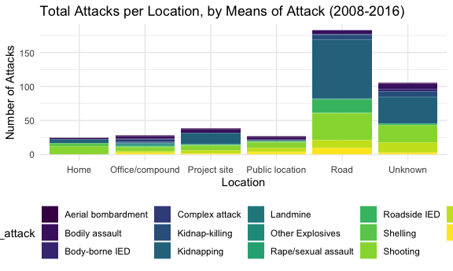
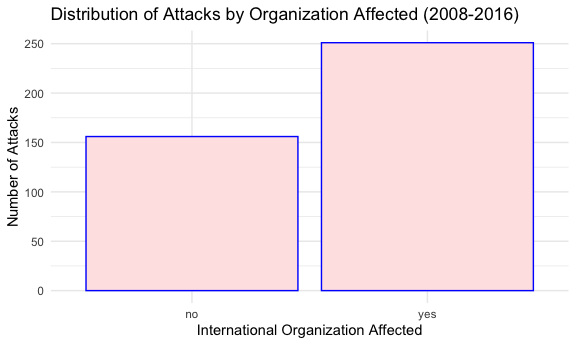
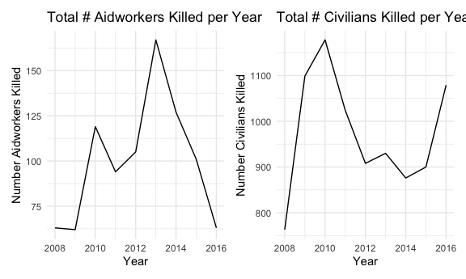

Afghanistan Case Study
================

``` r
library(tidyverse)
library(readxl)
library(p8105.datasets)
library(hexbin)
library(patchwork)
library(leaflet)
library(lubridate)
library(xml2)
library(rvest)
library(plotly)

devtools::install_github("benmarwick/wordcountaddin",  type = "source", dependencies = TRUE)
```

    ## Skipping install of 'wordcountaddin' from a github remote, the SHA1 (8c063135) has not changed since last install.
    ##   Use `force = TRUE` to force installation

``` r
knitr::opts_chunk$set(
  fig.width = 6,
  fig.asp = .6,
  out.width = "90%"
)
theme_set(theme_minimal() + theme(legend.position = "bottom"))
options(
  ggplot2.continuous.colour = "viridis",
  ggplot2.continuous.fill = "viridis"
)
scale_colour_discrete = scale_colour_viridis_d
scale_fill_discrete = scale_fill_viridis_d
```

\#\#Explain

Why we chose Afghanistan… Chose Afghanistan because it has consistently
been among the most deadly countries for aid workers, so would have a
lot of data. Which datasets are being used… Using Aid worker dataset and
the Uppsala datset to compare aidworker deaths to Civilian deaths. We
also intended to use a dataset (SHCC) describing attacks on aidworkers,
health facilities, and healthcare transport, but this datset was not
robust enough to support meaningful data visualization. As such, we
chose to exclude it.

Using the years 2008-2016 because…. and supply code 2008-2016 chosen to
see whether there might be differences between the Bush (2008-2012) and
Obama (2012-2016) administrations.

Aidworker dataset - cleaning and tailoring

``` r
#Kailey notes: from section 1 cleaning and filtered for afghanistan/year

url = "https://aidworkersecurity.org/incidents/search"
aidworker_html = read_html(url)

aidworker_df = 
  aidworker_html %>% 
  html_nodes(css = "table") %>%  
  first() %>% 
  html_table() %>% 
  as_tibble()

afghan_aidworker_df =
  aidworker_df %>%
  janitor::clean_names() %>% 
  select(-source, -verified) %>% 
  rename(year = year_sort_descending) %>% 
  mutate(intl_org_affected = 
           case_when(
             un != 0 ~ "yes",
             ingo != 0 ~ "yes",
             icrc != 0 ~ "yes",
             ifrc != 0 ~ "yes",
             other != 0 ~ "yes",
             lngo_and_nrcs != 0 ~ "no"),
         intl_org_affected = as.factor(intl_org_affected)) %>% 
  relocate(id, month, day, year, country, intl_org_affected) %>% 
  filter(country == "Afghanistan") %>% 
  filter(year %in% c("2008", "2009", "2010", "2011", "2012", "2013", "2014", "2015", "2016")) 
```

## Kailey notes: I found it\! This pivot longer is making the duplicates occur when added to the code chunk above.. also, this date code is not working for me\!

afghan\_aidworker\_df %\>% pivot\_longer( un:other, names\_to =
“org\_type”, values\_to = “number\_orgs\_affected” ) %\>%
select(-number\_orgs\_affected)

Was experimenting with the date conversion here

``` r
# afghan_aidworker_df_new =
#  afghan_aidworker_df%>% 
#  mutate(month = as.numeric(month),
#         day = as.numeric(day),
#         year = as.numeric(year)) %>% view()

#afghan_aidworker_df_new$date = as.Date(paste(afghan_aidworker_df_new$year, afghan_aidworker_df$month, afghan_aidworker_df_new$day, #sep = "-"), "%Y-%m-%d") 
```

pivot\_longer( un:other, names\_to = “org\_type”, values\_to =
“number\_orgs\_affected” ) %\>% select(-number\_orgs\_affected)

aidworker\_df$date \<- as.Date(with(afghan\_aidworker\_df, paste(year,
month, day, sep = “-”)), “%Y-%m-%d”)

## Starting EDA and vis

Internationals vs. nationals killed (Not in the to-do list but has an
interesting spikes and dips; check historical context?)

``` r
#Kailey notes: FINALLY figured this out. got rid of all duplicates and strange number counts.
#Alisha notes: can't get these first few lines of code to run (117-121) so I'm just leaving them out for now...? Are they necessary?

# take code from international (part 1 dataset) - just copy paste and add a filter(country == "Afghanistan")

#afghan_aidw_international_df = 
#  aidworker_df %>%
#  filter(Country == "Afghanistan") %>% 
#  filter(year %in% c("2008", "2009", "2010", "2011", "2012", "2013", "2014", "2015", "2016"))


afghan_aidworker_international_df =
  afghan_aidworker_df %>%
  group_by(year) %>%
  summarise(sum(internationals_killed)) %>%
  mutate(
    internationals_killed_tot = `sum(internationals_killed)`
  ) %>%
  select(year, internationals_killed_tot)
```

    ## `summarise()` ungrouping output (override with `.groups` argument)

``` r
afghan_aidworker_national_df =
  afghan_aidworker_df %>%
  group_by(year) %>%
  summarise(sum(nationals_killed)) %>%
  mutate(
    nationals_killed_tot = `sum(nationals_killed)`
  ) %>%
  select(year, nationals_killed_tot) 
```

    ## `summarise()` ungrouping output (override with `.groups` argument)

``` r
afghan_aidworker_df_new =
  left_join(afghan_aidworker_international_df, afghan_aidworker_national_df, by = "year")


afghan_aidworker_df_new %>%
     ggplot(aes(x = year, y = internationals_killed_tot, col = "International")) +
   geom_line() +
  geom_line(aes(x = year, y = nationals_killed_tot, col = "National")) +
  labs(
    title = "Number of Aidworkers Killed By Origin (National vs. International)",
    x = "Year",
    y = "Number Killed"
  )
```


More visualizations using aidworker df

``` r
# Kailey notes: Not sure if this visualization is 100% complete in terms of making sense/usefulness but I think something like this could be interesting. Subplotted two interactive plots. You can see the means of attack next to the attack context. For example, the aerial bombardment spike in 2015 is tied to combat/crossfire attack type (could look at historical context here). Can also see that in 2009 there were 16 kidnappings due to an ambush. Open to thoughts on this but thought something like this could be cool. 

# Alisha notes: This is great, thank you so much for making this. 


means_attack_p =
afghan_aidworker_df %>%
  plot_ly(
    x = ~year, y = ~total_victims, color = ~means_of_attack,
    type = "scatter") %>%
    layout(
    title = "Victims per year by attack type")

attack_context_p =
afghan_aidworker_df %>%
  plot_ly(
    x = ~year, y = ~total_victims, color = ~attack_context,
    type = "scatter") %>%
    layout(
    title = "Victims per Year by Attack Context")

subplot(means_attack_p, attack_context_p)
```

    ## No scatter mode specifed:
    ##   Setting the mode to markers
    ##   Read more about this attribute -> https://plot.ly/r/reference/#scatter-mode

    ## Warning in RColorBrewer::brewer.pal(N, "Set2"): n too large, allowed maximum for palette Set2 is 8
    ## Returning the palette you asked for with that many colors
    
    ## Warning in RColorBrewer::brewer.pal(N, "Set2"): n too large, allowed maximum for palette Set2 is 8
    ## Returning the palette you asked for with that many colors

    ## No scatter mode specifed:
    ##   Setting the mode to markers
    ##   Read more about this attribute -> https://plot.ly/r/reference/#scatter-mode

<!--html_preserve-->

<div id="htmlwidget-d950278e58b9d4447fcc" class="plotly html-widget" style="width:90%;height:345.6px;">

</div>

<script type="application/json" data-for="htmlwidget-d950278e58b9d4447fcc">{"x":{"data":[{"x":[2008,2009,2013,2015,2016],"y":[4,1,1,49,1],"type":"scatter","mode":"markers","name":"Aerial bombardment","marker":{"color":"rgba(102,194,165,1)","line":{"color":"rgba(102,194,165,1)"}},"textfont":{"color":"rgba(102,194,165,1)"},"error_y":{"color":"rgba(102,194,165,1)"},"error_x":{"color":"rgba(102,194,165,1)"},"line":{"color":"rgba(102,194,165,1)"},"xaxis":"x","yaxis":"y","frame":null},{"x":[2009,2009,2010,2010,2010,2011,2011,2011,2011,2011,2011,2011,2012,2012,2012,2012,2012,2013,2013,2013,2013,2013,2013,2014,2014,2014,2014,2015,2016],"y":[1,1,1,3,1,2,1,1,1,1,2,1,1,1,1,1,2,1,1,2,2,1,1,4,1,1,1,1,1],"type":"scatter","mode":"markers","name":"Bodily assault","marker":{"color":"rgba(199,169,129,1)","line":{"color":"rgba(199,169,129,1)"}},"textfont":{"color":"rgba(199,169,129,1)"},"error_y":{"color":"rgba(199,169,129,1)"},"error_x":{"color":"rgba(199,169,129,1)"},"line":{"color":"rgba(199,169,129,1)"},"xaxis":"x","yaxis":"y","frame":null},{"x":[2008,2009,2012,2013,2013,2013],"y":[1,12,1,1,4,1],"type":"scatter","mode":"markers","name":"Body-borne IED","marker":{"color":"rgba(246,143,106,1)","line":{"color":"rgba(246,143,106,1)"}},"textfont":{"color":"rgba(246,143,106,1)"},"error_y":{"color":"rgba(246,143,106,1)"},"error_x":{"color":"rgba(246,143,106,1)"},"line":{"color":"rgba(246,143,106,1)"},"xaxis":"x","yaxis":"y","frame":null},{"x":[2011,2012,2013,2013,2014],"y":[9,4,4,2,2],"type":"scatter","mode":"markers","name":"Complex attack","marker":{"color":"rgba(195,154,163,1)","line":{"color":"rgba(195,154,163,1)"}},"textfont":{"color":"rgba(195,154,163,1)"},"error_y":{"color":"rgba(195,154,163,1)"},"error_x":{"color":"rgba(195,154,163,1)"},"line":{"color":"rgba(195,154,163,1)"},"xaxis":"x","yaxis":"y","frame":null},{"x":[2008,2008,2008,2008,2010,2011,2011,2011,2011,2013,2013,2013,2014,2015,2015,2015],"y":[2,1,1,1,4,1,1,6,3,5,1,2,1,5,1,2],"type":"scatter","mode":"markers","name":"Kidnap-killing","marker":{"color":"rgba(157,157,202,1)","line":{"color":"rgba(157,157,202,1)"}},"textfont":{"color":"rgba(157,157,202,1)"},"error_y":{"color":"rgba(157,157,202,1)"},"error_x":{"color":"rgba(157,157,202,1)"},"line":{"color":"rgba(157,157,202,1)"},"xaxis":"x","yaxis":"y","frame":null},{"x":[2008,2008,2008,2008,2008,2008,2009,2009,2009,2009,2009,2009,2009,2009,2010,2010,2010,2010,2010,2010,2010,2010,2010,2010,2010,2010,2010,2010,2010,2010,2010,2010,2010,2010,2010,2010,2011,2011,2011,2011,2011,2011,2011,2011,2011,2011,2011,2011,2011,2011,2012,2012,2012,2012,2012,2012,2012,2012,2012,2012,2012,2012,2012,2012,2012,2012,2012,2012,2012,2012,2012,2012,2013,2013,2013,2013,2013,2013,2013,2013,2013,2013,2013,2013,2013,2013,2013,2013,2013,2013,2013,2013,2013,2013,2013,2013,2013,2013,2013,2013,2014,2014,2014,2014,2014,2014,2014,2014,2014,2014,2014,2014,2014,2014,2014,2014,2014,2014,2014,2014,2014,2014,2014,2014,2015,2015,2015,2015,2015,2015,2015,2015,2015,2015,2015,2015,2015,2015,2016,2016,2016,2016,2016,2016,2016,2016,2016,2016,2016,2016,2016,2016],"y":[2,3,2,1,1,1,3,1,2,1,1,1,16,2,3,1,5,2,3,4,2,2,2,2,2,5,4,4,1,2,2,1,1,3,1,1,1,3,2,1,1,3,2,3,1,4,2,3,4,1,1,2,3,1,5,4,2,1,1,2,1,1,1,2,4,4,1,2,1,3,3,5,4,1,1,3,1,1,1,1,10,3,11,2,3,1,3,3,2,2,5,2,1,3,1,3,2,3,1,1,3,1,1,3,2,1,4,1,1,2,1,1,4,1,5,3,7,3,2,1,6,3,1,4,1,3,1,2,1,2,1,3,2,2,1,2,1,2,4,5,7,2,7,1,1,2,1,3,2,1,4,1],"type":"scatter","mode":"markers","name":"Kidnapping","marker":{"color":"rgba(206,146,197,1)","line":{"color":"rgba(206,146,197,1)"}},"textfont":{"color":"rgba(206,146,197,1)"},"error_y":{"color":"rgba(206,146,197,1)"},"error_x":{"color":"rgba(206,146,197,1)"},"line":{"color":"rgba(206,146,197,1)"},"xaxis":"x","yaxis":"y","frame":null},{"x":[2010,2015],"y":[5,1],"type":"scatter","mode":"markers","name":"Landmine","marker":{"color":"rgba(220,159,172,1)","line":{"color":"rgba(220,159,172,1)"}},"textfont":{"color":"rgba(220,159,172,1)"},"error_y":{"color":"rgba(220,159,172,1)"},"error_x":{"color":"rgba(220,159,172,1)"},"line":{"color":"rgba(220,159,172,1)"},"xaxis":"x","yaxis":"y","frame":null},{"x":[2012,2013,2014],"y":[3,3,1],"type":"scatter","mode":"markers","name":"Other Explosives","marker":{"color":"rgba(186,200,114,1)","line":{"color":"rgba(186,200,114,1)"}},"textfont":{"color":"rgba(186,200,114,1)"},"error_y":{"color":"rgba(186,200,114,1)"},"error_x":{"color":"rgba(186,200,114,1)"},"line":{"color":"rgba(186,200,114,1)"},"xaxis":"x","yaxis":"y","frame":null},{"x":[2013],"y":[1],"type":"scatter","mode":"markers","name":"Rape/sexual assault","marker":{"color":"rgba(196,217,74,1)","line":{"color":"rgba(196,217,74,1)"}},"textfont":{"color":"rgba(196,217,74,1)"},"error_y":{"color":"rgba(196,217,74,1)"},"error_x":{"color":"rgba(196,217,74,1)"},"line":{"color":"rgba(196,217,74,1)"},"xaxis":"x","yaxis":"y","frame":null},{"x":[2008,2009,2010,2010,2011,2012,2012,2012,2012,2013,2013,2013,2013,2013,2013,2014,2014,2014,2014,2015,2015,2016],"y":[1,3,3,2,3,1,1,1,1,1,3,2,1,1,1,3,1,3,2,1,1,1],"type":"scatter","mode":"markers","name":"Roadside IED","marker":{"color":"rgba(242,217,54,1)","line":{"color":"rgba(242,217,54,1)"}},"textfont":{"color":"rgba(242,217,54,1)"},"error_y":{"color":"rgba(242,217,54,1)"},"error_x":{"color":"rgba(242,217,54,1)"},"line":{"color":"rgba(242,217,54,1)"},"xaxis":"x","yaxis":"y","frame":null},{"x":[2009,2010,2010,2010,2011,2011,2013,2013,2013],"y":[1,1,4,1,1,3,1,1,1],"type":"scatter","mode":"markers","name":"Shelling","marker":{"color":"rgba(246,209,94,1)","line":{"color":"rgba(246,209,94,1)"}},"textfont":{"color":"rgba(246,209,94,1)"},"error_y":{"color":"rgba(246,209,94,1)"},"error_x":{"color":"rgba(246,209,94,1)"},"line":{"color":"rgba(246,209,94,1)"},"xaxis":"x","yaxis":"y","frame":null},{"x":[2008,2008,2008,2008,2008,2008,2008,2008,2009,2009,2009,2009,2009,2009,2010,2010,2010,2010,2010,2010,2010,2010,2010,2010,2010,2010,2010,2010,2011,2011,2011,2011,2011,2011,2011,2011,2011,2011,2011,2011,2011,2011,2011,2012,2012,2012,2012,2012,2012,2012,2012,2012,2012,2012,2012,2012,2012,2012,2012,2013,2013,2013,2013,2013,2013,2013,2013,2013,2013,2013,2013,2013,2013,2013,2013,2013,2013,2014,2014,2014,2014,2014,2014,2014,2014,2014,2014,2015,2015,2015,2016,2016,2016,2016,2016,2016,2016],"y":[1,1,2,1,5,1,1,1,1,1,1,1,1,1,4,1,1,1,1,2,1,1,2,1,2,1,1,1,1,1,1,3,1,1,1,1,1,1,1,1,1,1,1,1,1,1,1,1,1,2,1,1,1,1,4,1,1,1,1,1,1,1,4,1,1,1,2,1,1,1,1,1,1,4,2,1,7,1,1,1,2,1,1,1,2,1,2,9,1,2,1,2,7,3,1,1,1],"type":"scatter","mode":"markers","name":"Shooting","marker":{"color":"rgba(231,198,142,1)","line":{"color":"rgba(231,198,142,1)"}},"textfont":{"color":"rgba(231,198,142,1)"},"error_y":{"color":"rgba(231,198,142,1)"},"error_x":{"color":"rgba(231,198,142,1)"},"line":{"color":"rgba(231,198,142,1)"},"xaxis":"x","yaxis":"y","frame":null},{"x":[2008,2008,2008,2008,2008,2008,2008,2009,2009,2009,2009,2009,2010,2010,2010,2010,2010,2010,2010,2010,2010,2010,2011,2011,2011,2011,2011,2012,2012,2013,2013,2013,2013,2014,2014,2014,2014,2014,2015],"y":[1,1,12,1,2,6,1,1,1,1,1,5,1,1,1,1,1,10,1,1,1,2,1,1,1,1,1,1,4,3,1,3,2,1,11,6,7,2,3],"type":"scatter","mode":"markers","name":"Unknown","marker":{"color":"rgba(207,188,163,1)","line":{"color":"rgba(207,188,163,1)"}},"textfont":{"color":"rgba(207,188,163,1)"},"error_y":{"color":"rgba(207,188,163,1)"},"error_x":{"color":"rgba(207,188,163,1)"},"line":{"color":"rgba(207,188,163,1)"},"xaxis":"x","yaxis":"y","frame":null},{"x":[2008,2008,2009,2010,2011,2011,2012,2012,2012,2012,2013,2013,2013,2013,2013,2014,2014,2014,2014,2015,2016],"y":[4,1,1,1,3,2,2,2,3,5,2,1,1,1,1,1,2,1,2,1,3],"type":"scatter","mode":"markers","name":"Vehicle-born IED","marker":{"color":"rgba(179,179,179,1)","line":{"color":"rgba(179,179,179,1)"}},"textfont":{"color":"rgba(179,179,179,1)"},"error_y":{"color":"rgba(179,179,179,1)"},"error_x":{"color":"rgba(179,179,179,1)"},"line":{"color":"rgba(179,179,179,1)"},"xaxis":"x","yaxis":"y","frame":null},{"x":[2008,2008,2008,2008,2008,2008,2008,2008,2008,2008,2008,2008,2008,2008,2008,2009,2009,2009,2009,2009,2010,2010,2010,2010,2010,2010,2010,2010,2010,2010,2010,2010,2010,2010,2010,2010,2010,2010,2010,2010,2010,2010,2010,2010,2010,2010,2010,2010,2011,2011,2011,2011,2011,2011,2011,2011,2011,2011,2011,2011,2011,2011,2011,2011,2011,2011,2011,2011,2011,2012,2012,2012,2012,2012,2012,2012,2012,2012,2012,2012,2012,2012,2012,2012,2012,2012,2012,2012,2012,2012,2012,2012,2012,2012,2012,2012,2012,2012,2012,2013,2013,2013,2013,2013,2013,2013,2013,2013,2013,2013,2013,2013,2013,2013,2013,2013,2013,2013,2013,2013,2013,2013,2013,2013,2013,2013,2013,2013,2013,2013,2013,2013,2013,2013,2014,2014,2014,2014,2014,2014,2014,2014,2014,2014,2014,2014,2014,2014,2014,2014,2014,2015,2015,2015,2015,2015,2015,2015,2015,2015,2015,2015,2015,2015,2015,2016,2016,2016,2016,2016,2016,2016,2016,2016,2016,2016,2016],"y":[2,1,12,2,1,2,3,5,1,6,4,1,1,1,1,1,1,1,1,16,5,1,5,1,1,2,4,1,2,2,10,2,5,3,2,1,4,4,1,2,2,1,2,2,3,1,1,1,3,1,1,1,3,3,2,1,1,1,1,3,3,1,2,2,3,2,3,4,1,1,2,1,3,1,1,4,1,1,1,2,1,1,1,2,1,1,4,2,1,3,1,4,4,2,1,1,1,1,3,4,1,1,1,3,1,4,1,1,3,11,3,2,2,1,3,1,3,2,2,1,1,1,1,1,5,2,1,4,3,2,2,7,1,1,3,3,3,1,2,2,1,2,1,6,4,2,5,3,2,3,1,3,1,2,3,1,2,1,3,1,2,1,1,1,2,5,2,7,2,1,3,1,3,1,4,1,1],"type":"scatter","mode":"markers","name":"Ambush","marker":{"color":"rgba(102,194,165,1)","line":{"color":"rgba(102,194,165,1)"}},"textfont":{"color":"rgba(102,194,165,1)"},"error_y":{"color":"rgba(102,194,165,1)"},"error_x":{"color":"rgba(102,194,165,1)"},"line":{"color":"rgba(102,194,165,1)"},"xaxis":"x2","yaxis":"y2","frame":null},{"x":[2008,2008,2009,2009,2009,2009,2010,2010,2010,2011,2011,2011,2011,2011,2011,2011,2011,2012,2012,2012,2012,2012,2012,2013,2013,2013,2013,2013,2013,2013,2013,2013,2014,2014,2015,2015,2016,2016],"y":[4,1,1,1,1,1,1,1,1,1,1,1,1,1,1,1,3,1,1,2,1,1,1,1,1,1,1,1,1,1,2,1,2,1,49,2,1,1],"type":"scatter","mode":"markers","name":"Combat/Crossfire","marker":{"color":"rgba(252,141,98,1)","line":{"color":"rgba(252,141,98,1)"}},"textfont":{"color":"rgba(252,141,98,1)"},"error_y":{"color":"rgba(252,141,98,1)"},"error_x":{"color":"rgba(252,141,98,1)"},"line":{"color":"rgba(252,141,98,1)"},"xaxis":"x2","yaxis":"y2","frame":null},{"x":[2008,2008,2008,2008,2009,2009,2009,2009,2009,2010,2010,2010,2010,2010,2010,2010,2010,2010,2010,2010,2011,2011,2011,2011,2011,2011,2011,2011,2011,2011,2011,2012,2012,2012,2012,2012,2012,2013,2013,2013,2013,2013,2013,2013,2013,2013,2013,2013,2013,2013,2013,2013,2014,2014,2014,2014,2014,2014,2016,2016,2016],"y":[1,1,1,1,1,1,1,1,1,4,1,1,1,1,1,2,1,1,3,1,1,1,1,1,1,1,2,1,1,3,1,1,1,1,1,1,1,1,1,1,1,1,1,1,1,1,2,1,2,1,1,3,1,2,1,1,1,1,1,1,1],"type":"scatter","mode":"markers","name":"Individual attack","marker":{"color":"rgba(141,160,203,1)","line":{"color":"rgba(141,160,203,1)"}},"textfont":{"color":"rgba(141,160,203,1)"},"error_y":{"color":"rgba(141,160,203,1)"},"error_x":{"color":"rgba(141,160,203,1)"},"line":{"color":"rgba(141,160,203,1)"},"xaxis":"x2","yaxis":"y2","frame":null},{"x":[2012,2013],"y":[2,2],"type":"scatter","mode":"markers","name":"Mob violence","marker":{"color":"rgba(231,138,195,1)","line":{"color":"rgba(231,138,195,1)"}},"textfont":{"color":"rgba(231,138,195,1)"},"error_y":{"color":"rgba(231,138,195,1)"},"error_x":{"color":"rgba(231,138,195,1)"},"line":{"color":"rgba(231,138,195,1)"},"xaxis":"x2","yaxis":"y2","frame":null},{"x":[2008,2008,2008,2009,2009,2010,2010,2011,2011,2011,2011,2012,2012,2012,2012,2012,2012,2012,2012,2012,2013,2013,2013,2013,2013,2013,2013,2014,2014,2014,2014,2014,2015,2015,2015,2015,2016,2016,2016,2016,2016],"y":[2,1,1,1,12,1,1,2,1,1,9,1,1,2,5,3,2,4,5,5,1,2,3,1,4,4,3,2,1,1,2,2,1,9,1,1,3,7,7,1,1],"type":"scatter","mode":"markers","name":"Raid","marker":{"color":"rgba(166,216,84,1)","line":{"color":"rgba(166,216,84,1)"}},"textfont":{"color":"rgba(166,216,84,1)"},"error_y":{"color":"rgba(166,216,84,1)"},"error_x":{"color":"rgba(166,216,84,1)"},"line":{"color":"rgba(166,216,84,1)"},"xaxis":"x2","yaxis":"y2","frame":null},{"x":[2008,2008,2008,2008,2008,2008,2009,2009,2009,2009,2009,2009,2009,2009,2009,2009,2010,2010,2010,2010,2010,2010,2010,2010,2010,2010,2010,2010,2010,2011,2011,2011,2011,2011,2011,2011,2012,2012,2012,2012,2013,2013,2013,2013,2013,2013,2013,2013,2013,2013,2013,2013,2013,2013,2014,2014,2014,2014,2014,2014,2014,2014,2014,2014,2014,2014,2014,2014,2014,2014,2014,2014,2014,2014,2014,2014,2014,2014,2015,2015,2015,2015,2015,2015,2015,2016,2016,2016],"y":[1,1,1,1,2,1,3,2,1,1,1,3,2,1,1,5,1,1,3,1,3,4,2,2,4,1,1,2,1,1,1,1,1,6,1,4,1,1,4,3,1,1,10,1,5,1,3,1,1,3,2,2,3,1,4,1,1,1,1,1,1,1,4,1,1,3,1,11,1,1,7,2,1,7,3,1,6,4,5,1,2,1,2,2,1,4,2,2],"type":"scatter","mode":"markers","name":"Unknown","marker":{"color":"rgba(255,217,47,1)","line":{"color":"rgba(255,217,47,1)"}},"textfont":{"color":"rgba(255,217,47,1)"},"error_y":{"color":"rgba(255,217,47,1)"},"error_x":{"color":"rgba(255,217,47,1)"},"line":{"color":"rgba(255,217,47,1)"},"xaxis":"x2","yaxis":"y2","frame":null}],"layout":{"xaxis":{"domain":[0,0.48],"automargin":true,"anchor":"y"},"xaxis2":{"domain":[0.52,1],"automargin":true,"anchor":"y2"},"yaxis2":{"domain":[0,1],"automargin":true,"anchor":"x2"},"yaxis":{"domain":[0,1],"automargin":true,"anchor":"x"},"annotations":[],"shapes":[],"images":[],"margin":{"b":40,"l":60,"t":25,"r":10},"title":"Victims per Year by Attack Context","hovermode":"closest","showlegend":true},"attrs":{"1e8a683d7aad":{"x":{},"y":{},"color":{},"alpha_stroke":1,"sizes":[10,100],"spans":[1,20],"type":"scatter"},"1e8a1c412952":{"x":{},"y":{},"color":{},"alpha_stroke":1,"sizes":[10,100],"spans":[1,20],"type":"scatter"}},"source":"A","config":{"showSendToCloud":false},"highlight":{"on":"plotly_click","persistent":false,"dynamic":false,"selectize":false,"opacityDim":0.2,"selected":{"opacity":1},"debounce":0},"subplot":true,"shinyEvents":["plotly_hover","plotly_click","plotly_selected","plotly_relayout","plotly_brushed","plotly_brushing","plotly_clickannotation","plotly_doubleclick","plotly_deselect","plotly_afterplot","plotly_sunburstclick"],"base_url":"https://plot.ly"},"evals":[],"jsHooks":[]}</script>

<!--/html_preserve-->

``` r
afghan_aidworker_df %>% 
     ggplot(aes(x = location, fill = means_of_attack)) +
   geom_bar() +
  labs(
    title = "Total Attacks per Location, by Means of Attack (2008-2016)",
    x = "Location",
    y = "Number of Attacks"
  ) 
```



``` r
# Alisha notes: love this graph! We'll want to define the time period as well which I'll figure out ASAP. 
```

From section 1 vis:

looking at frequency of attacks on staff of various organizations yes/no

``` r
afghan_aidworker_df %>% 
  ggplot(aes(x = intl_org_affected)) + 
  geom_bar(color = "blue", fill = "#FFE4E4") +
  labs(
    title = "Distribution of Attacks by Organization Affected (2008-2016)",
    x = "International Organization Affected",
    y = "Number of Attacks"
  )
```



International vs National staff attacks?

``` r
af_pct_intl_ntl =
afghan_aidworker_df %>%
  group_by(year) %>%
  summarize(tot_national = sum(total_national_staff),
            tot_intl = sum(total_international_staff),
            tot_both = sum(total_victims),
            pct_intl = (tot_intl/tot_both)*100,
            pct_national = (tot_national/tot_both)*100) %>%
  ggplot(aes(x = year, y = pct_national, col = 3)) +
  geom_line() +
   geom_line(aes(x = year, y = pct_intl, col = 2)) +
   labs(
    x = "Year",
    y = "% Attacked"
   ) 
```

    ## `summarise()` ungrouping output (override with `.groups` argument)

Uppsala data upload and cleaning/tailoring (downloaded data for
Afghanistan only)

``` r
#Looking at deaths among all civilians verses all aidworkers side by side

#Aidworkers, from the Aidworker dataset: 
aidworker_deaths_p = 
afghan_aidworker_df %>% 
  group_by(year) %>% 
  summarise(sum(total_victims)) %>%
  mutate(
    tot_victims = `sum(total_victims)`
  ) %>% 
  select(-`sum(total_victims)`) %>% 
  ggplot(aes(x = year, y = tot_victims)) +
   geom_line() +
  labs(
    title = "Total # Aidworkers Killed per Year",
    x = "Year",
    y = "Number Aidworkers Killed"
  ) 
```

    ## `summarise()` ungrouping output (override with `.groups` argument)

``` r
#All civilians, from the Uppsala dataset:
afghan_upp_df = 
  read_csv("./data/afghanistan_uppsala.csv") %>%
  janitor::clean_names() %>% 
  filter(year %in% c("2008", "2009", "2010", "2011", "2012", "2013", "2014", "2015", "2016")) %>% 
  select(year, deaths_civilians) %>% 
  group_by(year) %>% 
  summarise(sum(deaths_civilians)) %>% 
  mutate(
    deaths_civilians_tot = `sum(deaths_civilians)`
  ) %>% 
  select(-`sum(deaths_civilians)`) 
```

    ## Parsed with column specification:
    ## cols(
    ##   .default = col_double(),
    ##   relid = col_character(),
    ##   active_year = col_logical(),
    ##   code_status = col_character(),
    ##   conflict_name = col_character(),
    ##   dyad_name = col_character(),
    ##   side_a = col_character(),
    ##   side_b = col_character(),
    ##   source_article = col_character(),
    ##   source_office = col_character(),
    ##   source_date = col_character(),
    ##   source_headline = col_character(),
    ##   source_original = col_character(),
    ##   where_coordinates = col_character(),
    ##   where_description = col_character(),
    ##   adm_1 = col_character(),
    ##   adm_2 = col_character(),
    ##   geom_wkt = col_character(),
    ##   country = col_character(),
    ##   region = col_character(),
    ##   date_start = col_character()
    ##   # ... with 1 more columns
    ## )

    ## See spec(...) for full column specifications.

    ## Warning: 33612 parsing failures.
    ## row col   expected     actual                             file
    ##   1  -- 47 columns 48 columns './data/afghanistan_uppsala.csv'
    ##   2  -- 47 columns 48 columns './data/afghanistan_uppsala.csv'
    ##   3  -- 47 columns 48 columns './data/afghanistan_uppsala.csv'
    ##   4  -- 47 columns 48 columns './data/afghanistan_uppsala.csv'
    ##   5  -- 47 columns 48 columns './data/afghanistan_uppsala.csv'
    ## ... ... .......... .......... ................................
    ## See problems(...) for more details.

    ## `summarise()` ungrouping output (override with `.groups` argument)

``` r
civilian_deaths_p =
afghan_upp_df %>% 
  ggplot(aes(x = year, y = deaths_civilians_tot)) +
   geom_line() +
  labs(
    title = "Total # Civilians Killed per Year",
    x = "Year",
    y = "Number Civilians Killed"
)

# use patchwork to make two separate plots and have them side-by-side

aidworker_deaths_p + civilian_deaths_p
```



# Discuss confounders (U.S. administration changes? Troop levels in country? Natural disastor?)
