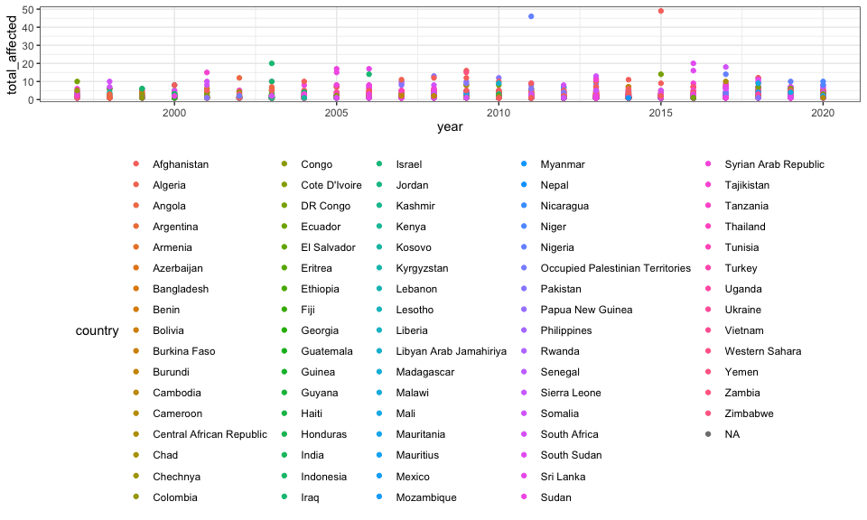

Reading and tidying data
================
E. Brennan Bollman
20-11-25

``` r
library(tidyverse)
```

    ## ── Attaching packages ─────────────────────────────────────────────────────────── tidyverse 1.3.0 ──

    ## ✓ ggplot2 3.3.2     ✓ purrr   0.3.4
    ## ✓ tibble  3.0.3     ✓ dplyr   1.0.2
    ## ✓ tidyr   1.1.2     ✓ stringr 1.4.0
    ## ✓ readr   1.3.1     ✓ forcats 0.5.0

    ## ── Conflicts ────────────────────────────────────────────────────────────── tidyverse_conflicts() ──
    ## x dplyr::filter() masks stats::filter()
    ## x dplyr::lag()    masks stats::lag()

``` r
library(rvest)
```

    ## Loading required package: xml2

    ## 
    ## Attaching package: 'rvest'

    ## The following object is masked from 'package:purrr':
    ## 
    ##     pluck

    ## The following object is masked from 'package:readr':
    ## 
    ##     guess_encoding

``` r
library(httr)
library(readxl)

knitr::opts_chunk$set(
  fig.width = 10,
  fig.asp = 0.6,
  out.width = "90%"
)

theme_set(theme_bw() + theme(legend.position = "bottom")) 

options(
  ggplot2.continuous.colour = "viridis",
  ggplot2.continuous.fill = "viridis"
)

scale_colour_discrete = scale_colour_viridis_d()
scale_fill_discrete = scale_fill_viridis_d()
```

## Aid Worker Security Database

URL: <https://aidworkersecurity.org/incidents> Select: ‘all’ in all
fields to obtain the most complete form of the data Download csv

Note: not sure if we should try to scrape from web to make this more
reproducible.

### Read in data

``` r
aidworker_df = 
  read_csv("data/security_incidents_2020-11-23.csv") %>% 
  janitor::clean_names()
```

    ## Parsed with column specification:
    ## cols(
    ##   .default = col_double(),
    ##   Country = col_character(),
    ##   Region = col_character(),
    ##   District = col_character(),
    ##   City = col_character(),
    ##   `Means of attack` = col_character(),
    ##   `Attack context` = col_character(),
    ##   Location = col_character(),
    ##   `Actor type` = col_character(),
    ##   `Actor name` = col_character(),
    ##   Details = col_character(),
    ##   Verified = col_character(),
    ##   Source = col_character()
    ## )

    ## See spec(...) for full column specifications.

    ## Warning: 3 parsing failures.
    ##  row       col               expected      actual                                     file
    ## 1693 Latitude  no trailing characters , 24.933643 'data/security_incidents_2020-11-23.csv'
    ## 1693 Longitude no trailing characters )           'data/security_incidents_2020-11-23.csv'
    ## 2804 Latitude  no trailing characters ,           'data/security_incidents_2020-11-23.csv'

I think this looks fairly tidy? Each incident\_id is row. There are lots
of variables, but I think mostly will be able to manipulate with
`mutate` and `group_by` in further operations on dataset. Lmk what you
all think.

Data dictionary: <https://aidworkersecurity.org/about>

### Quick EDA

Most deadly countries for aid workers.

``` r
aidworker_df %>%
  group_by(country) %>% 
  summarize(tot_affected_per_country = sum(total_affected, na.rm = TRUE)) %>% 
  mutate(rank = min_rank(desc(tot_affected_per_country))) %>% 
  filter(rank < 6) %>% 
  knitr::kable()
```

    ## `summarise()` ungrouping output (override with `.groups` argument)

| country              | tot\_affected\_per\_country | rank |
| :------------------- | --------------------------: | ---: |
| Afghanistan          |                        1259 |    1 |
| Somalia              |                         515 |    3 |
| South Sudan          |                         581 |    2 |
| Sudan                |                         487 |    4 |
| Syrian Arab Republic |                         462 |    5 |

Means of attack

``` r
aidworker_df %>%
  count(means_of_attack) %>%
  mutate(rank = min_rank(desc(n))) %>% 
  arrange(rank) %>% 
  knitr::kable()
```

| means\_of\_attack   |   n | rank |
| :------------------ | --: | ---: |
| Shooting            | 868 |    1 |
| Kidnapping          | 623 |    2 |
| Bodily assault      | 520 |    3 |
| Unknown             | 413 |    4 |
| Aerial bombardment  | 150 |    5 |
| Kidnap-killing      |  89 |    6 |
| Shelling            |  82 |    7 |
| Vehicle-born IED    |  68 |    8 |
| Roadside IED        |  50 |    9 |
| Other Explosives    |  36 |   10 |
| Landmine            |  29 |   11 |
| Complex attack      |  26 |   12 |
| Rape/sexual assault |  26 |   12 |
| Body-borne IED      |  17 |   14 |

International workers affected

``` r
aidworker_df %>% 
  group_by(country) %>% 
  summarize(tot_intl_per_country = sum(total_internationals, na.rm = TRUE)) %>% 
  mutate(rank = min_rank(desc(tot_intl_per_country))) %>% 
  filter(rank < 6) %>% 
  knitr::kable()
```

    ## `summarise()` ungrouping output (override with `.groups` argument)

| country     | tot\_intl\_per\_country | rank |
| :---------- | ----------------------: | ---: |
| Afghanistan |                     131 |    1 |
| Somalia     |                      90 |    2 |
| South Sudan |                      65 |    3 |
| Sudan       |                      54 |    4 |
| Yemen       |                      35 |    5 |

National workers affected

``` r
aidworker_df %>% 
  group_by(country) %>% 
  summarize(tot_natl_per_country = sum(total_nationals, na.rm = TRUE)) %>% 
  mutate(rank = min_rank(desc(tot_natl_per_country))) %>% 
  filter(rank < 6) %>% 
  knitr::kable()
```

    ## `summarise()` ungrouping output (override with `.groups` argument)

| country              | tot\_natl\_per\_country | rank |
| :------------------- | ----------------------: | ---: |
| Afghanistan          |                    1128 |    1 |
| Somalia              |                     425 |    5 |
| South Sudan          |                     516 |    2 |
| Sudan                |                     433 |    3 |
| Syrian Arab Republic |                     433 |    3 |

Syria per year

``` r
aidworker_df %>% 
  filter(country == "Syrian Arab Republic") %>% 
  group_by(year) %>% 
  summarize(syria_tot_affected = sum(total_affected, na.rm = TRUE)) %>% 
  mutate(rank = min_rank(desc(syria_tot_affected))) %>% 
  arrange(rank) %>% 
  knitr::kable()
```

    ## `summarise()` ungrouping output (override with `.groups` argument)

| year | syria\_tot\_affected | rank |
| ---: | -------------------: | ---: |
| 2019 |                   86 |    1 |
| 2013 |                   70 |    2 |
| 2018 |                   68 |    3 |
| 2020 |                   55 |    4 |
| 2017 |                   53 |    5 |
| 2014 |                   45 |    6 |
| 2016 |                   43 |    7 |
| 2012 |                   25 |    8 |
| 2015 |                   14 |    9 |
| 2011 |                    3 |   10 |

``` r
aidworker_df %>% 
  pivot_longer(
    un:other,
    names_to = "org_type", 
    values_to = "number_orgs_affected"
  ) %>% 
  select(-number_orgs_affected)
```

    ## # A tibble: 17,982 x 34
    ##    incident_id  year month   day country region district city  nationals_killed
    ##          <dbl> <dbl> <dbl> <dbl> <chr>   <chr>  <chr>    <chr>            <dbl>
    ##  1          35  1997    NA    NA <NA>    <NA>   <NA>     <NA>                 1
    ##  2          35  1997    NA    NA <NA>    <NA>   <NA>     <NA>                 1
    ##  3          35  1997    NA    NA <NA>    <NA>   <NA>     <NA>                 1
    ##  4          35  1997    NA    NA <NA>    <NA>   <NA>     <NA>                 1
    ##  5          35  1997    NA    NA <NA>    <NA>   <NA>     <NA>                 1
    ##  6          35  1997    NA    NA <NA>    <NA>   <NA>     <NA>                 1
    ##  7           1  1997     1    NA Cambod… Bante… <NA>     <NA>                 1
    ##  8           1  1997     1    NA Cambod… Bante… <NA>     <NA>                 1
    ##  9           1  1997     1    NA Cambod… Bante… <NA>     <NA>                 1
    ## 10           1  1997     1    NA Cambod… Bante… <NA>     <NA>                 1
    ## # … with 17,972 more rows, and 25 more variables: nationals_wounded <dbl>,
    ## #   nationals_kidnapped <dbl>, total_nationals <dbl>,
    ## #   internationals_killed <dbl>, internationals_wounded <dbl>,
    ## #   internationals_kidnapped <dbl>, total_internationals <dbl>,
    ## #   total_killed <dbl>, total_wounded <dbl>, total_kidnapped <dbl>,
    ## #   total_affected <dbl>, gender_male <dbl>, gender_female <dbl>,
    ## #   gender_unknown <dbl>, means_of_attack <chr>, attack_context <chr>,
    ## #   location <chr>, latitude <dbl>, longitude <dbl>, actor_type <chr>,
    ## #   actor_name <chr>, details <chr>, verified <chr>, source <chr>,
    ## #   org_type <chr>

``` r
aidworker_df
```

    ## # A tibble: 2,997 x 39
    ##    incident_id  year month   day country region district city     un  ingo
    ##          <dbl> <dbl> <dbl> <dbl> <chr>   <chr>  <chr>    <chr> <dbl> <dbl>
    ##  1          35  1997    NA    NA <NA>    <NA>   <NA>     <NA>      0     0
    ##  2           1  1997     1    NA Cambod… Bante… <NA>     <NA>      0     0
    ##  3           2  1997     1    NA Rwanda  North… Musanze  Ruhe…     0     4
    ##  4           3  1997     2    NA Tajiki… <NA>   <NA>     <NA>      4     0
    ##  5           4  1997     2    NA Somalia Lower… Kismayo  Kism…     0     1
    ##  6           5  1997     2    14 Rwanda  Kigali Kigali   Kiga…     1     0
    ##  7           7  1997     5    NA DR Con… <NA>   <NA>     <NA>      0     0
    ##  8           6  1997     5     7 Sierra… <NA>   <NA>     <NA>      3     0
    ##  9          11  1997     6    NA Somalia Gedo   Baardhe… Tulo…     1     0
    ## 10          12  1997     6     8 Rwanda  North… Musanze  Ruhe…     0     1
    ## # … with 2,987 more rows, and 29 more variables: lngo_nrcs <dbl>, icrc <dbl>,
    ## #   ifrc <dbl>, other <dbl>, nationals_killed <dbl>, nationals_wounded <dbl>,
    ## #   nationals_kidnapped <dbl>, total_nationals <dbl>,
    ## #   internationals_killed <dbl>, internationals_wounded <dbl>,
    ## #   internationals_kidnapped <dbl>, total_internationals <dbl>,
    ## #   total_killed <dbl>, total_wounded <dbl>, total_kidnapped <dbl>,
    ## #   total_affected <dbl>, gender_male <dbl>, gender_female <dbl>,
    ## #   gender_unknown <dbl>, means_of_attack <chr>, attack_context <chr>,
    ## #   location <chr>, latitude <dbl>, longitude <dbl>, actor_type <chr>,
    ## #   actor_name <chr>, details <chr>, verified <chr>, source <chr>

``` r
aidworker_df %>% 
  ggplot(aes(x = year, y = total_affected, color = country)) + 
  geom_point()
```



## SHCC dataset - ‘Safeguarding Health in Conflict Coalition’

URL: <https://data.humdata.org/dataset/shcchealthcare-dataset>
Downloaded Afghanistan and Syria 2019 data

### Afghanistan

``` r
afghan_shcc_colnames = 
  read_excel("data/2019-shcc-healthcare-afghanistan-data.xlsx", n_max = 0) %>%
  names()

afghan_shcc_df = 
  read_excel("data/2019-shcc-healthcare-afghanistan-data.xlsx", skip = 2, col_names = afghan_shcc_colnames) %>% 
  janitor::clean_names()
```

### Syria

``` r
syria_shcc_colnames = 
  read_excel("data/2019-shcc-healthcare-syria-data.xlsx", n_max = 0) %>%
  names()

syria_shcc_df = 
  read_excel("data/2019-shcc-healthcare-syria-data.xlsx", skip = 2, col_names = syria_shcc_colnames) %>% 
  janitor::clean_names()
```

``` r
syria_shcc_df %>%
  group_by(country) %>% 
  mutate(tot_hcw_affected = 
           total_health_worker_killed + 
           total_health_worker_kidnapped + 
           total_health_worker_arrested + 
           total_health_worker_injured + 
           total_health_worker_assaulted) %>% 
  count(tot_hcw_affected)
```

    ## # A tibble: 1 x 3
    ## # Groups:   country [1]
    ##   country tot_hcw_affected     n
    ##   <chr>              <dbl> <int>
    ## 1 Syria                 NA   146

## Upsala dataset

``` r
ucdp_df = 
  GET("https://ucdpapi.pcr.uu.se/api/gedevents/20.1?pagesize=1&page=1") %>% 
  content("text") %>% 
  jsonlite::fromJSON() %>% 
  as_tibble()
```

``` r
ucdp_onsided_df = 
  read_csv("data/ucdp-onesided-201.csv")
```

    ## Parsed with column specification:
    ## cols(
    ##   conflict_id = col_double(),
    ##   dyad_id = col_double(),
    ##   actor_id = col_double(),
    ##   coalition_components = col_character(),
    ##   actor_name = col_character(),
    ##   actor_name_fulltext = col_character(),
    ##   actor_name_mothertongue = col_character(),
    ##   year = col_double(),
    ##   best_fatality_estimate = col_double(),
    ##   low_fatality_estimate = col_double(),
    ##   high_fatality_estimate = col_double(),
    ##   is_government_actor = col_double(),
    ##   location = col_character(),
    ##   gwno_location = col_character(),
    ##   gwnoa = col_double(),
    ##   region = col_character(),
    ##   version = col_double()
    ## )

``` r
ucdp_onsided_df %>% 
  filter(location == "Syria") %>% 
  select(year, actor_name, best_fatality_estimate, low_fatality_estimate, high_fatality_estimate, is_government_actor) %>% 
  arrange(year)
```

    ## # A tibble: 15 x 6
    ##     year actor_name best_fatality_e… low_fatality_es… high_fatality_e…
    ##    <dbl> <chr>                 <dbl>            <dbl>            <dbl>
    ##  1  2012 Syrian in…              140              140              209
    ##  2  2013 Syrian in…              225              186              237
    ##  3  2013 PYD                      25               25               25
    ##  4  2013 IS, Syria…              207              165              226
    ##  5  2013 Governmen…              718              623              734
    ##  6  2014 Syrian in…              303              289              317
    ##  7  2014 PYD                      87               87               98
    ##  8  2014 Governmen…              132              125              164
    ##  9  2015 Syrian in…              119              119              135
    ## 10  2015 Governmen…               39               39               56
    ## 11  2016 Syrian in…               32               31               32
    ## 12  2016 Governmen…               37               29               37
    ## 13  2017 Governmen…               65               65               67
    ## 14  2018 Syrian in…               54               54               57
    ## 15  2019 Syrian in…               62               62               77
    ## # … with 1 more variable: is_government_actor <dbl>

``` r
ucdp_onsided_df %>% 
  filter(location == "Afghanistan") %>% 
  select(year, actor_name, best_fatality_estimate, low_fatality_estimate, high_fatality_estimate, is_government_actor) %>% 
  arrange(year)
```

    ## # A tibble: 23 x 6
    ##     year actor_name best_fatality_e… low_fatality_es… high_fatality_e…
    ##    <dbl> <chr>                 <dbl>            <dbl>            <dbl>
    ##  1  1993 Governmen…               26               26              240
    ##  2  1996 Taleban                  42               12               42
    ##  3  1997 Governmen…              323              323              323
    ##  4  1998 Governmen…             5801             3731             7381
    ##  5  1999 Governmen…              436              436              912
    ##  6  2000 Governmen…              152              152              152
    ##  7  2001 Governmen…              298              298             1077
    ##  8  2001 UIFSA                   200              200             1000
    ##  9  2004 Taleban                  53               51               69
    ## 10  2006 Taleban                 196              194              253
    ## # … with 13 more rows, and 1 more variable: is_government_actor <dbl>

Does not seem terribly useful?

## Armed Conflict Location & Event Data Project (ACLED)

Afghanistan data here:
<https://data.humdata.org/dataset/acled-data-for-afghanistan>

``` r
afghan_acled_df = 
  read_csv("data/conflict_data_afg.csv")
```

    ## Parsed with column specification:
    ## cols(
    ##   .default = col_character(),
    ##   data_id = col_double(),
    ##   iso = col_double(),
    ##   event_id_no_cnty = col_double(),
    ##   time_precision = col_double(),
    ##   inter1 = col_double(),
    ##   inter2 = col_double(),
    ##   interaction = col_double(),
    ##   geo_precision = col_double(),
    ##   timestamp = col_double()
    ## )

    ## See spec(...) for full column specifications.
