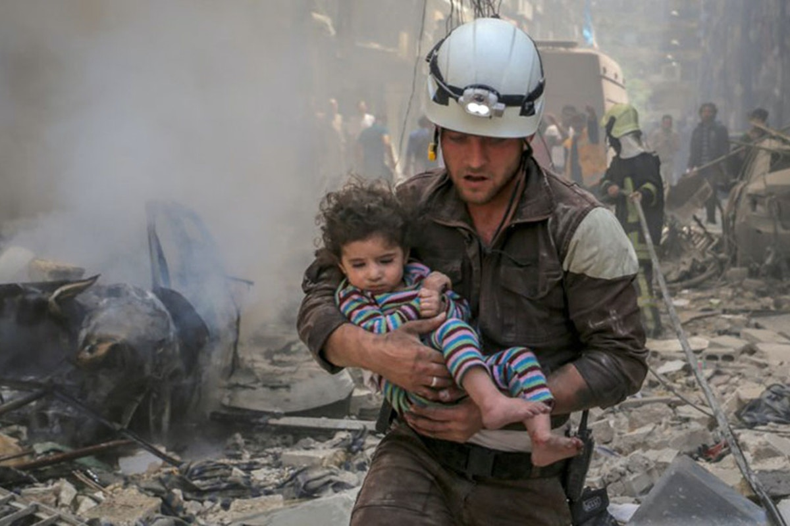

Attacks on aid workers have been steadily increasing since 1997, particularly among national staff. In all but one of world's five most deadly countries for aid workers (Afghanistan, South Sudan, Syria, Somalia, and Sudan), a higher percentage of aid workers killed are comprised of national staff members. Our exploratory analysis demonstrates that additional research is needed on the factors that increase national staff vulnerability to attacks. 

White Helmets, via The Intercept 

Our interactive dashboard shows that ....

Importantly, aid workers are now on the frontline of the COVID-19 pandemic response in conflict-affected countries. A recent article in the Lancet suggests that violence against health workers in fragile settings will likely be exacerbated by the COVID-19 pandemic, and that national workers will be particularly vulnerable. 

