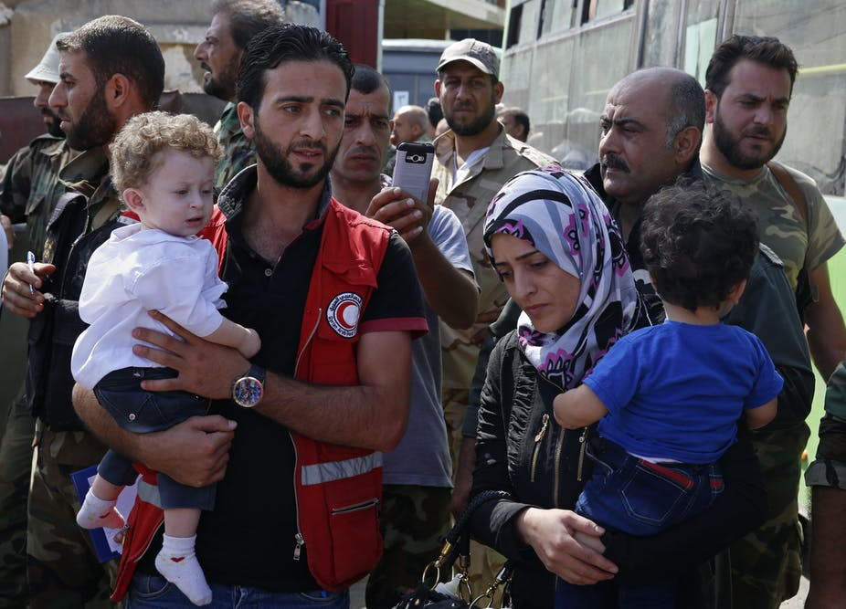

Ambulance attack, via ICRC

## Motivation

In recent decades, attacks on aid workers in complex crises have been steadily increasing, with a recorded 483 workers killed, kidnapped, or wounded in 2019. We are interested in understanding changes in the risk associated with humanitarian action in different geographic contexts and over time using several key comprehensive databases. 

Our analysis focuses on the Aid Worker Security Database (AWSD, via Humanitarian Outcomes organization): which has collected data on attacks against humanitarian aid workers globally since 1997. Additional information related to country violence comes from Safeguarding Health in Conflict Coalition (SHCC) and Uppsala Conflict Data Program (UCDP). These data are used to assess the relationship between aid worker attacks and conflict intensity, conflict actors (state vs. non-state actors), and aid worker characteristics (national vs. international, type of organization). 

A closer focus on Afghanistan allows for a closer look at one of the most violent settings identified in the various databases used for global-level analysis. 

 
## What You'll Find In This Website

 * Stratified analyses of global trends in violence against aid workers
 * A case study of Afghanistan, in which multiple environmental factors are examined in conjunction with violence against aid workers
 * A full report detailing our process (here)
 * A screencast walking you through this website (here)

