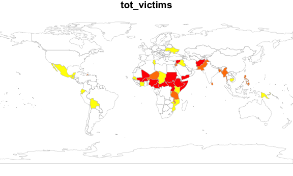
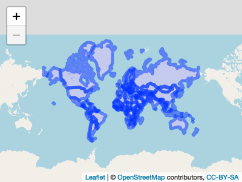

Map Development
================

This document contains the code used to work through creating maps of
the data.

``` r
library(tidyverse)
library(dplyr)
library(patchwork)
library(leaflet)
library(lubridate)
library(rvest)
library(httr)
library(flexdashboard)
library(plotly)
library(viridis)
library(stringr)
library(maps)
library(corrplot)
library(rworldmap)

knitr::opts_chunk$set(
  fig.width = 6,
  fig.asp = .6,
  out.width = "90%"
)
theme_set(theme_minimal() + theme(legend.position = "bottom"))
options(
  ggplot2.continuous.colour = "viridis",
  ggplot2.continuous.fill = "viridis"
)
scale_colour_discrete = scale_colour_viridis_d
scale_fill_discrete = scale_fill_viridis_d
```

## Data import and tidying

``` r
url = "https://aidworkersecurity.org/incidents/search"
aidworker_html = read_html(url)

aidworker_df = 
  aidworker_html %>% 
  html_nodes(css = "table") %>%  
  first() %>% 
  html_table() %>% 
  as_tibble()

aidworker_df =
  aidworker_df %>%
  janitor::clean_names() %>% 
  select(-source, -verified) %>% 
  rename(year = year_sort_descending) %>% 
  mutate(intl_org_affected = 
           case_when(
             un != 0 ~ "yes",
             ingo != 0 ~ "yes",
             icrc != 0 ~ "yes",
             ifrc != 0 ~ "yes",
             other != 0 ~ "yes",
             lngo_and_nrcs != 0 ~ "no"),
         intl_org_affected = as.factor(intl_org_affected)) %>% 
  mutate(
    latitude = as.numeric(latitude),
    longitude = as.numeric(longitude)
    ) %>% 
  relocate(id, month, day, year, country, intl_org_affected)
```

    ## Warning: Problem with `mutate()` input `latitude`.
    ## ℹ NAs introduced by coercion
    ## ℹ Input `latitude` is `as.numeric(latitude)`.

    ## Warning in mask$eval_all_mutate(dots[[i]]): NAs introduced by coercion

    ## Warning: Problem with `mutate()` input `longitude`.
    ## ℹ NAs introduced by coercion
    ## ℹ Input `longitude` is `as.numeric(longitude)`.

    ## Warning in mask$eval_all_mutate(dots[[i]]): NAs introduced by coercion

``` r
empty_as_na <- function(x){
    if("factor" %in% class(x)) x <- as.character(x) 
    ifelse(as.character(x) != "", x, NA)
}

aidworker_df = 
aidworker_df %>% mutate_each(funs(empty_as_na)) 
```

``` r
global_map_df = 
  aidworker_df %>% 
  mutate(
    kidnapping = case_when(means_of_attack %in% c("Kidnapping", "Kidnap-killing") ~ 1),
    shooting = case_when(means_of_attack %in% c("Shooting") ~ 1),
    assault = case_when(means_of_attack %in% c("Bodily assault", "Rape/sexual assault") ~ 1),
    explosive = case_when(means_of_attack %in% c("Aerial bombardment", "Landmine", "Other Explosives", "Roadside IED",
                                                 "Shelling", "Vehicle-born IED") ~ 1)) %>% 
  drop_na(year) %>% 
  group_by(country, year) %>% 
  summarize(
            number_incidents = n(),
            tot_national = sum(total_national_staff),
            tot_intl = sum(total_international_staff),
            tot_victims = sum(total_victims),
            tot_kidnappings = sum(kidnapping, na.rm = TRUE),
            tot_shootings = sum(shooting, na.rm = TRUE),
            tot_assault = sum(assault, na.rm = TRUE),
            tot_explosive = sum(explosive, na.rm = TRUE)) %>% 
  drop_na(country)
```

    ## `summarise()` regrouping output by 'country' (override with `.groups` argument)

Hey team - so I found a pacakge called `rworldmap`. You can access
useful information about how to use the package by calling
`vignette("rworldmap")`.

``` r
global_map_df %>% 
joinCountryData2Map(
  joinCode = "NAME",
  nameJoinColumn = "country",
  verbose = TRUE
  )
```

    ## 472 codes from your data successfully matched countries in the map
    ## 53 codes from your data failed to match with a country code in the map
    ##       failedCodes failedCountries                   
    ##  [1,] NA          "Chechnya"                        
    ##  [2,] NA          "Chechnya"                        
    ##  [3,] NA          "Chechnya"                        
    ##  [4,] NA          "Chechnya"                        
    ##  [5,] NA          "Chechnya"                        
    ##  [6,] NA          "Chechnya"                        
    ##  [7,] NA          "Chechnya"                        
    ##  [8,] NA          "Chechnya"                        
    ##  [9,] NA          "Chechnya"                        
    ## [10,] NA          "DR Congo"                        
    ## [11,] NA          "DR Congo"                        
    ## [12,] NA          "DR Congo"                        
    ## [13,] NA          "DR Congo"                        
    ## [14,] NA          "DR Congo"                        
    ## [15,] NA          "DR Congo"                        
    ## [16,] NA          "DR Congo"                        
    ## [17,] NA          "DR Congo"                        
    ## [18,] NA          "DR Congo"                        
    ## [19,] NA          "DR Congo"                        
    ## [20,] NA          "DR Congo"                        
    ## [21,] NA          "DR Congo"                        
    ## [22,] NA          "DR Congo"                        
    ## [23,] NA          "DR Congo"                        
    ## [24,] NA          "DR Congo"                        
    ## [25,] NA          "DR Congo"                        
    ## [26,] NA          "DR Congo"                        
    ## [27,] NA          "DR Congo"                        
    ## [28,] NA          "DR Congo"                        
    ## [29,] NA          "DR Congo"                        
    ## [30,] NA          "DR Congo"                        
    ## [31,] NA          "DR Congo"                        
    ## [32,] NA          "Kashmir"                         
    ## [33,] NA          "Libyan Arab Jamahiriya"          
    ## [34,] NA          "Libyan Arab Jamahiriya"          
    ## [35,] NA          "Libyan Arab Jamahiriya"          
    ## [36,] NA          "Libyan Arab Jamahiriya"          
    ## [37,] NA          "Libyan Arab Jamahiriya"          
    ## [38,] NA          "Libyan Arab Jamahiriya"          
    ## [39,] NA          "Libyan Arab Jamahiriya"          
    ## [40,] NA          "Libyan Arab Jamahiriya"          
    ## [41,] NA          "Libyan Arab Jamahiriya"          
    ## [42,] NA          "Occupied Palestinian Territories"
    ## [43,] NA          "Occupied Palestinian Territories"
    ## [44,] NA          "Occupied Palestinian Territories"
    ## [45,] NA          "Occupied Palestinian Territories"
    ## [46,] NA          "Occupied Palestinian Territories"
    ## [47,] NA          "Occupied Palestinian Territories"
    ## [48,] NA          "Occupied Palestinian Territories"
    ## [49,] NA          "Occupied Palestinian Territories"
    ## [50,] NA          "Occupied Palestinian Territories"
    ## [51,] NA          "Occupied Palestinian Territories"
    ## [52,] NA          "Occupied Palestinian Territories"
    ## [53,] NA          "Occupied Palestinian Territories"
    ## 167 codes from the map weren't represented in your data

So, Chechnya, DR Congo, Kashmir, Libyan Arab Jamahiriya, Occupied
Palestinian Territories are in our df, but not in the map. As per the
reasons outlined in part\_1.RMD, I think we should drop Kashmir (only 1
incident) and recode Chechnya as Russia (we have no other data in
Russia), and make a note. We could try recoding the other countries with
other names for them and see if they end up matching up.

``` r
joined_map = 
  global_map_df %>%
  filter(year == "2019") %>% 
joinCountryData2Map(
  joinCode = "NAME",
  nameJoinColumn = "country",
  verbose = TRUE
  )
```

    ## 38 codes from your data successfully matched countries in the map
    ## 3 codes from your data failed to match with a country code in the map
    ##      failedCodes failedCountries                   
    ## [1,] NA          "DR Congo"                        
    ## [2,] NA          "Libyan Arab Jamahiriya"          
    ## [3,] NA          "Occupied Palestinian Territories"
    ## 205 codes from the map weren't represented in your data

``` r
par(mai =c (0,0,0.2,0), xaxs = "i", yaxs = "i")
glob_map = mapCountryData(joined_map, nameColumnToPlot = "tot_victims", addLegend = FALSE)
```

    ## You asked for 7 quantiles, only 3 could be created in quantiles classification



It worked\!\!\!\! I think? Can filter by year (manually in the code).
Concerned that the documentation specifies that the df that should be
merged to the map should only have one country per line. Also, we’re
missing important countries that didn’t exist on the underlying map
(Palestine, Libya, DR Congo). I think we need to find out how they’re
stored in the underlying map so that we can recode the country names in
our df before merging.

``` r
joined_map$country %>% 
  view()

view(countrySynonyms)

global_map_df$country =
  recode(global_map_df$country,
         'Chechnya' = 'Russia',
         'DR Congo' = 'Democratic Republic of the Congo',
         'Syria' = 'Syrian Arab Republic',
         'Libyan Arab Jamahiriya' = 'Libya',
         'Occupied Palestinian Territories' = 'Occupied Palestinian Territory')

global_map_df =
  global_map_df %>% 
  filter(country != "Kashmir")
```

First I tried to view the list of countries once merged. It appears to
only show the countries from our DF.

Then I found that the `rworldmap` package has a df with a list of
synonyms for the countries it includes. I pulled up the df and searched
for the five countries that did not match, to see how they are referred
to by the `rworldmap` package.

Now I’m going to go back and try merging with the new df with tidied /
matched names. I ran the code and found 0 failed codes. Yay\! We’ve
matched. Next steps involve confirming that we can match multiple rows
of data with the same country.

``` r
map_world = map_data("world")

map_world$region =
  recode(map_world$region,
         'Ivory Coast' = 'Cote D\'Ivoire',
         'Syria' = 'Syrian Arab Republic'
         )

global_map_df$country =
  recode(global_map_df$country,
         'Occupied Palestinian Territories' = 'Palestine',
         'DR Congo' = 'Democratic Republic of the Congo',
         'Congo' = 'Republic of Congo',
         'Libyan Arab Jamahiriya' = 'Libya',
         'Chechnya' = 'Russia'
         )

global_map_df =
  global_map_df %>% 
  filter(country != "Kashmir")

map_world =
  map_world %>% 
  rename(country = region)

global_map_df_2019 =
  global_map_df %>% 
  filter(year == "2019")

joined_map_2019 =
  left_join(map_world, global_map_df_2019) %>% 
  mutate(polygon_fill = ifelse(is.na(tot_victims), F, T))
```

    ## Joining, by = "country"

``` r
ggplot() +
  geom_polygon(data = joined_map_2019, aes(x = long, y = lat, group = group, fill = polygon_fill))
```


After working through all this…if we want the map to be interactive
(labels showing our data, etc.) I think we need to stick with `leaflet`.
We can utilize a polygon layer in `leaflet`…I downloaded a geojson file,
map of the world, from <https://geojson-maps.ash.ms/>

``` r
countries = geojsonio::geojson_read("./data/custom.geo.json", what = "sp")

main_map = leaflet(countries) %>% 
  addTiles() %>% 
  addPolygons()

main_map
```



The above imposes polygons on the map. This is good. I think we can play
around with the size of the outlines, as well as the fill.

What will take a decent amount of work is mapping our data onto this
map. (1) Need to compare names again to figure out how to merge? What
names to update so we have a common variable to join on. (2) Think we
may also have a problem with having countries being listed multiple
times in our df (our observations are aggregated attacks within a
country per year, not only per country). Make a function that plots
individual data frames per year?

``` r
names(countries)
```

    ##  [1] "scalerank"  "featurecla" "labelrank"  "sovereignt" "sov_a3"    
    ##  [6] "adm0_dif"   "level"      "type"       "admin"      "adm0_a3"   
    ## [11] "geou_dif"   "geounit"    "gu_a3"      "su_dif"     "subunit"   
    ## [16] "su_a3"      "brk_diff"   "name"       "name_long"  "brk_a3"    
    ## [21] "brk_name"   "brk_group"  "abbrev"     "postal"     "formal_en" 
    ## [26] "formal_fr"  "note_adm0"  "note_brk"   "name_sort"  "name_alt"  
    ## [31] "mapcolor7"  "mapcolor8"  "mapcolor9"  "mapcolor13" "pop_est"   
    ## [36] "gdp_md_est" "pop_year"   "lastcensus" "gdp_year"   "economy"   
    ## [41] "income_grp" "wikipedia"  "fips_10"    "iso_a2"     "iso_a3"    
    ## [46] "iso_n3"     "un_a3"      "wb_a2"      "wb_a3"      "woe_id"    
    ## [51] "adm0_a3_is" "adm0_a3_us" "adm0_a3_un" "adm0_a3_wb" "continent" 
    ## [56] "region_un"  "subregion"  "region_wb"  "name_len"   "long_len"  
    ## [61] "abbrev_len" "tiny"       "homepart"   "filename"

``` r
view(countries$name)

x =
  global_map_df$country %>% 
  unique()

y =
  countries$name %>% 
  unique()

x %in% y
```

    ##  [1]  TRUE  TRUE  TRUE  TRUE  TRUE  TRUE  TRUE  TRUE  TRUE  TRUE  TRUE  TRUE
    ## [13]  TRUE FALSE  TRUE  TRUE  TRUE FALSE FALSE FALSE  TRUE  TRUE  TRUE  TRUE
    ## [25]  TRUE  TRUE  TRUE  TRUE  TRUE  TRUE  TRUE  TRUE  TRUE  TRUE  TRUE  TRUE
    ## [37]  TRUE  TRUE  TRUE  TRUE  TRUE  TRUE  TRUE  TRUE  TRUE  TRUE  TRUE FALSE
    ## [49]  TRUE  TRUE  TRUE  TRUE  TRUE  TRUE  TRUE FALSE  TRUE  TRUE  TRUE  TRUE
    ## [61]  TRUE  TRUE  TRUE  TRUE FALSE  TRUE  TRUE FALSE  TRUE  TRUE  TRUE  TRUE
    ## [73]  TRUE  TRUE  TRUE  TRUE FALSE  TRUE  TRUE  TRUE

``` r
discrepancy = x[which(!(x %in% y))]

discrepancy
```

    ## [1] "Central African Republic"         "Republic of Congo"               
    ## [3] "Cote D'Ivoire"                    "Democratic Republic of the Congo"
    ## [5] "Mauritius"                        "Occupied Palestinian Territory"  
    ## [7] "South Sudan"                      "Syrian Arab Republic"            
    ## [9] "Western Sahara"

``` r
global_map_df$country =
  recode(global_map_df$country,
         'Central African Republic' = 'Central African Rep.',
         'Republic of Congo' = 'Congo',
         'Cote D\'Ivoire' = 'Côte d\'Ivoire',
         'Democratic Republic of the Congo' = 'Dem. Rep. Congo',
         'Occupied Palestinian Territory' = 'Palestine',
         'South Sudan' = 'S. Sudan',
         'Syrian Arab Republic' = 'Syria',
         'Western Sahara' = 'W. Sahara'
         )

global_map_df =
  global_map_df %>% 
  filter(country != "Mauritius")

global_map_df =
  global_map_df %>% 
  rename(name = country)
```

Mauritius was dropped. Only 1 attack. Will need to make note of in our
final dashboard.

Next steps: \* figure out how to match our df with polygons \*
aesthetics of polygons - fix (lines too wide) \* write function to match
df (for each YEAR) with polygons - this is what will be called in the
shiny app \* popups for hovering over each country \* move back to the
map dashboard document to work in shiny\!
