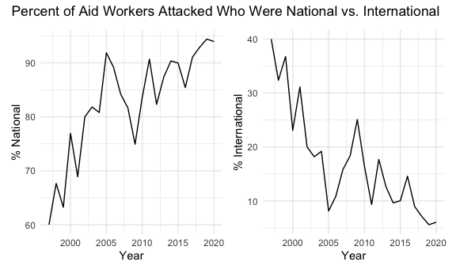

Section 1
================
Natalie Boychuk, E. Brennan Bollman, Emily Bamforth, Alisha Sarakki, and
Kailey Rishovd
11/26/2020

This document is a working draft of section 1 of our final report, which
will focus on global levels of violence against aid workers.

``` r
library(tidyverse)
```

    ## ── Attaching packages ─────────────────────────────────────────────────────────── tidyverse 1.3.0 ──

    ## ✓ ggplot2 3.3.2     ✓ purrr   0.3.4
    ## ✓ tibble  3.0.3     ✓ dplyr   1.0.2
    ## ✓ tidyr   1.1.2     ✓ stringr 1.4.0
    ## ✓ readr   1.3.1     ✓ forcats 0.5.0

    ## ── Conflicts ────────────────────────────────────────────────────────────── tidyverse_conflicts() ──
    ## x dplyr::filter() masks stats::filter()
    ## x dplyr::lag()    masks stats::lag()

``` r
library(dplyr)
library(patchwork)
library(leaflet)
library(lubridate)
```

    ## 
    ## Attaching package: 'lubridate'

    ## The following objects are masked from 'package:base':
    ## 
    ##     date, intersect, setdiff, union

``` r
library(rvest)
```

    ## Loading required package: xml2

    ## 
    ## Attaching package: 'rvest'

    ## The following object is masked from 'package:purrr':
    ## 
    ##     pluck

    ## The following object is masked from 'package:readr':
    ## 
    ##     guess_encoding

``` r
library(httr)
devtools::install_github("benmarwick/wordcountaddin",  type = "source", dependencies = TRUE)
```

    ## Skipping install of 'wordcountaddin' from a github remote, the SHA1 (8c063135) has not changed since last install.
    ##   Use `force = TRUE` to force installation

``` r
knitr::opts_chunk$set(
  fig.width = 6,
  fig.asp = .6,
  out.width = "90%"
)
theme_set(theme_minimal() + theme(legend.position = "bottom"))
options(
  ggplot2.continuous.colour = "viridis",
  ggplot2.continuous.fill = "viridis"
)
scale_colour_discrete = scale_colour_viridis_d
scale_fill_discrete = scale_fill_viridis_d
```

## Data import and tidying

``` r
url = "https://aidworkersecurity.org/incidents/search"
aidworker_html = read_html(url)

aidworker_df = 
  aidworker_html %>% 
  html_nodes(css = "table") %>%  
  first() %>% 
  html_table() %>% 
  as_tibble()

aidworker_df = 
distinct(aidworker_df) 

aidworker_tidy_df =
  aidworker_df %>% 
  janitor::clean_names() %>% 
  mutate(intl_org_affected = 
           case_when(
             un != 0 ~ "yes",
             ingo != 0 ~ "yes",
             icrc != 0 ~ "yes",
             ifrc != 0 ~ "yes",
             other != 0 ~ "yes",
             lngo_and_nrcs != 0 ~ "no"
           ),
         intl_org_affected = as.factor(intl_org_affected)) %>% 
  rename(year = year_sort_descending) %>% 
  select(-source, -verified) %>% 
  relocate(id, month, day, year, country, intl_org_affected)
```

Brennan notes:

\*why did we use distinct here?

  - I think this `case_when` approach works to identify whether an
    international org was affected, instead of the pivot idea.
    Otherwise, I agree with Natalie that there’s no way to do it without
    making 6 copies of each incident. The existing data already seems to
    be the clearest way to present the number of people from each type
    of org affected, and we can plot that.

  - if happy with cleaning, we can rename the `aidworker_tidy_df` as
    just `aidworker_df`

## EDA of Attack patterns: International vs National

### Look at frequency of attacks on various types of organizations

``` r
aidworker_tidy_df %>% 
  ggplot(aes(x = intl_org_affected)) + 
  geom_bar()
```


Brennan: I’m stuck on this part. Natalie - you were thinking about it
conceptually a lot, any ideas?

### International vs National staff attacks

``` r
aidworker_tidy_df %>%
  group_by(year) %>% 
  summarize(tot_national = sum(total_national_staff),
            tot_intl = sum(total_international_staff),
            tot_both = sum(total_victims),
            pct_intl = (tot_intl/tot_both)*100,
            pct_national = (tot_national/tot_both)*100) %>%
  knitr::kable()
```

    ## `summarise()` ungrouping output (override with `.groups` argument)

| year | tot\_national | tot\_intl | tot\_both | pct\_intl | pct\_national |
| ---: | ------------: | --------: | --------: | --------: | ------------: |
| 1997 |            45 |        30 |        75 | 40.000000 |      60.00000 |
| 1998 |            46 |        22 |        68 | 32.352941 |      67.64706 |
| 1999 |            43 |        25 |        68 | 36.764706 |      63.23529 |
| 2000 |            70 |        21 |        91 | 23.076923 |      76.92308 |
| 2001 |            62 |        28 |        90 | 31.111111 |      68.88889 |
| 2002 |            68 |        17 |        85 | 20.000000 |      80.00000 |
| 2003 |           117 |        26 |       143 | 18.181818 |      81.81818 |
| 2004 |           101 |        24 |       125 | 19.200000 |      80.80000 |
| 2005 |           158 |        14 |       172 |  8.139535 |      91.86047 |
| 2006 |           214 |        26 |       240 | 10.833333 |      89.16667 |
| 2007 |           186 |        35 |       221 | 15.837104 |      84.16290 |
| 2008 |           227 |        51 |       278 | 18.345324 |      81.65468 |
| 2009 |           221 |        74 |       295 | 25.084746 |      74.91525 |
| 2010 |           209 |        41 |       250 | 16.400000 |      83.60000 |
| 2011 |           282 |        29 |       311 |  9.324759 |      90.67524 |
| 2012 |           228 |        49 |       277 | 17.689531 |      82.31047 |
| 2013 |           415 |        60 |       475 | 12.631579 |      87.36842 |
| 2014 |           300 |        32 |       332 |  9.638554 |      90.36145 |
| 2015 |           260 |        29 |       289 | 10.034602 |      89.96540 |
| 2016 |           252 |        43 |       295 | 14.576271 |      85.42373 |
| 2017 |           285 |        28 |       313 |  8.945687 |      91.05431 |
| 2018 |           379 |        29 |       408 |  7.107843 |      92.89216 |
| 2019 |           456 |        27 |       483 |  5.590062 |      94.40994 |
| 2020 |           264 |        17 |       281 |  6.049822 |      93.95018 |
|   NA |          4888 |       777 |      5665 | 13.715799 |      86.28420 |

``` r
## If look at last row of data, appears "NA" is the total

aidworker_tidy_df %>%
  group_by(year) %>% 
  summarize(tot_national = sum(total_national_staff),
            tot_intl = sum(total_international_staff),
            tot_both = sum(total_victims),
            pct_intl = (tot_intl/tot_both)*100,
            pct_national = (tot_national/tot_both)*100) %>% 
  ggplot(aes(x = year, y = pct_national)) + 
  geom_line()
```

    ## `summarise()` ungrouping output (override with `.groups` argument)

    ## Warning: Removed 1 row(s) containing missing values (geom_path).



Roughly this shows that proportions of nationals attacked has always
been higher than internationals, with increasing percentage of national
staff attacked over time.

``` r
aidworker_tidy_df %>% 
  group_by(year) %>% 
   summarize(tot_national = sum(total_national_staff),
            tot_intl = sum(total_international_staff),
            tot_both = sum(total_victims)) %>% 
  ggplot(aes(x = year)) + 
  geom_line(aes(y = tot_national, color = "National Staff")) + 
  geom_line(aes(y = tot_intl, color = "International Staff")) + 
  ylim(0, 500) + 
  labs(title = "Aid Worker Attacks over time",
       x = "Year",
       y = "Number of Aid Workers Attacked")
```

    ## `summarise()` ungrouping output (override with `.groups` argument)

    ## Warning: Removed 1 row(s) containing missing values (geom_path).
    
    ## Warning: Removed 1 row(s) containing missing values (geom_path).


Number of aid worker attacks are increasing over time, especially among
national staff.
