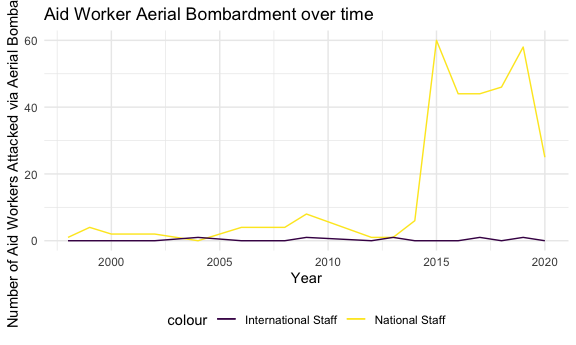

Section 1
================
Natalie Boychuk, E. Brennan Bollman, Emily Bamforth, Alisha Sarakki, and
Kailey Rishovd
11/26/2020

This document is a working draft of section 1 of our final report, which
will focus on global levels of violence against aid workers.

``` r
library(tidyverse)
library(dplyr)
library(patchwork)
library(leaflet)
library(lubridate)
library(rvest)
library(httr)
library(flexdashboard)
library(plotly)
library(viridis)
library(stringr)
library(maps)
library(corrplot)


knitr::opts_chunk$set(
  fig.width = 6,
  fig.asp = .6,
  out.width = "90%"
)
theme_set(theme_minimal() + theme(legend.position = "bottom"))
options(
  ggplot2.continuous.colour = "viridis",
  ggplot2.continuous.fill = "viridis"
)
scale_colour_discrete = scale_colour_viridis_d
scale_fill_discrete = scale_fill_viridis_d
```

## Data import and tidying

``` r
url = "https://aidworkersecurity.org/incidents/search"
aidworker_html = read_html(url)

aidworker_df = 
  aidworker_html %>% 
  html_nodes(css = "table") %>%  
  first() %>% 
  html_table() %>% 
  as_tibble()

aidworker_df =
  aidworker_df %>%
  janitor::clean_names() %>% 
  select(-source, -verified) %>% 
  rename(year = year_sort_descending) %>% 
 mutate(intl_org_affected = 
           case_when(
             un != 0 ~ "yes",
             ingo != 0 ~ "yes",
             icrc_and_ifrc != 0 ~ "yes",
             nngo != 0 ~ "no",
             other != 0 ~ "yes",
             nrcs != 0 ~ "no"),
         intl_org_affected = as.factor(intl_org_affected)) %>% 
  mutate(
    latitude = as.numeric(latitude),
    longitude = as.numeric(longitude)
    ) %>% 
  relocate(id, month, day, year, country, intl_org_affected)
```

    ## Warning: Problem with `mutate()` input `latitude`.
    ## ℹ NAs introduced by coercion
    ## ℹ Input `latitude` is `as.numeric(latitude)`.

    ## Warning in mask$eval_all_mutate(dots[[i]]): NAs introduced by coercion

``` r
## This is a function that should turn strings with empty spaces into NA 
empty_as_na <- function(x){
    if("factor" %in% class(x)) x <- as.character(x) 
    ifelse(as.character(x)!="", x, NA)
}

aidworker_df = 
aidworker_df %>% mutate_each(funs(empty_as_na)) 

## This is one last tidying thing to remove the "total" row in the bottom of our df, which might be skewing results: 

aidworker_df =
  aidworker_df %>% 
  filter(country != "Total") %>% view()

## This removed 7 rows rather than the 1 I intended - upon inspection it seems to have also removed NAs in the country variable. I'm ok with that since the # of NAs is so small and we'd have to drop them from our analysis anyways but open to thoughts. 

##This next step is to create a variable that groups attack types together for simplicity. For our purposes, we aren't interested in the difference between roadside IED and vehicle-born IED, etc. 

## This is extremely clunky. If anyone has an idea for a function to fix this I would greatly appreciate it!! 

aidworker_df %>% 
distinct(means_of_attack)
```

    ## # A tibble: 15 x 1
    ##    means_of_attack    
    ##    <chr>              
    ##  1 Unknown            
    ##  2 Shooting           
    ##  3 Kidnapping         
    ##  4 Kidnap-killing     
    ##  5 Aerial bombardment 
    ##  6 Landmine           
    ##  7 Shelling           
    ##  8 Body-borne IED     
    ##  9 Bodily assault     
    ## 10 Roadside IED       
    ## 11 Vehicle-born IED   
    ## 12 Other Explosives   
    ## 13 Rape/sexual assault
    ## 14 Complex attack     
    ## 15 <NA>

``` r
aidworker_df = 
  mutate(aidworker_df, 
         attack_abr = case_when(
           means_of_attack == "Kidnap-killing" ~ "Kidnapping",
           means_of_attack == "Kidnapping" ~ "Kidnapping",
           means_of_attack == "Body-borne IED" ~ "IED", 
           means_of_attack == "Vehicle-born IED" ~ "IED", 
           means_of_attack == "Roadside IED" ~ "IED",
           means_of_attack == "Landmine" ~ "Explosives", 
           means_of_attack == "Shelling" ~ "Explosives",
           means_of_attack == "Other Explosives" ~ "Explosives",
           means_of_attack == "Aerial bombardment" ~ "Explosives",
           means_of_attack == "Rape/sexual assault" ~ "Rape/sexual assault",
           means_of_attack == "Complex attack" ~ "Complex attack",
           means_of_attack == "Shooting" ~ "Shooting",
           means_of_attack == "Unknown" ~ "Unknown", 
           means_of_attack == "Bodily assault" ~ "Bodily assault"
           ))

aidworker_df %>% 
  distinct(attack_abr)
```

    ## # A tibble: 9 x 1
    ##   attack_abr         
    ##   <chr>              
    ## 1 Unknown            
    ## 2 Shooting           
    ## 3 Kidnapping         
    ## 4 Explosives         
    ## 5 IED                
    ## 6 Bodily assault     
    ## 7 Rape/sexual assault
    ## 8 Complex attack     
    ## 9 <NA>

``` r
## I am creating a variable based on the below table with the 10 most dangerous countries to be an aid worker that we can use a predictor in our regression model
```

## EDA on aidworker\_df

### Most dangerous countries to be an aid worker

``` r
danger_countries = 
aidworker_df %>%
  filter(country != "Total") %>% 
  group_by(country) %>% 
  summarize(tot_affected_per_country = sum(total_victims, na.rm = TRUE)) %>% 
  mutate(rank = min_rank(desc(tot_affected_per_country))) %>% 
  filter(rank < 11) %>% 
  knitr::kable()
```

    ## `summarise()` ungrouping output (override with `.groups` argument)

### Look at frequency of attacks on staff of various types of organizations

``` r
aidworker_df %>% 
  ggplot(aes(x = intl_org_affected)) + 
  geom_bar()
```


Brennan: I’m stuck on this part. Natalie - you were thinking about it
conceptually a lot, any ideas?

### International vs National staff attacks

``` r
aidworker_df %>%
  group_by(year) %>% 
  summarize(tot_national = sum(total_national_staff),
            tot_intl = sum(total_international_staff),
            tot_both = sum(total_victims),
            pct_intl = (tot_intl/tot_both)*100,
            pct_national = (tot_national/tot_both)*100) %>%
  knitr::kable()
```

    ## `summarise()` ungrouping output (override with `.groups` argument)

| year | tot\_national | tot\_intl | tot\_both | pct\_intl | pct\_national |
| ---: | ------------: | --------: | --------: | --------: | ------------: |
| 1997 |            44 |        29 |        73 | 39.726027 |      60.27397 |
| 1998 |            41 |        21 |        62 | 33.870968 |      66.12903 |
| 1999 |            42 |        24 |        66 | 36.363636 |      63.63636 |
| 2000 |            67 |        20 |        87 | 22.988506 |      77.01149 |
| 2001 |            60 |        26 |        86 | 30.232558 |      69.76744 |
| 2002 |            68 |        17 |        85 | 20.000000 |      80.00000 |
| 2003 |           117 |        25 |       142 | 17.605634 |      82.39437 |
| 2004 |           101 |        24 |       125 | 19.200000 |      80.80000 |
| 2005 |           158 |        14 |       172 |  8.139535 |      91.86047 |
| 2006 |           214 |        26 |       240 | 10.833333 |      89.16667 |
| 2007 |           186 |        35 |       221 | 15.837104 |      84.16290 |
| 2008 |           227 |        51 |       278 | 18.345324 |      81.65468 |
| 2009 |           221 |        74 |       295 | 25.084746 |      74.91525 |
| 2010 |           209 |        41 |       250 | 16.400000 |      83.60000 |
| 2011 |           280 |        29 |       309 |  9.385113 |      90.61489 |
| 2012 |           228 |        49 |       277 | 17.689531 |      82.31047 |
| 2013 |           414 |        60 |       474 | 12.658228 |      87.34177 |
| 2014 |           300 |        32 |       332 |  9.638554 |      90.36145 |
| 2015 |           260 |        29 |       289 | 10.034602 |      89.96540 |
| 2016 |           252 |        43 |       295 | 14.576271 |      85.42373 |
| 2017 |           285 |        28 |       313 |  8.945687 |      91.05431 |
| 2018 |           379 |        29 |       408 |  7.107843 |      92.89216 |
| 2019 |           454 |        27 |       481 |  5.613306 |      94.38669 |
| 2020 |           303 |        19 |       322 |  5.900621 |      94.09938 |
| 2021 |            38 |         1 |        39 |  2.564103 |      97.43590 |

``` r
## If look at last row of data, appears "NA" is the total
## Natalie note: I'm only seeing NA in the year column, not anywhere else - looks like the sums worked fine. I think R just knows not to add up the years. 

## Plot of percentage of nationals affected by attacks over time 
pct_ntl =
aidworker_df %>%
  group_by(year) %>% 
  summarize(tot_national = sum(total_national_staff),
            tot_intl = sum(total_international_staff),
            tot_both = sum(total_victims),
            pct_intl = (tot_intl/tot_both)*100,
            pct_national = (tot_national/tot_both)*100) %>% 
  ggplot(aes(x = year, y = pct_national)) + 
  geom_line() +
    labs(
     x = "Year",
     y = "% National"
    )
```

    ## `summarise()` ungrouping output (override with `.groups` argument)

``` r
## Plot of percentage of internationals affected by attacks over time 
pct_intl = 
aidworker_df %>%
  group_by(year) %>% 
  summarize(tot_national = sum(total_national_staff),
            tot_intl = sum(total_international_staff),
            tot_both = sum(total_victims),
            pct_intl = (tot_intl/tot_both)*100,
            pct_national = (tot_national/tot_both)*100) %>% 
  ggplot(aes(x = year, y = pct_intl)) + 
  geom_line() +
   labs(
    x = "Year",
    y = "% International"
   )
```

    ## `summarise()` ungrouping output (override with `.groups` argument)

``` r
pct_ntl + pct_intl +
  plot_annotation(title = "Percent of Aid Workers Attacked Who Were National vs. International")
```


Roughly this shows that proportions of nationals attacked has always
been higher than internationals, with increasing percentage of national
staff attacked over time.

``` r
aidworker_df %>% 
  drop_na(year) %>% 
  group_by(year) %>% 
   summarize(tot_national = sum(total_national_staff),
            tot_intl = sum(total_international_staff),
            tot_both = sum(total_victims)) %>% 
  ggplot(aes(x = year)) + 
  geom_line(aes(y = tot_national, color = "National Staff")) + 
  geom_line(aes(y = tot_intl, color = "International Staff")) + 
  labs(title = "Aid Worker Attacks over time",
       x = "Year",
       y = "Number of Aid Workers Attacked")
```

    ## `summarise()` ungrouping output (override with `.groups` argument)


Number of aid worker attacks are increasing over time, especially among
national staff.

### Type of Attack

``` r
kidnap_plot = 
aidworker_df %>% 
  filter(means_of_attack == "Kidnapping") %>% 
  group_by(year) %>% 
  summarize(tot_national = sum(total_national_staff),
            tot_intl = sum(total_international_staff),
            tot_both = sum(total_victims)) %>% 
  ggplot(aes(x = year)) + 
  geom_line(aes(y = tot_national, color = "National Staff")) + 
  geom_line(aes(y = tot_intl, color = "International Staff")) + 
  labs(title = "Aid Worker Kidnapping over time",
       x = "Year",
       y = "Number of Aid Workers Kidnapped")
```

    ## `summarise()` ungrouping output (override with `.groups` argument)

``` r
shoot_plot = 
aidworker_df %>% 
  filter(means_of_attack == "Shooting") %>% 
  group_by(year) %>% 
  summarize(tot_national = sum(total_national_staff),
            tot_intl = sum(total_international_staff),
            tot_both = sum(total_victims)) %>% 
  ggplot(aes(x = year)) + 
  geom_line(aes(y = tot_national, color = "National Staff")) + 
  geom_line(aes(y = tot_intl, color = "International Staff")) + 
  labs(title = "Aid Worker Shooting over time",
       x = "Year",
       y = "Number of Aid Workers Shot")
```

    ## `summarise()` ungrouping output (override with `.groups` argument)

Kidnapping also increasing over time, particularly among national staff.
Could put this side-by-side the total attack line plot.

We can see that the same pattern is occurring with shootings among aid
workers. There has been a sharp decrease in shootings among
international staffers in the last 5-10 years. (Brennan - isn’t this
just stable?)

``` r
aidworker_df %>% 
  filter(means_of_attack == "Unknown") %>% 
  group_by(year) %>% 
  summarize(tot_national = sum(total_national_staff),
            tot_intl = sum(total_international_staff),
            tot_both = sum(total_victims)) %>% 
  ggplot(aes(x = year)) + 
  geom_line(aes(y = tot_national, color = "National Staff")) + 
  geom_line(aes(y = tot_intl, color = "International Staff")) + 
  labs(title = "Aid Worker Attacks over time (unknown means)",
       x = "Year",
       y = "Number of Aid Workers Attacked via unknown means")
```

    ## `summarise()` ungrouping output (override with `.groups` argument)


The above plot might explain part of the pattern we see above, as there
is a gradual decrease in attacks of unknown means among national staff.
This might be reflective of increases in reporting.

``` r
aidworker_df %>% 
  filter(means_of_attack == "Aerial bombardment") %>% 
  group_by(year) %>% 
  summarize(tot_national = sum(total_national_staff),
            tot_intl = sum(total_international_staff),
            tot_both = sum(total_victims)) %>% 
  ggplot(aes(x = year)) + 
  geom_line(aes(y = tot_national, color = "National Staff")) + 
  geom_line(aes(y = tot_intl, color = "International Staff")) + 
  labs(title = "Aid Worker Aerial Bombardment over time",
       x = "Year",
       y = "Number of Aid Workers Attacked via Aerial Bombardment")
```

    ## `summarise()` ungrouping output (override with `.groups` argument)



Natalie: I think it would be cool to have a sort of dashboard of means
of attack with the changes over time. I’m going to try to make this more
interactive\!\!

#### Attempts to visualize type of attack over time

``` r
aidworker_df %>% 
  drop_na(year) %>% 
  group_by(year, means_of_attack) %>% 
  ggplot(aes(x = year, y = total_victims, color = means_of_attack)) + 
  geom_point()
```

    ## Warning: Removed 1 rows containing missing values (geom_point).


Above is not good.

Note from Emily: What if we tried the following instead of the above,
plotting by number of attacks, instead of by number of victims?
Following plot still needs work (remove unknowns, any that we could
combine?) but could be useful:

Note from Natalie: I like this, but I do think it’s really informative
to see the national/international differences. One option is making two
plots and placing them side by side via patchwork\! Or we could create
an option on Shiny where people can click to see national
vs. international vs. total.

``` r
aidworker_df %>% 
  drop_na(year) %>% 
  group_by(year) %>% 
    summarise(number_attack = n(), means_of_attack) %>% 
    as_tibble() %>% 
  group_by(means_of_attack) %>% 
  ggplot(aes(x = year, y = number_attack, color = means_of_attack)) + 
  geom_line() +
  labs(
    title = "Types of Attack Over Time",
    x = "Year",
    y = "Number of Attacks"
  )
```

    ## `summarise()` regrouping output by 'year' (override with `.groups` argument)

    ## Warning: Removed 1 row(s) containing missing values (geom_path).


``` r
aidworker_df %>% 
  drop_na(year) %>% 
  group_by(year, means_of_attack) %>% 
  filter(year == 2019) %>% 
  ggplot(aes(x = means_of_attack, fill = means_of_attack)) + 
  geom_bar()
```


I like this bar chart, but I think ‘count’ is the number of incidents,
not the number of people affected. Would be really cool if this could be
a shiny plot where could change year in a drop down to see how this
changes over time? Or make a plotly so that you can hover over label to
see number of intl/natl affected by each type of attack?

I’m not sure how to make those things work though.

``` r
## This was a failed attempt at summarizing by worker type to see if there are differences in means of attack by international vs. national status 

#aidworker_df %>% 
  #select(id, year, total_national_staff, total_international_staff, means_of_attack) %>% 
  #as.numeric(c(total_international_staff, total_national_staff)) %>% 
  #group_by(means_of_attack) %>% 
  #summarize(across(total_national_staff:total_international_staff, count))
```

# Mapping the data…

Attempt at `leaflet` map with points for attacks. When mapping all the
data points, nothing appears on the map. Need to look into more. I’ve
tried filtering to one or a handful of countries (this works), sampling
the data (this sometimes works), clustering…

``` r
attack_map =
  aidworker_df %>%
  drop_na(longitude, latitude) %>%
  leaflet() %>% 
  addProviderTiles(providers$CartoDB.Positron) %>% 
  addMarkers(
    lat = ~latitude,
    lng = ~longitude,
    clusterOptions = markerClusterOptions())
    
attack_map
```

<!--html_preserve-->

<div id="htmlwidget-e5bf4b97ac64e759cb76" class="leaflet html-widget" style="width:90%;height:345.6px;">

</div>

<script type="application/json" data-for="htmlwidget-e5bf4b97ac64e759cb76">{"x":{"options":{"crs":{"crsClass":"L.CRS.EPSG3857","code":null,"proj4def":null,"projectedBounds":null,"options":{}}},"calls":[{"method":"addProviderTiles","args":["CartoDB.Positron",null,null,{"errorTileUrl":"","noWrap":false,"detectRetina":false}]},{"method":"addMarkers","args":[[14.07092855,-1.49984,38.6281733,-0.358216,-1.9508511,-2.9814344,8.6400349,2.25,-1.49984,-1.49984,-1.49984,-1.49984,-0.36667,3.1199508,43.3976147,43.3976147,43.25,4.01897,23.61352,-0.36667,43.0574916,2.033333,4.824871,8.53056,-11.8775768,-1.9646631,-11.8775768,36.70904,43.3278775,-2.9814344,8.3676771,2.270978,38.6281733,43.3976147,-3.3634357,8.7593439,-2.9814344,43,-1.9646631,1.5333554,7.9967363,14.5844444,-3.3239046,2.033333,-3.3239046,11,7,8.3676771,1.5333554,-3.11667,34.430247,-3.3239046,33.93911,42.56231965,42.56231965,2.033333,-11.8775768,-12.3830189,-11.8775768,2.11667,8.6400349,3,16.3471243,-11.8775768,9.26,-1.03471,33.93911,8.3676771,9.145,-11.8775768,14.5844444,43.4428286,-3.3634357,10.2950001,-9.1842148,-7.6117323,-3.3239046,0.85,8.6400349,8.28694,3.325005,8.3676771,-11.8775768,-3.3634357,43.3976147,2.46513,38.6281733,-1.256975,5.5528455,2.8930783,8.3676771,2.03711,1.8427539,14.5844444,-14.06667,8.927721,-25.9662133,8.3676771,9.145,-1.256975,14.5844444,-1.9508511,42.6371194,1.566667,-3.4055866,1.8427539,33.93911,-11.8775768,7.5272741,2.033333,8.3676771,33.3024248,-11.8775768,8.3676771,-2.9814344,8.3676771,2.8930783,34.3508273,0.5184021,42.14533005,4.14717685,10.7226226,3.449,-6.21195,14.5844444,10.7226226,14.5844444,-3.3634357,10.7226226,-6.21195,14.5844444,43.3976147,2.033333,14.5844444,-5.78156,42.56231965,-3.3634357,64.6863136,1.5625,14.5844444,3.8689867,-18.9249604,-3.3634357,-3.3634357,38.6281733,-18.1239696,-11.8775768,-12.7765392,4.361697,2.03711,-3.16667,14.5844444,8.3676771,-11.8775768,5.2022128,-3.3634357,33.93911,33.93911,34.45993,64.6863136,64.6863136,-3.4284953,36.26468,-2.91667,8.3676771,-3.3634357,36.7,5.7499721,14.5844444,1.79767,31.649741,32.31037,33.93911,2.033333,2.11667,3.73500005,33.3024248,7.2653861,64.6863136,64.6863136,-28.8166236,43.0574916,1.5333554,2.03711,-11.8775768,1.5333554,2.8930783,1.5333554,-3.3634357,31.649741,31.1667049,14.5844444,33.93911,33.93911,31.1667049,9.52749,60,43.3976147,-2.9814344,32.0254688,36.83763,-15.8,16.3471243,-4.1121517,31.4772871,31.4772871,-3.2850762,34.3752779,31.41667,64.6863136,1.5333554,1.4419683,-0.358216,7.9897371,5.7499721,11.329444,1.66607,31.6257334,33.0955793,5.7499721,33.3024248,-25.74486,7.2653861,8.3676771,1.5333554,34.3707276,-2.9814344,64.6863136,-2.9814344,33.0955793,-4.1347916,-4.1347916,5.7499721,14.6930042,64.6863136,33.0955793,32.607111,43.3976147,33.93911,31.341322,-3.2850762,15.9500319,33.5448968,33.3024248,36.22675,33.0955793,36.3466059,31.341322,8.3676771,33.93911,33.5448968,36.335,8.3676771,8.3676771,5.7499721,12,33.3024248,33.0955793,33.5448968,30.9986864,33.3024248,-3.3634357,30.1125,12.7503486,33.0955793,-11.8775768,0.44701,-1.6665893,30.4952367,1.4419683,2.8930783,33.3024248,30.1125,32.607111,34.5197058,32.597902,33.93911,9.560335,33.93911,2.25,0.07222,33.0955793,33.42056,36.3466059,33.35581,-2.9814344,31.05799,36.7581256,36,3.116667,33.93911,9.6000359,42.9920711,35,29.30349,-4.4269024,2.75,43.25,33.0955793,33.93911,32.0010227,14.5844444,33.5487421,14.5844444,11.329444,32.0010227,31.9892,33.93911,36.3466059,33.3024248,19.1399952,33.93911,13.5,33.0955793,1.658501,31.649741,7.9897371,33.93911,1.55941,16,11.329444,31.649741,11.329444,3.236667,11.329444,34.5197058,11.329444,16,1.4419683,8.3676771,-1.256975,8.3676771,33.93911,13.4263009,-17.8317726,33.0955793,13.4263009,33.0955793,11.329444,31.341322,11.28421,34.5197058,32.607111,11.329444,16,33.0955793,8.3676771,43.3976147,35.75,13.4263009,13.5,8.3676771,28,35.75,34.5197058,-13.2687204,15.45099,15,16,19.1399952,1.5333554,-3.3596317,2.13410995,31.39686,32.627761,33.93911,-2.9814344,14.5844444,-6.21195,14.5844444,11.329444,16,33.93911,1.4419683,13.56907,8.3676771,33.0955793,13.4263009,14.5844444,34.9897121,11.329444,13.5,31.61332,5,31.649741,8.3676771,35.9261784,1.5333554,1.5333554,14.5844444,11.329444,14.5844444,7.2653861,33.0955793,9.52749,-2.9814344,-18.9100122,-2.9814344,2.8930783,1.4419683,33.0955793,11.329444,6.75,13.5,33.0955793,33.0955793,-2.9814344,1.658501,31.59382,-0.8411802,14.8181883,8.4417924,31.3457612,0.51486,10.53018,4.75,9.53342,5,13.4435,34.8085,5.25169,9.6649255,3.11383,-28.8166236,33.0955793,13.4435,19.1399952,8,13.833056,34.3508273,8.7593439,33.93911,36.7581256,33.93911,6.75,36.83333,36.75,32.0254688,36.83763,35.75,14.5844444,13.4435,13.5,35.3,6.75,11.005922,16,19.1399952,13.4435,14.5844444,2.25,32.23556,18.970715,16,11.329444,34.1605257,16,34,11.329444,16,8.5711,14.51667,11.329444,33.5448968,31.66667,11.329444,8.7514,7.29754,11.329444,1.658501,35,16,12.6981731,12.12154025,33.93911,8.5711,11.329444,13.4263009,13.5,34.533333,13.69294,9.145,16,19.1399952,33.3024248,11.329444,11.329444,31.6257334,31.4772871,33.5487421,33.41897,-13.2687204,15.25,6.75,6.75,12.53333,13.5,7.29754,-29.6039267,14.525174,33.41897,11.329444,11.329444,1.4583333,33.3024248,11.2811075,13.4263009,11.329444,31.4772871,13.4263009,33.0955793,-13.2687204,33.3024248,14.5844444,14.201859,34.52813,-1.256975,13.16667,33.3554189,34.5,13.4263009,12.33333,14.5844444,35.9261784,33.3024248,35.5532126,31.649741,-0.35817,-6.21195,14.5844444,8.9780188,12.33333,8.4594924,30.5,12.33333,-18.1415884,31.6257334,16,13.626786,16,8.4594924,11.329444,-18.1415884,36.727865,14.5844444,16.308528,6.6507279,31.6257334,2.033333,6.31933,1.7148358,31.649741,15,2.79748245,13.4263009,6.68048,8.3676771,7.24269,34.43667,36.734772,31.4772871,16.16667,31.4772871,7.7475,34.5197058,12.9096,14.51667,34.220389,22.4237755,2.033333,33.93911,33.0955793,4.7355786,30.4952367,32,34,37.1187512,18.555277,9.28,12.225592,1,34.45993,34.5197058,9.6669,14.5844444,12.05,31.6257334,5,36.734772,34,34.3707276,2.11667,30.4952367,34.3707276,8.9780188,11.329444,34,16.7719091,11.329444,15,34.75,2.11667,11.329444,-13.2687204,11.329444,2.033333,33.55391,9.6669,34.2188242,2.75,11.329444,11.329444,14.5844444,-3.36667,7.25,8.98333,2.033333,9.6649255,36.734772,-5.6816069,15,14.5844444,2.75,19.1399952,31.61332,6.8678652,8.7453,36.775348,9.6649255,14.5844444,14.5844444,11.2784798,11.329444,-3.4733471,15,9.145,14.5844444,15.5933247,14.51667,2.033333,33.93911,2.033333,34.5,13.4263009,34.5197058,-19.302233,6.8714,27.15,31.6257334,-0.358216,33.97357,16,9.600828,1.33333,11.329444,34.6013314,6.828,11.6817323,31.6257334,14.5844444,2.033333,33.729388,36.75635,13.4208997,15.1256549,9.38367,36.83333,13.4263009,2.033333,36.72896,15.5933247,16,33.93911,-3.3634357,6.75,15.450513,-13.2687204,34.9897121,33.97357,13.4263009,30,36.7581256,11.329444,4.6125522,13.5288319,1,13,4.20376135,6.6507279,31.491189,6.934287,1,-13.9388211,-3.9885728,1.8427539,18.48333,34.5,5,2.033333,5.30895,3.116667,2.11667,2.71437,2.1464622,-25.9662133,5,36.727865,2.033333,4.73583,13.4263009,4.824871,2.033333,2.033333,2.033333,-3.4275339,9.02497,35.3,2.033333,2.71437,31.6257334,30.5,2.06697,5,1.33333,33.725113,12.9096,11.329444,15.450513,12.05,13.833056,2.4085,11.329444,2.1464622,2.09955,3.72496,34,2.4085,13.692667,36.7175566,34.9897121,-0.36667,33.93911,34.430247,-6.21195,1.79767,31.6257334,-6.21195,5.8506231,34,32,12.225592,11.329444,8.53056,32.2204986,36.7175566,14.5844444,1.91667,8.2770009,19.75778,3.116667,1.79767,9.16667,1.79767,1.79767,30,1.79767,13.833056,4.12129,34.5197058,18.532498,8.4594924,1.658501,9.560335,-1.157667,34.5197058,5,0.06968,34.3508273,34.0123846,34.405904,2.11667,8.4594924,33.93911,34.5197058,-3.9885728,11.329444,-19.8287068,0.046821,-1.6205601,-2.505541,2.033333,14.5428894,-1.2003611,7.916667,7.33333,-3.4733471,30.5,31.54977,31.4772871,31.288231,31.4772871,3,2.033333,31.4772871,4,31.491189,9.16667,13.5066394,9.16667,5.8506231,31.491189,34.846628,1.658501,13.4435,34.6618741,30.182971,8.7593439,9.16667,31.6257334,2.033333,12.05,32,5.9526975,8.7593439,9.16667,-15.11646,6.26752,16,12.05,9.2859776,7.878,36.727865,34.99267,3.80958,2.033333,9.16667,2.033333,7.75,13.4263009,11.329444,13.4263009,13.4263009,11.329444,9.16667,13.5,33.96744,34.23947,12.05,9.16667,34.6013314,34.84295,7.878,33.93911,3.96983,33.4014634,-8.86667,34.5,34.5,4.12129,31.41667,4.000003,33.37272,9.268,16,-11.6580347,11.329444,9.268,7.878,9.16667,6.0201774,13.5,13.5,34.5,13.4435,3,-1.16667,34.0123846,10.2961965,8.4594924,16.308528,8.7593439,2.033333,34.94741,18.0794011,37,7,16,24.12739425,33.5487421,33.33951,15.0935129,34.19418,34.9789,-0.66667,34.0123846,3.93545,34.430247,11.329444,34.5,-0.66667,2.033333,-1.641395,-1.256975,1.79767,12.66667,11.329444,15.1256549,43.3278775,18.56401095,16.308528,3.80958,2.033333,2.75,12.05,31.610269,35.9261784,2.75,0.1249694,13.5,7.7233933,36.3466059,33.93911,6.3497929,34.41722,-3.2850762,33.729388,2.033333,34.5,13.4435,11.005922,11.329444,12.1191543,34.5197058,2.75,4,13.57002,13.626786,15.406032,9.7420258,15.9167,5.8506231,36.5805455,0.4938268,20.06194,0.1249694,-1.2504197,33.5487421,1.658501,4.73583,31.610269,3,5.9526975,32.62998,2.0427779,18.532498,18.532498,33.4933777,16.308528,35,13,-1.63917,2.79748245,-1.256975,28,-0.75,34.533333,34.5197058,34.5197058,18.532498,34.5,6.75,34.5,8,33.93911,33.33951,31.341322,31.6257334,-3.2850762,-23.2,35.75,18,10.53018,1.8427539,33.3024248,18.532498,6.769709,12.027197,9.3070698,-23.35,34.0123846,9,14.5844444,13.833056,-15.69383135,34,7,12.05,34.52813,11.329444,0.49113,34,15.654815,36.13068,31.53622,34.41712,35.03975,42.87,36.83763,34.52813,35.94458,0.3177137,31.6257334,35.9261784,2.033333,35.9261784,34.3508273,34.34817,12.05,36.75,22.81513955,35.6854469,37,34.34817,35.9261784,35.41667,36.75,34.95,34.95,31.610269,30.86017,-0.66667,2.020556,36.13068,18.532498,33.68956,36.26468,18.532498,34.1081,36.25,18.53917,6.13929,4.9,-4.3217055,34.00037,13.212495,8.4631769,34.3508273,13.1909231,30.86017,0.4938268,24.9056,29.3743832,36.73605,31.61332,34.1605257,31.517771,33.729388,34.75921,33.66667,36.04001,12.05,34.2774646,19.75778,32.766055,35.5532126,5,30.1898249,34.00037,2.033333,7.95,15.337484,36,34.30157,34.25,10,31.59382,36.83763,-15.69383135,33.4205927,-0.66667,31.61332,7,36.7344674,32.83333,35.5532126,11.329444,13.51366,11.329444,28,13.4263009,34.0123846,32.30397,30.69854,29.79455,35.01361,7.6920799,-6.5247123,34.2482128,-9.4790411,2.033333,-1.183623,35.6854469,18.532498,34.430247,7.644954,35.221192,31.59382,36.67818,7.09544,18.533333,16.308528,32.3787858,35.61527,4.40395555,20.90392275,4.5897813,5.30966,13.78333,6.1916214,34.95,33.4014634,-3.39534,3.236667,16,4.824871,8.927721,30.199,7.4,34.2167554,7.181962,33.5448968,9.5587495,33.5448968,8.159333,8.53056,13.87694,33.68956,9.1060108,15.9454077,3.116667,8.65,36.82757,33.96744,35.82137,34.22706,34.22706,36.7,11.005922,33.68971,34.87311,36.93876,0.003552,4.840895,34.33333,31.81082,36.7,4.843303,36.7,-1.2904051,32.40314,33.59744,32.63572,35.3,8.073611,30.57661,34.25,31.610269,35.9188187,26.66459,6.74,12.05,12.1191543,8.0418191,35.07196,10,5.2003075,10,3.325005,36.66667,3.116667,16,34.730833,-1.43049,-0.16265,7.4,15.75,33.68956,0.003552,34.48108,34.41406,4.5980478,8.3676771,-4.3021688,0.516395,4.843303,34.34817,0.3177137,36.04001,5.7343068,-0.45275,34.25,27.67111,0.35462,12.05,6.76972,35.9261784,6.77396,31.61332,35.68747,-1.183623,36.04001,27.8000135,6.769709,9.1549,6.769709,-0.52360295,8.47738,-1.3969505,0.51265,13.05667,35.10575,28,-3.3634357,12.9096,7.785035,4.75,30.580285,5.4,3.8705157,5.2003075,32.55861,2.033333,35.9261784,33.509147,33.509147,33.509147,33.509147,33.509147,33.509147,33.509147,33.509147,33.509147,30.182971,11.2784798,34.10738,16.3471243,14.6930042,5.303435,4.843303,15.337484,34.34817,30.198418,6.75,33.509147,31.61332,0.046821,26.13456,18.533333,15.337484,36.95293,-0.45275,-0.45275,34.22706,6.75,4.843303,8.85,31.341322,12.049767,4.843303,-0.4665968,11.329444,33.994225,4.843303,33.33951,-1.3,33.57175,4.1671179,16,29.800043,34.3448,36.80606,3.116667,9.9041,31.6257334,34.51952,14.79781,33.57175,34.34817,33.5130695,37.18897,8.927721,34.51952,13.51366,4.9,3.116667,0.046821,34.59205,6.799846,1.658501,7.6999269,5,6.75,6.219415,37.31078,18.533333,30.182971,4.8472017,35.5532126,4.843303,-0.45275,31.490446,4.75,33.33951,33.13783,33.93911,13.6291,35.3333335,33.6035341,32.23199,0.1153207,15.0251068,33.68971,34.00037,35.336,35.68747,4.848925,31.341322,6.76972,38.4435,4.75,34.25,0.188463,13.5288319,26.13456,33.99529,32.117076,33.5,34.1509848,11,35.60802,32.35,33.6035341,33.6035341,1.8427539,37.20444,32.87519,35.82137,36.7,33.470376,33.5130695,2.11667,34.95455,29.800043,25.5,9.560335,33.34658,32.40314,6.770838,34.256395,35.321392,7.492399,36.20219,34.033527,14.510833,32.52154,34.506988,2.060461,33.509147,34.377474,9.145,6.217554,2.036817,33.471227,34.328069,34.26087,30.12268,33.994225,34.118171,0.046821,34.572184,34.360598,35.46208,18.533333,13.833056,31.186944,34.478418,3.116667,26.8234472,9.933056,24.860551,35.564601,24.860551,34.0123846,34.453386,34.0123846,34.1509848,9.560335,13.5288319,6.75,30.182971,2.032264,4.6125522,5.303435,33.509147,33.509147,33.509147,33.509147,33.509147,33.509147,33.509147,33.509147,33.509147,33.509147,33.509147,33.509147,33.509147,34.047569,34.190242,31.0048,35.693426,32.294292,30.191235,34.012597,32.267172,-0.841605,34.488738,34.525896,35.092172,-6.21195,34.542694,2.056278,0.120341,33.89949,24.86803,-0.816957,14.699193,34.416297,32.862093,7.597302,11.878453,12.000364,14.205387,42.841004,1.566667,16.075451,34.786227,-0.360445,2.333333,34.508172,9.035312,8.595324,32.39233,13.222951,36.3121,33.456784,24.949247,33.372937,11.800525,4.456226,34.88509,36.115195,33.919194,33.725714,36.202809,37.100702,33.771998,15.337484,10.099652,33.611816,32.07075,36.071229,35.320299,32.105109,4.84914,2.020684,36.215698,36.822773,34.43058,4.689385,33.974898,34.275146,31.496282,34.659791,32.913926,34.551047,24.860551,12.365248,5.187749,-1.183623,34.544427,34.08067,0.110197,4.849856,31.634808,13.220754,36.320271,18.083949,36.212228,7.18,36.497956,0.50605,35.93322,6.810839,34.527581,34.949373,0.351096,2.021074,36.142298,34.430247,22.57179,35.221192,33.607889,31.490446,11.123514,0.127567,34.011163,9.939815,36.218055,34.318849,35.806881,34.274566,35.965478,35.014272,8.883662,16.783822,37.412663,2.043557,4.848925,4.40057,34.340489,35.677839,35.383945,-0.358216,32.418522,-0.606542,34.042678,35.863611,12.049767,5.766534,9.55012,35.910222,0.485973,10.828468,32.375979,31.187788,33.470376,34.653849,0.188463,37.182341,4.361698,33.813945,8.218894,6.769623,0.003728,35.995534,34.511867,33.038489,2.045742,33.483333,5.998371,35.959411,4.848775,5.38015,4.809329,33.499742,34.917211,34.277528,10.130742,18.970715,36.983382,4.519919,33.814659,32.318414,34.816435,35.204333,34.787959,31.865951,4.858778,4.849379,31.610269,2.026156,36.21614,35.423689,40.182387,9.259642,6.491239,13.692667,33.786498,2.032836,4.873301,34.361066,35.076682,6.908154,34.476697,32.10564,-1.659905,28.00069,10.616478,8.492154,-1.256975,32.884819,28.000421,32.64052,35.951414,4.824871,8.955277,30.191604,27.529402,15.306405,4.839911,33.580692,35.105581,34.801572,35.899383,32.264539,34.002473,6.766627,12.008688,11.713542,4.482944,12.699185,11.815088,33.991882,37.100701,32.927027,33.510823,18.532498,4.362361,12.414805,36.889853,32.689845,13.475759,1.717466,34.501665,34.092538,32.879813,32.92689,36.727865,35.910763,33.452008,12.365346,4.611755,10.291469,32.627761,3.117687,35.881989,-0.938692,35.071902,32.6327,4.361698,15.352027,11.671952,4.577313,32.308525,2.983244,4.57736,15.075763,-34.603803,34.846628,6.799846,34.405904,13.114815,7.785145,6.219415,9.949996,15.450513,0.645158,12.566277,7.18192,35.517223,4.976647,2.795825,36.212883,33.509147,36.816667,31.621777,4.361697,34.537071,8.770132,32.073333,31.517771,4.873132,11.919424,28.073282,6.769709,16.247142,34.200114,28.276899,36.816667,11.703257,34.728099,16.304936,33.483333,35.598148,11.441734,36.700047,32.216672,33.540046,50.450693,18.434638,7.1,34.464669,32.270122,8.410238,4.361803,31.341322,2.784056,4.249962,13.626786,32.640653,11.635326,32.102489,-1.233105,36.211683,33.509147,33.541698,31.749899,8.997438,6.219893,35.013333,25.416822,33.509147,0.005417,34.470552,4.366667,7.099979,34.107547,11.544873,35.212132,8.409089,4.361538,-1.402805,13.643056,33.176237,34.272271,36.130319,32.106175,34.439186,35.688566,34.011518,16.416951,7.785035,35.98073,33.532873,37.001793,34.343407,34.328643,34.730833,31.206567,12.911129,32.269864,9.145,34.271643,34.848675,10.640364,14.201859,14.078168,4.818897,32.068654,33.177132,33.729388,12.05,33.55,-4.39207,34.653915,35.199287,2.039138,34.357798,31.412511,31.496933,31.491189,34.341944,34.5225,31.53902,31.304479,35.959411,36.528056,36.311851,36.533333,33.223252,36.82,36.164639,33.513,31.288231,9.945357,9.945122,9.945242,36.6975,35.336,8.466667,8.466667,1.292066,9.30769,3.960093,33.307049,33.671608,34.211003,36.4372,34.865924,4.366602,37.474549,36.734772,34.171831,31.33573,34.171831,-1.012818,14.204927,34.002336,6.532579,-1.658501,3.93545,27.585869,34.730833,9.258853,8.076658,9.433333,33.98051,4.368349,34.874167,48.014839,11.251793,34.564422,7.644954,2.042622,34.990556,7.47632,9.558889,4.840985,0.17425,6.786372,34.730833,9.516667,4.855224,35.933094,9.983333,12.628174,35.336,32.264539,34.533333,-1.183699,3.128817,34.292374,11.45,34.533333,9.945357,1.733306,2.033333,32.625278,1.658501,4.316675,34.533333,8.980603,32.264539,6.6666171,-1.183623,13.5831,11.83,20.816667,32.927129,36.202105,9.788911,4.742941,9.357274,12.05,-14.81194,4.366667,11.199019,33.513,35.91784,9.26,-1.658501,10.55,9.433333,9.149052,41.104199,6.539036,9.145,6.787273,4.869394,21.156717,2.03153,21.265956,15.369445,-0.791773,32.927129,12.665771,-4.038333,4.85,9.92,10.293309,33.706199,34.802075,15.552727,17.570692,33.513,12.785497,10.38248,4.726904,35.933333,12.8,6.4186699,36.211683,3.062778,3.848032,7.407577,36.728591,8.4,14.818215,-1.305887,35.953692,32.623739,36.7,33.572772,35.598206,9.234861,16.247142,6.516397,4.853917,15.70304,32.150833,5.382234,7.27393,32.593308,7.18,13.972093,-1.184208,1.717466,34.544274,5.769207,33.6,-4.310105,33.706199,6.876992,30.219156,36.405515,5.819759,3.11405,10.829661,9.88942,8.296968,11.124529,0.365182,34.565833,35.934233,35.037651,32.172893,-1.292066,10.065777,8.296968,34.551776,4.859363,5.764345,9.280151,32.626434,12.051801,16.950941,5.133333,4.859363,4.871592,31.654722,34.014552,14.6833333,34.014552,15.689653,16.757495,34.022785,4.394673,35.931027,23.796257,8.980603,4.867782,13.319445,36.728591,13.587248,5.384798,13.447898,3.597196,34.555349,0.080522,-3.361378,4.737425,18.531468,35.06573,-1.18557,4.859363,-3.361378,15.23914,37.012902,2.046934,4.742941,-24.209591,6.996037,15.369445,13.6005,4.851905,4.859363,2.046934,-0.791773,33.706199,5.073352,35.98815,8.489716,35.811122,4.617491,14.202517,35.953692,11.037312,32.887209,34.555349,6.807249,16.847653,13.447898,9.278336,12.361282,7.181962,34.555349,3.11718,16.847653,36.116389,31.829949,5.179103,8.341953,7.682923,-4.297905,8.804,35.647987,33.498229,-1.658501,9.569346,9.527988,-8.842144,48.48188,34.513282,9.243601,33.8,3.11718,8.767087,7.780485,-4.423845,32.208889,7.780485,36.183294,9.231487,-3.372884,15.662064,4.859363,13.088391,5.764345,24.904539,33.312806,8.408416,3.684114,36.202105,2.826288,19.11,33.895519,42.738201,23.810332,36.202105,6.0407,34.500759,2.775809,18.556359,4.864586,4.313161,7.169786,8.75,4.41024,9.527988,-0.594896,-0.027987,35.931027,34.946423,45.300802,-3.031597,33.8,4.859363,3.591585,36.148126,13.152872,36.117544,36.174135,5.725947,23.736083,6.996037,36.681449,2.046934,35.852357,33.513807,4.41067,5.4259,4.859363,34.555349,4.859363,4.859363,4.859363,6.60308,4.5607,6.807249,36.202105,35.670747,34.802075,33.456443,2.046934,11.529264,36.5058,36.202105,8.723687,15.349327,36.202105,1.217441,36.202105,16.118063,-1.398883,4.577569,14.806741,31.664218,2.046934,4.611246,4.418592,-1.64399,4.724744,4.577569,36.150272,36.1741983,9.889632,36.1175,8.532399,46.226018,-1.101655,36.202105,36.202105,4.862715,9.894073,34.419849,3.935639,6.769239,7.780485,15.369445,4.231669,7,4.403983,15.464294,8.767087,4.846295,13.511596,34.59028,4.859363,13.716667,34.549399,4.859363,6.91944,9.280151,34.802075,13.577589,36.202105,13.778025,34.183333,32.446464,13.447898,3.995395,14.657211,8.201656,33.690295,34.200114,5.137942,36.202105,36.509015,36.728591,16.261765,-3.372884,16.263981,33.625376,2.046934,6.807249,8.927721,8.062476,19.309054,12.2701,2.03596,9.2735,34.802075,6.876992,36.6672,36.179124,4.41024,13.320302,12.862807,4.742941,34.733389,16.263981,8.062476,36.012602,35.250118,7.076948,32.893513,32.636016,2.339047,37.176661,6.876992,5.144193,35.902611,25.395724,33.526488,41.503471,33.5734,13.972093,35.608987,7.709188,34.802075,0.499012,18.564198,35.322546,7.9651,1.373333,6.807249,6.876992,4.94187,7.780485,35.374018,35.931027,9.88942,35.250118,31.391389,-3.037069,36.356648,4.42539,34.920175,34.555349,34.555349,8.460555,0.086126,8.465411,4.219651,0.500805,33.316667,33.513807,12.342068,12.616598,35.931027,4.73357,10.147149,33.526488,34.171831,30.17984,6.217554,7.471389,6.800169,34.473946,4.577569,6.539036,2.99087,6.539036,33.572772,33.164486,16.10524,5.033333,35.9033,34.52151,34.171831,5.764345,7.885906,11.746996,6.777367,4.41024,16.766589,14.487428,24.814844,32.264539,7.709188,6.539036,7.311512,4.577569,5.244754,9.88942,36.692617,12.672917,11.934773,7.265136,5.06697,35.647987,33.316667,9.231487,5.343688,8.296968,13.577589,13.61975,33.729388,4.864586,-20.166274,2.046934,4.821201,13.533333,34.555349,6.213266,36.202105,17.570692,35.329652,2.046934,33.307049,6.996436,10.016921,4.41024,6.918673,4.41024,5.177861,5.39565,36.206293,6.56098,33.537147,-0.453229,32.844941,35.931027,15.919256,7.477959,5.652673,7.69493,8.088624,9.280151,-23.064754,33.57244,13.577589,12.335281,8.461161,35.811564,35.440378,9.231487,15.579155,9.231487,19.1399952,34.533333,32.22183,27.036541,27.043449,35.708333,-6.305744,15.369445,33.57175,10.114894,9.31402,34.555347,34.419849,9.489911,6.8,2.046934,36.862532,7.471182,33.538535,34.650659,35.440378,4.771316,35.647987,14.99845,4.859363,7.780485,33.525278,-1.18557,7.783333,8.410151,33.529083,33.558337,3.2212,0.653899,35.914759,7.95639,3.767564,9.240345,7.090911,-1.665868,33.545997,12.270081,36.216667,32.616667,4.22902,33.516729,33.513742,33.516729,35.140888,36.585331,9.231487,33.520918,33.540668,-0.050221,8.231,-0.15496,33.526488,33.572772,15.296896,4.1079,33.572772,2.032194,41.071472,7.43051,16.945935,5.5056,9.023608,-6.127153,8.723687,14.733193,4.0939,9.306617,16.083333,9.640175,13.577589,2.859023,34.555347,26.666955,8.296968,5.6372,14.365716,4.095271,6.876992,6.876992,4.85,2.046934,2.046934,36.585331,35.359532,34.533814,7,33.5,14.52371,-4.86362,5.178817,36.883333,12.136389,9.255848,36.213571,13.977809,33.223252,8.25,4.959847,1.572747,9.224042,35.990837,7.216667,4.089045,4.874661,23.225332,6.038206,36.510918,9.979167,6.807249,36.04497,35.016078,35.931027,32.622434,-5.946021,6.996037,32.626434,32.887222,35.931027,32.751027,9.5,32.834404,32.628333,9.799568,8.883333,37.05,32.616667,32.737778,5.19729,0.347596,-1.292066,14.634915,9.464143,13.05863,-6.274012,34.97586,7.300804,4.847202,31.612181,34.875746,2.9,-5.946021,-0.153679,3.866667,34.44038,6.584522,34.419849,5.348133,5.037845,33.85,15.210744,21.5019,-1.398474,35.1333,3.111621,9.53082,2.05003,4.85,-3.38413,-6.699833,31.485479,7.18,5.10223,14.18412,8.468179,7.170803,12.35216,14.613333,32.5,7.050637,36.316667,4.872864,7.216667,4.45,0.140692,36.1317,34.4823,33.4127,4.771099,4.771099,4.775,8.366917,15.566667,4.967183,-0.10309,9.5,9.407323,36.603113,9.53082,4.34307,8.304913,7.3,14.77482,9.29502,9.3,32.5,12.0126,-1.639904,-1.554059,5.53,16.28348,-5.993502,36.11,18.593416,4.837629,-3.117136,13.48,7.299303,22.366667,36.662982,33.312805,36.39465,4.40998,-1.360432,4.092673,3.53,-3.689481,30.221951,35.810357,36.2849665,7.300804,36.341584,14.766667,15.7030403,27.0365406,4.394673,6.22,5.767948,5.767948,5.316667,-4.08,16.2716694,21.2237441,34.44038,36.202106,-1.640183,2.77162,15.348333,9.03,6.7307932,22.366667,0.4833,21.43392,14.79209,15.328226,12.0488796,14.4842997,-10.6197026,15.5517702,35.825691,13.480656,6.203993,-0.1549602,6.5423298,2.76956,13.376944,35,31.9054,1.415,14.1056708,35.8142,35.22,1.415,4.846687,14.1005099,6.514587,34.9197738,7.390836,14.7909,4.325,0.129899,17.8,17.033027,31.413847,8.0369211,5.513779,0.15,0.14164,19.356047,7.3,-2.718,0.14164,31.7880105,19.433333,15.083333,0.127778,10.312581,4.166667,-2.0789,18.533333,-1.384977,30.631561,13.2143917,6.889722,-14.716667,9.231487,35.63,34.4,35.6990115,19.15,34.533333,11.833333,31.401936,4.030278,35.6581,-3.3728836,21.2126,4.775,35.814167,14.104039,4.8516502,32.1415,0.517895,35.64,31.9054,31.0261488,6.2125,-3.366667,-0.155,-5.9474902,1.55941,8.76328,36.8,35.456667,4.775,31.915877,13.31411,9.962839,8.082926,35.638611,34.5281296,4.85,4.478014,7.3,7.28,35.438889,2.333333,13.177669,9.0249701,16.6,34.1,13.578103,34.2164,35.32,-2.536656,0.14164,-2.633333,-0.358056,35.37425,-0.566667,9.26,9.347376,48.006667,13.105,-5.9127393,35.438889,2.0299564,31.798611,35.638611,17.644444,36.4733,35.638611,9.979167,15.216667,6.8,35.373611,0.5454656,35.8138694,20.6,35.373611,10.687778,5.83566,5.862997,14.465,14.613333,15.9181995,4.85,7.3,33.72,7.9219687,32.1194242,11.016667,35.63,35.549167,31.7625,23.00241,4.8516502,35.638611,16.953333,35.587,7.3,15.666667,31.3,31.344444,-5.768161,35.933333,0.31,7.9219687,35.9917,1.9530448,34.525278,4.85,8.308999,4.859363,33.983023,7.9219687,4.844697,31.8625706,2.65,36.374555,4.848002,-4.325,15.077148,0.313611,4.859363,11.831098,13.5775886,15.294713,6.0054338,14.63,21.4397297,35.375278,4.849136,8.76201,6.0054338,32.8751907,0.313611,34.1244,14.140653,36.6975,-4.5766702,7.00745,14.666667,7.30841,8.9806034,37.414099,34.5742,31.563704,4.937858,3.685336,35.9925,35.9925,5.8351175,9.247049,-1.2920659,36.6606,0.651669,-13.983333,35.814167,36.1,35.861961,6.68506,33.503056,35.933333,33.5102005,-1.17358,35.549167,-13.983333,11.4475101,35.933333,-9.469444,36.6975,9.0932947,-3.404897,34.525278,9.25436,35.933333,20.483333,0.570679,6.806,5.9597001,9.9453569,24.9,4.8516502,34.434167,9.5,11.806037,6.22,3.4698023,35.41,15.3683996,35.8614715,12.391055,6.7701456,4.373333,33.4377785,-4.104123,15.348333,35.638611,13.447898,9.052387,36.507867,42.874622,23.541667,-2.5,35.933333,1.510808,6.1266,4.859363,35.933333,35.93062,9.1385,7.11111,6.806,33.333333,35.44,35.733333,7.45822,34.116667,35.816667,35.82,5.933333,35.863611,3.928611,7.4777935,6.999293,35.93062,35.699167,6.691224,10.294,36.035,35.638611,32.888889,7.443507,-4.075433,35.699167,4.719247,6.78124,35.816667,6.068974,7.9,14.6370201,-3.39534,8.409167,36.46744,36.1389,36.1389,32.626434,12.7794399,6.80619,7.382258,7.3008199,8.169358,15.822778,7.1703,-3.4,-4.200656,20.3667,4.408056,6.317222,2.983333,9.26,-0.270477,4.859363,11.016667,2.531389,34.525278,2.410556,8.25,7,12.333333,38.658333,8.0412978,5.593275,6.8001687,7.413557,-3222733,6.333333,36.8175,5.80801,36.8189943,9.224042,12.382928,-33.45,14.633333,14.683333,8.312222,15.1322,36.3725,7.1703,14.068333,36.311111,4.85165,9.238586,13.349,6.2125,7.055605,-4.301111,7.45822,0.347596,15.695,15.659444,33.6671,4.2408,-0.358056,36.225642,4.85165,7.44456,-5.94749,34.341944,7.9404,9.25722,15,4.538399,13.416667,4.2418,13.9107,35.814167,5.8358,14.35,13.3106,4.010921,7.783333,34.434167,2.033333,-8.6575,36.352222,4.331692,14.31401,7.69664,3.866667,36.3725,36.508333,8.663734,35.01498,12.518997,-0.103685,1.56276,-3.04417,4.643509,5.043572,-14.639679,6.98,36.3725,-2.5,5.448926,-4.104123,36.133333,16.786111,15.348333,11.744444,35.613889,6.908848,-24.866667,2.033333,6.8,-1.406814,2.033333,9.06944,-4.779562,2.53,13.575,8.595958,-4.301111,35.816667,8.470605,14.222222,7.3,-1.4,36.28277,36.3755,15.838014,32.323889,-19.975,-1.187265,11.8060846,2.958056,11.774982,-34.883611,36.508333,16.066667,5.95,18.533333,5.716667,12.82438837,13.575,11.813158,14.778889,-22.57,7.7,7.783333,12.883333,8.525528,6.8,8.484444,9.255637,5.935237,2.0299564,6.592888,4.721667,6.313333,7.016665,36.3725,8.595958,9.979167,-1.46905,32.97],[103.099916,29.63497,70.8156541,42.545087,30.0615075,23.8222636,-11.8400269,41.16667,29.63497,29.63497,29.63497,29.63497,42.53333,43.6444625,45.6985005,45.6985005,45.83333,44.51112,90.50298,42.53333,47.1332224,45.35,31.607858,44.795,17.5691241,30.0644358,17.5691241,67.11087,45.6762535,23.8222636,49.083416,45.334654,70.8156541,45.6985005,29.8870575,80.4999646,23.8222636,44.25,30.0644358,32.2166578,-10.9495705,29.4917691,29.3206183,45.35,29.3206183,31,44,49.083416,32.2166578,29.4,70.448678,29.3206183,67.709953,20.9060579,20.9060579,45.35,17.5691241,16.9423833,17.5691241,45.4,-11.8400269,42,47.8915271,17.5691241,29.8,41.49756,67.709953,49.083416,40.489673,17.5691241,29.4917691,43.4204809,29.8870575,43.56610996,13.9624111,15.0563515,29.3206183,123.78333,-11.8400269,-10.08444,42.2205319,49.083416,17.5691241,29.8870575,45.6985005,45.19062,70.8156541,36.803277,95.3192908,-73.7845072,49.083416,45.34375,44.5937239,29.4917691,14.08333,29.788925,32.5674498,49.083416,40.489673,36.803277,29.4917691,30.0615075,21.1300415,30.25,29.1375509,44.5937239,67.709953,17.5691241,-12.5019545,45.35,49.083416,44.3787992,17.5691241,49.083416,23.8222636,49.083416,-73.7845072,62.2164003,25.2057292,45.3025268,96.13821685,-10.7083587,97.1275,106.845056,29.4917691,-10.7083587,29.4917691,29.8870575,-10.7083587,106.845056,29.4917691,45.6985005,45.35,29.4917691,12.63389,20.9060579,29.8870575,97.7453061,30.2484167,29.4917691,11.5213344,46.4416422,29.8870575,29.8870575,70.8156541,179.0122737,17.5691241,15.7320468,18.555978,45.34375,28.25,29.4917691,49.083416,17.5691241,96.7023788,29.8870575,67.709953,67.709953,72.50237,97.7453061,97.7453061,29.9249718,68.01551,25.91667,49.083416,29.8870575,67.116667,-9.3658524,29.4917691,44.90755,35.162072,35.02863,67.709953,45.35,45.4,42.59630291,44.3787992,30.05489,97.7453061,97.7453061,24.991639,47.1332224,32.2166578,45.34375,17.5691241,32.2166578,-73.7845072,32.2166578,29.8870575,35.162072,36.941628,29.4917691,67.709953,67.709953,36.941628,45.537472,100,45.6985005,23.8222636,35.2888075,66.63932,20.25,47.8915271,13.51292867,34.3215106,34.3215106,28.18012996,73.4730602,34.33333,97.7453061,32.2166578,38.4313975,42.545087,-5.5679458,-9.3658524,25.08565623,27.00836,65.7145053,44.1749775,-9.3658524,44.3787992,28.18783,30.05489,49.083416,32.2166578,68.3288601,23.8222636,97.7453061,23.8222636,44.1749775,29.8046322,29.8046322,-9.3658524,-17.447026,97.7453061,44.1749775,62.671011,45.6985005,67.709953,63.993456,28.18012996,37.9999668,68.4132108,44.3787992,44.76106,44.1749775,43.127008,63.993456,49.083416,67.709953,68.4132108,43.11889,49.083416,49.083416,-9.3658524,30.75,44.3787992,44.1749775,68.4132108,45.9982036,44.3787992,29.8870575,47.71773,122.7312101,44.1749775,17.5691241,42.69699,29.2256875,47.8090981,38.4313975,-73.7845072,44.3787992,47.71773,62.671011,69.1624302,44.016482,67.709953,44.069722,67.709953,41.16667,42.75056,44.1749775,43.30778,43.127008,43.78612,23.8222636,46.25726,66.8980826,67.666667,43.65,67.709953,7.9999721,44.2636348,63.75,70.89848,26.6661699,32.9,45.83333,44.1749775,67.709953,44.3299926,29.4917691,69.4346945,29.4917691,25.08565623,44.3299926,44.3291,67.709953,43.127008,44.3787992,-72.3570972,67.709953,23.5,44.1749775,29.220455,35.162072,-5.5679458,67.709953,30.25224,30,25.08565623,35.162072,25.08565623,33.093056,25.08565623,69.1624302,25.08565623,30,38.4313975,49.083416,36.803277,49.083416,67.709953,22.6574884,31.0456859,44.1749775,22.6574884,44.1749775,25.08565623,63.993456,49.18158,69.1624302,62.671011,25.08565623,30,44.1749775,49.083416,45.6985005,69,22.6574884,23.5,49.083416,84,69,69.1624302,33.9301963,36.39998,19,30,-72.3570972,32.2166578,135.5049831,29.05000311,67.08582,65.901625,67.709953,23.8222636,29.4917691,106.845056,29.4917691,25.08565623,26,67.709953,38.4313975,33.56718,49.083416,44.1749775,22.6574884,29.4917691,68.8733495,25.08565623,23.5,65.71013,-59,35.162072,49.083416,64.6237758,32.2166578,32.2166578,29.4917691,25.08565623,29.4917691,30.05489,44.1749775,45.537472,23.8222636,47.5255809,23.8222636,-73.7845072,38.4313975,44.1749775,25.08565623,30,23.5,44.1749775,44.1749775,23.8222636,29.220455,64.37161,29.3884586,-91.16233009,-73.0492505,34.3025277,42.073009,29.93292,31,31.66048,31,22.4452278,63.43003,17.64362,80.0091719,43.6498,24.991639,44.1749775,22.4452278,-72.3570972,32,20.834722,62.2164003,80.4999646,67.709953,66.8980826,67.709953,30,65.83333,72,35.2888075,66.63932,69,29.4917691,22.4452278,23.5,70.833333,30,29.718875,30,-72.3570972,22.4452278,29.4917691,41.16667,62.94611,72.819421,26,25.08565623,64.9201949,30,69.25,25.08565623,26,81.2335,22.08333,25.08565623,68.4132108,35.25,25.08565623,80.4971,81.68202,25.08565623,29.220455,63.75,26,-15.53551051,23.1587067,67.709953,81.2335,25.08565623,22.6574884,23.5,69.166667,-89.218191,40.489673,26,-72.3570972,44.3787992,25.08565623,25.08565623,65.7145053,34.3215106,69.4346945,69.12144,33.9301963,37.5,30,30,22.18333,23.5,81.68202,28.3350193,20.928701,69.12144,25.08565623,25.08565623,30.4333333,44.3787992,25.1414136,22.6574884,25.08565623,34.3215106,22.6574884,44.1749775,33.9301963,44.3787992,29.4917691,24.663781,69.17233,36.803277,24.36667,44.48949509,72,22.6574884,23.41667,29.4917691,64.6237758,44.3787992,66.2426766,35.162072,42.54536,106.845056,29.4917691,79.9148547,23.41667,81.2309621,62,23.41667,178.4421662,65.7145053,30,25.349635,30,81.2309621,25.08565623,178.4421662,68.867998,29.4917691,43.403557,48.3009945,65.7145053,45.35,16.37992,44.7699326,35.162072,19,34.18649998,22.6574884,80.401919,49.083416,16.44059,35.84972,70.811995,34.3215106,107.83333,34.3215106,81.59545919,69.1624302,23.47406,22.08333,70.3800314,91.72367388,45.35,67.709953,44.1749775,45.2040946,47.8090981,67.25,69.25,70.5784966,-72.338333,80.25490821,21.4101617,41.5,72.50237,69.1624302,80.0181,29.4917691,24.883333,65.7145053,47,70.811995,69.25,68.3288601,45.4,47.8090981,68.3288601,79.9148547,25.08565623,69.25,-3.0087272,25.08565623,19,67.25,45.4,25.08565623,33.9301963,25.08565623,45.35,68.42096,80.0181,71.62733422,32.9,25.08565623,25.08565623,29.4917691,36.68333,16.433333,79.9,45.35,80.0091719,70.811995,144.2489081,21.5,29.4917691,32.9,-72.3570972,65.71013,101.2504538,18.5508,3.0600655,80.0091719,29.4917691,29.4917691,49.1799522,25.08565623,30.2501278,19,40.489673,29.4917691,32.5356502,22.08333,45.35,67.709953,45.35,72,22.6574884,69.1624302,34.9144977,81.3487,85.9,65.7145053,42.545087,71.31842,30,43.3331445,42.66667,25.08565623,73.3794724,79.93195613,29.4984751,65.7145053,29.4917691,45.35,73.093146,66.8972,23.0738882,22.2476009,28.80767,65.83333,22.6574884,45.35,68.857,32.5356502,26,67.709953,29.8870575,30,36.399923,33.9301963,68.8733495,71.31842,22.6574884,70,66.8980826,25.08565623,13.1535811,21.0410733,41.5,-85,34.34841239,48.3009945,34.444111,79.8532704,41.5,33.9169552,138.3485219,44.5937239,-72.31667,72,47,45.35,45.88296,43.65,45.4,44.50902,45.1193096,32.5674498,47,68.867998,45.35,45.20361,22.6574884,31.607858,45.35,45.35,45.35,36.70858482,38.74689,70.833333,45.35,44.50902,65.7145053,62,45.20723,47,42.66667,66.2196554,23.47406,25.08565623,36.399923,24.883333,20.834722,42.9771,25.08565623,45.1193096,45.16352,43.28727,69.25,42.9771,-89.218216,68.8672916,68.8733495,42.53333,67.709953,70.448678,106.845056,44.90755,65.7145053,106.845056,120.0284035,69.25,67.25,21.4101617,25.08565623,44.795,35.2568883,68.8672916,29.4917691,30.5,-10.5739431,-72.20417,43.65,44.90755,80.41667,44.90755,44.90755,70,44.90755,20.834722,43.88945,69.1624302,-72.333064,81.2309621,29.220455,44.069722,29.4312218,69.1624302,47,42.74497,62.2164003,71.5787458,70.359338,45.4,81.2309621,67.709953,69.1624302,138.3485219,25.08565623,34.8417821,40.310412,29.1556919,28.859569,45.35,44.4006912,29.4308888,124.333333,80.75,30.2501278,62,34.5024697,34.3215106,34.253606,34.3215106,42,45.35,34.3215106,97,34.444111,80.41667,104.869423,80.41667,120.0284035,34.444111,71.09726,29.220455,22.4452278,72.0639872,66.998734,80.4999646,80.41667,65.7145053,45.35,24.883333,67.25,43.5522312,80.4999646,80.41667,39.2666,-10.70908,26,24.883333,80.7161013,80.70382459,68.867998,68.01635,43.24628,45.35,80.41667,45.35,80.16667,22.6574884,25.08565623,22.6574884,22.6574884,25.08565623,80.41667,23.5,68.9492,70.30154,24.883333,80.41667,73.3794724,69.15188,80.70382459,67.709953,42.44122,69.8912294,31.3,72,72,43.88945,34.33333,43.999993,69.40648,80.815,26,27.4975973,25.08565623,80.815,80.70382459,80.41667,80.2474836,23.5,23.5,72,22.4452278,35.5,36.83333,71.5787458,22.7809907,81.2309621,43.403557,80.4999646,45.35,68.51234,-15.9780393,66,48,26,90.42263438,69.4346945,69.92041,26.1585109,69.98013,69.57242,28.75,71.5787458,41.853051,70.448678,25.08565623,72,28.75,45.35,41.592921,36.803277,44.90755,21.9,25.08565623,22.2476009,45.6762535,-72.28587483,43.403557,43.24628,45.35,32.9,24.883333,65.701536,64.6237758,32.9,29.2919545,23.5,27.9758201,43.127008,67.709953,25.6508738,71.17917,28.18012996,73.093146,45.35,72,22.4452278,29.718875,25.08565623,15.0502758,69.1624302,32.9,97,14.08351,25.349635,44.215669,21.5017241,2.4,120.0284035,69.8615753,29.46518612,-15.14889,29.2919545,29.0607175,69.4346945,29.220455,45.20361,65.701536,42,43.5522312,65.87806,45.3385636,-72.333064,-72.333064,44.34646766,43.403557,63.75,-85,29.07806,34.18649998,36.803277,66,37,69.166667,69.1624302,69.1624302,-72.333064,72,30,72,39,67.709953,69.92041,63.993456,65.7145053,28.18012996,44.4,69,9,29.93292,44.5937239,44.3787992,-72.333064,47.430831,24.878326,13.3934527,43.66667,71.5787458,33,29.4917691,20.834722,35.16222661,45,44,24.883333,69.17233,25.08565623,29.47306,65,43.94099815,68.70829,64.15271,70.44959,69.00685,74.59,66.63932,69.17233,68.71512,32.5813539,65.7145053,64.6237758,45.35,64.6237758,62.2164003,62.19967,24.883333,72,89.44492672,64.2833366,66,62.19967,64.6237758,64.75,72,71.13333,71.13333,65.701536,72.31976,28.75,34.584167,68.70829,-72.333064,64.8531,68.01551,-72.333064,68.4936,64.83333,-72.335,46.62413,33.8,15.3125974,68.71346,18.3396815,-10.7846261,62.2164003,22.7402454,72.31976,29.46518612,67.0822,71.665621,69.53451,65.71013,64.9201949,64.114227,73.093146,68.04579,69.33333,64.55122,24.883333,70.3594011,-72.20417,22.65182,66.2426766,47,67.019108,68.71346,45.35,124.23333,44.184304,67.666667,62.2465,68,44.5,64.37161,66.63932,35.16222661,43.307505,28.75,65.71013,48,69.533301,66,66.2426766,25.08565623,2.1098,25.08565623,66,22.6574884,71.5787458,69.68207,66.55611,66.72068,69.17139,18.6243422,35.7878438,70.1932137,147.1498139,45.35,29.448832,64.2833366,72.333064,70.448678,47.827913,71.049777,64.37161,66.80325,124.38721,-72.333333,43.403557,15.0918851,68.65967,32.59254986,95.8414149,-7.3887946,-4.01266,-86.68333,31.604875,71.13333,69.8912294,29.13779,33.093056,26,31.607858,29.788925,67.00971,32.4,69.9689529,32.356095,68.4132108,22.1340055,68.4132108,32.241833,44.795,-89.17306,64.8531,26.8461846,48.7870478,43.65,29.85,66.27988,68.9492,64.76505,70.14675,70.14675,67.116667,29.718875,66.55116,71.14697,66.14768,40.375192,31.603638,73.2,64.55998,67.116667,31.588554,67.116667,36.801321,64.46959,69.22592,62.46545,70.833333,32.403263,66.77289,68,65.701536,64.7768085,68.00156,44.27806,24.883333,15.0502758,32.0297593,69.23127,32.7,45.5255394,8,42.2205319,69.75,43.65,26,36.709444,28.07519,28.13031,32.4,-85.66667,64.8531,40.375192,62.5863,70.30942,-74.0760867,49.083416,28.9428526,42.068844,31.588554,62.19967,32.5813539,64.55122,19.0862484,39.64601,68,-8.14744,37.58218,24.883333,47.43083,64.6237758,47.42506,65.71013,64.29318,29.448832,64.55122,66.6166537,47.430831,47.47764,47.430831,40.35344455,47.35971,28.8123772,42.07962,44.88194,69.47342,66,29.8870575,23.47406,33.002909,31,66.9961324,30.25,17.9950755,45.5255394,62.13604,45.35,64.6237758,36.306485,36.306485,36.306485,36.306485,36.306485,36.306485,36.306485,36.306485,36.306485,66.998734,49.1799522,64.3052,47.8915271,-17.447026,45.880207,31.588554,44.184304,62.19967,71.46801,30,36.306485,65.71013,40.310412,68.7696,-72.333333,44.184304,65.12376,39.64601,39.64601,70.14675,30,31.588554,27,63.993456,24.883365,31.588554,39.6332917,25.08565623,71.496985,31.588554,69.92041,36.76667,36.4027,9.2427429,26,66.8500394,61.49321,70.10436,43.65,32.06429,65.7145053,65.25094,42.95452,36.4027,62.19967,36.3095814,68.93644,29.788925,65.25094,2.1098,33.8,43.65,40.310412,70.59628,33.126794,29.220455,27.9910035,47,30,31.549315,70.36839,-72.333333,66.998734,31.5951655,66.2426766,31.588554,39.64601,65.415074,31,69.92041,11.21965,67.709953,46.126,40.1499999,69.22790791,65.90224,40.3143522,120.6870474,66.55116,68.71346,40.145,64.29318,31.582724,63.993456,47.43083,70.80413,31,68,40.283483,21.0410733,68.7696,69.02274,20.0670036,37.38333,71.7593219,31,68.68027,63.37333,69.22790791,69.22790791,44.5937239,67.65944,13.18746,64.76505,67.116667,36.30053,36.3095814,45.4,70.91427,66.8500394,69,44.069722,36.28752,64.46959,47.42873,70.787806,64.811084,79.907831,64.864222,60.834829,6.765,67.41315,65.535667,45.375419,36.306485,63.164658,40.489673,33.438353,45.337338,36.303878,70.165275,70.77672,62.267082,71.496985,70.75253,40.310412,69.131775,68.841584,63.46962,-72.333333,20.834722,66.297222,69.76002,43.65,18.1236723,43.181667,67.009926,64.431892,67.009926,71.5787458,70.484802,71.5787458,71.7593219,44.069722,21.0410733,30,66.998734,45.267468,13.1535811,45.880207,36.306485,36.306485,36.306485,36.306485,36.306485,36.306485,36.306485,36.306485,36.306485,36.306485,36.306485,36.306485,36.306485,72.403637,71.76248,66.397653,65.165404,36.322186,67.025564,72.032854,65.050769,29.048446,69.13724,69.17015,65.166145,106.845056,69.165394,45.300605,40.301715,70.101691,66.918385,29.109423,-17.467716,41.215314,66.067575,29.700877,31.131175,8.513792,24.64345,74.608645,30.25,43.37951,70.47759,42.548779,42.283333,69.826566,27.76364,29.992201,64.490984,45.305485,36.687433,36.244222,66.966768,36.112475,25.442011,32.426302,38.872152,40.796915,71.80859,71.791983,36.160299,70.556226,68.369368,44.184304,33.337104,36.488004,64.838216,36.970299,64.811138,66.914374,31.510543,45.304072,37.159321,66.05806,70.448037,31.703351,63.728285,69.880273,65.000801,61.107952,66.001905,69.163852,67.009926,23.142216,31.781709,29.448832,69.159857,70.665404,40.314053,31.59948,67.247748,45.305945,67.483171,-15.978341,36.519075,34.095,36.364129,35.269086,36.634538,29.675678,69.16714,68.516697,40.872108,45.288353,65.35696,70.448678,88.361727,71.049777,62.226317,65.415074,22.961818,34.278379,71.568895,33.809694,37.105819,68.854718,36.317978,63.11168,38.979869,40.447052,30.045535,96.156356,66.047083,45.314087,31.582724,31.162043,62.199587,36.708053,36.69235,42.545087,64.472354,30.674716,62.169768,36.800556,24.883365,20.683388,44.066165,68.290924,29.458168,49.252965,64.465167,62.089746,36.30053,38.638973,40.283483,68.913042,18.555975,68.94788,43.557972,47.430615,40.368204,37.000089,36.576478,66.721209,45.302612,36.35,24.334143,38.998105,31.508604,31.804769,31.633258,36.295234,70.764156,62.614173,33.327557,72.819421,67.047065,32.490316,68.947602,63.216539,67.816707,61.607134,70.478834,35.21448,31.598305,31.508672,65.701536,45.331465,37.166897,65.975326,44.511848,29.800035,17.45499,-89.218216,66.714834,45.33976,31.589264,68.851885,39.680846,122.088461,61.410496,70.972262,29.221005,69.31894,47.366652,27.993158,36.803277,61.140623,69.318844,65.570947,39.026307,31.607858,27.509186,66.998056,68.757858,44.1896,31.611074,69.221584,70.51334,71.216105,36.763292,68.524715,62.224309,47.429627,24.840129,25.617136,41.664859,24.99564,25.414386,71.498232,70.556332,66.142532,36.30675,-72.333064,18.554524,25.468676,38.369716,62.732388,25.299246,44.768614,69.157429,70.469295,13.19014,66.141517,68.867998,65.028694,36.376632,23.142106,31.263156,123.966694,65.901625,43.644197,64.686842,29.073764,62.875252,36.106299,18.555975,44.212945,11.534682,28.39885,64.813115,44.283339,28.398834,-7.519128,-58.381552,71.09726,33.126794,70.359338,23.864988,33.002922,31.549315,30.267263,36.399923,41.560769,25.479459,32.356109,35.786359,14.042994,44.077254,37.164151,36.306485,38.016667,65.054705,18.555978,69.181356,27.39286,64.833889,64.114227,31.589271,24.933643,81.621828,47.430831,-0.005494,72.050801,68.451383,38.016667,25.649257,36.718627,-0.024646,36.35,64.763657,31.277537,67.116638,70.383361,71.463185,30.523241,1.416614,16.933333,69.119684,65.049756,20.651292,18.555973,63.993456,45.500189,18.416691,25.349635,61.987215,24.907201,66.920229,36.797793,37.1473,36.306485,33.541698,70.342765,28.308152,31.550046,37.0525,68.275563,36.306485,40.371461,69.114812,18.583333,16.933402,64.305595,104.892167,71.522377,20.650555,18.555595,28.900472,16.491944,68.095446,70.073967,66.470093,66.906552,61.79427,64.293656,69.431056,-3.666631,33.002909,67.570854,71.055512,70.894497,61.742272,70.406347,38.998105,16.583324,22.806256,65.04965,40.489673,69.293706,61.877106,30.126361,24.663781,24.644835,31.546674,64.835257,68.781077,73.093146,24.883333,68.416667,32.898681,61.201502,61.568483,45.346191,62.348836,34.352024,34.468875,34.444111,62.203056,65.251667,34.53835,34.36039,38.998105,37.954722,36.687447,37.95,35.830723,38.02,36.86522,36.292,34.253606,33.809026,33.809215,33.809081,38.956667,40.145,34.033333,34.033333,36.821946,2.315834,24.908219,62.136421,61.981391,69.097956,64.9228,71.521514,18.552499,70.535009,70.811995,70.621679,34.394087,70.621679,29.356943,24.647866,71.380977,29.63031,29.220455,41.853051,68.006017,36.709444,29.800177,-8.782692,-13.083333,69.133384,18.55663,71.152778,37.802772,125.00648,71.254501,47.827913,45.327289,35.970278,15.54011,31.652222,31.614001,32.106467,47.433257,36.709444,-13.7,31.57988,64.750028,33.5875,22.504846,40.145,68.524715,69.166667,29.450173,43.652716,70.574089,123.15,69.166667,33.809026,40.091751,45.35,36.106111,29.220455,17.46667,69.166667,38.757761,68.524715,19.7954915,29.448832,43.9927,32.8,92.366667,66.141526,37.13426,28.412623,45.200936,28.582716,24.883333,24.797398,18.583333,29.417932,36.292,64.775515,29.8,29.220455,34.283333,-13.083333,48.420033,29.317835,21.991001,40.489673,47.439235,31.581437,97.573478,45.337701,97.67189,44.191007,29.045993,66.141526,-7.972909,21.758664,31.6,29.98,22.782249,69.383108,38.996815,48.516388,-3.996166,36.292,45.018655,32.2563,45.191571,36.633333,45.033333,32.8450649,37.1473,41.648056,11.502075,31.420469,68.868066,48.483333,14.818215,29.380188,64.911089,65.456432,67.116667,36.409376,64.763659,29.212306,-0.005494,14.291927,31.584234,43.60393,69.722222,30.426636,28.688049,13.055329,34.1,44.162534,29.445591,44.768614,69.161099,20.67215,69.216944,15.275558,69.383108,31.306979,66.995823,40.796915,14.911966,43.651925,49.252466,32.718138,30.153157,22.959498,32.653176,69.2125,64.621428,63.29266,64.684712,36.821946,33.031683,30.153157,69.163562,31.57125,20.670528,29.780241,36.103306,24.880485,43.747774,30.916667,31.57125,31.572769,65.649444,69.192392,24.85,69.192392,-88.609658,-2.998881,66.421776,18.55819,36.641778,90.41507,38.757761,31.546404,43.24763,68.868066,44.03514,16.990356,22.464908,32.059253,69.207486,40.309975,29.359878,22.819462,-72.359591,69.502289,29.446951,31.57125,29.359878,45.272598,37.391968,45.318162,45.200936,30.409835,19.185032,44.191007,44.0653,31.554888,31.57125,45.318162,29.045993,69.383108,5.073352,68.63529,-12.756611,36.603827,33.035889,24.663825,64.911089,27.740425,13.191338,69.207486,29.678888,43.943679,22.464908,29.807987,-1.518115,32.356095,69.207486,45.356821,43.943679,36.514722,31.829949,33.975002,27.949219,28.080368,28.956099,32.6906,36.679543,67.761598,29.220455,31.674335,31.668235,13.243225,8.40635,69.181348,29.796982,69.083333,43.6469,27.399837,33.00291,26.670074,63.071667,33.00291,68.75021,29.800503,29.144879,43.934141,31.57125,-85.9994,20.670528,91.861101,44.361488,48.483724,30.776658,37.13426,40.946045,1.75,68.763192,0.06916,90.412518,37.13426,31.624146,69.851369,20.485489,-72.259967,31.558421,32.426147,17.306643,11.05,32.574038,31.668235,29.09727,-0.027987,36.641778,68.521729,2.043497,28.993615,69.083333,31.57125,32.063859,36.946323,23.192139,36.51463,37.140934,19.078274,90.363067,19.185032,69.114905,45.318162,66.52239,36.276528,32.576909,30.3858,31.57125,69.207486,31.57125,31.57125,31.57125,29.974053,32.4972,29.678888,37.13428,66.046353,38.996815,36.235963,45.318162,13.653517,69.8636,37.13426,30.164704,44.179961,37.13426,19.800838,37.13426,43.329466,28.815942,28.398784,-85.766664,64.26615,45.318162,28.466949,32.510519,29.185867,27.676277,28.398784,36.946046,37.14138732,33.41217,36.1175,28.0991,6.247407,29.212646,37.13426,37.13426,31.508446,32.109307,70.472943,41.855116,47.430611,33.00291,44.191007,33.494397,19.183333,32.57412,6.2854,27.399837,31.607173,2.125385,69.761061,31.57125,23.283333,69.164563,31.57125,17.424316,29.780241,38.996815,44.017799,37.13426,-89.740343,64.616667,62.145413,22.464908,30.547485,-86.210767,32.157575,36.103666,72.050801,30.914154,37.13426,68.903503,68.868066,-0.028839,29.144879,-0.027987,36.107544,45.318162,29.678888,29.788925,29.88152,-98.907978,14.4636,45.327206,29.79322,38.996815,31.306979,65.7536,43.400012,32.574038,43.247315,30.217636,45.200936,36.658386,-0.027987,29.88152,36.671452,36.571396,30.739403,13.275044,32.636016,42.288006,42.13559,31.306979,31.818123,38.523472,97.399952,36.352518,-5.746788,71.0099,44.162534,36.968994,27.983474,38.996815,29.452754,-72.250978,36.622538,31.9574,32.290275,29.678888,31.306979,23.65574,33.00291,36.601294,36.641778,32.718138,36.571396,64.299722,28.315887,43.164,32.614117,70.764424,69.207486,69.207486,-11.779889,40.318966,20.577393,30.964966,29.43512,68.45,36.276528,14.185827,-7.902098,36.641778,22.827648,30.157471,36.352518,70.621679,66.974973,33.438353,30.415,33.126717,67.349694,28.398784,21.991001,43.860168,21.991001,36.409376,43.864934,43.971691,23.25,36.733459,65.246344,70.621679,20.670528,32.691324,11.966192,29.71322,32.574038,-3.002561,-4.197463,67.111745,68.524715,27.983474,21.991001,18.31172,28.398784,30.199338,32.718138,67.117951,13.616014,13.623968,5.460296,30.733558,36.679543,68.45,29.800503,30.450165,30.153157,44.017799,25.354871,73.093146,31.558421,57.502302,45.318162,31.542647,14.316667,69.207486,31.565542,36.202105,-3.996166,40.135034,45.318162,62.136421,19.191914,29.974053,32.574038,19.186249,32.574038,5.708404,26.491673,44.00887,30.502,36.385345,39.646099,36.225112,36.641778,2.39243,31.519872,31.05127,18.626469,28.641064,29.780241,43.59048,36.401956,44.017799,14.188221,25.680587,36.202047,36.65721,29.800503,32.564528,29.800503,-72.3570972,69.166667,35.25881,14.429024,14.42952,36.805,28.140761,44.191007,36.4027,29.967957,29.07999,69.207489,70.472943,29.012146,33.133333,45.318162,10.218272,18.451663,36.366068,36.854628,36.65721,33.592394,36.679543,-2.95453,31.57125,33.00291,36.352778,29.446951,33.05,20.648179,36.527018,36.460617,29.0824,38.516826,36.614433,11.74,34.728647,29.799546,17.668887,29.211771,36.406492,14.463596,37.166667,36.1,31.43816,36.954107,36.347101,36.954107,36.755199,37.056561,29.800503,36.364792,36.43275,29.514285,124.240967,29.243701,36.352518,36.409376,-7.184023,30.964542,36.409376,45.304361,43.839254,80.99084,97.959286,142.572,29.675991,143.420306,30.164704,0.917772,29.0827,30.029697,-1.75,28.434905,44.017799,30.838409,69.207489,18.030248,30.153157,31.7153,22.46143,30.677505,31.306979,31.306979,31.6,45.318162,45.318162,37.056561,70.859562,69.181595,19.18333,37,-4.118498,28.75435,27.956335,3.716667,-86.251389,29.80355,36.770435,44.234351,35.830723,34.583333,31.210376,30.240077,29.166706,36.937984,48.85,30.681738,31.589626,90.950096,31.51063,68.903288,33.75,29.678888,36.756362,40.44654,641778,36.11097,29.196717,19.185032,36.103306,13.191389,36.641778,36.301039,41.88333,36.344392,36.226111,33.552246,-10.166667,41.22,36.1,36.06875,31.76986,32.58252,36.821945,-90.506882,8.450353,44.86451,27.9249,36.51221,18.288171,31.595166,65.712219,70.993766,23.483333,29.196717,29.179937,11.516667,70.441856,29.952998,70.472943,30.326254,21.209981,44.233333,-1.988153,91.8922,28.814284,36.75,43.491606,31.65955,45.322399,31.6,29.1415,29.498361,34.48684,34.1,20.41207,43.22871,25.677397,30.109512,-7.986576,-90.535278,68.8,33.008586,44,31.551515,48.85,20.983333,29.335015,65.554,66.2724,64.5123,33.58823,33.58823,33.59,31.136611,49.233334,20.093937,34.756062,42.7,31.162239,69.104049,31.65955,31.07268,30.141992,18.3,-16.36052,29.964754,13.4,68.8,27.73993,40.312878,29.189061,16.32,-0.04271,29.163729,36.5,-99.692483,31.548639,39.627166,-89.183,15.528852,91.8,39.069734,44.361488,36.6894,32.574711,28.79195,30.677393,31.35,30.784619,67.023048,36.612625,36.8519377,18.288171,43.129139,-91.183333,43.6039301,14.4290236,18.558189,125.07,20.675651,20.675651,-4.033333,31.01,-0.04472,92.1057549,70.441856,37.134258,29.178362,32.297421,44.206389,38.74,81.1216761,91.8,29.45,91.98703,44.294258,45.874382,24.8806896,-4.18296,26.3190398,32.5324097,36.682449,-1.558156,31.558729,29.2437011,21.98633,42.06527,44.478333,38,36.5809,34.515,38.2849463,36.32,35.41,34.515,31.852221,-1.6226538,21.960187,65.2909179,18.392444,42.9709,15.322222,29.292641,-63.183333,44.107973,35.110296,80.4725346,20.827387,29.283333,29.2911701,-72.583995,18.3,30.318556,29.2911701,65.5707852,-99.133333,-2.666667,29.2875,7.679319,9.233333,41.1338,-72.333333,28.092944,66.736965,12.0289902,80.598056,34.366667,29.8005027,36.67,70.366667,36.6053435,-72.016667,69.166667,13.15,34.386018,42.296667,68.0478,29.1448793,92.1634,33.59,36.32,-1.629995,31.5824699,61.2096,29.311459,64.28,36.5809,62.4504154,31.560833,36.683333,29.24,29.1947098,30.25224,29.856159,10.17,36.746389,33.59,36.589156,12.60934,33.730204,31.979923,36.671667,69.1723328,31.6,32.721848,18.3,28.68,36.651111,42.283333,23.642486,38.746891,-4.466667,64.2667,21.824944,68.2952,36.32,25.752575,29.2911701,26.1,42.545278,36.6033,28.7,29.8,31.489106,37.512778,12.506667,29.1913918,36.651111,45.3101475,35.248333,36.671667,-101.551111,37.0972,36.671667,33.75,-0.3,33.133333,36.601667,31.7464393,36.6077207,93.2,36.601667,43.936389,9.88347,9.768234,-3.306111,-90.535278,2.4022,31.6,18.3,73.06,34.1531947,20.0867909,29.716667,36.67,36.540833,35.265833,97.768314,31.5824699,36.671667,-0.353889,36.356,18.3,43.933333,34.25,34.303056,29.051722,36.633333,32.52,34.1531947,36.3938,32.1391217,69.178333,31.6,34.322233,31.571251,71.57162,34.1531947,31.603254,70.9018692,45.05,68.896679,31.613044,15.322222,-2.684227,32.581111,31.571251,13.150967,44.0177989,-1.559076,10.2628167,121.03,92.009552,36.687222,31.583743,31.26465,10.2628167,13.1874599,32.581111,66.5288,-5.016219,38.956667,30.1025009,29.235558,-17.416667,18.30154,38.7577605,70.1932084,64.9436,34.529523,23.810462,30.775124,36.393056,36.393056,9.8878507,29.795661,36.8219462,40.3714,29.388876,33.783333,36.32,36.5,36.372986,10.81517,36.258333,36.633333,36.2912788,-79.2218,36.540833,33.783333,104.6114551,36.633333,147.199722,38.956667,28.4275791,29.136817,69.178333,29.79739,36.633333,92.75,29.324529,29.676,10.1459703,33.8090262,88.75,31.5824699,70.447778,35.5,12.517494,31.55,31.2483291,36.22,-4.2628002,36.7981073,13.153456,46.7913915,18.562778,69.0277405,29.094035,44.206389,36.671667,22.4649083,29.095359,40.7462671,74.569763,89.63,28.866667,36.633333,30.249844,31.1738,31.571251,36.633333,36.63393,30.0665,19.183333,29.676,44.383333,36.4,36.7,31.535433,72.466667,36.6,36.6,10.166667,36.800556,41.876111,31.5149689,19.182319,36.63393,36.689167,32.936938,22.782,36.836,36.671667,36.043056,28.773288,28.981833,36.689167,33.580573,29.60896,36.6,31.605935,31.883333,43.0550499,29.1377907,20.653056,36.88608,36.83,36.83,36.1033061,45.0366707,29.6774197,31.419555,18.2833004,32.105211,-3.698611,31.40858,29.15,29.024874,93.2667,32.575,16.378333,44.283333,29.8,42.479039,31.571251,29.716667,34.656944,69.178333,42.976667,34.583333,19.183333,23.416667,43.989444,32.0298672,16.336487,33.126717,18.25028,-4565257,10.5,38.0111,31.649172,38.0075815,29.166706,13.161392,-70.666667,-3.233333,-6.016667,48.954167,0.6795,37.5178,31.40858,-3.081389,36.686389,31.58247,29.799701,1.306,31.560833,29.230077,28.944167,31.535433,32.58252,43.5975,0.501667,70.9547,9.2634,42.545278,36.70011,31.58247,31.4121,29.19471,62.203056,28.03041,29.79833,-2.95,33.331256,0.583333,9.1612,-1.634,36.32,9.8553,-3.611111,2.576,30.563761,33.05,70.447778,45.333333,25.23667,43.379722,31.065871,-2.86074,27.9863,11.516667,37.5178,36.869167,32.74684,40.51028,12.768246,29.297175,30.24813,29.18333,32.080228,32.456227,24.814114,30.58,37.5178,28.866667,31.752398,29.094035,36.45,6.933611,44.206389,11.961111,36.561111,29.481506,25.816667,45.333333,33.133333,28.846326,45.35,30.88417,29.087343,42.58,39.0875,29.991989,28.944167,36.36,30.051132,-4.493333,18.3,28.818056,36.851944,41.1485,0.302793,35.486528,33.396111,29.446004,12.4923053,-76.271389,12.338431,-56.181944,36.869167,25.466667,15.6,-72.333333,20.05,45.02394157,39.0875,12.564924,-3.258889,17.083611,28,33.05,22.966667,32.061528,33.133333,-13.234444,29.804046,31.693021,45.3101475,30.532461,9.640833,-10.801389,29.692526,37.5178,29.991989,33.75,29.345562,70.27],null,null,null,{"interactive":true,"draggable":false,"keyboard":true,"title":"","alt":"","zIndexOffset":0,"opacity":1,"riseOnHover":false,"riseOffset":250},null,null,{"showCoverageOnHover":true,"zoomToBoundsOnClick":true,"spiderfyOnMaxZoom":true,"removeOutsideVisibleBounds":true,"spiderLegPolylineOptions":{"weight":1.5,"color":"#222","opacity":0.5},"freezeAtZoom":false},null,null,{"interactive":false,"permanent":false,"direction":"auto","opacity":1,"offset":[0,0],"textsize":"10px","textOnly":false,"className":"","sticky":true},null]}],"limits":{"lat":[-3222733,64.6863136],"lng":[-4565257,641778]}},"evals":[],"jsHooks":[]}</script>

<!--/html_preserve-->

Some of the things I tried included:

Mapping data for one country (or even multiple countries) by using
`filter`. This will be useful for the Afghanistan case study. We can
utilize the following code for the case study portion of the project.
However, we have one outlier (in the Mediterranean) which shows up for
Afghanistan - likely a data entry issue, which we should resolve. Needed
to make a separate data frame with the filtered country data, in order
to pull variables for the popups (otherwise it plots all 3000 points,
but within the country you filtered by).

``` r
afghanistan_df =
  aidworker_df %>%
  drop_na(longitude, latitude) %>% 
  filter(country == "Afghanistan")
  
leaflet(afghanistan_df) %>% 
  addProviderTiles(providers$CartoDB.Positron) %>% 
  addMarkers(lat = ~latitude, lng = ~longitude,
  popup = paste("Total Victims:", afghanistan_df$total_victims, "<br>", "Means of Attack:", afghanistan_df$means_of_attack, "<br>", "Year:", afghanistan_df$year, "<br>", "Country:", afghanistan_df$country), clusterOptions = markerClusterOptions())
```

<!--html_preserve-->

<div id="htmlwidget-fceabc124ba105ab71f5" class="leaflet html-widget" style="width:90%;height:345.6px;">

</div>

<script type="application/json" data-for="htmlwidget-fceabc124ba105ab71f5">{"x":{"options":{"crs":{"crsClass":"L.CRS.EPSG3857","code":null,"proj4def":null,"projectedBounds":null,"options":{}}},"calls":[{"method":"addProviderTiles","args":["CartoDB.Positron",null,null,{"errorTileUrl":"","noWrap":false,"detectRetina":false}]},{"method":"addMarkers","args":[[36.70904,34.430247,33.93911,33.93911,33.93911,34.3508273,33.93911,33.93911,36.26468,36.7,33.93911,33.93911,33.93911,36.83763,31.6257334,34.3707276,32.607111,33.93911,31.341322,33.5448968,31.341322,33.93911,33.5448968,33.5448968,32.607111,34.5197058,33.93911,33.93911,36.7581256,36,33.93911,35,33.93911,33.5487421,33.93911,33.93911,33.93911,34.5197058,33.93911,31.341322,34.5197058,32.607111,35.75,35.75,34.5197058,31.39686,32.627761,33.93911,33.93911,34.9897121,31.61332,35.9261784,31.59382,34.8085,34.3508273,33.93911,36.7581256,33.93911,36.83333,36.75,36.83763,35.75,35.3,32.23556,34.1605257,34,33.5448968,35,33.93911,34.533333,31.6257334,33.5487421,33.41897,33.41897,34.52813,35.9261784,35.5532126,30.5,31.6257334,36.727865,31.6257334,36.734772,34.5197058,34.220389,33.93911,32,34,37.1187512,34.5197058,31.6257334,36.734772,34,34.3707276,34.3707276,34,34.75,33.55391,36.734772,31.61332,33.93911,34.5197058,31.6257334,31.6257334,36.75635,36.83333,36.72896,33.93911,34.9897121,36.7581256,36.727865,35.3,31.6257334,30.5,33.725113,34,36.7175566,34.9897121,33.93911,34.430247,31.6257334,34,32,36.7175566,34.5197058,34.5197058,34.3508273,34.405904,33.93911,34.5197058,30.5,34.846628,31.6257334,32,36.727865,34.99267,33.96744,34.23947,34.84295,33.93911,33.4014634,33.37272,34.94741,37,33.5487421,33.33951,34.19418,34.9789,34.430247,31.610269,35.9261784,33.93911,34.5197058,36.5805455,33.5487421,31.610269,32.62998,35,34.533333,34.5197058,34.5197058,33.93911,33.33951,31.341322,31.6257334,35.75,34.52813,34,36.13068,31.53622,34.41712,35.03975,36.83763,34.52813,35.94458,31.6257334,35.9261784,35.9261784,34.3508273,34.34817,36.75,35.6854469,37,34.34817,35.9261784,35.41667,36.75,34.95,34.95,31.610269,36.13068,33.68956,36.26468,34.1081,36.25,34.00037,34.3508273,36.73605,31.61332,34.1605257,31.517771,34.75921,33.66667,36.04001,34.2774646,35.5532126,34.00037,36,34.30157,34.25,31.59382,36.83763,31.61332,36.7344674,32.83333,35.5532126,35.01361,34.2482128,35.6854469,34.430247,35.221192,31.59382,36.67818,35.61527,34.95,33.4014634,34.2167554,33.5448968,33.5448968,33.68956,36.82757,33.96744,35.82137,34.22706,34.22706,36.7,33.68971,34.87311,36.93876,31.81082,36.7,36.7,32.40314,33.59744,32.63572,35.3,34.25,31.610269,35.9188187,35.07196,36.66667,33.68956,34.48108,34.41406,34.34817,36.04001,34.25,35.9261784,31.61332,35.68747,36.04001,35.10575,32.55861,35.9261784,34.10738,34.34817,31.61332,36.95293,34.22706,31.341322,33.33951,34.3448,36.80606,31.6257334,34.51952,34.34817,37.18897,34.51952,34.59205,37.31078,35.5532126,31.490446,33.33951,33.93911,33.6035341,32.23199,33.68971,34.00037,35.68747,31.341322,38.4435,34.25,33.99529,35.60802,32.35,33.6035341,33.6035341,37.20444,35.82137,36.7,34.95455,32.40314,34.256395,35.321392,36.20219,34.033527,32.52154,34.506988,34.377474,34.328069,34.26087,30.12268,34.118171,34.572184,34.360598,35.46208,31.186944,34.478418,35.564601,34.453386,31.0048,35.693426,32.267172,34.488738,34.525896,35.092172,34.542694,32.862093,34.786227,34.508172,32.39233,37.100702,33.771998,32.07075,35.320299,32.105109,36.822773,34.43058,33.974898,34.275146,31.496282,34.659791,32.913926,34.551047,34.544427,34.08067,31.634808,36.320271,34.527581,34.949373,36.142298,34.430247,35.221192,33.607889,31.490446,34.318849,34.274566,37.412663,34.340489,32.418522,34.042678,35.910222,32.375979,31.187788,37.182341,33.813945,33.038489,34.917211,34.277528,36.983382,33.814659,32.318414,34.816435,35.204333,34.787959,31.610269,35.423689,33.786498,34.361066,34.476697,32.884819,32.64052,33.580692,35.105581,34.801572,32.264539,34.002473,37.100701,32.927027,32.689845,34.501665,34.092538,32.92689,36.727865,35.910763,32.627761,35.881989,35.071902,32.308525,34.846628,34.405904,31.621777,34.537071,32.073333,31.517771,35.598148,36.700047,34.464669,32.270122,31.341322,32.640653,32.102489,34.470552,34.107547,35.212132,33.176237,34.272271,36.130319,32.106175,34.439186,35.688566,34.011518,35.98073,37.001793,34.343407,34.328643,32.269864,34.271643,34.848675,32.068654,33.177132,33.55,34.653915,35.199287,34.357798,34.341944,34.5225,33.307049,33.671608,34.211003,36.4372,37.474549,36.734772,34.171831,34.171831,33.98051,34.874167,35.933094,32.264539,34.533333,34.292374,34.533333,34.533333,32.264539,32.927129,35.91784,32.927129,33.706199,36.728591,35.953692,32.623739,36.7,35.598206,32.150833,34.544274,33.6,33.706199,34.565833,35.934233,35.037651,32.172893,34.551776,31.654722,34.014552,34.014552,34.022785,36.728591,34.555349,35.06573,33.706199,35.98815,35.953692,34.555349,34.555349,31.829949,33.498229,34.513282,33.8,32.208889,36.183294,33.895519,34.500759,34.946423,33.8,36.681449,35.852357,34.555349,35.670747,36.5058,31.664218,34.419849,34.59028,34.549399,34.183333,32.446464,36.509015,36.728591,36.6672,31.391389,34.920175,34.555349,34.555349,33.316667,34.171831,34.473946,34.52151,34.171831,32.264539,36.692617,33.316667,34.555349,33.307049,34.533333,34.555347,34.419849,34.555347,35.359532,34.533814,36.510918,31.612181,34.875746,34.44038,34.419849,32.5,36.1317,34.4823,33.4127,36.603113,32.5,34.44038,34.9197738,31.7880105,34.4,34.533333,35.6581,32.1415,35.64,31.0261488,34.5281296,34.1,34.2164,34.525278,36.374555,34.1244,37.414099,34.5742,34.525278,34.434167,33.4377785,34.525278,34.341944,34.434167],[67.11087,70.448678,67.709953,67.709953,67.709953,62.2164003,67.709953,67.709953,68.01551,67.116667,67.709953,67.709953,67.709953,66.63932,65.7145053,68.3288601,62.671011,67.709953,63.993456,68.4132108,63.993456,67.709953,68.4132108,68.4132108,62.671011,69.1624302,67.709953,67.709953,66.8980826,67.666667,67.709953,63.75,67.709953,69.4346945,67.709953,67.709953,67.709953,69.1624302,67.709953,63.993456,69.1624302,62.671011,69,69,69.1624302,67.08582,65.901625,67.709953,67.709953,68.8733495,65.71013,64.6237758,64.37161,63.43003,62.2164003,67.709953,66.8980826,67.709953,65.83333,72,66.63932,69,70.833333,62.94611,64.9201949,69.25,68.4132108,63.75,67.709953,69.166667,65.7145053,69.4346945,69.12144,69.12144,69.17233,64.6237758,66.2426766,62,65.7145053,68.867998,65.7145053,70.811995,69.1624302,70.3800314,67.709953,67.25,69.25,70.5784966,69.1624302,65.7145053,70.811995,69.25,68.3288601,68.3288601,69.25,67.25,68.42096,70.811995,65.71013,67.709953,69.1624302,65.7145053,65.7145053,66.8972,65.83333,68.857,67.709953,68.8733495,66.8980826,68.867998,70.833333,65.7145053,62,66.2196554,69.25,68.8672916,68.8733495,67.709953,70.448678,65.7145053,69.25,67.25,68.8672916,69.1624302,69.1624302,62.2164003,70.359338,67.709953,69.1624302,62,71.09726,65.7145053,67.25,68.867998,68.01635,68.9492,70.30154,69.15188,67.709953,69.8912294,69.40648,68.51234,66,69.4346945,69.92041,69.98013,69.57242,70.448678,65.701536,64.6237758,67.709953,69.1624302,69.8615753,69.4346945,65.701536,65.87806,63.75,69.166667,69.1624302,69.1624302,67.709953,69.92041,63.993456,65.7145053,69,69.17233,65,68.70829,64.15271,70.44959,69.00685,66.63932,69.17233,68.71512,65.7145053,64.6237758,64.6237758,62.2164003,62.19967,72,64.2833366,66,62.19967,64.6237758,64.75,72,71.13333,71.13333,65.701536,68.70829,64.8531,68.01551,68.4936,64.83333,68.71346,62.2164003,69.53451,65.71013,64.9201949,64.114227,68.04579,69.33333,64.55122,70.3594011,66.2426766,68.71346,67.666667,62.2465,68,64.37161,66.63932,65.71013,69.533301,66,66.2426766,69.17139,70.1932137,64.2833366,70.448678,71.049777,64.37161,66.80325,68.65967,71.13333,69.8912294,69.9689529,68.4132108,68.4132108,64.8531,66.27988,68.9492,64.76505,70.14675,70.14675,67.116667,66.55116,71.14697,66.14768,64.55998,67.116667,67.116667,64.46959,69.22592,62.46545,70.833333,68,65.701536,64.7768085,69.23127,69.75,64.8531,62.5863,70.30942,62.19967,64.55122,68,64.6237758,65.71013,64.29318,64.55122,69.47342,62.13604,64.6237758,64.3052,62.19967,65.71013,65.12376,70.14675,63.993456,69.92041,61.49321,70.10436,65.7145053,65.25094,62.19967,68.93644,65.25094,70.59628,70.36839,66.2426766,65.415074,69.92041,67.709953,69.22790791,65.90224,66.55116,68.71346,64.29318,63.993456,70.80413,68,69.02274,68.68027,63.37333,69.22790791,69.22790791,67.65944,64.76505,67.116667,70.91427,64.46959,70.787806,64.811084,64.864222,60.834829,67.41315,65.535667,63.164658,70.165275,70.77672,62.267082,70.75253,69.131775,68.841584,63.46962,66.297222,69.76002,64.431892,70.484802,66.397653,65.165404,65.050769,69.13724,69.17015,65.166145,69.165394,66.067575,70.47759,69.826566,64.490984,70.556226,68.369368,64.838216,64.811138,66.914374,66.05806,70.448037,63.728285,69.880273,65.000801,61.107952,66.001905,69.163852,69.159857,70.665404,67.247748,67.483171,69.16714,68.516697,65.35696,70.448678,71.049777,62.226317,65.415074,68.854718,63.11168,66.047083,62.199587,64.472354,62.169768,68.290924,64.465167,62.089746,68.913042,68.94788,66.721209,70.764156,62.614173,67.047065,68.947602,63.216539,67.816707,61.607134,70.478834,65.701536,65.975326,66.714834,68.851885,61.410496,61.140623,65.570947,69.221584,70.51334,71.216105,68.524715,62.224309,70.556332,66.142532,62.732388,69.157429,70.469295,66.141517,68.867998,65.028694,65.901625,64.686842,62.875252,64.813115,71.09726,70.359338,65.054705,69.181356,64.833889,64.114227,64.763657,67.116638,69.119684,65.049756,63.993456,61.987215,66.920229,69.114812,64.305595,71.522377,68.095446,70.073967,66.470093,66.906552,61.79427,64.293656,69.431056,67.570854,70.894497,61.742272,70.406347,65.04965,69.293706,61.877106,64.835257,68.781077,68.416667,61.201502,61.568483,62.348836,62.203056,65.251667,62.136421,61.981391,69.097956,64.9228,70.535009,70.811995,70.621679,70.621679,69.133384,71.152778,64.750028,68.524715,69.166667,70.574089,69.166667,69.166667,68.524715,66.141526,64.775515,66.141526,69.383108,68.868066,64.911089,65.456432,67.116667,64.763659,69.722222,69.161099,69.216944,69.383108,69.2125,64.621428,63.29266,64.684712,69.163562,65.649444,69.192392,69.192392,66.421776,68.868066,69.207486,69.502289,69.383108,68.63529,64.911089,69.207486,69.207486,31.829949,67.761598,69.181348,69.083333,63.071667,68.75021,68.763192,69.851369,68.521729,69.083333,69.114905,66.52239,69.207486,66.046353,69.8636,64.26615,70.472943,69.761061,69.164563,64.616667,62.145413,68.903503,68.868066,65.7536,64.299722,70.764424,69.207486,69.207486,68.45,70.621679,67.349694,65.246344,70.621679,68.524715,67.117951,68.45,69.207486,62.136421,69.166667,69.207489,70.472943,69.207489,70.859562,69.181595,68.903288,65.712219,70.993766,70.441856,70.472943,68.8,65.554,66.2724,64.5123,69.104049,68.8,70.441856,65.2909179,65.5707852,70.366667,69.166667,68.0478,61.2096,64.28,62.4504154,69.1723328,64.2667,68.2952,69.178333,68.896679,66.5288,70.1932084,64.9436,69.178333,70.447778,69.0277405,69.178333,62.203056,70.447778],null,null,null,{"interactive":true,"draggable":false,"keyboard":true,"title":"","alt":"","zIndexOffset":0,"opacity":1,"riseOnHover":false,"riseOffset":250},["Total Victims: 1 <br> Means of Attack: Shooting <br> Year: 1997 <br> Country: Afghanistan","Total Victims: 2 <br> Means of Attack: Kidnap-killing <br> Year: 1998 <br> Country: Afghanistan","Total Victims: 1 <br> Means of Attack: Shooting <br> Year: 1998 <br> Country: Afghanistan","Total Victims: 1 <br> Means of Attack: Aerial bombardment <br> Year: 1999 <br> Country: Afghanistan","Total Victims: 1 <br> Means of Attack: Aerial bombardment <br> Year: 2000 <br> Country: Afghanistan","Total Victims: 8 <br> Means of Attack: Unknown <br> Year: 2000 <br> Country: Afghanistan","Total Victims: 5 <br> Means of Attack: Shooting <br> Year: 2001 <br> Country: Afghanistan","Total Victims: 1 <br> Means of Attack: Unknown <br> Year: 2001 <br> Country: Afghanistan","Total Victims: 2 <br> Means of Attack: Bodily assault <br> Year: 2002 <br> Country: Afghanistan","Total Victims: 1 <br> Means of Attack: Shooting <br> Year: 2002 <br> Country: Afghanistan","Total Victims: 1 <br> Means of Attack: Shooting <br> Year: 2002 <br> Country: Afghanistan","Total Victims: 2 <br> Means of Attack: Bodily assault <br> Year: 2002 <br> Country: Afghanistan","Total Victims: 1 <br> Means of Attack: Shooting <br> Year: 2002 <br> Country: Afghanistan","Total Victims: 1 <br> Means of Attack: Unknown <br> Year: 2002 <br> Country: Afghanistan","Total Victims: 1 <br> Means of Attack: Shooting <br> Year: 2003 <br> Country: Afghanistan","Total Victims: 1 <br> Means of Attack: Unknown <br> Year: 2003 <br> Country: Afghanistan","Total Victims: 1 <br> Means of Attack: Unknown <br> Year: 2003 <br> Country: Afghanistan","Total Victims: 2 <br> Means of Attack: Unknown <br> Year: 2003 <br> Country: Afghanistan","Total Victims: 1 <br> Means of Attack: Unknown <br> Year: 2003 <br> Country: Afghanistan","Total Victims: 6 <br> Means of Attack: Unknown <br> Year: 2003 <br> Country: Afghanistan","Total Victims: 2 <br> Means of Attack: Shooting <br> Year: 2003 <br> Country: Afghanistan","Total Victims: 1 <br> Means of Attack: Bodily assault <br> Year: 2003 <br> Country: Afghanistan","Total Victims: 5 <br> Means of Attack: Unknown <br> Year: 2003 <br> Country: Afghanistan","Total Victims: 2 <br> Means of Attack: Shooting <br> Year: 2003 <br> Country: Afghanistan","Total Victims: 4 <br> Means of Attack: Unknown <br> Year: 2004 <br> Country: Afghanistan","Total Victims: 5 <br> Means of Attack: Unknown <br> Year: 2004 <br> Country: Afghanistan","Total Victims: 1 <br> Means of Attack: Shooting <br> Year: 2004 <br> Country: Afghanistan","Total Victims: 2 <br> Means of Attack: Shooting <br> Year: 2004 <br> Country: Afghanistan","Total Victims: 1 <br> Means of Attack: Unknown <br> Year: 2004 <br> Country: Afghanistan","Total Victims: 3 <br> Means of Attack: Landmine <br> Year: 2004 <br> Country: Afghanistan","Total Victims: 1 <br> Means of Attack: Other Explosives <br> Year: 2004 <br> Country: Afghanistan","Total Victims: 5 <br> Means of Attack: Unknown <br> Year: 2004 <br> Country: Afghanistan","Total Victims: 1 <br> Means of Attack: Bodily assault <br> Year: 2004 <br> Country: Afghanistan","Total Victims: 2 <br> Means of Attack: Shooting <br> Year: 2004 <br> Country: Afghanistan","Total Victims: 10 <br> Means of Attack: Bodily assault <br> Year: 2004 <br> Country: Afghanistan","Total Victims: 1 <br> Means of Attack: Shooting <br> Year: 2004 <br> Country: Afghanistan","Total Victims: 3 <br> Means of Attack: Shelling <br> Year: 2004 <br> Country: Afghanistan","Total Victims: 1 <br> Means of Attack: Unknown <br> Year: 2004 <br> Country: Afghanistan","Total Victims: 2 <br> Means of Attack: Shooting <br> Year: 2005 <br> Country: Afghanistan","Total Victims: 2 <br> Means of Attack: Unknown <br> Year: 2005 <br> Country: Afghanistan","Total Victims: 1 <br> Means of Attack: Unknown <br> Year: 2005 <br> Country: Afghanistan","Total Victims: 2 <br> Means of Attack: Unknown <br> Year: 2005 <br> Country: Afghanistan","Total Victims: 1 <br> Means of Attack: Unknown <br> Year: 2005 <br> Country: Afghanistan","Total Victims: 1 <br> Means of Attack: Bodily assault <br> Year: 2005 <br> Country: Afghanistan","Total Victims: 1 <br> Means of Attack: Kidnapping <br> Year: 2005 <br> Country: Afghanistan","Total Victims: 7 <br> Means of Attack: Vehicle-born IED <br> Year: 2005 <br> Country: Afghanistan","Total Victims: 1 <br> Means of Attack: Unknown <br> Year: 2005 <br> Country: Afghanistan","Total Victims: 1 <br> Means of Attack: Shooting <br> Year: 2005 <br> Country: Afghanistan","Total Victims: 2 <br> Means of Attack: Kidnap-killing <br> Year: 2005 <br> Country: Afghanistan","Total Victims: 2 <br> Means of Attack: Unknown <br> Year: 2005 <br> Country: Afghanistan","Total Victims: 8 <br> Means of Attack: Shooting <br> Year: 2005 <br> Country: Afghanistan","Total Victims: 4 <br> Means of Attack: Unknown <br> Year: 2005 <br> Country: Afghanistan","Total Victims: 1 <br> Means of Attack: Shooting <br> Year: 2006 <br> Country: Afghanistan","Total Victims: 5 <br> Means of Attack: Kidnap-killing <br> Year: 2006 <br> Country: Afghanistan","Total Victims: 3 <br> Means of Attack: Aerial bombardment <br> Year: 2006 <br> Country: Afghanistan","Total Victims: 1 <br> Means of Attack: Vehicle-born IED <br> Year: 2006 <br> Country: Afghanistan","Total Victims: 1 <br> Means of Attack: Shooting <br> Year: 2006 <br> Country: Afghanistan","Total Victims: 4 <br> Means of Attack: Landmine <br> Year: 2006 <br> Country: Afghanistan","Total Victims: 4 <br> Means of Attack: Shooting <br> Year: 2006 <br> Country: Afghanistan","Total Victims: 3 <br> Means of Attack: Vehicle-born IED <br> Year: 2006 <br> Country: Afghanistan","Total Victims: 3 <br> Means of Attack: Unknown <br> Year: 2006 <br> Country: Afghanistan","Total Victims: 1 <br> Means of Attack: Shooting <br> Year: 2006 <br> Country: Afghanistan","Total Victims: 3 <br> Means of Attack: Kidnapping <br> Year: 2006 <br> Country: Afghanistan","Total Victims: 1 <br> Means of Attack: Unknown <br> Year: 2006 <br> Country: Afghanistan","Total Victims: 2 <br> Means of Attack: Shooting <br> Year: 2006 <br> Country: Afghanistan","Total Victims: 1 <br> Means of Attack: Other Explosives <br> Year: 2006 <br> Country: Afghanistan","Total Victims: 1 <br> Means of Attack: Kidnap-killing <br> Year: 2006 <br> Country: Afghanistan","Total Victims: 2 <br> Means of Attack: Unknown <br> Year: 2006 <br> Country: Afghanistan","Total Victims: 3 <br> Means of Attack: Kidnapping <br> Year: 2006 <br> Country: Afghanistan","Total Victims: 4 <br> Means of Attack: Vehicle-born IED <br> Year: 2006 <br> Country: Afghanistan","Total Victims: 1 <br> Means of Attack: Kidnapping <br> Year: 2006 <br> Country: Afghanistan","Total Victims: 5 <br> Means of Attack: Kidnapping <br> Year: 2006 <br> Country: Afghanistan","Total Victims: 4 <br> Means of Attack: Kidnapping <br> Year: 2006 <br> Country: Afghanistan","Total Victims: 2 <br> Means of Attack: Kidnapping <br> Year: 2006 <br> Country: Afghanistan","Total Victims: 1 <br> Means of Attack: Kidnapping <br> Year: 2007 <br> Country: Afghanistan","Total Victims: 1 <br> Means of Attack: Unknown <br> Year: 2007 <br> Country: Afghanistan","Total Victims: 1 <br> Means of Attack: Kidnap-killing <br> Year: 2007 <br> Country: Afghanistan","Total Victims: 5 <br> Means of Attack: Kidnapping <br> Year: 2007 <br> Country: Afghanistan","Total Victims: 5 <br> Means of Attack: Vehicle-born IED <br> Year: 2007 <br> Country: Afghanistan","Total Victims: 3 <br> Means of Attack: Shooting <br> Year: 2007 <br> Country: Afghanistan","Total Victims: 1 <br> Means of Attack: Shooting <br> Year: 2007 <br> Country: Afghanistan","Total Victims: 1 <br> Means of Attack: Unknown <br> Year: 2007 <br> Country: Afghanistan","Total Victims: 2 <br> Means of Attack: Unknown <br> Year: 2007 <br> Country: Afghanistan","Total Victims: 1 <br> Means of Attack: Shooting <br> Year: 2007 <br> Country: Afghanistan","Total Victims: 2 <br> Means of Attack: Kidnapping <br> Year: 2007 <br> Country: Afghanistan","Total Victims: 3 <br> Means of Attack: Unknown <br> Year: 2007 <br> Country: Afghanistan","Total Victims: 2 <br> Means of Attack: Shooting <br> Year: 2007 <br> Country: Afghanistan","Total Victims: 1 <br> Means of Attack: Body-borne IED <br> Year: 2007 <br> Country: Afghanistan","Total Victims: 1 <br> Means of Attack: Kidnapping <br> Year: 2007 <br> Country: Afghanistan","Total Victims: 1 <br> Means of Attack: Unknown <br> Year: 2007 <br> Country: Afghanistan","Total Victims: 1 <br> Means of Attack: Shooting <br> Year: 2007 <br> Country: Afghanistan","Total Victims: 1 <br> Means of Attack: Kidnapping <br> Year: 2007 <br> Country: Afghanistan","Total Victims: 2 <br> Means of Attack: Unknown <br> Year: 2007 <br> Country: Afghanistan","Total Victims: 4 <br> Means of Attack: Kidnapping <br> Year: 2007 <br> Country: Afghanistan","Total Victims: 2 <br> Means of Attack: Kidnapping <br> Year: 2007 <br> Country: Afghanistan","Total Victims: 1 <br> Means of Attack: Bodily assault <br> Year: 2007 <br> Country: Afghanistan","Total Victims: 3 <br> Means of Attack: Kidnapping <br> Year: 2007 <br> Country: Afghanistan","Total Victims: 1 <br> Means of Attack: Unknown <br> Year: 2007 <br> Country: Afghanistan","Total Victims: 2 <br> Means of Attack: Kidnap-killing <br> Year: 2007 <br> Country: Afghanistan","Total Victims: 1 <br> Means of Attack: Unknown <br> Year: 2008 <br> Country: Afghanistan","Total Victims: 1 <br> Means of Attack: Unknown <br> Year: 2008 <br> Country: Afghanistan","Total Victims: 2 <br> Means of Attack: Kidnap-killing <br> Year: 2008 <br> Country: Afghanistan","Total Victims: 1 <br> Means of Attack: Shooting <br> Year: 2008 <br> Country: Afghanistan","Total Victims: 1 <br> Means of Attack: Shooting <br> Year: 2008 <br> Country: Afghanistan","Total Victims: 12 <br> Means of Attack: Unknown <br> Year: 2008 <br> Country: Afghanistan","Total Victims: 2 <br> Means of Attack: Shooting <br> Year: 2008 <br> Country: Afghanistan","Total Victims: 1 <br> Means of Attack: Shooting <br> Year: 2008 <br> Country: Afghanistan","Total Victims: 2 <br> Means of Attack: Kidnapping <br> Year: 2008 <br> Country: Afghanistan","Total Victims: 1 <br> Means of Attack: Unknown <br> Year: 2008 <br> Country: Afghanistan","Total Victims: 2 <br> Means of Attack: Unknown <br> Year: 2008 <br> Country: Afghanistan","Total Victims: 4 <br> Means of Attack: Aerial bombardment <br> Year: 2008 <br> Country: Afghanistan","Total Victims: 3 <br> Means of Attack: Kidnapping <br> Year: 2008 <br> Country: Afghanistan","Total Victims: 1 <br> Means of Attack: Kidnap-killing <br> Year: 2008 <br> Country: Afghanistan","Total Victims: 2 <br> Means of Attack: Kidnapping <br> Year: 2008 <br> Country: Afghanistan","Total Victims: 5 <br> Means of Attack: Shooting <br> Year: 2008 <br> Country: Afghanistan","Total Victims: 1 <br> Means of Attack: Kidnap-killing <br> Year: 2008 <br> Country: Afghanistan","Total Victims: 6 <br> Means of Attack: Unknown <br> Year: 2008 <br> Country: Afghanistan","Total Victims: 4 <br> Means of Attack: Vehicle-born IED <br> Year: 2008 <br> Country: Afghanistan","Total Victims: 1 <br> Means of Attack: Kidnap-killing <br> Year: 2008 <br> Country: Afghanistan","Total Victims: 1 <br> Means of Attack: Unknown <br> Year: 2008 <br> Country: Afghanistan","Total Victims: 1 <br> Means of Attack: Kidnapping <br> Year: 2008 <br> Country: Afghanistan","Total Victims: 1 <br> Means of Attack: Vehicle-born IED <br> Year: 2008 <br> Country: Afghanistan","Total Victims: 1 <br> Means of Attack: Shooting <br> Year: 2008 <br> Country: Afghanistan","Total Victims: 1 <br> Means of Attack: Shooting <br> Year: 2008 <br> Country: Afghanistan","Total Victims: 1 <br> Means of Attack: Kidnapping <br> Year: 2008 <br> Country: Afghanistan","Total Victims: 1 <br> Means of Attack: Roadside IED <br> Year: 2008 <br> Country: Afghanistan","Total Victims: 1 <br> Means of Attack: Shooting <br> Year: 2008 <br> Country: Afghanistan","Total Victims: 1 <br> Means of Attack: Kidnapping <br> Year: 2008 <br> Country: Afghanistan","Total Victims: 1 <br> Means of Attack: Body-borne IED <br> Year: 2008 <br> Country: Afghanistan","Total Victims: 3 <br> Means of Attack: Kidnapping <br> Year: 2009 <br> Country: Afghanistan","Total Victims: 1 <br> Means of Attack: Kidnapping <br> Year: 2009 <br> Country: Afghanistan","Total Victims: 1 <br> Means of Attack: Shooting <br> Year: 2009 <br> Country: Afghanistan","Total Victims: 2 <br> Means of Attack: Kidnapping <br> Year: 2009 <br> Country: Afghanistan","Total Victims: 1 <br> Means of Attack: Bodily assault <br> Year: 2009 <br> Country: Afghanistan","Total Victims: 1 <br> Means of Attack: Kidnapping <br> Year: 2009 <br> Country: Afghanistan","Total Victims: 1 <br> Means of Attack: Aerial bombardment <br> Year: 2009 <br> Country: Afghanistan","Total Victims: 1 <br> Means of Attack: Bodily assault <br> Year: 2009 <br> Country: Afghanistan","Total Victims: 1 <br> Means of Attack: Unknown <br> Year: 2009 <br> Country: Afghanistan","Total Victims: 1 <br> Means of Attack: Unknown <br> Year: 2009 <br> Country: Afghanistan","Total Victims: 1 <br> Means of Attack: Kidnapping <br> Year: 2009 <br> Country: Afghanistan","Total Victims: 1 <br> Means of Attack: Kidnapping <br> Year: 2009 <br> Country: Afghanistan","Total Victims: 1 <br> Means of Attack: Unknown <br> Year: 2009 <br> Country: Afghanistan","Total Victims: 3 <br> Means of Attack: Roadside IED <br> Year: 2009 <br> Country: Afghanistan","Total Victims: 16 <br> Means of Attack: Kidnapping <br> Year: 2009 <br> Country: Afghanistan","Total Victims: 2 <br> Means of Attack: Kidnapping <br> Year: 2009 <br> Country: Afghanistan","Total Victims: 1 <br> Means of Attack: Shooting <br> Year: 2009 <br> Country: Afghanistan","Total Victims: 1 <br> Means of Attack: Shooting <br> Year: 2009 <br> Country: Afghanistan","Total Victims: 1 <br> Means of Attack: Shooting <br> Year: 2009 <br> Country: Afghanistan","Total Victims: 1 <br> Means of Attack: Shelling <br> Year: 2009 <br> Country: Afghanistan","Total Victims: 1 <br> Means of Attack: Shooting <br> Year: 2009 <br> Country: Afghanistan","Total Victims: 1 <br> Means of Attack: Unknown <br> Year: 2009 <br> Country: Afghanistan","Total Victims: 12 <br> Means of Attack: Body-borne IED <br> Year: 2009 <br> Country: Afghanistan","Total Victims: 1 <br> Means of Attack: Shooting <br> Year: 2009 <br> Country: Afghanistan","Total Victims: 5 <br> Means of Attack: Unknown <br> Year: 2009 <br> Country: Afghanistan","Total Victims: 1 <br> Means of Attack: Vehicle-born IED <br> Year: 2009 <br> Country: Afghanistan","Total Victims: 5 <br> Means of Attack: Landmine <br> Year: 2010 <br> Country: Afghanistan","Total Victims: 1 <br> Means of Attack: Unknown <br> Year: 2010 <br> Country: Afghanistan","Total Victims: 1 <br> Means of Attack: Unknown <br> Year: 2010 <br> Country: Afghanistan","Total Victims: 1 <br> Means of Attack: Vehicle-born IED <br> Year: 2010 <br> Country: Afghanistan","Total Victims: 1 <br> Means of Attack: Unknown <br> Year: 2010 <br> Country: Afghanistan","Total Victims: 3 <br> Means of Attack: Kidnapping <br> Year: 2010 <br> Country: Afghanistan","Total Victims: 4 <br> Means of Attack: Shooting <br> Year: 2010 <br> Country: Afghanistan","Total Victims: 1 <br> Means of Attack: Kidnapping <br> Year: 2010 <br> Country: Afghanistan","Total Victims: 1 <br> Means of Attack: Shooting <br> Year: 2010 <br> Country: Afghanistan","Total Victims: 5 <br> Means of Attack: Kidnapping <br> Year: 2010 <br> Country: Afghanistan","Total Victims: 1 <br> Means of Attack: Shooting <br> Year: 2010 <br> Country: Afghanistan","Total Victims: 1 <br> Means of Attack: Unknown <br> Year: 2010 <br> Country: Afghanistan","Total Victims: 2 <br> Means of Attack: Kidnapping <br> Year: 2010 <br> Country: Afghanistan","Total Victims: 4 <br> Means of Attack: Kidnap-killing <br> Year: 2010 <br> Country: Afghanistan","Total Victims: 1 <br> Means of Attack: Shelling <br> Year: 2010 <br> Country: Afghanistan","Total Victims: 1 <br> Means of Attack: Unknown <br> Year: 2010 <br> Country: Afghanistan","Total Victims: 1 <br> Means of Attack: Shooting <br> Year: 2010 <br> Country: Afghanistan","Total Victims: 1 <br> Means of Attack: Shooting <br> Year: 2010 <br> Country: Afghanistan","Total Victims: 3 <br> Means of Attack: Kidnapping <br> Year: 2010 <br> Country: Afghanistan","Total Victims: 4 <br> Means of Attack: Kidnapping <br> Year: 2010 <br> Country: Afghanistan","Total Victims: 2 <br> Means of Attack: Kidnapping <br> Year: 2010 <br> Country: Afghanistan","Total Victims: 2 <br> Means of Attack: Kidnapping <br> Year: 2010 <br> Country: Afghanistan","Total Victims: 2 <br> Means of Attack: Kidnapping <br> Year: 2010 <br> Country: Afghanistan","Total Victims: 1 <br> Means of Attack: Bodily assault <br> Year: 2010 <br> Country: Afghanistan","Total Victims: 10 <br> Means of Attack: Unknown <br> Year: 2010 <br> Country: Afghanistan","Total Victims: 2 <br> Means of Attack: Kidnapping <br> Year: 2010 <br> Country: Afghanistan","Total Victims: 1 <br> Means of Attack: Unknown <br> Year: 2010 <br> Country: Afghanistan","Total Victims: 2 <br> Means of Attack: Kidnapping <br> Year: 2010 <br> Country: Afghanistan","Total Victims: 5 <br> Means of Attack: Kidnapping <br> Year: 2010 <br> Country: Afghanistan","Total Victims: 4 <br> Means of Attack: Kidnapping <br> Year: 2010 <br> Country: Afghanistan","Total Victims: 3 <br> Means of Attack: Roadside IED <br> Year: 2010 <br> Country: Afghanistan","Total Victims: 1 <br> Means of Attack: Shooting <br> Year: 2010 <br> Country: Afghanistan","Total Victims: 2 <br> Means of Attack: Shooting <br> Year: 2010 <br> Country: Afghanistan","Total Victims: 1 <br> Means of Attack: Shooting <br> Year: 2010 <br> Country: Afghanistan","Total Victims: 4 <br> Means of Attack: Kidnapping <br> Year: 2010 <br> Country: Afghanistan","Total Victims: 1 <br> Means of Attack: Kidnapping <br> Year: 2010 <br> Country: Afghanistan","Total Victims: 4 <br> Means of Attack: Shelling <br> Year: 2010 <br> Country: Afghanistan","Total Victims: 1 <br> Means of Attack: Unknown <br> Year: 2010 <br> Country: Afghanistan","Total Victims: 2 <br> Means of Attack: Shooting <br> Year: 2010 <br> Country: Afghanistan","Total Victims: 1 <br> Means of Attack: Unknown <br> Year: 2010 <br> Country: Afghanistan","Total Victims: 2 <br> Means of Attack: Kidnapping <br> Year: 2010 <br> Country: Afghanistan","Total Victims: 2 <br> Means of Attack: Kidnapping <br> Year: 2010 <br> Country: Afghanistan","Total Victims: 1 <br> Means of Attack: Shooting <br> Year: 2010 <br> Country: Afghanistan","Total Victims: 1 <br> Means of Attack: Kidnapping <br> Year: 2010 <br> Country: Afghanistan","Total Victims: 2 <br> Means of Attack: Shooting <br> Year: 2010 <br> Country: Afghanistan","Total Victims: 2 <br> Means of Attack: Unknown <br> Year: 2010 <br> Country: Afghanistan","Total Victims: 1 <br> Means of Attack: Shelling <br> Year: 2010 <br> Country: Afghanistan","Total Victims: 1 <br> Means of Attack: Kidnapping <br> Year: 2010 <br> Country: Afghanistan","Total Victims: 2 <br> Means of Attack: Roadside IED <br> Year: 2010 <br> Country: Afghanistan","Total Victims: 3 <br> Means of Attack: Kidnapping <br> Year: 2010 <br> Country: Afghanistan","Total Victims: 1 <br> Means of Attack: Kidnapping <br> Year: 2010 <br> Country: Afghanistan","Total Victims: 3 <br> Means of Attack: Bodily assault <br> Year: 2010 <br> Country: Afghanistan","Total Victims: 1 <br> Means of Attack: Bodily assault <br> Year: 2010 <br> Country: Afghanistan","Total Victims: 1 <br> Means of Attack: Kidnapping <br> Year: 2010 <br> Country: Afghanistan","Total Victims: 1 <br> Means of Attack: Shooting <br> Year: 2010 <br> Country: Afghanistan","Total Victims: 1 <br> Means of Attack: Shooting <br> Year: 2010 <br> Country: Afghanistan","Total Victims: 1 <br> Means of Attack: Shooting <br> Year: 2010 <br> Country: Afghanistan","Total Victims: 1 <br> Means of Attack: Shooting <br> Year: 2011 <br> Country: Afghanistan","Total Victims: 3 <br> Means of Attack: Roadside IED <br> Year: 2011 <br> Country: Afghanistan","Total Victims: 1 <br> Means of Attack: Unknown <br> Year: 2011 <br> Country: Afghanistan","Total Victims: 1 <br> Means of Attack: Unknown <br> Year: 2011 <br> Country: Afghanistan","Total Victims: 1 <br> Means of Attack: Kidnap-killing <br> Year: 2011 <br> Country: Afghanistan","Total Victims: 2 <br> Means of Attack: Bodily assault <br> Year: 2011 <br> Country: Afghanistan","Total Victims: 1 <br> Means of Attack: Shooting <br> Year: 2011 <br> Country: Afghanistan","Total Victims: 1 <br> Means of Attack: Kidnapping <br> Year: 2011 <br> Country: Afghanistan","Total Victims: 1 <br> Means of Attack: Shooting <br> Year: 2011 <br> Country: Afghanistan","Total Victims: 3 <br> Means of Attack: Kidnapping <br> Year: 2011 <br> Country: Afghanistan","Total Victims: 1 <br> Means of Attack: Unknown <br> Year: 2011 <br> Country: Afghanistan","Total Victims: 3 <br> Means of Attack: Shooting <br> Year: 2011 <br> Country: Afghanistan","Total Victims: 2 <br> Means of Attack: Kidnapping <br> Year: 2011 <br> Country: Afghanistan","Total Victims: 1 <br> Means of Attack: Shooting <br> Year: 2011 <br> Country: Afghanistan","Total Victims: 1 <br> Means of Attack: Kidnapping <br> Year: 2011 <br> Country: Afghanistan","Total Victims: 1 <br> Means of Attack: Shooting <br> Year: 2011 <br> Country: Afghanistan","Total Victims: 1 <br> Means of Attack: Bodily assault <br> Year: 2011 <br> Country: Afghanistan","Total Victims: 1 <br> Means of Attack: Bodily assault <br> Year: 2011 <br> Country: Afghanistan","Total Victims: 1 <br> Means of Attack: Kidnap-killing <br> Year: 2011 <br> Country: Afghanistan","Total Victims: 1 <br> Means of Attack: Kidnapping <br> Year: 2011 <br> Country: Afghanistan","Total Victims: 1 <br> Means of Attack: Shooting <br> Year: 2011 <br> Country: Afghanistan","Total Victims: 1 <br> Means of Attack: Shooting <br> Year: 2011 <br> Country: Afghanistan","Total Victims: 1 <br> Means of Attack: Bodily assault <br> Year: 2011 <br> Country: Afghanistan","Total Victims: 1 <br> Means of Attack: Bodily assault <br> Year: 2011 <br> Country: Afghanistan","Total Victims: 3 <br> Means of Attack: Kidnapping <br> Year: 2011 <br> Country: Afghanistan","Total Victims: 1 <br> Means of Attack: Unknown <br> Year: 2011 <br> Country: Afghanistan","Total Victims: 1 <br> Means of Attack: Shooting <br> Year: 2011 <br> Country: Afghanistan","Total Victims: 1 <br> Means of Attack: Shooting <br> Year: 2011 <br> Country: Afghanistan","Total Victims: 1 <br> Means of Attack: Shooting <br> Year: 2011 <br> Country: Afghanistan","Total Victims: 3 <br> Means of Attack: Vehicle-born IED <br> Year: 2011 <br> Country: Afghanistan","Total Victims: 1 <br> Means of Attack: Shooting <br> Year: 2011 <br> Country: Afghanistan","Total Victims: 6 <br> Means of Attack: Kidnap-killing <br> Year: 2011 <br> Country: Afghanistan","Total Victims: 1 <br> Means of Attack: Shelling <br> Year: 2011 <br> Country: Afghanistan","Total Victims: 1 <br> Means of Attack: Unknown <br> Year: 2011 <br> Country: Afghanistan","Total Victims: 1 <br> Means of Attack: Shooting <br> Year: 2011 <br> Country: Afghanistan","Total Victims: 2 <br> Means of Attack: Kidnapping <br> Year: 2011 <br> Country: Afghanistan","Total Victims: 2 <br> Means of Attack: Bodily assault <br> Year: 2011 <br> Country: Afghanistan","Total Victims: 2 <br> Means of Attack: Vehicle-born IED <br> Year: 2011 <br> Country: Afghanistan","Total Victims: 1 <br> Means of Attack: Shooting <br> Year: 2011 <br> Country: Afghanistan","Total Victims: 3 <br> Means of Attack: Kidnapping <br> Year: 2011 <br> Country: Afghanistan","Total Victims: 1 <br> Means of Attack: Shooting <br> Year: 2011 <br> Country: Afghanistan","Total Victims: 1 <br> Means of Attack: Kidnapping <br> Year: 2011 <br> Country: Afghanistan","Total Victims: 4 <br> Means of Attack: Kidnapping <br> Year: 2011 <br> Country: Afghanistan","Total Victims: 2 <br> Means of Attack: Kidnapping <br> Year: 2011 <br> Country: Afghanistan","Total Victims: 3 <br> Means of Attack: Kidnap-killing <br> Year: 2011 <br> Country: Afghanistan","Total Victims: 9 <br> Means of Attack: Complex attack <br> Year: 2011 <br> Country: Afghanistan","Total Victims: 3 <br> Means of Attack: Kidnapping <br> Year: 2011 <br> Country: Afghanistan","Total Victims: 2 <br> Means of Attack: Kidnapping <br> Year: 2011 <br> Country: Afghanistan","Total Victims: 3 <br> Means of Attack: Shelling <br> Year: 2011 <br> Country: Afghanistan","Total Victims: 1 <br> Means of Attack: Kidnapping <br> Year: 2011 <br> Country: Afghanistan","Total Victims: 1 <br> Means of Attack: Bodily assault <br> Year: 2011 <br> Country: Afghanistan","Total Victims: 1 <br> Means of Attack: Shooting <br> Year: 2012 <br> Country: Afghanistan","Total Victims: 1 <br> Means of Attack: Shooting <br> Year: 2012 <br> Country: Afghanistan","Total Victims: 1 <br> Means of Attack: Kidnapping <br> Year: 2012 <br> Country: Afghanistan","Total Victims: 2 <br> Means of Attack: Kidnapping <br> Year: 2012 <br> Country: Afghanistan","Total Victims: 1 <br> Means of Attack: Shooting <br> Year: 2012 <br> Country: Afghanistan","Total Victims: 1 <br> Means of Attack: Unknown <br> Year: 2012 <br> Country: Afghanistan","Total Victims: 1 <br> Means of Attack: Shooting <br> Year: 2012 <br> Country: Afghanistan","Total Victims: 3 <br> Means of Attack: Kidnapping <br> Year: 2012 <br> Country: Afghanistan","Total Victims: 1 <br> Means of Attack: Body-borne IED <br> Year: 2012 <br> Country: Afghanistan","Total Victims: 1 <br> Means of Attack: Shooting <br> Year: 2012 <br> Country: Afghanistan","Total Victims: 1 <br> Means of Attack: Kidnapping <br> Year: 2012 <br> Country: Afghanistan","Total Victims: 1 <br> Means of Attack: Bodily assault <br> Year: 2012 <br> Country: Afghanistan","Total Victims: 1 <br> Means of Attack: Shooting <br> Year: 2012 <br> Country: Afghanistan","Total Victims: 2 <br> Means of Attack: Shooting <br> Year: 2012 <br> Country: Afghanistan","Total Victims: 5 <br> Means of Attack: Kidnapping <br> Year: 2012 <br> Country: Afghanistan","Total Victims: 4 <br> Means of Attack: Kidnapping <br> Year: 2012 <br> Country: Afghanistan","Total Victims: 1 <br> Means of Attack: Roadside IED <br> Year: 2012 <br> Country: Afghanistan","Total Victims: 1 <br> Means of Attack: Roadside IED <br> Year: 2012 <br> Country: Afghanistan","Total Victims: 1 <br> Means of Attack: Shooting <br> Year: 2012 <br> Country: Afghanistan","Total Victims: 1 <br> Means of Attack: Bodily assault <br> Year: 2012 <br> Country: Afghanistan","Total Victims: 2 <br> Means of Attack: Kidnapping <br> Year: 2012 <br> Country: Afghanistan","Total Victims: 1 <br> Means of Attack: Roadside IED <br> Year: 2012 <br> Country: Afghanistan","Total Victims: 1 <br> Means of Attack: Bodily assault <br> Year: 2012 <br> Country: Afghanistan","Total Victims: 1 <br> Means of Attack: Kidnapping <br> Year: 2012 <br> Country: Afghanistan","Total Victims: 2 <br> Means of Attack: Kidnapping <br> Year: 2012 <br> Country: Afghanistan","Total Victims: 1 <br> Means of Attack: Kidnapping <br> Year: 2012 <br> Country: Afghanistan","Total Victims: 3 <br> Means of Attack: Other Explosives <br> Year: 2012 <br> Country: Afghanistan","Total Victims: 1 <br> Means of Attack: Kidnapping <br> Year: 2012 <br> Country: Afghanistan","Total Victims: 1 <br> Means of Attack: Shooting <br> Year: 2012 <br> Country: Afghanistan","Total Victims: 1 <br> Means of Attack: Kidnapping <br> Year: 2012 <br> Country: Afghanistan","Total Victims: 1 <br> Means of Attack: Kidnapping <br> Year: 2012 <br> Country: Afghanistan","Total Victims: 4 <br> Means of Attack: Complex attack <br> Year: 2012 <br> Country: Afghanistan","Total Victims: 2 <br> Means of Attack: Kidnapping <br> Year: 2012 <br> Country: Afghanistan","Total Victims: 2 <br> Means of Attack: Vehicle-born IED <br> Year: 2012 <br> Country: Afghanistan","Total Victims: 1 <br> Means of Attack: Shooting <br> Year: 2012 <br> Country: Afghanistan","Total Victims: 2 <br> Means of Attack: Vehicle-born IED <br> Year: 2012 <br> Country: Afghanistan","Total Victims: 1 <br> Means of Attack: Shooting <br> Year: 2012 <br> Country: Afghanistan","Total Victims: 3 <br> Means of Attack: Vehicle-born IED <br> Year: 2012 <br> Country: Afghanistan","Total Victims: 1 <br> Means of Attack: Roadside IED <br> Year: 2012 <br> Country: Afghanistan","Total Victims: 4 <br> Means of Attack: Shooting <br> Year: 2012 <br> Country: Afghanistan","Total Victims: 4 <br> Means of Attack: Kidnapping <br> Year: 2012 <br> Country: Afghanistan","Total Victims: 4 <br> Means of Attack: Kidnapping <br> Year: 2012 <br> Country: Afghanistan","Total Victims: 1 <br> Means of Attack: Shooting <br> Year: 2012 <br> Country: Afghanistan","Total Victims: 1 <br> Means of Attack: Kidnapping <br> Year: 2012 <br> Country: Afghanistan","Total Victims: 2 <br> Means of Attack: Kidnapping <br> Year: 2012 <br> Country: Afghanistan","Total Victims: 1 <br> Means of Attack: Shooting <br> Year: 2012 <br> Country: Afghanistan","Total Victims: 1 <br> Means of Attack: Kidnapping <br> Year: 2012 <br> Country: Afghanistan","Total Victims: 4 <br> Means of Attack: Unknown <br> Year: 2012 <br> Country: Afghanistan","Total Victims: 3 <br> Means of Attack: Kidnapping <br> Year: 2012 <br> Country: Afghanistan","Total Victims: 1 <br> Means of Attack: Bodily assault <br> Year: 2012 <br> Country: Afghanistan","Total Victims: 5 <br> Means of Attack: Vehicle-born IED <br> Year: 2012 <br> Country: Afghanistan","Total Victims: 1 <br> Means of Attack: Shooting <br> Year: 2012 <br> Country: Afghanistan","Total Victims: 1 <br> Means of Attack: Shooting <br> Year: 2012 <br> Country: Afghanistan","Total Victims: 3 <br> Means of Attack: Kidnapping <br> Year: 2012 <br> Country: Afghanistan","Total Victims: 5 <br> Means of Attack: Kidnapping <br> Year: 2012 <br> Country: Afghanistan","Total Victims: 2 <br> Means of Attack: Bodily assault <br> Year: 2012 <br> Country: Afghanistan","Total Victims: 1 <br> Means of Attack: Body-borne IED <br> Year: 2013 <br> Country: Afghanistan","Total Victims: 4 <br> Means of Attack: Kidnapping <br> Year: 2013 <br> Country: Afghanistan","Total Victims: 1 <br> Means of Attack: Shooting <br> Year: 2013 <br> Country: Afghanistan","Total Victims: 1 <br> Means of Attack: Bodily assault <br> Year: 2013 <br> Country: Afghanistan","Total Victims: 2 <br> Means of Attack: Vehicle-born IED <br> Year: 2013 <br> Country: Afghanistan","Total Victims: 1 <br> Means of Attack: Kidnapping <br> Year: 2013 <br> Country: Afghanistan","Total Victims: 1 <br> Means of Attack: Kidnapping <br> Year: 2013 <br> Country: Afghanistan","Total Victims: 1 <br> Means of Attack: Roadside IED <br> Year: 2013 <br> Country: Afghanistan","Total Victims: 1 <br> Means of Attack: Shooting <br> Year: 2013 <br> Country: Afghanistan","Total Victims: 3 <br> Means of Attack: Roadside IED <br> Year: 2013 <br> Country: Afghanistan","Total Victims: 3 <br> Means of Attack: Kidnapping <br> Year: 2013 <br> Country: Afghanistan","Total Victims: 1 <br> Means of Attack: Kidnapping <br> Year: 2013 <br> Country: Afghanistan","Total Victims: 1 <br> Means of Attack: Kidnapping <br> Year: 2013 <br> Country: Afghanistan","Total Victims: 1 <br> Means of Attack: Vehicle-born IED <br> Year: 2013 <br> Country: Afghanistan","Total Victims: 1 <br> Means of Attack: Shooting <br> Year: 2013 <br> Country: Afghanistan","Total Victims: 1 <br> Means of Attack: Vehicle-born IED <br> Year: 2013 <br> Country: Afghanistan","Total Victims: 4 <br> Means of Attack: Shooting <br> Year: 2013 <br> Country: Afghanistan","Total Victims: 1 <br> Means of Attack: Shooting <br> Year: 2013 <br> Country: Afghanistan","Total Victims: 1 <br> Means of Attack: Kidnapping <br> Year: 2013 <br> Country: Afghanistan","Total Victims: 1 <br> Means of Attack: Kidnapping <br> Year: 2013 <br> Country: Afghanistan","Total Victims: 10 <br> Means of Attack: Kidnapping <br> Year: 2013 <br> Country: Afghanistan","Total Victims: 3 <br> Means of Attack: Kidnapping <br> Year: 2013 <br> Country: Afghanistan","Total Victims: 1 <br> Means of Attack: Shooting <br> Year: 2013 <br> Country: Afghanistan","Total Victims: 1 <br> Means of Attack: Rape/sexual assault <br> Year: 2013 <br> Country: Afghanistan","Total Victims: 1 <br> Means of Attack: Shooting <br> Year: 2013 <br> Country: Afghanistan","Total Victims: 11 <br> Means of Attack: Kidnapping <br> Year: 2013 <br> Country: Afghanistan","Total Victims: 3 <br> Means of Attack: Unknown <br> Year: 2013 <br> Country: Afghanistan","Total Victims: 2 <br> Means of Attack: Shooting <br> Year: 2013 <br> Country: Afghanistan","Total Victims: 4 <br> Means of Attack: Complex attack <br> Year: 2013 <br> Country: Afghanistan","Total Victims: 2 <br> Means of Attack: Kidnapping <br> Year: 2013 <br> Country: Afghanistan","Total Victims: 1 <br> Means of Attack: Unknown <br> Year: 2013 <br> Country: Afghanistan","Total Victims: 4 <br> Means of Attack: Body-borne IED <br> Year: 2013 <br> Country: Afghanistan","Total Victims: 1 <br> Means of Attack: Vehicle-born IED <br> Year: 2013 <br> Country: Afghanistan","Total Victims: 3 <br> Means of Attack: Kidnapping <br> Year: 2013 <br> Country: Afghanistan","Total Victims: 1 <br> Means of Attack: Aerial bombardment <br> Year: 2013 <br> Country: Afghanistan","Total Victims: 1 <br> Means of Attack: Kidnapping <br> Year: 2013 <br> Country: Afghanistan","Total Victims: 3 <br> Means of Attack: Kidnapping <br> Year: 2013 <br> Country: Afghanistan","Total Victims: 1 <br> Means of Attack: Shooting <br> Year: 2013 <br> Country: Afghanistan","Total Victims: 1 <br> Means of Attack: Bodily assault <br> Year: 2013 <br> Country: Afghanistan","Total Victims: 2 <br> Means of Attack: Roadside IED <br> Year: 2013 <br> Country: Afghanistan","Total Victims: 3 <br> Means of Attack: Kidnapping <br> Year: 2013 <br> Country: Afghanistan","Total Victims: 2 <br> Means of Attack: Bodily assault <br> Year: 2013 <br> Country: Afghanistan","Total Victims: 1 <br> Means of Attack: Roadside IED <br> Year: 2013 <br> Country: Afghanistan","Total Victims: 2 <br> Means of Attack: Kidnapping <br> Year: 2013 <br> Country: Afghanistan","Total Victims: 1 <br> Means of Attack: Vehicle-born IED <br> Year: 2013 <br> Country: Afghanistan","Total Victims: 1 <br> Means of Attack: Shooting <br> Year: 2013 <br> Country: Afghanistan","Total Victims: 1 <br> Means of Attack: Shooting <br> Year: 2013 <br> Country: Afghanistan","Total Victims: 1 <br> Means of Attack: Shelling <br> Year: 2013 <br> Country: Afghanistan","Total Victims: 1 <br> Means of Attack: Shooting <br> Year: 2013 <br> Country: Afghanistan","Total Victims: 1 <br> Means of Attack: Shooting <br> Year: 2013 <br> Country: Afghanistan","Total Victims: 1 <br> Means of Attack: Shooting <br> Year: 2013 <br> Country: Afghanistan","Total Victims: 1 <br> Means of Attack: Roadside IED <br> Year: 2013 <br> Country: Afghanistan","Total Victims: 2 <br> Means of Attack: Kidnapping <br> Year: 2013 <br> Country: Afghanistan","Total Victims: 5 <br> Means of Attack: Kidnap-killing <br> Year: 2013 <br> Country: Afghanistan","Total Victims: 1 <br> Means of Attack: Shelling <br> Year: 2013 <br> Country: Afghanistan","Total Victims: 1 <br> Means of Attack: Body-borne IED <br> Year: 2013 <br> Country: Afghanistan","Total Victims: 5 <br> Means of Attack: Kidnapping <br> Year: 2013 <br> Country: Afghanistan","Total Victims: 2 <br> Means of Attack: Bodily assault <br> Year: 2013 <br> Country: Afghanistan","Total Victims: 2 <br> Means of Attack: Complex attack <br> Year: 2013 <br> Country: Afghanistan","Total Victims: 2 <br> Means of Attack: Kidnapping <br> Year: 2013 <br> Country: Afghanistan","Total Victims: 1 <br> Means of Attack: Kidnapping <br> Year: 2013 <br> Country: Afghanistan","Total Victims: 4 <br> Means of Attack: Shooting <br> Year: 2013 <br> Country: Afghanistan","Total Victims: 3 <br> Means of Attack: Kidnapping <br> Year: 2013 <br> Country: Afghanistan","Total Victims: 1 <br> Means of Attack: Shelling <br> Year: 2013 <br> Country: Afghanistan","Total Victims: 1 <br> Means of Attack: Kidnap-killing <br> Year: 2013 <br> Country: Afghanistan","Total Victims: 3 <br> Means of Attack: Unknown <br> Year: 2013 <br> Country: Afghanistan","Total Victims: 2 <br> Means of Attack: Shooting <br> Year: 2013 <br> Country: Afghanistan","Total Victims: 1 <br> Means of Attack: Bodily assault <br> Year: 2013 <br> Country: Afghanistan","Total Victims: 1 <br> Means of Attack: Shooting <br> Year: 2013 <br> Country: Afghanistan","Total Victims: 1 <br> Means of Attack: Kidnapping <br> Year: 2013 <br> Country: Afghanistan","Total Victims: 1 <br> Means of Attack: Bodily assault <br> Year: 2013 <br> Country: Afghanistan","Total Victims: 3 <br> Means of Attack: Kidnapping <br> Year: 2013 <br> Country: Afghanistan","Total Victims: 2 <br> Means of Attack: Kidnap-killing <br> Year: 2013 <br> Country: Afghanistan","Total Victims: 2 <br> Means of Attack: Unknown <br> Year: 2013 <br> Country: Afghanistan","Total Victims: 2 <br> Means of Attack: Kidnapping <br> Year: 2013 <br> Country: Afghanistan","Total Victims: 3 <br> Means of Attack: Other Explosives <br> Year: 2013 <br> Country: Afghanistan","Total Victims: 7 <br> Means of Attack: Shooting <br> Year: 2013 <br> Country: Afghanistan","Total Victims: 3 <br> Means of Attack: Kidnapping <br> Year: 2013 <br> Country: Afghanistan","Total Victims: 1 <br> Means of Attack: Kidnapping <br> Year: 2013 <br> Country: Afghanistan","Total Victims: 1 <br> Means of Attack: Roadside IED <br> Year: 2013 <br> Country: Afghanistan","Total Victims: 1 <br> Means of Attack: Kidnapping <br> Year: 2013 <br> Country: Afghanistan","Total Victims: 4 <br> Means of Attack: Bodily assault <br> Year: 2014 <br> Country: Afghanistan","Total Victims: 2 <br> Means of Attack: Complex attack <br> Year: 2014 <br> Country: Afghanistan","Total Victims: 3 <br> Means of Attack: Kidnapping <br> Year: 2014 <br> Country: Afghanistan","Total Victims: 1 <br> Means of Attack: Shooting <br> Year: 2014 <br> Country: Afghanistan","Total Victims: 1 <br> Means of Attack: Kidnapping <br> Year: 2014 <br> Country: Afghanistan","Total Victims: 1 <br> Means of Attack: Unknown <br> Year: 2014 <br> Country: Afghanistan","Total Victims: 1 <br> Means of Attack: Bodily assault <br> Year: 2014 <br> Country: Afghanistan","Total Victims: 1 <br> Means of Attack: Vehicle-born IED <br> Year: 2014 <br> Country: Afghanistan","Total Victims: 3 <br> Means of Attack: Roadside IED <br> Year: 2014 <br> Country: Afghanistan","Total Victims: 1 <br> Means of Attack: Kidnapping <br> Year: 2014 <br> Country: Afghanistan","Total Victims: 3 <br> Means of Attack: Kidnapping <br> Year: 2014 <br> Country: Afghanistan","Total Victims: 1 <br> Means of Attack: Shooting <br> Year: 2014 <br> Country: Afghanistan","Total Victims: 1 <br> Means of Attack: Shooting <br> Year: 2014 <br> Country: Afghanistan","Total Victims: 1 <br> Means of Attack: Roadside IED <br> Year: 2014 <br> Country: Afghanistan","Total Victims: 2 <br> Means of Attack: Kidnapping <br> Year: 2014 <br> Country: Afghanistan","Total Victims: 1 <br> Means of Attack: Kidnapping <br> Year: 2014 <br> Country: Afghanistan","Total Victims: 2 <br> Means of Attack: Shooting <br> Year: 2014 <br> Country: Afghanistan","Total Victims: 2 <br> Means of Attack: Vehicle-born IED <br> Year: 2014 <br> Country: Afghanistan","Total Victims: 4 <br> Means of Attack: Kidnapping <br> Year: 2014 <br> Country: Afghanistan","Total Victims: 1 <br> Means of Attack: Kidnapping <br> Year: 2014 <br> Country: Afghanistan","Total Victims: 1 <br> Means of Attack: Kidnap-killing <br> Year: 2014 <br> Country: Afghanistan","Total Victims: 3 <br> Means of Attack: Roadside IED <br> Year: 2014 <br> Country: Afghanistan","Total Victims: 2 <br> Means of Attack: Roadside IED <br> Year: 2014 <br> Country: Afghanistan","Total Victims: 1 <br> Means of Attack: Kidnapping <br> Year: 2014 <br> Country: Afghanistan","Total Victims: 2 <br> Means of Attack: Kidnapping <br> Year: 2014 <br> Country: Afghanistan","Total Victims: 1 <br> Means of Attack: Shooting <br> Year: 2014 <br> Country: Afghanistan","Total Victims: 11 <br> Means of Attack: Unknown <br> Year: 2014 <br> Country: Afghanistan","Total Victims: 1 <br> Means of Attack: Kidnapping <br> Year: 2014 <br> Country: Afghanistan","Total Victims: 1 <br> Means of Attack: Shooting <br> Year: 2014 <br> Country: Afghanistan","Total Victims: 1 <br> Means of Attack: Shooting <br> Year: 2014 <br> Country: Afghanistan","Total Victims: 1 <br> Means of Attack: Kidnapping <br> Year: 2014 <br> Country: Afghanistan","Total Victims: 7 <br> Means of Attack: Unknown <br> Year: 2014 <br> Country: Afghanistan","Total Victims: 6 <br> Means of Attack: Unknown <br> Year: 2014 <br> Country: Afghanistan","Total Victims: 4 <br> Means of Attack: Kidnapping <br> Year: 2014 <br> Country: Afghanistan","Total Victims: 2 <br> Means of Attack: Shooting <br> Year: 2014 <br> Country: Afghanistan","Total Victims: 2 <br> Means of Attack: Unknown <br> Year: 2014 <br> Country: Afghanistan","Total Victims: 1 <br> Means of Attack: Kidnapping <br> Year: 2014 <br> Country: Afghanistan","Total Victims: 5 <br> Means of Attack: Kidnapping <br> Year: 2014 <br> Country: Afghanistan","Total Victims: 3 <br> Means of Attack: Kidnapping <br> Year: 2014 <br> Country: Afghanistan","Total Victims: 1 <br> Means of Attack: Other Explosives <br> Year: 2014 <br> Country: Afghanistan","Total Victims: 3 <br> Means of Attack: Kidnapping <br> Year: 2014 <br> Country: Afghanistan","Total Victims: 7 <br> Means of Attack: Kidnapping <br> Year: 2014 <br> Country: Afghanistan","Total Victims: 2 <br> Means of Attack: Kidnapping <br> Year: 2014 <br> Country: Afghanistan","Total Victims: 1 <br> Means of Attack: Shooting <br> Year: 2014 <br> Country: Afghanistan","Total Victims: 1 <br> Means of Attack: Kidnapping <br> Year: 2014 <br> Country: Afghanistan","Total Victims: 6 <br> Means of Attack: Kidnapping <br> Year: 2014 <br> Country: Afghanistan","Total Victims: 1 <br> Means of Attack: Bodily assault <br> Year: 2014 <br> Country: Afghanistan","Total Victims: 1 <br> Means of Attack: Bodily assault <br> Year: 2014 <br> Country: Afghanistan","Total Victims: 1 <br> Means of Attack: Vehicle-born IED <br> Year: 2014 <br> Country: Afghanistan","Total Victims: 3 <br> Means of Attack: Kidnapping <br> Year: 2014 <br> Country: Afghanistan","Total Victims: 2 <br> Means of Attack: Shooting <br> Year: 2014 <br> Country: Afghanistan","Total Victims: 2 <br> Means of Attack: Vehicle-born IED <br> Year: 2014 <br> Country: Afghanistan","Total Victims: 1 <br> Means of Attack: Kidnapping <br> Year: 2014 <br> Country: Afghanistan","Total Victims: 4 <br> Means of Attack: Kidnapping <br> Year: 2014 <br> Country: Afghanistan","Total Victims: 1 <br> Means of Attack: Kidnapping <br> Year: 2015 <br> Country: Afghanistan","Total Victims: 5 <br> Means of Attack: Kidnap-killing <br> Year: 2015 <br> Country: Afghanistan","Total Victims: 3 <br> Means of Attack: Kidnapping <br> Year: 2015 <br> Country: Afghanistan","Total Victims: 1 <br> Means of Attack: Kidnapping <br> Year: 2015 <br> Country: Afghanistan","Total Victims: 2 <br> Means of Attack: Kidnapping <br> Year: 2015 <br> Country: Afghanistan","Total Victims: 3 <br> Means of Attack: Unknown <br> Year: 2015 <br> Country: Afghanistan","Total Victims: 1 <br> Means of Attack: Kidnapping <br> Year: 2015 <br> Country: Afghanistan","Total Victims: 2 <br> Means of Attack: Kidnapping <br> Year: 2015 <br> Country: Afghanistan","Total Victims: 9 <br> Means of Attack: Shooting <br> Year: 2015 <br> Country: Afghanistan","Total Victims: 1 <br> Means of Attack: Kidnapping <br> Year: 2015 <br> Country: Afghanistan","Total Victims: 1 <br> Means of Attack: Kidnap-killing <br> Year: 2015 <br> Country: Afghanistan","Total Victims: 3 <br> Means of Attack: Kidnapping <br> Year: 2015 <br> Country: Afghanistan","Total Victims: 1 <br> Means of Attack: Vehicle-born IED <br> Year: 2015 <br> Country: Afghanistan","Total Victims: 1 <br> Means of Attack: Bodily assault <br> Year: 2015 <br> Country: Afghanistan","Total Victims: 2 <br> Means of Attack: Kidnapping <br> Year: 2015 <br> Country: Afghanistan","Total Victims: 2 <br> Means of Attack: Kidnapping <br> Year: 2015 <br> Country: Afghanistan","Total Victims: 1 <br> Means of Attack: Kidnapping <br> Year: 2015 <br> Country: Afghanistan","Total Victims: 1 <br> Means of Attack: Roadside IED <br> Year: 2015 <br> Country: Afghanistan","Total Victims: 1 <br> Means of Attack: Landmine <br> Year: 2015 <br> Country: Afghanistan","Total Victims: 1 <br> Means of Attack: Roadside IED <br> Year: 2015 <br> Country: Afghanistan","Total Victims: 2 <br> Means of Attack: Kidnap-killing <br> Year: 2015 <br> Country: Afghanistan","Total Victims: 49 <br> Means of Attack: Aerial bombardment <br> Year: 2015 <br> Country: Afghanistan","Total Victims: 1 <br> Means of Attack: Shooting <br> Year: 2015 <br> Country: Afghanistan","Total Victims: 2 <br> Means of Attack: Kidnapping <br> Year: 2015 <br> Country: Afghanistan","Total Victims: 1 <br> Means of Attack: Kidnapping <br> Year: 2015 <br> Country: Afghanistan","Total Victims: 2 <br> Means of Attack: Shooting <br> Year: 2015 <br> Country: Afghanistan","Total Victims: 2 <br> Means of Attack: Kidnapping <br> Year: 2015 <br> Country: Afghanistan","Total Victims: 3 <br> Means of Attack: Vehicle-born IED <br> Year: 2016 <br> Country: Afghanistan","Total Victims: 1 <br> Means of Attack: Shooting <br> Year: 2016 <br> Country: Afghanistan","Total Victims: 4 <br> Means of Attack: Kidnapping <br> Year: 2016 <br> Country: Afghanistan","Total Victims: 5 <br> Means of Attack: Kidnapping <br> Year: 2016 <br> Country: Afghanistan","Total Victims: 2 <br> Means of Attack: Shooting <br> Year: 2016 <br> Country: Afghanistan","Total Victims: 7 <br> Means of Attack: Kidnapping <br> Year: 2016 <br> Country: Afghanistan","Total Victims: 7 <br> Means of Attack: Shooting <br> Year: 2016 <br> Country: Afghanistan","Total Victims: 2 <br> Means of Attack: Kidnapping <br> Year: 2016 <br> Country: Afghanistan","Total Victims: 7 <br> Means of Attack: Kidnapping <br> Year: 2016 <br> Country: Afghanistan","Total Victims: 1 <br> Means of Attack: Kidnapping <br> Year: 2016 <br> Country: Afghanistan","Total Victims: 3 <br> Means of Attack: Shooting <br> Year: 2016 <br> Country: Afghanistan","Total Victims: 1 <br> Means of Attack: Kidnapping <br> Year: 2016 <br> Country: Afghanistan","Total Victims: 1 <br> Means of Attack: Shooting <br> Year: 2016 <br> Country: Afghanistan","Total Victims: 2 <br> Means of Attack: Kidnapping <br> Year: 2016 <br> Country: Afghanistan","Total Victims: 1 <br> Means of Attack: Kidnapping <br> Year: 2016 <br> Country: Afghanistan","Total Victims: 3 <br> Means of Attack: Kidnapping <br> Year: 2016 <br> Country: Afghanistan","Total Victims: 1 <br> Means of Attack: Shooting <br> Year: 2016 <br> Country: Afghanistan","Total Victims: 1 <br> Means of Attack: Aerial bombardment <br> Year: 2016 <br> Country: Afghanistan","Total Victims: 1 <br> Means of Attack: Shooting <br> Year: 2016 <br> Country: Afghanistan","Total Victims: 2 <br> Means of Attack: Kidnapping <br> Year: 2016 <br> Country: Afghanistan","Total Victims: 1 <br> Means of Attack: Kidnapping <br> Year: 2016 <br> Country: Afghanistan","Total Victims: 4 <br> Means of Attack: Kidnapping <br> Year: 2016 <br> Country: Afghanistan","Total Victims: 1 <br> Means of Attack: Bodily assault <br> Year: 2016 <br> Country: Afghanistan","Total Victims: 1 <br> Means of Attack: Kidnapping <br> Year: 2016 <br> Country: Afghanistan","Total Victims: 1 <br> Means of Attack: Roadside IED <br> Year: 2016 <br> Country: Afghanistan","Total Victims: 8 <br> Means of Attack: Shooting <br> Year: 2017 <br> Country: Afghanistan","Total Victims: 1 <br> Means of Attack: Kidnapping <br> Year: 2017 <br> Country: Afghanistan","Total Victims: 1 <br> Means of Attack: Unknown <br> Year: 2017 <br> Country: Afghanistan","Total Victims: 3 <br> Means of Attack: Kidnapping <br> Year: 2017 <br> Country: Afghanistan","Total Victims: 1 <br> Means of Attack: Vehicle-born IED <br> Year: 2017 <br> Country: Afghanistan","Total Victims: 2 <br> Means of Attack: Kidnapping <br> Year: 2017 <br> Country: Afghanistan","Total Victims: 2 <br> Means of Attack: Shooting <br> Year: 2017 <br> Country: Afghanistan","Total Victims: 1 <br> Means of Attack: Kidnapping <br> Year: 2017 <br> Country: Afghanistan","Total Victims: 3 <br> Means of Attack: Shooting <br> Year: 2017 <br> Country: Afghanistan","Total Victims: 1 <br> Means of Attack: Shooting <br> Year: 2017 <br> Country: Afghanistan","Total Victims: 4 <br> Means of Attack: Kidnapping <br> Year: 2017 <br> Country: Afghanistan","Total Victims: 1 <br> Means of Attack: Shooting <br> Year: 2017 <br> Country: Afghanistan","Total Victims: 1 <br> Means of Attack: Kidnapping <br> Year: 2017 <br> Country: Afghanistan","Total Victims: 1 <br> Means of Attack: Aerial bombardment <br> Year: 2017 <br> Country: Afghanistan","Total Victims: 1 <br> Means of Attack: Kidnapping <br> Year: 2017 <br> Country: Afghanistan","Total Victims: 1 <br> Means of Attack: Bodily assault <br> Year: 2018 <br> Country: Afghanistan","Total Victims: 2 <br> Means of Attack: Kidnap-killing <br> Year: 2018 <br> Country: Afghanistan","Total Victims: 9 <br> Means of Attack: Complex attack <br> Year: 2018 <br> Country: Afghanistan","Total Victims: 1 <br> Means of Attack: Shooting <br> Year: 2018 <br> Country: Afghanistan","Total Victims: 1 <br> Means of Attack: Shooting <br> Year: 2018 <br> Country: Afghanistan","Total Victims: 1 <br> Means of Attack: Bodily assault <br> Year: 2018 <br> Country: Afghanistan","Total Victims: 1 <br> Means of Attack: Kidnapping <br> Year: 2018 <br> Country: Afghanistan","Total Victims: 1 <br> Means of Attack: Bodily assault <br> Year: 2018 <br> Country: Afghanistan","Total Victims: 12 <br> Means of Attack: Kidnapping <br> Year: 2018 <br> Country: Afghanistan","Total Victims: 5 <br> Means of Attack: Aerial bombardment <br> Year: 2018 <br> Country: Afghanistan","Total Victims: 3 <br> Means of Attack: Complex attack <br> Year: 2018 <br> Country: Afghanistan","Total Victims: 1 <br> Means of Attack: Kidnapping <br> Year: 2018 <br> Country: Afghanistan","Total Victims: 4 <br> Means of Attack: Kidnapping <br> Year: 2018 <br> Country: Afghanistan","Total Victims: 1 <br> Means of Attack: Shooting <br> Year: 2018 <br> Country: Afghanistan","Total Victims: 2 <br> Means of Attack: Kidnapping <br> Year: 2018 <br> Country: Afghanistan","Total Victims: 1 <br> Means of Attack: Kidnap-killing <br> Year: 2018 <br> Country: Afghanistan","Total Victims: 1 <br> Means of Attack: Kidnap-killing <br> Year: 2018 <br> Country: Afghanistan","Total Victims: 1 <br> Means of Attack: Vehicle-born IED <br> Year: 2019 <br> Country: Afghanistan","Total Victims: 1 <br> Means of Attack: Complex attack <br> Year: 2019 <br> Country: Afghanistan","Total Victims: 4 <br> Means of Attack: Kidnapping <br> Year: 2019 <br> Country: Afghanistan","Total Victims: 4 <br> Means of Attack: Vehicle-born IED <br> Year: 2019 <br> Country: Afghanistan","Total Victims: 4 <br> Means of Attack: Vehicle-born IED <br> Year: 2019 <br> Country: Afghanistan","Total Victims: 1 <br> Means of Attack: Rape/sexual assault <br> Year: 2019 <br> Country: Afghanistan","Total Victims: 2 <br> Means of Attack: Aerial bombardment <br> Year: 2019 <br> Country: Afghanistan","Total Victims: 2 <br> Means of Attack: Kidnapping <br> Year: 2019 <br> Country: Afghanistan","Total Victims: 1 <br> Means of Attack: Kidnapping <br> Year: 2019 <br> Country: Afghanistan","Total Victims: 1 <br> Means of Attack: Bodily assault <br> Year: 2019 <br> Country: Afghanistan","Total Victims: 1 <br> Means of Attack: Shooting <br> Year: 2019 <br> Country: Afghanistan","Total Victims: 2 <br> Means of Attack: Shooting <br> Year: 2019 <br> Country: Afghanistan","Total Victims: 7 <br> Means of Attack: Vehicle-born IED <br> Year: 2019 <br> Country: Afghanistan","Total Victims: 5 <br> Means of Attack: Kidnapping <br> Year: 2019 <br> Country: Afghanistan","Total Victims: 1 <br> Means of Attack: Shooting <br> Year: 2019 <br> Country: Afghanistan","Total Victims: 2 <br> Means of Attack: Kidnapping <br> Year: 2019 <br> Country: Afghanistan","Total Victims: 2 <br> Means of Attack: Shooting <br> Year: 2019 <br> Country: Afghanistan","Total Victims: 3 <br> Means of Attack: Vehicle-born IED <br> Year: 2019 <br> Country: Afghanistan","Total Victims: 5 <br> Means of Attack: Shooting <br> Year: 2019 <br> Country: Afghanistan","Total Victims: 1 <br> Means of Attack: Kidnapping <br> Year: 2019 <br> Country: Afghanistan","Total Victims: 1 <br> Means of Attack: Shooting <br> Year: 2020 <br> Country: Afghanistan","Total Victims: 1 <br> Means of Attack: Bodily assault <br> Year: 2020 <br> Country: Afghanistan","Total Victims: 1 <br> Means of Attack: Shooting <br> Year: 2020 <br> Country: Afghanistan"],null,{"showCoverageOnHover":true,"zoomToBoundsOnClick":true,"spiderfyOnMaxZoom":true,"removeOutsideVisibleBounds":true,"spiderLegPolylineOptions":{"weight":1.5,"color":"#222","opacity":0.5},"freezeAtZoom":false},null,null,{"interactive":false,"permanent":false,"direction":"auto","opacity":1,"offset":[0,0],"textsize":"10px","textOnly":false,"className":"","sticky":true},null]}],"limits":{"lat":[30.12268,38.4435],"lng":[31.829949,72]}},"evals":[],"jsHooks":[]}</script>

<!--/html_preserve-->

Just some code to check the map. There are 560 attacks in Afghanistan in
which the location was known (from 1259 total, as shown above). That
works\!

``` r
aidworker_df %>% 
  filter(country == "Afghanistan") %>% 
  drop_na(latitude, longitude) %>% 
  n_distinct()
```

    ## [1] 561

Tried using `slice_sample` to see how many points we could plot on the
map. I got up to 1000, and then attempted 1100, which did not work, then
going back down to 1000, then even 500, did not work anymore. I thought
there could be an issue with plotting all 3000 points on the map, and
maybe there was a point where the code would break. However, because it
sometimes lets me pull 500, and sometimes 1000…something strange is
going on here… The following code should pull a sample.

``` r
samp_attack_map =
  aidworker_df %>%
  drop_na(longitude, latitude) %>%
  slice_sample(n = 500) %>% 
  leaflet() %>% 
  addProviderTiles(providers$CartoDB.Positron) %>% 
  addMarkers(
    lat = ~latitude,
    lng = ~longitude,
    clusterOptions = markerClusterOptions())

samp_attack_map
```

<!--html_preserve-->

<div id="htmlwidget-3f3391a136fd9108860d" class="leaflet html-widget" style="width:90%;height:345.6px;">

</div>

<script type="application/json" data-for="htmlwidget-3f3391a136fd9108860d">{"x":{"options":{"crs":{"crsClass":"L.CRS.EPSG3857","code":null,"proj4def":null,"projectedBounds":null,"options":{}}},"calls":[{"method":"addProviderTiles","args":["CartoDB.Positron",null,null,{"errorTileUrl":"","noWrap":false,"detectRetina":false}]},{"method":"addMarkers","args":[[34.786227,31.6257334,32.627761,33.509147,6.6507279,34.9897121,3,-13.2687204,6.6666171,35.41,-2.536656,3.684114,9.53342,13.4263009,34.5,4.840895,34.25,34.430247,24.86803,8.201656,6.584522,50.450693,31.59382,36.8175,2.033333,60,8.3676771,-5.94749,35.899383,35.423689,35.75,12.0488796,13.4263009,-23.064754,6.0201774,35.564601,34.118171,2.03711,42.9920711,-0.816957,8.465411,11.005922,9.259642,8.4594924,35.8614715,12.33333,34.014552,13.114815,35.647987,33.41897,-2.91667,11.4475101,14.5844444,8.3676771,10.828468,7.878,9.26,5.144193,-0.1549602,33.3024248,31.61332,-1.187265,-5.9127393,2.8930783,36.212883,34.0123846,6.038206,34.659791,-12.7765392,2.046934,1.79767,30.191604,14.525174,-5.9474902,2.033333,32.418522,31.341322,34.343407,11,3.116667,4.577569,34.318849,20.6,13.833056,-0.938692,1.658501,33.0955793,31.6257334,13.626786,35.708333,13.4263009,31.649741,2.75,11.005922,34.34817,8,4.8516502,6.80619,33.68956,11.713542,13.4263009,32.267172,13.4263009,36.22675,2.03596,15.348333,-0.270477,4.361697,33.93911,8.5711,6.8714,24.860551,35.638611,34.3448,30.4952367,15.5933247,31.391389,36.6975,36.528056,6.8,8.410238,13.9107,33.4014634,34.5197058,5.7499721,31.4772871,34.500759,6.1916214,34.430247,7.407577,31.41667,-11.8775768,-5.78156,2.033333,37.100701,4.859363,9.28,7.443507,-0.791773,-5.768161,14.733193,7.3,13.480656,4.824871,34.9197738,12.7503486,5,31.829949,4.859363,12.883333,25.395724,12.628174,34.0123846,1.79767,42.738201,35.374018,35.990837,28.073282,0.14164,13.475759,4.361698,5.5056,-4.075433,34.002473,4.73357,36.816667,34.0123846,33.725113,35.336,35.951414,2.531389,-3.3634357,32.862093,34.430247,12.616598,14.078168,5.348133,33.994225,34.19418,7.644954,4.874661,1.79767,7.45822,6.4186699,4.75,43.3976147,31.496933,-5.946021,12.7794399,33.0955793,1.33333,33.0955793,31.6257334,5.137942,3.848032,16,3.4698023,32.269864,7.43051,14.5844444,36.202105,4.617491,5.6372,1.5333554,32,30.57661,5,2.958056,35.587,35.9261784,34.5197058,7.785035,32,0.313611,13.088391,23.736083,35.359532,34,16.066667,13.833056,33.456443,14.201859,4.844697,14.5844444,7.00745,5.5528455,8.7514,34.555349,31.39686,6.217554,31.341322,-0.45275,20.06194,7.95639,33.3024248,2.042622,9.243601,8.304913,33.5487421,24.9056,36.66667,-11.8775768,36.202105,6.769623,8.883333,34.848675,12.270081,0.129899,1.658501,2.046934,14.79781,13,34.328069,30.86017,9.238586,11.919424,13.87694,20.3667,5,8.484444,34.476697,35.98815,36.7,-3.3634357,6.876992,36.889853,31.610269,31.491189,10.2961965,34.9789,15.25,-1.292066,4.73583,8.312222,4.742941,33.66667,5.933333,9.9453569,13.212495,34.5225,34.846628,35.6581,35.9261784,16.3471243,4.57736,4.85,3.11383,35.959411,-1.9508511,14.202517,8.883662,7.016665,-4.1347916,15.348333,7,35.9261784,-18.1415884,7.1703,18.533333,8.062476,11.2811075,42.6371194,33.786498,2.46513,2.033333,13.972093,31.649741,-1.406814,36.83333,33.509147,35,-3.4284953,34.5197058,-19.8287068,14.1056708,13.51366,9.560335,2.032194,2.033333,-3.2850762,6.31933,33.771998,31.0048,36.862532,9.939815,31.664218,14.5844444,15.296896,36.5058,31.41667,34.733389,-0.360445,-8.86667,13.5,8.767087,8.997438,3.11718,13.51366,-1.157667,34.292374,6.876992,33.42056,11.815088,36.341584,33.520918,-1.49984,6.908848,2.270978,34.508172,11.329444,35.092172,15.352027,33.6035341,4.40057,4.325,4.859363,35.814167,16.308528,15.689653,64.6863136,14.5844444,7.75,34.6013314,33.456784,-6.21195,-1.4,3.116667,-1.360432,31.490446,34.511867,34.84295,0.51265,33.98051,16.247142,5.9526975,33.572772,4.030278,2.033333,9.88942,7.780485,2.09955,19.1399952,33.470376,14.35,9.407323,2.8930783,4.726904,34.341944,6.76972,34.533333,35.638611,34.434167,11.8060846,34.506988,33.85,-1.256975,-3.3634357,34.555349,3.866667,7.783333,2.033333,2.25,5.767948,0.046821,15,11.123514,6.876992,32.0254688,33.93911,5.037845,7.299303,32.264539,35.931027,-2.9814344,40.182387,34.014552,36.82757,16.247142,10.293309,14.5844444,15.919256,15.9181995,32.068654,-5.993502,31.865951,8.470605,32.64052,9.6669,5.343688,36.405515,7.492399,33.55391,36.202105,35.931027,4.742941,13.5,33.038489,33.93911,6.203993,4.2408,36,34.555349,-3.3634357,4.249962,4.361803,2.859023,7.265136,13.349,36.75,36.883333,8.076658,12.566277,34.107547,4.873132,9.53082,9.231487,-0.4665968,8.3676771,1.5333554,5.30895,-1.256975,34,35.440378,31.491189,35.93322,31.6257334,35.814167,-2.9814344,33.509147,29.79455,6.2125,33.223252,7.090911,3.116667,33.983023,34.94741,34.5,-2.9814344,13.1909231,7.47632,32.627761,35.816667,34.95455,2.0299564,13.4263009,35.320299,33.706199,5.764345,34.730833,34.256395,35.825691,6.807249,7.4,4.959847,6.807249,34.26087,34.5197058,34.551776,34.277528,36.216667],[70.47759,65.7145053,65.901625,36.306485,48.3009945,68.8733495,42,33.9301963,19.7954915,36.22,25.752575,30.776658,31.66048,22.6574884,72,31.603638,68,70.448678,66.918385,32.157575,29.952998,30.523241,64.37161,38.0111,45.35,100,49.083416,29.19471,36.763292,65.975326,69,24.8806896,22.6574884,43.59048,80.2474836,64.431892,70.75253,45.34375,44.2636348,29.109423,20.577393,29.718875,29.800035,81.2309621,36.7981073,23.41667,69.192392,23.864988,36.679543,69.12144,25.91667,104.6114551,29.4917691,49.083416,49.252965,80.70382459,29.8,31.818123,29.2437011,44.3787992,65.71013,29.446004,29.1913918,-73.7845072,37.164151,71.5787458,31.51063,61.107952,15.7320468,45.318162,44.90755,66.998056,20.928701,29.1947098,45.35,64.472354,63.993456,61.742272,31,43.65,28.398784,68.854718,93.2,20.834722,29.073764,29.220455,44.1749775,65.7145053,25.349635,36.805,22.6574884,35.162072,32.9,29.718875,62.19967,32,31.5824699,29.6774197,64.8531,25.617136,22.6574884,65.050769,22.6574884,44.76106,45.327206,44.206389,42.479039,18.555978,67.709953,81.2335,81.3487,67.009926,36.671667,61.49321,47.8090981,32.5356502,64.299722,38.956667,37.954722,33.133333,20.651292,-1.634,69.8912294,69.1624302,-9.3658524,34.3215106,69.851369,31.604875,70.448678,31.420469,34.33333,17.5691241,12.63389,45.35,70.556332,31.57125,80.25490821,28.773288,29.045993,29.051722,0.917772,18.3,-1.558156,31.607858,65.2909179,122.7312101,47,31.829949,31.57125,22.966667,97.399952,22.504846,71.5787458,44.90755,0.06916,36.601294,36.937984,81.621828,29.2911701,25.299246,18.555975,142.572,28.981833,62.224309,22.827648,38.016667,71.5787458,66.2196554,40.145,39.026307,34.656944,29.8870575,66.067575,70.448678,-7.902098,24.644835,30.326254,71.496985,69.98013,47.827913,31.589626,44.90755,31.535433,32.8450649,31,45.6985005,34.468875,29.196717,45.0366707,44.1749775,42.66667,44.1749775,65.7145053,30.914154,11.502075,26,31.2483291,65.04965,80.99084,29.4917691,37.13428,33.035889,31.7153,32.2166578,67.25,66.77289,47,-76.271389,36.356,64.6237758,69.1624302,33.002909,67.25,32.581111,-85.9994,90.363067,70.859562,69.25,25.466667,20.834722,36.235963,24.663781,31.603254,29.4917691,29.235558,95.3192908,80.4971,69.207486,67.08582,33.438353,63.993456,39.64601,-15.14889,11.74,44.3787992,45.327289,29.796982,30.141992,69.4346945,67.0822,69.75,17.5691241,37.13426,47.430615,-10.166667,61.877106,14.463596,29.292641,29.220455,45.318162,42.95452,-85,70.165275,72.31976,29.799701,24.933643,-89.17306,93.2667,47,-13.234444,61.410496,68.63529,67.116667,29.8870575,31.306979,38.369716,65.701536,34.444111,22.7809907,69.57242,37.5,36.821946,45.20361,48.954167,45.200936,69.33333,10.166667,33.8090262,18.3396815,65.251667,71.09726,68.0478,64.6237758,47.8915271,28.398834,31.6,43.6498,38.998105,30.0615075,24.663825,30.045535,29.692526,29.8046322,44.206389,48,64.6237758,178.4421662,31.40858,-72.333333,29.88152,25.1414136,21.1300415,66.714834,45.19062,45.35,44.162534,35.162072,28.846326,65.83333,36.306485,63.75,29.9249718,69.1624302,34.8417821,38.2849463,2.1098,44.069722,45.304361,45.35,28.18012996,16.37992,68.369368,66.397653,10.218272,33.809694,64.26615,29.4917691,-7.184023,69.8636,34.33333,36.658386,42.548779,31.3,23.5,27.399837,28.308152,43.6469,2.1098,29.4312218,70.574089,31.306979,43.30778,25.414386,43.129139,36.364792,29.63497,29.481506,45.334654,69.826566,25.08565623,65.166145,44.212945,69.22790791,31.162043,15.322222,31.571251,36.32,43.403557,-88.609658,97.7453061,29.4917691,80.16667,73.3794724,36.244222,106.845056,28.818056,43.65,28.79195,65.415074,36.576478,69.15188,42.07962,69.133384,-0.005494,43.5522312,36.409376,42.296667,45.35,32.718138,33.00291,45.16352,-72.3570972,36.30053,-3.611111,31.162239,-73.7845072,45.191571,62.203056,47.43083,69.166667,36.671667,70.447778,12.4923053,65.535667,44.233333,36.803277,29.8870575,69.207486,11.516667,33.05,45.35,41.16667,20.675651,40.310412,19,22.961818,31.306979,35.2888075,67.709953,21.209981,15.528852,68.524715,36.641778,23.8222636,44.511848,69.192392,66.27988,-0.005494,22.782249,29.4917691,2.39243,2.4022,64.835257,29.163729,35.21448,30.051132,65.570947,80.0181,30.450165,40.796915,79.907831,68.42096,37.13426,36.641778,45.200936,23.5,66.721209,67.709953,31.558729,9.2634,67.666667,69.207486,29.8870575,18.416691,18.555973,30.838409,5.460296,1.306,72,3.716667,-8.782692,25.479459,64.305595,31.589271,31.65955,29.800503,39.6332917,49.083416,32.2166578,45.88296,36.803277,65,36.65721,34.444111,36.634538,65.7145053,36.32,23.8222636,36.306485,66.72068,31.560833,35.830723,17.668887,43.65,71.57162,68.51234,72,23.8222636,22.7402454,15.54011,65.901625,36.36,70.91427,45.3101475,22.6574884,64.811138,69.383108,20.670528,38.998105,70.787806,36.682449,29.678888,32.4,31.210376,29.678888,70.77672,69.1624302,69.163562,62.614173,37.166667],null,null,null,{"interactive":true,"draggable":false,"keyboard":true,"title":"","alt":"","zIndexOffset":0,"opacity":1,"riseOnHover":false,"riseOffset":250},null,null,{"showCoverageOnHover":true,"zoomToBoundsOnClick":true,"spiderfyOnMaxZoom":true,"removeOutsideVisibleBounds":true,"spiderLegPolylineOptions":{"weight":1.5,"color":"#222","opacity":0.5},"freezeAtZoom":false},null,null,{"interactive":false,"permanent":false,"direction":"auto","opacity":1,"offset":[0,0],"textsize":"10px","textOnly":false,"className":"","sticky":true},null]}],"limits":{"lat":[-23.064754,64.6863136],"lng":[-89.17306,178.4421662]}},"evals":[],"jsHooks":[]}</script>

<!--/html_preserve-->

Hey team, here’s what happens if we map a random sample, but call values
to include in the popups. I think this is happening because we’re
referring back to the unfiltered dataset when saying what to include in
the popups. It’s capable of plotting all 3000 observations…but it’s
plotting the incidents in the wrong countries\!

``` r
  aidworker_df %>%
  drop_na(longitude, latitude) %>%
  slice_sample(n = 500) %>% 
  leaflet() %>% 
  addProviderTiles(providers$CartoDB.Positron) %>% 
  addMarkers(
    lat = ~latitude,
    lng = ~longitude,
    popup = paste("Total Victims:", aidworker_df$total_victims, "<br>", "Means of Attack:", aidworker_df$means_of_attack, "<br>", "Year:", aidworker_df$year, "<br>", "Country:", aidworker_df$country),
    clusterOptions = markerClusterOptions())
```

<!--html_preserve-->

<div id="htmlwidget-c033c3c7633926bfc005" class="leaflet html-widget" style="width:90%;height:345.6px;">

</div>

<script type="application/json" data-for="htmlwidget-c033c3c7633926bfc005">{"x":{"options":{"crs":{"crsClass":"L.CRS.EPSG3857","code":null,"proj4def":null,"projectedBounds":null,"options":{}}},"calls":[{"method":"addProviderTiles","args":["CartoDB.Positron",null,null,{"errorTileUrl":"","noWrap":false,"detectRetina":false}]},{"method":"addMarkers","args":[[5.7499721,5,3.93545,9.933056,12.628174,4.843303,15.45099,5.303435,33.0955793,2.033333,15.25,33.93911,34.23947,38.6281733,36.7,33.5,9.16667,31.491189,35.329652,35.01498,-14.81194,15.337484,8.3676771,33.164486,34.00037,5.30895,-3.366667,5.137942,8.927721,33.509147,9.231487,4.361698,0.5184021,7.45822,-0.816957,15.7030403,1,8.3676771,2.05003,15.0935129,6.317222,34.801572,34.9897121,13.5,0.499012,34.00037,2.784056,33.509147,6.828,38.4435,-1.360432,36.862532,33.41897,34.513282,16,31.9054,4.848002,28,15.3683996,9.88942,6.0054338,9.53342,-0.103685,-1.187265,-0.938692,16.308528,33.3024248,64.6863136,13.114815,4.742941,34.802075,4.20376135,9.278336,36.13068,33.3024248,9.5,35.336,35.811122,33.5448968,14.487428,3.325005,4.840895,31.59382,34.87311,31.7880105,13.4263009,36.80606,-2.9814344,33.540668,9.16667,11.329444,-19.302233,5.998371,12.361282,35.931027,32.627761,8,33.729388,1.8427539,-1.233105,34.419849,33.5487421,14.51667,21.4397297,36.75,4.456226,-1.256975,10.640364,11.329444,43.3976147,7.69493,5.348133,11.329444,4.849856,9.979167,2.4085,33.470376,34.802075,6.996037,34.659791,33.0955793,33.85,1.8427539,2.0299564,34.014552,36.341584,36.6606,34.118171,9.255848,16.7719091,-3.3634357,4.859363,36.6672,14.818215,33.34658,36.4372,11.2811075,2.033333,4.6125522,2.060461,14.99845,28.073282,12.53333,-19.975,28,1.415,35.933333,16.766589,32.628333,-3.3634357,4.864586,-23.064754,-15.69383135,-1.3969505,34.0123846,33.93911,13.3106,34.014552,7.299303,32.294292,3.591585,5,34.5,12.049767,-1.157667,9.52749,8.76201,4.40395555,-3.11667,-1.554059,11.329444,10.016921,7.181962,34.9897121,33.0955793,-4.4269024,15.654815,4.859363,35.677839,17.570692,34.730833,31.649741,34.5197058,32.264539,35.9261784,14.683333,-3.372884,8.0418191,-15.8,35.931027,30.86017,7.28,6.74,20.3667,34.6618741,12.05,35.423689,34.002473,35.375278,33.68956,35.959411,13.716667,33.66667,31.41667,35.899383,-3.4733471,4.010921,34.650659,2.033333,9.9041,-24.209591,1.717466,2.032194,34.733389,8.4594924,11.746996,9.231487,13.511596,34.416297,-0.36667,5.7343068,18.532498,34.5,16,5.043572,43.4428286,36.7,-6.21195,32.887222,4.843303,9.560335,4.42539,15.348333,9.255637,8.6400349,1.91667,6.592888,31.649741,34.34817,15.5933247,1.658501,1.8427539,-6.305744,42.874622,6.60308,-1.49984,5.764345,36.3755,-1.256975,8.466667,36.13068,13.78333,6.807249,8.062476,36.21614,33.452008,-1.183699,36.775348,36.510918,8.492154,6.770838,8.3676771,34.730833,34.453386,6.75,14.6930042,35.933333,9.31402,33.0955793,-1.2003611,4.847202,31.0048,2.79748245,34.405904,12.665771,1.56276,-18.9100122,32.623739,6.532579,0.651669,6.6666171,18.533333,2.11667,13.447898,-14.639679,-0.36667,18.532498,36.202105,8.723687,4.846687,14.5844444,31.654722,34.1509848,36.889853,36.218055,2.033333,14.657211,35.693426,-2.9814344,-3.2850762,35.3333335,0.51486,15.337484,34.478418,31.610269,31.6257334,13.222951,36.7175566,6.6507279,6.77396,9.28,13.4263009,8.9780188,12.6981731,16.308528,10.38248,14.31401,2.410556,4.75,6.76972,8.980603,36.5058,7.785035,1.8427539,11.329444,4.231669,15.348333,1.5333554,-11.8775768,4.771099,2.033333,18.593416,12.672917,32.31037,11.806037,35.951414,36.2849665,7,1.8427539,11.329444,0.14164,32.913926,33.3024248,8.296968,7,13.5,7.43051,4.937858,-3.4733471,33.3024248,8.6400349,6.539036,13.51366,33.93911,12.0126,28.00069,32.887209,1.5333554,15.9500319,11.016667,0.003552,14.5844444,4.45,5,31.54977,6.22,28.000421,1.658501,33.537147,6.8678652,31.496933,-1.03471,36.202105,13.4263009,23.796257,35.814167,6.75,0.07222,4.846295,33.509147,32,36.497956,14.5844444,30.631561,36.700047,13.376944,2.25,35.733333,31.6257334,2.033333,1.5333554,12.05,33.3024248,8.7593439,35.60802,4.689385,9.949996,34.653915,33.57175,36.320271,33.0955793,33.93911,33.3024248,21.2237441,4.858778,3.116667,13.4435,34.533333,4.853917,36.1317,0.17425,3.93545,13.4263009,34.97586,34.555349,10.065777,35.863611,5.06697,-0.360445,0.127778,9.259642,13.5,11.919424,9.145,8.595324,1.5333554,32.689845,-13.2687204,34.5225,-11.8775768,31.517771,1.658501,6.75,3.236667,13.4263009,6.876992,35.9917,13.5,33.93911,5.25169,5.30966,4.373333,35.092172,36.883333,35.212132,5.38015,6.8001687,31.61332,2.033333,2.53,-3.3728836,16,31.3,30.5,43.0574916,11.123514,0.35462,16.247142,11.831098,38.6281733,16.2716694,9.53082,33.572772,31.412511,2.033333,14.5844444,4.737425,1.79767,37.001793,31.288231,8.53056,7.18,64.6863136,36.727865,34.357798,22.366667,36.6975,32.87519,9.894073,35.94458,-4.297905,33.0955793,7.216667,11.703257,13.833056,34.116667,31.53902,34.434167,36.164639,2.826288,7.2653861,36.202106,36,7.9404,5.179103,34.011163,35.647987,4.092673,35.98073,-4.08],[-9.3658524,31,41.853051,43.181667,22.504846,31.588554,36.39998,45.880207,44.1749775,45.35,37.5,67.709953,70.30154,70.8156541,67.116667,37,80.41667,34.444111,40.135034,40.51028,24.797398,44.184304,49.083416,43.864934,68.71346,45.88296,36.683333,30.914154,29.788925,36.306485,29.800503,18.555975,25.2057292,31.535433,29.109423,43.6039301,41.5,49.083416,45.322399,26.1585109,16.378333,71.216105,68.8733495,23.5,29.452754,68.71346,45.500189,36.306485,79.93195613,70.80413,28.79195,10.218272,69.12144,69.181348,26,36.5809,31.613044,66,-4.2628002,32.718138,10.2628167,31.66048,29.297175,29.446004,29.073764,43.403557,44.3787992,97.7453061,23.864988,45.200936,38.996815,34.34841239,29.807987,68.70829,44.3787992,42.7,40.145,36.603827,68.4132108,-4.197463,42.2205319,31.603638,64.37161,71.14697,65.5707852,22.6574884,70.10436,23.8222636,36.43275,80.41667,25.08565623,34.9144977,24.334143,-1.518115,36.641778,65.901625,32,73.093146,44.5937239,36.797793,70.472943,69.4346945,22.08333,92.009552,72,32.426302,36.803277,30.126361,25.08565623,45.6985005,18.626469,30.326254,25.08565623,31.59948,33.75,42.9771,36.30053,38.996815,19.185032,61.107952,44.1749775,44.233333,44.5937239,45.3101475,69.192392,43.129139,40.3714,70.75253,29.80355,-3.0087272,29.8870575,31.57125,65.7536,14.818215,36.28752,64.9228,25.1414136,45.35,13.1535811,45.375419,-2.95453,81.621828,22.18333,33.396111,66,34.515,36.633333,-3.002561,36.226111,29.8870575,31.558421,43.59048,35.16222661,28.8123772,71.5787458,67.709953,2.576,69.192392,15.528852,36.322186,32.063859,-59,72,24.883365,29.4312218,45.537472,31.26465,32.59254986,29.4,29.189061,25.08565623,29.974053,32.356095,68.8733495,44.1749775,26.6661699,43.94099815,31.57125,36.708053,-3.996166,36.709444,35.162072,69.1624302,68.524715,64.6237758,-6.016667,29.144879,32.0297593,20.25,36.641778,72.31976,28.68,44.27806,93.2667,72.0639872,24.883333,65.975326,62.224309,36.687222,64.8531,38.998105,23.283333,69.33333,34.33333,36.763292,30.2501278,30.563761,36.854628,45.35,32.06429,30.409835,44.768614,45.304361,36.658386,81.2309621,11.966192,29.800503,2.125385,41.215314,42.53333,19.0862484,-72.333064,72,26,32.456227,43.4204809,67.116667,106.845056,13.191389,31.588554,44.069722,32.614117,44.206389,29.804046,-11.8400269,30.5,30.532461,35.162072,62.19967,32.5356502,29.220455,44.5937239,28.140761,74.569763,29.974053,29.63497,20.670528,41.1485,36.803277,34.033333,68.70829,-86.68333,29.678888,29.88152,37.166897,36.376632,29.450173,3.0600655,68.903288,27.993158,47.42873,49.083416,36.709444,70.484802,30,-17.447026,36.633333,29.07999,44.1749775,29.4308888,31.595166,66.397653,34.18649998,70.359338,-7.972909,30.24813,47.5255809,65.456432,29.63031,29.388876,19.7954915,-72.333333,45.4,22.464908,24.814114,42.53333,-72.333064,37.13426,30.164704,31.852221,29.4917691,65.649444,71.7593219,38.369716,37.105819,45.35,-86.210767,65.165404,23.8222636,28.18012996,40.1499999,42.073009,44.184304,69.76002,65.701536,65.7145053,45.305485,68.8672916,48.3009945,47.42506,80.25490821,22.6574884,79.9148547,-15.53551051,43.403557,32.2563,-2.86074,42.976667,31,47.43083,38.757761,69.8636,33.002909,44.5937239,25.08565623,33.494397,44.206389,32.2166578,17.5691241,33.58823,45.35,-99.692483,13.616014,35.02863,12.517494,39.026307,36.8519377,48,44.5937239,25.08565623,29.2911701,66.001905,44.3787992,30.153157,48,23.5,80.99084,23.810462,30.2501278,44.3787992,-11.8400269,21.991001,2.1098,67.709953,27.73993,69.31894,13.191338,32.2166578,37.9999668,29.716667,40.375192,29.4917691,20.983333,47,34.5024697,31.55,69.318844,29.220455,36.385345,101.2504538,34.468875,41.49756,37.13426,22.6574884,90.41507,36.32,30,42.75056,31.607173,36.306485,67.25,36.364129,29.4917691,66.736965,67.116638,44.478333,41.16667,36.7,65.7145053,45.35,32.2166578,24.883333,44.3787992,80.4999646,68.68027,31.703351,30.267263,61.201502,36.4027,67.483171,44.1749775,67.709953,44.3787992,92.1057549,31.598305,43.65,22.4452278,69.166667,31.584234,65.554,32.106467,41.853051,22.6574884,36.51221,69.207486,33.031683,36.800556,30.733558,42.548779,29.2875,29.800035,23.5,24.933643,40.489673,29.992201,32.2166578,62.732388,33.9301963,65.251667,17.5691241,64.114227,29.220455,30,33.093056,22.6574884,31.306979,36.3938,23.5,67.709953,17.64362,-4.01266,18.562778,65.166145,3.716667,71.522377,31.804769,33.126717,65.71013,45.35,42.58,29.1448793,26,34.25,62,47.1332224,22.961818,37.58218,-0.005494,13.150967,70.8156541,-0.04472,31.65955,36.409376,34.352024,45.35,29.4917691,22.819462,44.90755,70.894497,34.253606,44.795,34.1,97.7453061,68.867998,62.348836,91.8,38.956667,13.18746,32.109307,68.71512,28.956099,44.1749775,48.85,25.649257,20.834722,72.466667,34.53835,70.447778,36.86522,40.946045,30.05489,37.134258,67.666667,28.03041,33.975002,71.568895,36.679543,30.677393,67.570854,31.01],null,null,null,{"interactive":true,"draggable":false,"keyboard":true,"title":"","alt":"","zIndexOffset":0,"opacity":1,"riseOnHover":false,"riseOffset":250},["Total Victims: 1 <br> Means of Attack: Unknown <br> Year: 1997 <br> Country: Cambodia","Total Victims: 4 <br> Means of Attack: Shooting <br> Year: 1997 <br> Country: Rwanda","Total Victims: 6 <br> Means of Attack: Kidnapping <br> Year: 1997 <br> Country: Tajikistan","Total Victims: 1 <br> Means of Attack: Unknown <br> Year: 1997 <br> Country: Somalia","Total Victims: 1 <br> Means of Attack: Shooting <br> Year: 1997 <br> Country: Rwanda","Total Victims: 10 <br> Means of Attack: Unknown <br> Year: 1997 <br> Country: DR Congo","Total Victims: 3 <br> Means of Attack: Unknown <br> Year: 1997 <br> Country: Sierra Leone","Total Victims: 1 <br> Means of Attack: Kidnap-killing <br> Year: 1997 <br> Country: Somalia","Total Victims: 1 <br> Means of Attack: Unknown <br> Year: 1997 <br> Country: Rwanda","Total Victims: 1 <br> Means of Attack: Shooting <br> Year: 1997 <br> Country: Rwanda","Total Victims: 1 <br> Means of Attack: Shooting <br> Year: 1997 <br> Country: Rwanda","Total Victims: 1 <br> Means of Attack: Shooting <br> Year: 1997 <br> Country: Rwanda","Total Victims: 1 <br> Means of Attack: Unknown <br> Year: 1997 <br> Country: Somalia","Total Victims: 1 <br> Means of Attack: Shooting <br> Year: 1997 <br> Country: Somalia","Total Victims: 1 <br> Means of Attack: Unknown <br> Year: 1997 <br> Country: Chechnya","Total Victims: 2 <br> Means of Attack: Kidnapping <br> Year: 1997 <br> Country: Chechnya","Total Victims: 1 <br> Means of Attack: Kidnapping <br> Year: 1997 <br> Country: Chechnya","Total Victims: 1 <br> Means of Attack: Kidnapping <br> Year: 1997 <br> Country: Somalia","Total Victims: 1 <br> Means of Attack: Shooting <br> Year: 1997 <br> Country: Bangladesh","Total Victims: 2 <br> Means of Attack: Unknown <br> Year: 1997 <br> Country: Somalia","Total Victims: 4 <br> Means of Attack: Kidnapping <br> Year: 1997 <br> Country: Chechnya","Total Victims: 1 <br> Means of Attack: Kidnapping <br> Year: 1997 <br> Country: Somalia","Total Victims: 1 <br> Means of Attack: Shooting <br> Year: 1997 <br> Country: South Sudan","Total Victims: 2 <br> Means of Attack: Shooting <br> Year: 1997 <br> Country: Ethiopia","Total Victims: 1 <br> Means of Attack: Unknown <br> Year: 1997 <br> Country: Angola","Total Victims: 1 <br> Means of Attack: Unknown <br> Year: 1997 <br> Country: Rwanda","Total Victims: 2 <br> Means of Attack: Unknown <br> Year: 1997 <br> Country: Angola","Total Victims: 1 <br> Means of Attack: Shooting <br> Year: 1997 <br> Country: Afghanistan","Total Victims: 2 <br> Means of Attack: Kidnapping <br> Year: 1997 <br> Country: Chechnya","Total Victims: 3 <br> Means of Attack: Unknown <br> Year: 1997 <br> Country: Congo","Total Victims: 4 <br> Means of Attack: Kidnapping <br> Year: 1997 <br> Country: Somalia","Total Victims: 3 <br> Means of Attack: Kidnapping <br> Year: 1997 <br> Country: Somalia","Total Victims: 2 <br> Means of Attack: Kidnap-killing <br> Year: 1997 <br> Country: Tajikistan","Total Victims: 5 <br> Means of Attack: Kidnapping <br> Year: 1997 <br> Country: Chechnya","Total Victims: 1 <br> Means of Attack: Unknown <br> Year: 1998 <br> Country: Burundi","Total Victims: 1 <br> Means of Attack: Unknown <br> Year: 1998 <br> Country: Sri Lanka","Total Victims: 1 <br> Means of Attack: Unknown <br> Year: 1998 <br> Country: DR Congo","Total Victims: 2 <br> Means of Attack: Kidnapping <br> Year: 1998 <br> Country: Chechnya","Total Victims: 3 <br> Means of Attack: Unknown <br> Year: 1998 <br> Country: Rwanda","Total Victims: 1 <br> Means of Attack: Unknown <br> Year: 1998 <br> Country: Uganda","Total Victims: 1 <br> Means of Attack: Shooting <br> Year: 1998 <br> Country: Sierra Leone","Total Victims: 1 <br> Means of Attack: Aerial bombardment <br> Year: 1998 <br> Country: Sudan","Total Victims: 1 <br> Means of Attack: Unknown <br> Year: 1998 <br> Country: Burundi","Total Victims: 10 <br> Means of Attack: Kidnapping <br> Year: 1998 <br> Country: Somalia","Total Victims: 1 <br> Means of Attack: Unknown <br> Year: 1998 <br> Country: Burundi","Total Victims: 6 <br> Means of Attack: Shooting <br> Year: 1998 <br> Country: Sudan","Total Victims: 6 <br> Means of Attack: Kidnapping <br> Year: 1998 <br> Country: Ethiopia","Total Victims: 7 <br> Means of Attack: Unknown <br> Year: 1998 <br> Country: Somalia","Total Victims: 1 <br> Means of Attack: Unknown <br> Year: 1998 <br> Country: Uganda","Total Victims: 2 <br> Means of Attack: Unknown <br> Year: 1998 <br> Country: Burundi","Total Victims: 2 <br> Means of Attack: Kidnap-killing <br> Year: 1998 <br> Country: Afghanistan","Total Victims: 1 <br> Means of Attack: Unknown <br> Year: 1998 <br> Country: Burundi","Total Victims: 1 <br> Means of Attack: Shooting <br> Year: 1998 <br> Country: Afghanistan","Total Victims: 3 <br> Means of Attack: Unknown <br> Year: 1998 <br> Country: Kosovo","Total Victims: 4 <br> Means of Attack: Landmine <br> Year: 1998 <br> Country: Kosovo","Total Victims: 1 <br> Means of Attack: Kidnapping <br> Year: 1998 <br> Country: Somalia","Total Victims: 3 <br> Means of Attack: Unknown <br> Year: 1998 <br> Country: Angola","Total Victims: 1 <br> Means of Attack: Shooting <br> Year: 1998 <br> Country: Angola","Total Victims: 1 <br> Means of Attack: Unknown <br> Year: 1998 <br> Country: Angola","Total Victims: 2 <br> Means of Attack: Unknown <br> Year: 1999 <br> Country: Somalia","Total Victims: 1 <br> Means of Attack: Unknown <br> Year: 1999 <br> Country: Sierra Leone","Total Victims: 1 <br> Means of Attack: Shooting <br> Year: 1999 <br> Country: Somalia","Total Victims: 4 <br> Means of Attack: Kidnapping <br> Year: 1999 <br> Country: Yemen","Total Victims: 1 <br> Means of Attack: Shelling <br> Year: 1999 <br> Country: Angola","Total Victims: 6 <br> Means of Attack: Kidnap-killing <br> Year: 1999 <br> Country: Sudan","Total Victims: 1 <br> Means of Attack: Body-borne IED <br> Year: 1999 <br> Country: Somalia","Total Victims: 1 <br> Means of Attack: Aerial bombardment <br> Year: 1999 <br> Country: Afghanistan","Total Victims: 1 <br> Means of Attack: Kidnapping <br> Year: 1999 <br> Country: Somalia","Total Victims: 1 <br> Means of Attack: Kidnapping <br> Year: 1999 <br> Country: Ethiopia","Total Victims: 5 <br> Means of Attack: Unknown <br> Year: 1999 <br> Country: Angola","Total Victims: 3 <br> Means of Attack: Unknown <br> Year: 1999 <br> Country: Sudan","Total Victims: 1 <br> Means of Attack: Kidnapping <br> Year: 1999 <br> Country: Chechnya","Total Victims: 1 <br> Means of Attack: Shooting <br> Year: 1999 <br> Country: Burundi","Total Victims: 2 <br> Means of Attack: Kidnapping <br> Year: 1999 <br> Country: Somalia","Total Victims: 4 <br> Means of Attack: Unknown <br> Year: 1999 <br> Country: Angola","Total Victims: 2 <br> Means of Attack: Unknown <br> Year: 1999 <br> Country: Angola","Total Victims: 1 <br> Means of Attack: Unknown <br> Year: 1999 <br> Country: Burundi","Total Victims: 1 <br> Means of Attack: Unknown <br> Year: 1999 <br> Country: Indonesia","Total Victims: 2 <br> Means of Attack: Kidnapping <br> Year: 1999 <br> Country: Sierra Leone","Total Victims: 6 <br> Means of Attack: Kidnapping <br> Year: 1999 <br> Country: Liberia","Total Victims: 1 <br> Means of Attack: Unknown <br> Year: 1999 <br> Country: Somalia","Total Victims: 1 <br> Means of Attack: Shooting <br> Year: 1999 <br> Country: Somalia","Total Victims: 1 <br> Means of Attack: Unknown <br> Year: 1999 <br> Country: Angola","Total Victims: 3 <br> Means of Attack: Unknown <br> Year: 1999 <br> Country: Burundi","Total Victims: 3 <br> Means of Attack: Aerial bombardment <br> Year: 1999 <br> Country: Chechnya","Total Victims: 1 <br> Means of Attack: Shooting <br> Year: 1999 <br> Country: Somalia","Total Victims: 1 <br> Means of Attack: Unknown <br> Year: 1999 <br> Country: Tajikistan","Total Victims: 1 <br> Means of Attack: Unknown <br> Year: 1999 <br> Country: Kenya","Total Victims: 6 <br> Means of Attack: Bodily assault <br> Year: 1999 <br> Country: Indonesia","Total Victims: 1 <br> Means of Attack: Kidnapping <br> Year: 1999 <br> Country: Colombia","Total Victims: 1 <br> Means of Attack: Shooting <br> Year: 2000 <br> Country: Somalia","Total Victims: 1 <br> Means of Attack: Shooting <br> Year: 2000 <br> Country: Somalia","Total Victims: 2 <br> Means of Attack: Unknown <br> Year: 2000 <br> Country: Somalia","Total Victims: 8 <br> Means of Attack: Unknown <br> Year: 2000 <br> Country: Sudan","Total Victims: 5 <br> Means of Attack: Unknown <br> Year: 2000 <br> Country: Angola","Total Victims: 2 <br> Means of Attack: Unknown <br> Year: 2000 <br> Country: Sudan","Total Victims: 1 <br> Means of Attack: Shooting <br> Year: 2000 <br> Country: Mozambique","Total Victims: 5 <br> Means of Attack: Unknown <br> Year: 2000 <br> Country: Somalia","Total Victims: 2 <br> Means of Attack: Unknown <br> Year: 2000 <br> Country: Ethiopia","Total Victims: 1 <br> Means of Attack: Shooting <br> Year: 2000 <br> Country: Kenya","Total Victims: 1 <br> Means of Attack: Unknown <br> Year: 2000 <br> Country: Sudan","Total Victims: 1 <br> Means of Attack: Shooting <br> Year: 2000 <br> Country: Rwanda","Total Victims: 1 <br> Means of Attack: Shooting <br> Year: 2000 <br> Country: Kosovo","Total Victims: 2 <br> Means of Attack: Kidnapping <br> Year: 2000 <br> Country: DR Congo","Total Victims: 1 <br> Means of Attack: Shooting <br> Year: 2000 <br> Country: DR Congo","Total Victims: 2 <br> Means of Attack: Unknown <br> Year: 2000 <br> Country: Somalia","Total Victims: 1 <br> Means of Attack: Aerial bombardment <br> Year: 2000 <br> Country: Afghanistan","Total Victims: 1 <br> Means of Attack: Unknown <br> Year: 2000 <br> Country: Angola","Total Victims: 1 <br> Means of Attack: Kidnapping <br> Year: 2000 <br> Country: Sierra Leone","Total Victims: 1 <br> Means of Attack: Shooting <br> Year: 2000 <br> Country: Somalia","Total Victims: 1 <br> Means of Attack: Bodily assault <br> Year: 2000 <br> Country: Somalia","Total Victims: 8 <br> Means of Attack: Shooting <br> Year: 2000 <br> Country: Iraq","Total Victims: 1 <br> Means of Attack: Unknown <br> Year: 2000 <br> Country: Angola","Total Victims: 1 <br> Means of Attack: Shooting <br> Year: 2000 <br> Country: Somalia","Total Victims: 2 <br> Means of Attack: Unknown <br> Year: 2000 <br> Country: DR Congo","Total Victims: 2 <br> Means of Attack: Kidnapping <br> Year: 2000 <br> Country: Somalia","Total Victims: 1 <br> Means of Attack: Kidnapping <br> Year: 2000 <br> Country: Colombia","Total Victims: 8 <br> Means of Attack: Unknown <br> Year: 2000 <br> Country: Afghanistan","Total Victims: 1 <br> Means of Attack: Unknown <br> Year: 2000 <br> Country: DR Congo","Total Victims: 3 <br> Means of Attack: Kidnapping <br> Year: 2000 <br> Country: Georgia","Total Victims: 3 <br> Means of Attack: Bodily assault <br> Year: 2000 <br> Country: Indonesia","Total Victims: 2 <br> Means of Attack: Kidnapping <br> Year: 2000 <br> Country: Guinea","Total Victims: 1 <br> Means of Attack: Bodily assault <br> Year: 2000 <br> Country: Indonesia","Total Victims: 3 <br> Means of Attack: Unknown <br> Year: 2000 <br> Country: Indonesia","Total Victims: 1 <br> Means of Attack: Unknown <br> Year: 2000 <br> Country: Sudan","Total Victims: 1 <br> Means of Attack: Kidnapping <br> Year: 2000 <br> Country: Guinea","Total Victims: 1 <br> Means of Attack: Aerial bombardment <br> Year: 2000 <br> Country: Sudan","Total Victims: 1 <br> Means of Attack: Unknown <br> Year: 2000 <br> Country: Burundi","Total Victims: 1 <br> Means of Attack: Unknown <br> Year: 2000 <br> Country: Guinea","Total Victims: 3 <br> Means of Attack: Unknown <br> Year: 2000 <br> Country: Indonesia","Total Victims: 2 <br> Means of Attack: Unknown <br> Year: 2000 <br> Country: Sudan","Total Victims: 2 <br> Means of Attack: Kidnapping <br> Year: 2001 <br> Country: Chechnya","Total Victims: 10 <br> Means of Attack: Kidnapping <br> Year: 2001 <br> Country: Somalia","Total Victims: 4 <br> Means of Attack: Kidnapping <br> Year: 2001 <br> Country: Sudan","Total Victims: 1 <br> Means of Attack: Shooting <br> Year: 2001 <br> Country: DR Congo","Total Victims: 2 <br> Means of Attack: Aerial bombardment <br> Year: 2001 <br> Country: Kosovo","Total Victims: 4 <br> Means of Attack: Unknown <br> Year: 2001 <br> Country: Burundi","Total Victims: 2 <br> Means of Attack: Shooting <br> Year: 2001 <br> Country: Chechnya","Total Victims: 6 <br> Means of Attack: Unknown <br> Year: 2001 <br> Country: DR Congo","Total Victims: 1 <br> Means of Attack: Shelling <br> Year: 2001 <br> Country: Sudan","Total Victims: 1 <br> Means of Attack: Bodily assault <br> Year: 2001 <br> Country: Cameroon","Total Victims: 1 <br> Means of Attack: Shooting <br> Year: 2001 <br> Country: Madagascar","Total Victims: 6 <br> Means of Attack: Kidnapping <br> Year: 2001 <br> Country: Burundi","Total Victims: 4 <br> Means of Attack: Kidnap-killing <br> Year: 2001 <br> Country: Burundi","Total Victims: 15 <br> Means of Attack: Kidnapping <br> Year: 2001 <br> Country: Tajikistan","Total Victims: 1 <br> Means of Attack: Unknown <br> Year: 2001 <br> Country: Fiji","Total Victims: 1 <br> Means of Attack: Shooting <br> Year: 2001 <br> Country: Angola","Total Victims: 1 <br> Means of Attack: Unknown <br> Year: 2001 <br> Country: Angola","Total Victims: 1 <br> Means of Attack: Unknown <br> Year: 2001 <br> Country: Central African Republic","Total Victims: 8 <br> Means of Attack: Shooting <br> Year: 2001 <br> Country: Somalia","Total Victims: 3 <br> Means of Attack: Kidnapping <br> Year: 2001 <br> Country: DR Congo","Total Victims: 1 <br> Means of Attack: Unknown <br> Year: 2001 <br> Country: Sudan","Total Victims: 1 <br> Means of Attack: Kidnapping <br> Year: 2001 <br> Country: Somalia","Total Victims: 1 <br> Means of Attack: Landmine <br> Year: 2001 <br> Country: Angola","Total Victims: 1 <br> Means of Attack: Shooting <br> Year: 2001 <br> Country: Indonesia","Total Victims: 1 <br> Means of Attack: Unknown <br> Year: 2001 <br> Country: Burundi","Total Victims: 5 <br> Means of Attack: Shooting <br> Year: 2001 <br> Country: Afghanistan","Total Victims: 1 <br> Means of Attack: Unknown <br> Year: 2001 <br> Country: Afghanistan","Total Victims: 1 <br> Means of Attack: Bodily assault <br> Year: 2001 <br> Country: Pakistan","Total Victims: 1 <br> Means of Attack: Aerial bombardment <br> Year: 2002 <br> Country: Chechnya","Total Victims: 1 <br> Means of Attack: Shooting <br> Year: 2002 <br> Country: Chechnya","Total Victims: 1 <br> Means of Attack: Shooting <br> Year: 2002 <br> Country: Burundi","Total Victims: 2 <br> Means of Attack: Bodily assault <br> Year: 2002 <br> Country: Afghanistan","Total Victims: 3 <br> Means of Attack: Kidnapping <br> Year: 2002 <br> Country: DR Congo","Total Victims: 1 <br> Means of Attack: Kidnapping <br> Year: 2002 <br> Country: Somalia","Total Victims: 1 <br> Means of Attack: Unknown <br> Year: 2002 <br> Country: Burundi","Total Victims: 1 <br> Means of Attack: Shooting <br> Year: 2002 <br> Country: Afghanistan","Total Victims: 1 <br> Means of Attack: Unknown <br> Year: 2002 <br> Country: Liberia","Total Victims: 1 <br> Means of Attack: Aerial bombardment <br> Year: 2002 <br> Country: Sudan","Total Victims: 1 <br> Means of Attack: Shooting <br> Year: 2002 <br> Country: Somalia","Total Victims: 5 <br> Means of Attack: Unknown <br> Year: 2002 <br> Country: Occupied Palestinian Territories","Total Victims: 1 <br> Means of Attack: Shooting <br> Year: 2002 <br> Country: Occupied Palestinian Territories","Total Victims: 1 <br> Means of Attack: Shooting <br> Year: 2002 <br> Country: Afghanistan","Total Victims: 1 <br> Means of Attack: Kidnapping <br> Year: 2002 <br> Country: Somalia","Total Victims: 1 <br> Means of Attack: Unknown <br> Year: 2002 <br> Country: Somalia","Total Victims: 2 <br> Means of Attack: Unknown <br> Year: 2002 <br> Country: Somalia","Total Victims: 1 <br> Means of Attack: Shooting <br> Year: 2002 <br> Country: Iraq","Total Victims: 4 <br> Means of Attack: Kidnap-killing <br> Year: 2002 <br> Country: South Sudan","Total Victims: 2 <br> Means of Attack: Roadside IED <br> Year: 2002 <br> Country: Chechnya","Total Victims: 1 <br> Means of Attack: Kidnapping <br> Year: 2002 <br> Country: Chechnya","Total Victims: 1 <br> Means of Attack: Shooting <br> Year: 2002 <br> Country: South Africa","Total Victims: 1 <br> Means of Attack: Kidnapping <br> Year: 2002 <br> Country: Chechnya","Total Victims: 5 <br> Means of Attack: Kidnapping <br> Year: 2002 <br> Country: Uganda","Total Victims: 1 <br> Means of Attack: Kidnapping <br> Year: 2002 <br> Country: Somalia","Total Victims: 2 <br> Means of Attack: Bodily assault <br> Year: 2002 <br> Country: Angola","Total Victims: 1 <br> Means of Attack: Unknown <br> Year: 2002 <br> Country: Uganda","Total Victims: 4 <br> Means of Attack: Unknown <br> Year: 2002 <br> Country: Colombia","Total Victims: 1 <br> Means of Attack: Unknown <br> Year: 2002 <br> Country: Uganda","Total Victims: 1 <br> Means of Attack: Unknown <br> Year: 2002 <br> Country: Burundi","Total Victims: 1 <br> Means of Attack: Shooting <br> Year: 2002 <br> Country: Occupied Palestinian Territories","Total Victims: 1 <br> Means of Attack: Shooting <br> Year: 2002 <br> Country: Jordan","Total Victims: 1 <br> Means of Attack: Kidnapping <br> Year: 2002 <br> Country: Sudan","Total Victims: 2 <br> Means of Attack: Bodily assault <br> Year: 2002 <br> Country: Afghanistan","Total Victims: 1 <br> Means of Attack: Shooting <br> Year: 2002 <br> Country: Afghanistan","Total Victims: 1 <br> Means of Attack: Shooting <br> Year: 2002 <br> Country: Jordan","Total Victims: 1 <br> Means of Attack: Shooting <br> Year: 2002 <br> Country: Somalia","Total Victims: 1 <br> Means of Attack: Kidnapping <br> Year: 2002 <br> Country: Chechnya","Total Victims: 4 <br> Means of Attack: Kidnapping <br> Year: 2002 <br> Country: Chechnya","Total Victims: 1 <br> Means of Attack: Kidnapping <br> Year: 2002 <br> Country: DR Congo","Total Victims: 1 <br> Means of Attack: Shooting <br> Year: 2002 <br> Country: Occupied Palestinian Territories","Total Victims: 1 <br> Means of Attack: Unknown <br> Year: 2002 <br> Country: Afghanistan","Total Victims: 12 <br> Means of Attack: Landmine <br> Year: 2002 <br> Country: Angola","Total Victims: 3 <br> Means of Attack: Unknown <br> Year: 2002 <br> Country: Yemen","Total Victims: 2 <br> Means of Attack: Kidnapping <br> Year: 2002 <br> Country: Congo","Total Victims: 2 <br> Means of Attack: Unknown <br> Year: 2002 <br> Country: Occupied Palestinian Territories","Total Victims: 2 <br> Means of Attack: Shooting <br> Year: 2003 <br> Country: Occupied Palestinian Territories","Total Victims: 5 <br> Means of Attack: Shooting <br> Year: 2003 <br> Country: DR Congo","Total Victims: 1 <br> Means of Attack: Unknown <br> Year: 2003 <br> Country: Kashmir","Total Victims: 1 <br> Means of Attack: Unknown <br> Year: 2003 <br> Country: Occupied Palestinian Territories","Total Victims: 1 <br> Means of Attack: Kidnap-killing <br> Year: 2003 <br> Country: Chechnya","Total Victims: 1 <br> Means of Attack: Shooting <br> Year: 2003 <br> Country: Uganda","Total Victims: 1 <br> Means of Attack: Unknown <br> Year: 2003 <br> Country: Kenya","Total Victims: 1 <br> Means of Attack: Unknown <br> Year: 2003 <br> Country: Somalia","Total Victims: 5 <br> Means of Attack: Unknown <br> Year: 2003 <br> Country: Cote D'Ivoire","Total Victims: 3 <br> Means of Attack: Unknown <br> Year: 2003 <br> Country: Liberia","Total Victims: 1 <br> Means of Attack: Bodily assault <br> Year: 2003 <br> Country: Sudan","Total Victims: 1 <br> Means of Attack: Kidnapping <br> Year: 2003 <br> Country: DR Congo","Total Victims: 1 <br> Means of Attack: Shooting <br> Year: 2003 <br> Country: Afghanistan","Total Victims: 3 <br> Means of Attack: Shooting <br> Year: 2003 <br> Country: Iraq","Total Victims: 2 <br> Means of Attack: Kidnapping <br> Year: 2003 <br> Country: Liberia","Total Victims: 1 <br> Means of Attack: Shooting <br> Year: 2003 <br> Country: Iraq","Total Victims: 1 <br> Means of Attack: Shooting <br> Year: 2003 <br> Country: South Africa","Total Victims: 1 <br> Means of Attack: Shelling <br> Year: 2003 <br> Country: South Sudan","Total Victims: 1 <br> Means of Attack: Shooting <br> Year: 2003 <br> Country: Somalia","Total Victims: 1 <br> Means of Attack: Shooting <br> Year: 2003 <br> Country: Uganda","Total Victims: 1 <br> Means of Attack: Unknown <br> Year: 2003 <br> Country: Afghanistan","Total Victims: 2 <br> Means of Attack: Unknown <br> Year: 2003 <br> Country: DR Congo","Total Victims: 1 <br> Means of Attack: Shooting <br> Year: 2003 <br> Country: Chechnya","Total Victims: 1 <br> Means of Attack: Shooting <br> Year: 2003 <br> Country: DR Congo","Total Victims: 2 <br> Means of Attack: Unknown <br> Year: 2003 <br> Country: Iraq","Total Victims: 1 <br> Means of Attack: Kidnapping <br> Year: 2003 <br> Country: Burundi","Total Victims: 2 <br> Means of Attack: Kidnapping <br> Year: 2003 <br> Country: Burundi","Total Victims: 1 <br> Means of Attack: Shelling <br> Year: 2003 <br> Country: Liberia","Total Victims: 2 <br> Means of Attack: Bodily assault <br> Year: 2003 <br> Country: Senegal","Total Victims: 1 <br> Means of Attack: Shooting <br> Year: 2003 <br> Country: Chechnya","Total Victims: 2 <br> Means of Attack: Unknown <br> Year: 2003 <br> Country: Iraq","Total Victims: 1 <br> Means of Attack: Unknown <br> Year: 2003 <br> Country: Afghanistan","Total Victims: 1 <br> Means of Attack: Kidnap-killing <br> Year: 2003 <br> Country: Chechnya","Total Victims: 2 <br> Means of Attack: Unknown <br> Year: 2003 <br> Country: Afghanistan","Total Victims: 1 <br> Means of Attack: Unknown <br> Year: 2003 <br> Country: Afghanistan","Total Victims: 1 <br> Means of Attack: Unknown <br> Year: 2003 <br> Country: DR Congo","Total Victims: 3 <br> Means of Attack: Shooting <br> Year: 2003 <br> Country: Eritrea","Total Victims: 6 <br> Means of Attack: Unknown <br> Year: 2003 <br> Country: Afghanistan","Total Victims: 20 <br> Means of Attack: Vehicle-born IED <br> Year: 2003 <br> Country: Iraq","Total Victims: 1 <br> Means of Attack: Shooting <br> Year: 2003 <br> Country: Iraq","Total Victims: 1 <br> Means of Attack: Body-borne IED <br> Year: 2003 <br> Country: Iraq","Total Victims: 2 <br> Means of Attack: Unknown <br> Year: 2003 <br> Country: Iraq","Total Victims: 2 <br> Means of Attack: Shooting <br> Year: 2003 <br> Country: Afghanistan","Total Victims: 1 <br> Means of Attack: Shooting <br> Year: 2003 <br> Country: Somalia","Total Victims: 1 <br> Means of Attack: Bodily assault <br> Year: 2003 <br> Country: Afghanistan","Total Victims: 5 <br> Means of Attack: Unknown <br> Year: 2003 <br> Country: Afghanistan","Total Victims: 1 <br> Means of Attack: Unknown <br> Year: 2003 <br> Country: Iraq","Total Victims: 2 <br> Means of Attack: Shooting <br> Year: 2003 <br> Country: Somalia","Total Victims: 1 <br> Means of Attack: Shooting <br> Year: 2003 <br> Country: Somalia","Total Victims: 1 <br> Means of Attack: Bodily assault <br> Year: 2003 <br> Country: Liberia","Total Victims: 10 <br> Means of Attack: Landmine <br> Year: 2003 <br> Country: Sudan","Total Victims: 2 <br> Means of Attack: Vehicle-born IED <br> Year: 2003 <br> Country: Iraq","Total Victims: 1 <br> Means of Attack: Other Explosives <br> Year: 2003 <br> Country: Iraq","Total Victims: 2 <br> Means of Attack: Shooting <br> Year: 2003 <br> Country: Afghanistan","Total Victims: 10 <br> Means of Attack: Other Explosives <br> Year: 2003 <br> Country: Iraq","Total Victims: 1 <br> Means of Attack: Landmine <br> Year: 2003 <br> Country: Iraq","Total Victims: 1 <br> Means of Attack: Shooting <br> Year: 2003 <br> Country: Burundi","Total Victims: 1 <br> Means of Attack: Shooting <br> Year: 2003 <br> Country: Iraq","Total Victims: 1 <br> Means of Attack: Shooting <br> Year: 2003 <br> Country: Philippines","Total Victims: 1 <br> Means of Attack: Shooting <br> Year: 2003 <br> Country: Iraq","Total Victims: 7 <br> Means of Attack: Landmine <br> Year: 2003 <br> Country: Angola","Total Victims: 2 <br> Means of Attack: Kidnapping <br> Year: 2003 <br> Country: Somalia","Total Victims: 1 <br> Means of Attack: Shooting <br> Year: 2004 <br> Country: DR Congo","Total Victims: 1 <br> Means of Attack: Kidnapping <br> Year: 2004 <br> Country: Somalia","Total Victims: 2 <br> Means of Attack: Roadside IED <br> Year: 2004 <br> Country: Iraq","Total Victims: 2 <br> Means of Attack: Unknown <br> Year: 2004 <br> Country: Kenya","Total Victims: 2 <br> Means of Attack: Shooting <br> Year: 2004 <br> Country: Colombia","Total Victims: 1 <br> Means of Attack: Shooting <br> Year: 2004 <br> Country: Iraq","Total Victims: 1 <br> Means of Attack: Shooting <br> Year: 2004 <br> Country: Iraq","Total Victims: 4 <br> Means of Attack: Unknown <br> Year: 2004 <br> Country: Afghanistan","Total Victims: 5 <br> Means of Attack: Unknown <br> Year: 2004 <br> Country: Afghanistan","Total Victims: 1 <br> Means of Attack: Other Explosives <br> Year: 2004 <br> Country: Iraq","Total Victims: 1 <br> Means of Attack: Shooting <br> Year: 2004 <br> Country: Afghanistan","Total Victims: 3 <br> Means of Attack: Shooting <br> Year: 2004 <br> Country: Somalia","Total Victims: 2 <br> Means of Attack: Shooting <br> Year: 2004 <br> Country: Afghanistan","Total Victims: 1 <br> Means of Attack: Unknown <br> Year: 2004 <br> Country: Somalia","Total Victims: 1 <br> Means of Attack: Kidnapping <br> Year: 2004 <br> Country: Somalia","Total Victims: 2 <br> Means of Attack: Kidnapping <br> Year: 2004 <br> Country: Iraq","Total Victims: 2 <br> Means of Attack: Kidnapping <br> Year: 2004 <br> Country: Iraq","Total Victims: 1 <br> Means of Attack: Unknown <br> Year: 2004 <br> Country: Iraq","Total Victims: 1 <br> Means of Attack: Kidnapping <br> Year: 2004 <br> Country: Iraq","Total Victims: 2 <br> Means of Attack: Rape/sexual assault <br> Year: 2004 <br> Country: DR Congo","Total Victims: 1 <br> Means of Attack: Shooting <br> Year: 2004 <br> Country: Iraq","Total Victims: 1 <br> Means of Attack: Unknown <br> Year: 2004 <br> Country: Afghanistan","Total Victims: 3 <br> Means of Attack: Landmine <br> Year: 2004 <br> Country: Afghanistan","Total Victims: 1 <br> Means of Attack: Kidnapping <br> Year: 2004 <br> Country: Somalia","Total Victims: 1 <br> Means of Attack: Other Explosives <br> Year: 2004 <br> Country: Afghanistan","Total Victims: 3 <br> Means of Attack: Kidnapping <br> Year: 2004 <br> Country: Nigeria","Total Victims: 1 <br> Means of Attack: Kidnapping <br> Year: 2004 <br> Country: Chechnya","Total Victims: 5 <br> Means of Attack: Unknown <br> Year: 2004 <br> Country: Afghanistan","Total Victims: 2 <br> Means of Attack: Shooting <br> Year: 2004 <br> Country: Pakistan","Total Victims: 1 <br> Means of Attack: Bodily assault <br> Year: 2004 <br> Country: DR Congo","Total Victims: 2 <br> Means of Attack: Unknown <br> Year: 2004 <br> Country: Uganda","Total Victims: 1 <br> Means of Attack: Shooting <br> Year: 2004 <br> Country: Chechnya","Total Victims: 3 <br> Means of Attack: Unknown <br> Year: 2004 <br> Country: Iraq","Total Victims: 1 <br> Means of Attack: Bodily assault <br> Year: 2004 <br> Country: Afghanistan","Total Victims: 4 <br> Means of Attack: Bodily assault <br> Year: 2004 <br> Country: Iraq","Total Victims: 8 <br> Means of Attack: Kidnapping <br> Year: 2004 <br> Country: Sudan","Total Victims: 2 <br> Means of Attack: Shooting <br> Year: 2004 <br> Country: Afghanistan","Total Victims: 1 <br> Means of Attack: Shooting <br> Year: 2004 <br> Country: Sudan","Total Victims: 2 <br> Means of Attack: Unknown <br> Year: 2004 <br> Country: Sudan","Total Victims: 1 <br> Means of Attack: Shooting <br> Year: 2004 <br> Country: Iraq","Total Victims: 4 <br> Means of Attack: Unknown <br> Year: 2004 <br> Country: Iraq","Total Victims: 10 <br> Means of Attack: Bodily assault <br> Year: 2004 <br> Country: Afghanistan","Total Victims: 1 <br> Means of Attack: Unknown <br> Year: 2004 <br> Country: Iraq","Total Victims: 4 <br> Means of Attack: Kidnapping <br> Year: 2004 <br> Country: Iraq","Total Victims: 1 <br> Means of Attack: Shooting <br> Year: 2004 <br> Country: Haiti","Total Victims: 1 <br> Means of Attack: Shooting <br> Year: 2004 <br> Country: Afghanistan","Total Victims: 3 <br> Means of Attack: Landmine <br> Year: 2004 <br> Country: Sudan","Total Victims: 1 <br> Means of Attack: Kidnap-killing <br> Year: 2004 <br> Country: Iraq","Total Victims: 1 <br> Means of Attack: Shooting <br> Year: 2004 <br> Country: DR Congo","Total Victims: 1 <br> Means of Attack: Unknown <br> Year: 2004 <br> Country: Occupied Palestinian Territories","Total Victims: 1 <br> Means of Attack: Aerial bombardment <br> Year: 2004 <br> Country: Cote D'Ivoire","Total Victims: 3 <br> Means of Attack: Shelling <br> Year: 2004 <br> Country: Afghanistan","Total Victims: 1 <br> Means of Attack: Shooting <br> Year: 2004 <br> Country: DR Congo","Total Victims: 1 <br> Means of Attack: Shooting <br> Year: 2004 <br> Country: Sudan","Total Victims: 1 <br> Means of Attack: Bodily assault <br> Year: 2004 <br> Country: Sudan","Total Victims: 1 <br> Means of Attack: Bodily assault <br> Year: 2004 <br> Country: Occupied Palestinian Territories","Total Victims: 1 <br> Means of Attack: Shooting <br> Year: 2004 <br> Country: Sudan","Total Victims: 1 <br> Means of Attack: Shooting <br> Year: 2004 <br> Country: Uganda","Total Victims: 1 <br> Means of Attack: Shooting <br> Year: 2004 <br> Country: Sudan","Total Victims: 1 <br> Means of Attack: Unknown <br> Year: 2004 <br> Country: Afghanistan","Total Victims: 2 <br> Means of Attack: Shooting <br> Year: 2004 <br> Country: Sudan","Total Victims: 3 <br> Means of Attack: Kidnapping <br> Year: 2004 <br> Country: Sudan","Total Victims: 1 <br> Means of Attack: Unknown <br> Year: 2004 <br> Country: Kenya","Total Victims: 1 <br> Means of Attack: Unknown <br> Year: 2005 <br> Country: Somalia","Total Victims: 1 <br> Means of Attack: Shooting <br> Year: 2005 <br> Country: Kenya","Total Victims: 1 <br> Means of Attack: Shooting <br> Year: 2005 <br> Country: Somalia","Total Victims: 2 <br> Means of Attack: Shooting <br> Year: 2005 <br> Country: Afghanistan","Total Victims: 1 <br> Means of Attack: Shooting <br> Year: 2005 <br> Country: Sudan","Total Victims: 1 <br> Means of Attack: Bodily assault <br> Year: 2005 <br> Country: Zimbabwe","Total Victims: 1 <br> Means of Attack: Kidnap-killing <br> Year: 2005 <br> Country: Iraq","Total Victims: 1 <br> Means of Attack: Shooting <br> Year: 2005 <br> Country: Sudan","Total Victims: 1 <br> Means of Attack: Vehicle-born IED <br> Year: 2005 <br> Country: Iraq","Total Victims: 7 <br> Means of Attack: Kidnapping <br> Year: 2005 <br> Country: Sudan","Total Victims: 2 <br> Means of Attack: Unknown <br> Year: 2005 <br> Country: Afghanistan","Total Victims: 2 <br> Means of Attack: Unknown <br> Year: 2005 <br> Country: Somalia","Total Victims: 1 <br> Means of Attack: Unknown <br> Year: 2005 <br> Country: Afghanistan","Total Victims: 2 <br> Means of Attack: Unknown <br> Year: 2005 <br> Country: Afghanistan","Total Victims: 1 <br> Means of Attack: Bodily assault <br> Year: 2005 <br> Country: Sudan","Total Victims: 1 <br> Means of Attack: Shooting <br> Year: 2005 <br> Country: Sudan","Total Victims: 2 <br> Means of Attack: Vehicle-born IED <br> Year: 2005 <br> Country: Iraq","Total Victims: 2 <br> Means of Attack: Other Explosives <br> Year: 2005 <br> Country: Somalia","Total Victims: 1 <br> Means of Attack: Unknown <br> Year: 2005 <br> Country: Chechnya","Total Victims: 1 <br> Means of Attack: Unknown <br> Year: 2005 <br> Country: Afghanistan","Total Victims: 2 <br> Means of Attack: Bodily assault <br> Year: 2005 <br> Country: Sudan","Total Victims: 1 <br> Means of Attack: Shooting <br> Year: 2005 <br> Country: Sudan","Total Victims: 3 <br> Means of Attack: Shooting <br> Year: 2005 <br> Country: Somalia","Total Victims: 2 <br> Means of Attack: Bodily assault <br> Year: 2005 <br> Country: Nepal","Total Victims: 1 <br> Means of Attack: Bodily assault <br> Year: 2005 <br> Country: Afghanistan","Total Victims: 1 <br> Means of Attack: Kidnapping <br> Year: 2005 <br> Country: Afghanistan","Total Victims: 3 <br> Means of Attack: Unknown <br> Year: 2005 <br> Country: Malawi","Total Victims: 4 <br> Means of Attack: Kidnapping <br> Year: 2005 <br> Country: Sudan","Total Victims: 7 <br> Means of Attack: Bodily assault <br> Year: 2005 <br> Country: Chad","Total Victims: 1 <br> Means of Attack: Shooting <br> Year: 2005 <br> Country: Sudan","Total Victims: 1 <br> Means of Attack: Kidnap-killing <br> Year: 2005 <br> Country: Haiti","Total Victims: 2 <br> Means of Attack: Unknown <br> Year: 2005 <br> Country: Uganda","Total Victims: 1 <br> Means of Attack: Bodily assault <br> Year: 2005 <br> Country: Indonesia","Total Victims: 2 <br> Means of Attack: Kidnapping <br> Year: 2005 <br> Country: DR Congo","Total Victims: 7 <br> Means of Attack: Vehicle-born IED <br> Year: 2005 <br> Country: Afghanistan","Total Victims: 1 <br> Means of Attack: Unknown <br> Year: 2005 <br> Country: Afghanistan","Total Victims: 1 <br> Means of Attack: Shooting <br> Year: 2005 <br> Country: Afghanistan","Total Victims: 2 <br> Means of Attack: Kidnapping <br> Year: 2005 <br> Country: DR Congo","Total Victims: 1 <br> Means of Attack: Shooting <br> Year: 2005 <br> Country: Sudan","Total Victims: 1 <br> Means of Attack: Bodily assault <br> Year: 2005 <br> Country: Indonesia","Total Victims: 1 <br> Means of Attack: Shooting <br> Year: 2005 <br> Country: Sudan","Total Victims: 15 <br> Means of Attack: Unknown <br> Year: 2005 <br> Country: Sudan","Total Victims: 1 <br> Means of Attack: Kidnapping <br> Year: 2005 <br> Country: Sudan","Total Victims: 2 <br> Means of Attack: Kidnap-killing <br> Year: 2005 <br> Country: Afghanistan","Total Victims: 1 <br> Means of Attack: Shooting <br> Year: 2005 <br> Country: Kenya","Total Victims: 2 <br> Means of Attack: Unknown <br> Year: 2005 <br> Country: Sudan","Total Victims: 1 <br> Means of Attack: Unknown <br> Year: 2005 <br> Country: Somalia","Total Victims: 2 <br> Means of Attack: Shooting <br> Year: 2005 <br> Country: Iraq","Total Victims: 17 <br> Means of Attack: Unknown <br> Year: 2005 <br> Country: Sudan","Total Victims: 3 <br> Means of Attack: Kidnapping <br> Year: 2005 <br> Country: Sudan","Total Victims: 2 <br> Means of Attack: Unknown <br> Year: 2005 <br> Country: Afghanistan","Total Victims: 1 <br> Means of Attack: Bodily assault <br> Year: 2005 <br> Country: Sudan","Total Victims: 1 <br> Means of Attack: Shooting <br> Year: 2005 <br> Country: Sudan","Total Victims: 8 <br> Means of Attack: Shooting <br> Year: 2005 <br> Country: Afghanistan","Total Victims: 1 <br> Means of Attack: Bodily assault <br> Year: 2005 <br> Country: Guyana","Total Victims: 1 <br> Means of Attack: Shooting <br> Year: 2005 <br> Country: Occupied Palestinian Territories","Total Victims: 1 <br> Means of Attack: Shooting <br> Year: 2005 <br> Country: Somalia","Total Victims: 4 <br> Means of Attack: Unknown <br> Year: 2005 <br> Country: Afghanistan","Total Victims: 2 <br> Means of Attack: Unknown <br> Year: 2005 <br> Country: Uganda","Total Victims: 4 <br> Means of Attack: Unknown <br> Year: 2005 <br> Country: Uganda","Total Victims: 1 <br> Means of Attack: Unknown <br> Year: 2005 <br> Country: Sudan","Total Victims: 8 <br> Means of Attack: Bodily assault <br> Year: 2005 <br> Country: Sudan","Total Victims: 2 <br> Means of Attack: Unknown <br> Year: 2005 <br> Country: Sudan","Total Victims: 2 <br> Means of Attack: Unknown <br> Year: 2005 <br> Country: South Sudan","Total Victims: 2 <br> Means of Attack: Kidnapping <br> Year: 2005 <br> Country: Iraq","Total Victims: 1 <br> Means of Attack: Landmine <br> Year: 2005 <br> Country: Somalia","Total Victims: 1 <br> Means of Attack: Kidnapping <br> Year: 2005 <br> Country: DR Congo","Total Victims: 1 <br> Means of Attack: Bodily assault <br> Year: 2005 <br> Country: Madagascar","Total Victims: 2 <br> Means of Attack: Bodily assault <br> Year: 2005 <br> Country: DR Congo","Total Victims: 2 <br> Means of Attack: Kidnapping <br> Year: 2005 <br> Country: Colombia","Total Victims: 1 <br> Means of Attack: Bodily assault <br> Year: 2005 <br> Country: Kenya","Total Victims: 1 <br> Means of Attack: Kidnapping <br> Year: 2005 <br> Country: Iraq","Total Victims: 1 <br> Means of Attack: Shooting <br> Year: 2005 <br> Country: Sudan","Total Victims: 1 <br> Means of Attack: Unknown <br> Year: 2005 <br> Country: South Sudan","Total Victims: 2 <br> Means of Attack: Bodily assault <br> Year: 2006 <br> Country: Sudan","Total Victims: 1 <br> Means of Attack: Unknown <br> Year: 2006 <br> Country: Iraq","Total Victims: 1 <br> Means of Attack: Unknown <br> Year: 2006 <br> Country: Iraq","Total Victims: 1 <br> Means of Attack: Rape/sexual assault <br> Year: 2006 <br> Country: DR Congo","Total Victims: 1 <br> Means of Attack: Unknown <br> Year: 2006 <br> Country: DR Congo","Total Victims: 1 <br> Means of Attack: Shooting <br> Year: 2006 <br> Country: Afghanistan","Total Victims: 3 <br> Means of Attack: Kidnapping <br> Year: 2006 <br> Country: DR Congo","Total Victims: 1 <br> Means of Attack: Rape/sexual assault <br> Year: 2006 <br> Country: Guatemala","Total Victims: 2 <br> Means of Attack: Kidnapping <br> Year: 2006 <br> Country: Colombia","Total Victims: 1 <br> Means of Attack: Kidnapping <br> Year: 2006 <br> Country: Occupied Palestinian Territories","Total Victims: 1 <br> Means of Attack: Kidnapping <br> Year: 2006 <br> Country: Somalia","Total Victims: 3 <br> Means of Attack: Kidnapping <br> Year: 2006 <br> Country: Sudan","Total Victims: 3 <br> Means of Attack: Shooting <br> Year: 2006 <br> Country: Sudan","Total Victims: 3 <br> Means of Attack: Shooting <br> Year: 2006 <br> Country: Sudan","Total Victims: 1 <br> Means of Attack: Kidnapping <br> Year: 2006 <br> Country: Sudan","Total Victims: 3 <br> Means of Attack: Bodily assault <br> Year: 2006 <br> Country: Sudan","Total Victims: 5 <br> Means of Attack: Kidnap-killing <br> Year: 2006 <br> Country: Afghanistan","Total Victims: 3 <br> Means of Attack: Shooting <br> Year: 2006 <br> Country: Central African Republic","Total Victims: 3 <br> Means of Attack: Landmine <br> Year: 2006 <br> Country: Sri Lanka","Total Victims: 6 <br> Means of Attack: Unknown <br> Year: 2006 <br> Country: Somalia","Total Victims: 1 <br> Means of Attack: Shooting <br> Year: 2006 <br> Country: South Africa","Total Victims: 1 <br> Means of Attack: Shooting <br> Year: 2006 <br> Country: Iraq","Total Victims: 2 <br> Means of Attack: Bodily assault <br> Year: 2006 <br> Country: Sudan","Total Victims: 2 <br> Means of Attack: Unknown <br> Year: 2006 <br> Country: Haiti","Total Victims: 1 <br> Means of Attack: Bodily assault <br> Year: 2006 <br> Country: Sudan","Total Victims: 1 <br> Means of Attack: Shooting <br> Year: 2006 <br> Country: Chad","Total Victims: 3 <br> Means of Attack: Aerial bombardment <br> Year: 2006 <br> Country: Afghanistan","Total Victims: 1 <br> Means of Attack: Shooting <br> Year: 2006 <br> Country: Sri Lanka","Total Victims: 1 <br> Means of Attack: Vehicle-born IED <br> Year: 2006 <br> Country: Afghanistan","Total Victims: 1 <br> Means of Attack: Shooting <br> Year: 2006 <br> Country: Afghanistan","Total Victims: 4 <br> Means of Attack: Landmine <br> Year: 2006 <br> Country: Afghanistan","Total Victims: 1 <br> Means of Attack: Unknown <br> Year: 2006 <br> Country: Sudan","Total Victims: 4 <br> Means of Attack: Shooting <br> Year: 2006 <br> Country: Afghanistan","Total Victims: 3 <br> Means of Attack: Vehicle-born IED <br> Year: 2006 <br> Country: Afghanistan","Total Victims: 1 <br> Means of Attack: Shooting <br> Year: 2006 <br> Country: Occupied Palestinian Territories","Total Victims: 3 <br> Means of Attack: Unknown <br> Year: 2006 <br> Country: Afghanistan","Total Victims: 1 <br> Means of Attack: Shooting <br> Year: 2006 <br> Country: Afghanistan","Total Victims: 1 <br> Means of Attack: Unknown <br> Year: 2006 <br> Country: Sudan","Total Victims: 1 <br> Means of Attack: Shooting <br> Year: 2006 <br> Country: Sudan","Total Victims: 6 <br> Means of Attack: Kidnapping <br> Year: 2006 <br> Country: Sudan","Total Victims: 3 <br> Means of Attack: Kidnapping <br> Year: 2006 <br> Country: Afghanistan","Total Victims: 1 <br> Means of Attack: Unknown <br> Year: 2006 <br> Country: Sudan","Total Victims: 1 <br> Means of Attack: Bodily assault <br> Year: 2006 <br> Country: Sudan","Total Victims: 1 <br> Means of Attack: Shooting <br> Year: 2006 <br> Country: Sudan","Total Victims: 1 <br> Means of Attack: Kidnapping <br> Year: 2006 <br> Country: Haiti","Total Victims: 1 <br> Means of Attack: Bodily assault <br> Year: 2006 <br> Country: Sudan","Total Victims: 1 <br> Means of Attack: Kidnapping <br> Year: 2006 <br> Country: Sudan","Total Victims: 7 <br> Means of Attack: Shooting <br> Year: 2006 <br> Country: Somalia","Total Victims: 1 <br> Means of Attack: Unknown <br> Year: 2006 <br> Country: Afghanistan","Total Victims: 1 <br> Means of Attack: Other Explosives <br> Year: 2006 <br> Country: India","Total Victims: 1 <br> Means of Attack: Shooting <br> Year: 2006 <br> Country: Sudan","Total Victims: 1 <br> Means of Attack: Unknown <br> Year: 2006 <br> Country: Sudan","Total Victims: 2 <br> Means of Attack: Shooting <br> Year: 2006 <br> Country: Afghanistan","Total Victims: 7 <br> Means of Attack: Kidnapping <br> Year: 2006 <br> Country: Sudan","Total Victims: 1 <br> Means of Attack: Other Explosives <br> Year: 2006 <br> Country: Afghanistan","Total Victims: 2 <br> Means of Attack: Bodily assault <br> Year: 2006 <br> Country: Sudan","Total Victims: 1 <br> Means of Attack: Kidnap-killing <br> Year: 2006 <br> Country: Sudan","Total Victims: 17 <br> Means of Attack: Shooting <br> Year: 2006 <br> Country: Sri Lanka","Total Victims: 1 <br> Means of Attack: Bodily assault <br> Year: 2006 <br> Country: Chad","Total Victims: 1 <br> Means of Attack: Shooting <br> Year: 2006 <br> Country: Sudan","Total Victims: 1 <br> Means of Attack: Kidnap-killing <br> Year: 2006 <br> Country: Afghanistan","Total Victims: 1 <br> Means of Attack: Aerial bombardment <br> Year: 2006 <br> Country: Occupied Palestinian Territories","Total Victims: 1 <br> Means of Attack: Kidnap-killing <br> Year: 2006 <br> Country: Sudan","Total Victims: 1 <br> Means of Attack: Shooting <br> Year: 2006 <br> Country: Sri Lanka","Total Victims: 1 <br> Means of Attack: Shooting <br> Year: 2006 <br> Country: Sri Lanka","Total Victims: 1 <br> Means of Attack: Shooting <br> Year: 2006 <br> Country: Sudan","Total Victims: 1 <br> Means of Attack: Shooting <br> Year: 2006 <br> Country: DR Congo","Total Victims: 2 <br> Means of Attack: Unknown <br> Year: 2006 <br> Country: Afghanistan","Total Victims: 1 <br> Means of Attack: Unknown <br> Year: 2006 <br> Country: Sudan","Total Victims: 4 <br> Means of Attack: Landmine <br> Year: 2006 <br> Country: Senegal","Total Victims: 2 <br> Means of Attack: Bodily assault <br> Year: 2006 <br> Country: Sudan","Total Victims: 3 <br> Means of Attack: Kidnapping <br> Year: 2006 <br> Country: Afghanistan","Total Victims: 1 <br> Means of Attack: Shooting <br> Year: 2006 <br> Country: Sri Lanka","Total Victims: 4 <br> Means of Attack: Bodily assault <br> Year: 2006 <br> Country: Sudan","Total Victims: 3 <br> Means of Attack: Bodily assault <br> Year: 2006 <br> Country: Sudan","Total Victims: 2 <br> Means of Attack: Kidnapping <br> Year: 2006 <br> Country: Sudan","Total Victims: 4 <br> Means of Attack: Vehicle-born IED <br> Year: 2006 <br> Country: Afghanistan","Total Victims: 1 <br> Means of Attack: Bodily assault <br> Year: 2006 <br> Country: El Salvador","Total Victims: 2 <br> Means of Attack: Kidnapping <br> Year: 2006 <br> Country: Ethiopia","Total Victims: 1 <br> Means of Attack: Kidnap-killing <br> Year: 2006 <br> Country: Sudan","Total Victims: 1 <br> Means of Attack: Kidnapping <br> Year: 2006 <br> Country: Haiti","Total Victims: 1 <br> Means of Attack: Unknown <br> Year: 2006 <br> Country: Iraq","Total Victims: 1 <br> Means of Attack: Shooting <br> Year: 2006 <br> Country: Sudan","Total Victims: 1 <br> Means of Attack: Bodily assault <br> Year: 2006 <br> Country: Sudan","Total Victims: 1 <br> Means of Attack: Kidnapping <br> Year: 2006 <br> Country: Afghanistan","Total Victims: 2 <br> Means of Attack: Unknown <br> Year: 2006 <br> Country: Occupied Palestinian Territories","Total Victims: 5 <br> Means of Attack: Kidnapping <br> Year: 2006 <br> Country: Afghanistan","Total Victims: 4 <br> Means of Attack: Kidnapping <br> Year: 2006 <br> Country: Afghanistan","Total Victims: 1 <br> Means of Attack: Unknown <br> Year: 2006 <br> Country: Malawi","Total Victims: 2 <br> Means of Attack: Landmine <br> Year: 2006 <br> Country: Eritrea","Total Victims: 8 <br> Means of Attack: Bodily assault <br> Year: 2006 <br> Country: Sudan","Total Victims: 1 <br> Means of Attack: Bodily assault <br> Year: 2006 <br> Country: Sudan","Total Victims: 2 <br> Means of Attack: Unknown <br> Year: 2006 <br> Country: Chad","Total Victims: 1 <br> Means of Attack: Kidnapping <br> Year: 2006 <br> Country: Sudan","Total Victims: 1 <br> Means of Attack: Shooting <br> Year: 2006 <br> Country: Sri Lanka","Total Victims: 1 <br> Means of Attack: Shooting <br> Year: 2006 <br> Country: Lesotho","Total Victims: 1 <br> Means of Attack: Bodily assault <br> Year: 2006 <br> Country: Chad","Total Victims: 2 <br> Means of Attack: Kidnapping <br> Year: 2006 <br> Country: Afghanistan","Total Victims: 8 <br> Means of Attack: Bodily assault <br> Year: 2006 <br> Country: Sudan","Total Victims: 1 <br> Means of Attack: Kidnapping <br> Year: 2006 <br> Country: Sudan","Total Victims: 1 <br> Means of Attack: Bodily assault <br> Year: 2006 <br> Country: DR Congo","Total Victims: 14 <br> Means of Attack: Kidnapping <br> Year: 2006 <br> Country: Iraq","Total Victims: 3 <br> Means of Attack: Rape/sexual assault <br> Year: 2006 <br> Country: Sudan","Total Victims: 1 <br> Means of Attack: Shooting <br> Year: 2006 <br> Country: Sudan","Total Victims: 1 <br> Means of Attack: Unknown <br> Year: 2006 <br> Country: Sudan","Total Victims: 1 <br> Means of Attack: Unknown <br> Year: 2006 <br> Country: Occupied Palestinian Territories","Total Victims: 1 <br> Means of Attack: Unknown <br> Year: 2006 <br> Country: Sudan","Total Victims: 1 <br> Means of Attack: Unknown <br> Year: 2007 <br> Country: Iraq","Total Victims: 1 <br> Means of Attack: Bodily assault <br> Year: 2007 <br> Country: Malawi","Total Victims: 1 <br> Means of Attack: Shooting <br> Year: 2007 <br> Country: Iraq","Total Victims: 2 <br> Means of Attack: Unknown <br> Year: 2007 <br> Country: Sudan","Total Victims: 2 <br> Means of Attack: Kidnapping <br> Year: 2007 <br> Country: Sudan","Total Victims: 1 <br> Means of Attack: Kidnapping <br> Year: 2007 <br> Country: Afghanistan","Total Victims: 1 <br> Means of Attack: Unknown <br> Year: 2007 <br> Country: Kenya","Total Victims: 1 <br> Means of Attack: Bodily assault <br> Year: 2007 <br> Country: Sudan","Total Victims: 1 <br> Means of Attack: Unknown <br> Year: 2007 <br> Country: Iraq","Total Victims: 2 <br> Means of Attack: Other Explosives <br> Year: 2007 <br> Country: Pakistan","Total Victims: 1 <br> Means of Attack: Shooting <br> Year: 2007 <br> Country: Sudan","Total Victims: 1 <br> Means of Attack: Unknown <br> Year: 2007 <br> Country: Sudan","Total Victims: 1 <br> Means of Attack: Bodily assault <br> Year: 2007 <br> Country: Sudan","Total Victims: 1 <br> Means of Attack: Unknown <br> Year: 2007 <br> Country: Afghanistan","Total Victims: 1 <br> Means of Attack: Shooting <br> Year: 2007 <br> Country: Iraq","Total Victims: 1 <br> Means of Attack: Kidnap-killing <br> Year: 2007 <br> Country: Afghanistan","Total Victims: 1 <br> Means of Attack: Kidnap-killing <br> Year: 2007 <br> Country: Occupied Palestinian Territories","Total Victims: 1 <br> Means of Attack: Shooting <br> Year: 2007 <br> Country: Somalia","Total Victims: 3 <br> Means of Attack: Unknown <br> Year: 2007 <br> Country: Indonesia","Total Victims: 1 <br> Means of Attack: Unknown <br> Year: 2007 <br> Country: Sudan","Total Victims: 4 <br> Means of Attack: Landmine <br> Year: 2007 <br> Country: Sri Lanka","Total Victims: 1 <br> Means of Attack: Bodily assault <br> Year: 2007 <br> Country: Sudan","Total Victims: 9 <br> Means of Attack: Shooting <br> Year: 2007 <br> Country: Sri Lanka","Total Victims: 5 <br> Means of Attack: Kidnapping <br> Year: 2007 <br> Country: Afghanistan","Total Victims: 1 <br> Means of Attack: Unknown <br> Year: 2007 <br> Country: Sudan","Total Victims: 2 <br> Means of Attack: Unknown <br> Year: 2007 <br> Country: Fiji","Total Victims: 5 <br> Means of Attack: Vehicle-born IED <br> Year: 2007 <br> Country: Afghanistan","Total Victims: 2 <br> Means of Attack: Bodily assault <br> Year: 2007 <br> Country: Sudan","Total Victims: 1 <br> Means of Attack: Kidnapping <br> Year: 2007 <br> Country: Sudan","Total Victims: 1 <br> Means of Attack: Kidnapping <br> Year: 2007 <br> Country: Sudan","Total Victims: 1 <br> Means of Attack: Roadside IED <br> Year: 2007 <br> Country: Sri Lanka","Total Victims: 2 <br> Means of Attack: Shooting <br> Year: 2007 <br> Country: Sudan","Total Victims: 1 <br> Means of Attack: Bodily assault <br> Year: 2007 <br> Country: Fiji","Total Victims: 3 <br> Means of Attack: Shooting <br> Year: 2007 <br> Country: Afghanistan","Total Victims: 1 <br> Means of Attack: Bodily assault <br> Year: 2007 <br> Country: Sudan","Total Victims: 2 <br> Means of Attack: Unknown <br> Year: 2007 <br> Country: Yemen","Total Victims: 2 <br> Means of Attack: Kidnapping <br> Year: 2007 <br> Country: Somalia","Total Victims: 1 <br> Means of Attack: Shooting <br> Year: 2007 <br> Country: Afghanistan","Total Victims: 1 <br> Means of Attack: Shooting <br> Year: 2007 <br> Country: Somalia","Total Victims: 1 <br> Means of Attack: Kidnapping <br> Year: 2007 <br> Country: Central African Republic","Total Victims: 1 <br> Means of Attack: Shooting <br> Year: 2007 <br> Country: Somalia","Total Victims: 1 <br> Means of Attack: Unknown <br> Year: 2007 <br> Country: Occupied Palestinian Territories","Total Victims: 1 <br> Means of Attack: Kidnapping <br> Year: 2007 <br> Country: Chad","Total Victims: 1 <br> Means of Attack: Shooting <br> Year: 2007 <br> Country: Uganda","Total Victims: 2 <br> Means of Attack: Kidnapping <br> Year: 2007 <br> Country: Sudan","Total Victims: 2 <br> Means of Attack: Kidnap-killing <br> Year: 2007 <br> Country: Sri Lanka","Total Victims: 2 <br> Means of Attack: Shooting <br> Year: 2007 <br> Country: Somalia","Total Victims: 1 <br> Means of Attack: Shooting <br> Year: 2007 <br> Country: Central African Republic","Total Victims: 2 <br> Means of Attack: Shelling <br> Year: 2007 <br> Country: Lebanon","Total Victims: 1 <br> Means of Attack: Unknown <br> Year: 2007 <br> Country: Afghanistan","Total Victims: 1 <br> Means of Attack: Shooting <br> Year: 2007 <br> Country: Occupied Palestinian Territories","Total Victims: 1 <br> Means of Attack: Bodily assault <br> Year: 2007 <br> Country: Vietnam","Total Victims: 1 <br> Means of Attack: Shooting <br> Year: 2007 <br> Country: Occupied Palestinian Territories","Total Victims: 1 <br> Means of Attack: Shooting <br> Year: 2007 <br> Country: Sri Lanka","Total Victims: 2 <br> Means of Attack: Unknown <br> Year: 2007 <br> Country: Afghanistan","Total Victims: 1 <br> Means of Attack: Shooting <br> Year: 2007 <br> Country: Sudan","Total Victims: 3 <br> Means of Attack: Bodily assault <br> Year: 2007 <br> Country: Chad","Total Victims: 1 <br> Means of Attack: Shooting <br> Year: 2007 <br> Country: Afghanistan","Total Victims: 2 <br> Means of Attack: Kidnapping <br> Year: 2007 <br> Country: Bangladesh","Total Victims: 2 <br> Means of Attack: Shooting <br> Year: 2007 <br> Country: Somalia","Total Victims: 2 <br> Means of Attack: Kidnapping <br> Year: 2007 <br> Country: Afghanistan","Total Victims: 1 <br> Means of Attack: Shooting <br> Year: 2007 <br> Country: Iraq","Total Victims: 1 <br> Means of Attack: Shooting <br> Year: 2007 <br> Country: Somalia","Total Victims: 1 <br> Means of Attack: Kidnap-killing <br> Year: 2007 <br> Country: Iraq","Total Victims: 3 <br> Means of Attack: Unknown <br> Year: 2007 <br> Country: Afghanistan","Total Victims: 2 <br> Means of Attack: Shooting <br> Year: 2007 <br> Country: Afghanistan","Total Victims: 1 <br> Means of Attack: Body-borne IED <br> Year: 2007 <br> Country: Afghanistan","Total Victims: 1 <br> Means of Attack: Kidnapping <br> Year: 2007 <br> Country: Haiti","Total Victims: 1 <br> Means of Attack: Shooting <br> Year: 2007 <br> Country: Sri Lanka","Total Victims: 1 <br> Means of Attack: Unknown <br> Year: 2007 <br> Country: Chad","Total Victims: 2 <br> Means of Attack: Unknown <br> Year: 2007 <br> Country: Somalia","Total Victims: 10 <br> Means of Attack: Roadside IED <br> Year: 2007 <br> Country: Pakistan","Total Victims: 1 <br> Means of Attack: Kidnapping <br> Year: 2007 <br> Country: Afghanistan","Total Victims: 2 <br> Means of Attack: Shooting <br> Year: 2007 <br> Country: Sri Lanka","Total Victims: 1 <br> Means of Attack: Unknown <br> Year: 2007 <br> Country: Sudan","Total Victims: 1 <br> Means of Attack: Bodily assault <br> Year: 2007 <br> Country: Sudan","Total Victims: 1 <br> Means of Attack: Unknown <br> Year: 2007 <br> Country: Afghanistan","Total Victims: 1 <br> Means of Attack: Shooting <br> Year: 2007 <br> Country: Somalia","Total Victims: 1 <br> Means of Attack: Shooting <br> Year: 2007 <br> Country: Afghanistan","Total Victims: 1 <br> Means of Attack: Kidnapping <br> Year: 2007 <br> Country: Afghanistan","Total Victims: 2 <br> Means of Attack: Unknown <br> Year: 2007 <br> Country: Afghanistan","Total Victims: 1 <br> Means of Attack: Shooting <br> Year: 2007 <br> Country: Somalia","Total Victims: 1 <br> Means of Attack: Kidnap-killing <br> Year: 2007 <br> Country: Iraq","Total Victims: 4 <br> Means of Attack: Kidnapping <br> Year: 2007 <br> Country: Afghanistan","Total Victims: 1 <br> Means of Attack: Roadside IED <br> Year: 2007 <br> Country: Sri Lanka","Total Victims: 3 <br> Means of Attack: Unknown <br> Year: 2007 <br> Country: Sudan","Total Victims: 2 <br> Means of Attack: Kidnapping <br> Year: 2007 <br> Country: Afghanistan","Total Victims: 3 <br> Means of Attack: Kidnapping <br> Year: 2007 <br> Country: Mali","Total Victims: 1 <br> Means of Attack: Shooting <br> Year: 2007 <br> Country: Sudan","Total Victims: 1 <br> Means of Attack: Kidnapping <br> Year: 2007 <br> Country: Chad","Total Victims: 1 <br> Means of Attack: Bodily assault <br> Year: 2007 <br> Country: Afghanistan","Total Victims: 2 <br> Means of Attack: Shooting <br> Year: 2007 <br> Country: Somalia","Total Victims: 1 <br> Means of Attack: Unknown <br> Year: 2007 <br> Country: Sudan","Total Victims: 1 <br> Means of Attack: Bodily assault <br> Year: 2007 <br> Country: Malawi","Total Victims: 2 <br> Means of Attack: Shooting <br> Year: 2007 <br> Country: Sudan","Total Victims: 1 <br> Means of Attack: Kidnapping <br> Year: 2007 <br> Country: Somalia","Total Victims: 3 <br> Means of Attack: Kidnapping <br> Year: 2007 <br> Country: Afghanistan","Total Victims: 1 <br> Means of Attack: Shooting <br> Year: 2007 <br> Country: Sri Lanka","Total Victims: 8 <br> Means of Attack: Other Explosives <br> Year: 2007 <br> Country: Pakistan","Total Victims: 3 <br> Means of Attack: Unknown <br> Year: 2007 <br> Country: Uganda","Total Victims: 1 <br> Means of Attack: Bodily assault <br> Year: 2007 <br> Country: Sudan","Total Victims: 1 <br> Means of Attack: Kidnapping <br> Year: 2007 <br> Country: Sudan","Total Victims: 1 <br> Means of Attack: Unknown <br> Year: 2007 <br> Country: Sudan","Total Victims: 1 <br> Means of Attack: Bodily assault <br> Year: 2007 <br> Country: Tanzania","Total Victims: 1 <br> Means of Attack: Shooting <br> Year: 2007 <br> Country: Central African Republic","Total Victims: 1 <br> Means of Attack: Kidnap-killing <br> Year: 2007 <br> Country: Sri Lanka","Total Victims: 1 <br> Means of Attack: Shooting <br> Year: 2007 <br> Country: Somalia","Total Victims: 1 <br> Means of Attack: Shooting <br> Year: 2007 <br> Country: Sri Lanka","Total Victims: 1 <br> Means of Attack: Unknown <br> Year: 2007 <br> Country: Afghanistan","Total Victims: 2 <br> Means of Attack: Bodily assault <br> Year: 2007 <br> Country: Papua New Guinea","Total Victims: 3 <br> Means of Attack: Shooting <br> Year: 2007 <br> Country: Chad","Total Victims: 1 <br> Means of Attack: Shooting <br> Year: 2007 <br> Country: Sudan","Total Victims: 1 <br> Means of Attack: Shooting <br> Year: 2007 <br> Country: Uganda","Total Victims: 1 <br> Means of Attack: Kidnapping <br> Year: 2007 <br> Country: Haiti","Total Victims: 2 <br> Means of Attack: Kidnap-killing <br> Year: 2007 <br> Country: Afghanistan","Total Victims: 5 <br> Means of Attack: Other Explosives <br> Year: 2007 <br> Country: Thailand","Total Victims: 1 <br> Means of Attack: Shooting <br> Year: 2007 <br> Country: Chad","Total Victims: 11 <br> Means of Attack: Vehicle-born IED <br> Year: 2007 <br> Country: Algeria","Total Victims: 1 <br> Means of Attack: Kidnap-killing <br> Year: 2007 <br> Country: Sri Lanka","Total Victims: 1 <br> Means of Attack: Unknown <br> Year: 2007 <br> Country: Sudan","Total Victims: 1 <br> Means of Attack: Unknown <br> Year: 2007 <br> Country: Sudan","Total Victims: 2 <br> Means of Attack: Kidnapping <br> Year: 2007 <br> Country: Somalia","Total Victims: 1 <br> Means of Attack: Unknown <br> Year: 2007 <br> Country: Sudan","Total Victims: 2 <br> Means of Attack: Shooting <br> Year: 2007 <br> Country: Burundi","Total Victims: 2 <br> Means of Attack: Unknown <br> Year: 2008 <br> Country: Chad","Total Victims: 3 <br> Means of Attack: Landmine <br> Year: 2008 <br> Country: Ethiopia","Total Victims: 1 <br> Means of Attack: Unknown <br> Year: 2008 <br> Country: Sudan","Total Victims: 2 <br> Means of Attack: Shooting <br> Year: 2008 <br> Country: Sudan","Total Victims: 1 <br> Means of Attack: Bodily assault <br> Year: 2008 <br> Country: Chad","Total Victims: 2 <br> Means of Attack: Unknown <br> Year: 2008 <br> Country: Somalia","Total Victims: 1 <br> Means of Attack: Unknown <br> Year: 2008 <br> Country: Afghanistan","Total Victims: 1 <br> Means of Attack: Shooting <br> Year: 2008 <br> Country: Somalia","Total Victims: 1 <br> Means of Attack: Kidnapping <br> Year: 2008 <br> Country: Pakistan","Total Victims: 1 <br> Means of Attack: Unknown <br> Year: 2008 <br> Country: Sudan","Total Victims: 1 <br> Means of Attack: Unknown <br> Year: 2008 <br> Country: Afghanistan","Total Victims: 1 <br> Means of Attack: Unknown <br> Year: 2008 <br> Country: Mozambique","Total Victims: 1 <br> Means of Attack: Unknown <br> Year: 2008 <br> Country: Sri Lanka","Total Victims: 1 <br> Means of Attack: Kidnapping <br> Year: 2008 <br> Country: Nepal","Total Victims: 2 <br> Means of Attack: Kidnap-killing <br> Year: 2008 <br> Country: Afghanistan","Total Victims: 4 <br> Means of Attack: Roadside IED <br> Year: 2008 <br> Country: Somalia","Total Victims: 2 <br> Means of Attack: Kidnapping <br> Year: 2008 <br> Country: Pakistan","Total Victims: 1 <br> Means of Attack: Unknown <br> Year: 2008 <br> Country: Sudan","Total Victims: 2 <br> Means of Attack: Kidnapping <br> Year: 2008 <br> Country: Somalia","Total Victims: 1 <br> Means of Attack: Unknown <br> Year: 2008 <br> Country: Somalia","Total Victims: 1 <br> Means of Attack: Unknown <br> Year: 2008 <br> Country: Sudan","Total Victims: 13 <br> Means of Attack: Shooting <br> Year: 2008 <br> Country: Pakistan","Total Victims: 1 <br> Means of Attack: Kidnapping <br> Year: 2008 <br> Country: Sri Lanka","Total Victims: 2 <br> Means of Attack: Bodily assault <br> Year: 2008 <br> Country: Sudan","Total Victims: 1 <br> Means of Attack: Shooting <br> Year: 2008 <br> Country: Afghanistan","Total Victims: 1 <br> Means of Attack: Unknown <br> Year: 2008 <br> Country: Sudan","Total Victims: 1 <br> Means of Attack: Shooting <br> Year: 2008 <br> Country: Somalia","Total Victims: 3 <br> Means of Attack: Other Explosives <br> Year: 2008 <br> Country: Pakistan","Total Victims: 1 <br> Means of Attack: Shooting <br> Year: 2008 <br> Country: Afghanistan","Total Victims: 4 <br> Means of Attack: Kidnapping <br> Year: 2008 <br> Country: Sudan","Total Victims: 1 <br> Means of Attack: Shooting <br> Year: 2008 <br> Country: Chad","Total Victims: 2 <br> Means of Attack: Bodily assault <br> Year: 2008 <br> Country: Sudan","Total Victims: 12 <br> Means of Attack: Unknown <br> Year: 2008 <br> Country: Afghanistan","Total Victims: 1 <br> Means of Attack: Unknown <br> Year: 2008 <br> Country: Sudan","Total Victims: 2 <br> Means of Attack: Kidnapping <br> Year: 2008 <br> Country: Somalia","Total Victims: 2 <br> Means of Attack: Shooting <br> Year: 2008 <br> Country: Afghanistan","Total Victims: 2 <br> Means of Attack: Kidnapping <br> Year: 2008 <br> Country: Somalia","Total Victims: 1 <br> Means of Attack: Unknown <br> Year: 2008 <br> Country: Sudan","Total Victims: 1 <br> Means of Attack: Bodily assault <br> Year: 2008 <br> Country: Sudan","Total Victims: 1 <br> Means of Attack: Shooting <br> Year: 2008 <br> Country: Afghanistan","Total Victims: 1 <br> Means of Attack: Shooting <br> Year: 2008 <br> Country: Burundi","Total Victims: 2 <br> Means of Attack: Unknown <br> Year: 2008 <br> Country: Sudan","Total Victims: 1 <br> Means of Attack: Bodily assault <br> Year: 2008 <br> Country: Sudan","Total Victims: 1 <br> Means of Attack: Unknown <br> Year: 2008 <br> Country: Malawi","Total Victims: 2 <br> Means of Attack: Kidnapping <br> Year: 2008 <br> Country: Afghanistan","Total Victims: 3 <br> Means of Attack: Kidnapping <br> Year: 2008 <br> Country: Pakistan","Total Victims: 2 <br> Means of Attack: Shooting <br> Year: 2008 <br> Country: Sudan","Total Victims: 1 <br> Means of Attack: Kidnapping <br> Year: 2008 <br> Country: Pakistan","Total Victims: 1 <br> Means of Attack: Unknown <br> Year: 2008 <br> Country: Afghanistan","Total Victims: 1 <br> Means of Attack: Unknown <br> Year: 2008 <br> Country: Sudan","Total Victims: 1 <br> Means of Attack: Bodily assault <br> Year: 2008 <br> Country: Cameroon","Total Victims: 1 <br> Means of Attack: Shooting <br> Year: 2008 <br> Country: Chad","Total Victims: 1 <br> Means of Attack: Shooting <br> Year: 2008 <br> Country: Somalia","Total Victims: 1 <br> Means of Attack: Kidnapping <br> Year: 2008 <br> Country: Nicaragua","Total Victims: 1 <br> Means of Attack: Shooting <br> Year: 2008 <br> Country: Kenya","Total Victims: 1 <br> Means of Attack: Shooting <br> Year: 2008 <br> Country: Somalia","Total Victims: 1 <br> Means of Attack: Unknown <br> Year: 2008 <br> Country: Occupied Palestinian Territories","Total Victims: 1 <br> Means of Attack: Kidnapping <br> Year: 2008 <br> Country: Sri Lanka","Total Victims: 1 <br> Means of Attack: Unknown <br> Year: 2008 <br> Country: Somalia","Total Victims: 2 <br> Means of Attack: Kidnap-killing <br> Year: 2008 <br> Country: Somalia","Total Victims: 1 <br> Means of Attack: Kidnapping <br> Year: 2008 <br> Country: Malawi","Total Victims: 1 <br> Means of Attack: Rape/sexual assault <br> Year: 2008 <br> Country: Indonesia","Total Victims: 3 <br> Means of Attack: Kidnap-killing <br> Year: 2008 <br> Country: Somalia","Total Victims: 1 <br> Means of Attack: Kidnapping <br> Year: 2008 <br> Country: Haiti","Total Victims: 2 <br> Means of Attack: Kidnapping <br> Year: 2008 <br> Country: Pakistan","Total Victims: 1 <br> Means of Attack: Shooting <br> Year: 2008 <br> Country: Somalia","Total Victims: 5 <br> Means of Attack: Kidnapping <br> Year: 2008 <br> Country: Somalia","Total Victims: 1 <br> Means of Attack: Shooting <br> Year: 2008 <br> Country: Somalia","Total Victims: 1 <br> Means of Attack: Unknown <br> Year: 2008 <br> Country: Somalia","Total Victims: 2 <br> Means of Attack: Shooting <br> Year: 2008 <br> Country: Somalia","Total Victims: 1 <br> Means of Attack: Shooting <br> Year: 2008 <br> Country: Somalia","Total Victims: 1 <br> Means of Attack: Unknown <br> Year: 2008 <br> Country: Somalia","Total Victims: 1 <br> Means of Attack: Unknown <br> Year: 2008 <br> Country: Mozambique","Total Victims: 1 <br> Means of Attack: Kidnapping <br> Year: 2008 <br> Country: Somalia","Total Victims: 2 <br> Means of Attack: Unknown <br> Year: 2008 <br> Country: Afghanistan","Total Victims: 1 <br> Means of Attack: Kidnapping <br> Year: 2008 <br> Country: Somalia","Total Victims: 1 <br> Means of Attack: Shooting <br> Year: 2008 <br> Country: Somalia","Total Victims: 1 <br> Means of Attack: Shooting <br> Year: 2008 <br> Country: Sudan","Total Victims: 1 <br> Means of Attack: Unknown <br> Year: 2008 <br> Country: Sudan","Total Victims: 2 <br> Means of Attack: Shooting <br> Year: 2008 <br> Country: Somalia","Total Victims: 1 <br> Means of Attack: Kidnap-killing <br> Year: 2008 <br> Country: Somalia","Total Victims: 5 <br> Means of Attack: Kidnapping <br> Year: 2008 <br> Country: Somalia","Total Victims: 1 <br> Means of Attack: Shooting <br> Year: 2008 <br> Country: Tanzania","Total Victims: 1 <br> Means of Attack: Shooting <br> Year: 2008 <br> Country: Ethiopia","Total Victims: 4 <br> Means of Attack: Aerial bombardment <br> Year: 2008 <br> Country: Afghanistan","Total Victims: 1 <br> Means of Attack: Shooting <br> Year: 2008 <br> Country: Somalia","Total Victims: 1 <br> Means of Attack: Unknown <br> Year: 2008 <br> Country: Somalia","Total Victims: 3 <br> Means of Attack: Kidnapping <br> Year: 2008 <br> Country: Afghanistan","Total Victims: 1 <br> Means of Attack: Kidnap-killing <br> Year: 2008 <br> Country: Afghanistan","Total Victims: 1 <br> Means of Attack: Shooting <br> Year: 2008 <br> Country: Somalia","Total Victims: 1 <br> Means of Attack: Shooting <br> Year: 2008 <br> Country: Somalia","Total Victims: 1 <br> Means of Attack: Shooting <br> Year: 2008 <br> Country: Somalia","Total Victims: 2 <br> Means of Attack: Kidnapping <br> Year: 2008 <br> Country: Afghanistan","Total Victims: 3 <br> Means of Attack: Bodily assault <br> Year: 2008 <br> Country: Sudan","Total Victims: 1 <br> Means of Attack: Shooting <br> Year: 2008 <br> Country: Sudan","Total Victims: 1 <br> Means of Attack: Shooting <br> Year: 2008 <br> Country: Sudan","Total Victims: 1 <br> Means of Attack: Bodily assault <br> Year: 2008 <br> Country: Sudan","Total Victims: 1 <br> Means of Attack: Shooting <br> Year: 2008 <br> Country: Chad","Total Victims: 1 <br> Means of Attack: Shooting <br> Year: 2008 <br> Country: Somalia","Total Victims: 1 <br> Means of Attack: Unknown <br> Year: 2008 <br> Country: Sudan","Total Victims: 1 <br> Means of Attack: Unknown <br> Year: 2008 <br> Country: Somalia","Total Victims: 1 <br> Means of Attack: Shooting <br> Year: 2008 <br> Country: Somalia","Total Victims: 1 <br> Means of Attack: Shooting <br> Year: 2008 <br> Country: Somalia","Total Victims: 5 <br> Means of Attack: Shooting <br> Year: 2008 <br> Country: Afghanistan","Total Victims: 2 <br> Means of Attack: Kidnap-killing <br> Year: 2008 <br> Country: Somalia","Total Victims: 1 <br> Means of Attack: Unknown <br> Year: 2008 <br> Country: El Salvador","Total Victims: 1 <br> Means of Attack: Kidnap-killing <br> Year: 2008 <br> Country: Afghanistan","Total Victims: 6 <br> Means of Attack: Unknown <br> Year: 2008 <br> Country: Afghanistan","Total Victims: 1 <br> Means of Attack: Shooting <br> Year: 2008 <br> Country: Somalia","Total Victims: 4 <br> Means of Attack: Vehicle-born IED <br> Year: 2008 <br> Country: Afghanistan","Total Victims: 1 <br> Means of Attack: Kidnap-killing <br> Year: 2008 <br> Country: Afghanistan","Total Victims: 1 <br> Means of Attack: Kidnapping <br> Year: 2008 <br> Country: Indonesia","Total Victims: 1 <br> Means of Attack: Shooting <br> Year: 2008 <br> Country: Somalia","Total Victims: 1 <br> Means of Attack: Unknown <br> Year: 2008 <br> Country: Afghanistan","Total Victims: 1 <br> Means of Attack: Bodily assault <br> Year: 2008 <br> Country: Indonesia","Total Victims: 2 <br> Means of Attack: Kidnapping <br> Year: 2008 <br> Country: Philippines","Total Victims: 1 <br> Means of Attack: Kidnapping <br> Year: 2008 <br> Country: Afghanistan","Total Victims: 1 <br> Means of Attack: Vehicle-born IED <br> Year: 2008 <br> Country: Afghanistan","Total Victims: 2 <br> Means of Attack: Bodily assault <br> Year: 2008 <br> Country: Chad","Total Victims: 1 <br> Means of Attack: Unknown <br> Year: 2008 <br> Country: Sudan","Total Victims: 2 <br> Means of Attack: Kidnapping <br> Year: 2008 <br> Country: Somalia","Total Victims: 1 <br> Means of Attack: Shooting <br> Year: 2008 <br> Country: Occupied Palestinian Territories","Total Victims: 1 <br> Means of Attack: Shooting <br> Year: 2008 <br> Country: Afghanistan","Total Victims: 2 <br> Means of Attack: Unknown <br> Year: 2008 <br> Country: Sudan","Total Victims: 2 <br> Means of Attack: Unknown <br> Year: 2008 <br> Country: DR Congo","Total Victims: 1 <br> Means of Attack: Unknown <br> Year: 2008 <br> Country: Sierra Leone","Total Victims: 1 <br> Means of Attack: Unknown <br> Year: 2008 <br> Country: Haiti","Total Victims: 1 <br> Means of Attack: Other Explosives <br> Year: 2008 <br> Country: Somalia","Total Victims: 3 <br> Means of Attack: Roadside IED <br> Year: 2008 <br> Country: Somalia","Total Victims: 1 <br> Means of Attack: Shelling <br> Year: 2008 <br> Country: Sri Lanka","Total Victims: 1 <br> Means of Attack: Unknown <br> Year: 2008 <br> Country: Somalia","Total Victims: 1 <br> Means of Attack: Shooting <br> Year: 2008 <br> Country: Somalia","Total Victims: 1 <br> Means of Attack: Kidnapping <br> Year: 2008 <br> Country: Pakistan","Total Victims: 1 <br> Means of Attack: Shooting <br> Year: 2008 <br> Country: Somalia","Total Victims: 2 <br> Means of Attack: Bodily assault <br> Year: 2008 <br> Country: Chad","Total Victims: 1 <br> Means of Attack: Shooting <br> Year: 2008 <br> Country: Somalia","Total Victims: 1 <br> Means of Attack: Shooting <br> Year: 2008 <br> Country: Afghanistan","Total Victims: 1 <br> Means of Attack: Kidnapping <br> Year: 2008 <br> Country: Haiti","Total Victims: 1 <br> Means of Attack: Other Explosives <br> Year: 2008 <br> Country: Sri Lanka","Total Victims: 1 <br> Means of Attack: Unknown <br> Year: 2008 <br> Country: DR Congo","Total Victims: 8 <br> Means of Attack: Vehicle-born IED <br> Year: 2008 <br> Country: Somalia","Total Victims: 2 <br> Means of Attack: Unknown <br> Year: 2008 <br> Country: DR Congo","Total Victims: 1 <br> Means of Attack: Kidnapping <br> Year: 2008 <br> Country: Afghanistan","Total Victims: 4 <br> Means of Attack: Kidnapping <br> Year: 2008 <br> Country: Somalia","Total Victims: 1 <br> Means of Attack: Shooting <br> Year: 2008 <br> Country: Somalia","Total Victims: 1 <br> Means of Attack: Roadside IED <br> Year: 2008 <br> Country: Afghanistan","Total Victims: 2 <br> Means of Attack: Shooting <br> Year: 2008 <br> Country: Pakistan","Total Victims: 1 <br> Means of Attack: Shooting <br> Year: 2008 <br> Country: Afghanistan","Total Victims: 1 <br> Means of Attack: Shooting <br> Year: 2008 <br> Country: Somalia","Total Victims: 1 <br> Means of Attack: Shooting <br> Year: 2008 <br> Country: Sri Lanka","Total Victims: 2 <br> Means of Attack: Unknown <br> Year: 2008 <br> Country: Somalia","Total Victims: 1 <br> Means of Attack: Kidnapping <br> Year: 2008 <br> Country: Afghanistan","Total Victims: 1 <br> Means of Attack: Body-borne IED <br> Year: 2008 <br> Country: Afghanistan","Total Victims: 1 <br> Means of Attack: Rape/sexual assault <br> Year: 2008 <br> Country: Indonesia","Total Victims: 6 <br> Means of Attack: Bodily assault <br> Year: 2008 <br> Country: Sudan","Total Victims: 1 <br> Means of Attack: Unknown <br> Year: 2008 <br> Country: Mozambique","Total Victims: 1 <br> Means of Attack: Shooting <br> Year: 2008 <br> Country: Kenya","Total Victims: 1 <br> Means of Attack: Unknown <br> Year: 2008 <br> Country: DR Congo","Total Victims: 1 <br> Means of Attack: Shooting <br> Year: 2008 <br> Country: DR Congo","Total Victims: 1 <br> Means of Attack: Shooting <br> Year: 2008 <br> Country: Somalia","Total Victims: 1 <br> Means of Attack: Kidnapping <br> Year: 2008 <br> Country: Yemen","Total Victims: 2 <br> Means of Attack: Unknown <br> Year: 2008 <br> Country: DR Congo","Total Victims: 1 <br> Means of Attack: Shooting <br> Year: 2008 <br> Country: Philippines","Total Victims: 1 <br> Means of Attack: Shooting <br> Year: 2008 <br> Country: Sri Lanka","Total Victims: 2 <br> Means of Attack: Shooting <br> Year: 2008 <br> Country: Burundi","Total Victims: 3 <br> Means of Attack: Kidnapping <br> Year: 2009 <br> Country: Afghanistan","Total Victims: 3 <br> Means of Attack: Aerial bombardment <br> Year: 2009 <br> Country: Occupied Palestinian Territories","Total Victims: 1 <br> Means of Attack: Unknown <br> Year: 2009 <br> Country: Occupied Palestinian Territories","Total Victims: 1 <br> Means of Attack: Unknown <br> Year: 2009 <br> Country: Occupied Palestinian Territories","Total Victims: 1 <br> Means of Attack: Aerial bombardment <br> Year: 2009 <br> Country: Occupied Palestinian Territories","Total Victims: 1 <br> Means of Attack: Shooting <br> Year: 2009 <br> Country: Somalia","Total Victims: 1 <br> Means of Attack: Shooting <br> Year: 2009 <br> Country: Somalia","Total Victims: 2 <br> Means of Attack: Shelling <br> Year: 2009 <br> Country: Occupied Palestinian Territories","Total Victims: 1 <br> Means of Attack: Bodily assault <br> Year: 2009 <br> Country: Indonesia","Total Victims: 1 <br> Means of Attack: Aerial bombardment <br> Year: 2009 <br> Country: Occupied Palestinian Territories","Total Victims: 5 <br> Means of Attack: Shelling <br> Year: 2009 <br> Country: Sri Lanka","Total Victims: 1 <br> Means of Attack: Bodily assault <br> Year: 2009 <br> Country: Cambodia","Total Victims: 1 <br> Means of Attack: Shelling <br> Year: 2009 <br> Country: Sri Lanka","Total Victims: 3 <br> Means of Attack: Kidnapping <br> Year: 2009 <br> Country: Philippines","Total Victims: 2 <br> Means of Attack: Aerial bombardment <br> Year: 2009 <br> Country: Occupied Palestinian Territories","Total Victims: 1 <br> Means of Attack: Kidnapping <br> Year: 2009 <br> Country: Afghanistan","Total Victims: 8 <br> Means of Attack: Rape/sexual assault <br> Year: 2009 <br> Country: DR Congo","Total Victims: 1 <br> Means of Attack: Bodily assault <br> Year: 2009 <br> Country: Sudan","Total Victims: 3 <br> Means of Attack: Shooting <br> Year: 2009 <br> Country: Pakistan","Total Victims: 2 <br> Means of Attack: Kidnapping <br> Year: 2009 <br> Country: Pakistan","Total Victims: 2 <br> Means of Attack: Kidnap-killing <br> Year: 2009 <br> Country: Sri Lanka","Total Victims: 1 <br> Means of Attack: Shelling <br> Year: 2009 <br> Country: Sri Lanka","Total Victims: 1 <br> Means of Attack: Shooting <br> Year: 2009 <br> Country: Afghanistan","Total Victims: 2 <br> Means of Attack: Unknown <br> Year: 2009 <br> Country: Somalia","Total Victims: 2 <br> Means of Attack: Shooting <br> Year: 2009 <br> Country: Sudan","Total Victims: 2 <br> Means of Attack: Kidnapping <br> Year: 2009 <br> Country: Afghanistan","Total Victims: 1 <br> Means of Attack: Bodily assault <br> Year: 2009 <br> Country: Ethiopia","Total Victims: 1 <br> Means of Attack: Unknown <br> Year: 2009 <br> Country: Sri Lanka","Total Victims: 1 <br> Means of Attack: Shelling <br> Year: 2009 <br> Country: Sri Lanka","Total Victims: 3 <br> Means of Attack: Unknown <br> Year: 2009 <br> Country: Mozambique","Total Victims: 1 <br> Means of Attack: Bodily assault <br> Year: 2009 <br> Country: Liberia","Total Victims: 5 <br> Means of Attack: Kidnapping <br> Year: 2009 <br> Country: Sudan","Total Victims: 1 <br> Means of Attack: Shooting <br> Year: 2009 <br> Country: Sudan","Total Victims: 1 <br> Means of Attack: Unknown <br> Year: 2009 <br> Country: Sri Lanka","Total Victims: 1 <br> Means of Attack: Kidnapping <br> Year: 2009 <br> Country: Sri Lanka","Total Victims: 1 <br> Means of Attack: Bodily assault <br> Year: 2009 <br> Country: Afghanistan","Total Victims: 1 <br> Means of Attack: Kidnapping <br> Year: 2009 <br> Country: Afghanistan","Total Victims: 4 <br> Means of Attack: Kidnapping <br> Year: 2009 <br> Country: Somalia","Total Victims: 1 <br> Means of Attack: Other Explosives <br> Year: 2009 <br> Country: Somalia","Total Victims: 1 <br> Means of Attack: Shelling <br> Year: 2009 <br> Country: Sri Lanka","Total Victims: 1 <br> Means of Attack: Shooting <br> Year: 2009 <br> Country: Somalia","Total Victims: 1 <br> Means of Attack: Shelling <br> Year: 2009 <br> Country: Sri Lanka","Total Victims: 1 <br> Means of Attack: Bodily assault <br> Year: 2009 <br> Country: Sudan","Total Victims: 2 <br> Means of Attack: Bodily assault <br> Year: 2009 <br> Country: Sudan","Total Victims: 1 <br> Means of Attack: Shooting <br> Year: 2009 <br> Country: Sudan","Total Victims: 1 <br> Means of Attack: Bodily assault <br> Year: 2009 <br> Country: Sudan","Total Victims: 1 <br> Means of Attack: Bodily assault <br> Year: 2009 <br> Country: Sudan","Total Victims: 1 <br> Means of Attack: Shelling <br> Year: 2009 <br> Country: Sri Lanka","Total Victims: 1 <br> Means of Attack: Kidnapping <br> Year: 2009 <br> Country: Sudan","Total Victims: 1 <br> Means of Attack: Aerial bombardment <br> Year: 2009 <br> Country: Afghanistan","Total Victims: 1 <br> Means of Attack: Bodily assault <br> Year: 2009 <br> Country: Afghanistan","Total Victims: 2 <br> Means of Attack: Kidnapping <br> Year: 2009 <br> Country: Sudan","Total Victims: 1 <br> Means of Attack: Shooting <br> Year: 2009 <br> Country: Sri Lanka","Total Victims: 4 <br> Means of Attack: Kidnap-killing <br> Year: 2009 <br> Country: Pakistan","Total Victims: 1 <br> Means of Attack: Unknown <br> Year: 2009 <br> Country: Afghanistan","Total Victims: 1 <br> Means of Attack: Shelling <br> Year: 2009 <br> Country: Sri Lanka","Total Victims: 1 <br> Means of Attack: Unknown <br> Year: 2009 <br> Country: Afghanistan","Total Victims: 3 <br> Means of Attack: Shooting <br> Year: 2009 <br> Country: Somalia","Total Victims: 1 <br> Means of Attack: Kidnapping <br> Year: 2009 <br> Country: Afghanistan","Total Victims: 1 <br> Means of Attack: Bodily assault <br> Year: 2009 <br> Country: Zambia","Total Victims: 1 <br> Means of Attack: Body-borne IED <br> Year: 2009 <br> Country: Pakistan","Total Victims: 2 <br> Means of Attack: Other Explosives <br> Year: 2009 <br> Country: Pakistan","Total Victims: 3 <br> Means of Attack: Kidnapping <br> Year: 2009 <br> Country: Somalia","Total Victims: 1 <br> Means of Attack: Aerial bombardment <br> Year: 2009 <br> Country: Occupied Palestinian Territories","Total Victims: 2 <br> Means of Attack: Kidnapping <br> Year: 2009 <br> Country: Somalia","Total Victims: 1 <br> Means of Attack: Kidnapping <br> Year: 2009 <br> Country: Afghanistan","Total Victims: 1 <br> Means of Attack: Shelling <br> Year: 2009 <br> Country: Sri Lanka","Total Victims: 1 <br> Means of Attack: Unknown <br> Year: 2009 <br> Country: Sudan","Total Victims: 1 <br> Means of Attack: Bodily assault <br> Year: 2009 <br> Country: DR Congo","Total Victims: 1 <br> Means of Attack: Kidnapping <br> Year: 2009 <br> Country: Sudan","Total Victims: 1 <br> Means of Attack: Shelling <br> Year: 2009 <br> Country: Sri Lanka","Total Victims: 1 <br> Means of Attack: Shelling <br> Year: 2009 <br> Country: Sri Lanka","Total Victims: 1 <br> Means of Attack: Shelling <br> Year: 2009 <br> Country: Sri Lanka","Total Victims: 1 <br> Means of Attack: Rape/sexual assault <br> Year: 2009 <br> Country: Sri Lanka","Total Victims: 1 <br> Means of Attack: Bodily assault <br> Year: 2009 <br> Country: Sudan","Total Victims: 1 <br> Means of Attack: Unknown <br> Year: 2009 <br> Country: Sudan","Total Victims: 2 <br> Means of Attack: Kidnapping <br> Year: 2009 <br> Country: Pakistan","Total Victims: 1 <br> Means of Attack: Shooting <br> Year: 2009 <br> Country: Sudan","Total Victims: 1 <br> Means of Attack: Unknown <br> Year: 2009 <br> Country: Kenya","Total Victims: 1 <br> Means of Attack: Bodily assault <br> Year: 2009 <br> Country: Kenya","Total Victims: 10 <br> Means of Attack: Vehicle-born IED <br> Year: 2009 <br> Country: Pakistan","Total Victims: 1 <br> Means of Attack: Unknown <br> Year: 2009 <br> Country: Central African Republic","Total Victims: 1 <br> Means of Attack: Kidnapping <br> Year: 2009 <br> Country: Sri Lanka","Total Victims: 4 <br> Means of Attack: Kidnap-killing <br> Year: 2009 <br> Country: Yemen","Total Victims: 2 <br> Means of Attack: Kidnapping <br> Year: 2009 <br> Country: Sri Lanka","Total Victims: 1 <br> Means of Attack: Kidnapping <br> Year: 2009 <br> Country: Somalia","Total Victims: 1 <br> Means of Attack: Unknown <br> Year: 2009 <br> Country: Afghanistan","Total Victims: 1 <br> Means of Attack: Shooting <br> Year: 2009 <br> Country: Mauritania","Total Victims: 3 <br> Means of Attack: Roadside IED <br> Year: 2009 <br> Country: Afghanistan","Total Victims: 1 <br> Means of Attack: Unknown <br> Year: 2009 <br> Country: Somalia","Total Victims: 2 <br> Means of Attack: Kidnapping <br> Year: 2009 <br> Country: Sudan","Total Victims: 1 <br> Means of Attack: Rape/sexual assault <br> Year: 2009 <br> Country: Bangladesh","Total Victims: 16 <br> Means of Attack: Kidnapping <br> Year: 2009 <br> Country: Afghanistan","Total Victims: 2 <br> Means of Attack: Kidnapping <br> Year: 2009 <br> Country: Afghanistan","Total Victims: 1 <br> Means of Attack: Unknown <br> Year: 2009 <br> Country: Sudan","Total Victims: 1 <br> Means of Attack: Shooting <br> Year: 2009 <br> Country: Afghanistan","Total Victims: 1 <br> Means of Attack: Shooting <br> Year: 2009 <br> Country: Afghanistan","Total Victims: 1 <br> Means of Attack: Shooting <br> Year: 2009 <br> Country: DR Congo","Total Victims: 4 <br> Means of Attack: Shooting <br> Year: 2009 <br> Country: Pakistan","Total Victims: 4 <br> Means of Attack: Kidnapping <br> Year: 2009 <br> Country: Kenya","Total Victims: 1 <br> Means of Attack: Shooting <br> Year: 2009 <br> Country: Afghanistan","Total Victims: 1 <br> Means of Attack: Shooting <br> Year: 2009 <br> Country: Sudan","Total Victims: 1 <br> Means of Attack: Kidnapping <br> Year: 2009 <br> Country: Pakistan","Total Victims: 1 <br> Means of Attack: Shooting <br> Year: 2009 <br> Country: DR Congo","Total Victims: 1 <br> Means of Attack: Shooting <br> Year: 2009 <br> Country: Somalia","Total Victims: 2 <br> Means of Attack: Unknown <br> Year: 2009 <br> Country: Somalia","Total Victims: 1 <br> Means of Attack: Bodily assault <br> Year: 2009 <br> Country: Kenya","Total Victims: 4 <br> Means of Attack: Bodily assault <br> Year: 2009 <br> Country: Somalia","Total Victims: 2 <br> Means of Attack: Kidnapping <br> Year: 2009 <br> Country: Chad","Total Victims: 1 <br> Means of Attack: Shooting <br> Year: 2009 <br> Country: Sudan","Total Victims: 1 <br> Means of Attack: Bodily assault <br> Year: 2009 <br> Country: Chad","Total Victims: 1 <br> Means of Attack: Kidnap-killing <br> Year: 2009 <br> Country: Chechnya","Total Victims: 1 <br> Means of Attack: Bodily assault <br> Year: 2009 <br> Country: Haiti","Total Victims: 15 <br> Means of Attack: Kidnapping <br> Year: 2009 <br> Country: Yemen","Total Victims: 1 <br> Means of Attack: Unknown <br> Year: 2009 <br> Country: Somalia","Total Victims: 1 <br> Means of Attack: Shooting <br> Year: 2009 <br> Country: Somalia","Total Victims: 1 <br> Means of Attack: Bodily assault <br> Year: 2009 <br> Country: Uganda","Total Victims: 1 <br> Means of Attack: Unknown <br> Year: 2009 <br> Country: Sudan","Total Victims: 1 <br> Means of Attack: Shelling <br> Year: 2009 <br> Country: Afghanistan","Total Victims: 1 <br> Means of Attack: Shooting <br> Year: 2009 <br> Country: Afghanistan","Total Victims: 1 <br> Means of Attack: Bodily assault <br> Year: 2009 <br> Country: Uganda","Total Victims: 1 <br> Means of Attack: Shooting <br> Year: 2009 <br> Country: DR Congo","Total Victims: 1 <br> Means of Attack: Shooting <br> Year: 2009 <br> Country: Sudan","Total Victims: 1 <br> Means of Attack: Bodily assault <br> Year: 2009 <br> Country: Sudan","Total Victims: 1 <br> Means of Attack: Shooting <br> Year: 2009 <br> Country: Iraq","Total Victims: 1 <br> Means of Attack: Unknown <br> Year: 2009 <br> Country: Afghanistan","Total Victims: 8 <br> Means of Attack: Unknown <br> Year: 2009 <br> Country: Central African Republic","Total Victims: 1 <br> Means of Attack: Bodily assault <br> Year: 2009 <br> Country: Pakistan","Total Victims: 2 <br> Means of Attack: Bodily assault <br> Year: 2009 <br> Country: DR Congo","Total Victims: 9 <br> Means of Attack: Body-borne IED <br> Year: 2009 <br> Country: Pakistan","Total Victims: 2 <br> Means of Attack: Shooting <br> Year: 2009 <br> Country: Somalia","Total Victims: 1 <br> Means of Attack: Kidnapping <br> Year: 2009 <br> Country: Pakistan","Total Victims: 1 <br> Means of Attack: Bodily assault <br> Year: 2009 <br> Country: Sudan","Total Victims: 1 <br> Means of Attack: Shooting <br> Year: 2009 <br> Country: Sudan","Total Victims: 1 <br> Means of Attack: Kidnapping <br> Year: 2009 <br> Country: Sudan","Total Victims: 2 <br> Means of Attack: Unknown <br> Year: 2009 <br> Country: Chad","Total Victims: 12 <br> Means of Attack: Body-borne IED <br> Year: 2009 <br> Country: Afghanistan","Total Victims: 1 <br> Means of Attack: Shooting <br> Year: 2009 <br> Country: Uganda","Total Victims: 1 <br> Means of Attack: Shooting <br> Year: 2009 <br> Country: Indonesia","Total Victims: 1 <br> Means of Attack: Kidnapping <br> Year: 2009 <br> Country: Chad","Total Victims: 1 <br> Means of Attack: Bodily assault <br> Year: 2009 <br> Country: Sudan","Total Victims: 1 <br> Means of Attack: Kidnapping <br> Year: 2009 <br> Country: Yemen","Total Victims: 2 <br> Means of Attack: Kidnapping <br> Year: 2009 <br> Country: Central African Republic","Total Victims: 1 <br> Means of Attack: Kidnapping <br> Year: 2009 <br> Country: Mali","Total Victims: 1 <br> Means of Attack: Shooting <br> Year: 2009 <br> Country: Philippines","Total Victims: 1 <br> Means of Attack: Shooting <br> Year: 2009 <br> Country: Afghanistan","Total Victims: 1 <br> Means of Attack: Shooting <br> Year: 2009 <br> Country: DR Congo","Total Victims: 3 <br> Means of Attack: Kidnapping <br> Year: 2009 <br> Country: Mauritania","Total Victims: 1 <br> Means of Attack: Unknown <br> Year: 2009 <br> Country: DR Congo","Total Victims: 1 <br> Means of Attack: Shooting <br> Year: 2009 <br> Country: DR Congo","Total Victims: 5 <br> Means of Attack: Unknown <br> Year: 2009 <br> Country: Afghanistan","Total Victims: 1 <br> Means of Attack: Shooting <br> Year: 2009 <br> Country: DR Congo","Total Victims: 1 <br> Means of Attack: Shooting <br> Year: 2009 <br> Country: Somalia","Total Victims: 1 <br> Means of Attack: Vehicle-born IED <br> Year: 2009 <br> Country: Afghanistan","Total Victims: 1 <br> Means of Attack: Shooting <br> Year: 2009 <br> Country: Somalia","Total Victims: 1 <br> Means of Attack: Bodily assault <br> Year: 2010 <br> Country: Ethiopia","Total Victims: 5 <br> Means of Attack: Landmine <br> Year: 2010 <br> Country: Afghanistan","Total Victims: 3 <br> Means of Attack: Kidnap-killing <br> Year: 2010 <br> Country: Somalia","Total Victims: 2 <br> Means of Attack: Shooting <br> Year: 2010 <br> Country: Haiti","Total Victims: 1 <br> Means of Attack: Shooting <br> Year: 2010 <br> Country: Haiti","Total Victims: 3 <br> Means of Attack: Shooting <br> Year: 2010 <br> Country: Iraq","Total Victims: 1 <br> Means of Attack: Unknown <br> Year: 2010 <br> Country: Yemen","Total Victims: 1 <br> Means of Attack: Unknown <br> Year: 2010 <br> Country: Afghanistan","Total Victims: 1 <br> Means of Attack: Unknown <br> Year: 2010 <br> Country: Nicaragua","Total Victims: 1 <br> Means of Attack: Unknown <br> Year: 2010 <br> Country: DR Congo","Total Victims: 2 <br> Means of Attack: Shooting <br> Year: 2010 <br> Country: Uganda","Total Victims: 1 <br> Means of Attack: Kidnapping <br> Year: 2010 <br> Country: Kenya","Total Victims: 4 <br> Means of Attack: Kidnap-killing <br> Year: 2010 <br> Country: Pakistan","Total Victims: 1 <br> Means of Attack: Bodily assault <br> Year: 2010 <br> Country: Kenya","Total Victims: 1 <br> Means of Attack: Unknown <br> Year: 2010 <br> Country: Afghanistan","Total Victims: 1 <br> Means of Attack: Vehicle-born IED <br> Year: 2010 <br> Country: Afghanistan","Total Victims: 1 <br> Means of Attack: Unknown <br> Year: 2010 <br> Country: Afghanistan","Total Victims: 2 <br> Means of Attack: Kidnapping <br> Year: 2010 <br> Country: Haiti","Total Victims: 12 <br> Means of Attack: Complex attack <br> Year: 2010 <br> Country: Pakistan","Total Victims: 1 <br> Means of Attack: Unknown <br> Year: 2010 <br> Country: Sudan","Total Victims: 3 <br> Means of Attack: Body-borne IED <br> Year: 2010 <br> Country: Pakistan","Total Victims: 2 <br> Means of Attack: Bodily assault <br> Year: 2010 <br> Country: Ethiopia","Total Victims: 3 <br> Means of Attack: Kidnapping <br> Year: 2010 <br> Country: Afghanistan","Total Victims: 4 <br> Means of Attack: Shooting <br> Year: 2010 <br> Country: Afghanistan","Total Victims: 1 <br> Means of Attack: Kidnapping <br> Year: 2010 <br> Country: Afghanistan","Total Victims: 1 <br> Means of Attack: Shooting <br> Year: 2010 <br> Country: Afghanistan","Total Victims: 8 <br> Means of Attack: Kidnapping <br> Year: 2010 <br> Country: DR Congo","Total Victims: 1 <br> Means of Attack: Bodily assault <br> Year: 2010 <br> Country: Madagascar","Total Victims: 5 <br> Means of Attack: Kidnapping <br> Year: 2010 <br> Country: Afghanistan","Total Victims: 1 <br> Means of Attack: Kidnap-killing <br> Year: 2010 <br> Country: Niger","Total Victims: 3 <br> Means of Attack: Unknown <br> Year: 2010 <br> Country: Sudan","Total Victims: 1 <br> Means of Attack: Shooting <br> Year: 2010 <br> Country: Somalia","Total Victims: 1 <br> Means of Attack: Vehicle-born IED <br> Year: 2010 <br> Country: Iraq","Total Victims: 2 <br> Means of Attack: Kidnap-killing <br> Year: 2010 <br> Country: Haiti","Total Victims: 1 <br> Means of Attack: Shooting <br> Year: 2010 <br> Country: Somalia","Total Victims: 3 <br> Means of Attack: Kidnapping <br> Year: 2010 <br> Country: Sudan","Total Victims: 1 <br> Means of Attack: Unknown <br> Year: 2010 <br> Country: Cameroon","Total Victims: 1 <br> Means of Attack: Bodily assault <br> Year: 2010 <br> Country: Madagascar","Total Victims: 1 <br> Means of Attack: Kidnapping <br> Year: 2010 <br> Country: Pakistan","Total Victims: 2 <br> Means of Attack: Bodily assault <br> Year: 2010 <br> Country: Sudan","Total Victims: 2 <br> Means of Attack: Unknown <br> Year: 2010 <br> Country: Sudan","Total Victims: 1 <br> Means of Attack: Kidnapping <br> Year: 2010 <br> Country: Chad","Total Victims: 1 <br> Means of Attack: Bodily assault <br> Year: 2010 <br> Country: Malawi","Total Victims: 2 <br> Means of Attack: Kidnap-killing <br> Year: 2010 <br> Country: Iraq","Total Victims: 1 <br> Means of Attack: Shooting <br> Year: 2010 <br> Country: Ethiopia","Total Victims: 2 <br> Means of Attack: Kidnapping <br> Year: 2010 <br> Country: Sudan","Total Victims: 1 <br> Means of Attack: Shooting <br> Year: 2010 <br> Country: Afghanistan","Total Victims: 1 <br> Means of Attack: Shooting <br> Year: 2010 <br> Country: Sudan","Total Victims: 1 <br> Means of Attack: Shooting <br> Year: 2010 <br> Country: DR Congo","Total Victims: 1 <br> Means of Attack: Unknown <br> Year: 2010 <br> Country: Afghanistan","Total Victims: 1 <br> Means of Attack: Unknown <br> Year: 2010 <br> Country: Yemen","Total Victims: 2 <br> Means of Attack: Kidnapping <br> Year: 2010 <br> Country: Afghanistan","Total Victims: 4 <br> Means of Attack: Kidnap-killing <br> Year: 2010 <br> Country: Afghanistan","Total Victims: 1 <br> Means of Attack: Shelling <br> Year: 2010 <br> Country: Afghanistan","Total Victims: 1 <br> Means of Attack: Unknown <br> Year: 2010 <br> Country: Afghanistan","Total Victims: 1 <br> Means of Attack: Bodily assault <br> Year: 2010 <br> Country: Kyrgyzstan","Total Victims: 1 <br> Means of Attack: Shooting <br> Year: 2010 <br> Country: Afghanistan","Total Victims: 1 <br> Means of Attack: Shooting <br> Year: 2010 <br> Country: Afghanistan","Total Victims: 3 <br> Means of Attack: Kidnapping <br> Year: 2010 <br> Country: Afghanistan","Total Victims: 1 <br> Means of Attack: Body-borne IED <br> Year: 2010 <br> Country: Uganda","Total Victims: 4 <br> Means of Attack: Kidnapping <br> Year: 2010 <br> Country: Afghanistan","Total Victims: 2 <br> Means of Attack: Kidnapping <br> Year: 2010 <br> Country: Afghanistan","Total Victims: 1 <br> Means of Attack: Kidnapping <br> Year: 2010 <br> Country: Somalia","Total Victims: 2 <br> Means of Attack: Kidnapping <br> Year: 2010 <br> Country: Afghanistan","Total Victims: 2 <br> Means of Attack: Kidnapping <br> Year: 2010 <br> Country: Afghanistan","Total Victims: 1 <br> Means of Attack: Bodily assault <br> Year: 2010 <br> Country: Afghanistan","Total Victims: 1 <br> Means of Attack: Shooting <br> Year: 2010 <br> Country: Sudan","Total Victims: 10 <br> Means of Attack: Unknown <br> Year: 2010 <br> Country: Afghanistan","Total Victims: 1 <br> Means of Attack: Unknown <br> Year: 2010 <br> Country: Bangladesh","Total Victims: 2 <br> Means of Attack: Kidnapping <br> Year: 2010 <br> Country: Afghanistan","Total Victims: 1 <br> Means of Attack: Unknown <br> Year: 2010 <br> Country: Afghanistan","Total Victims: 2 <br> Means of Attack: Kidnapping <br> Year: 2010 <br> Country: Afghanistan","Total Victims: 5 <br> Means of Attack: Kidnapping <br> Year: 2010 <br> Country: Afghanistan","Total Victims: 4 <br> Means of Attack: Kidnapping <br> Year: 2010 <br> Country: Afghanistan","Total Victims: 3 <br> Means of Attack: Roadside IED <br> Year: 2010 <br> Country: Afghanistan","Total Victims: 1 <br> Means of Attack: Shooting <br> Year: 2010 <br> Country: Afghanistan","Total Victims: 2 <br> Means of Attack: Shooting <br> Year: 2010 <br> Country: Afghanistan","Total Victims: 1 <br> Means of Attack: Shooting <br> Year: 2010 <br> Country: Afghanistan","Total Victims: 2 <br> Means of Attack: Bodily assault <br> Year: 2010 <br> Country: Pakistan","Total Victims: 1 <br> Means of Attack: Shooting <br> Year: 2010 <br> Country: DR Congo","Total Victims: 1 <br> Means of Attack: Unknown <br> Year: 2010 <br> Country: Uganda","Total Victims: 4 <br> Means of Attack: Kidnapping <br> Year: 2010 <br> Country: Afghanistan","Total Victims: 1 <br> Means of Attack: Shooting <br> Year: 2010 <br> Country: Haiti","Total Victims: 1 <br> Means of Attack: Kidnapping <br> Year: 2010 <br> Country: Afghanistan","Total Victims: 4 <br> Means of Attack: Shelling <br> Year: 2010 <br> Country: Afghanistan","Total Victims: 1 <br> Means of Attack: Shooting <br> Year: 2010 <br> Country: Haiti","Total Victims: 1 <br> Means of Attack: Unknown <br> Year: 2010 <br> Country: Afghanistan","Total Victims: 2 <br> Means of Attack: Shooting <br> Year: 2010 <br> Country: Afghanistan","Total Victims: 2 <br> Means of Attack: Shooting <br> Year: 2010 <br> Country: Haiti","Total Victims: 1 <br> Means of Attack: Kidnapping <br> Year: 2010 <br> Country: Somalia","Total Victims: 1 <br> Means of Attack: Landmine <br> Year: 2010 <br> Country: Sudan","Total Victims: 1 <br> Means of Attack: Bodily assault <br> Year: 2010 <br> Country: DR Congo","Total Victims: 1 <br> Means of Attack: Unknown <br> Year: 2010 <br> Country: Afghanistan","Total Victims: 1 <br> Means of Attack: Bodily assault <br> Year: 2010 <br> Country: Chad","Total Victims: 1 <br> Means of Attack: Bodily assault <br> Year: 2010 <br> Country: Sierra Leone","Total Victims: 2 <br> Means of Attack: Kidnapping <br> Year: 2010 <br> Country: Afghanistan","Total Victims: 1 <br> Means of Attack: Unknown <br> Year: 2010 <br> Country: Sudan","Total Victims: 2 <br> Means of Attack: Unknown <br> Year: 2010 <br> Country: Pakistan","Total Victims: 1 <br> Means of Attack: Shooting <br> Year: 2010 <br> Country: DR Congo","Total Victims: 1 <br> Means of Attack: Shooting <br> Year: 2010 <br> Country: Pakistan","Total Victims: 1 <br> Means of Attack: Kidnapping <br> Year: 2010 <br> Country: Pakistan","Total Victims: 2 <br> Means of Attack: Kidnapping <br> Year: 2010 <br> Country: Afghanistan","Total Victims: 1 <br> Means of Attack: Shooting <br> Year: 2010 <br> Country: Afghanistan","Total Victims: 1 <br> Means of Attack: Kidnapping <br> Year: 2010 <br> Country: Afghanistan","Total Victims: 2 <br> Means of Attack: Shooting <br> Year: 2010 <br> Country: Afghanistan","Total Victims: 1 <br> Means of Attack: Unknown <br> Year: 2010 <br> Country: Pakistan","Total Victims: 2 <br> Means of Attack: Unknown <br> Year: 2010 <br> Country: Afghanistan","Total Victims: 1 <br> Means of Attack: Shelling <br> Year: 2010 <br> Country: Afghanistan","Total Victims: 1 <br> Means of Attack: Kidnapping <br> Year: 2010 <br> Country: Afghanistan","Total Victims: 3 <br> Means of Attack: Kidnapping <br> Year: 2010 <br> Country: Sudan","Total Victims: 2 <br> Means of Attack: Roadside IED <br> Year: 2010 <br> Country: Afghanistan","Total Victims: 1 <br> Means of Attack: Unknown <br> Year: 2010 <br> Country: Haiti","Total Victims: 9 <br> Means of Attack: Kidnapping <br> Year: 2010 <br> Country: Libyan Arab Jamahiriya","Total Victims: 3 <br> Means of Attack: Kidnapping <br> Year: 2010 <br> Country: Afghanistan","Total Victims: 1 <br> Means of Attack: Shooting <br> Year: 2010 <br> Country: Somalia","Total Victims: 1 <br> Means of Attack: Unknown <br> Year: 2010 <br> Country: Pakistan","Total Victims: 1 <br> Means of Attack: Kidnapping <br> Year: 2010 <br> Country: Afghanistan","Total Victims: 1 <br> Means of Attack: Shooting <br> Year: 2010 <br> Country: Somalia","Total Victims: 1 <br> Means of Attack: Shooting <br> Year: 2010 <br> Country: Philippines","Total Victims: 1 <br> Means of Attack: Unknown <br> Year: 2010 <br> Country: Yemen","Total Victims: 3 <br> Means of Attack: Bodily assault <br> Year: 2010 <br> Country: Afghanistan","Total Victims: 1 <br> Means of Attack: Bodily assault <br> Year: 2010 <br> Country: Afghanistan","Total Victims: 1 <br> Means of Attack: Kidnapping <br> Year: 2010 <br> Country: Afghanistan","Total Victims: 2 <br> Means of Attack: Unknown <br> Year: 2010 <br> Country: Somalia","Total Victims: 1 <br> Means of Attack: Shooting <br> Year: 2010 <br> Country: Afghanistan","Total Victims: 1 <br> Means of Attack: Shooting <br> Year: 2010 <br> Country: Afghanistan","Total Victims: 2 <br> Means of Attack: Bodily assault <br> Year: 2010 <br> Country: Malawi","Total Victims: 3 <br> Means of Attack: Vehicle-born IED <br> Year: 2010 <br> Country: Iraq","Total Victims: 2 <br> Means of Attack: Bodily assault <br> Year: 2010 <br> Country: DR Congo","Total Victims: 1 <br> Means of Attack: Shooting <br> Year: 2010 <br> Country: Afghanistan","Total Victims: 1 <br> Means of Attack: Vehicle-born IED <br> Year: 2011 <br> Country: Somalia","Total Victims: 1 <br> Means of Attack: Shooting <br> Year: 2011 <br> Country: Afghanistan","Total Victims: 3 <br> Means of Attack: Roadside IED <br> Year: 2011 <br> Country: Afghanistan","Total Victims: 1 <br> Means of Attack: Unknown <br> Year: 2011 <br> Country: Afghanistan","Total Victims: 1 <br> Means of Attack: Bodily assault <br> Year: 2011 <br> Country: Sudan","Total Victims: 1 <br> Means of Attack: Kidnap-killing <br> Year: 2011 <br> Country: Niger","Total Victims: 3 <br> Means of Attack: Kidnapping <br> Year: 2011 <br> Country: Sudan","Total Victims: 3 <br> Means of Attack: Kidnapping <br> Year: 2011 <br> Country: Pakistan","Total Victims: 3 <br> Means of Attack: Kidnapping <br> Year: 2011 <br> Country: Sudan","Total Victims: 1 <br> Means of Attack: Shooting <br> Year: 2011 <br> Country: Pakistan","Total Victims: 1 <br> Means of Attack: Kidnap-killing <br> Year: 2011 <br> Country: Pakistan","Total Victims: 1 <br> Means of Attack: Bodily assault <br> Year: 2011 <br> Country: Pakistan","Total Victims: 2 <br> Means of Attack: Shooting <br> Year: 2011 <br> Country: Pakistan","Total Victims: 1 <br> Means of Attack: Unknown <br> Year: 2011 <br> Country: Afghanistan","Total Victims: 2 <br> Means of Attack: Kidnapping <br> Year: 2011 <br> Country: Central African Republic","Total Victims: 1 <br> Means of Attack: Unknown <br> Year: 2011 <br> Country: Tanzania","Total Victims: 1 <br> Means of Attack: Kidnap-killing <br> Year: 2011 <br> Country: Afghanistan","Total Victims: 1 <br> Means of Attack: Bodily assault <br> Year: 2011 <br> Country: Papua New Guinea","Total Victims: 1 <br> Means of Attack: Other Explosives <br> Year: 2011 <br> Country: Somalia","Total Victims: 1 <br> Means of Attack: Shooting <br> Year: 2011 <br> Country: DR Congo","Total Victims: 2 <br> Means of Attack: Bodily assault <br> Year: 2011 <br> Country: Afghanistan","Total Victims: 1 <br> Means of Attack: Shooting <br> Year: 2011 <br> Country: Haiti","Total Victims: 1 <br> Means of Attack: Shooting <br> Year: 2011 <br> Country: Afghanistan","Total Victims: 1 <br> Means of Attack: Kidnapping <br> Year: 2011 <br> Country: Somalia","Total Victims: 1 <br> Means of Attack: Kidnapping <br> Year: 2011 <br> Country: Afghanistan","Total Victims: 1 <br> Means of Attack: Shooting <br> Year: 2011 <br> Country: Afghanistan","Total Victims: 3 <br> Means of Attack: Kidnapping <br> Year: 2011 <br> Country: Afghanistan","Total Victims: 1 <br> Means of Attack: Kidnapping <br> Year: 2011 <br> Country: Philippines","Total Victims: 1 <br> Means of Attack: Kidnapping <br> Year: 2011 <br> Country: Haiti","Total Victims: 1 <br> Means of Attack: Shooting <br> Year: 2011 <br> Country: Yemen","Total Victims: 2 <br> Means of Attack: Shooting <br> Year: 2011 <br> Country: Libyan Arab Jamahiriya","Total Victims: 1 <br> Means of Attack: Unknown <br> Year: 2011 <br> Country: Afghanistan","Total Victims: 1 <br> Means of Attack: Shooting <br> Year: 2011 <br> Country: Sudan","Total Victims: 1 <br> Means of Attack: Bodily assault <br> Year: 2011 <br> Country: Myanmar","Total Victims: 1 <br> Means of Attack: Unknown <br> Year: 2011 <br> Country: Cote D'Ivoire","Total Victims: 1 <br> Means of Attack: Kidnapping <br> Year: 2011 <br> Country: Cote D'Ivoire","Total Victims: 1 <br> Means of Attack: Shooting <br> Year: 2011 <br> Country: Honduras","Total Victims: 1 <br> Means of Attack: Bodily assault <br> Year: 2011 <br> Country: Sudan","Total Victims: 3 <br> Means of Attack: Shooting <br> Year: 2011 <br> Country: Afghanistan","Total Victims: 2 <br> Means of Attack: Kidnapping <br> Year: 2011 <br> Country: Afghanistan","Total Victims: 2 <br> Means of Attack: Unknown <br> Year: 2011 <br> Country: DR Congo","Total Victims: 1 <br> Means of Attack: Bodily assault <br> Year: 2011 <br> Country: Uganda","Total Victims: 1 <br> Means of Attack: Shooting <br> Year: 2011 <br> Country: Sudan","Total Victims: 1 <br> Means of Attack: Unknown <br> Year: 2011 <br> Country: Sudan","Total Victims: 2 <br> Means of Attack: Kidnapping <br> Year: 2011 <br> Country: Sudan","Total Victims: 2 <br> Means of Attack: Vehicle-born IED <br> Year: 2011 <br> Country: Pakistan","Total Victims: 1 <br> Means of Attack: Unknown <br> Year: 2011 <br> Country: Sudan","Total Victims: 1 <br> Means of Attack: Shooting <br> Year: 2011 <br> Country: Afghanistan","Total Victims: 1 <br> Means of Attack: Unknown <br> Year: 2011 <br> Country: Sudan","Total Victims: 1 <br> Means of Attack: Kidnapping <br> Year: 2011 <br> Country: Afghanistan","Total Victims: 4 <br> Means of Attack: Kidnapping <br> Year: 2011 <br> Country: Central African Republic","Total Victims: 1 <br> Means of Attack: Shooting <br> Year: 2011 <br> Country: Afghanistan","Total Victims: 1 <br> Means of Attack: Shooting <br> Year: 2011 <br> Country: Sudan","Total Victims: 4 <br> Means of Attack: Kidnapping <br> Year: 2011 <br> Country: Ethiopia","Total Victims: 2 <br> Means of Attack: Shooting <br> Year: 2011 <br> Country: El Salvador","Total Victims: 1 <br> Means of Attack: Bodily assault <br> Year: 2011 <br> Country: Afghanistan","Total Victims: 1 <br> Means of Attack: Bodily assault <br> Year: 2011 <br> Country: Sudan","Total Victims: 3 <br> Means of Attack: Kidnapping <br> Year: 2011 <br> Country: Yemen","Total Victims: 1 <br> Means of Attack: Kidnapping <br> Year: 2011 <br> Country: Somalia","Total Victims: 1 <br> Means of Attack: Landmine <br> Year: 2011 <br> Country: Sudan","Total Victims: 1 <br> Means of Attack: Bodily assault <br> Year: 2011 <br> Country: Afghanistan","Total Victims: 1 <br> Means of Attack: Kidnap-killing <br> Year: 2011 <br> Country: Afghanistan","Total Victims: 1 <br> Means of Attack: Kidnapping <br> Year: 2011 <br> Country: Afghanistan","Total Victims: 1 <br> Means of Attack: Shooting <br> Year: 2011 <br> Country: Afghanistan","Total Victims: 1 <br> Means of Attack: Shooting <br> Year: 2011 <br> Country: Afghanistan","Total Victims: 1 <br> Means of Attack: Bodily assault <br> Year: 2011 <br> Country: Afghanistan","Total Victims: 1 <br> Means of Attack: Shooting <br> Year: 2011 <br> Country: Sudan","Total Victims: 1 <br> Means of Attack: Bodily assault <br> Year: 2011 <br> Country: Afghanistan","Total Victims: 3 <br> Means of Attack: Kidnapping <br> Year: 2011 <br> Country: Afghanistan","Total Victims: 1 <br> Means of Attack: Unknown <br> Year: 2011 <br> Country: Afghanistan","Total Victims: 1 <br> Means of Attack: Bodily assault <br> Year: 2011 <br> Country: Kenya","Total Victims: 1 <br> Means of Attack: Bodily assault <br> Year: 2011 <br> Country: Sudan","Total Victims: 2 <br> Means of Attack: Bodily assault <br> Year: 2011 <br> Country: Pakistan","Total Victims: 1 <br> Means of Attack: Shooting <br> Year: 2011 <br> Country: Afghanistan","Total Victims: 1 <br> Means of Attack: Shooting <br> Year: 2011 <br> Country: Afghanistan","Total Victims: 1 <br> Means of Attack: Bodily assault <br> Year: 2011 <br> Country: Sudan","Total Victims: 1 <br> Means of Attack: Shooting <br> Year: 2011 <br> Country: Afghanistan","Total Victims: 1 <br> Means of Attack: Bodily assault <br> Year: 2011 <br> Country: Kenya","Total Victims: 3 <br> Means of Attack: Vehicle-born IED <br> Year: 2011 <br> Country: Afghanistan","Total Victims: 1 <br> Means of Attack: Shooting <br> Year: 2011 <br> Country: Afghanistan","Total Victims: 6 <br> Means of Attack: Kidnap-killing <br> Year: 2011 <br> Country: Afghanistan","Total Victims: 1 <br> Means of Attack: Shelling <br> Year: 2011 <br> Country: Afghanistan","Total Victims: 1 <br> Means of Attack: Shooting <br> Year: 2011 <br> Country: South Sudan","Total Victims: 8 <br> Means of Attack: Kidnapping <br> Year: 2011 <br> Country: Pakistan","Total Victims: 1 <br> Means of Attack: Unknown <br> Year: 2011 <br> Country: Afghanistan","Total Victims: 1 <br> Means of Attack: Shooting <br> Year: 2011 <br> Country: Afghanistan","Total Victims: 2 <br> Means of Attack: Kidnapping <br> Year: 2011 <br> Country: Afghanistan","Total Victims: 1 <br> Means of Attack: Kidnapping <br> Year: 2011 <br> Country: Pakistan","Total Victims: 1 <br> Means of Attack: Other Explosives <br> Year: 2011 <br> Country: Ethiopia","Total Victims: 1 <br> Means of Attack: Kidnapping <br> Year: 2011 <br> Country: Sudan","Total Victims: 1 <br> Means of Attack: Bodily assault <br> Year: 2011 <br> Country: Chad","Total Victims: 5 <br> Means of Attack: Unknown <br> Year: 2011 <br> Country: South Sudan","Total Victims: 2 <br> Means of Attack: Bodily assault <br> Year: 2011 <br> Country: Afghanistan","Total Victims: 9 <br> Means of Attack: Unknown <br> Year: 2011 <br> Country: South Sudan","Total Victims: 1 <br> Means of Attack: Unknown <br> Year: 2011 <br> Country: Somalia","Total Victims: 46 <br> Means of Attack: Vehicle-born IED <br> Year: 2011 <br> Country: Nigeria","Total Victims: 1 <br> Means of Attack: Kidnap-killing <br> Year: 2011 <br> Country: Somalia","Total Victims: 2 <br> Means of Attack: Vehicle-born IED <br> Year: 2011 <br> Country: Afghanistan","Total Victims: 1 <br> Means of Attack: Shooting <br> Year: 2011 <br> Country: Somalia","Total Victims: 1 <br> Means of Attack: Shooting <br> Year: 2011 <br> Country: Sudan","Total Victims: 3 <br> Means of Attack: Shooting <br> Year: 2011 <br> Country: Syrian Arab Republic","Total Victims: 1 <br> Means of Attack: Kidnapping <br> Year: 2011 <br> Country: DR Congo","Total Victims: 6 <br> Means of Attack: Kidnapping <br> Year: 2011 <br> Country: DR Congo","Total Victims: 1 <br> Means of Attack: Unknown <br> Year: 2011 <br> Country: South Sudan","Total Victims: 1 <br> Means of Attack: Bodily assault <br> Year: 2011 <br> Country: Honduras","Total Victims: 1 <br> Means of Attack: Shooting <br> Year: 2011 <br> Country: Afghanistan","Total Victims: 1 <br> Means of Attack: Kidnapping <br> Year: 2011 <br> Country: Kenya","Total Victims: 3 <br> Means of Attack: Kidnapping <br> Year: 2011 <br> Country: Afghanistan","Total Victims: 1 <br> Means of Attack: Shooting <br> Year: 2011 <br> Country: Afghanistan","Total Victims: 1 <br> Means of Attack: Bodily assault <br> Year: 2011 <br> Country: Colombia","Total Victims: 1 <br> Means of Attack: Unknown <br> Year: 2011 <br> Country: Somalia","Total Victims: 5 <br> Means of Attack: Unknown <br> Year: 2011 <br> Country: DR Congo","Total Victims: 1 <br> Means of Attack: Kidnapping <br> Year: 2011 <br> Country: Somalia","Total Victims: 1 <br> Means of Attack: Unknown <br> Year: 2011 <br> Country: South Sudan","Total Victims: 1 <br> Means of Attack: Kidnapping <br> Year: 2011 <br> Country: Afghanistan","Total Victims: 1 <br> Means of Attack: Bodily assault <br> Year: 2011 <br> Country: Uganda","Total Victims: 4 <br> Means of Attack: Kidnapping <br> Year: 2011 <br> Country: Afghanistan","Total Victims: 3 <br> Means of Attack: Unknown <br> Year: 2011 <br> Country: Central African Republic","Total Victims: 3 <br> Means of Attack: Kidnapping <br> Year: 2011 <br> Country: Kenya","Total Victims: 2 <br> Means of Attack: Kidnapping <br> Year: 2011 <br> Country: Afghanistan","Total Victims: 4 <br> Means of Attack: Kidnapping <br> Year: 2011 <br> Country: Western Sahara","Total Victims: 1 <br> Means of Attack: Shooting <br> Year: 2011 <br> Country: Kenya","Total Victims: 1 <br> Means of Attack: Shooting <br> Year: 2011 <br> Country: Sudan","Total Victims: 3 <br> Means of Attack: Kidnapping <br> Year: 2011 <br> Country: Somalia","Total Victims: 3 <br> Means of Attack: Kidnap-killing <br> Year: 2011 <br> Country: Afghanistan","Total Victims: 1 <br> Means of Attack: Shooting <br> Year: 2011 <br> Country: Somalia","Total Victims: 9 <br> Means of Attack: Complex attack <br> Year: 2011 <br> Country: Afghanistan","Total Victims: 3 <br> Means of Attack: Kidnapping <br> Year: 2011 <br> Country: Afghanistan","Total Victims: 1 <br> Means of Attack: Kidnapping <br> Year: 2011 <br> Country: DR Congo","Total Victims: 2 <br> Means of Attack: Kidnapping <br> Year: 2011 <br> Country: Afghanistan","Total Victims: 1 <br> Means of Attack: Kidnapping <br> Year: 2011 <br> Country: Pakistan","Total Victims: 1 <br> Means of Attack: Shooting <br> Year: 2011 <br> Country: Somalia","Total Victims: 1 <br> Means of Attack: Shooting <br> Year: 2011 <br> Country: Somalia","Total Victims: 1 <br> Means of Attack: Shooting <br> Year: 2011 <br> Country: Somalia","Total Victims: 1 <br> Means of Attack: Bodily assault <br> Year: 2011 <br> Country: Kenya","Total Victims: 1 <br> Means of Attack: Shooting <br> Year: 2011 <br> Country: Somalia","Total Victims: 1 <br> Means of Attack: Shooting <br> Year: 2011 <br> Country: DR Congo","Total Victims: 1 <br> Means of Attack: Shooting <br> Year: 2011 <br> Country: Somalia","Total Victims: 3 <br> Means of Attack: Kidnapping <br> Year: 2011 <br> Country: Yemen","Total Victims: 3 <br> Means of Attack: Shelling <br> Year: 2011 <br> Country: Afghanistan","Total Victims: 1 <br> Means of Attack: Kidnapping <br> Year: 2011 <br> Country: Pakistan","Total Victims: 1 <br> Means of Attack: Kidnap-killing <br> Year: 2011 <br> Country: Burundi","Total Victims: 1 <br> Means of Attack: Bodily assault <br> Year: 2011 <br> Country: Sudan","Total Victims: 1 <br> Means of Attack: Shooting <br> Year: 2011 <br> Country: South Sudan","Total Victims: 1 <br> Means of Attack: Shooting <br> Year: 2011 <br> Country: South Sudan","Total Victims: 6 <br> Means of Attack: Kidnapping <br> Year: 2011 <br> Country: Pakistan","Total Victims: 1 <br> Means of Attack: Unknown <br> Year: 2011 <br> Country: South Sudan","Total Victims: 1 <br> Means of Attack: Shooting <br> Year: 2011 <br> Country: Central African Republic","Total Victims: 3 <br> Means of Attack: Shooting <br> Year: 2011 <br> Country: Somalia","Total Victims: 1 <br> Means of Attack: Kidnapping <br> Year: 2011 <br> Country: Afghanistan","Total Victims: 2 <br> Means of Attack: Shooting <br> Year: 2011 <br> Country: Somalia","Total Victims: 1 <br> Means of Attack: Bodily assault <br> Year: 2011 <br> Country: Afghanistan","Total Victims: 1 <br> Means of Attack: Unknown <br> Year: 2012 <br> Country: Syrian Arab Republic","Total Victims: 1 <br> Means of Attack: Unknown <br> Year: 2012 <br> Country: Syrian Arab Republic","Total Victims: 1 <br> Means of Attack: Unknown <br> Year: 2012 <br> Country: Syrian Arab Republic","Total Victims: 1 <br> Means of Attack: Unknown <br> Year: 2012 <br> Country: Syrian Arab Republic","Total Victims: 1 <br> Means of Attack: Unknown <br> Year: 2012 <br> Country: Syrian Arab Republic","Total Victims: 1 <br> Means of Attack: Unknown <br> Year: 2012 <br> Country: Syrian Arab Republic","Total Victims: 1 <br> Means of Attack: Unknown <br> Year: 2012 <br> Country: Syrian Arab Republic","Total Victims: 1 <br> Means of Attack: Unknown <br> Year: 2012 <br> Country: Syrian Arab Republic","Total Victims: 1 <br> Means of Attack: Unknown <br> Year: 2012 <br> Country: Syrian Arab Republic","Total Victims: 1 <br> Means of Attack: Kidnap-killing <br> Year: 2012 <br> Country: Pakistan","Total Victims: 1 <br> Means of Attack: Shooting <br> Year: 2012 <br> Country: Somalia","Total Victims: 1 <br> Means of Attack: Shooting <br> Year: 2012 <br> Country: Afghanistan","Total Victims: 1 <br> Means of Attack: Kidnapping <br> Year: 2012 <br> Country: Yemen","Total Victims: 1 <br> Means of Attack: Bodily assault <br> Year: 2012 <br> Country: Senegal","Total Victims: 2 <br> Means of Attack: Shelling <br> Year: 2012 <br> Country: Somalia","Total Victims: 1 <br> Means of Attack: Shooting <br> Year: 2012 <br> Country: South Sudan","Total Victims: 1 <br> Means of Attack: Kidnapping <br> Year: 2012 <br> Country: Yemen","Total Victims: 1 <br> Means of Attack: Shooting <br> Year: 2012 <br> Country: Afghanistan","Total Victims: 2 <br> Means of Attack: Kidnapping <br> Year: 2012 <br> Country: Pakistan","Total Victims: 1 <br> Means of Attack: Bodily assault <br> Year: 2012 <br> Country: South Sudan","Total Victims: 1 <br> Means of Attack: Shooting <br> Year: 2012 <br> Country: Syrian Arab Republic","Total Victims: 1 <br> Means of Attack: Kidnapping <br> Year: 2012 <br> Country: Afghanistan","Total Victims: 1 <br> Means of Attack: Shooting <br> Year: 2012 <br> Country: Kenya","Total Victims: 2 <br> Means of Attack: Kidnapping <br> Year: 2012 <br> Country: Pakistan","Total Victims: 1 <br> Means of Attack: Shooting <br> Year: 2012 <br> Country: Haiti","Total Victims: 7 <br> Means of Attack: Kidnapping <br> Year: 2012 <br> Country: Yemen","Total Victims: 2 <br> Means of Attack: Kidnapping <br> Year: 2012 <br> Country: Afghanistan","Total Victims: 1 <br> Means of Attack: Bodily assault <br> Year: 2012 <br> Country: Kenya","Total Victims: 1 <br> Means of Attack: Bodily assault <br> Year: 2012 <br> Country: Kenya","Total Victims: 1 <br> Means of Attack: Shooting <br> Year: 2012 <br> Country: Afghanistan","Total Victims: 1 <br> Means of Attack: Shooting <br> Year: 2012 <br> Country: South Sudan","Total Victims: 1 <br> Means of Attack: Bodily assault <br> Year: 2012 <br> Country: South Sudan","Total Victims: 1 <br> Means of Attack: Bodily assault <br> Year: 2012 <br> Country: South Sudan","Total Victims: 1 <br> Means of Attack: Unknown <br> Year: 2012 <br> Country: Afghanistan","Total Victims: 1 <br> Means of Attack: Bodily assault <br> Year: 2012 <br> Country: Sudan","Total Victims: 1 <br> Means of Attack: Bodily assault <br> Year: 2012 <br> Country: South Sudan","Total Victims: 1 <br> Means of Attack: Shooting <br> Year: 2012 <br> Country: Kenya","Total Victims: 2 <br> Means of Attack: Kidnapping <br> Year: 2012 <br> Country: Sudan","Total Victims: 1 <br> Means of Attack: Shooting <br> Year: 2012 <br> Country: Pakistan","Total Victims: 1 <br> Means of Attack: Shooting <br> Year: 2012 <br> Country: South Sudan","Total Victims: 1 <br> Means of Attack: Shooting <br> Year: 2012 <br> Country: Afghanistan","Total Victims: 1 <br> Means of Attack: Shooting <br> Year: 2012 <br> Country: Kenya","Total Victims: 2 <br> Means of Attack: Other Explosives <br> Year: 2012 <br> Country: Syrian Arab Republic","Total Victims: 1 <br> Means of Attack: Unknown <br> Year: 2012 <br> Country: Cameroon","Total Victims: 1 <br> Means of Attack: Shooting <br> Year: 2012 <br> Country: Sudan","Total Victims: 3 <br> Means of Attack: Shooting <br> Year: 2012 <br> Country: Pakistan","Total Victims: 3 <br> Means of Attack: Kidnapping <br> Year: 2012 <br> Country: Afghanistan","Total Victims: 1 <br> Means of Attack: Body-borne IED <br> Year: 2012 <br> Country: Afghanistan","Total Victims: 2 <br> Means of Attack: Bodily assault <br> Year: 2012 <br> Country: Somalia","Total Victims: 2 <br> Means of Attack: Kidnapping <br> Year: 2012 <br> Country: South Sudan","Total Victims: 1 <br> Means of Attack: Shooting <br> Year: 2012 <br> Country: Afghanistan","Total Victims: 1 <br> Means of Attack: Kidnapping <br> Year: 2012 <br> Country: Afghanistan","Total Victims: 1 <br> Means of Attack: Kidnapping <br> Year: 2012 <br> Country: Yemen","Total Victims: 4 <br> Means of Attack: Shooting <br> Year: 2012 <br> Country: Syrian Arab Republic","Total Victims: 1 <br> Means of Attack: Bodily assault <br> Year: 2012 <br> Country: Afghanistan","Total Victims: 1 <br> Means of Attack: Shooting <br> Year: 2012 <br> Country: Syrian Arab Republic","Total Victims: 1 <br> Means of Attack: Shooting <br> Year: 2012 <br> Country: Afghanistan","Total Victims: 4 <br> Means of Attack: Kidnapping <br> Year: 2012 <br> Country: South Sudan","Total Victims: 2 <br> Means of Attack: Shooting <br> Year: 2012 <br> Country: Afghanistan","Total Victims: 1 <br> Means of Attack: Bodily assault <br> Year: 2012 <br> Country: Niger","Total Victims: 1 <br> Means of Attack: Shooting <br> Year: 2012 <br> Country: South Sudan","Total Victims: 1 <br> Means of Attack: Shooting <br> Year: 2012 <br> Country: Somalia","Total Victims: 1 <br> Means of Attack: Shooting <br> Year: 2012 <br> Country: Kenya","Total Victims: 5 <br> Means of Attack: Kidnapping <br> Year: 2012 <br> Country: Afghanistan","Total Victims: 1 <br> Means of Attack: Shooting <br> Year: 2012 <br> Country: South Sudan","Total Victims: 1 <br> Means of Attack: Shooting <br> Year: 2012 <br> Country: DR Congo","Total Victims: 1 <br> Means of Attack: Bodily assault <br> Year: 2012 <br> Country: South Sudan","Total Victims: 2 <br> Means of Attack: Shooting <br> Year: 2012 <br> Country: Somalia","Total Victims: 1 <br> Means of Attack: Bodily assault <br> Year: 2012 <br> Country: South Sudan","Total Victims: 1 <br> Means of Attack: Bodily assault <br> Year: 2012 <br> Country: South Sudan","Total Victims: 4 <br> Means of Attack: Kidnapping <br> Year: 2012 <br> Country: Afghanistan","Total Victims: 1 <br> Means of Attack: Shooting <br> Year: 2012 <br> Country: Haiti","Total Victims: 1 <br> Means of Attack: Shooting <br> Year: 2012 <br> Country: Pakistan","Total Victims: 1 <br> Means of Attack: Bodily assault <br> Year: 2012 <br> Country: South Sudan","Total Victims: 1 <br> Means of Attack: Roadside IED <br> Year: 2012 <br> Country: Afghanistan","Total Victims: 1 <br> Means of Attack: Bodily assault <br> Year: 2012 <br> Country: South Sudan","Total Victims: 2 <br> Means of Attack: Vehicle-born IED <br> Year: 2012 <br> Country: Kenya","Total Victims: 1 <br> Means of Attack: Roadside IED <br> Year: 2012 <br> Country: Afghanistan","Total Victims: 1 <br> Means of Attack: Bodily assault <br> Year: 2012 <br> Country: South Sudan","Total Victims: 1 <br> Means of Attack: Shooting <br> Year: 2012 <br> Country: Afghanistan","Total Victims: 2 <br> Means of Attack: Bodily assault <br> Year: 2012 <br> Country: Tunisia","Total Victims: 1 <br> Means of Attack: Bodily assault <br> Year: 2012 <br> Country: Afghanistan","Total Victims: 1 <br> Means of Attack: Aerial bombardment <br> Year: 2012 <br> Country: Yemen","Total Victims: 1 <br> Means of Attack: Shooting <br> Year: 2012 <br> Country: Syrian Arab Republic","Total Victims: 2 <br> Means of Attack: Kidnapping <br> Year: 2012 <br> Country: Afghanistan","Total Victims: 1 <br> Means of Attack: Roadside IED <br> Year: 2012 <br> Country: Afghanistan","Total Victims: 7 <br> Means of Attack: Kidnapping <br> Year: 2012 <br> Country: Kenya","Total Victims: 1 <br> Means of Attack: Shooting <br> Year: 2012 <br> Country: Philippines","Total Victims: 1 <br> Means of Attack: Bodily assault <br> Year: 2012 <br> Country: Afghanistan","Total Victims: 1 <br> Means of Attack: Kidnapping <br> Year: 2012 <br> Country: Afghanistan","Total Victims: 1 <br> Means of Attack: Shooting <br> Year: 2012 <br> Country: Syrian Arab Republic","Total Victims: 2 <br> Means of Attack: Kidnapping <br> Year: 2012 <br> Country: Afghanistan","Total Victims: 1 <br> Means of Attack: Shooting <br> Year: 2012 <br> Country: South Sudan","Total Victims: 1 <br> Means of Attack: Kidnapping <br> Year: 2012 <br> Country: Afghanistan","Total Victims: 4 <br> Means of Attack: Kidnapping <br> Year: 2012 <br> Country: Somalia","Total Victims: 3 <br> Means of Attack: Other Explosives <br> Year: 2012 <br> Country: Afghanistan","Total Victims: 1 <br> Means of Attack: Shooting <br> Year: 2012 <br> Country: South Sudan","Total Victims: 1 <br> Means of Attack: Kidnapping <br> Year: 2012 <br> Country: Afghanistan","Total Victims: 1 <br> Means of Attack: Roadside IED <br> Year: 2012 <br> Country: Kenya","Total Victims: 1 <br> Means of Attack: Bodily assault <br> Year: 2012 <br> Country: Chad","Total Victims: 1 <br> Means of Attack: Shooting <br> Year: 2012 <br> Country: Pakistan","Total Victims: 1 <br> Means of Attack: Shooting <br> Year: 2012 <br> Country: Afghanistan","Total Victims: 7 <br> Means of Attack: Kidnapping <br> Year: 2012 <br> Country: Libyan Arab Jamahiriya","Total Victims: 1 <br> Means of Attack: Shooting <br> Year: 2012 <br> Country: Syrian Arab Republic","Total Victims: 2 <br> Means of Attack: Other Explosives <br> Year: 2012 <br> Country: Pakistan","Total Victims: 2 <br> Means of Attack: Shooting <br> Year: 2012 <br> Country: Sudan","Total Victims: 1 <br> Means of Attack: Kidnapping <br> Year: 2012 <br> Country: Afghanistan","Total Victims: 1 <br> Means of Attack: Kidnapping <br> Year: 2012 <br> Country: Afghanistan","Total Victims: 4 <br> Means of Attack: Complex attack <br> Year: 2012 <br> Country: Afghanistan","Total Victims: 2 <br> Means of Attack: Kidnapping <br> Year: 2012 <br> Country: Afghanistan","Total Victims: 1 <br> Means of Attack: Shooting <br> Year: 2012 <br> Country: Somalia","Total Victims: 2 <br> Means of Attack: Vehicle-born IED <br> Year: 2012 <br> Country: Afghanistan","Total Victims: 1 <br> Means of Attack: Bodily assault <br> Year: 2012 <br> Country: Libyan Arab Jamahiriya","Total Victims: 1 <br> Means of Attack: Shooting <br> Year: 2012 <br> Country: Afghanistan","Total Victims: 2 <br> Means of Attack: Vehicle-born IED <br> Year: 2012 <br> Country: Afghanistan","Total Victims: 1 <br> Means of Attack: Shelling <br> Year: 2012 <br> Country: Syrian Arab Republic","Total Victims: 1 <br> Means of Attack: Shooting <br> Year: 2012 <br> Country: Syrian Arab Republic","Total Victims: 3 <br> Means of Attack: Body-borne IED <br> Year: 2012 <br> Country: Somalia","Total Victims: 1 <br> Means of Attack: Shooting <br> Year: 2012 <br> Country: Afghanistan","Total Victims: 1 <br> Means of Attack: Shooting <br> Year: 2012 <br> Country: Pakistan","Total Victims: 1 <br> Means of Attack: Kidnapping <br> Year: 2012 <br> Country: Pakistan","Total Victims: 1 <br> Means of Attack: Bodily assault <br> Year: 2012 <br> Country: Somalia","Total Victims: 1 <br> Means of Attack: Shooting <br> Year: 2012 <br> Country: Syrian Arab Republic","Total Victims: 3 <br> Means of Attack: Vehicle-born IED <br> Year: 2012 <br> Country: Afghanistan","Total Victims: 1 <br> Means of Attack: Shooting <br> Year: 2012 <br> Country: Somalia","Total Victims: 1 <br> Means of Attack: Roadside IED <br> Year: 2012 <br> Country: Afghanistan","Total Victims: 4 <br> Means of Attack: Shooting <br> Year: 2012 <br> Country: Afghanistan","Total Victims: 1 <br> Means of Attack: Bodily assault <br> Year: 2012 <br> Country: Sri Lanka","Total Victims: 4 <br> Means of Attack: Kidnapping <br> Year: 2012 <br> Country: Afghanistan","Total Victims: 4 <br> Means of Attack: Kidnapping <br> Year: 2012 <br> Country: Afghanistan","Total Victims: 6 <br> Means of Attack: Kidnapping <br> Year: 2012 <br> Country: Niger","Total Victims: 1 <br> Means of Attack: Shooting <br> Year: 2012 <br> Country: Afghanistan","Total Victims: 1 <br> Means of Attack: Kidnapping <br> Year: 2012 <br> Country: Afghanistan","Total Victims: 1 <br> Means of Attack: Shooting <br> Year: 2012 <br> Country: Somalia","Total Victims: 1 <br> Means of Attack: Roadside IED <br> Year: 2012 <br> Country: Syrian Arab Republic","Total Victims: 2 <br> Means of Attack: Kidnapping <br> Year: 2012 <br> Country: Afghanistan","Total Victims: 1 <br> Means of Attack: Bodily assault <br> Year: 2012 <br> Country: Ethiopia","Total Victims: 1 <br> Means of Attack: Kidnap-killing <br> Year: 2012 <br> Country: South Sudan","Total Victims: 8 <br> Means of Attack: Complex attack <br> Year: 2012 <br> Country: Somalia","Total Victims: 1 <br> Means of Attack: Unknown <br> Year: 2012 <br> Country: Syrian Arab Republic","Total Victims: 1 <br> Means of Attack: Shooting <br> Year: 2012 <br> Country: Afghanistan","Total Victims: 1 <br> Means of Attack: Kidnapping <br> Year: 2012 <br> Country: Afghanistan","Total Victims: 4 <br> Means of Attack: Unknown <br> Year: 2012 <br> Country: Afghanistan","Total Victims: 1 <br> Means of Attack: Shelling <br> Year: 2012 <br> Country: Pakistan","Total Victims: 3 <br> Means of Attack: Kidnapping <br> Year: 2012 <br> Country: Afghanistan","Total Victims: 1 <br> Means of Attack: Shooting <br> Year: 2012 <br> Country: Kenya","Total Victims: 1 <br> Means of Attack: Bodily assault <br> Year: 2012 <br> Country: Afghanistan","Total Victims: 5 <br> Means of Attack: Vehicle-born IED <br> Year: 2012 <br> Country: Afghanistan","Total Victims: 1 <br> Means of Attack: Shooting <br> Year: 2012 <br> Country: Afghanistan","Total Victims: 1 <br> Means of Attack: Shooting <br> Year: 2012 <br> Country: Haiti","Total Victims: 1 <br> Means of Attack: Bodily assault <br> Year: 2012 <br> Country: Chad","Total Victims: 1 <br> Means of Attack: Shooting <br> Year: 2012 <br> Country: Afghanistan","Total Victims: 3 <br> Means of Attack: Kidnapping <br> Year: 2012 <br> Country: Afghanistan","Total Victims: 1 <br> Means of Attack: Kidnapping <br> Year: 2012 <br> Country: Somalia","Total Victims: 1 <br> Means of Attack: Bodily assault <br> Year: 2012 <br> Country: Libyan Arab Jamahiriya","Total Victims: 1 <br> Means of Attack: Bodily assault <br> Year: 2012 <br> Country: Somalia","Total Victims: 1 <br> Means of Attack: Shooting <br> Year: 2012 <br> Country: Pakistan","Total Victims: 5 <br> Means of Attack: Kidnapping <br> Year: 2012 <br> Country: Afghanistan","Total Victims: 4 <br> Means of Attack: Shooting <br> Year: 2012 <br> Country: Pakistan","Total Victims: 1 <br> Means of Attack: Shooting <br> Year: 2012 <br> Country: Pakistan","Total Victims: 2 <br> Means of Attack: Bodily assault <br> Year: 2012 <br> Country: Afghanistan","Total Victims: 1 <br> Means of Attack: Shooting <br> Year: 2012 <br> Country: Pakistan","Total Victims: 1 <br> Means of Attack: Shooting <br> Year: 2012 <br> Country: Pakistan","Total Victims: 1 <br> Means of Attack: Bodily assault <br> Year: 2012 <br> Country: Somalia","Total Victims: 1 <br> Means of Attack: Bodily assault <br> Year: 2012 <br> Country: Chad","Total Victims: 1 <br> Means of Attack: Shooting <br> Year: 2012 <br> Country: South Sudan","Total Victims: 1 <br> Means of Attack: Shooting <br> Year: 2012 <br> Country: Pakistan","Total Victims: 1 <br> Means of Attack: Shooting <br> Year: 2012 <br> Country: Somalia","Total Victims: 1 <br> Means of Attack: Rape/sexual assault <br> Year: 2012 <br> Country: Cameroon","Total Victims: 1 <br> Means of Attack: Shooting <br> Year: 2012 <br> Country: Somalia","Total Victims: 1 <br> Means of Attack: Unknown <br> Year: 2013 <br> Country: Syrian Arab Republic","Total Victims: 1 <br> Means of Attack: Unknown <br> Year: 2013 <br> Country: Syrian Arab Republic","Total Victims: 1 <br> Means of Attack: Unknown <br> Year: 2013 <br> Country: Syrian Arab Republic","Total Victims: 1 <br> Means of Attack: Unknown <br> Year: 2013 <br> Country: Syrian Arab Republic","Total Victims: 1 <br> Means of Attack: Unknown <br> Year: 2013 <br> Country: Syrian Arab Republic","Total Victims: 1 <br> Means of Attack: Unknown <br> Year: 2013 <br> Country: Syrian Arab Republic","Total Victims: 1 <br> Means of Attack: Unknown <br> Year: 2013 <br> Country: Syrian Arab Republic","Total Victims: 1 <br> Means of Attack: Unknown <br> Year: 2013 <br> Country: Syrian Arab Republic","Total Victims: 1 <br> Means of Attack: Unknown <br> Year: 2013 <br> Country: Syrian Arab Republic","Total Victims: 1 <br> Means of Attack: Unknown <br> Year: 2013 <br> Country: Syrian Arab Republic","Total Victims: 1 <br> Means of Attack: Unknown <br> Year: 2013 <br> Country: Syrian Arab Republic","Total Victims: 1 <br> Means of Attack: Unknown <br> Year: 2013 <br> Country: Syrian Arab Republic","Total Victims: 1 <br> Means of Attack: Unknown <br> Year: 2013 <br> Country: Syrian Arab Republic","Total Victims: 7 <br> Means of Attack: Shooting <br> Year: 2013 <br> Country: Pakistan","Total Victims: 2 <br> Means of Attack: Shooting <br> Year: 2013 <br> Country: Pakistan","Total Victims: 1 <br> Means of Attack: Body-borne IED <br> Year: 2013 <br> Country: Afghanistan","Total Victims: 4 <br> Means of Attack: Kidnapping <br> Year: 2013 <br> Country: Afghanistan","Total Victims: 10 <br> Means of Attack: Bodily assault <br> Year: 2013 <br> Country: Jordan","Total Victims: 1 <br> Means of Attack: Body-borne IED <br> Year: 2013 <br> Country: Pakistan","Total Victims: 1 <br> Means of Attack: Shooting <br> Year: 2013 <br> Country: Pakistan","Total Victims: 1 <br> Means of Attack: Shooting <br> Year: 2013 <br> Country: Afghanistan","Total Victims: 1 <br> Means of Attack: Shooting <br> Year: 2013 <br> Country: DR Congo","Total Victims: 1 <br> Means of Attack: Bodily assault <br> Year: 2013 <br> Country: Afghanistan","Total Victims: 2 <br> Means of Attack: Vehicle-born IED <br> Year: 2013 <br> Country: Afghanistan","Total Victims: 1 <br> Means of Attack: Kidnapping <br> Year: 2013 <br> Country: Afghanistan","Total Victims: 1 <br> Means of Attack: Bodily assault <br> Year: 2013 <br> Country: Indonesia","Total Victims: 1 <br> Means of Attack: Kidnapping <br> Year: 2013 <br> Country: Afghanistan","Total Victims: 1 <br> Means of Attack: Shooting <br> Year: 2013 <br> Country: Somalia","Total Victims: 1 <br> Means of Attack: Shooting <br> Year: 2013 <br> Country: Kenya","Total Victims: 2 <br> Means of Attack: Roadside IED <br> Year: 2013 <br> Country: Pakistan","Total Victims: 4 <br> Means of Attack: Kidnapping <br> Year: 2013 <br> Country: Pakistan","Total Victims: 1 <br> Means of Attack: Kidnapping <br> Year: 2013 <br> Country: DR Congo","Total Victims: 1 <br> Means of Attack: Bodily assault <br> Year: 2013 <br> Country: Senegal","Total Victims: 1 <br> Means of Attack: Bodily assault <br> Year: 2013 <br> Country: Iraq","Total Victims: 1 <br> Means of Attack: Roadside IED <br> Year: 2013 <br> Country: Afghanistan","Total Victims: 1 <br> Means of Attack: Bodily assault <br> Year: 2013 <br> Country: South Sudan","Total Victims: 1 <br> Means of Attack: Shooting <br> Year: 2013 <br> Country: Sudan","Total Victims: 8 <br> Means of Attack: Shooting <br> Year: 2013 <br> Country: Nigeria","Total Victims: 1 <br> Means of Attack: Bodily assault <br> Year: 2013 <br> Country: Sudan","Total Victims: 1 <br> Means of Attack: Bodily assault <br> Year: 2013 <br> Country: Kyrgyzstan","Total Victims: 1 <br> Means of Attack: Bodily assault <br> Year: 2013 <br> Country: DR Congo","Total Victims: 1 <br> Means of Attack: Kidnapping <br> Year: 2013 <br> Country: Yemen","Total Victims: 1 <br> Means of Attack: Shooting <br> Year: 2013 <br> Country: Afghanistan","Total Victims: 1 <br> Means of Attack: Shooting <br> Year: 2013 <br> Country: Somalia","Total Victims: 1 <br> Means of Attack: Shooting <br> Year: 2013 <br> Country: Somalia","Total Victims: 3 <br> Means of Attack: Roadside IED <br> Year: 2013 <br> Country: Afghanistan","Total Victims: 1 <br> Means of Attack: Bodily assault <br> Year: 2013 <br> Country: South Sudan","Total Victims: 2 <br> Means of Attack: Shooting <br> Year: 2013 <br> Country: South Sudan","Total Victims: 3 <br> Means of Attack: Kidnapping <br> Year: 2013 <br> Country: Afghanistan","Total Victims: 1 <br> Means of Attack: Shooting <br> Year: 2013 <br> Country: Yemen","Total Victims: 2 <br> Means of Attack: Kidnap-killing <br> Year: 2013 <br> Country: Syrian Arab Republic","Total Victims: 1 <br> Means of Attack: Shelling <br> Year: 2013 <br> Country: Syrian Arab Republic","Total Victims: 1 <br> Means of Attack: Shooting <br> Year: 2013 <br> Country: Pakistan","Total Victims: 1 <br> Means of Attack: Other Explosives <br> Year: 2013 <br> Country: Syrian Arab Republic","Total Victims: 1 <br> Means of Attack: Kidnapping <br> Year: 2013 <br> Country: Sudan","Total Victims: 2 <br> Means of Attack: Bodily assault <br> Year: 2013 <br> Country: South Sudan","Total Victims: 2 <br> Means of Attack: Kidnapping <br> Year: 2013 <br> Country: Syrian Arab Republic","Total Victims: 2 <br> Means of Attack: Kidnapping <br> Year: 2013 <br> Country: Syrian Arab Republic","Total Victims: 2 <br> Means of Attack: Vehicle-born IED <br> Year: 2013 <br> Country: Pakistan","Total Victims: 12 <br> Means of Attack: Vehicle-born IED <br> Year: 2013 <br> Country: Pakistan","Total Victims: 1 <br> Means of Attack: Bodily assault <br> Year: 2013 <br> Country: Turkey","Total Victims: 1 <br> Means of Attack: Kidnapping <br> Year: 2013 <br> Country: Afghanistan","Total Victims: 1 <br> Means of Attack: Kidnapping <br> Year: 2013 <br> Country: Afghanistan","Total Victims: 1 <br> Means of Attack: Shooting <br> Year: 2013 <br> Country: Yemen","Total Victims: 1 <br> Means of Attack: Shooting <br> Year: 2013 <br> Country: South Sudan","Total Victims: 1 <br> Means of Attack: Shelling <br> Year: 2013 <br> Country: Syrian Arab Republic","Total Victims: 1 <br> Means of Attack: Vehicle-born IED <br> Year: 2013 <br> Country: Afghanistan","Total Victims: 2 <br> Means of Attack: Kidnapping <br> Year: 2013 <br> Country: Syrian Arab Republic","Total Victims: 1 <br> Means of Attack: Shooting <br> Year: 2013 <br> Country: Afghanistan","Total Victims: 1 <br> Means of Attack: Vehicle-born IED <br> Year: 2013 <br> Country: Afghanistan","Total Victims: 1 <br> Means of Attack: Unknown <br> Year: 2013 <br> Country: South Sudan","Total Victims: 4 <br> Means of Attack: Vehicle-born IED <br> Year: 2013 <br> Country: Somalia","Total Victims: 1 <br> Means of Attack: Shelling <br> Year: 2013 <br> Country: Syrian Arab Republic","Total Victims: 4 <br> Means of Attack: Shooting <br> Year: 2013 <br> Country: Afghanistan","Total Victims: 1 <br> Means of Attack: Shooting <br> Year: 2013 <br> Country: Afghanistan","Total Victims: 5 <br> Means of Attack: Shooting <br> Year: 2013 <br> Country: South Sudan","Total Victims: 1 <br> Means of Attack: Kidnapping <br> Year: 2013 <br> Country: Afghanistan","Total Victims: 1 <br> Means of Attack: Kidnapping <br> Year: 2013 <br> Country: Afghanistan","Total Victims: 10 <br> Means of Attack: Kidnapping <br> Year: 2013 <br> Country: Afghanistan","Total Victims: 3 <br> Means of Attack: Kidnapping <br> Year: 2013 <br> Country: Afghanistan","Total Victims: 1 <br> Means of Attack: Shooting <br> Year: 2013 <br> Country: Afghanistan","Total Victims: 1 <br> Means of Attack: Rape/sexual assault <br> Year: 2013 <br> Country: Afghanistan","Total Victims: 1 <br> Means of Attack: Shooting <br> Year: 2013 <br> Country: Pakistan","Total Victims: 2 <br> Means of Attack: Shooting <br> Year: 2013 <br> Country: Sudan","Total Victims: 2 <br> Means of Attack: Shooting <br> Year: 2013 <br> Country: South Sudan","Total Victims: 1 <br> Means of Attack: Shooting <br> Year: 2013 <br> Country: DR Congo","Total Victims: 1 <br> Means of Attack: Shooting <br> Year: 2013 <br> Country: Afghanistan","Total Victims: 11 <br> Means of Attack: Kidnapping <br> Year: 2013 <br> Country: Afghanistan","Total Victims: 1 <br> Means of Attack: Shooting <br> Year: 2013 <br> Country: Kenya","Total Victims: 1 <br> Means of Attack: Bodily assault <br> Year: 2013 <br> Country: South Sudan","Total Victims: 3 <br> Means of Attack: Unknown <br> Year: 2013 <br> Country: Afghanistan","Total Victims: 3 <br> Means of Attack: Kidnapping <br> Year: 2013 <br> Country: Yemen","Total Victims: 2 <br> Means of Attack: Shooting <br> Year: 2013 <br> Country: Afghanistan","Total Victims: 1 <br> Means of Attack: Bodily assault <br> Year: 2013 <br> Country: Mauritania","Total Victims: 3 <br> Means of Attack: Kidnapping <br> Year: 2013 <br> Country: Syrian Arab Republic","Total Victims: 1 <br> Means of Attack: Shooting <br> Year: 2013 <br> Country: South Sudan","Total Victims: 1 <br> Means of Attack: Bodily assault <br> Year: 2013 <br> Country: Turkey","Total Victims: 1 <br> Means of Attack: Bodily assault <br> Year: 2013 <br> Country: Kenya","Total Victims: 1 <br> Means of Attack: Aerial bombardment <br> Year: 2013 <br> Country: Syrian Arab Republic","Total Victims: 1 <br> Means of Attack: Shooting <br> Year: 2013 <br> Country: South Sudan","Total Victims: 4 <br> Means of Attack: Complex attack <br> Year: 2013 <br> Country: Afghanistan","Total Victims: 2 <br> Means of Attack: Kidnapping <br> Year: 2013 <br> Country: Afghanistan","Total Victims: 1 <br> Means of Attack: Unknown <br> Year: 2013 <br> Country: Kenya","Total Victims: 1 <br> Means of Attack: Shooting <br> Year: 2013 <br> Country: Somalia","Total Victims: 1 <br> Means of Attack: Unknown <br> Year: 2013 <br> Country: Afghanistan","Total Victims: 4 <br> Means of Attack: Body-borne IED <br> Year: 2013 <br> Country: Afghanistan","Total Victims: 1 <br> Means of Attack: Rape/sexual assault <br> Year: 2013 <br> Country: India","Total Victims: 1 <br> Means of Attack: Vehicle-born IED <br> Year: 2013 <br> Country: Afghanistan","Total Victims: 3 <br> Means of Attack: Kidnapping <br> Year: 2013 <br> Country: Afghanistan","Total Victims: 1 <br> Means of Attack: Aerial bombardment <br> Year: 2013 <br> Country: Afghanistan","Total Victims: 1 <br> Means of Attack: Bodily assault <br> Year: 2013 <br> Country: Sudan","Total Victims: 1 <br> Means of Attack: Unknown <br> Year: 2013 <br> Country: Kenya","Total Victims: 2 <br> Means of Attack: Shooting <br> Year: 2013 <br> Country: Pakistan","Total Victims: 3 <br> Means of Attack: Bodily assault <br> Year: 2013 <br> Country: South Sudan","Total Victims: 2 <br> Means of Attack: Kidnapping <br> Year: 2013 <br> Country: Syrian Arab Republic","Total Victims: 1 <br> Means of Attack: Kidnapping <br> Year: 2013 <br> Country: Afghanistan","Total Victims: 1 <br> Means of Attack: Shelling <br> Year: 2013 <br> Country: Syrian Arab Republic","Total Victims: 3 <br> Means of Attack: Kidnapping <br> Year: 2013 <br> Country: Afghanistan","Total Victims: 1 <br> Means of Attack: Kidnapping <br> Year: 2013 <br> Country: Syrian Arab Republic","Total Victims: 2 <br> Means of Attack: Kidnapping <br> Year: 2013 <br> Country: Syrian Arab Republic","Total Victims: 1 <br> Means of Attack: Shooting <br> Year: 2013 <br> Country: South Sudan","Total Victims: 1 <br> Means of Attack: Bodily assault <br> Year: 2013 <br> Country: Myanmar","Total Victims: 1 <br> Means of Attack: Shooting <br> Year: 2013 <br> Country: Afghanistan","Total Victims: 13 <br> Means of Attack: Complex attack <br> Year: 2013 <br> Country: Somalia","Total Victims: 1 <br> Means of Attack: Bodily assault <br> Year: 2013 <br> Country: South Sudan","Total Victims: 1 <br> Means of Attack: Bodily assault <br> Year: 2013 <br> Country: South Sudan","Total Victims: 1 <br> Means of Attack: Bodily assault <br> Year: 2013 <br> Country: Afghanistan","Total Victims: 2 <br> Means of Attack: Kidnapping <br> Year: 2013 <br> Country: Syrian Arab Republic","Total Victims: 1 <br> Means of Attack: Kidnapping <br> Year: 2013 <br> Country: Syrian Arab Republic","Total Victims: 1 <br> Means of Attack: Shelling <br> Year: 2013 <br> Country: Somalia","Total Victims: 2 <br> Means of Attack: Roadside IED <br> Year: 2013 <br> Country: Afghanistan","Total Victims: 1 <br> Means of Attack: Bodily assault <br> Year: 2013 <br> Country: Uganda","Total Victims: 3 <br> Means of Attack: Kidnapping <br> Year: 2013 <br> Country: Afghanistan","Total Victims: 1 <br> Means of Attack: Kidnapping <br> Year: 2013 <br> Country: Syrian Arab Republic","Total Victims: 3 <br> Means of Attack: Other Explosives <br> Year: 2013 <br> Country: Sudan","Total Victims: 1 <br> Means of Attack: Bodily assault <br> Year: 2013 <br> Country: Central African Republic","Total Victims: 1 <br> Means of Attack: Bodily assault <br> Year: 2013 <br> Country: Somalia","Total Victims: 2 <br> Means of Attack: Bodily assault <br> Year: 2013 <br> Country: Afghanistan","Total Victims: 4 <br> Means of Attack: Kidnapping <br> Year: 2013 <br> Country: DR Congo","Total Victims: 1 <br> Means of Attack: Shooting <br> Year: 2013 <br> Country: Somalia","Total Victims: 1 <br> Means of Attack: Roadside IED <br> Year: 2013 <br> Country: Afghanistan","Total Victims: 2 <br> Means of Attack: Kidnapping <br> Year: 2013 <br> Country: Afghanistan","Total Victims: 1 <br> Means of Attack: Shelling <br> Year: 2013 <br> Country: Syrian Arab Republic","Total Victims: 1 <br> Means of Attack: Kidnapping <br> Year: 2013 <br> Country: Syrian Arab Republic","Total Victims: 1 <br> Means of Attack: Shooting <br> Year: 2013 <br> Country: Kenya","Total Victims: 1 <br> Means of Attack: Vehicle-born IED <br> Year: 2013 <br> Country: Afghanistan","Total Victims: 1 <br> Means of Attack: Shooting <br> Year: 2013 <br> Country: Central African Republic","Total Victims: 1 <br> Means of Attack: Shooting <br> Year: 2013 <br> Country: Afghanistan","Total Victims: 1 <br> Means of Attack: Shooting <br> Year: 2013 <br> Country: Ethiopia","Total Victims: 1 <br> Means of Attack: Shooting <br> Year: 2013 <br> Country: Somalia","Total Victims: 1 <br> Means of Attack: Bodily assault <br> Year: 2013 <br> Country: Kenya","Total Victims: 1 <br> Means of Attack: Shooting <br> Year: 2013 <br> Country: Syrian Arab Republic","Total Victims: 11 <br> Means of Attack: Shelling <br> Year: 2013 <br> Country: Syrian Arab Republic","Total Victims: 1 <br> Means of Attack: Shooting <br> Year: 2013 <br> Country: Afghanistan","Total Victims: 2 <br> Means of Attack: Shooting <br> Year: 2013 <br> Country: Somalia","Total Victims: 1 <br> Means of Attack: Kidnap-killing <br> Year: 2013 <br> Country: Syrian Arab Republic","Total Victims: 1 <br> Means of Attack: Shooting <br> Year: 2013 <br> Country: Central African Republic","Total Victims: 1 <br> Means of Attack: Kidnap-killing <br> Year: 2013 <br> Country: Syrian Arab Republic","Total Victims: 1 <br> Means of Attack: Bodily assault <br> Year: 2013 <br> Country: South Sudan","Total Victims: 1 <br> Means of Attack: Shooting <br> Year: 2013 <br> Country: South Sudan","Total Victims: 2 <br> Means of Attack: Unknown <br> Year: 2013 <br> Country: South Sudan","Total Victims: 1 <br> Means of Attack: Unknown <br> Year: 2013 <br> Country: Syrian Arab Republic","Total Victims: 1 <br> Means of Attack: Shelling <br> Year: 2013 <br> Country: Afghanistan","Total Victims: 1 <br> Means of Attack: Shooting <br> Year: 2013 <br> Country: Afghanistan","Total Victims: 1 <br> Means of Attack: Unknown <br> Year: 2013 <br> Country: South Sudan","Total Victims: 1 <br> Means of Attack: Bodily assault <br> Year: 2013 <br> Country: India","Total Victims: 1 <br> Means of Attack: Shooting <br> Year: 2013 <br> Country: Afghanistan","Total Victims: 1 <br> Means of Attack: Shooting <br> Year: 2013 <br> Country: South Sudan","Total Victims: 1 <br> Means of Attack: Shooting <br> Year: 2013 <br> Country: Afghanistan","Total Victims: 1 <br> Means of Attack: Roadside IED <br> Year: 2013 <br> Country: Afghanistan","Total Victims: 2 <br> Means of Attack: Kidnapping <br> Year: 2013 <br> Country: Afghanistan","Total Victims: 5 <br> Means of Attack: Kidnap-killing <br> Year: 2013 <br> Country: Afghanistan","Total Victims: 1 <br> Means of Attack: Shelling <br> Year: 2013 <br> Country: Afghanistan","Total Victims: 1 <br> Means of Attack: Shooting <br> Year: 2013 <br> Country: Occupied Palestinian Territories","Total Victims: 1 <br> Means of Attack: Bodily assault <br> Year: 2013 <br> Country: South Sudan","Total Victims: 1 <br> Means of Attack: Bodily assault <br> Year: 2013 <br> Country: South Sudan","Total Victims: 1 <br> Means of Attack: Body-borne IED <br> Year: 2013 <br> Country: Afghanistan","Total Victims: 2 <br> Means of Attack: Shooting <br> Year: 2013 <br> Country: Somalia","Total Victims: 1 <br> Means of Attack: Kidnap-killing <br> Year: 2013 <br> Country: Syrian Arab Republic","Total Victims: 5 <br> Means of Attack: Kidnapping <br> Year: 2013 <br> Country: Afghanistan","Total Victims: 1 <br> Means of Attack: Bodily assault <br> Year: 2013 <br> Country: Armenia","Total Victims: 1 <br> Means of Attack: Bodily assault <br> Year: 2013 <br> Country: South Sudan","Total Victims: 2 <br> Means of Attack: Unknown <br> Year: 2013 <br> Country: Central African Republic","Total Victims: 1 <br> Means of Attack: Shooting <br> Year: 2013 <br> Country: El Salvador","Total Victims: 2 <br> Means of Attack: Bodily assault <br> Year: 2013 <br> Country: Afghanistan","Total Victims: 1 <br> Means of Attack: Body-borne IED <br> Year: 2013 <br> Country: Somalia","Total Victims: 1 <br> Means of Attack: Bodily assault <br> Year: 2013 <br> Country: South Sudan","Total Victims: 2 <br> Means of Attack: Complex attack <br> Year: 2013 <br> Country: Afghanistan","Total Victims: 1 <br> Means of Attack: Kidnapping <br> Year: 2013 <br> Country: Syrian Arab Republic","Total Victims: 5 <br> Means of Attack: Other Explosives <br> Year: 2013 <br> Country: Philippines","Total Victims: 2 <br> Means of Attack: Kidnapping <br> Year: 2013 <br> Country: Afghanistan","Total Victims: 1 <br> Means of Attack: Shooting <br> Year: 2013 <br> Country: Pakistan","Total Victims: 1 <br> Means of Attack: Shooting <br> Year: 2013 <br> Country: DR Congo","Total Victims: 1 <br> Means of Attack: Kidnap-killing <br> Year: 2013 <br> Country: Pakistan","Total Victims: 1 <br> Means of Attack: Bodily assault <br> Year: 2013 <br> Country: Somalia","Total Victims: 1 <br> Means of Attack: Bodily assault <br> Year: 2013 <br> Country: South Sudan","Total Victims: 3 <br> Means of Attack: Complex attack <br> Year: 2013 <br> Country: Kenya","Total Victims: 1 <br> Means of Attack: Kidnapping <br> Year: 2013 <br> Country: Afghanistan","Total Victims: 1 <br> Means of Attack: Shooting <br> Year: 2013 <br> Country: Pakistan","Total Victims: 4 <br> Means of Attack: Shooting <br> Year: 2013 <br> Country: Afghanistan","Total Victims: 1 <br> Means of Attack: Kidnap-killing <br> Year: 2013 <br> Country: Syrian Arab Republic","Total Victims: 1 <br> Means of Attack: Bodily assault <br> Year: 2013 <br> Country: South Sudan","Total Victims: 1 <br> Means of Attack: Bodily assault <br> Year: 2013 <br> Country: South Sudan","Total Victims: 1 <br> Means of Attack: Kidnapping <br> Year: 2013 <br> Country: Pakistan","Total Victims: 1 <br> Means of Attack: Kidnapping <br> Year: 2013 <br> Country: Pakistan","Total Victims: 1 <br> Means of Attack: Kidnapping <br> Year: 2013 <br> Country: Yemen","Total Victims: 2 <br> Means of Attack: Bodily assault <br> Year: 2013 <br> Country: South Sudan","Total Victims: 3 <br> Means of Attack: Kidnapping <br> Year: 2013 <br> Country: Afghanistan","Total Victims: 1 <br> Means of Attack: Shelling <br> Year: 2013 <br> Country: Afghanistan","Total Victims: 1 <br> Means of Attack: Kidnap-killing <br> Year: 2013 <br> Country: Afghanistan","Total Victims: 7 <br> Means of Attack: Kidnapping <br> Year: 2013 <br> Country: Syrian Arab Republic","Total Victims: 3 <br> Means of Attack: Unknown <br> Year: 2013 <br> Country: Afghanistan","Total Victims: 2 <br> Means of Attack: Shooting <br> Year: 2013 <br> Country: Afghanistan","Total Victims: 1 <br> Means of Attack: Shooting <br> Year: 2013 <br> Country: Somalia","Total Victims: 2 <br> Means of Attack: Shooting <br> Year: 2013 <br> Country: Sudan","Total Victims: 2 <br> Means of Attack: Kidnapping <br> Year: 2013 <br> Country: Sudan","Total Victims: 1 <br> Means of Attack: Bodily assault <br> Year: 2013 <br> Country: Ethiopia","Total Victims: 1 <br> Means of Attack: Kidnapping <br> Year: 2013 <br> Country: Sudan","Total Victims: 1 <br> Means of Attack: Kidnapping <br> Year: 2013 <br> Country: Sudan","Total Victims: 1 <br> Means of Attack: Other Explosives <br> Year: 2013 <br> Country: Pakistan","Total Victims: 1 <br> Means of Attack: Bodily assault <br> Year: 2013 <br> Country: Afghanistan","Total Victims: 1 <br> Means of Attack: Shooting <br> Year: 2013 <br> Country: Afghanistan","Total Victims: 1 <br> Means of Attack: Shelling <br> Year: 2013 <br> Country: Syrian Arab Republic","Total Victims: 2 <br> Means of Attack: Bodily assault <br> Year: 2013 <br> Country: Haiti","Total Victims: 1 <br> Means of Attack: Shooting <br> Year: 2013 <br> Country: Central African Republic","Total Victims: 3 <br> Means of Attack: Kidnapping <br> Year: 2013 <br> Country: Sudan","Total Victims: 1 <br> Means of Attack: Unknown <br> Year: 2013 <br> Country: Syrian Arab Republic","Total Victims: 1 <br> Means of Attack: Kidnapping <br> Year: 2013 <br> Country: Afghanistan","Total Victims: 1 <br> Means of Attack: Shooting <br> Year: 2013 <br> Country: Sudan","Total Victims: 1 <br> Means of Attack: Shooting <br> Year: 2013 <br> Country: Somalia","Total Victims: 1 <br> Means of Attack: Bodily assault <br> Year: 2013 <br> Country: Afghanistan","Total Victims: 3 <br> Means of Attack: Kidnapping <br> Year: 2013 <br> Country: Afghanistan","Total Victims: 1 <br> Means of Attack: Kidnapping <br> Year: 2013 <br> Country: Libyan Arab Jamahiriya","Total Victims: 2 <br> Means of Attack: Kidnap-killing <br> Year: 2013 <br> Country: Afghanistan","Total Victims: 2 <br> Means of Attack: Unknown <br> Year: 2013 <br> Country: Afghanistan","Total Victims: 2 <br> Means of Attack: Kidnapping <br> Year: 2013 <br> Country: Afghanistan","Total Victims: 1 <br> Means of Attack: Shelling <br> Year: 2013 <br> Country: Syrian Arab Republic","Total Victims: 1 <br> Means of Attack: Shooting <br> Year: 2013 <br> Country: Sudan","Total Victims: 1 <br> Means of Attack: Bodily assault <br> Year: 2013 <br> Country: South Sudan","Total Victims: 1 <br> Means of Attack: Bodily assault <br> Year: 2013 <br> Country: Philippines","Total Victims: 3 <br> Means of Attack: Other Explosives <br> Year: 2013 <br> Country: Afghanistan","Total Victims: 1 <br> Means of Attack: Shooting <br> Year: 2013 <br> Country: Somalia","Total Victims: 7 <br> Means of Attack: Shooting <br> Year: 2013 <br> Country: Afghanistan","Total Victims: 2 <br> Means of Attack: Bodily assault <br> Year: 2013 <br> Country: DR Congo","Total Victims: 3 <br> Means of Attack: Kidnapping <br> Year: 2013 <br> Country: Afghanistan","Total Victims: 1 <br> Means of Attack: Shelling <br> Year: 2013 <br> Country: Syrian Arab Republic","Total Victims: 1 <br> Means of Attack: Shooting <br> Year: 2013 <br> Country: Central African Republic","Total Victims: 4 <br> Means of Attack: Complex attack <br> Year: 2013 <br> Country: Yemen","Total Victims: 1 <br> Means of Attack: Shooting <br> Year: 2013 <br> Country: Nigeria","Total Victims: 1 <br> Means of Attack: Unknown <br> Year: 2013 <br> Country: South Sudan","Total Victims: 1 <br> Means of Attack: Kidnapping <br> Year: 2013 <br> Country: Afghanistan","Total Victims: 1 <br> Means of Attack: Shooting <br> Year: 2013 <br> Country: Somalia","Total Victims: 1 <br> Means of Attack: Bodily assault <br> Year: 2013 <br> Country: South Sudan","Total Victims: 1 <br> Means of Attack: Unknown <br> Year: 2013 <br> Country: Mali","Total Victims: 1 <br> Means of Attack: Bodily assault <br> Year: 2013 <br> Country: Argentina","Total Victims: 1 <br> Means of Attack: Roadside IED <br> Year: 2013 <br> Country: Afghanistan","Total Victims: 1 <br> Means of Attack: Shooting <br> Year: 2013 <br> Country: South Sudan","Total Victims: 1 <br> Means of Attack: Kidnapping <br> Year: 2013 <br> Country: Afghanistan","Total Victims: 2 <br> Means of Attack: Bodily assault <br> Year: 2013 <br> Country: Sudan","Total Victims: 1 <br> Means of Attack: Shooting <br> Year: 2013 <br> Country: South Sudan","Total Victims: 1 <br> Means of Attack: Unknown <br> Year: 2013 <br> Country: South Sudan","Total Victims: 1 <br> Means of Attack: Shooting <br> Year: 2013 <br> Country: South Sudan","Total Victims: 1 <br> Means of Attack: Bodily assault <br> Year: 2013 <br> Country: Sudan","Total Victims: 5 <br> Means of Attack: Kidnapping <br> Year: 2013 <br> Country: Somalia","Total Victims: 2 <br> Means of Attack: Kidnapping <br> Year: 2013 <br> Country: Sudan","Total Victims: 3 <br> Means of Attack: Unknown <br> Year: 2014 <br> Country: South Sudan","Total Victims: 5 <br> Means of Attack: Kidnapping <br> Year: 2014 <br> Country: Syrian Arab Republic","Total Victims: 2 <br> Means of Attack: Kidnapping <br> Year: 2014 <br> Country: Cameroon","Total Victims: 1 <br> Means of Attack: Kidnapping <br> Year: 2014 <br> Country: Somalia","Total Victims: 3 <br> Means of Attack: Shelling <br> Year: 2014 <br> Country: Syrian Arab Republic","Total Victims: 1 <br> Means of Attack: Unknown <br> Year: 2014 <br> Country: Syrian Arab Republic","Total Victims: 1 <br> Means of Attack: Shooting <br> Year: 2014 <br> Country: Syrian Arab Republic","Total Victims: 4 <br> Means of Attack: Bodily assault <br> Year: 2014 <br> Country: Afghanistan","Total Victims: 1 <br> Means of Attack: Bodily assault <br> Year: 2014 <br> Country: Central African Republic","Total Victims: 2 <br> Means of Attack: Complex attack <br> Year: 2014 <br> Country: Afghanistan","Total Victims: 1 <br> Means of Attack: Bodily assault <br> Year: 2014 <br> Country: South Sudan","Total Victims: 3 <br> Means of Attack: Kidnapping <br> Year: 2014 <br> Country: Afghanistan","Total Victims: 1 <br> Means of Attack: Shooting <br> Year: 2014 <br> Country: Afghanistan","Total Victims: 1 <br> Means of Attack: Bodily assault <br> Year: 2014 <br> Country: South Sudan","Total Victims: 1 <br> Means of Attack: Kidnapping <br> Year: 2014 <br> Country: Sudan","Total Victims: 1 <br> Means of Attack: Bodily assault <br> Year: 2014 <br> Country: Nepal","Total Victims: 1 <br> Means of Attack: Shooting <br> Year: 2014 <br> Country: Somalia","Total Victims: 1 <br> Means of Attack: Shooting <br> Year: 2014 <br> Country: Mali","Total Victims: 1 <br> Means of Attack: Shooting <br> Year: 2014 <br> Country: Pakistan","Total Victims: 1 <br> Means of Attack: Shooting <br> Year: 2014 <br> Country: Pakistan","Total Victims: 3 <br> Means of Attack: Kidnapping <br> Year: 2014 <br> Country: Syrian Arab Republic","Total Victims: 1 <br> Means of Attack: Kidnapping <br> Year: 2014 <br> Country: Sudan","Total Victims: 1 <br> Means of Attack: Shelling <br> Year: 2014 <br> Country: Syrian Arab Republic","Total Victims: 5 <br> Means of Attack: Kidnapping <br> Year: 2014 <br> Country: Mali","Total Victims: 1 <br> Means of Attack: Shooting <br> Year: 2014 <br> Country: Syrian Arab Republic","Total Victims: 1 <br> Means of Attack: Kidnapping <br> Year: 2014 <br> Country: Syrian Arab Republic","Total Victims: 1 <br> Means of Attack: Kidnapping <br> Year: 2014 <br> Country: Afghanistan","Total Victims: 1 <br> Means of Attack: Landmine <br> Year: 2014 <br> Country: Sudan","Total Victims: 1 <br> Means of Attack: Unknown <br> Year: 2014 <br> Country: Afghanistan","Total Victims: 2 <br> Means of Attack: Kidnapping <br> Year: 2014 <br> Country: Pakistan","Total Victims: 1 <br> Means of Attack: Shooting <br> Year: 2014 <br> Country: Pakistan","Total Victims: 1 <br> Means of Attack: Shooting <br> Year: 2014 <br> Country: Ukraine","Total Victims: 2 <br> Means of Attack: Roadside IED <br> Year: 2014 <br> Country: Mali","Total Victims: 2 <br> Means of Attack: Unknown <br> Year: 2014 <br> Country: Central African Republic","Total Victims: 1 <br> Means of Attack: Bodily assault <br> Year: 2014 <br> Country: Afghanistan","Total Victims: 1 <br> Means of Attack: Vehicle-born IED <br> Year: 2014 <br> Country: Afghanistan","Total Victims: 1 <br> Means of Attack: Shooting <br> Year: 2014 <br> Country: Central African Republic","Total Victims: 1 <br> Means of Attack: Shooting <br> Year: 2014 <br> Country: Central African Republic","Total Victims: 3 <br> Means of Attack: Roadside IED <br> Year: 2014 <br> Country: Afghanistan","Total Victims: 1 <br> Means of Attack: Shooting <br> Year: 2014 <br> Country: Somalia","Total Victims: 1 <br> Means of Attack: Bodily assault <br> Year: 2014 <br> Country: Central African Republic","Total Victims: 1 <br> Means of Attack: Shooting <br> Year: 2014 <br> Country: Sudan","Total Victims: 1 <br> Means of Attack: Kidnapping <br> Year: 2014 <br> Country: Afghanistan","Total Victims: 2 <br> Means of Attack: Kidnapping <br> Year: 2014 <br> Country: Sudan","Total Victims: 3 <br> Means of Attack: Kidnapping <br> Year: 2014 <br> Country: Afghanistan","Total Victims: 1 <br> Means of Attack: Shooting <br> Year: 2014 <br> Country: Kenya","Total Victims: 1 <br> Means of Attack: Unknown <br> Year: 2014 <br> Country: Syrian Arab Republic","Total Victims: 1 <br> Means of Attack: Unknown <br> Year: 2014 <br> Country: Syrian Arab Republic","Total Victims: 1 <br> Means of Attack: Shooting <br> Year: 2014 <br> Country: Lebanon","Total Victims: 3 <br> Means of Attack: Kidnapping <br> Year: 2014 <br> Country: Pakistan","Total Victims: 1 <br> Means of Attack: Bodily assault <br> Year: 2014 <br> Country: South Sudan","Total Victims: 2 <br> Means of Attack: Unknown <br> Year: 2014 <br> Country: South Sudan","Total Victims: 2 <br> Means of Attack: Vehicle-born IED <br> Year: 2014 <br> Country: Syrian Arab Republic","Total Victims: 1 <br> Means of Attack: Shooting <br> Year: 2014 <br> Country: Pakistan","Total Victims: 1 <br> Means of Attack: Unknown <br> Year: 2014 <br> Country: Syrian Arab Republic","Total Victims: 1 <br> Means of Attack: Shooting <br> Year: 2014 <br> Country: Kenya","Total Victims: 1 <br> Means of Attack: Shooting <br> Year: 2014 <br> Country: Afghanistan","Total Victims: 1 <br> Means of Attack: Bodily assault <br> Year: 2014 <br> Country: Central African Republic","Total Victims: 3 <br> Means of Attack: Shooting <br> Year: 2014 <br> Country: Central African Republic","Total Victims: 1 <br> Means of Attack: Shooting <br> Year: 2014 <br> Country: Afghanistan","Total Victims: 1 <br> Means of Attack: Unknown <br> Year: 2014 <br> Country: Cambodia","Total Victims: 1 <br> Means of Attack: Roadside IED <br> Year: 2014 <br> Country: Afghanistan","Total Victims: 3 <br> Means of Attack: Kidnapping <br> Year: 2014 <br> Country: Central African Republic","Total Victims: 1 <br> Means of Attack: Kidnap-killing <br> Year: 2014 <br> Country: Central African Republic","Total Victims: 1 <br> Means of Attack: Bodily assault <br> Year: 2014 <br> Country: DR Congo","Total Victims: 2 <br> Means of Attack: Bodily assault <br> Year: 2014 <br> Country: Chad","Total Victims: 2 <br> Means of Attack: Kidnapping <br> Year: 2014 <br> Country: Afghanistan","Total Victims: 1 <br> Means of Attack: Kidnapping <br> Year: 2014 <br> Country: Afghanistan","Total Victims: 2 <br> Means of Attack: Shooting <br> Year: 2014 <br> Country: Afghanistan","Total Victims: 2 <br> Means of Attack: Vehicle-born IED <br> Year: 2014 <br> Country: Afghanistan","Total Victims: 4 <br> Means of Attack: Kidnapping <br> Year: 2014 <br> Country: Afghanistan","Total Victims: 1 <br> Means of Attack: Kidnapping <br> Year: 2014 <br> Country: Afghanistan","Total Victims: 1 <br> Means of Attack: Kidnap-killing <br> Year: 2014 <br> Country: Afghanistan","Total Victims: 2 <br> Means of Attack: Roadside IED <br> Year: 2014 <br> Country: Mali","Total Victims: 1 <br> Means of Attack: Unknown <br> Year: 2014 <br> Country: South Sudan","Total Victims: 3 <br> Means of Attack: Roadside IED <br> Year: 2014 <br> Country: Afghanistan","Total Victims: 1 <br> Means of Attack: Shooting <br> Year: 2014 <br> Country: Pakistan","Total Victims: 2 <br> Means of Attack: Roadside IED <br> Year: 2014 <br> Country: Afghanistan","Total Victims: 1 <br> Means of Attack: Kidnapping <br> Year: 2014 <br> Country: Afghanistan","Total Victims: 2 <br> Means of Attack: Kidnapping <br> Year: 2014 <br> Country: Afghanistan","Total Victims: 1 <br> Means of Attack: Unknown <br> Year: 2014 <br> Country: Syrian Arab Republic","Total Victims: 1 <br> Means of Attack: Shooting <br> Year: 2014 <br> Country: Libyan Arab Jamahiriya","Total Victims: 1 <br> Means of Attack: Shooting <br> Year: 2014 <br> Country: Sudan","Total Victims: 1 <br> Means of Attack: Shooting <br> Year: 2014 <br> Country: Afghanistan","Total Victims: 1 <br> Means of Attack: Unknown <br> Year: 2014 <br> Country: Ethiopia","Total Victims: 11 <br> Means of Attack: Unknown <br> Year: 2014 <br> Country: Afghanistan","Total Victims: 1 <br> Means of Attack: Kidnapping <br> Year: 2014 <br> Country: Afghanistan","Total Victims: 1 <br> Means of Attack: Aerial bombardment <br> Year: 2014 <br> Country: Sudan","Total Victims: 3 <br> Means of Attack: Kidnapping <br> Year: 2014 <br> Country: Sudan","Total Victims: 5 <br> Means of Attack: Kidnapping <br> Year: 2014 <br> Country: Sudan","Total Victims: 1 <br> Means of Attack: Bodily assault <br> Year: 2014 <br> Country: South Sudan","Total Victims: 1 <br> Means of Attack: Shooting <br> Year: 2014 <br> Country: Afghanistan","Total Victims: 1 <br> Means of Attack: Shooting <br> Year: 2014 <br> Country: Afghanistan","Total Victims: 1 <br> Means of Attack: Bodily assault <br> Year: 2014 <br> Country: Pakistan","Total Victims: 1 <br> Means of Attack: Kidnapping <br> Year: 2014 <br> Country: Sudan","Total Victims: 1 <br> Means of Attack: Kidnapping <br> Year: 2014 <br> Country: Afghanistan","Total Victims: 1 <br> Means of Attack: Shooting <br> Year: 2014 <br> Country: Tanzania","Total Victims: 7 <br> Means of Attack: Unknown <br> Year: 2014 <br> Country: Afghanistan","Total Victims: 6 <br> Means of Attack: Unknown <br> Year: 2014 <br> Country: Afghanistan","Total Victims: 1 <br> Means of Attack: Shooting <br> Year: 2014 <br> Country: Somalia","Total Victims: 4 <br> Means of Attack: Kidnapping <br> Year: 2014 <br> Country: Afghanistan","Total Victims: 1 <br> Means of Attack: Aerial bombardment <br> Year: 2014 <br> Country: Occupied Palestinian Territories","Total Victims: 1 <br> Means of Attack: Aerial bombardment <br> Year: 2014 <br> Country: Occupied Palestinian Territories","Total Victims: 1 <br> Means of Attack: Aerial bombardment <br> Year: 2014 <br> Country: Occupied Palestinian Territories","Total Victims: 2 <br> Means of Attack: Shooting <br> Year: 2014 <br> Country: Afghanistan","Total Victims: 2 <br> Means of Attack: Unknown <br> Year: 2014 <br> Country: Afghanistan","Total Victims: 4 <br> Means of Attack: Shooting <br> Year: 2014 <br> Country: Occupied Palestinian Territories","Total Victims: 1 <br> Means of Attack: Shooting <br> Year: 2014 <br> Country: Occupied Palestinian Territories","Total Victims: 1 <br> Means of Attack: Unknown <br> Year: 2014 <br> Country: Syrian Arab Republic","Total Victims: 1 <br> Means of Attack: Kidnapping <br> Year: 2014 <br> Country: Syrian Arab Republic","Total Victims: 1 <br> Means of Attack: Vehicle-born IED <br> Year: 2014 <br> Country: Syrian Arab Republic","Total Victims: 1 <br> Means of Attack: Kidnapping <br> Year: 2014 <br> Country: Syrian Arab Republic","Total Victims: 1 <br> Means of Attack: Aerial bombardment <br> Year: 2014 <br> Country: Occupied Palestinian Territories","Total Victims: 4 <br> Means of Attack: Kidnapping <br> Year: 2014 <br> Country: Syrian Arab Republic","Total Victims: 2 <br> Means of Attack: Kidnapping <br> Year: 2014 <br> Country: Syrian Arab Republic","Total Victims: 1 <br> Means of Attack: Unknown <br> Year: 2014 <br> Country: Syrian Arab Republic","Total Victims: 1 <br> Means of Attack: Aerial bombardment <br> Year: 2014 <br> Country: Occupied Palestinian Territories","Total Victims: 1 <br> Means of Attack: Shooting <br> Year: 2014 <br> Country: South Sudan","Total Victims: 2 <br> Means of Attack: Kidnapping <br> Year: 2014 <br> Country: South Sudan","Total Victims: 2 <br> Means of Attack: Shooting <br> Year: 2014 <br> Country: South Sudan","Total Victims: 1 <br> Means of Attack: Kidnapping <br> Year: 2014 <br> Country: Syrian Arab Republic","Total Victims: 5 <br> Means of Attack: Roadside IED <br> Year: 2014 <br> Country: Syrian Arab Republic","Total Victims: 1 <br> Means of Attack: Bodily assault <br> Year: 2014 <br> Country: Ethiopia","Total Victims: 1 <br> Means of Attack: Bodily assault <br> Year: 2014 <br> Country: Ethiopia","Total Victims: 1 <br> Means of Attack: Bodily assault <br> Year: 2014 <br> Country: Kenya","Total Victims: 1 <br> Means of Attack: Bodily assault <br> Year: 2014 <br> Country: Benin","Total Victims: 1 <br> Means of Attack: Unknown <br> Year: 2014 <br> Country: DR Congo","Total Victims: 1 <br> Means of Attack: Kidnapping <br> Year: 2014 <br> Country: Afghanistan","Total Victims: 5 <br> Means of Attack: Kidnapping <br> Year: 2014 <br> Country: Afghanistan","Total Victims: 3 <br> Means of Attack: Kidnapping <br> Year: 2014 <br> Country: Afghanistan","Total Victims: 1 <br> Means of Attack: Other Explosives <br> Year: 2014 <br> Country: Afghanistan","Total Victims: 4 <br> Means of Attack: Roadside IED <br> Year: 2014 <br> Country: Pakistan","Total Victims: 1 <br> Means of Attack: Shooting <br> Year: 2014 <br> Country: Central African Republic","Total Victims: 3 <br> Means of Attack: Kidnapping <br> Year: 2014 <br> Country: Afghanistan","Total Victims: 7 <br> Means of Attack: Kidnapping <br> Year: 2014 <br> Country: Afghanistan","Total Victims: 2 <br> Means of Attack: Kidnapping <br> Year: 2014 <br> Country: Afghanistan","Total Victims: 1 <br> Means of Attack: Shelling <br> Year: 2014 <br> Country: Israel","Total Victims: 1 <br> Means of Attack: Shooting <br> Year: 2014 <br> Country: Afghanistan","Total Victims: 2 <br> Means of Attack: Kidnapping <br> Year: 2014 <br> Country: DR Congo","Total Victims: 2 <br> Means of Attack: Kidnapping <br> Year: 2014 <br> Country: Sudan","Total Victims: 1 <br> Means of Attack: Shooting <br> Year: 2014 <br> Country: Pakistan","Total Victims: 1 <br> Means of Attack: Shooting <br> Year: 2014 <br> Country: South Sudan","Total Victims: 1 <br> Means of Attack: Unknown <br> Year: 2014 <br> Country: DR Congo","Total Victims: 1 <br> Means of Attack: Unknown <br> Year: 2014 <br> Country: Kenya","Total Victims: 1 <br> Means of Attack: Kidnap-killing <br> Year: 2014 <br> Country: Pakistan","Total Victims: 1 <br> Means of Attack: Kidnapping <br> Year: 2014 <br> Country: Syrian Arab Republic","Total Victims: 1 <br> Means of Attack: Bodily assault <br> Year: 2014 <br> Country: South Sudan","Total Victims: 1 <br> Means of Attack: Bodily assault <br> Year: 2014 <br> Country: Guinea","Total Victims: 1 <br> Means of Attack: Bodily assault <br> Year: 2014 <br> Country: Guinea","Total Victims: 1 <br> Means of Attack: Kidnapping <br> Year: 2014 <br> Country: Afghanistan","Total Victims: 7 <br> Means of Attack: Landmine <br> Year: 2014 <br> Country: Central African Republic","Total Victims: 6 <br> Means of Attack: Kidnapping <br> Year: 2014 <br> Country: Afghanistan","Total Victims: 1 <br> Means of Attack: Shelling <br> Year: 2014 <br> Country: Ukraine","Total Victims: 1 <br> Means of Attack: Bodily assault <br> Year: 2014 <br> Country: Philippines","Total Victims: 1 <br> Means of Attack: Roadside IED <br> Year: 2014 <br> Country: Pakistan","Total Victims: 1 <br> Means of Attack: Bodily assault <br> Year: 2014 <br> Country: Somalia","Total Victims: 1 <br> Means of Attack: Vehicle-born IED <br> Year: 2014 <br> Country: Somalia","Total Victims: 1 <br> Means of Attack: Shooting <br> Year: 2014 <br> Country: Syrian Arab Republic","Total Victims: 1 <br> Means of Attack: Bodily assault <br> Year: 2014 <br> Country: Central African Republic","Total Victims: 1 <br> Means of Attack: Kidnap-killing <br> Year: 2014 <br> Country: South Sudan","Total Victims: 1 <br> Means of Attack: Bodily assault <br> Year: 2014 <br> Country: South Sudan","Total Victims: 1 <br> Means of Attack: Shooting <br> Year: 2014 <br> Country: Uganda","Total Victims: 1 <br> Means of Attack: Shooting <br> Year: 2014 <br> Country: Somalia","Total Victims: 2 <br> Means of Attack: Shelling <br> Year: 2014 <br> Country: Syrian Arab Republic","Total Victims: 1 <br> Means of Attack: Bodily assault <br> Year: 2014 <br> Country: Guinea","Total Victims: 1 <br> Means of Attack: Bodily assault <br> Year: 2014 <br> Country: South Sudan","Total Victims: 1 <br> Means of Attack: Bodily assault <br> Year: 2014 <br> Country: Afghanistan","Total Victims: 1 <br> Means of Attack: Shooting <br> Year: 2014 <br> Country: South Sudan","Total Victims: 2 <br> Means of Attack: Kidnapping <br> Year: 2014 <br> Country: Sudan","Total Victims: 1 <br> Means of Attack: Kidnap-killing <br> Year: 2014 <br> Country: Syrian Arab Republic","Total Victims: 1 <br> Means of Attack: Bodily assault <br> Year: 2014 <br> Country: Afghanistan","Total Victims: 1 <br> Means of Attack: Vehicle-born IED <br> Year: 2014 <br> Country: Afghanistan","Total Victims: 2 <br> Means of Attack: Shooting <br> Year: 2014 <br> Country: DR Congo","Total Victims: 2 <br> Means of Attack: Kidnapping <br> Year: 2014 <br> Country: Somalia","Total Victims: 3 <br> Means of Attack: Kidnapping <br> Year: 2014 <br> Country: Afghanistan","Total Victims: 1 <br> Means of Attack: Shooting <br> Year: 2014 <br> Country: Philippines","Total Victims: 2 <br> Means of Attack: Shooting <br> Year: 2014 <br> Country: Afghanistan","Total Victims: 1 <br> Means of Attack: Bodily assault <br> Year: 2014 <br> Country: South Sudan","Total Victims: 1 <br> Means of Attack: Complex attack <br> Year: 2014 <br> Country: Kenya","Total Victims: 4 <br> Means of Attack: Body-borne IED <br> Year: 2014 <br> Country: Somalia","Total Victims: 1 <br> Means of Attack: Unknown <br> Year: 2014 <br> Country: Syrian Arab Republic","Total Victims: 1 <br> Means of Attack: Shooting <br> Year: 2014 <br> Country: DR Congo","Total Victims: 1 <br> Means of Attack: Bodily assault <br> Year: 2014 <br> Country: Central African Republic","Total Victims: 2 <br> Means of Attack: Vehicle-born IED <br> Year: 2014 <br> Country: Afghanistan","Total Victims: 1 <br> Means of Attack: Bodily assault <br> Year: 2014 <br> Country: Ethiopia","Total Victims: 1 <br> Means of Attack: Kidnapping <br> Year: 2014 <br> Country: Afghanistan","Total Victims: 1 <br> Means of Attack: Shooting <br> Year: 2014 <br> Country: Central African Republic","Total Victims: 1 <br> Means of Attack: Kidnapping <br> Year: 2014 <br> Country: DR Congo","Total Victims: 2 <br> Means of Attack: Shooting <br> Year: 2014 <br> Country: Yemen","Total Victims: 1 <br> Means of Attack: Kidnapping <br> Year: 2014 <br> Country: South Sudan","Total Victims: 1 <br> Means of Attack: Bodily assault <br> Year: 2014 <br> Country: Myanmar","Total Victims: 4 <br> Means of Attack: Kidnapping <br> Year: 2014 <br> Country: Afghanistan","Total Victims: 1 <br> Means of Attack: Aerial bombardment <br> Year: 2015 <br> Country: Syrian Arab Republic","Total Victims: 1 <br> Means of Attack: Kidnapping <br> Year: 2015 <br> Country: South Sudan","Total Victims: 3 <br> Means of Attack: Shooting <br> Year: 2015 <br> Country: Somalia","Total Victims: 1 <br> Means of Attack: Bodily assault <br> Year: 2015 <br> Country: South Sudan","Total Victims: 1 <br> Means of Attack: Kidnapping <br> Year: 2015 <br> Country: Sudan","Total Victims: 1 <br> Means of Attack: Rape/sexual assault <br> Year: 2015 <br> Country: Zambia","Total Victims: 1 <br> Means of Attack: Kidnapping <br> Year: 2015 <br> Country: Central African Republic","Total Victims: 1 <br> Means of Attack: Aerial bombardment <br> Year: 2015 <br> Country: Sudan","Total Victims: 1 <br> Means of Attack: Shelling <br> Year: 2015 <br> Country: Syrian Arab Republic","Total Victims: 1 <br> Means of Attack: Kidnapping <br> Year: 2015 <br> Country: Afghanistan","Total Victims: 1 <br> Means of Attack: Rape/sexual assault <br> Year: 2015 <br> Country: South Sudan","Total Victims: 1 <br> Means of Attack: Shooting <br> Year: 2015 <br> Country: DR Congo","Total Victims: 4 <br> Means of Attack: Complex attack <br> Year: 2015 <br> Country: Sudan","Total Victims: 1 <br> Means of Attack: Bodily assault <br> Year: 2015 <br> Country: Guinea","Total Victims: 2 <br> Means of Attack: Shooting <br> Year: 2015 <br> Country: Somalia","Total Victims: 1 <br> Means of Attack: Shooting <br> Year: 2015 <br> Country: Turkey","Total Victims: 1 <br> Means of Attack: Shooting <br> Year: 2015 <br> Country: Central African Republic","Total Victims: 1 <br> Means of Attack: Bodily assault <br> Year: 2015 <br> Country: Ethiopia","Total Victims: 1 <br> Means of Attack: Bodily assault <br> Year: 2015 <br> Country: Somalia","Total Victims: 1 <br> Means of Attack: Shooting <br> Year: 2015 <br> Country: South Sudan","Total Victims: 2 <br> Means of Attack: Shooting <br> Year: 2015 <br> Country: Myanmar","Total Victims: 3 <br> Means of Attack: Complex attack <br> Year: 2015 <br> Country: Somalia","Total Victims: 1 <br> Means of Attack: Shooting <br> Year: 2015 <br> Country: Myanmar","Total Victims: 2 <br> Means of Attack: Kidnapping <br> Year: 2015 <br> Country: Yemen","Total Victims: 3 <br> Means of Attack: Kidnapping <br> Year: 2015 <br> Country: DR Congo","Total Victims: 5 <br> Means of Attack: Kidnap-killing <br> Year: 2015 <br> Country: Afghanistan","Total Victims: 2 <br> Means of Attack: Shooting <br> Year: 2015 <br> Country: Mali","Total Victims: 2 <br> Means of Attack: Kidnapping <br> Year: 2015 <br> Country: DR Congo","Total Victims: 2 <br> Means of Attack: Shooting <br> Year: 2015 <br> Country: South Sudan","Total Victims: 1 <br> Means of Attack: Kidnapping <br> Year: 2015 <br> Country: South Sudan","Total Victims: 2 <br> Means of Attack: Bodily assault <br> Year: 2015 <br> Country: Central African Republic","Total Victims: 3 <br> Means of Attack: Kidnapping <br> Year: 2015 <br> Country: Afghanistan","Total Victims: 2 <br> Means of Attack: Aerial bombardment <br> Year: 2015 <br> Country: Syrian Arab Republic","Total Victims: 1 <br> Means of Attack: Shooting <br> Year: 2015 <br> Country: Yemen","Total Victims: 2 <br> Means of Attack: Shooting <br> Year: 2015 <br> Country: Mali","Total Victims: 1 <br> Means of Attack: Shooting <br> Year: 2015 <br> Country: Syrian Arab Republic","Total Victims: 1 <br> Means of Attack: Shooting <br> Year: 2015 <br> Country: Yemen","Total Victims: 3 <br> Means of Attack: Kidnap-killing <br> Year: 2015 <br> Country: South Sudan","Total Victims: 1 <br> Means of Attack: Shooting <br> Year: 2015 <br> Country: Somalia","Total Victims: 2 <br> Means of Attack: Landmine <br> Year: 2015 <br> Country: Syrian Arab Republic","Total Victims: 2 <br> Means of Attack: Shooting <br> Year: 2015 <br> Country: Yemen","Total Victims: 1 <br> Means of Attack: Shooting <br> Year: 2015 <br> Country: South Sudan","Total Victims: 1 <br> Means of Attack: Shelling <br> Year: 2015 <br> Country: Syrian Arab Republic","Total Victims: 5 <br> Means of Attack: Kidnapping <br> Year: 2015 <br> Country: Somalia","Total Victims: 1 <br> Means of Attack: Bodily assault <br> Year: 2015 <br> Country: Cameroon","Total Victims: 2 <br> Means of Attack: Shooting <br> Year: 2015 <br> Country: South Sudan","Total Victims: 1 <br> Means of Attack: Kidnapping <br> Year: 2015 <br> Country: Afghanistan","Total Victims: 4 <br> Means of Attack: Roadside IED <br> Year: 2015 <br> Country: Somalia","Total Victims: 1 <br> Means of Attack: Shooting <br> Year: 2015 <br> Country: Guatemala","Total Victims: 3 <br> Means of Attack: Kidnapping <br> Year: 2015 <br> Country: DR Congo","Total Victims: 2 <br> Means of Attack: Kidnapping <br> Year: 2015 <br> Country: Afghanistan","Total Victims: 3 <br> Means of Attack: Unknown <br> Year: 2015 <br> Country: Afghanistan","Total Victims: 1 <br> Means of Attack: Kidnapping <br> Year: 2015 <br> Country: Afghanistan","Total Victims: 1 <br> Means of Attack: Shelling <br> Year: 2015 <br> Country: Syrian Arab Republic","Total Victims: 2 <br> Means of Attack: Kidnapping <br> Year: 2015 <br> Country: Afghanistan","Total Victims: 1 <br> Means of Attack: Landmine <br> Year: 2015 <br> Country: South Sudan","Total Victims: 1 <br> Means of Attack: Shooting <br> Year: 2015 <br> Country: Mali","Total Victims: 2 <br> Means of Attack: Shooting <br> Year: 2015 <br> Country: Cameroon","Total Victims: 1 <br> Means of Attack: Bodily assault <br> Year: 2015 <br> Country: South Sudan","Total Victims: 1 <br> Means of Attack: Other Explosives <br> Year: 2015 <br> Country: Yemen","Total Victims: 9 <br> Means of Attack: Shooting <br> Year: 2015 <br> Country: Afghanistan","Total Victims: 2 <br> Means of Attack: Bodily assault <br> Year: 2015 <br> Country: South Sudan","Total Victims: 2 <br> Means of Attack: Shooting <br> Year: 2015 <br> Country: South Sudan","Total Victims: 2 <br> Means of Attack: Kidnapping <br> Year: 2015 <br> Country: Libyan Arab Jamahiriya","Total Victims: 1 <br> Means of Attack: Shooting <br> Year: 2015 <br> Country: South Sudan","Total Victims: 1 <br> Means of Attack: Kidnapping <br> Year: 2015 <br> Country: Yemen","Total Victims: 2 <br> Means of Attack: Kidnapping <br> Year: 2015 <br> Country: DR Congo","Total Victims: 1 <br> Means of Attack: Shooting <br> Year: 2015 <br> Country: Somalia","Total Victims: 1 <br> Means of Attack: Kidnapping <br> Year: 2015 <br> Country: Afghanistan","Total Victims: 1 <br> Means of Attack: Shooting <br> Year: 2015 <br> Country: Central African Republic","Total Victims: 1 <br> Means of Attack: Kidnap-killing <br> Year: 2015 <br> Country: Afghanistan","Total Victims: 1 <br> Means of Attack: Shooting <br> Year: 2015 <br> Country: DR Congo","Total Victims: 3 <br> Means of Attack: Kidnapping <br> Year: 2015 <br> Country: Afghanistan","Total Victims: 1 <br> Means of Attack: Shooting <br> Year: 2015 <br> Country: South Sudan","Total Victims: 1 <br> Means of Attack: Bodily assault <br> Year: 2015 <br> Country: Pakistan","Total Victims: 1 <br> Means of Attack: Shooting <br> Year: 2015 <br> Country: Syrian Arab Republic","Total Victims: 1 <br> Means of Attack: Shooting <br> Year: 2015 <br> Country: Central African Republic","Total Victims: 1 <br> Means of Attack: Shooting <br> Year: 2015 <br> Country: Somalia","Total Victims: 1 <br> Means of Attack: Kidnapping <br> Year: 2015 <br> Country: Somalia","Total Victims: 1 <br> Means of Attack: Unknown <br> Year: 2015 <br> Country: South Sudan","Total Victims: 1 <br> Means of Attack: Unknown <br> Year: 2015 <br> Country: South Sudan","Total Victims: 1 <br> Means of Attack: Bodily assault <br> Year: 2015 <br> Country: Sudan","Total Victims: 1 <br> Means of Attack: Bodily assault <br> Year: 2015 <br> Country: Uganda","Total Victims: 1 <br> Means of Attack: Vehicle-born IED <br> Year: 2015 <br> Country: Afghanistan","Total Victims: 1 <br> Means of Attack: Bodily assault <br> Year: 2015 <br> Country: Afghanistan","Total Victims: 2 <br> Means of Attack: Kidnapping <br> Year: 2015 <br> Country: Afghanistan","Total Victims: 2 <br> Means of Attack: Kidnapping <br> Year: 2015 <br> Country: Afghanistan","Total Victims: 1 <br> Means of Attack: Shooting <br> Year: 2015 <br> Country: Kenya","Total Victims: 1 <br> Means of Attack: Shooting <br> Year: 2015 <br> Country: South Sudan","Total Victims: 1 <br> Means of Attack: Unknown <br> Year: 2015 <br> Country: South Sudan","Total Victims: 1 <br> Means of Attack: Kidnapping <br> Year: 2015 <br> Country: Afghanistan","Total Victims: 2 <br> Means of Attack: Shooting <br> Year: 2015 <br> Country: South Sudan","Total Victims: 2 <br> Means of Attack: Bodily assault <br> Year: 2015 <br> Country: Central African Republic","Total Victims: 1 <br> Means of Attack: Bodily assault <br> Year: 2015 <br> Country: South Sudan","Total Victims: 1 <br> Means of Attack: Kidnapping <br> Year: 2015 <br> Country: Syrian Arab Republic","Total Victims: 1 <br> Means of Attack: Bodily assault <br> Year: 2015 <br> Country: Sudan","Total Victims: 2 <br> Means of Attack: Shooting <br> Year: 2015 <br> Country: Yemen","Total Victims: 1 <br> Means of Attack: Unknown <br> Year: 2015 <br> Country: South Sudan","Total Victims: 2 <br> Means of Attack: Rape/sexual assault <br> Year: 2015 <br> Country: South Sudan","Total Victims: 1 <br> Means of Attack: Shooting <br> Year: 2015 <br> Country: South Sudan","Total Victims: 1 <br> Means of Attack: Roadside IED <br> Year: 2015 <br> Country: Afghanistan","Total Victims: 1 <br> Means of Attack: Landmine <br> Year: 2015 <br> Country: Afghanistan","Total Victims: 1 <br> Means of Attack: Shooting <br> Year: 2015 <br> Country: Sudan","Total Victims: 1 <br> Means of Attack: Roadside IED <br> Year: 2015 <br> Country: Afghanistan","Total Victims: 1 <br> Means of Attack: Shooting <br> Year: 2015 <br> Country: Guatemala","Total Victims: 1 <br> Means of Attack: Shooting <br> Year: 2015 <br> Country: Mali","Total Victims: 2 <br> Means of Attack: Kidnap-killing <br> Year: 2015 <br> Country: Afghanistan","Total Victims: 1 <br> Means of Attack: Shooting <br> Year: 2015 <br> Country: Central African Republic","Total Victims: 1 <br> Means of Attack: Kidnapping <br> Year: 2015 <br> Country: Syrian Arab Republic","Total Victims: 1 <br> Means of Attack: Shooting <br> Year: 2015 <br> Country: Bangladesh","Total Victims: 1 <br> Means of Attack: Bodily assault <br> Year: 2015 <br> Country: Ethiopia","Total Victims: 1 <br> Means of Attack: Bodily assault <br> Year: 2015 <br> Country: South Sudan","Total Victims: 2 <br> Means of Attack: Aerial bombardment <br> Year: 2015 <br> Country: Yemen","Total Victims: 49 <br> Means of Attack: Aerial bombardment <br> Year: 2015 <br> Country: Afghanistan","Total Victims: 1 <br> Means of Attack: Shooting <br> Year: 2015 <br> Country: Yemen","Total Victims: 2 <br> Means of Attack: Shooting <br> Year: 2015 <br> Country: Central African Republic","Total Victims: 1 <br> Means of Attack: Shooting <br> Year: 2015 <br> Country: Sudan","Total Victims: 1 <br> Means of Attack: Shooting <br> Year: 2015 <br> Country: South Sudan","Total Victims: 1 <br> Means of Attack: Shooting <br> Year: 2015 <br> Country: Afghanistan","Total Victims: 1 <br> Means of Attack: Kidnapping <br> Year: 2015 <br> Country: Kenya","Total Victims: 1 <br> Means of Attack: Shooting <br> Year: 2015 <br> Country: Burundi","Total Victims: 1 <br> Means of Attack: Bodily assault <br> Year: 2015 <br> Country: Central African Republic","Total Victims: 1 <br> Means of Attack: Shooting <br> Year: 2015 <br> Country: Haiti","Total Victims: 2 <br> Means of Attack: Kidnapping <br> Year: 2015 <br> Country: Afghanistan","Total Victims: 14 <br> Means of Attack: Kidnapping <br> Year: 2015 <br> Country: DR Congo","Total Victims: 1 <br> Means of Attack: Bodily assault <br> Year: 2015 <br> Country: South Sudan","Total Victims: 2 <br> Means of Attack: Shooting <br> Year: 2015 <br> Country: Burundi","Total Victims: 1 <br> Means of Attack: Aerial bombardment <br> Year: 2015 <br> Country: Yemen","Total Victims: 2 <br> Means of Attack: Unknown <br> Year: 2015 <br> Country: Turkey","Total Victims: 1 <br> Means of Attack: Shooting <br> Year: 2015 <br> Country: Somalia","Total Victims: 1 <br> Means of Attack: Shooting <br> Year: 2015 <br> Country: Somalia","Total Victims: 1 <br> Means of Attack: Shooting <br> Year: 2015 <br> Country: South Africa","Total Victims: 2 <br> Means of Attack: Shooting <br> Year: 2015 <br> Country: Central African Republic","Total Victims: 1 <br> Means of Attack: Kidnapping <br> Year: 2015 <br> Country: Yemen","Total Victims: 2 <br> Means of Attack: Aerial bombardment <br> Year: 2015 <br> Country: Yemen","Total Victims: 2 <br> Means of Attack: Bodily assault <br> Year: 2015 <br> Country: South Sudan","Total Victims: 1 <br> Means of Attack: Shooting <br> Year: 2015 <br> Country: South Sudan","Total Victims: 2 <br> Means of Attack: Shooting <br> Year: 2015 <br> Country: Somalia","Total Victims: 2 <br> Means of Attack: Kidnapping <br> Year: 2015 <br> Country: DR Congo","Total Victims: 1 <br> Means of Attack: Kidnapping <br> Year: 2015 <br> Country: Afghanistan","Total Victims: 1 <br> Means of Attack: Shooting <br> Year: 2015 <br> Country: South Sudan","Total Victims: 2 <br> Means of Attack: Shooting <br> Year: 2015 <br> Country: Afghanistan","Total Victims: 1 <br> Means of Attack: Bodily assault <br> Year: 2015 <br> Country: Sierra Leone","Total Victims: 2 <br> Means of Attack: Aerial bombardment <br> Year: 2015 <br> Country: Syrian Arab Republic","Total Victims: 3 <br> Means of Attack: Shooting <br> Year: 2015 <br> Country: South Sudan","Total Victims: 1 <br> Means of Attack: Kidnapping <br> Year: 2015 <br> Country: Sudan","Total Victims: 2 <br> Means of Attack: Kidnapping <br> Year: 2015 <br> Country: Afghanistan","Total Victims: 1 <br> Means of Attack: Shooting <br> Year: 2015 <br> Country: Sudan","Total Victims: 1 <br> Means of Attack: Bodily assault <br> Year: 2015 <br> Country: Libyan Arab Jamahiriya","Total Victims: 3 <br> Means of Attack: Vehicle-born IED <br> Year: 2016 <br> Country: Afghanistan","Total Victims: 1 <br> Means of Attack: Shooting <br> Year: 2016 <br> Country: South Sudan","Total Victims: 1 <br> Means of Attack: Aerial bombardment <br> Year: 2016 <br> Country: Yemen","Total Victims: 2 <br> Means of Attack: Unknown <br> Year: 2016 <br> Country: Sudan","Total Victims: 1 <br> Means of Attack: Bodily assault <br> Year: 2016 <br> Country: South Sudan","Total Victims: 2 <br> Means of Attack: Kidnapping <br> Year: 2016 <br> Country: Burkina Faso","Total Victims: 1 <br> Means of Attack: Shooting <br> Year: 2016 <br> Country: South Sudan","Total Victims: 1 <br> Means of Attack: Shooting <br> Year: 2016 <br> Country: Afghanistan","Total Victims: 2 <br> Means of Attack: Complex attack <br> Year: 2016 <br> Country: Somalia","Total Victims: 1 <br> Means of Attack: Aerial bombardment <br> Year: 2016 <br> Country: Yemen","Total Victims: 1 <br> Means of Attack: Roadside IED <br> Year: 2016 <br> Country: Syrian Arab Republic","Total Victims: 4 <br> Means of Attack: Kidnapping <br> Year: 2016 <br> Country: Afghanistan","Total Victims: 1 <br> Means of Attack: Shooting <br> Year: 2016 <br> Country: South Sudan","Total Victims: 2 <br> Means of Attack: Shooting <br> Year: 2016 <br> Country: South Sudan","Total Victims: 2 <br> Means of Attack: Shooting <br> Year: 2016 <br> Country: South Sudan","Total Victims: 1 <br> Means of Attack: Shooting <br> Year: 2016 <br> Country: DR Congo","Total Victims: 1 <br> Means of Attack: Shooting <br> Year: 2016 <br> Country: South Sudan","Total Victims: 9 <br> Means of Attack: Aerial bombardment <br> Year: 2016 <br> Country: Syrian Arab Republic","Total Victims: 5 <br> Means of Attack: Kidnapping <br> Year: 2016 <br> Country: Afghanistan","Total Victims: 1 <br> Means of Attack: Shooting <br> Year: 2016 <br> Country: DR Congo","Total Victims: 1 <br> Means of Attack: Bodily assault <br> Year: 2016 <br> Country: South Sudan","Total Victims: 2 <br> Means of Attack: Shooting <br> Year: 2016 <br> Country: South Sudan","Total Victims: 1 <br> Means of Attack: Shooting <br> Year: 2016 <br> Country: Angola","Total Victims: 1 <br> Means of Attack: Bodily assault <br> Year: 2016 <br> Country: Somalia","Total Victims: 2 <br> Means of Attack: Shooting <br> Year: 2016 <br> Country: Afghanistan","Total Victims: 1 <br> Means of Attack: Shooting <br> Year: 2016 <br> Country: South Sudan","Total Victims: 7 <br> Means of Attack: Kidnapping <br> Year: 2016 <br> Country: Afghanistan","Total Victims: 2 <br> Means of Attack: Roadside IED <br> Year: 2016 <br> Country: Somalia","Total Victims: 1 <br> Means of Attack: Bodily assault <br> Year: 2016 <br> Country: South Sudan","Total Victims: 1 <br> Means of Attack: Bodily assault <br> Year: 2016 <br> Country: South Sudan","Total Victims: 3 <br> Means of Attack: Kidnapping <br> Year: 2016 <br> Country: DR Congo","Total Victims: 7 <br> Means of Attack: Shooting <br> Year: 2016 <br> Country: Afghanistan","Total Victims: 1 <br> Means of Attack: Shooting <br> Year: 2016 <br> Country: South Sudan","Total Victims: 2 <br> Means of Attack: Kidnapping <br> Year: 2016 <br> Country: Afghanistan","Total Victims: 2 <br> Means of Attack: Landmine <br> Year: 2016 <br> Country: South Sudan","Total Victims: 1 <br> Means of Attack: Shooting <br> Year: 2016 <br> Country: DR Congo","Total Victims: 1 <br> Means of Attack: Aerial bombardment <br> Year: 2016 <br> Country: Yemen","Total Victims: 1 <br> Means of Attack: Shooting <br> Year: 2016 <br> Country: South Sudan","Total Victims: 1 <br> Means of Attack: Shooting <br> Year: 2016 <br> Country: Nicaragua","Total Victims: 2 <br> Means of Attack: Other Explosives <br> Year: 2016 <br> Country: Central African Republic","Total Victims: 1 <br> Means of Attack: Bodily assault <br> Year: 2016 <br> Country: Bangladesh","Total Victims: 1 <br> Means of Attack: Shooting <br> Year: 2016 <br> Country: Iraq","Total Victims: 2 <br> Means of Attack: Bodily assault <br> Year: 2016 <br> Country: Somalia","Total Victims: 2 <br> Means of Attack: Shooting <br> Year: 2016 <br> Country: South Sudan","Total Victims: 1 <br> Means of Attack: Aerial bombardment <br> Year: 2016 <br> Country: Syrian Arab Republic","Total Victims: 1 <br> Means of Attack: Kidnapping <br> Year: 2016 <br> Country: Somalia","Total Victims: 3 <br> Means of Attack: Kidnapping <br> Year: 2016 <br> Country: Mali","Total Victims: 7 <br> Means of Attack: Kidnapping <br> Year: 2016 <br> Country: Afghanistan","Total Victims: 1 <br> Means of Attack: Kidnapping <br> Year: 2016 <br> Country: Somalia","Total Victims: 1 <br> Means of Attack: Bodily assault <br> Year: 2016 <br> Country: Bangladesh","Total Victims: 3 <br> Means of Attack: Aerial bombardment <br> Year: 2016 <br> Country: Syrian Arab Republic","Total Victims: 1 <br> Means of Attack: Shooting <br> Year: 2016 <br> Country: South Sudan","Total Victims: 1 <br> Means of Attack: Kidnapping <br> Year: 2016 <br> Country: Afghanistan","Total Victims: 3 <br> Means of Attack: Kidnapping <br> Year: 2016 <br> Country: DR Congo","Total Victims: 1 <br> Means of Attack: Bodily assault <br> Year: 2016 <br> Country: Haiti","Total Victims: 1 <br> Means of Attack: Shooting <br> Year: 2016 <br> Country: South Sudan","Total Victims: 1 <br> Means of Attack: Shooting <br> Year: 2016 <br> Country: South Sudan","Total Victims: 1 <br> Means of Attack: Shooting <br> Year: 2016 <br> Country: Central African Republic","Total Victims: 1 <br> Means of Attack: Shooting <br> Year: 2016 <br> Country: Nigeria","Total Victims: 1 <br> Means of Attack: Kidnapping <br> Year: 2016 <br> Country: South Sudan","Total Victims: 2 <br> Means of Attack: Bodily assault <br> Year: 2016 <br> Country: South Sudan","Total Victims: 2 <br> Means of Attack: Kidnapping <br> Year: 2016 <br> Country: DR Congo","Total Victims: 1 <br> Means of Attack: Shooting <br> Year: 2016 <br> Country: Mali","Total Victims: 1 <br> Means of Attack: Aerial bombardment <br> Year: 2016 <br> Country: Syrian Arab Republic","Total Victims: 3 <br> Means of Attack: Shooting <br> Year: 2016 <br> Country: Afghanistan","Total Victims: 1 <br> Means of Attack: Complex attack <br> Year: 2016 <br> Country: Somalia","Total Victims: 1 <br> Means of Attack: Shooting <br> Year: 2016 <br> Country: DR Congo","Total Victims: 1 <br> Means of Attack: Kidnapping <br> Year: 2016 <br> Country: Afghanistan","Total Victims: 2 <br> Means of Attack: Bodily assault <br> Year: 2016 <br> Country: South Sudan","Total Victims: 1 <br> Means of Attack: Bodily assault <br> Year: 2016 <br> Country: South Sudan","Total Victims: 1 <br> Means of Attack: Aerial bombardment <br> Year: 2016 <br> Country: Syrian Arab Republic","Total Victims: 1 <br> Means of Attack: Kidnapping <br> Year: 2016 <br> Country: Sudan","Total Victims: 2 <br> Means of Attack: Aerial bombardment <br> Year: 2016 <br> Country: Syrian Arab Republic","Total Victims: 1 <br> Means of Attack: Aerial bombardment <br> Year: 2016 <br> Country: Syrian Arab Republic","Total Victims: 1 <br> Means of Attack: Unknown <br> Year: 2016 <br> Country: Central African Republic","Total Victims: 1 <br> Means of Attack: Bodily assault <br> Year: 2016 <br> Country: Bangladesh","Total Victims: 1 <br> Means of Attack: Unknown <br> Year: 2016 <br> Country: Central African Republic","Total Victims: 1 <br> Means of Attack: Shooting <br> Year: 2016 <br> Country: Afghanistan","Total Victims: 1 <br> Means of Attack: Complex attack <br> Year: 2016 <br> Country: Somalia","Total Victims: 2 <br> Means of Attack: Kidnapping <br> Year: 2016 <br> Country: Afghanistan","Total Victims: 1 <br> Means of Attack: Shooting <br> Year: 2016 <br> Country: Syrian Arab Republic","Total Victims: 1 <br> Means of Attack: Shooting <br> Year: 2016 <br> Country: South Sudan","Total Victims: 1 <br> Means of Attack: Shooting <br> Year: 2016 <br> Country: South Sudan","Total Victims: 1 <br> Means of Attack: Shooting <br> Year: 2016 <br> Country: South Sudan","Total Victims: 1 <br> Means of Attack: Kidnapping <br> Year: 2016 <br> Country: Afghanistan","Total Victims: 1 <br> Means of Attack: Shooting <br> Year: 2016 <br> Country: South Sudan","Total Victims: 1 <br> Means of Attack: Bodily assault <br> Year: 2016 <br> Country: South Sudan","Total Victims: 16 <br> Means of Attack: Rape/sexual assault <br> Year: 2016 <br> Country: South Sudan","Total Victims: 1 <br> Means of Attack: Bodily assault <br> Year: 2016 <br> Country: South Sudan","Total Victims: 4 <br> Means of Attack: Shooting <br> Year: 2016 <br> Country: South Sudan","Total Victims: 1 <br> Means of Attack: Shooting <br> Year: 2016 <br> Country: South Sudan","Total Victims: 1 <br> Means of Attack: Aerial bombardment <br> Year: 2016 <br> Country: Syrian Arab Republic","Total Victims: 3 <br> Means of Attack: Kidnapping <br> Year: 2016 <br> Country: Afghanistan","Total Victims: 1 <br> Means of Attack: Shelling <br> Year: 2016 <br> Country: Syrian Arab Republic","Total Victims: 1 <br> Means of Attack: Unknown <br> Year: 2016 <br> Country: Syrian Arab Republic","Total Victims: 1 <br> Means of Attack: Vehicle-born IED <br> Year: 2016 <br> Country: Somalia","Total Victims: 2 <br> Means of Attack: Unknown <br> Year: 2016 <br> Country: Nigeria","Total Victims: 1 <br> Means of Attack: Shooting <br> Year: 2016 <br> Country: Afghanistan","Total Victims: 1 <br> Means of Attack: Unknown <br> Year: 2016 <br> Country: Syrian Arab Republic","Total Victims: 1 <br> Means of Attack: Shooting <br> Year: 2016 <br> Country: South Sudan","Total Victims: 1 <br> Means of Attack: Shooting <br> Year: 2016 <br> Country: Yemen","Total Victims: 1 <br> Means of Attack: Shelling <br> Year: 2016 <br> Country: Syrian Arab Republic","Total Victims: 1 <br> Means of Attack: Shooting <br> Year: 2016 <br> Country: DR Congo","Total Victims: 3 <br> Means of Attack: Aerial bombardment <br> Year: 2016 <br> Country: Syrian Arab Republic","Total Victims: 7 <br> Means of Attack: Aerial bombardment <br> Year: 2016 <br> Country: Yemen","Total Victims: 1 <br> Means of Attack: Shooting <br> Year: 2016 <br> Country: DR Congo","Total Victims: 1 <br> Means of Attack: Shooting <br> Year: 2016 <br> Country: South Sudan","Total Victims: 1 <br> Means of Attack: Shooting <br> Year: 2016 <br> Country: Honduras","Total Victims: 1 <br> Means of Attack: Aerial bombardment <br> Year: 2016 <br> Country: Afghanistan","Total Victims: 1 <br> Means of Attack: Complex attack <br> Year: 2016 <br> Country: Somalia","Total Victims: 1 <br> Means of Attack: Shooting <br> Year: 2016 <br> Country: South Sudan","Total Victims: 1 <br> Means of Attack: Shooting <br> Year: 2016 <br> Country: South Sudan","Total Victims: 3 <br> Means of Attack: Kidnapping <br> Year: 2016 <br> Country: DR Congo","Total Victims: 1 <br> Means of Attack: Shooting <br> Year: 2016 <br> Country: DR Congo","Total Victims: 1 <br> Means of Attack: Shooting <br> Year: 2016 <br> Country: South Sudan","Total Victims: 1 <br> Means of Attack: Aerial bombardment <br> Year: 2016 <br> Country: Syrian Arab Republic","Total Victims: 2 <br> Means of Attack: Shelling <br> Year: 2016 <br> Country: Syrian Arab Republic","Total Victims: 1 <br> Means of Attack: Bodily assault <br> Year: 2016 <br> Country: South Sudan","Total Victims: 5 <br> Means of Attack: Aerial bombardment <br> Year: 2016 <br> Country: Syrian Arab Republic","Total Victims: 1 <br> Means of Attack: Bodily assault <br> Year: 2016 <br> Country: South Sudan","Total Victims: 3 <br> Means of Attack: Shooting <br> Year: 2016 <br> Country: Somalia","Total Victims: 3 <br> Means of Attack: Kidnapping <br> Year: 2016 <br> Country: DR Congo","Total Victims: 1 <br> Means of Attack: Aerial bombardment <br> Year: 2016 <br> Country: Syrian Arab Republic","Total Victims: 1 <br> Means of Attack: Aerial bombardment <br> Year: 2016 <br> Country: Syrian Arab Republic","Total Victims: 1 <br> Means of Attack: Bodily assault <br> Year: 2016 <br> Country: South Sudan","Total Victims: 1 <br> Means of Attack: Kidnapping <br> Year: 2016 <br> Country: South Sudan","Total Victims: 1 <br> Means of Attack: Shooting <br> Year: 2016 <br> Country: Afghanistan","Total Victims: 2 <br> Means of Attack: Complex attack <br> Year: 2016 <br> Country: Kenya","Total Victims: 1 <br> Means of Attack: Shooting <br> Year: 2016 <br> Country: Somalia","Total Victims: 1 <br> Means of Attack: Unknown <br> Year: 2016 <br> Country: South Sudan","Total Victims: 1 <br> Means of Attack: Aerial bombardment <br> Year: 2016 <br> Country: Yemen","Total Victims: 1 <br> Means of Attack: Unknown <br> Year: 2016 <br> Country: South Sudan","Total Victims: 1 <br> Means of Attack: Shooting <br> Year: 2016 <br> Country: Central African Republic","Total Victims: 1 <br> Means of Attack: Shooting <br> Year: 2016 <br> Country: South Sudan","Total Victims: 1 <br> Means of Attack: Kidnapping <br> Year: 2016 <br> Country: Niger","Total Victims: 1 <br> Means of Attack: Bodily assault <br> Year: 2016 <br> Country: South Sudan","Total Victims: 2 <br> Means of Attack: Bodily assault <br> Year: 2016 <br> Country: South Sudan","Total Victims: 1 <br> Means of Attack: Bodily assault <br> Year: 2016 <br> Country: Niger","Total Victims: 2 <br> Means of Attack: Kidnapping <br> Year: 2016 <br> Country: Afghanistan","Total Victims: 1 <br> Means of Attack: Bodily assault <br> Year: 2016 <br> Country: South Sudan","Total Victims: 1 <br> Means of Attack: Kidnapping <br> Year: 2016 <br> Country: Sudan","Total Victims: 1 <br> Means of Attack: Kidnapping <br> Year: 2016 <br> Country: Afghanistan","Total Victims: 1 <br> Means of Attack: Shooting <br> Year: 2016 <br> Country: South Sudan","Total Victims: 1 <br> Means of Attack: Shooting <br> Year: 2016 <br> Country: Central African Republic","Total Victims: 20 <br> Means of Attack: Kidnapping <br> Year: 2016 <br> Country: South Sudan","Total Victims: 1 <br> Means of Attack: Shelling <br> Year: 2016 <br> Country: Syrian Arab Republic","Total Victims: 1 <br> Means of Attack: Shelling <br> Year: 2016 <br> Country: Yemen","Total Victims: 1 <br> Means of Attack: Shelling <br> Year: 2016 <br> Country: Syrian Arab Republic","Total Victims: 1 <br> Means of Attack: Bodily assault <br> Year: 2016 <br> Country: El Salvador","Total Victims: 4 <br> Means of Attack: Kidnapping <br> Year: 2016 <br> Country: Afghanistan","Total Victims: 1 <br> Means of Attack: Bodily assault <br> Year: 2016 <br> Country: Afghanistan","Total Victims: 3 <br> Means of Attack: Kidnapping <br> Year: 2016 <br> Country: Sudan","Total Victims: 2 <br> Means of Attack: Shooting <br> Year: 2016 <br> Country: South Sudan","Total Victims: 1 <br> Means of Attack: Shooting <br> Year: 2016 <br> Country: Honduras","Total Victims: 1 <br> Means of Attack: Bodily assault <br> Year: 2016 <br> Country: South Sudan","Total Victims: 2 <br> Means of Attack: Aerial bombardment <br> Year: 2016 <br> Country: Syrian Arab Republic","Total Victims: 1 <br> Means of Attack: Unknown <br> Year: 2016 <br> Country: Pakistan","Total Victims: 1 <br> Means of Attack: Shooting <br> Year: 2016 <br> Country: South Sudan","Total Victims: 1 <br> Means of Attack: Bodily assault <br> Year: 2016 <br> Country: Syrian Arab Republic","Total Victims: 1 <br> Means of Attack: Kidnapping <br> Year: 2016 <br> Country: Afghanistan","Total Victims: 1 <br> Means of Attack: Roadside IED <br> Year: 2016 <br> Country: Afghanistan","Total Victims: 1 <br> Means of Attack: Kidnapping <br> Year: 2016 <br> Country: Mali","Total Victims: 1 <br> Means of Attack: Shooting <br> Year: 2016 <br> Country: DR Congo","Total Victims: 1 <br> Means of Attack: Shooting <br> Year: 2017 <br> Country: Mali","Total Victims: 1 <br> Means of Attack: Aerial bombardment <br> Year: 2017 <br> Country: Syrian Arab Republic","Total Victims: 1 <br> Means of Attack: Vehicle-born IED <br> Year: 2017 <br> Country: Somalia","Total Victims: 1 <br> Means of Attack: Shooting <br> Year: 2017 <br> Country: South Sudan","Total Victims: 1 <br> Means of Attack: Bodily assault <br> Year: 2017 <br> Country: South Sudan","Total Victims: 1 <br> Means of Attack: Shooting <br> Year: 2017 <br> Country: South Sudan","Total Victims: 2 <br> Means of Attack: Shooting <br> Year: 2017 <br> Country: Mexico","Total Victims: 14 <br> Means of Attack: Aerial bombardment <br> Year: 2017 <br> Country: Nigeria","Total Victims: 2 <br> Means of Attack: Complex attack <br> Year: 2017 <br> Country: Somalia","Total Victims: 3 <br> Means of Attack: Shooting <br> Year: 2017 <br> Country: South Sudan","Total Victims: 1 <br> Means of Attack: Aerial bombardment <br> Year: 2017 <br> Country: Syrian Arab Republic","Total Victims: 1 <br> Means of Attack: Kidnapping <br> Year: 2017 <br> Country: South Sudan","Total Victims: 8 <br> Means of Attack: Shooting <br> Year: 2017 <br> Country: Afghanistan","Total Victims: 4 <br> Means of Attack: Shelling <br> Year: 2017 <br> Country: Syrian Arab Republic","Total Victims: 1 <br> Means of Attack: Shooting <br> Year: 2017 <br> Country: South Sudan","Total Victims: 1 <br> Means of Attack: Aerial bombardment <br> Year: 2017 <br> Country: Yemen","Total Victims: 2 <br> Means of Attack: Shooting <br> Year: 2017 <br> Country: Sudan","Total Victims: 3 <br> Means of Attack: Kidnapping <br> Year: 2017 <br> Country: Somalia","Total Victims: 1 <br> Means of Attack: Shelling <br> Year: 2017 <br> Country: Syrian Arab Republic","Total Victims: 2 <br> Means of Attack: Shooting <br> Year: 2017 <br> Country: Mali","Total Victims: 8 <br> Means of Attack: Kidnapping <br> Year: 2017 <br> Country: South Sudan","Total Victims: 1 <br> Means of Attack: Aerial bombardment <br> Year: 2017 <br> Country: Syrian Arab Republic","Total Victims: 1 <br> Means of Attack: Aerial bombardment <br> Year: 2017 <br> Country: Syrian Arab Republic","Total Victims: 1 <br> Means of Attack: Unknown <br> Year: 2017 <br> Country: South Sudan","Total Victims: 3 <br> Means of Attack: Bodily assault <br> Year: 2017 <br> Country: Libyan Arab Jamahiriya","Total Victims: 1 <br> Means of Attack: Shelling <br> Year: 2017 <br> Country: Syrian Arab Republic","Total Victims: 1 <br> Means of Attack: Shooting <br> Year: 2017 <br> Country: Somalia","Total Victims: 1 <br> Means of Attack: Kidnapping <br> Year: 2017 <br> Country: Syrian Arab Republic","Total Victims: 1 <br> Means of Attack: Shooting <br> Year: 2017 <br> Country: Central African Republic","Total Victims: 6 <br> Means of Attack: Shooting <br> Year: 2017 <br> Country: South Sudan","Total Victims: 1 <br> Means of Attack: Aerial bombardment <br> Year: 2017 <br> Country: Syrian Arab Republic","Total Victims: 1 <br> Means of Attack: Kidnapping <br> Year: 2017 <br> Country: Myanmar","Total Victims: 1 <br> Means of Attack: Aerial bombardment <br> Year: 2017 <br> Country: Syrian Arab Republic","Total Victims: 1 <br> Means of Attack: Kidnapping <br> Year: 2017 <br> Country: Mexico","Total Victims: 2 <br> Means of Attack: Roadside IED <br> Year: 2017 <br> Country: Pakistan","Total Victims: 7 <br> Means of Attack: Kidnapping <br> Year: 2017 <br> Country: Yemen","Total Victims: 2 <br> Means of Attack: Aerial bombardment <br> Year: 2017 <br> Country: Syrian Arab Republic","Total Victims: 3 <br> Means of Attack: Shooting <br> Year: 2017 <br> Country: South Sudan","Total Victims: 2 <br> Means of Attack: Aerial bombardment <br> Year: 2017 <br> Country: Syrian Arab Republic","Total Victims: 1 <br> Means of Attack: Kidnapping <br> Year: 2017 <br> Country: DR Congo","Total Victims: 1 <br> Means of Attack: Shooting <br> Year: 2017 <br> Country: Haiti","Total Victims: 1 <br> Means of Attack: Aerial bombardment <br> Year: 2017 <br> Country: Syrian Arab Republic","Total Victims: 1 <br> Means of Attack: Shooting <br> Year: 2017 <br> Country: South Sudan","Total Victims: 1 <br> Means of Attack: Bodily assault <br> Year: 2017 <br> Country: Uganda","Total Victims: 1 <br> Means of Attack: Shooting <br> Year: 2017 <br> Country: South Sudan","Total Victims: 1 <br> Means of Attack: Bodily assault <br> Year: 2017 <br> Country: South Sudan","Total Victims: 1 <br> Means of Attack: Kidnap-killing <br> Year: 2017 <br> Country: Central African Republic","Total Victims: 1 <br> Means of Attack: Bodily assault <br> Year: 2017 <br> Country: South Sudan","Total Victims: 9 <br> Means of Attack: Aerial bombardment <br> Year: 2017 <br> Country: Syrian Arab Republic","Total Victims: 1 <br> Means of Attack: Aerial bombardment <br> Year: 2017 <br> Country: Syrian Arab Republic","Total Victims: 1 <br> Means of Attack: Shooting <br> Year: 2017 <br> Country: South Sudan","Total Victims: 1 <br> Means of Attack: Aerial bombardment <br> Year: 2017 <br> Country: Syrian Arab Republic","Total Victims: 1 <br> Means of Attack: Kidnapping <br> Year: 2017 <br> Country: Afghanistan","Total Victims: 7 <br> Means of Attack: Kidnapping <br> Year: 2017 <br> Country: DR Congo","Total Victims: 1 <br> Means of Attack: Shooting <br> Year: 2017 <br> Country: Iraq","Total Victims: 1 <br> Means of Attack: Shooting <br> Year: 2017 <br> Country: South Sudan","Total Victims: 1 <br> Means of Attack: Unknown <br> Year: 2017 <br> Country: Afghanistan","Total Victims: 3 <br> Means of Attack: Kidnapping <br> Year: 2017 <br> Country: Afghanistan","Total Victims: 1 <br> Means of Attack: Vehicle-born IED <br> Year: 2017 <br> Country: Afghanistan","Total Victims: 1 <br> Means of Attack: Bodily assault <br> Year: 2017 <br> Country: Sierra Leone","Total Victims: 1 <br> Means of Attack: Landmine <br> Year: 2017 <br> Country: Kenya","Total Victims: 1 <br> Means of Attack: Bodily assault <br> Year: 2017 <br> Country: Central African Republic","Total Victims: 1 <br> Means of Attack: Shooting <br> Year: 2017 <br> Country: South Sudan","Total Victims: 2 <br> Means of Attack: Kidnapping <br> Year: 2017 <br> Country: DR Congo","Total Victims: 2 <br> Means of Attack: Kidnapping <br> Year: 2017 <br> Country: Afghanistan","Total Victims: 1 <br> Means of Attack: Bodily assault <br> Year: 2017 <br> Country: Syrian Arab Republic","Total Victims: 1 <br> Means of Attack: Shooting <br> Year: 2017 <br> Country: Syrian Arab Republic","Total Victims: 1 <br> Means of Attack: Kidnapping <br> Year: 2017 <br> Country: Nigeria","Total Victims: 1 <br> Means of Attack: Complex attack <br> Year: 2017 <br> Country: Mali","Total Victims: 1 <br> Means of Attack: Vehicle-born IED <br> Year: 2017 <br> Country: Syrian Arab Republic","Total Victims: 1 <br> Means of Attack: Unknown <br> Year: 2017 <br> Country: Central African Republic","Total Victims: 1 <br> Means of Attack: Bodily assault <br> Year: 2017 <br> Country: South Sudan","Total Victims: 1 <br> Means of Attack: Shooting <br> Year: 2017 <br> Country: Syrian Arab Republic","Total Victims: 2 <br> Means of Attack: Shooting <br> Year: 2017 <br> Country: Afghanistan","Total Victims: 1 <br> Means of Attack: Shooting <br> Year: 2017 <br> Country: Pakistan","Total Victims: 1 <br> Means of Attack: Bodily assault <br> Year: 2017 <br> Country: South Sudan","Total Victims: 3 <br> Means of Attack: Kidnapping <br> Year: 2017 <br> Country: South Sudan","Total Victims: 2 <br> Means of Attack: Unknown <br> Year: 2017 <br> Country: South Sudan","Total Victims: 1 <br> Means of Attack: Kidnapping <br> Year: 2017 <br> Country: Afghanistan","Total Victims: 1 <br> Means of Attack: Shooting <br> Year: 2017 <br> Country: South Sudan","Total Victims: 1 <br> Means of Attack: Shooting <br> Year: 2017 <br> Country: Central African Republic","Total Victims: 7 <br> Means of Attack: Kidnapping <br> Year: 2017 <br> Country: Somalia","Total Victims: 1 <br> Means of Attack: Unknown <br> Year: 2017 <br> Country: Central African Republic","Total Victims: 1 <br> Means of Attack: Aerial bombardment <br> Year: 2017 <br> Country: Syrian Arab Republic","Total Victims: 1 <br> Means of Attack: Complex attack <br> Year: 2017 <br> Country: Iraq","Total Victims: 1 <br> Means of Attack: Bodily assault <br> Year: 2017 <br> Country: Yemen","Total Victims: 10 <br> Means of Attack: Shooting <br> Year: 2017 <br> Country: Central African Republic","Total Victims: 7 <br> Means of Attack: Shooting <br> Year: 2017 <br> Country: Syrian Arab Republic","Total Victims: 3 <br> Means of Attack: Shooting <br> Year: 2017 <br> Country: Afghanistan","Total Victims: 1 <br> Means of Attack: Shooting <br> Year: 2017 <br> Country: Afghanistan","Total Victims: 1 <br> Means of Attack: Bodily assault <br> Year: 2017 <br> Country: Central African Republic","Total Victims: 1 <br> Means of Attack: Bodily assault <br> Year: 2017 <br> Country: South Sudan","Total Victims: 2 <br> Means of Attack: Bodily assault <br> Year: 2017 <br> Country: Nigeria","Total Victims: 1 <br> Means of Attack: Shooting <br> Year: 2017 <br> Country: South Sudan","Total Victims: 1 <br> Means of Attack: Shooting <br> Year: 2017 <br> Country: South Sudan","Total Victims: 2 <br> Means of Attack: Shooting <br> Year: 2017 <br> Country: Mali","Total Victims: 1 <br> Means of Attack: Unknown <br> Year: 2017 <br> Country: Mali","Total Victims: 1 <br> Means of Attack: Unknown <br> Year: 2017 <br> Country: Pakistan","Total Victims: 4 <br> Means of Attack: Kidnapping <br> Year: 2017 <br> Country: Afghanistan","Total Victims: 1 <br> Means of Attack: Bodily assault <br> Year: 2017 <br> Country: South Sudan","Total Victims: 1 <br> Means of Attack: Bodily assault <br> Year: 2017 <br> Country: Central African Republic","Total Victims: 1 <br> Means of Attack: Kidnap-killing <br> Year: 2017 <br> Country: Central African Republic","Total Victims: 1 <br> Means of Attack: Unknown <br> Year: 2017 <br> Country: South Sudan","Total Victims: 1 <br> Means of Attack: Shooting <br> Year: 2017 <br> Country: South Sudan","Total Victims: 1 <br> Means of Attack: Shooting <br> Year: 2017 <br> Country: South Sudan","Total Victims: 1 <br> Means of Attack: Shooting <br> Year: 2017 <br> Country: Afghanistan","Total Victims: 4 <br> Means of Attack: Bodily assault <br> Year: 2017 <br> Country: Nigeria","Total Victims: 1 <br> Means of Attack: Shooting <br> Year: 2017 <br> Country: Nigeria","Total Victims: 2 <br> Means of Attack: Kidnapping <br> Year: 2017 <br> Country: Nigeria","Total Victims: 1 <br> Means of Attack: Kidnapping <br> Year: 2017 <br> Country: South Sudan","Total Victims: 1 <br> Means of Attack: Aerial bombardment <br> Year: 2017 <br> Country: Syrian Arab Republic","Total Victims: 1 <br> Means of Attack: Kidnapping <br> Year: 2017 <br> Country: Afghanistan","Total Victims: 1 <br> Means of Attack: Bodily assault <br> Year: 2017 <br> Country: South Sudan","Total Victims: 2 <br> Means of Attack: Bodily assault <br> Year: 2017 <br> Country: South Sudan","Total Victims: 1 <br> Means of Attack: Shooting <br> Year: 2017 <br> Country: South Sudan","Total Victims: 1 <br> Means of Attack: Kidnapping <br> Year: 2017 <br> Country: Yemen","Total Victims: 1 <br> Means of Attack: Kidnapping <br> Year: 2017 <br> Country: Sudan","Total Victims: 1 <br> Means of Attack: Bodily assault <br> Year: 2017 <br> Country: Pakistan","Total Victims: 1 <br> Means of Attack: Shooting <br> Year: 2017 <br> Country: South Sudan","Total Victims: 1 <br> Means of Attack: Bodily assault <br> Year: 2017 <br> Country: Mauritius","Total Victims: 18 <br> Means of Attack: Vehicle-born IED <br> Year: 2017 <br> Country: Somalia","Total Victims: 1 <br> Means of Attack: Shooting <br> Year: 2017 <br> Country: South Sudan","Total Victims: 1 <br> Means of Attack: Unknown <br> Year: 2017 <br> Country: Chad","Total Victims: 1 <br> Means of Attack: Aerial bombardment <br> Year: 2017 <br> Country: Afghanistan","Total Victims: 2 <br> Means of Attack: Bodily assault <br> Year: 2017 <br> Country: South Sudan","Total Victims: 1 <br> Means of Attack: Aerial bombardment <br> Year: 2017 <br> Country: Syrian Arab Republic","Total Victims: 2 <br> Means of Attack: Kidnapping <br> Year: 2017 <br> Country: Mali","Total Victims: 2 <br> Means of Attack: Shelling <br> Year: 2017 <br> Country: Syrian Arab Republic","Total Victims: 4 <br> Means of Attack: Vehicle-born IED <br> Year: 2017 <br> Country: Somalia","Total Victims: 1 <br> Means of Attack: Kidnapping <br> Year: 2017 <br> Country: Afghanistan","Total Victims: 1 <br> Means of Attack: Shooting <br> Year: 2017 <br> Country: Central African Republic","Total Victims: 1 <br> Means of Attack: Bodily assault <br> Year: 2017 <br> Country: South Sudan","Total Victims: 1 <br> Means of Attack: Shooting <br> Year: 2017 <br> Country: South Sudan","Total Victims: 1 <br> Means of Attack: Bodily assault <br> Year: 2017 <br> Country: Central African Republic","Total Victims: 1 <br> Means of Attack: Shooting <br> Year: 2017 <br> Country: South Sudan","Total Victims: 4 <br> Means of Attack: Kidnap-killing <br> Year: 2017 <br> Country: Nigeria","Total Victims: 1 <br> Means of Attack: Bodily assault <br> Year: 2017 <br> Country: Central African Republic","Total Victims: 1 <br> Means of Attack: Rape/sexual assault <br> Year: 2017 <br> Country: Iraq","Total Victims: 1 <br> Means of Attack: Shooting <br> Year: 2017 <br> Country: South Sudan","Total Victims: 3 <br> Means of Attack: Aerial bombardment <br> Year: 2017 <br> Country: Syrian Arab Republic","Total Victims: 3 <br> Means of Attack: Roadside IED <br> Year: 2017 <br> Country: Yemen","Total Victims: 1 <br> Means of Attack: Kidnapping <br> Year: 2017 <br> Country: Syrian Arab Republic","Total Victims: 1 <br> Means of Attack: Shooting <br> Year: 2017 <br> Country: Syrian Arab Republic","Total Victims: 1 <br> Means of Attack: Bodily assault <br> Year: 2017 <br> Country: Mali","Total Victims: 6 <br> Means of Attack: Unknown <br> Year: 2017 <br> Country: South Sudan","Total Victims: 2 <br> Means of Attack: Bodily assault <br> Year: 2017 <br> Country: South Sudan","Total Victims: 1 <br> Means of Attack: Shooting <br> Year: 2017 <br> Country: Central African Republic","Total Victims: 1 <br> Means of Attack: Shooting <br> Year: 2017 <br> Country: South Sudan","Total Victims: 2 <br> Means of Attack: Shooting <br> Year: 2017 <br> Country: South Sudan","Total Victims: 1 <br> Means of Attack: Rape/sexual assault <br> Year: 2017 <br> Country: Madagascar","Total Victims: 1 <br> Means of Attack: Shelling <br> Year: 2017 <br> Country: Syrian Arab Republic","Total Victims: 1 <br> Means of Attack: Kidnapping <br> Year: 2017 <br> Country: Yemen","Total Victims: 3 <br> Means of Attack: Shooting <br> Year: 2017 <br> Country: Nigeria","Total Victims: 6 <br> Means of Attack: Kidnapping <br> Year: 2017 <br> Country: South Sudan","Total Victims: 1 <br> Means of Attack: Shelling <br> Year: 2017 <br> Country: Syrian Arab Republic","Total Victims: 1 <br> Means of Attack: Aerial bombardment <br> Year: 2017 <br> Country: Syrian Arab Republic","Total Victims: 1 <br> Means of Attack: Bodily assault <br> Year: 2017 <br> Country: South Sudan","Total Victims: 1 <br> Means of Attack: Bodily assault <br> Year: 2017 <br> Country: Sudan","Total Victims: 1 <br> Means of Attack: Bodily assault <br> Year: 2018 <br> Country: South Sudan","Total Victims: 1 <br> Means of Attack: Kidnapping <br> Year: 2018 <br> Country: Haiti","Total Victims: 1 <br> Means of Attack: Bodily assault <br> Year: 2018 <br> Country: Afghanistan","Total Victims: 1 <br> Means of Attack: Shooting <br> Year: 2018 <br> Country: Occupied Palestinian Territories","Total Victims: 2 <br> Means of Attack: Kidnapping <br> Year: 2018 <br> Country: Libyan Arab Jamahiriya","Total Victims: 1 <br> Means of Attack: Bodily assault <br> Year: 2018 <br> Country: Libyan Arab Jamahiriya","Total Victims: 1 <br> Means of Attack: Aerial bombardment <br> Year: 2018 <br> Country: Syrian Arab Republic","Total Victims: 2 <br> Means of Attack: Kidnapping <br> Year: 2018 <br> Country: DR Congo","Total Victims: 2 <br> Means of Attack: Kidnapping <br> Year: 2018 <br> Country: DR Congo","Total Victims: 1 <br> Means of Attack: Kidnapping <br> Year: 2018 <br> Country: Yemen","Total Victims: 1 <br> Means of Attack: Shelling <br> Year: 2018 <br> Country: Syrian Arab Republic","Total Victims: 4 <br> Means of Attack: Bodily assault <br> Year: 2018 <br> Country: South Sudan","Total Victims: 1 <br> Means of Attack: Bodily assault <br> Year: 2018 <br> Country: South Sudan","Total Victims: 2 <br> Means of Attack: Kidnap-killing <br> Year: 2018 <br> Country: Afghanistan","Total Victims: 9 <br> Means of Attack: Complex attack <br> Year: 2018 <br> Country: Afghanistan","Total Victims: 1 <br> Means of Attack: Shooting <br> Year: 2018 <br> Country: South Sudan","Total Victims: 1 <br> Means of Attack: Shooting <br> Year: 2018 <br> Country: South Sudan","Total Victims: 1 <br> Means of Attack: Shooting <br> Year: 2018 <br> Country: Somalia","Total Victims: 1 <br> Means of Attack: Bodily assault <br> Year: 2018 <br> Country: Tunisia","Total Victims: 1 <br> Means of Attack: Kidnapping <br> Year: 2018 <br> Country: Central African Republic","Total Victims: 1 <br> Means of Attack: Aerial bombardment <br> Year: 2018 <br> Country: Syrian Arab Republic","Total Victims: 1 <br> Means of Attack: Aerial bombardment <br> Year: 2018 <br> Country: Syrian Arab Republic","Total Victims: 3 <br> Means of Attack: Aerial bombardment <br> Year: 2018 <br> Country: Syrian Arab Republic","Total Victims: 1 <br> Means of Attack: Bodily assault <br> Year: 2018 <br> Country: South Sudan","Total Victims: 1 <br> Means of Attack: Shelling <br> Year: 2018 <br> Country: Syrian Arab Republic","Total Victims: 1 <br> Means of Attack: Kidnapping <br> Year: 2018 <br> Country: Mali","Total Victims: 1 <br> Means of Attack: Unknown <br> Year: 2018 <br> Country: South Sudan","Total Victims: 1 <br> Means of Attack: Unknown <br> Year: 2018 <br> Country: South Sudan","Total Victims: 1 <br> Means of Attack: Aerial bombardment <br> Year: 2018 <br> Country: Syrian Arab Republic","Total Victims: 1 <br> Means of Attack: Aerial bombardment <br> Year: 2018 <br> Country: Syrian Arab Republic","Total Victims: 3 <br> Means of Attack: Kidnapping <br> Year: 2018 <br> Country: DR Congo","Total Victims: 1 <br> Means of Attack: Shooting <br> Year: 2018 <br> Country: South Sudan","Total Victims: 1 <br> Means of Attack: Kidnapping <br> Year: 2018 <br> Country: Central African Republic","Total Victims: 3 <br> Means of Attack: Aerial bombardment <br> Year: 2018 <br> Country: Syrian Arab Republic","Total Victims: 2 <br> Means of Attack: Aerial bombardment <br> Year: 2018 <br> Country: Syrian Arab Republic","Total Victims: 1 <br> Means of Attack: Shooting <br> Year: 2018 <br> Country: DR Congo","Total Victims: 1 <br> Means of Attack: Shooting <br> Year: 2018 <br> Country: Kenya","Total Victims: 1 <br> Means of Attack: Aerial bombardment <br> Year: 2018 <br> Country: Syrian Arab Republic","Total Victims: 1 <br> Means of Attack: Bodily assault <br> Year: 2018 <br> Country: Sierra Leone","Total Victims: 1 <br> Means of Attack: Bodily assault <br> Year: 2018 <br> Country: Kenya","Total Victims: 1 <br> Means of Attack: Bodily assault <br> Year: 2018 <br> Country: South Sudan","Total Victims: 6 <br> Means of Attack: Shooting <br> Year: 2018 <br> Country: Central African Republic","Total Victims: 2 <br> Means of Attack: Kidnapping <br> Year: 2018 <br> Country: DR Congo","Total Victims: 1 <br> Means of Attack: Aerial bombardment <br> Year: 2018 <br> Country: Syrian Arab Republic","Total Victims: 7 <br> Means of Attack: Complex attack <br> Year: 2018 <br> Country: Nigeria","Total Victims: 1 <br> Means of Attack: Vehicle-born IED <br> Year: 2018 <br> Country: Syrian Arab Republic","Total Victims: 1 <br> Means of Attack: Shooting <br> Year: 2018 <br> Country: Syrian Arab Republic","Total Victims: 1 <br> Means of Attack: Shooting <br> Year: 2018 <br> Country: South Sudan","Total Victims: 1 <br> Means of Attack: Landmine <br> Year: 2018 <br> Country: Syrian Arab Republic","Total Victims: 2 <br> Means of Attack: Aerial bombardment <br> Year: 2018 <br> Country: Syrian Arab Republic","Total Victims: 4 <br> Means of Attack: Aerial bombardment <br> Year: 2018 <br> Country: Syrian Arab Republic","Total Victims: 1 <br> Means of Attack: Aerial bombardment <br> Year: 2018 <br> Country: Syrian Arab Republic","Total Victims: 1 <br> Means of Attack: Aerial bombardment <br> Year: 2018 <br> Country: Syrian Arab Republic","Total Victims: 1 <br> Means of Attack: Shooting <br> Year: 2018 <br> Country: Syrian Arab Republic","Total Victims: 1 <br> Means of Attack: Bodily assault <br> Year: 2018 <br> Country: South Sudan","Total Victims: 1 <br> Means of Attack: Aerial bombardment <br> Year: 2018 <br> Country: Syrian Arab Republic","Total Victims: 1 <br> Means of Attack: Aerial bombardment <br> Year: 2018 <br> Country: Syrian Arab Republic","Total Victims: 1 <br> Means of Attack: Unknown <br> Year: 2018 <br> Country: DR Congo","Total Victims: 1 <br> Means of Attack: Bodily assault <br> Year: 2018 <br> Country: Philippines","Total Victims: 1 <br> Means of Attack: Shooting <br> Year: 2018 <br> Country: DR Congo","Total Victims: 1 <br> Means of Attack: Aerial bombardment <br> Year: 2018 <br> Country: Syrian Arab Republic","Total Victims: 3 <br> Means of Attack: Shelling <br> Year: 2018 <br> Country: Syrian Arab Republic","Total Victims: 4 <br> Means of Attack: Kidnapping <br> Year: 2018 <br> Country: Mali","Total Victims: 7 <br> Means of Attack: Kidnapping <br> Year: 2018 <br> Country: South Sudan","Total Victims: 1 <br> Means of Attack: Shelling <br> Year: 2018 <br> Country: Syrian Arab Republic","Total Victims: 1 <br> Means of Attack: Vehicle-born IED <br> Year: 2018 <br> Country: Somalia","Total Victims: 5 <br> Means of Attack: Landmine <br> Year: 2018 <br> Country: Azerbaijan","Total Victims: 1 <br> Means of Attack: Bodily assault <br> Year: 2018 <br> Country: Sri Lanka","Total Victims: 1 <br> Means of Attack: Shooting <br> Year: 2018 <br> Country: Myanmar","Total Victims: 1 <br> Means of Attack: Bodily assault <br> Year: 2018 <br> Country: Papua New Guinea","Total Victims: 1 <br> Means of Attack: Shooting <br> Year: 2018 <br> Country: South Sudan","Total Victims: 1 <br> Means of Attack: Bodily assault <br> Year: 2018 <br> Country: Papua New Guinea","Total Victims: 1 <br> Means of Attack: Shooting <br> Year: 2018 <br> Country: South Sudan","Total Victims: 1 <br> Means of Attack: Kidnapping <br> Year: 2018 <br> Country: Niger","Total Victims: 1 <br> Means of Attack: Bodily assault <br> Year: 2018 <br> Country: DR Congo","Total Victims: 1 <br> Means of Attack: Shooting <br> Year: 2018 <br> Country: South Sudan","Total Victims: 4 <br> Means of Attack: Bodily assault <br> Year: 2018 <br> Country: Mali","Total Victims: 4 <br> Means of Attack: Shooting <br> Year: 2018 <br> Country: Sudan","Total Victims: 1 <br> Means of Attack: Shooting <br> Year: 2018 <br> Country: Yemen","Total Victims: 2 <br> Means of Attack: Bodily assault <br> Year: 2018 <br> Country: DR Congo","Total Victims: 1 <br> Means of Attack: Shooting <br> Year: 2018 <br> Country: Afghanistan","Total Victims: 1 <br> Means of Attack: Shooting <br> Year: 2018 <br> Country: Libyan Arab Jamahiriya","Total Victims: 1 <br> Means of Attack: Shooting <br> Year: 2018 <br> Country: South Sudan","Total Victims: 1 <br> Means of Attack: Shooting <br> Year: 2018 <br> Country: South Sudan","Total Victims: 1 <br> Means of Attack: Bodily assault <br> Year: 2018 <br> Country: Sudan","Total Victims: 10 <br> Means of Attack: Kidnapping <br> Year: 2018 <br> Country: South Sudan","Total Victims: 1 <br> Means of Attack: Shooting <br> Year: 2018 <br> Country: South Sudan","Total Victims: 1 <br> Means of Attack: Shooting <br> Year: 2018 <br> Country: South Sudan","Total Victims: 1 <br> Means of Attack: Bodily assault <br> Year: 2018 <br> Country: South Sudan","Total Victims: 1 <br> Means of Attack: Shooting <br> Year: 2018 <br> Country: Somalia","Total Victims: 1 <br> Means of Attack: Kidnapping <br> Year: 2018 <br> Country: Somalia","Total Victims: 1 <br> Means of Attack: Kidnapping <br> Year: 2018 <br> Country: Syrian Arab Republic","Total Victims: 1 <br> Means of Attack: Shooting <br> Year: 2018 <br> Country: Afghanistan","Total Victims: 1 <br> Means of Attack: Bodily assault <br> Year: 2018 <br> Country: Afghanistan","Total Victims: 1 <br> Means of Attack: Bodily assault <br> Year: 2018 <br> Country: Central African Republic","Total Victims: 1 <br> Means of Attack: Landmine <br> Year: 2018 <br> Country: Syrian Arab Republic","Total Victims: 2 <br> Means of Attack: Shooting <br> Year: 2018 <br> Country: Mali","Total Victims: 1 <br> Means of Attack: Kidnapping <br> Year: 2018 <br> Country: DR Congo","Total Victims: 12 <br> Means of Attack: Kidnapping <br> Year: 2018 <br> Country: South Sudan","Total Victims: 1 <br> Means of Attack: Rape/sexual assault <br> Year: 2018 <br> Country: Algeria","Total Victims: 1 <br> Means of Attack: Bodily assault <br> Year: 2018 <br> Country: Nicaragua","Total Victims: 5 <br> Means of Attack: Bodily assault <br> Year: 2018 <br> Country: South Sudan","Total Victims: 1 <br> Means of Attack: Vehicle-born IED <br> Year: 2018 <br> Country: Syrian Arab Republic","Total Victims: 1 <br> Means of Attack: Shooting <br> Year: 2018 <br> Country: Yemen","Total Victims: 1 <br> Means of Attack: Shelling <br> Year: 2018 <br> Country: Syrian Arab Republic","Total Victims: 1 <br> Means of Attack: Bodily assault <br> Year: 2018 <br> Country: Ethiopia","Total Victims: 7 <br> Means of Attack: Kidnapping <br> Year: 2018 <br> Country: South Sudan","Total Victims: 2 <br> Means of Attack: Bodily assault <br> Year: 2018 <br> Country: DR Congo","Total Victims: 2 <br> Means of Attack: Shooting <br> Year: 2018 <br> Country: South Sudan","Total Victims: 6 <br> Means of Attack: Shooting <br> Year: 2018 <br> Country: Syrian Arab Republic","Total Victims: 1 <br> Means of Attack: Shooting <br> Year: 2018 <br> Country: Somalia","Total Victims: 1 <br> Means of Attack: Unknown <br> Year: 2018 <br> Country: South Sudan","Total Victims: 1 <br> Means of Attack: Bodily assault <br> Year: 2018 <br> Country: South Sudan","Total Victims: 1 <br> Means of Attack: Bodily assault <br> Year: 2018 <br> Country: Bangladesh","Total Victims: 1 <br> Means of Attack: Shooting <br> Year: 2018 <br> Country: Occupied Palestinian Territories","Total Victims: 1 <br> Means of Attack: Bodily assault <br> Year: 2018 <br> Country: South Sudan","Total Victims: 1 <br> Means of Attack: Kidnapping <br> Year: 2018 <br> Country: Afghanistan","Total Victims: 1 <br> Means of Attack: Bodily assault <br> Year: 2018 <br> Country: South Sudan","Total Victims: 1 <br> Means of Attack: Bodily assault <br> Year: 2018 <br> Country: South Sudan","Total Victims: 1 <br> Means of Attack: Aerial bombardment <br> Year: 2018 <br> Country: Syrian Arab Republic","Total Victims: 1 <br> Means of Attack: Aerial bombardment <br> Year: 2018 <br> Country: Syrian Arab Republic","Total Victims: 1 <br> Means of Attack: Aerial bombardment <br> Year: 2018 <br> Country: Syrian Arab Republic","Total Victims: 1 <br> Means of Attack: Aerial bombardment <br> Year: 2018 <br> Country: Syrian Arab Republic","Total Victims: 1 <br> Means of Attack: Bodily assault <br> Year: 2018 <br> Country: DR Congo","Total Victims: 1 <br> Means of Attack: Bodily assault <br> Year: 2018 <br> Country: Central African Republic","Total Victims: 1 <br> Means of Attack: Shelling <br> Year: 2018 <br> Country: Syrian Arab Republic","Total Victims: 1 <br> Means of Attack: Shooting <br> Year: 2018 <br> Country: Libyan Arab Jamahiriya","Total Victims: 1 <br> Means of Attack: Aerial bombardment <br> Year: 2018 <br> Country: Syrian Arab Republic","Total Victims: 1 <br> Means of Attack: Shelling <br> Year: 2018 <br> Country: Syrian Arab Republic","Total Victims: 1 <br> Means of Attack: Shooting <br> Year: 2018 <br> Country: Ethiopia","Total Victims: 1 <br> Means of Attack: Aerial bombardment <br> Year: 2018 <br> Country: Syrian Arab Republic","Total Victims: 3 <br> Means of Attack: Aerial bombardment <br> Year: 2018 <br> Country: Syrian Arab Republic","Total Victims: 2 <br> Means of Attack: Shooting <br> Year: 2018 <br> Country: South Sudan","Total Victims: 1 <br> Means of Attack: Shooting <br> Year: 2018 <br> Country: Guinea","Total Victims: 4 <br> Means of Attack: Kidnapping <br> Year: 2018 <br> Country: Syrian Arab Republic","Total Victims: 1 <br> Means of Attack: Aerial bombardment <br> Year: 2018 <br> Country: Syrian Arab Republic","Total Victims: 1 <br> Means of Attack: Aerial bombardment <br> Year: 2018 <br> Country: Syrian Arab Republic","Total Victims: 1 <br> Means of Attack: Shooting <br> Year: 2018 <br> Country: South Sudan","Total Victims: 1 <br> Means of Attack: Shooting <br> Year: 2018 <br> Country: Uganda","Total Victims: 1 <br> Means of Attack: Bodily assault <br> Year: 2018 <br> Country: Kenya","Total Victims: 1 <br> Means of Attack: Bodily assault <br> Year: 2018 <br> Country: Guatemala","Total Victims: 5 <br> Means of Attack: Kidnapping <br> Year: 2018 <br> Country: Nigeria","Total Victims: 2 <br> Means of Attack: Aerial bombardment <br> Year: 2018 <br> Country: Yemen","Total Victims: 2 <br> Means of Attack: Kidnapping <br> Year: 2018 <br> Country: DR Congo","Total Victims: 1 <br> Means of Attack: Aerial bombardment <br> Year: 2018 <br> Country: Syrian Arab Republic","Total Victims: 1 <br> Means of Attack: Shooting <br> Year: 2018 <br> Country: Central African Republic","Total Victims: 1 <br> Means of Attack: Bodily assault <br> Year: 2018 <br> Country: South Sudan","Total Victims: 1 <br> Means of Attack: Bodily assault <br> Year: 2018 <br> Country: Afghanistan","Total Victims: 12 <br> Means of Attack: Kidnapping <br> Year: 2018 <br> Country: Afghanistan","Total Victims: 2 <br> Means of Attack: Bodily assault <br> Year: 2018 <br> Country: Sudan","Total Victims: 1 <br> Means of Attack: Bodily assault <br> Year: 2018 <br> Country: DR Congo","Total Victims: 1 <br> Means of Attack: Kidnapping <br> Year: 2018 <br> Country: DR Congo","Total Victims: 1 <br> Means of Attack: Bodily assault <br> Year: 2018 <br> Country: Cameroon","Total Victims: 5 <br> Means of Attack: Aerial bombardment <br> Year: 2018 <br> Country: Afghanistan","Total Victims: 1 <br> Means of Attack: Shooting <br> Year: 2018 <br> Country: South Sudan","Total Victims: 3 <br> Means of Attack: Complex attack <br> Year: 2018 <br> Country: Afghanistan","Total Victims: 2 <br> Means of Attack: Bodily assault <br> Year: 2018 <br> Country: South Sudan","Total Victims: 1 <br> Means of Attack: Unknown <br> Year: 2018 <br> Country: Central African Republic","Total Victims: 1 <br> Means of Attack: Shooting <br> Year: 2018 <br> Country: Iraq","Total Victims: 1 <br> Means of Attack: Kidnapping <br> Year: 2018 <br> Country: Mali","Total Victims: 1 <br> Means of Attack: Unknown <br> Year: 2018 <br> Country: Bangladesh","Total Victims: 7 <br> Means of Attack: Kidnapping <br> Year: 2018 <br> Country: DR Congo","Total Victims: 1 <br> Means of Attack: Aerial bombardment <br> Year: 2018 <br> Country: Syrian Arab Republic","Total Victims: 4 <br> Means of Attack: Kidnapping <br> Year: 2018 <br> Country: Somalia","Total Victims: 1 <br> Means of Attack: Shooting <br> Year: 2018 <br> Country: South Sudan","Total Victims: 2 <br> Means of Attack: Kidnapping <br> Year: 2018 <br> Country: Somalia","Total Victims: 2 <br> Means of Attack: Bodily assault <br> Year: 2018 <br> Country: South Sudan","Total Victims: 3 <br> Means of Attack: Kidnapping <br> Year: 2018 <br> Country: DR Congo","Total Victims: 4 <br> Means of Attack: Kidnapping <br> Year: 2018 <br> Country: DR Congo","Total Victims: 1 <br> Means of Attack: Shooting <br> Year: 2018 <br> Country: Occupied Palestinian Territories","Total Victims: 1 <br> Means of Attack: Kidnapping <br> Year: 2018 <br> Country: South Sudan","Total Victims: 2 <br> Means of Attack: Shooting <br> Year: 2018 <br> Country: Central African Republic","Total Victims: 1 <br> Means of Attack: Shelling <br> Year: 2018 <br> Country: Yemen","Total Victims: 3 <br> Means of Attack: Bodily assault <br> Year: 2018 <br> Country: South Sudan","Total Victims: 1 <br> Means of Attack: Unknown <br> Year: 2018 <br> Country: South Sudan","Total Victims: 1 <br> Means of Attack: Kidnapping <br> Year: 2018 <br> Country: Mali","Total Victims: 1 <br> Means of Attack: Bodily assault <br> Year: 2018 <br> Country: Guatemala","Total Victims: 1 <br> Means of Attack: Kidnapping <br> Year: 2018 <br> Country: Afghanistan","Total Victims: 1 <br> Means of Attack: Bodily assault <br> Year: 2018 <br> Country: Sudan","Total Victims: 1 <br> Means of Attack: Shooting <br> Year: 2018 <br> Country: South Sudan","Total Victims: 1 <br> Means of Attack: Rape/sexual assault <br> Year: 2018 <br> Country: Iraq","Total Victims: 1 <br> Means of Attack: Shooting <br> Year: 2018 <br> Country: South Sudan","Total Victims: 1 <br> Means of Attack: Bodily assault <br> Year: 2018 <br> Country: Somalia","Total Victims: 1 <br> Means of Attack: Bodily assault <br> Year: 2018 <br> Country: Central African Republic","Total Victims: 2 <br> Means of Attack: Bodily assault <br> Year: 2018 <br> Country: DR Congo","Total Victims: 4 <br> Means of Attack: Kidnapping <br> Year: 2018 <br> Country: Afghanistan","Total Victims: 1 <br> Means of Attack: Shooting <br> Year: 2018 <br> Country: Afghanistan","Total Victims: 2 <br> Means of Attack: Kidnapping <br> Year: 2018 <br> Country: Afghanistan","Total Victims: 1 <br> Means of Attack: Shooting <br> Year: 2018 <br> Country: South Sudan","Total Victims: 1 <br> Means of Attack: Shooting <br> Year: 2018 <br> Country: South Sudan","Total Victims: 2 <br> Means of Attack: Shooting <br> Year: 2018 <br> Country: South Sudan","Total Victims: 1 <br> Means of Attack: Kidnapping <br> Year: 2018 <br> Country: South Sudan","Total Victims: 1 <br> Means of Attack: Shooting <br> Year: 2018 <br> Country: Yemen","Total Victims: 2 <br> Means of Attack: Bodily assault <br> Year: 2018 <br> Country: Central African Republic","Total Victims: 1 <br> Means of Attack: Bodily assault <br> Year: 2018 <br> Country: Kenya","Total Victims: 1 <br> Means of Attack: Shooting <br> Year: 2018 <br> Country: Ethiopia","Total Victims: 1 <br> Means of Attack: Shooting <br> Year: 2018 <br> Country: South Sudan","Total Victims: 1 <br> Means of Attack: Kidnap-killing <br> Year: 2018 <br> Country: Afghanistan","Total Victims: 1 <br> Means of Attack: Bodily assault <br> Year: 2018 <br> Country: South Sudan","Total Victims: 11 <br> Means of Attack: Kidnapping <br> Year: 2018 <br> Country: South Sudan","Total Victims: 1 <br> Means of Attack: Bodily assault <br> Year: 2018 <br> Country: South Sudan","Total Victims: 1 <br> Means of Attack: Bodily assault <br> Year: 2018 <br> Country: Central African Republic","Total Victims: 1 <br> Means of Attack: Bodily assault <br> Year: 2018 <br> Country: Tanzania","Total Victims: 1 <br> Means of Attack: Shooting <br> Year: 2018 <br> Country: South Sudan","Total Victims: 1 <br> Means of Attack: Bodily assault <br> Year: 2018 <br> Country: Cameroon","Total Victims: 1 <br> Means of Attack: Kidnap-killing <br> Year: 2018 <br> Country: Afghanistan","Total Victims: 1 <br> Means of Attack: Shooting <br> Year: 2018 <br> Country: Sudan","Total Victims: 1 <br> Means of Attack: Shooting <br> Year: 2018 <br> Country: Kenya","Total Victims: 1 <br> Means of Attack: Unknown <br> Year: 2018 <br> Country: DR Congo","Total Victims: 1 <br> Means of Attack: Shooting <br> Year: 2018 <br> Country: Central African Republic","Total Victims: 9 <br> Means of Attack: Vehicle-born IED <br> Year: 2018 <br> Country: Mali","Total Victims: 2 <br> Means of Attack: Shooting <br> Year: 2018 <br> Country: DR Congo","Total Victims: 1 <br> Means of Attack: Shooting <br> Year: 2018 <br> Country: Syrian Arab Republic","Total Victims: 4 <br> Means of Attack: Shooting <br> Year: 2018 <br> Country: Mexico","Total Victims: 1 <br> Means of Attack: Bodily assault <br> Year: 2018 <br> Country: South Sudan","Total Victims: 1 <br> Means of Attack: Kidnapping <br> Year: 2018 <br> Country: Kenya","Total Victims: 1 <br> Means of Attack: Rape/sexual assault <br> Year: 2018 <br> Country: El Salvador","Total Victims: 2 <br> Means of Attack: Kidnapping <br> Year: 2018 <br> Country: Central African Republic","Total Victims: 1 <br> Means of Attack: Bodily assault <br> Year: 2018 <br> Country: Bangladesh","Total Victims: 1 <br> Means of Attack: Shooting <br> Year: 2018 <br> Country: Syrian Arab Republic","Total Victims: 1 <br> Means of Attack: Bodily assault <br> Year: 2018 <br> Country: Iraq","Total Victims: 1 <br> Means of Attack: Roadside IED <br> Year: 2018 <br> Country: Syrian Arab Republic","Total Victims: 1 <br> Means of Attack: Bodily assault <br> Year: 2018 <br> Country: South Sudan","Total Victims: 1 <br> Means of Attack: Shooting <br> Year: 2018 <br> Country: DR Congo","Total Victims: 1 <br> Means of Attack: Bodily assault <br> Year: 2018 <br> Country: South Sudan","Total Victims: 3 <br> Means of Attack: Bodily assault <br> Year: 2018 <br> Country: Uganda","Total Victims: 1 <br> Means of Attack: Bodily assault <br> Year: 2018 <br> Country: Tanzania","Total Victims: 1 <br> Means of Attack: Shooting <br> Year: 2018 <br> Country: Pakistan","Total Victims: 1 <br> Means of Attack: Kidnap-killing <br> Year: 2019 <br> Country: Syrian Arab Republic","Total Victims: 3 <br> Means of Attack: Shooting <br> Year: 2019 <br> Country: Syrian Arab Republic","Total Victims: 1 <br> Means of Attack: Shooting <br> Year: 2019 <br> Country: Central African Republic","Total Victims: 1 <br> Means of Attack: Bodily assault <br> Year: 2019 <br> Country: Iraq","Total Victims: 1 <br> Means of Attack: Bodily assault <br> Year: 2019 <br> Country: Guatemala","Total Victims: 1 <br> Means of Attack: Bodily assault <br> Year: 2019 <br> Country: Yemen","Total Victims: 3 <br> Means of Attack: Kidnapping <br> Year: 2019 <br> Country: Yemen","Total Victims: 1 <br> Means of Attack: Shooting <br> Year: 2019 <br> Country: Central African Republic","Total Victims: 2 <br> Means of Attack: Shooting <br> Year: 2019 <br> Country: Philippines","Total Victims: 1 <br> Means of Attack: Unknown <br> Year: 2019 <br> Country: Central African Republic","Total Victims: 1 <br> Means of Attack: Shooting <br> Year: 2019 <br> Country: Central African Republic","Total Victims: 1 <br> Means of Attack: Unknown <br> Year: 2019 <br> Country: Cote D'Ivoire","Total Victims: 1 <br> Means of Attack: Bodily assault <br> Year: 2019 <br> Country: Tanzania","Total Victims: 1 <br> Means of Attack: Bodily assault <br> Year: 2019 <br> Country: Mali","Total Victims: 1 <br> Means of Attack: Bodily assault <br> Year: 2019 <br> Country: Bangladesh","Total Victims: 1 <br> Means of Attack: Vehicle-born IED <br> Year: 2019 <br> Country: Afghanistan","Total Victims: 1 <br> Means of Attack: Kidnap-killing <br> Year: 2019 <br> Country: Syrian Arab Republic","Total Victims: 1 <br> Means of Attack: Kidnapping <br> Year: 2019 <br> Country: DR Congo","Total Victims: 2 <br> Means of Attack: Bodily assault <br> Year: 2019 <br> Country: Uganda","Total Victims: 1 <br> Means of Attack: Kidnapping <br> Year: 2019 <br> Country: Yemen","Total Victims: 1 <br> Means of Attack: Bodily assault <br> Year: 2019 <br> Country: Ethiopia","Total Victims: 1 <br> Means of Attack: Bodily assault <br> Year: 2019 <br> Country: Sri Lanka","Total Victims: 1 <br> Means of Attack: Bodily assault <br> Year: 2019 <br> Country: Bangladesh","Total Victims: 1 <br> Means of Attack: Bodily assault <br> Year: 2019 <br> Country: DR Congo","Total Victims: 1 <br> Means of Attack: Bodily assault <br> Year: 2019 <br> Country: Bangladesh","Total Victims: 2 <br> Means of Attack: Shooting <br> Year: 2019 <br> Country: Yemen","Total Victims: 1 <br> Means of Attack: Aerial bombardment <br> Year: 2019 <br> Country: Yemen","Total Victims: 1 <br> Means of Attack: Shooting <br> Year: 2019 <br> Country: Sudan","Total Victims: 3 <br> Means of Attack: Kidnapping <br> Year: 2019 <br> Country: Mali","Total Victims: 1 <br> Means of Attack: Shooting <br> Year: 2019 <br> Country: DR Congo","Total Victims: 1 <br> Means of Attack: Bodily assault <br> Year: 2019 <br> Country: Sudan","Total Victims: 1 <br> Means of Attack: Vehicle-born IED <br> Year: 2019 <br> Country: Syrian Arab Republic","Total Victims: 4 <br> Means of Attack: Kidnapping <br> Year: 2019 <br> Country: Burkina Faso","Total Victims: 1 <br> Means of Attack: Bodily assault <br> Year: 2019 <br> Country: South Sudan","Total Victims: 1 <br> Means of Attack: Roadside IED <br> Year: 2019 <br> Country: DR Congo","Total Victims: 1 <br> Means of Attack: Bodily assault <br> Year: 2019 <br> Country: Central African Republic","Total Victims: 6 <br> Means of Attack: Kidnapping <br> Year: 2019 <br> Country: Somalia","Total Victims: 2 <br> Means of Attack: Landmine <br> Year: 2019 <br> Country: Yemen","Total Victims: 1 <br> Means of Attack: Aerial bombardment <br> Year: 2019 <br> Country: Syrian Arab Republic","Total Victims: 1 <br> Means of Attack: Bodily assault <br> Year: 2019 <br> Country: Jordan","Total Victims: 1 <br> Means of Attack: Bodily assault <br> Year: 2019 <br> Country: Uganda","Total Victims: 1 <br> Means of Attack: Bodily assault <br> Year: 2019 <br> Country: Ethiopia","Total Victims: 3 <br> Means of Attack: Aerial bombardment <br> Year: 2019 <br> Country: Syrian Arab Republic","Total Victims: 1 <br> Means of Attack: Shelling <br> Year: 2019 <br> Country: Syrian Arab Republic","Total Victims: 1 <br> Means of Attack: Bodily assault <br> Year: 2019 <br> Country: Uganda","Total Victims: 1 <br> Means of Attack: Kidnapping <br> Year: 2019 <br> Country: South Sudan","Total Victims: 1 <br> Means of Attack: Kidnapping <br> Year: 2019 <br> Country: Burkina Faso","Total Victims: 1 <br> Means of Attack: Kidnap-killing <br> Year: 2019 <br> Country: Central African Republic","Total Victims: 1 <br> Means of Attack: Complex attack <br> Year: 2019 <br> Country: Afghanistan","Total Victims: 1 <br> Means of Attack: Shooting <br> Year: 2019 <br> Country: Central African Republic","Total Victims: 1 <br> Means of Attack: Aerial bombardment <br> Year: 2019 <br> Country: Yemen","Total Victims: 1 <br> Means of Attack: Bodily assault <br> Year: 2019 <br> Country: DR Congo","Total Victims: 1 <br> Means of Attack: Bodily assault <br> Year: 2019 <br> Country: DR Congo","Total Victims: 1 <br> Means of Attack: Bodily assault <br> Year: 2019 <br> Country: Bolivia","Total Victims: 2 <br> Means of Attack: Aerial bombardment <br> Year: 2019 <br> Country: Yemen","Total Victims: 1 <br> Means of Attack: Shooting <br> Year: 2019 <br> Country: Occupied Palestinian Territories","Total Victims: 1 <br> Means of Attack: Bodily assault <br> Year: 2019 <br> Country: Sri Lanka","Total Victims: 1 <br> Means of Attack: Shooting <br> Year: 2019 <br> Country: Central African Republic","Total Victims: 2 <br> Means of Attack: Bodily assault <br> Year: 2019 <br> Country: DR Congo","Total Victims: 3 <br> Means of Attack: Bodily assault <br> Year: 2019 <br> Country: DR Congo","Total Victims: 2 <br> Means of Attack: Shooting <br> Year: 2019 <br> Country: Haiti","Total Victims: 1 <br> Means of Attack: Shooting <br> Year: 2019 <br> Country: Central African Republic","Total Victims: 1 <br> Means of Attack: Other Explosives <br> Year: 2019 <br> Country: Burundi","Total Victims: 2 <br> Means of Attack: Bodily assault <br> Year: 2019 <br> Country: DR Congo","Total Victims: 4 <br> Means of Attack: Kidnapping <br> Year: 2019 <br> Country: Afghanistan","Total Victims: 1 <br> Means of Attack: Bodily assault <br> Year: 2019 <br> Country: Mexico","Total Victims: 3 <br> Means of Attack: Kidnapping <br> Year: 2019 <br> Country: Mali","Total Victims: 2 <br> Means of Attack: Shooting <br> Year: 2019 <br> Country: DR Congo","Total Victims: 1 <br> Means of Attack: Shooting <br> Year: 2019 <br> Country: Nigeria","Total Victims: 1 <br> Means of Attack: Kidnapping <br> Year: 2019 <br> Country: Cameroon","Total Victims: 1 <br> Means of Attack: Bodily assault <br> Year: 2019 <br> Country: Kenya","Total Victims: 1 <br> Means of Attack: Shooting <br> Year: 2019 <br> Country: Haiti","Total Victims: 2 <br> Means of Attack: Kidnapping <br> Year: 2019 <br> Country: DR Congo","Total Victims: 2 <br> Means of Attack: Shooting <br> Year: 2019 <br> Country: Pakistan","Total Victims: 1 <br> Means of Attack: Other Explosives <br> Year: 2019 <br> Country: Niger","Total Victims: 1 <br> Means of Attack: Bodily assault <br> Year: 2019 <br> Country: Sri Lanka","Total Victims: 1 <br> Means of Attack: Bodily assault <br> Year: 2019 <br> Country: Mozambique","Total Victims: 1 <br> Means of Attack: Bodily assault <br> Year: 2019 <br> Country: South Sudan","Total Victims: 1 <br> Means of Attack: Aerial bombardment <br> Year: 2019 <br> Country: Syrian Arab Republic","Total Victims: 4 <br> Means of Attack: Vehicle-born IED <br> Year: 2019 <br> Country: Afghanistan","Total Victims: 1 <br> Means of Attack: Aerial bombardment <br> Year: 2019 <br> Country: Syrian Arab Republic","Total Victims: 1 <br> Means of Attack: Shooting <br> Year: 2019 <br> Country: Haiti","Total Victims: 4 <br> Means of Attack: Vehicle-born IED <br> Year: 2019 <br> Country: Afghanistan","Total Victims: 1 <br> Means of Attack: Shooting <br> Year: 2019 <br> Country: Nigeria","Total Victims: 1 <br> Means of Attack: Shooting <br> Year: 2019 <br> Country: Occupied Palestinian Territories","Total Victims: 2 <br> Means of Attack: Kidnapping <br> Year: 2019 <br> Country: Somalia","Total Victims: 1 <br> Means of Attack: Rape/sexual assault <br> Year: 2019 <br> Country: Afghanistan","Total Victims: 1 <br> Means of Attack: Kidnapping <br> Year: 2019 <br> Country: DR Congo","Total Victims: 1 <br> Means of Attack: Bodily assault <br> Year: 2019 <br> Country: Bangladesh","Total Victims: 2 <br> Means of Attack: Shooting <br> Year: 2019 <br> Country: South Sudan","Total Victims: 2 <br> Means of Attack: Aerial bombardment <br> Year: 2019 <br> Country: Syrian Arab Republic","Total Victims: 3 <br> Means of Attack: Kidnapping <br> Year: 2019 <br> Country: Burkina Faso","Total Victims: 1 <br> Means of Attack: Rape/sexual assault <br> Year: 2019 <br> Country: South Sudan","Total Victims: 2 <br> Means of Attack: Aerial bombardment <br> Year: 2019 <br> Country: Afghanistan","Total Victims: 1 <br> Means of Attack: Unknown <br> Year: 2019 <br> Country: DR Congo","Total Victims: 2 <br> Means of Attack: Kidnapping <br> Year: 2019 <br> Country: Afghanistan","Total Victims: 1 <br> Means of Attack: Bodily assault <br> Year: 2019 <br> Country: Jordan","Total Victims: 1 <br> Means of Attack: Kidnapping <br> Year: 2019 <br> Country: Afghanistan","Total Victims: 1 <br> Means of Attack: Bodily assault <br> Year: 2019 <br> Country: South Sudan","Total Victims: 1 <br> Means of Attack: Bodily assault <br> Year: 2019 <br> Country: Tanzania","Total Victims: 2 <br> Means of Attack: Kidnapping <br> Year: 2019 <br> Country: DR Congo","Total Victims: 1 <br> Means of Attack: Shooting <br> Year: 2019 <br> Country: DR Congo","Total Victims: 1 <br> Means of Attack: Bodily assault <br> Year: 2019 <br> Country: DR Congo","Total Victims: 2 <br> Means of Attack: Shooting <br> Year: 2019 <br> Country: South Sudan","Total Victims: 1 <br> Means of Attack: Bodily assault <br> Year: 2019 <br> Country: Tunisia","Total Victims: 3 <br> Means of Attack: Aerial bombardment <br> Year: 2019 <br> Country: Syrian Arab Republic","Total Victims: 2 <br> Means of Attack: Bodily assault <br> Year: 2019 <br> Country: South Sudan","Total Victims: 1 <br> Means of Attack: Bodily assault <br> Year: 2019 <br> Country: Jordan","Total Victims: 3 <br> Means of Attack: Shooting <br> Year: 2019 <br> Country: Niger","Total Victims: 1 <br> Means of Attack: Shooting <br> Year: 2019 <br> Country: South Sudan","Total Victims: 2 <br> Means of Attack: Shooting <br> Year: 2019 <br> Country: South Sudan","Total Victims: 6 <br> Means of Attack: Aerial bombardment <br> Year: 2019 <br> Country: Syrian Arab Republic","Total Victims: 1 <br> Means of Attack: Bodily assault <br> Year: 2019 <br> Country: Afghanistan","Total Victims: 2 <br> Means of Attack: Bodily assault <br> Year: 2019 <br> Country: South Sudan","Total Victims: 1 <br> Means of Attack: Bodily assault <br> Year: 2019 <br> Country: South Sudan","Total Victims: 3 <br> Means of Attack: Bodily assault <br> Year: 2019 <br> Country: Central African Republic","Total Victims: 1 <br> Means of Attack: Shooting <br> Year: 2019 <br> Country: South Sudan","Total Victims: 6 <br> Means of Attack: Aerial bombardment <br> Year: 2019 <br> Country: Syrian Arab Republic","Total Victims: 1 <br> Means of Attack: Shooting <br> Year: 2019 <br> Country: Somalia","Total Victims: 5 <br> Means of Attack: Kidnapping <br> Year: 2019 <br> Country: Sudan","Total Victims: 1 <br> Means of Attack: Bodily assault <br> Year: 2019 <br> Country: Ethiopia","Total Victims: 4 <br> Means of Attack: Roadside IED <br> Year: 2019 <br> Country: Mali","Total Victims: 1 <br> Means of Attack: Shooting <br> Year: 2019 <br> Country: Afghanistan","Total Victims: 2 <br> Means of Attack: Shooting <br> Year: 2019 <br> Country: Chad","Total Victims: 2 <br> Means of Attack: Shooting <br> Year: 2019 <br> Country: Afghanistan","Total Victims: 3 <br> Means of Attack: Aerial bombardment <br> Year: 2019 <br> Country: Syrian Arab Republic","Total Victims: 1 <br> Means of Attack: Unknown <br> Year: 2019 <br> Country: DR Congo","Total Victims: 4 <br> Means of Attack: Shooting <br> Year: 2019 <br> Country: DR Congo","Total Victims: 3 <br> Means of Attack: Shooting <br> Year: 2019 <br> Country: DR Congo","Total Victims: 2 <br> Means of Attack: Shooting <br> Year: 2019 <br> Country: Somalia","Total Victims: 2 <br> Means of Attack: Aerial bombardment <br> Year: 2019 <br> Country: Syrian Arab Republic","Total Victims: 2 <br> Means of Attack: Unknown <br> Year: 2019 <br> Country: DR Congo","Total Victims: 1 <br> Means of Attack: Bodily assault <br> Year: 2019 <br> Country: South Sudan","Total Victims: 1 <br> Means of Attack: Bodily assault <br> Year: 2019 <br> Country: South Sudan","Total Victims: 1 <br> Means of Attack: Bodily assault <br> Year: 2019 <br> Country: Ukraine","Total Victims: 7 <br> Means of Attack: Kidnapping <br> Year: 2019 <br> Country: Nigeria","Total Victims: 1 <br> Means of Attack: Bodily assault <br> Year: 2019 <br> Country: DR Congo","Total Victims: 1 <br> Means of Attack: Aerial bombardment <br> Year: 2019 <br> Country: Syrian Arab Republic","Total Victims: 1 <br> Means of Attack: Vehicle-born IED <br> Year: 2019 <br> Country: Somalia","Total Victims: 1 <br> Means of Attack: Shooting <br> Year: 2019 <br> Country: Occupied Palestinian Territories","Total Victims: 1 <br> Means of Attack: Aerial bombardment <br> Year: 2019 <br> Country: Syrian Arab Republic","Total Victims: 1 <br> Means of Attack: Shooting <br> Year: 2019 <br> Country: Mexico","Total Victims: 1 <br> Means of Attack: Vehicle-born IED <br> Year: 2019 <br> Country: Syrian Arab Republic","Total Victims: 1 <br> Means of Attack: Aerial bombardment <br> Year: 2019 <br> Country: Syrian Arab Republic","Total Victims: 2 <br> Means of Attack: Bodily assault <br> Year: 2019 <br> Country: South Sudan","Total Victims: 1 <br> Means of Attack: Kidnapping <br> Year: 2019 <br> Country: Mali","Total Victims: 3 <br> Means of Attack: Bodily assault <br> Year: 2019 <br> Country: South Sudan","Total Victims: 3 <br> Means of Attack: Aerial bombardment <br> Year: 2019 <br> Country: Syrian Arab Republic","Total Victims: 1 <br> Means of Attack: Bodily assault <br> Year: 2019 <br> Country: Uganda","Total Victims: 1 <br> Means of Attack: Aerial bombardment <br> Year: 2019 <br> Country: Syrian Arab Republic","Total Victims: 1 <br> Means of Attack: Shooting <br> Year: 2019 <br> Country: Myanmar","Total Victims: 1 <br> Means of Attack: Aerial bombardment <br> Year: 2019 <br> Country: Syrian Arab Republic","Total Victims: 1 <br> Means of Attack: Bodily assault <br> Year: 2019 <br> Country: Somalia","Total Victims: 4 <br> Means of Attack: Kidnapping <br> Year: 2019 <br> Country: Cameroon","Total Victims: 1 <br> Means of Attack: Kidnapping <br> Year: 2019 <br> Country: Cameroon","Total Victims: 2 <br> Means of Attack: Kidnapping <br> Year: 2019 <br> Country: Mali","Total Victims: 1 <br> Means of Attack: Bodily assault <br> Year: 2019 <br> Country: Guatemala","Total Victims: 1 <br> Means of Attack: Rape/sexual assault <br> Year: 2019 <br> Country: Mali","Total Victims: 1 <br> Means of Attack: Bodily assault <br> Year: 2019 <br> Country: South Sudan","Total Victims: 2 <br> Means of Attack: Bodily assault <br> Year: 2019 <br> Country: Central African Republic","Total Victims: 1 <br> Means of Attack: Roadside IED <br> Year: 2019 <br> Country: Pakistan","Total Victims: 1 <br> Means of Attack: Bodily assault <br> Year: 2019 <br> Country: Ethiopia","Total Victims: 1 <br> Means of Attack: Vehicle-born IED <br> Year: 2019 <br> Country: Libyan Arab Jamahiriya","Total Victims: 1 <br> Means of Attack: Bodily assault <br> Year: 2019 <br> Country: Sudan","Total Victims: 2 <br> Means of Attack: Aerial bombardment <br> Year: 2019 <br> Country: Syrian Arab Republic","Total Victims: 1 <br> Means of Attack: Aerial bombardment <br> Year: 2019 <br> Country: Syrian Arab Republic","Total Victims: 1 <br> Means of Attack: Shooting <br> Year: 2019 <br> Country: Occupied Palestinian Territories","Total Victims: 1 <br> Means of Attack: Shooting <br> Year: 2019 <br> Country: Myanmar","Total Victims: 1 <br> Means of Attack: Shooting <br> Year: 2019 <br> Country: South Sudan","Total Victims: 2 <br> Means of Attack: Aerial bombardment <br> Year: 2019 <br> Country: Syrian Arab Republic","Total Victims: 1 <br> Means of Attack: Other Explosives <br> Year: 2019 <br> Country: Mali","Total Victims: 1 <br> Means of Attack: Aerial bombardment <br> Year: 2019 <br> Country: Syrian Arab Republic","Total Victims: 1 <br> Means of Attack: Bodily assault <br> Year: 2019 <br> Country: Central African Republic","Total Victims: 1 <br> Means of Attack: Shooting <br> Year: 2019 <br> Country: Yemen","Total Victims: 1 <br> Means of Attack: Shooting <br> Year: 2019 <br> Country: Occupied Palestinian Territories","Total Victims: 2 <br> Means of Attack: Shooting <br> Year: 2019 <br> Country: Occupied Palestinian Territories","Total Victims: 1 <br> Means of Attack: Shooting <br> Year: 2019 <br> Country: DR Congo","Total Victims: 1 <br> Means of Attack: Aerial bombardment <br> Year: 2019 <br> Country: Syrian Arab Republic","Total Victims: 1 <br> Means of Attack: Kidnap-killing <br> Year: 2019 <br> Country: Uganda","Total Victims: 2 <br> Means of Attack: Bodily assault <br> Year: 2019 <br> Country: Ethiopia","Total Victims: 1 <br> Means of Attack: Kidnapping <br> Year: 2019 <br> Country: Syrian Arab Republic","Total Victims: 1 <br> Means of Attack: Bodily assault <br> Year: 2019 <br> Country: Uganda","Total Victims: 7 <br> Means of Attack: Vehicle-born IED <br> Year: 2019 <br> Country: Afghanistan","Total Victims: 1 <br> Means of Attack: Bodily assault <br> Year: 2019 <br> Country: South Sudan","Total Victims: 2 <br> Means of Attack: Shooting <br> Year: 2019 <br> Country: Ethiopia","Total Victims: 1 <br> Means of Attack: Bodily assault <br> Year: 2019 <br> Country: South Sudan","Total Victims: 1 <br> Means of Attack: Shooting <br> Year: 2019 <br> Country: Pakistan","Total Victims: 2 <br> Means of Attack: Shooting <br> Year: 2019 <br> Country: Ethiopia","Total Victims: 1 <br> Means of Attack: Bodily assault <br> Year: 2019 <br> Country: South Sudan","Total Victims: 1 <br> Means of Attack: Kidnapping <br> Year: 2019 <br> Country: Pakistan","Total Victims: 1 <br> Means of Attack: Roadside IED <br> Year: 2019 <br> Country: Somalia","Total Victims: 5 <br> Means of Attack: Kidnapping <br> Year: 2019 <br> Country: Afghanistan","Total Victims: 1 <br> Means of Attack: Bodily assault <br> Year: 2019 <br> Country: South Sudan","Total Victims: 1 <br> Means of Attack: Bodily assault <br> Year: 2019 <br> Country: DR Congo","Total Victims: 4 <br> Means of Attack: Kidnapping <br> Year: 2019 <br> Country: Mali","Total Victims: 1 <br> Means of Attack: Bodily assault <br> Year: 2019 <br> Country: Uganda","Total Victims: 1 <br> Means of Attack: Shooting <br> Year: 2019 <br> Country: South Sudan","Total Victims: 2 <br> Means of Attack: Kidnap-killing <br> Year: 2019 <br> Country: Nigeria","Total Victims: 1 <br> Means of Attack: Shooting <br> Year: 2019 <br> Country: Yemen","Total Victims: 1 <br> Means of Attack: Bodily assault <br> Year: 2019 <br> Country: South Sudan","Total Victims: 3 <br> Means of Attack: Kidnapping <br> Year: 2019 <br> Country: Mali","Total Victims: 4 <br> Means of Attack: Kidnapping <br> Year: 2019 <br> Country: Cameroon","Total Victims: 1 <br> Means of Attack: Bodily assault <br> Year: 2019 <br> Country: Philippines","Total Victims: 1 <br> Means of Attack: Bodily assault <br> Year: 2019 <br> Country: Bangladesh","Total Victims: 1 <br> Means of Attack: Shelling <br> Year: 2019 <br> Country: Syrian Arab Republic","Total Victims: 2 <br> Means of Attack: Bodily assault <br> Year: 2019 <br> Country: South Sudan","Total Victims: 7 <br> Means of Attack: Kidnapping <br> Year: 2019 <br> Country: South Sudan","Total Victims: 5 <br> Means of Attack: Kidnapping <br> Year: 2019 <br> Country: Cameroon","Total Victims: 1 <br> Means of Attack: Bodily assault <br> Year: 2019 <br> Country: Libyan Arab Jamahiriya","Total Victims: 1 <br> Means of Attack: Bodily assault <br> Year: 2019 <br> Country: Uganda","Total Victims: 1 <br> Means of Attack: Shooting <br> Year: 2019 <br> Country: Afghanistan","Total Victims: 2 <br> Means of Attack: Kidnapping <br> Year: 2019 <br> Country: Mali","Total Victims: 1 <br> Means of Attack: Aerial bombardment <br> Year: 2019 <br> Country: Syrian Arab Republic","Total Victims: 1 <br> Means of Attack: Rape/sexual assault <br> Year: 2019 <br> Country: Tanzania","Total Victims: 1 <br> Means of Attack: Shooting <br> Year: 2019 <br> Country: South Sudan","Total Victims: 1 <br> Means of Attack: Bodily assault <br> Year: 2019 <br> Country: Senegal","Total Victims: 4 <br> Means of Attack: Bodily assault <br> Year: 2019 <br> Country: Central African Republic","Total Victims: 2 <br> Means of Attack: Bodily assault <br> Year: 2019 <br> Country: Ethiopia","Total Victims: 2 <br> Means of Attack: Kidnapping <br> Year: 2019 <br> Country: Afghanistan","Total Victims: 2 <br> Means of Attack: Shooting <br> Year: 2019 <br> Country: Afghanistan","Total Victims: 1 <br> Means of Attack: Bodily assault <br> Year: 2019 <br> Country: Occupied Palestinian Territories","Total Victims: 4 <br> Means of Attack: Kidnapping <br> Year: 2019 <br> Country: Central African Republic","Total Victims: 5 <br> Means of Attack: Shooting <br> Year: 2019 <br> Country: South Sudan","Total Victims: 1 <br> Means of Attack: Aerial bombardment <br> Year: 2019 <br> Country: Syrian Arab Republic","Total Victims: 1 <br> Means of Attack: Other Explosives <br> Year: 2019 <br> Country: Syrian Arab Republic","Total Victims: 2 <br> Means of Attack: Kidnapping <br> Year: 2019 <br> Country: Cameroon","Total Victims: 2 <br> Means of Attack: Kidnapping <br> Year: 2019 <br> Country: South Sudan","Total Victims: 1 <br> Means of Attack: Bodily assault <br> Year: 2019 <br> Country: Kenya","Total Victims: 2 <br> Means of Attack: Shelling <br> Year: 2019 <br> Country: Syrian Arab Republic","Total Victims: 1 <br> Means of Attack: Bodily assault <br> Year: 2019 <br> Country: DR Congo","Total Victims: 1 <br> Means of Attack: Bodily assault <br> Year: 2019 <br> Country: Malawi","Total Victims: 2 <br> Means of Attack: Shelling <br> Year: 2019 <br> Country: Syrian Arab Republic","Total Victims: 2 <br> Means of Attack: Aerial bombardment <br> Year: 2019 <br> Country: Syrian Arab Republic","Total Victims: 1 <br> Means of Attack: Aerial bombardment <br> Year: 2019 <br> Country: Syrian Arab Republic","Total Victims: 3 <br> Means of Attack: Bodily assault <br> Year: 2019 <br> Country: Yemen","Total Victims: 1 <br> Means of Attack: Kidnap-killing <br> Year: 2019 <br> Country: Cameroon","Total Victims: 1 <br> Means of Attack: Aerial bombardment <br> Year: 2019 <br> Country: Syrian Arab Republic","Total Victims: 6 <br> Means of Attack: Shelling <br> Year: 2019 <br> Country: Syrian Arab Republic","Total Victims: 1 <br> Means of Attack: Aerial bombardment <br> Year: 2019 <br> Country: Syrian Arab Republic","Total Victims: 1 <br> Means of Attack: Bodily assault <br> Year: 2019 <br> Country: Ecuador","Total Victims: 3 <br> Means of Attack: Shelling <br> Year: 2019 <br> Country: Syrian Arab Republic","Total Victims: 2 <br> Means of Attack: Bodily assault <br> Year: 2019 <br> Country: Malawi","Total Victims: 1 <br> Means of Attack: Bodily assault <br> Year: 2019 <br> Country: Cambodia","Total Victims: 1 <br> Means of Attack: Aerial bombardment <br> Year: 2019 <br> Country: Syrian Arab Republic","Total Victims: 1 <br> Means of Attack: Bodily assault <br> Year: 2019 <br> Country: Papua New Guinea","Total Victims: 1 <br> Means of Attack: Bodily assault <br> Year: 2019 <br> Country: Syrian Arab Republic","Total Victims: 4 <br> Means of Attack: Kidnapping <br> Year: 2019 <br> Country: South Sudan","Total Victims: 6 <br> Means of Attack: Kidnapping <br> Year: 2019 <br> Country: DR Congo","Total Victims: 3 <br> Means of Attack: Vehicle-born IED <br> Year: 2019 <br> Country: Afghanistan","Total Victims: 2 <br> Means of Attack: Bodily assault <br> Year: 2019 <br> Country: South Sudan","Total Victims: 4 <br> Means of Attack: Shelling <br> Year: 2019 <br> Country: Syrian Arab Republic","Total Victims: 1 <br> Means of Attack: Bodily assault <br> Year: 2019 <br> Country: Myanmar","Total Victims: 4 <br> Means of Attack: Shooting <br> Year: 2019 <br> Country: DR Congo","Total Victims: 1 <br> Means of Attack: Bodily assault <br> Year: 2019 <br> Country: South Sudan","Total Victims: 1 <br> Means of Attack: Kidnapping <br> Year: 2019 <br> Country: Cameroon","Total Victims: 2 <br> Means of Attack: Rape/sexual assault <br> Year: 2019 <br> Country: South Sudan","Total Victims: 1 <br> Means of Attack: Bodily assault <br> Year: 2019 <br> Country: Bangladesh","Total Victims: 1 <br> Means of Attack: Bodily assault <br> Year: 2019 <br> Country: South Sudan","Total Victims: 5 <br> Means of Attack: Shooting <br> Year: 2019 <br> Country: Afghanistan","Total Victims: 1 <br> Means of Attack: Shooting <br> Year: 2019 <br> Country: Ethiopia","Total Victims: 2 <br> Means of Attack: Kidnapping <br> Year: 2019 <br> Country: Nigeria","Total Victims: 1 <br> Means of Attack: Bodily assault <br> Year: 2019 <br> Country: South Sudan","Total Victims: 1 <br> Means of Attack: Bodily assault <br> Year: 2019 <br> Country: Uganda","Total Victims: 3 <br> Means of Attack: Other Explosives <br> Year: 2019 <br> Country: Syrian Arab Republic","Total Victims: 4 <br> Means of Attack: Kidnapping <br> Year: 2019 <br> Country: Mali","Total Victims: 1 <br> Means of Attack: Aerial bombardment <br> Year: 2019 <br> Country: Syrian Arab Republic","Total Victims: 10 <br> Means of Attack: Kidnapping <br> Year: 2019 <br> Country: Nigeria","Total Victims: 1 <br> Means of Attack: Shooting <br> Year: 2019 <br> Country: Somalia","Total Victims: 1 <br> Means of Attack: Shooting <br> Year: 2019 <br> Country: Central African Republic","Total Victims: 1 <br> Means of Attack: Kidnapping <br> Year: 2019 <br> Country: Afghanistan","Total Victims: 1 <br> Means of Attack: Kidnapping <br> Year: 2019 <br> Country: DR Congo","Total Victims: 1 <br> Means of Attack: Bodily assault <br> Year: 2019 <br> Country: Yemen","Total Victims: 1 <br> Means of Attack: Aerial bombardment <br> Year: 2019 <br> Country: Syrian Arab Republic","Total Victims: 1 <br> Means of Attack: Shooting <br> Year: 2019 <br> Country: Sudan","Total Victims: 1 <br> Means of Attack: Unknown <br> Year: 2019 <br> Country: South Sudan","Total Victims: 1 <br> Means of Attack: Shooting <br> Year: 2019 <br> Country: Syrian Arab Republic","Total Victims: 1 <br> Means of Attack: Bodily assault <br> Year: 2020 <br> Country: Kyrgyzstan","Total Victims: 1 <br> Means of Attack: Bodily assault <br> Year: 2020 <br> Country: Bangladesh","Total Victims: 1 <br> Means of Attack: Bodily assault <br> Year: 2020 <br> Country: DR Congo","Total Victims: 1 <br> Means of Attack: Shelling <br> Year: 2020 <br> Country: Syrian Arab Republic","Total Victims: 4 <br> Means of Attack: Bodily assault <br> Year: 2020 <br> Country: DR Congo","Total Victims: 1 <br> Means of Attack: Bodily assault <br> Year: 2020 <br> Country: South Sudan","Total Victims: 1 <br> Means of Attack: Bodily assault <br> Year: 2020 <br> Country: South Sudan","Total Victims: 2 <br> Means of Attack: Aerial bombardment <br> Year: 2020 <br> Country: Syrian Arab Republic","Total Victims: 1 <br> Means of Attack: Aerial bombardment <br> Year: 2020 <br> Country: Syrian Arab Republic","Total Victims: 1 <br> Means of Attack: Shooting <br> Year: 2020 <br> Country: South Sudan","Total Victims: 1 <br> Means of Attack: Shooting <br> Year: 2020 <br> Country: Central African Republic","Total Victims: 1 <br> Means of Attack: Unknown <br> Year: 2020 <br> Country: South Sudan","Total Victims: 4 <br> Means of Attack: Kidnapping <br> Year: 2020 <br> Country: Iraq","Total Victims: 3 <br> Means of Attack: Aerial bombardment <br> Year: 2020 <br> Country: Syrian Arab Republic","Total Victims: 1 <br> Means of Attack: Aerial bombardment <br> Year: 2020 <br> Country: Syrian Arab Republic","Total Victims: 1 <br> Means of Attack: Shooting <br> Year: 2020 <br> Country: South Sudan","Total Victims: 2 <br> Means of Attack: Shooting <br> Year: 2020 <br> Country: Pakistan","Total Victims: 5 <br> Means of Attack: Aerial bombardment <br> Year: 2020 <br> Country: Syrian Arab Republic","Total Victims: 1 <br> Means of Attack: Aerial bombardment <br> Year: 2020 <br> Country: Syrian Arab Republic","Total Victims: 4 <br> Means of Attack: Kidnapping <br> Year: 2020 <br> Country: Cameroon","Total Victims: 6 <br> Means of Attack: Aerial bombardment <br> Year: 2020 <br> Country: Syrian Arab Republic","Total Victims: 3 <br> Means of Attack: Kidnapping <br> Year: 2020 <br> Country: Somalia","Total Victims: 1 <br> Means of Attack: Shooting <br> Year: 2020 <br> Country: South Sudan","Total Victims: 1 <br> Means of Attack: Bodily assault <br> Year: 2020 <br> Country: Central African Republic","Total Victims: 3 <br> Means of Attack: Aerial bombardment <br> Year: 2020 <br> Country: Syrian Arab Republic","Total Victims: 1 <br> Means of Attack: Kidnapping <br> Year: 2020 <br> Country: Syrian Arab Republic","Total Victims: 1 <br> Means of Attack: Bodily assault <br> Year: 2020 <br> Country: South Sudan","Total Victims: 1 <br> Means of Attack: Unknown <br> Year: 2020 <br> Country: Central African Republic","Total Victims: 1 <br> Means of Attack: Aerial bombardment <br> Year: 2020 <br> Country: Syrian Arab Republic","Total Victims: 1 <br> Means of Attack: Shelling <br> Year: 2020 <br> Country: Syrian Arab Republic","Total Victims: 5 <br> Means of Attack: Shooting <br> Year: 2020 <br> Country: Syrian Arab Republic","Total Victims: 2 <br> Means of Attack: Unknown <br> Year: 2020 <br> Country: South Sudan","Total Victims: 3 <br> Means of Attack: Kidnapping <br> Year: 2020 <br> Country: DR Congo","Total Victims: 1 <br> Means of Attack: Kidnapping <br> Year: 2020 <br> Country: Syrian Arab Republic","Total Victims: 1 <br> Means of Attack: Shooting <br> Year: 2020 <br> Country: South Sudan","Total Victims: 1 <br> Means of Attack: Shooting <br> Year: 2020 <br> Country: South Sudan","Total Victims: 2 <br> Means of Attack: Shelling <br> Year: 2020 <br> Country: Syrian Arab Republic","Total Victims: 1 <br> Means of Attack: Bodily assault <br> Year: 2020 <br> Country: South Sudan","Total Victims: 1 <br> Means of Attack: Unknown <br> Year: 2020 <br> Country: South Sudan","Total Victims: 1 <br> Means of Attack: Roadside IED <br> Year: 2020 <br> Country: Yemen","Total Victims: 1 <br> Means of Attack: Kidnapping <br> Year: 2020 <br> Country: DR Congo","Total Victims: 2 <br> Means of Attack: Shooting <br> Year: 2020 <br> Country: Central African Republic","Total Victims: 1 <br> Means of Attack: Kidnapping <br> Year: 2020 <br> Country: Syrian Arab Republic","Total Victims: 1 <br> Means of Attack: Shooting <br> Year: 2020 <br> Country: Syrian Arab Republic","Total Victims: 1 <br> Means of Attack: Shooting <br> Year: 2020 <br> Country: Syrian Arab Republic","Total Victims: 1 <br> Means of Attack: Complex attack <br> Year: 2020 <br> Country: Syrian Arab Republic","Total Victims: 2 <br> Means of Attack: Kidnap-killing <br> Year: 2020 <br> Country: Yemen","Total Victims: 1 <br> Means of Attack: Shooting <br> Year: 2020 <br> Country: South Sudan","Total Victims: 1 <br> Means of Attack: Shooting <br> Year: 2020 <br> Country: South Sudan","Total Victims: 2 <br> Means of Attack: Bodily assault <br> Year: 2020 <br> Country: Central African Republic","Total Victims: 1 <br> Means of Attack: Shooting <br> Year: 2020 <br> Country: South Sudan","Total Victims: 4 <br> Means of Attack: Kidnapping <br> Year: 2020 <br> Country: Mali","Total Victims: 1 <br> Means of Attack: Unknown <br> Year: 2020 <br> Country: South Sudan","Total Victims: 3 <br> Means of Attack: Kidnapping <br> Year: 2020 <br> Country: DR Congo","Total Victims: 4 <br> Means of Attack: Kidnapping <br> Year: 2020 <br> Country: DR Congo","Total Victims: 1 <br> Means of Attack: Shooting <br> Year: 2020 <br> Country: Myanmar","Total Victims: 1 <br> Means of Attack: Shooting <br> Year: 2020 <br> Country: South Sudan","Total Victims: 1 <br> Means of Attack: Bodily assault <br> Year: 2020 <br> Country: Central African Republic","Total Victims: 3 <br> Means of Attack: Shelling <br> Year: 2020 <br> Country: Somalia","Total Victims: 1 <br> Means of Attack: Bodily assault <br> Year: 2020 <br> Country: South Sudan","Total Victims: 3 <br> Means of Attack: Kidnapping <br> Year: 2020 <br> Country: Somalia","Total Victims: 1 <br> Means of Attack: Bodily assault <br> Year: 2020 <br> Country: South Sudan","Total Victims: 1 <br> Means of Attack: Shooting <br> Year: 2020 <br> Country: Sudan","Total Victims: 1 <br> Means of Attack: Shooting <br> Year: 2020 <br> Country: Uganda","Total Victims: 1 <br> Means of Attack: Shooting <br> Year: 2020 <br> Country: Afghanistan","Total Victims: 1 <br> Means of Attack: Other Explosives <br> Year: 2020 <br> Country: Somalia","Total Victims: 1 <br> Means of Attack: Bodily assault <br> Year: 2020 <br> Country: Ethiopia","Total Victims: 1 <br> Means of Attack: Shooting <br> Year: 2020 <br> Country: Central African Republic","Total Victims: 1 <br> Means of Attack: Shooting <br> Year: 2020 <br> Country: Sudan","Total Victims: 2 <br> Means of Attack: Unknown <br> Year: 2020 <br> Country: Turkey","Total Victims: 8 <br> Means of Attack: Shooting <br> Year: 2020 <br> Country: South Sudan","Total Victims: 1 <br> Means of Attack: Bodily assault <br> Year: 2020 <br> Country: Central African Republic","Total Victims: 1 <br> Means of Attack: Bodily assault <br> Year: 2020 <br> Country: South Sudan","Total Victims: 5 <br> Means of Attack: Kidnapping <br> Year: 2020 <br> Country: Central African Republic","Total Victims: 7 <br> Means of Attack: Kidnap-killing <br> Year: 2020 <br> Country: Somalia","Total Victims: 1 <br> Means of Attack: Kidnapping <br> Year: 2020 <br> Country: Cameroon","Total Victims: 1 <br> Means of Attack: Vehicle-born IED <br> Year: 2020 <br> Country: Syrian Arab Republic","Total Victims: 1 <br> Means of Attack: Shooting <br> Year: 2020 <br> Country: South Sudan","Total Victims: 1 <br> Means of Attack: Vehicle-born IED <br> Year: 2020 <br> Country: Syrian Arab Republic","Total Victims: 2 <br> Means of Attack: Shooting <br> Year: 2020 <br> Country: South Sudan","Total Victims: 3 <br> Means of Attack: Kidnap-killing <br> Year: 2020 <br> Country: Nigeria","Total Victims: 1 <br> Means of Attack: Bodily assault <br> Year: 2020 <br> Country: Chile","Total Victims: 3 <br> Means of Attack: Kidnapping <br> Year: 2020 <br> Country: Mali","Total Victims: 1 <br> Means of Attack: Kidnapping <br> Year: 2020 <br> Country: Mali","Total Victims: 1 <br> Means of Attack: Shooting <br> Year: 2020 <br> Country: Somalia","Total Victims: 1 <br> Means of Attack: Kidnapping <br> Year: 2020 <br> Country: Mali","Total Victims: 1 <br> Means of Attack: Bodily assault <br> Year: 2020 <br> Country: Syrian Arab Republic","Total Victims: 1 <br> Means of Attack: Unknown <br> Year: 2020 <br> Country: South Sudan","Total Victims: 3 <br> Means of Attack: Kidnapping <br> Year: 2020 <br> Country: Mali","Total Victims: 1 <br> Means of Attack: Kidnapping <br> Year: 2020 <br> Country: Syrian Arab Republic","Total Victims: 1 <br> Means of Attack: Bodily assault <br> Year: 2020 <br> Country: South Sudan","Total Victims: 1 <br> Means of Attack: Bodily assault <br> Year: 2020 <br> Country: South Sudan","Total Victims: 10 <br> Means of Attack: Kidnapping <br> Year: 2020 <br> Country: Niger","Total Victims: 1 <br> Means of Attack: Shooting <br> Year: 2020 <br> Country: South Sudan","Total Victims: 1 <br> Means of Attack: Shooting <br> Year: 2020 <br> Country: South Sudan","Total Victims: 1 <br> Means of Attack: Kidnapping <br> Year: 2020 <br> Country: DR Congo","Total Victims: 1 <br> Means of Attack: Unknown <br> Year: 2020 <br> Country: South Sudan","Total Victims: 1 <br> Means of Attack: Bodily assault <br> Year: 2020 <br> Country: Uganda","Total Victims: 2 <br> Means of Attack: Kidnapping <br> Year: 2020 <br> Country: Yemen","Total Victims: 2 <br> Means of Attack: Kidnapping <br> Year: 2020 <br> Country: Mali","Total Victims: 1 <br> Means of Attack: Bodily assault <br> Year: 2020 <br> Country: Pakistan","Total Victims: 1 <br> Means of Attack: Kidnap-killing <br> Year: 2020 <br> Country: Cameroon","Total Victims: 1 <br> Means of Attack: Other Explosives <br> Year: 2020 <br> Country: Somalia","Total Victims: 2 <br> Means of Attack: Vehicle-born IED <br> Year: 2020 <br> Country: Syrian Arab Republic","Total Victims: 1 <br> Means of Attack: Bodily assault <br> Year: 2020 <br> Country: South Sudan","Total Victims: 2 <br> Means of Attack: Shooting <br> Year: 2020 <br> Country: South Sudan","Total Victims: 1 <br> Means of Attack: Bodily assault <br> Year: 2020 <br> Country: DR Congo","Total Victims: 1 <br> Means of Attack: Bodily assault <br> Year: 2020 <br> Country: Afghanistan","Total Victims: 1 <br> Means of Attack: Kidnapping <br> Year: 2020 <br> Country: South Sudan","Total Victims: 1 <br> Means of Attack: Bodily assault <br> Year: 2020 <br> Country: South Sudan","Total Victims: 1 <br> Means of Attack: Kidnapping <br> Year: 2020 <br> Country: Mali","Total Victims: 1 <br> Means of Attack: Shooting <br> Year: 2020 <br> Country: South Sudan","Total Victims: 4 <br> Means of Attack: Kidnapping <br> Year: 2020 <br> Country: Burkina Faso","Total Victims: 2 <br> Means of Attack: Shooting <br> Year: 2020 <br> Country: Cameroon","Total Victims: 2 <br> Means of Attack: Kidnapping <br> Year: 2020 <br> Country: Burkina Faso","Total Victims: 1 <br> Means of Attack: Other Explosives <br> Year: 2020 <br> Country: Syrian Arab Republic","Total Victims: 1 <br> Means of Attack: Kidnap-killing <br> Year: 2020 <br> Country: Cameroon","Total Victims: 1 <br> Means of Attack: Kidnap-killing <br> Year: 2020 <br> Country: Mali","Total Victims: 7 <br> Means of Attack: Shooting <br> Year: 2020 <br> Country: Niger","Total Victims: 1 <br> Means of Attack: Shooting <br> Year: 2020 <br> Country: South Sudan","Total Victims: 1 <br> Means of Attack: Bodily assault <br> Year: 2020 <br> Country: South Sudan","Total Victims: 1 <br> Means of Attack: Shooting <br> Year: 2020 <br> Country: Afghanistan","Total Victims: 1 <br> Means of Attack: Roadside IED <br> Year: 2020 <br> Country: Somalia","Total Victims: 1 <br> Means of Attack: Kidnapping <br> Year: 2020 <br> Country: DR Congo","Total Victims: 1 <br> Means of Attack: Roadside IED <br> Year: 2020 <br> Country: Iraq","Total Victims: 1 <br> Means of Attack: Shooting <br> Year: 2020 <br> Country: South Sudan","Total Victims: 1 <br> Means of Attack: Bodily assault <br> Year: 2020 <br> Country: Mali","Total Victims: 1 <br> Means of Attack: Shooting <br> Year: 2020 <br> Country: South Sudan","Total Victims: 1 <br> Means of Attack: Bodily assault <br> Year: 2020 <br> Country: Cameroon","Total Victims: 2 <br> Means of Attack: Shooting <br> Year: 2020 <br> Country: Syrian Arab Republic","Total Victims: 3 <br> Means of Attack: Vehicle-born IED <br> Year: 2020 <br> Country: Syrian Arab Republic","Total Victims: 1 <br> Means of Attack: Unknown <br> Year: 2020 <br> Country: South Sudan","Total Victims: 1 <br> Means of Attack: Shooting <br> Year: 2020 <br> Country: Syrian Arab Republic","Total Victims: 1 <br> Means of Attack: Kidnapping <br> Year: 2020 <br> Country: Nigeria","Total Victims: 2 <br> Means of Attack: Shooting <br> Year: 2020 <br> Country: DR Congo","Total Victims: 3 <br> Means of Attack: Kidnapping <br> Year: 2020 <br> Country: DR Congo","Total Victims: 3 <br> Means of Attack: Kidnapping <br> Year: 2020 <br> Country: DR Congo","Total Victims: 3 <br> Means of Attack: Kidnapping <br> Year: 2020 <br> Country: DR Congo","Total Victims: 3 <br> Means of Attack: Unknown <br> Year: 2020 <br> Country: South Sudan","Total Victims: 1 <br> Means of Attack: Shooting <br> Year: 2020 <br> Country: South Sudan","Total Victims: 2 <br> Means of Attack: Bodily assault <br> Year: 2020 <br> Country: Zambia","Total Victims: 4 <br> Means of Attack: Shooting <br> Year: 2020 <br> Country: South Sudan","Total Victims: 3 <br> Means of Attack: Vehicle-born IED <br> Year: 2020 <br> Country: Syrian Arab Republic","Total Victims: 1 <br> Means of Attack: Bodily assault <br> Year: 2020 <br> Country: DR Congo","Total Victims: 1 <br> Means of Attack: Shooting <br> Year: 2020 <br> Country: South Sudan","Total Victims: 1 <br> Means of Attack: Kidnapping <br> Year: 2020 <br> Country: DR Congo","Total Victims: 2 <br> Means of Attack: Aerial bombardment <br> Year: 2020 <br> Country: Syrian Arab Republic","Total Victims: 1 <br> Means of Attack: Bodily assault <br> Year: 2020 <br> Country: Niger","Total Victims: 1 <br> Means of Attack: Shooting <br> Year: 2020 <br> Country: Yemen","Total Victims: 1 <br> Means of Attack: Kidnapping <br> Year: 2020 <br> Country: Nigeria","Total Victims: 1 <br> Means of Attack: Kidnapping <br> Year: 2020 <br> Country: Syrian Arab Republic","Total Victims: 1 <br> Means of Attack: Shooting <br> Year: 2020 <br> Country: South Sudan","Total Victims: 1 <br> Means of Attack: Bodily assault <br> Year: 2020 <br> Country: Botswana","Total Victims: 2 <br> Means of Attack: Vehicle-born IED <br> Year: 2020 <br> Country: Somalia","Total Victims: 2 <br> Means of Attack: Shooting <br> Year: 2020 <br> Country: South Sudan","Total Victims: 1 <br> Means of Attack: Kidnapping <br> Year: 2020 <br> Country: DR Congo","Total Victims: 1 <br> Means of Attack: Shooting <br> Year: 2020 <br> Country: Somalia","Total Victims: 1 <br> Means of Attack: Shooting <br> Year: 2020 <br> Country: South Sudan","Total Victims: 3 <br> Means of Attack: Kidnapping <br> Year: 2020 <br> Country: DR Congo","Total Victims: 1 <br> Means of Attack: Vehicle-born IED <br> Year: 2020 <br> Country: Somalia","Total Victims: 4 <br> Means of Attack: Unknown <br> Year: 2020 <br> Country: Ethiopia","Total Victims: 2 <br> Means of Attack: Bodily assault <br> Year: 2020 <br> Country: South Sudan","Total Victims: 3 <br> Means of Attack: Kidnapping <br> Year: 2020 <br> Country: DR Congo","Total Victims: 2 <br> Means of Attack: Shelling <br> Year: 2020 <br> Country: Syrian Arab Republic","Total Victims: 1 <br> Means of Attack: Shooting <br> Year: 2020 <br> Country: South Sudan","Total Victims: 2 <br> Means of Attack: Kidnapping <br> Year: 2020 <br> Country: Mali","Total Victims: 1 <br> Means of Attack: Bodily assault <br> Year: 2020 <br> Country: Central African Republic","Total Victims: 1 <br> Means of Attack: Shooting <br> Year: 2020 <br> Country: DR Congo","Total Victims: 1 <br> Means of Attack: Shelling <br> Year: 2020 <br> Country: Syrian Arab Republic","Total Victims: 1 <br> Means of Attack: Shooting <br> Year: 2020 <br> Country: Syrian Arab Republic","Total Victims: 1 <br> Means of Attack: Kidnapping <br> Year: 2020 <br> Country: Mali","Total Victims: 2 <br> Means of Attack: Bodily assault <br> Year: 2020 <br> Country: Occupied Palestinian Territories","Total Victims: 2 <br> Means of Attack: Shooting <br> Year: 2020 <br> Country: Mozambique","Total Victims: 1 <br> Means of Attack: Bodily assault <br> Year: 2020 <br> Country: DR Congo","Total Victims: 1 <br> Means of Attack: Kidnapping <br> Year: 2020 <br> Country: Nigeria","Total Victims: 1 <br> Means of Attack: Kidnapping <br> Year: 2020 <br> Country: Colombia","Total Victims: 1 <br> Means of Attack: Kidnapping <br> Year: 2020 <br> Country: Nigeria","Total Victims: 1 <br> Means of Attack: Bodily assault <br> Year: 2020 <br> Country: Uruguay","Total Victims: 1 <br> Means of Attack: Bodily assault <br> Year: 2020 <br> Country: Syrian Arab Republic","Total Victims: 1 <br> Means of Attack: Bodily assault <br> Year: 2020 <br> Country: Sudan","Total Victims: 1 <br> Means of Attack: Shooting <br> Year: 2020 <br> Country: Central African Republic","Total Victims: 1 <br> Means of Attack: Shooting <br> Year: 2020 <br> Country: Haiti","Total Victims: 1 <br> Means of Attack: Shooting <br> Year: 2020 <br> Country: Central African Republic","Total Victims: 7 <br> Means of Attack: Other Explosives <br> Year: 2020 <br> Country: Yemen","Total Victims: 1 <br> Means of Attack: NA <br> Year: 2020 <br> Country: Ethiopia","Total Victims: 1 <br> Means of Attack: Kidnapping <br> Year: 2021 <br> Country: Nigeria","Total Victims: 3 <br> Means of Attack: Bodily assault <br> Year: 2021 <br> Country: Mali","Total Victims: 1 <br> Means of Attack: Bodily assault <br> Year: 2021 <br> Country: Namibia","Total Victims: 1 <br> Means of Attack: Kidnapping <br> Year: 2021 <br> Country: South Sudan","Total Victims: 1 <br> Means of Attack: Shooting <br> Year: 2021 <br> Country: South Sudan","Total Victims: 3 <br> Means of Attack: Unknown <br> Year: 2021 <br> Country: Sudan","Total Victims: 1 <br> Means of Attack: Shooting <br> Year: 2021 <br> Country: South Sudan","Total Victims: 1 <br> Means of Attack: Bodily assault <br> Year: 2021 <br> Country: South Sudan","Total Victims: 1 <br> Means of Attack: Bodily assault <br> Year: 2021 <br> Country: Sierra Leone","Total Victims: 2 <br> Means of Attack: Shooting <br> Year: 2021 <br> Country: South Sudan","Total Victims: 1 <br> Means of Attack: Shooting <br> Year: 2021 <br> Country: South Sudan","Total Victims: 1 <br> Means of Attack: Complex attack <br> Year: 2021 <br> Country: Somalia","Total Victims: 2 <br> Means of Attack: Bodily assault <br> Year: 2021 <br> Country: South Sudan","Total Victims: 1 <br> Means of Attack: Shooting <br> Year: 2021 <br> Country: Cameroon","Total Victims: 1 <br> Means of Attack: Bodily assault <br> Year: 2021 <br> Country: Liberia","Total Victims: 8 <br> Means of Attack: Shooting <br> Year: 2021 <br> Country: South Sudan","Total Victims: 1 <br> Means of Attack: Vehicle-born IED <br> Year: 2021 <br> Country: Syrian Arab Republic","Total Victims: 1 <br> Means of Attack: Shooting <br> Year: 2021 <br> Country: South Sudan","Total Victims: 1 <br> Means of Attack: Bodily assault <br> Year: 2021 <br> Country: South Sudan","Total Victims: 2 <br> Means of Attack: Shooting <br> Year: 2021 <br> Country: DR Congo","Total Victims: 5 <br> Means of Attack: Shooting <br> Year: 2021 <br> Country: Pakistan"],null,{"showCoverageOnHover":true,"zoomToBoundsOnClick":true,"spiderfyOnMaxZoom":true,"removeOutsideVisibleBounds":true,"spiderLegPolylineOptions":{"weight":1.5,"color":"#222","opacity":0.5},"freezeAtZoom":false},null,null,{"interactive":false,"permanent":false,"direction":"auto","opacity":1,"offset":[0,0],"textsize":"10px","textOnly":false,"className":"","sticky":true},null]}],"limits":{"lat":[-24.209591,64.6863136],"lng":[-99.692483,106.845056]}},"evals":[],"jsHooks":[]}</script>

<!--/html_preserve-->

After attending office hours, we discussed adpating the `leaflet` map to
show top 10 countries impacted, or a subset of years, as we could not
plot all 3000 points.

Note from making the following df and map…some of these country names
are recoded later in this doc to join with the map data for the static
ggplot global map. In our final project, when recoding is done, will
impact some of our code, such as the following code where we filter by
country.

Map still doesn’t work\!\!\!\!\! Will try again later.

``` r
danger_map_df =
  aidworker_df %>%
  drop_na(longitude, latitude) %>% 
  filter(country %in% c("Afghanistan", "Central African Republic", "DR Congo", "Iraq", "Pakistan", "Somalia", "South Sudan", "Sudan", "Syrian Arab Republic", "Yemen"))
  
leaflet(danger_map_df) %>% 
  addProviderTiles(providers$CartoDB.Positron) %>% 
  addMarkers(lat = ~latitude, lng = ~longitude,
  popup = paste("Total Victims:", danger_map_df$total_victims, "<br>", "Means of Attack:", danger_map_df$means_of_attack, "<br>", "Year:", danger_map_df$year, "<br>", "Country:", danger_map_df$country), clusterOptions = markerClusterOptions())
```

<!--html_preserve-->

<div id="htmlwidget-12acc6541e5360ce65a3" class="leaflet html-widget" style="width:90%;height:345.6px;">

</div>

<script type="application/json" data-for="htmlwidget-12acc6541e5360ce65a3">{"x":{"options":{"crs":{"crsClass":"L.CRS.EPSG3857","code":null,"proj4def":null,"projectedBounds":null,"options":{}}},"calls":[{"method":"addProviderTiles","args":["CartoDB.Positron",null,null,{"errorTileUrl":"","noWrap":false,"detectRetina":false}]},{"method":"addMarkers","args":[[-0.358216,-2.9814344,2.25,-0.36667,3.1199508,4.01897,-0.36667,2.033333,4.824871,36.70904,8.3676771,2.270978,-2.9814344,14.5844444,2.033333,11,8.3676771,34.430247,33.93911,2.033333,2.11667,3,16.3471243,9.26,-1.03471,33.93911,8.3676771,14.5844444,10.2950001,3.325005,8.3676771,2.46513,8.3676771,2.03711,1.8427539,14.5844444,8.927721,8.3676771,14.5844444,1.566667,-3.4055866,1.8427539,33.93911,2.033333,8.3676771,33.3024248,8.3676771,-2.9814344,8.3676771,34.3508273,0.5184021,14.5844444,14.5844444,14.5844444,2.033333,14.5844444,-5.78156,1.5625,14.5844444,4.361697,2.03711,-3.16667,14.5844444,8.3676771,33.93911,33.93911,34.45993,36.26468,-2.91667,8.3676771,36.7,14.5844444,1.79767,33.93911,2.033333,2.11667,3.73500005,33.3024248,7.2653861,2.03711,14.5844444,33.93911,33.93911,9.52749,-2.9814344,36.83763,16.3471243,-3.2850762,-0.358216,11.329444,1.66607,31.6257334,33.0955793,33.3024248,7.2653861,8.3676771,34.3707276,-2.9814344,-2.9814344,33.0955793,33.0955793,32.607111,33.93911,31.341322,-3.2850762,33.5448968,33.3024248,36.22675,33.0955793,36.3466059,31.341322,8.3676771,33.93911,33.5448968,36.335,8.3676771,8.3676771,12,33.3024248,33.0955793,33.5448968,30.9986864,33.3024248,30.1125,33.0955793,0.44701,-1.6665893,30.4952367,33.3024248,30.1125,32.607111,34.5197058,32.597902,33.93911,9.560335,33.93911,2.25,0.07222,33.0955793,33.42056,36.3466059,33.35581,-2.9814344,31.05799,36.7581256,36,3.116667,33.93911,35,29.30349,-4.4269024,33.0955793,33.93911,32.0010227,14.5844444,33.5487421,14.5844444,11.329444,32.0010227,31.9892,33.93911,36.3466059,33.3024248,33.93911,13.5,33.0955793,1.658501,33.93911,1.55941,16,11.329444,11.329444,11.329444,34.5197058,11.329444,16,8.3676771,8.3676771,33.93911,13.4263009,33.0955793,13.4263009,33.0955793,11.329444,31.341322,11.28421,34.5197058,32.607111,11.329444,16,33.0955793,8.3676771,35.75,13.4263009,13.5,8.3676771,35.75,34.5197058,15.45099,16,2.13410995,31.39686,32.627761,33.93911,-2.9814344,14.5844444,14.5844444,11.329444,16,33.93911,13.56907,8.3676771,33.0955793,13.4263009,14.5844444,34.9897121,11.329444,13.5,31.61332,8.3676771,35.9261784,14.5844444,11.329444,14.5844444,7.2653861,33.0955793,9.52749,-2.9814344,-2.9814344,33.0955793,11.329444,6.75,13.5,33.0955793,33.0955793,-2.9814344,1.658501,31.59382,-0.8411802,0.51486,10.53018,4.75,9.53342,5,13.4435,34.8085,5.25169,3.11383,33.0955793,13.4435,8,34.3508273,33.93911,36.7581256,33.93911,6.75,36.83333,36.75,36.83763,35.75,14.5844444,13.4435,13.5,35.3,6.75,11.005922,16,13.4435,14.5844444,2.25,32.23556,16,11.329444,34.1605257,16,34,11.329444,16,11.329444,33.5448968,11.329444,11.329444,1.658501,35,16,12.12154025,33.93911,11.329444,13.4263009,13.5,34.533333,16,33.3024248,11.329444,11.329444,31.6257334,33.5487421,33.41897,6.75,6.75,13.5,33.41897,11.329444,11.329444,1.4583333,33.3024248,11.2811075,13.4263009,11.329444,13.4263009,33.0955793,33.3024248,14.5844444,14.201859,34.52813,13.16667,33.3554189,34.5,13.4263009,12.33333,14.5844444,35.9261784,33.3024248,35.5532126,-0.35817,14.5844444,12.33333,30.5,12.33333,31.6257334,16,13.626786,16,11.329444,36.727865,14.5844444,16.308528,6.6507279,31.6257334,2.033333,6.31933,1.7148358,13.4263009,8.3676771,7.24269,36.734772,34.5197058,12.9096,34.220389,2.033333,33.93911,33.0955793,4.7355786,30.4952367,32,34,37.1187512,1,34.45993,34.5197058,14.5844444,12.05,31.6257334,5,36.734772,34,34.3707276,2.11667,30.4952367,34.3707276,11.329444,34,11.329444,34.75,2.11667,11.329444,11.329444,2.033333,33.55391,34.2188242,11.329444,11.329444,14.5844444,7.25,2.033333,36.734772,14.5844444,31.61332,14.5844444,14.5844444,11.2784798,11.329444,14.5844444,15.5933247,2.033333,33.93911,2.033333,34.5,13.4263009,34.5197058,31.6257334,-0.358216,33.97357,16,9.600828,1.33333,11.329444,34.6013314,11.6817323,31.6257334,14.5844444,2.033333,33.729388,36.75635,13.4208997,9.38367,36.83333,13.4263009,2.033333,36.72896,15.5933247,16,33.93911,6.75,15.450513,34.9897121,33.97357,13.4263009,30,36.7581256,11.329444,1,6.6507279,1,1.8427539,34.5,5,2.033333,5.30895,3.116667,2.11667,2.71437,2.1464622,5,36.727865,2.033333,4.73583,13.4263009,4.824871,2.033333,2.033333,2.033333,35.3,2.033333,2.71437,31.6257334,30.5,2.06697,5,1.33333,33.725113,12.9096,11.329444,15.450513,12.05,2.4085,11.329444,2.1464622,2.09955,3.72496,34,2.4085,36.7175566,34.9897121,-0.36667,33.93911,34.430247,1.79767,31.6257334,34,32,11.329444,8.53056,36.7175566,14.5844444,1.91667,3.116667,1.79767,1.79767,1.79767,30,1.79767,4.12129,34.5197058,1.658501,9.560335,-1.157667,34.5197058,5,0.06968,34.3508273,34.0123846,34.405904,2.11667,33.93911,34.5197058,11.329444,-1.6205601,-2.505541,2.033333,14.5428894,-1.2003611,30.5,3,2.033333,34.846628,1.658501,13.4435,34.6618741,30.182971,31.6257334,2.033333,12.05,32,16,12.05,36.727865,34.99267,3.80958,2.033333,2.033333,13.4263009,11.329444,13.4263009,13.4263009,11.329444,13.5,33.96744,34.23947,12.05,34.6013314,34.84295,33.93911,3.96983,33.4014634,34.5,34.5,4.12129,4.000003,33.37272,16,-11.6580347,11.329444,13.5,13.5,34.5,13.4435,34.0123846,10.2961965,16.308528,2.033333,34.94741,37,7,16,33.5487421,33.33951,15.0935129,34.19418,34.9789,-0.66667,34.0123846,34.430247,11.329444,34.5,-0.66667,2.033333,-1.641395,1.79767,11.329444,16.308528,3.80958,2.033333,12.05,31.610269,35.9261784,0.1249694,13.5,7.7233933,36.3466059,33.93911,6.3497929,34.41722,-3.2850762,33.729388,2.033333,34.5,13.4435,11.005922,11.329444,34.5197058,13.626786,15.406032,9.7420258,36.5805455,0.4938268,0.1249694,-1.2504197,33.5487421,1.658501,4.73583,31.610269,3,32.62998,2.0427779,33.4933777,16.308528,35,-1.63917,28,34.533333,34.5197058,34.5197058,34.5,6.75,34.5,33.93911,33.33951,31.341322,31.6257334,-3.2850762,35.75,10.53018,1.8427539,33.3024248,6.769709,12.027197,34.0123846,9,14.5844444,34,12.05,34.52813,11.329444,0.49113,34,15.654815,36.13068,31.53622,34.41712,35.03975,36.83763,34.52813,35.94458,31.6257334,35.9261784,2.033333,35.9261784,34.3508273,34.34817,12.05,36.75,35.6854469,37,34.34817,35.9261784,35.41667,36.75,34.95,34.95,31.610269,30.86017,-0.66667,36.13068,33.68956,36.26468,34.1081,36.25,6.13929,4.9,-4.3217055,34.00037,34.3508273,13.1909231,30.86017,0.4938268,24.9056,29.3743832,36.73605,31.61332,34.1605257,31.517771,33.729388,34.75921,33.66667,36.04001,12.05,34.2774646,35.5532126,5,30.1898249,34.00037,2.033333,15.337484,36,34.30157,34.25,10,31.59382,36.83763,33.4205927,-0.66667,31.61332,7,36.7344674,32.83333,35.5532126,11.329444,11.329444,28,13.4263009,34.0123846,32.30397,30.69854,29.79455,35.01361,7.6920799,34.2482128,2.033333,-1.183623,35.6854469,34.430247,7.644954,35.221192,31.59382,36.67818,16.308528,35.61527,4.40395555,6.1916214,34.95,33.4014634,-3.39534,16,4.824871,8.927721,30.199,7.4,34.2167554,7.181962,33.5448968,9.5587495,33.5448968,8.159333,33.68956,9.1060108,15.9454077,3.116667,8.65,36.82757,33.96744,35.82137,34.22706,34.22706,36.7,11.005922,33.68971,34.87311,36.93876,4.840895,34.33333,31.81082,36.7,4.843303,36.7,32.40314,33.59744,32.63572,35.3,8.073611,30.57661,34.25,31.610269,35.9188187,26.66459,12.05,8.0418191,35.07196,10,5.2003075,3.325005,36.66667,3.116667,16,34.730833,-1.43049,-0.16265,7.4,33.68956,34.48108,34.41406,8.3676771,-4.3021688,0.516395,4.843303,34.34817,36.04001,5.7343068,34.25,12.05,6.76972,35.9261784,6.77396,31.61332,35.68747,-1.183623,36.04001,27.8000135,6.769709,9.1549,6.769709,8.47738,-1.3969505,0.51265,13.05667,35.10575,28,12.9096,7.785035,4.75,30.580285,5.4,3.8705157,5.2003075,32.55861,2.033333,35.9261784,33.509147,33.509147,33.509147,33.509147,33.509147,33.509147,33.509147,33.509147,33.509147,30.182971,11.2784798,34.10738,16.3471243,5.303435,4.843303,15.337484,34.34817,30.198418,6.75,33.509147,31.61332,26.13456,15.337484,36.95293,34.22706,6.75,4.843303,8.85,31.341322,12.049767,4.843303,11.329444,33.994225,4.843303,33.33951,33.57175,16,29.800043,34.3448,36.80606,3.116667,9.9041,31.6257334,34.51952,14.79781,33.57175,34.34817,33.5130695,37.18897,8.927721,34.51952,4.9,3.116667,34.59205,6.799846,1.658501,7.6999269,5,6.75,6.219415,37.31078,30.182971,4.8472017,35.5532126,4.843303,31.490446,4.75,33.33951,33.93911,13.6291,35.3333335,33.6035341,32.23199,33.68971,34.00037,35.336,35.68747,4.848925,31.341322,6.76972,38.4435,4.75,34.25,26.13456,33.99529,33.5,34.1509848,11,35.60802,32.35,33.6035341,33.6035341,1.8427539,37.20444,35.82137,36.7,33.470376,33.5130695,2.11667,34.95455,29.800043,25.5,9.560335,33.34658,32.40314,6.770838,34.256395,35.321392,36.20219,34.033527,32.52154,34.506988,2.060461,33.509147,34.377474,6.217554,2.036817,33.471227,34.328069,34.26087,30.12268,33.994225,34.118171,34.572184,34.360598,35.46208,31.186944,34.478418,3.116667,9.933056,24.860551,35.564601,24.860551,34.0123846,34.453386,34.0123846,34.1509848,9.560335,6.75,30.182971,2.032264,5.303435,33.509147,33.509147,33.509147,33.509147,33.509147,33.509147,33.509147,33.509147,33.509147,33.509147,33.509147,33.509147,33.509147,34.047569,34.190242,31.0048,35.693426,30.191235,34.012597,32.267172,-0.841605,34.488738,34.525896,35.092172,34.542694,2.056278,33.89949,24.86803,-0.816957,34.416297,32.862093,7.597302,11.878453,14.205387,1.566667,16.075451,34.786227,-0.360445,2.333333,34.508172,9.035312,8.595324,32.39233,13.222951,36.3121,33.456784,24.949247,33.372937,11.800525,4.456226,34.88509,36.115195,33.919194,33.725714,37.100702,33.771998,15.337484,10.099652,33.611816,32.07075,36.071229,35.320299,32.105109,4.84914,2.020684,36.215698,36.822773,34.43058,4.689385,33.974898,34.275146,31.496282,34.659791,32.913926,34.551047,24.860551,12.365248,5.187749,-1.183623,34.544427,34.08067,4.849856,31.634808,13.220754,36.320271,36.212228,7.18,35.93322,6.810839,34.527581,34.949373,2.021074,36.142298,34.430247,35.221192,33.607889,31.490446,11.123514,34.011163,9.939815,36.218055,34.318849,35.806881,34.274566,35.965478,35.014272,8.883662,37.412663,2.043557,4.848925,4.40057,34.340489,35.677839,35.383945,-0.358216,32.418522,34.042678,35.863611,12.049767,5.766534,9.55012,35.910222,0.485973,10.828468,32.375979,31.187788,33.470376,34.653849,37.182341,4.361698,33.813945,6.769623,35.995534,34.511867,33.038489,2.045742,33.483333,5.998371,35.959411,4.848775,5.38015,4.809329,33.499742,34.917211,34.277528,10.130742,36.983382,4.519919,33.814659,32.318414,34.816435,35.204333,34.787959,4.858778,4.849379,31.610269,2.026156,36.21614,35.423689,9.259642,6.491239,33.786498,2.032836,4.873301,34.361066,35.076682,34.476697,32.10564,-1.659905,28.00069,10.616478,8.492154,32.884819,28.000421,32.64052,35.951414,4.824871,8.955277,30.191604,27.529402,15.306405,4.839911,33.580692,35.105581,34.801572,35.899383,32.264539,34.002473,6.766627,12.008688,11.713542,12.699185,11.815088,33.991882,37.100701,32.927027,33.510823,4.362361,12.414805,36.889853,32.689845,13.475759,1.717466,34.501665,34.092538,32.92689,36.727865,35.910763,33.452008,12.365346,4.611755,32.627761,3.117687,35.881989,-0.938692,35.071902,32.6327,4.361698,15.352027,4.577313,32.308525,2.983244,4.57736,34.846628,6.799846,34.405904,13.114815,7.785145,6.219415,9.949996,15.450513,0.645158,12.566277,7.18192,35.517223,2.795825,36.212883,33.509147,36.816667,31.621777,4.361697,34.537071,8.770132,32.073333,31.517771,4.873132,11.919424,6.769709,34.200114,28.276899,36.816667,11.703257,34.728099,33.483333,35.598148,11.441734,36.700047,32.216672,33.540046,7.1,34.464669,32.270122,8.410238,4.361803,31.341322,2.784056,4.249962,13.626786,32.640653,11.635326,32.102489,36.211683,33.509147,31.749899,8.997438,6.219893,35.013333,25.416822,33.509147,34.470552,4.366667,7.099979,34.107547,35.212132,8.409089,4.361538,-1.402805,33.176237,34.272271,36.130319,32.106175,34.439186,35.688566,34.011518,7.785035,35.98073,33.532873,37.001793,34.343407,34.328643,34.730833,12.911129,32.269864,34.271643,34.848675,10.640364,14.201859,14.078168,4.818897,32.068654,33.177132,33.729388,12.05,33.55,34.653915,35.199287,2.039138,34.357798,34.341944,34.5225,35.959411,36.528056,36.311851,36.533333,36.82,36.164639,33.513,9.945357,9.945122,9.945242,36.6975,35.336,3.960093,33.307049,33.671608,34.211003,36.4372,34.865924,4.366602,37.474549,36.734772,34.171831,34.171831,-1.012818,14.204927,34.002336,6.532579,-1.658501,27.585869,34.730833,9.258853,33.98051,4.368349,34.874167,34.564422,7.644954,2.042622,34.990556,7.47632,9.558889,4.840985,6.786372,34.730833,4.855224,35.933094,9.983333,12.628174,35.336,32.264539,34.533333,-1.183699,3.128817,34.292374,34.533333,9.945357,2.033333,32.625278,1.658501,4.316675,34.533333,32.264539,6.6666171,-1.183623,13.5831,11.83,32.927129,36.202105,9.788911,4.742941,9.357274,12.05,4.366667,11.199019,33.513,35.91784,9.26,-1.658501,10.55,9.149052,6.539036,6.787273,4.869394,2.03153,15.369445,-0.791773,32.927129,-4.038333,4.85,9.92,10.293309,33.706199,34.802075,15.552727,33.513,12.785497,10.38248,4.726904,35.933333,12.8,6.4186699,36.211683,3.062778,7.407577,36.728591,8.4,-1.305887,35.953692,32.623739,36.7,33.572772,35.598206,9.234861,4.853917,15.70304,32.150833,5.382234,7.27393,7.18,13.972093,-1.184208,1.717466,34.544274,5.769207,33.6,-4.310105,33.706199,6.876992,30.219156,36.405515,5.819759,3.11405,10.829661,9.88942,8.296968,11.124529,34.565833,35.934233,35.037651,32.172893,10.065777,8.296968,34.551776,4.859363,5.764345,9.280151,32.626434,12.051801,16.950941,5.133333,4.859363,4.871592,31.654722,34.014552,14.6833333,34.014552,34.022785,4.394673,35.931027,4.867782,13.319445,36.728591,13.587248,5.384798,13.447898,3.597196,34.555349,4.737425,35.06573,-1.18557,4.859363,15.23914,2.046934,4.742941,6.996037,15.369445,13.6005,4.851905,4.859363,2.046934,-0.791773,33.706199,5.073352,35.98815,35.811122,4.617491,14.202517,35.953692,11.037312,34.555349,6.807249,16.847653,13.447898,9.278336,7.181962,34.555349,3.11718,16.847653,36.116389,31.829949,5.179103,8.341953,7.682923,-4.297905,8.804,35.647987,33.498229,-1.658501,9.569346,9.527988,48.48188,34.513282,9.243601,33.8,3.11718,8.767087,7.780485,-4.423845,32.208889,7.780485,36.183294,9.231487,-3.372884,15.662064,4.859363,5.764345,33.312806,8.408416,3.684114,36.202105,2.826288,33.895519,42.738201,36.202105,6.0407,34.500759,2.775809,4.864586,4.313161,7.169786,4.41024,9.527988,-0.594896,35.931027,34.946423,45.300802,-3.031597,33.8,4.859363,3.591585,36.148126,13.152872,36.117544,36.174135,5.725947,6.996037,36.681449,2.046934,35.852357,33.513807,4.41067,5.4259,4.859363,34.555349,4.859363,4.859363,4.859363,6.60308,4.5607,6.807249,36.202105,35.670747,34.802075,33.456443,2.046934,36.5058,36.202105,8.723687,15.349327,36.202105,1.217441,36.202105,16.118063,-1.398883,4.577569,31.664218,2.046934,4.611246,4.418592,-1.64399,4.724744,4.577569,36.150272,36.1741983,9.889632,36.1175,8.532399,46.226018,-1.101655,36.202105,36.202105,4.862715,9.894073,34.419849,6.769239,7.780485,15.369445,4.231669,7,4.403983,8.767087,4.846295,34.59028,4.859363,13.716667,34.549399,4.859363,6.91944,9.280151,34.802075,13.577589,36.202105,34.183333,32.446464,13.447898,3.995395,8.201656,33.690295,34.200114,5.137942,36.202105,36.509015,36.728591,-3.372884,33.625376,2.046934,6.807249,8.927721,8.062476,2.03596,9.2735,34.802075,6.876992,36.6672,36.179124,4.41024,13.320302,12.862807,4.742941,34.733389,8.062476,36.012602,35.250118,7.076948,32.636016,2.339047,37.176661,6.876992,5.144193,35.902611,33.526488,33.5734,13.972093,35.608987,7.709188,34.802075,0.499012,35.322546,7.9651,6.807249,6.876992,4.94187,7.780485,35.374018,35.931027,9.88942,35.250118,31.391389,-3.037069,36.356648,4.42539,34.920175,34.555349,34.555349,8.465411,4.219651,0.500805,33.316667,33.513807,35.931027,4.73357,10.147149,33.526488,34.171831,30.17984,6.217554,7.471389,6.800169,34.473946,4.577569,6.539036,2.99087,6.539036,33.572772,33.164486,16.10524,5.033333,35.9033,34.52151,34.171831,5.764345,7.885906,6.777367,4.41024,24.814844,32.264539,7.709188,6.539036,7.311512,4.577569,5.244754,9.88942,36.692617,5.06697,35.647987,33.316667,9.231487,5.343688,8.296968,13.577589,13.61975,33.729388,4.864586,2.046934,4.821201,34.555349,6.213266,36.202105,35.329652,2.046934,33.307049,6.996436,10.016921,4.41024,6.918673,4.41024,5.39565,36.206293,6.56098,33.537147,-0.453229,32.844941,35.931027,7.477959,5.652673,7.69493,8.088624,9.280151,33.57244,13.577589,8.461161,35.811564,35.440378,9.231487,15.579155,9.231487,34.533333,35.708333,-6.305744,15.369445,33.57175,10.114894,9.31402,34.555347,34.419849,9.489911,6.8,2.046934,7.471182,33.538535,34.650659,35.440378,4.771316,35.647987,4.859363,7.780485,33.525278,-1.18557,7.783333,8.410151,33.529083,33.558337,3.2212,35.914759,9.240345,7.090911,-1.665868,33.545997,36.216667,32.616667,4.22902,33.516729,33.513742,33.516729,35.140888,36.585331,9.231487,33.520918,33.540668,-0.050221,-0.15496,33.526488,33.572772,4.1079,33.572772,2.032194,9.023608,8.723687,4.0939,9.306617,9.640175,13.577589,2.859023,34.555347,8.296968,5.6372,14.365716,4.095271,6.876992,6.876992,4.85,2.046934,2.046934,36.585331,35.359532,34.533814,7,33.5,-4.86362,5.178817,9.255848,36.213571,13.977809,33.223252,4.959847,1.572747,9.224042,35.990837,7.216667,4.089045,4.874661,6.038206,36.510918,9.979167,6.807249,36.04497,35.016078,35.931027,32.622434,-5.946021,6.996037,32.626434,35.931027,32.751027,32.834404,32.628333,9.799568,37.05,32.616667,32.737778,5.19729,13.05863,-6.274012,34.97586,7.300804,4.847202,31.612181,34.875746,2.9,-5.946021,-0.153679,34.44038,6.584522,34.419849,5.348133,5.037845,33.85,-1.398474,35.1333,3.111621,9.53082,2.05003,4.85,-3.38413,-6.699833,7.18,5.10223,14.18412,8.468179,7.170803,32.5,7.050637,36.316667,4.872864,7.216667,4.45,0.140692,36.1317,34.4823,33.4127,4.771099,4.771099,4.775,8.366917,15.566667,4.967183,9.407323,36.603113,9.53082,4.34307,8.304913,7.3,9.29502,32.5,12.0126,-1.554059,5.53,-5.993502,36.11,4.837629,7.299303,36.662982,33.312805,36.39465,4.40998,-1.360432,4.092673,30.221951,35.810357,36.2849665,7.300804,36.341584,15.7030403,27.0365406,4.394673,5.767948,5.767948,34.44038,36.202106,-1.640183,15.348333,0.4833,14.79209,15.328226,12.0488796,-10.6197026,15.5517702,35.825691,6.203993,-0.1549602,6.5423298,2.76956,13.376944,35,35.8142,35.22,4.846687,6.514587,34.9197738,7.390836,14.7909,4.325,0.129899,17.033027,5.513779,0.15,0.14164,7.3,0.14164,31.7880105,0.127778,-1.384977,30.631561,9.231487,35.63,34.4,35.6990115,34.533333,4.030278,35.6581,-3.3728836,4.775,35.814167,4.8516502,32.1415,0.517895,35.64,31.0261488,6.2125,-0.155,-5.9474902,1.55941,8.76328,35.456667,4.775,9.962839,8.082926,35.638611,34.5281296,4.85,4.478014,7.3,7.28,35.438889,2.333333,13.177669,34.1,34.2164,35.32,-2.536656,0.14164,-2.633333,-0.358056,35.37425,-0.566667,9.26,9.347376,-5.9127393,35.438889,2.0299564,35.638611,36.4733,35.638611,9.979167,6.8,35.373611,35.8138694,35.373611,10.687778,4.85,7.3,33.72,11.016667,35.63,35.549167,4.8516502,35.638611,35.587,7.3,15.666667,-5.768161,35.933333,35.9917,34.525278,4.85,4.859363,33.983023,4.844697,31.8625706,2.65,36.374555,4.848002,-4.325,4.859363,13.5775886,35.375278,4.849136,8.76201,34.1244,36.6975,7.00745,7.30841,37.414099,34.5742,4.937858,3.685336,35.9925,35.9925,9.247049,36.6606,0.651669,35.814167,36.1,35.861961,33.503056,35.933333,33.5102005,35.549167,35.933333,36.6975,9.0932947,-3.404897,34.525278,9.25436,35.933333,0.570679,6.806,9.9453569,4.8516502,34.434167,6.22,35.41,35.8614715,6.7701456,4.373333,33.4377785,-4.104123,15.348333,35.638611,13.447898,9.052387,36.507867,-2.5,35.933333,1.510808,6.1266,4.859363,35.933333,35.93062,9.1385,7.11111,6.806,33.333333,35.44,35.733333,7.45822,34.116667,35.816667,35.82,35.863611,3.928611,7.4777935,6.999293,35.93062,35.699167,6.691224,10.294,36.035,35.638611,32.888889,7.443507,-4.075433,35.699167,4.719247,6.78124,35.816667,6.068974,7.9,14.6370201,-3.39534,8.409167,36.46744,36.1389,36.1389,32.626434,12.7794399,6.80619,7.382258,7.3008199,8.169358,7.1703,-3.4,-4.200656,4.408056,6.317222,2.983333,9.26,-0.270477,4.859363,11.016667,34.525278,2.410556,7,12.333333,8.0412978,5.593275,6.8001687,7.413557,-3222733,36.8175,5.80801,36.8189943,9.224042,8.312222,36.3725,7.1703,36.311111,4.85165,9.238586,6.2125,7.055605,-4.301111,7.45822,15.695,33.6671,-0.358056,36.225642,4.85165,7.44456,-5.94749,34.341944,7.9404,9.25722,4.538399,35.814167,4.010921,7.783333,34.434167,2.033333,-8.6575,36.352222,4.331692,7.69664,36.3725,36.508333,8.663734,35.01498,-0.103685,1.56276,-3.04417,4.643509,5.043572,6.98,36.3725,-2.5,5.448926,-4.104123,36.133333,15.348333,35.613889,6.908848,2.033333,6.8,-1.406814,2.033333,9.06944,-4.779562,2.53,8.595958,-4.301111,35.816667,8.470605,7.3,-1.4,36.28277,36.3755,-1.187265,36.508333,16.066667,5.95,5.716667,12.82438837,7.7,7.783333,12.883333,8.525528,6.8,9.255637,5.935237,2.0299564,6.592888,7.016665,36.3725,8.595958,9.979167,-1.46905,32.97],[42.545087,23.8222636,41.16667,42.53333,43.6444625,44.51112,42.53333,45.35,31.607858,67.11087,49.083416,45.334654,23.8222636,29.4917691,45.35,31,49.083416,70.448678,67.709953,45.35,45.4,42,47.8915271,29.8,41.49756,67.709953,49.083416,29.4917691,43.56610996,42.2205319,49.083416,45.19062,49.083416,45.34375,44.5937239,29.4917691,29.788925,49.083416,29.4917691,30.25,29.1375509,44.5937239,67.709953,45.35,49.083416,44.3787992,49.083416,23.8222636,49.083416,62.2164003,25.2057292,29.4917691,29.4917691,29.4917691,45.35,29.4917691,12.63389,30.2484167,29.4917691,18.555978,45.34375,28.25,29.4917691,49.083416,67.709953,67.709953,72.50237,68.01551,25.91667,49.083416,67.116667,29.4917691,44.90755,67.709953,45.35,45.4,42.59630291,44.3787992,30.05489,45.34375,29.4917691,67.709953,67.709953,45.537472,23.8222636,66.63932,47.8915271,28.18012996,42.545087,25.08565623,27.00836,65.7145053,44.1749775,44.3787992,30.05489,49.083416,68.3288601,23.8222636,23.8222636,44.1749775,44.1749775,62.671011,67.709953,63.993456,28.18012996,68.4132108,44.3787992,44.76106,44.1749775,43.127008,63.993456,49.083416,67.709953,68.4132108,43.11889,49.083416,49.083416,30.75,44.3787992,44.1749775,68.4132108,45.9982036,44.3787992,47.71773,44.1749775,42.69699,29.2256875,47.8090981,44.3787992,47.71773,62.671011,69.1624302,44.016482,67.709953,44.069722,67.709953,41.16667,42.75056,44.1749775,43.30778,43.127008,43.78612,23.8222636,46.25726,66.8980826,67.666667,43.65,67.709953,63.75,70.89848,26.6661699,44.1749775,67.709953,44.3299926,29.4917691,69.4346945,29.4917691,25.08565623,44.3299926,44.3291,67.709953,43.127008,44.3787992,67.709953,23.5,44.1749775,29.220455,67.709953,30.25224,30,25.08565623,25.08565623,25.08565623,69.1624302,25.08565623,30,49.083416,49.083416,67.709953,22.6574884,44.1749775,22.6574884,44.1749775,25.08565623,63.993456,49.18158,69.1624302,62.671011,25.08565623,30,44.1749775,49.083416,69,22.6574884,23.5,49.083416,69,69.1624302,36.39998,30,29.05000311,67.08582,65.901625,67.709953,23.8222636,29.4917691,29.4917691,25.08565623,26,67.709953,33.56718,49.083416,44.1749775,22.6574884,29.4917691,68.8733495,25.08565623,23.5,65.71013,49.083416,64.6237758,29.4917691,25.08565623,29.4917691,30.05489,44.1749775,45.537472,23.8222636,23.8222636,44.1749775,25.08565623,30,23.5,44.1749775,44.1749775,23.8222636,29.220455,64.37161,29.3884586,42.073009,29.93292,31,31.66048,31,22.4452278,63.43003,17.64362,43.6498,44.1749775,22.4452278,32,62.2164003,67.709953,66.8980826,67.709953,30,65.83333,72,66.63932,69,29.4917691,22.4452278,23.5,70.833333,30,29.718875,30,22.4452278,29.4917691,41.16667,62.94611,26,25.08565623,64.9201949,30,69.25,25.08565623,26,25.08565623,68.4132108,25.08565623,25.08565623,29.220455,63.75,26,23.1587067,67.709953,25.08565623,22.6574884,23.5,69.166667,26,44.3787992,25.08565623,25.08565623,65.7145053,69.4346945,69.12144,30,30,23.5,69.12144,25.08565623,25.08565623,30.4333333,44.3787992,25.1414136,22.6574884,25.08565623,22.6574884,44.1749775,44.3787992,29.4917691,24.663781,69.17233,24.36667,44.48949509,72,22.6574884,23.41667,29.4917691,64.6237758,44.3787992,66.2426766,42.54536,29.4917691,23.41667,62,23.41667,65.7145053,30,25.349635,30,25.08565623,68.867998,29.4917691,43.403557,48.3009945,65.7145053,45.35,16.37992,44.7699326,22.6574884,49.083416,16.44059,70.811995,69.1624302,23.47406,70.3800314,45.35,67.709953,44.1749775,45.2040946,47.8090981,67.25,69.25,70.5784966,41.5,72.50237,69.1624302,29.4917691,24.883333,65.7145053,47,70.811995,69.25,68.3288601,45.4,47.8090981,68.3288601,25.08565623,69.25,25.08565623,67.25,45.4,25.08565623,25.08565623,45.35,68.42096,71.62733422,25.08565623,25.08565623,29.4917691,16.433333,45.35,70.811995,29.4917691,65.71013,29.4917691,29.4917691,49.1799522,25.08565623,29.4917691,32.5356502,45.35,67.709953,45.35,72,22.6574884,69.1624302,65.7145053,42.545087,71.31842,30,43.3331445,42.66667,25.08565623,73.3794724,29.4984751,65.7145053,29.4917691,45.35,73.093146,66.8972,23.0738882,28.80767,65.83333,22.6574884,45.35,68.857,32.5356502,26,67.709953,30,36.399923,68.8733495,71.31842,22.6574884,70,66.8980826,25.08565623,41.5,48.3009945,41.5,44.5937239,72,47,45.35,45.88296,43.65,45.4,44.50902,45.1193096,47,68.867998,45.35,45.20361,22.6574884,31.607858,45.35,45.35,45.35,70.833333,45.35,44.50902,65.7145053,62,45.20723,47,42.66667,66.2196554,23.47406,25.08565623,36.399923,24.883333,42.9771,25.08565623,45.1193096,45.16352,43.28727,69.25,42.9771,68.8672916,68.8733495,42.53333,67.709953,70.448678,44.90755,65.7145053,69.25,67.25,25.08565623,44.795,68.8672916,29.4917691,30.5,43.65,44.90755,44.90755,44.90755,70,44.90755,43.88945,69.1624302,29.220455,44.069722,29.4312218,69.1624302,47,42.74497,62.2164003,71.5787458,70.359338,45.4,67.709953,69.1624302,25.08565623,29.1556919,28.859569,45.35,44.4006912,29.4308888,62,42,45.35,71.09726,29.220455,22.4452278,72.0639872,66.998734,65.7145053,45.35,24.883333,67.25,26,24.883333,68.867998,68.01635,43.24628,45.35,45.35,22.6574884,25.08565623,22.6574884,22.6574884,25.08565623,23.5,68.9492,70.30154,24.883333,73.3794724,69.15188,67.709953,42.44122,69.8912294,72,72,43.88945,43.999993,69.40648,26,27.4975973,25.08565623,23.5,23.5,72,22.4452278,71.5787458,22.7809907,43.403557,45.35,68.51234,66,48,26,69.4346945,69.92041,26.1585109,69.98013,69.57242,28.75,71.5787458,70.448678,25.08565623,72,28.75,45.35,41.592921,44.90755,25.08565623,43.403557,43.24628,45.35,24.883333,65.701536,64.6237758,29.2919545,23.5,27.9758201,43.127008,67.709953,25.6508738,71.17917,28.18012996,73.093146,45.35,72,22.4452278,29.718875,25.08565623,69.1624302,25.349635,44.215669,21.5017241,69.8615753,29.46518612,29.2919545,29.0607175,69.4346945,29.220455,45.20361,65.701536,42,65.87806,45.3385636,44.34646766,43.403557,63.75,29.07806,66,69.166667,69.1624302,69.1624302,72,30,72,67.709953,69.92041,63.993456,65.7145053,28.18012996,69,29.93292,44.5937239,44.3787992,47.430831,24.878326,71.5787458,33,29.4917691,45,24.883333,69.17233,25.08565623,29.47306,65,43.94099815,68.70829,64.15271,70.44959,69.00685,66.63932,69.17233,68.71512,65.7145053,64.6237758,45.35,64.6237758,62.2164003,62.19967,24.883333,72,64.2833366,66,62.19967,64.6237758,64.75,72,71.13333,71.13333,65.701536,72.31976,28.75,68.70829,64.8531,68.01551,68.4936,64.83333,46.62413,33.8,15.3125974,68.71346,62.2164003,22.7402454,72.31976,29.46518612,67.0822,71.665621,69.53451,65.71013,64.9201949,64.114227,73.093146,68.04579,69.33333,64.55122,24.883333,70.3594011,66.2426766,47,67.019108,68.71346,45.35,44.184304,67.666667,62.2465,68,44.5,64.37161,66.63932,43.307505,28.75,65.71013,48,69.533301,66,66.2426766,25.08565623,25.08565623,66,22.6574884,71.5787458,69.68207,66.55611,66.72068,69.17139,18.6243422,70.1932137,45.35,29.448832,64.2833366,70.448678,47.827913,71.049777,64.37161,66.80325,43.403557,68.65967,32.59254986,31.604875,71.13333,69.8912294,29.13779,26,31.607858,29.788925,67.00971,32.4,69.9689529,32.356095,68.4132108,22.1340055,68.4132108,32.241833,64.8531,26.8461846,48.7870478,43.65,29.85,66.27988,68.9492,64.76505,70.14675,70.14675,67.116667,29.718875,66.55116,71.14697,66.14768,31.603638,73.2,64.55998,67.116667,31.588554,67.116667,64.46959,69.22592,62.46545,70.833333,32.403263,66.77289,68,65.701536,64.7768085,68.00156,24.883333,32.0297593,69.23127,32.7,45.5255394,42.2205319,69.75,43.65,26,36.709444,28.07519,28.13031,32.4,64.8531,62.5863,70.30942,49.083416,28.9428526,42.068844,31.588554,62.19967,64.55122,19.0862484,68,24.883333,47.43083,64.6237758,47.42506,65.71013,64.29318,29.448832,64.55122,66.6166537,47.430831,47.47764,47.430831,47.35971,28.8123772,42.07962,44.88194,69.47342,66,23.47406,33.002909,31,66.9961324,30.25,17.9950755,45.5255394,62.13604,45.35,64.6237758,36.306485,36.306485,36.306485,36.306485,36.306485,36.306485,36.306485,36.306485,36.306485,66.998734,49.1799522,64.3052,47.8915271,45.880207,31.588554,44.184304,62.19967,71.46801,30,36.306485,65.71013,68.7696,44.184304,65.12376,70.14675,30,31.588554,27,63.993456,24.883365,31.588554,25.08565623,71.496985,31.588554,69.92041,36.4027,26,66.8500394,61.49321,70.10436,43.65,32.06429,65.7145053,65.25094,42.95452,36.4027,62.19967,36.3095814,68.93644,29.788925,65.25094,33.8,43.65,70.59628,33.126794,29.220455,27.9910035,47,30,31.549315,70.36839,66.998734,31.5951655,66.2426766,31.588554,65.415074,31,69.92041,67.709953,46.126,40.1499999,69.22790791,65.90224,66.55116,68.71346,40.145,64.29318,31.582724,63.993456,47.43083,70.80413,31,68,68.7696,69.02274,37.38333,71.7593219,31,68.68027,63.37333,69.22790791,69.22790791,44.5937239,67.65944,64.76505,67.116667,36.30053,36.3095814,45.4,70.91427,66.8500394,69,44.069722,36.28752,64.46959,47.42873,70.787806,64.811084,64.864222,60.834829,67.41315,65.535667,45.375419,36.306485,63.164658,33.438353,45.337338,36.303878,70.165275,70.77672,62.267082,71.496985,70.75253,69.131775,68.841584,63.46962,66.297222,69.76002,43.65,43.181667,67.009926,64.431892,67.009926,71.5787458,70.484802,71.5787458,71.7593219,44.069722,30,66.998734,45.267468,45.880207,36.306485,36.306485,36.306485,36.306485,36.306485,36.306485,36.306485,36.306485,36.306485,36.306485,36.306485,36.306485,36.306485,72.403637,71.76248,66.397653,65.165404,67.025564,72.032854,65.050769,29.048446,69.13724,69.17015,65.166145,69.165394,45.300605,70.101691,66.918385,29.109423,41.215314,66.067575,29.700877,31.131175,24.64345,30.25,43.37951,70.47759,42.548779,42.283333,69.826566,27.76364,29.992201,64.490984,45.305485,36.687433,36.244222,66.966768,36.112475,25.442011,32.426302,38.872152,40.796915,71.80859,71.791983,70.556226,68.369368,44.184304,33.337104,36.488004,64.838216,36.970299,64.811138,66.914374,31.510543,45.304072,37.159321,66.05806,70.448037,31.703351,63.728285,69.880273,65.000801,61.107952,66.001905,69.163852,67.009926,23.142216,31.781709,29.448832,69.159857,70.665404,31.59948,67.247748,45.305945,67.483171,36.519075,34.095,36.634538,29.675678,69.16714,68.516697,45.288353,65.35696,70.448678,71.049777,62.226317,65.415074,22.961818,71.568895,33.809694,37.105819,68.854718,36.317978,63.11168,38.979869,40.447052,30.045535,66.047083,45.314087,31.582724,31.162043,62.199587,36.708053,36.69235,42.545087,64.472354,62.169768,36.800556,24.883365,20.683388,44.066165,68.290924,29.458168,49.252965,64.465167,62.089746,36.30053,38.638973,68.913042,18.555975,68.94788,47.430615,37.000089,36.576478,66.721209,45.302612,36.35,24.334143,38.998105,31.508604,31.804769,31.633258,36.295234,70.764156,62.614173,33.327557,67.047065,32.490316,68.947602,63.216539,67.816707,61.607134,70.478834,31.598305,31.508672,65.701536,45.331465,37.166897,65.975326,29.800035,17.45499,66.714834,45.33976,31.589264,68.851885,39.680846,61.410496,70.972262,29.221005,69.31894,47.366652,27.993158,61.140623,69.318844,65.570947,39.026307,31.607858,27.509186,66.998056,68.757858,44.1896,31.611074,69.221584,70.51334,71.216105,36.763292,68.524715,62.224309,47.429627,24.840129,25.617136,24.99564,25.414386,71.498232,70.556332,66.142532,36.30675,18.554524,25.468676,38.369716,62.732388,25.299246,44.768614,69.157429,70.469295,66.141517,68.867998,65.028694,36.376632,23.142106,31.263156,65.901625,43.644197,64.686842,29.073764,62.875252,36.106299,18.555975,44.212945,28.39885,64.813115,44.283339,28.398834,71.09726,33.126794,70.359338,23.864988,33.002922,31.549315,30.267263,36.399923,41.560769,25.479459,32.356109,35.786359,44.077254,37.164151,36.306485,38.016667,65.054705,18.555978,69.181356,27.39286,64.833889,64.114227,31.589271,24.933643,47.430831,72.050801,68.451383,38.016667,25.649257,36.718627,36.35,64.763657,31.277537,67.116638,70.383361,71.463185,16.933333,69.119684,65.049756,20.651292,18.555973,63.993456,45.500189,18.416691,25.349635,61.987215,24.907201,66.920229,37.1473,36.306485,70.342765,28.308152,31.550046,37.0525,68.275563,36.306485,69.114812,18.583333,16.933402,64.305595,71.522377,20.650555,18.555595,28.900472,68.095446,70.073967,66.470093,66.906552,61.79427,64.293656,69.431056,33.002909,67.570854,71.055512,70.894497,61.742272,70.406347,38.998105,22.806256,65.04965,69.293706,61.877106,30.126361,24.663781,24.644835,31.546674,64.835257,68.781077,73.093146,24.883333,68.416667,61.201502,61.568483,45.346191,62.348836,62.203056,65.251667,38.998105,37.954722,36.687447,37.95,38.02,36.86522,36.292,33.809026,33.809215,33.809081,38.956667,40.145,24.908219,62.136421,61.981391,69.097956,64.9228,71.521514,18.552499,70.535009,70.811995,70.621679,70.621679,29.356943,24.647866,71.380977,29.63031,29.220455,68.006017,36.709444,29.800177,69.133384,18.55663,71.152778,71.254501,47.827913,45.327289,35.970278,15.54011,31.652222,31.614001,47.433257,36.709444,31.57988,64.750028,33.5875,22.504846,40.145,68.524715,69.166667,29.450173,43.652716,70.574089,69.166667,33.809026,45.35,36.106111,29.220455,17.46667,69.166667,68.524715,19.7954915,29.448832,43.9927,32.8,66.141526,37.13426,28.412623,45.200936,28.582716,24.883333,18.583333,29.417932,36.292,64.775515,29.8,29.220455,34.283333,48.420033,21.991001,47.439235,31.581437,45.337701,44.191007,29.045993,66.141526,21.758664,31.6,29.98,22.782249,69.383108,38.996815,48.516388,36.292,45.018655,32.2563,45.191571,36.633333,45.033333,32.8450649,37.1473,41.648056,31.420469,68.868066,48.483333,29.380188,64.911089,65.456432,67.116667,36.409376,64.763659,29.212306,31.584234,43.60393,69.722222,30.426636,28.688049,34.1,44.162534,29.445591,44.768614,69.161099,20.67215,69.216944,15.275558,69.383108,31.306979,66.995823,40.796915,14.911966,43.651925,49.252466,32.718138,30.153157,22.959498,69.2125,64.621428,63.29266,64.684712,33.031683,30.153157,69.163562,31.57125,20.670528,29.780241,36.103306,24.880485,43.747774,30.916667,31.57125,31.572769,65.649444,69.192392,24.85,69.192392,66.421776,18.55819,36.641778,31.546404,43.24763,68.868066,44.03514,16.990356,22.464908,32.059253,69.207486,22.819462,69.502289,29.446951,31.57125,45.272598,45.318162,45.200936,19.185032,44.191007,44.0653,31.554888,31.57125,45.318162,29.045993,69.383108,5.073352,68.63529,36.603827,33.035889,24.663825,64.911089,27.740425,69.207486,29.678888,43.943679,22.464908,29.807987,32.356095,69.207486,45.356821,43.943679,36.514722,31.829949,33.975002,27.949219,28.080368,28.956099,32.6906,36.679543,67.761598,29.220455,31.674335,31.668235,8.40635,69.181348,29.796982,69.083333,43.6469,27.399837,33.00291,26.670074,63.071667,33.00291,68.75021,29.800503,29.144879,43.934141,31.57125,20.670528,44.361488,48.483724,30.776658,37.13426,40.946045,68.763192,0.06916,37.13426,31.624146,69.851369,20.485489,31.558421,32.426147,17.306643,32.574038,31.668235,29.09727,36.641778,68.521729,2.043497,28.993615,69.083333,31.57125,32.063859,36.946323,23.192139,36.51463,37.140934,19.078274,19.185032,69.114905,45.318162,66.52239,36.276528,32.576909,30.3858,31.57125,69.207486,31.57125,31.57125,31.57125,29.974053,32.4972,29.678888,37.13428,66.046353,38.996815,36.235963,45.318162,69.8636,37.13426,30.164704,44.179961,37.13426,19.800838,37.13426,43.329466,28.815942,28.398784,64.26615,45.318162,28.466949,32.510519,29.185867,27.676277,28.398784,36.946046,37.14138732,33.41217,36.1175,28.0991,6.247407,29.212646,37.13426,37.13426,31.508446,32.109307,70.472943,47.430611,33.00291,44.191007,33.494397,19.183333,32.57412,27.399837,31.607173,69.761061,31.57125,23.283333,69.164563,31.57125,17.424316,29.780241,38.996815,44.017799,37.13426,64.616667,62.145413,22.464908,30.547485,32.157575,36.103666,72.050801,30.914154,37.13426,68.903503,68.868066,29.144879,36.107544,45.318162,29.678888,29.788925,29.88152,45.327206,29.79322,38.996815,31.306979,65.7536,43.400012,32.574038,43.247315,30.217636,45.200936,36.658386,29.88152,36.671452,36.571396,30.739403,32.636016,42.288006,42.13559,31.306979,31.818123,38.523472,36.352518,71.0099,44.162534,36.968994,27.983474,38.996815,29.452754,36.622538,31.9574,29.678888,31.306979,23.65574,33.00291,36.601294,36.641778,32.718138,36.571396,64.299722,28.315887,43.164,32.614117,70.764424,69.207486,69.207486,20.577393,30.964966,29.43512,68.45,36.276528,36.641778,22.827648,30.157471,36.352518,70.621679,66.974973,33.438353,30.415,33.126717,67.349694,28.398784,21.991001,43.860168,21.991001,36.409376,43.864934,43.971691,23.25,36.733459,65.246344,70.621679,20.670528,32.691324,29.71322,32.574038,67.111745,68.524715,27.983474,21.991001,18.31172,28.398784,30.199338,32.718138,67.117951,30.733558,36.679543,68.45,29.800503,30.450165,30.153157,44.017799,25.354871,73.093146,31.558421,45.318162,31.542647,69.207486,31.565542,36.202105,40.135034,45.318162,62.136421,19.191914,29.974053,32.574038,19.186249,32.574038,26.491673,44.00887,30.502,36.385345,39.646099,36.225112,36.641778,31.519872,31.05127,18.626469,28.641064,29.780241,36.401956,44.017799,25.680587,36.202047,36.65721,29.800503,32.564528,29.800503,69.166667,36.805,28.140761,44.191007,36.4027,29.967957,29.07999,69.207489,70.472943,29.012146,33.133333,45.318162,18.451663,36.366068,36.854628,36.65721,33.592394,36.679543,31.57125,33.00291,36.352778,29.446951,33.05,20.648179,36.527018,36.460617,29.0824,36.614433,29.799546,17.668887,29.211771,36.406492,37.166667,36.1,31.43816,36.954107,36.347101,36.954107,36.755199,37.056561,29.800503,36.364792,36.43275,29.514285,29.243701,36.352518,36.409376,30.964542,36.409376,45.304361,29.675991,30.164704,29.0827,30.029697,28.434905,44.017799,30.838409,69.207489,30.153157,31.7153,22.46143,30.677505,31.306979,31.306979,31.6,45.318162,45.318162,37.056561,70.859562,69.181595,19.18333,37,28.75435,27.956335,29.80355,36.770435,44.234351,35.830723,31.210376,30.240077,29.166706,36.937984,48.85,30.681738,31.589626,31.51063,68.903288,33.75,29.678888,36.756362,40.44654,641778,36.11097,29.196717,19.185032,36.103306,36.641778,36.301039,36.344392,36.226111,33.552246,41.22,36.1,36.06875,31.76986,44.86451,27.9249,36.51221,18.288171,31.595166,65.712219,70.993766,23.483333,29.196717,29.179937,70.441856,29.952998,70.472943,30.326254,21.209981,44.233333,28.814284,36.75,43.491606,31.65955,45.322399,31.6,29.1415,29.498361,34.1,20.41207,43.22871,25.677397,30.109512,68.8,33.008586,44,31.551515,48.85,20.983333,29.335015,65.554,66.2724,64.5123,33.58823,33.58823,33.59,31.136611,49.233334,20.093937,31.162239,69.104049,31.65955,31.07268,30.141992,18.3,29.964754,68.8,27.73993,29.189061,16.32,29.163729,36.5,31.548639,15.528852,39.069734,44.361488,36.6894,32.574711,28.79195,30.677393,67.023048,36.612625,36.8519377,18.288171,43.129139,43.6039301,14.4290236,18.558189,20.675651,20.675651,70.441856,37.134258,29.178362,44.206389,29.45,44.294258,45.874382,24.8806896,26.3190398,32.5324097,36.682449,31.558729,29.2437011,21.98633,42.06527,44.478333,38,36.32,35.41,31.852221,21.960187,65.2909179,18.392444,42.9709,15.322222,29.292641,44.107973,20.827387,29.283333,29.2911701,18.3,29.2911701,65.5707852,29.2875,28.092944,66.736965,29.8005027,36.67,70.366667,36.6053435,69.166667,42.296667,68.0478,29.1448793,33.59,36.32,31.5824699,61.2096,29.311459,64.28,62.4504154,31.560833,29.24,29.1947098,30.25224,29.856159,36.746389,33.59,33.730204,31.979923,36.671667,69.1723328,31.6,32.721848,18.3,28.68,36.651111,42.283333,23.642486,64.2667,68.2952,36.32,25.752575,29.2911701,26.1,42.545278,36.6033,28.7,29.8,31.489106,29.1913918,36.651111,45.3101475,36.671667,37.0972,36.671667,33.75,33.133333,36.601667,36.6077207,36.601667,43.936389,31.6,18.3,73.06,29.716667,36.67,36.540833,31.5824699,36.671667,36.356,18.3,43.933333,29.051722,36.633333,36.3938,69.178333,31.6,31.571251,71.57162,31.603254,70.9018692,45.05,68.896679,31.613044,15.322222,31.571251,44.0177989,36.687222,31.583743,31.26465,66.5288,38.956667,29.235558,18.30154,70.1932084,64.9436,23.810462,30.775124,36.393056,36.393056,29.795661,40.3714,29.388876,36.32,36.5,36.372986,36.258333,36.633333,36.2912788,36.540833,36.633333,38.956667,28.4275791,29.136817,69.178333,29.79739,36.633333,29.324529,29.676,33.8090262,31.5824699,70.447778,31.55,36.22,36.7981073,46.7913915,18.562778,69.0277405,29.094035,44.206389,36.671667,22.4649083,29.095359,40.7462671,28.866667,36.633333,30.249844,31.1738,31.571251,36.633333,36.63393,30.0665,19.183333,29.676,44.383333,36.4,36.7,31.535433,72.466667,36.6,36.6,36.800556,41.876111,31.5149689,19.182319,36.63393,36.689167,32.936938,22.782,36.836,36.671667,36.043056,28.773288,28.981833,36.689167,33.580573,29.60896,36.6,31.605935,31.883333,43.0550499,29.1377907,20.653056,36.88608,36.83,36.83,36.1033061,45.0366707,29.6774197,31.419555,18.2833004,32.105211,31.40858,29.15,29.024874,32.575,16.378333,44.283333,29.8,42.479039,31.571251,29.716667,69.178333,42.976667,19.183333,23.416667,32.0298672,16.336487,33.126717,18.25028,-4565257,38.0111,31.649172,38.0075815,29.166706,48.954167,37.5178,31.40858,36.686389,31.58247,29.799701,31.560833,29.230077,28.944167,31.535433,43.5975,70.9547,42.545278,36.70011,31.58247,31.4121,29.19471,62.203056,28.03041,29.79833,33.331256,36.32,30.563761,33.05,70.447778,45.333333,25.23667,43.379722,31.065871,27.9863,37.5178,36.869167,32.74684,40.51028,29.297175,30.24813,29.18333,32.080228,32.456227,30.58,37.5178,28.866667,31.752398,29.094035,36.45,44.206389,36.561111,29.481506,45.333333,33.133333,28.846326,45.35,30.88417,29.087343,42.58,29.991989,28.944167,36.36,30.051132,18.3,28.818056,36.851944,41.1485,29.446004,36.869167,25.466667,15.6,20.05,45.02394157,28,33.05,22.966667,32.061528,33.133333,29.804046,31.693021,45.3101475,30.532461,29.692526,37.5178,29.991989,33.75,29.345562,70.27],null,null,null,{"interactive":true,"draggable":false,"keyboard":true,"title":"","alt":"","zIndexOffset":0,"opacity":1,"riseOnHover":false,"riseOffset":250},["Total Victims: 1 <br> Means of Attack: Unknown <br> Year: 1997 <br> Country: Somalia","Total Victims: 10 <br> Means of Attack: Unknown <br> Year: 1997 <br> Country: DR Congo","Total Victims: 1 <br> Means of Attack: Kidnap-killing <br> Year: 1997 <br> Country: Somalia","Total Victims: 1 <br> Means of Attack: Unknown <br> Year: 1997 <br> Country: Somalia","Total Victims: 1 <br> Means of Attack: Shooting <br> Year: 1997 <br> Country: Somalia","Total Victims: 1 <br> Means of Attack: Kidnapping <br> Year: 1997 <br> Country: Somalia","Total Victims: 2 <br> Means of Attack: Unknown <br> Year: 1997 <br> Country: Somalia","Total Victims: 1 <br> Means of Attack: Kidnapping <br> Year: 1997 <br> Country: Somalia","Total Victims: 1 <br> Means of Attack: Shooting <br> Year: 1997 <br> Country: South Sudan","Total Victims: 1 <br> Means of Attack: Shooting <br> Year: 1997 <br> Country: Afghanistan","Total Victims: 4 <br> Means of Attack: Kidnapping <br> Year: 1997 <br> Country: Somalia","Total Victims: 3 <br> Means of Attack: Kidnapping <br> Year: 1997 <br> Country: Somalia","Total Victims: 1 <br> Means of Attack: Unknown <br> Year: 1998 <br> Country: DR Congo","Total Victims: 1 <br> Means of Attack: Aerial bombardment <br> Year: 1998 <br> Country: Sudan","Total Victims: 10 <br> Means of Attack: Kidnapping <br> Year: 1998 <br> Country: Somalia","Total Victims: 6 <br> Means of Attack: Shooting <br> Year: 1998 <br> Country: Sudan","Total Victims: 7 <br> Means of Attack: Unknown <br> Year: 1998 <br> Country: Somalia","Total Victims: 2 <br> Means of Attack: Kidnap-killing <br> Year: 1998 <br> Country: Afghanistan","Total Victims: 1 <br> Means of Attack: Shooting <br> Year: 1998 <br> Country: Afghanistan","Total Victims: 1 <br> Means of Attack: Kidnapping <br> Year: 1998 <br> Country: Somalia","Total Victims: 2 <br> Means of Attack: Unknown <br> Year: 1999 <br> Country: Somalia","Total Victims: 1 <br> Means of Attack: Shooting <br> Year: 1999 <br> Country: Somalia","Total Victims: 4 <br> Means of Attack: Kidnapping <br> Year: 1999 <br> Country: Yemen","Total Victims: 6 <br> Means of Attack: Kidnap-killing <br> Year: 1999 <br> Country: Sudan","Total Victims: 1 <br> Means of Attack: Body-borne IED <br> Year: 1999 <br> Country: Somalia","Total Victims: 1 <br> Means of Attack: Aerial bombardment <br> Year: 1999 <br> Country: Afghanistan","Total Victims: 1 <br> Means of Attack: Kidnapping <br> Year: 1999 <br> Country: Somalia","Total Victims: 3 <br> Means of Attack: Unknown <br> Year: 1999 <br> Country: Sudan","Total Victims: 2 <br> Means of Attack: Kidnapping <br> Year: 1999 <br> Country: Somalia","Total Victims: 1 <br> Means of Attack: Unknown <br> Year: 1999 <br> Country: Somalia","Total Victims: 1 <br> Means of Attack: Shooting <br> Year: 1999 <br> Country: Somalia","Total Victims: 1 <br> Means of Attack: Shooting <br> Year: 1999 <br> Country: Somalia","Total Victims: 1 <br> Means of Attack: Shooting <br> Year: 2000 <br> Country: Somalia","Total Victims: 1 <br> Means of Attack: Shooting <br> Year: 2000 <br> Country: Somalia","Total Victims: 2 <br> Means of Attack: Unknown <br> Year: 2000 <br> Country: Somalia","Total Victims: 8 <br> Means of Attack: Unknown <br> Year: 2000 <br> Country: Sudan","Total Victims: 2 <br> Means of Attack: Unknown <br> Year: 2000 <br> Country: Sudan","Total Victims: 5 <br> Means of Attack: Unknown <br> Year: 2000 <br> Country: Somalia","Total Victims: 1 <br> Means of Attack: Unknown <br> Year: 2000 <br> Country: Sudan","Total Victims: 2 <br> Means of Attack: Kidnapping <br> Year: 2000 <br> Country: DR Congo","Total Victims: 1 <br> Means of Attack: Shooting <br> Year: 2000 <br> Country: DR Congo","Total Victims: 2 <br> Means of Attack: Unknown <br> Year: 2000 <br> Country: Somalia","Total Victims: 1 <br> Means of Attack: Aerial bombardment <br> Year: 2000 <br> Country: Afghanistan","Total Victims: 1 <br> Means of Attack: Shooting <br> Year: 2000 <br> Country: Somalia","Total Victims: 1 <br> Means of Attack: Bodily assault <br> Year: 2000 <br> Country: Somalia","Total Victims: 8 <br> Means of Attack: Shooting <br> Year: 2000 <br> Country: Iraq","Total Victims: 1 <br> Means of Attack: Shooting <br> Year: 2000 <br> Country: Somalia","Total Victims: 2 <br> Means of Attack: Unknown <br> Year: 2000 <br> Country: DR Congo","Total Victims: 2 <br> Means of Attack: Kidnapping <br> Year: 2000 <br> Country: Somalia","Total Victims: 8 <br> Means of Attack: Unknown <br> Year: 2000 <br> Country: Afghanistan","Total Victims: 1 <br> Means of Attack: Unknown <br> Year: 2000 <br> Country: DR Congo","Total Victims: 1 <br> Means of Attack: Unknown <br> Year: 2000 <br> Country: Sudan","Total Victims: 1 <br> Means of Attack: Aerial bombardment <br> Year: 2000 <br> Country: Sudan","Total Victims: 2 <br> Means of Attack: Unknown <br> Year: 2000 <br> Country: Sudan","Total Victims: 10 <br> Means of Attack: Kidnapping <br> Year: 2001 <br> Country: Somalia","Total Victims: 4 <br> Means of Attack: Kidnapping <br> Year: 2001 <br> Country: Sudan","Total Victims: 1 <br> Means of Attack: Shooting <br> Year: 2001 <br> Country: DR Congo","Total Victims: 6 <br> Means of Attack: Unknown <br> Year: 2001 <br> Country: DR Congo","Total Victims: 1 <br> Means of Attack: Shelling <br> Year: 2001 <br> Country: Sudan","Total Victims: 1 <br> Means of Attack: Unknown <br> Year: 2001 <br> Country: Central African Republic","Total Victims: 8 <br> Means of Attack: Shooting <br> Year: 2001 <br> Country: Somalia","Total Victims: 3 <br> Means of Attack: Kidnapping <br> Year: 2001 <br> Country: DR Congo","Total Victims: 1 <br> Means of Attack: Unknown <br> Year: 2001 <br> Country: Sudan","Total Victims: 1 <br> Means of Attack: Kidnapping <br> Year: 2001 <br> Country: Somalia","Total Victims: 5 <br> Means of Attack: Shooting <br> Year: 2001 <br> Country: Afghanistan","Total Victims: 1 <br> Means of Attack: Unknown <br> Year: 2001 <br> Country: Afghanistan","Total Victims: 1 <br> Means of Attack: Bodily assault <br> Year: 2001 <br> Country: Pakistan","Total Victims: 2 <br> Means of Attack: Bodily assault <br> Year: 2002 <br> Country: Afghanistan","Total Victims: 3 <br> Means of Attack: Kidnapping <br> Year: 2002 <br> Country: DR Congo","Total Victims: 1 <br> Means of Attack: Kidnapping <br> Year: 2002 <br> Country: Somalia","Total Victims: 1 <br> Means of Attack: Shooting <br> Year: 2002 <br> Country: Afghanistan","Total Victims: 1 <br> Means of Attack: Aerial bombardment <br> Year: 2002 <br> Country: Sudan","Total Victims: 1 <br> Means of Attack: Shooting <br> Year: 2002 <br> Country: Somalia","Total Victims: 1 <br> Means of Attack: Shooting <br> Year: 2002 <br> Country: Afghanistan","Total Victims: 1 <br> Means of Attack: Kidnapping <br> Year: 2002 <br> Country: Somalia","Total Victims: 1 <br> Means of Attack: Unknown <br> Year: 2002 <br> Country: Somalia","Total Victims: 2 <br> Means of Attack: Unknown <br> Year: 2002 <br> Country: Somalia","Total Victims: 1 <br> Means of Attack: Shooting <br> Year: 2002 <br> Country: Iraq","Total Victims: 4 <br> Means of Attack: Kidnap-killing <br> Year: 2002 <br> Country: South Sudan","Total Victims: 1 <br> Means of Attack: Kidnapping <br> Year: 2002 <br> Country: Somalia","Total Victims: 1 <br> Means of Attack: Kidnapping <br> Year: 2002 <br> Country: Sudan","Total Victims: 2 <br> Means of Attack: Bodily assault <br> Year: 2002 <br> Country: Afghanistan","Total Victims: 1 <br> Means of Attack: Shooting <br> Year: 2002 <br> Country: Afghanistan","Total Victims: 1 <br> Means of Attack: Shooting <br> Year: 2002 <br> Country: Somalia","Total Victims: 1 <br> Means of Attack: Kidnapping <br> Year: 2002 <br> Country: DR Congo","Total Victims: 1 <br> Means of Attack: Unknown <br> Year: 2002 <br> Country: Afghanistan","Total Victims: 3 <br> Means of Attack: Unknown <br> Year: 2002 <br> Country: Yemen","Total Victims: 5 <br> Means of Attack: Shooting <br> Year: 2003 <br> Country: DR Congo","Total Victims: 1 <br> Means of Attack: Unknown <br> Year: 2003 <br> Country: Somalia","Total Victims: 1 <br> Means of Attack: Bodily assault <br> Year: 2003 <br> Country: Sudan","Total Victims: 1 <br> Means of Attack: Kidnapping <br> Year: 2003 <br> Country: DR Congo","Total Victims: 1 <br> Means of Attack: Shooting <br> Year: 2003 <br> Country: Afghanistan","Total Victims: 3 <br> Means of Attack: Shooting <br> Year: 2003 <br> Country: Iraq","Total Victims: 1 <br> Means of Attack: Shooting <br> Year: 2003 <br> Country: Iraq","Total Victims: 1 <br> Means of Attack: Shelling <br> Year: 2003 <br> Country: South Sudan","Total Victims: 1 <br> Means of Attack: Shooting <br> Year: 2003 <br> Country: Somalia","Total Victims: 1 <br> Means of Attack: Unknown <br> Year: 2003 <br> Country: Afghanistan","Total Victims: 2 <br> Means of Attack: Unknown <br> Year: 2003 <br> Country: DR Congo","Total Victims: 1 <br> Means of Attack: Shooting <br> Year: 2003 <br> Country: DR Congo","Total Victims: 2 <br> Means of Attack: Unknown <br> Year: 2003 <br> Country: Iraq","Total Victims: 2 <br> Means of Attack: Unknown <br> Year: 2003 <br> Country: Iraq","Total Victims: 1 <br> Means of Attack: Unknown <br> Year: 2003 <br> Country: Afghanistan","Total Victims: 2 <br> Means of Attack: Unknown <br> Year: 2003 <br> Country: Afghanistan","Total Victims: 1 <br> Means of Attack: Unknown <br> Year: 2003 <br> Country: Afghanistan","Total Victims: 1 <br> Means of Attack: Unknown <br> Year: 2003 <br> Country: DR Congo","Total Victims: 6 <br> Means of Attack: Unknown <br> Year: 2003 <br> Country: Afghanistan","Total Victims: 20 <br> Means of Attack: Vehicle-born IED <br> Year: 2003 <br> Country: Iraq","Total Victims: 1 <br> Means of Attack: Shooting <br> Year: 2003 <br> Country: Iraq","Total Victims: 1 <br> Means of Attack: Body-borne IED <br> Year: 2003 <br> Country: Iraq","Total Victims: 2 <br> Means of Attack: Unknown <br> Year: 2003 <br> Country: Iraq","Total Victims: 2 <br> Means of Attack: Shooting <br> Year: 2003 <br> Country: Afghanistan","Total Victims: 1 <br> Means of Attack: Shooting <br> Year: 2003 <br> Country: Somalia","Total Victims: 1 <br> Means of Attack: Bodily assault <br> Year: 2003 <br> Country: Afghanistan","Total Victims: 5 <br> Means of Attack: Unknown <br> Year: 2003 <br> Country: Afghanistan","Total Victims: 1 <br> Means of Attack: Unknown <br> Year: 2003 <br> Country: Iraq","Total Victims: 2 <br> Means of Attack: Shooting <br> Year: 2003 <br> Country: Somalia","Total Victims: 1 <br> Means of Attack: Shooting <br> Year: 2003 <br> Country: Somalia","Total Victims: 10 <br> Means of Attack: Landmine <br> Year: 2003 <br> Country: Sudan","Total Victims: 2 <br> Means of Attack: Vehicle-born IED <br> Year: 2003 <br> Country: Iraq","Total Victims: 1 <br> Means of Attack: Other Explosives <br> Year: 2003 <br> Country: Iraq","Total Victims: 2 <br> Means of Attack: Shooting <br> Year: 2003 <br> Country: Afghanistan","Total Victims: 10 <br> Means of Attack: Other Explosives <br> Year: 2003 <br> Country: Iraq","Total Victims: 1 <br> Means of Attack: Landmine <br> Year: 2003 <br> Country: Iraq","Total Victims: 1 <br> Means of Attack: Shooting <br> Year: 2003 <br> Country: Iraq","Total Victims: 1 <br> Means of Attack: Shooting <br> Year: 2003 <br> Country: Iraq","Total Victims: 2 <br> Means of Attack: Kidnapping <br> Year: 2003 <br> Country: Somalia","Total Victims: 1 <br> Means of Attack: Shooting <br> Year: 2004 <br> Country: DR Congo","Total Victims: 2 <br> Means of Attack: Roadside IED <br> Year: 2004 <br> Country: Iraq","Total Victims: 1 <br> Means of Attack: Shooting <br> Year: 2004 <br> Country: Iraq","Total Victims: 1 <br> Means of Attack: Shooting <br> Year: 2004 <br> Country: Iraq","Total Victims: 4 <br> Means of Attack: Unknown <br> Year: 2004 <br> Country: Afghanistan","Total Victims: 5 <br> Means of Attack: Unknown <br> Year: 2004 <br> Country: Afghanistan","Total Victims: 1 <br> Means of Attack: Other Explosives <br> Year: 2004 <br> Country: Iraq","Total Victims: 1 <br> Means of Attack: Shooting <br> Year: 2004 <br> Country: Afghanistan","Total Victims: 3 <br> Means of Attack: Shooting <br> Year: 2004 <br> Country: Somalia","Total Victims: 2 <br> Means of Attack: Shooting <br> Year: 2004 <br> Country: Afghanistan","Total Victims: 1 <br> Means of Attack: Unknown <br> Year: 2004 <br> Country: Somalia","Total Victims: 1 <br> Means of Attack: Kidnapping <br> Year: 2004 <br> Country: Somalia","Total Victims: 2 <br> Means of Attack: Kidnapping <br> Year: 2004 <br> Country: Iraq","Total Victims: 2 <br> Means of Attack: Kidnapping <br> Year: 2004 <br> Country: Iraq","Total Victims: 1 <br> Means of Attack: Unknown <br> Year: 2004 <br> Country: Iraq","Total Victims: 1 <br> Means of Attack: Kidnapping <br> Year: 2004 <br> Country: Iraq","Total Victims: 2 <br> Means of Attack: Rape/sexual assault <br> Year: 2004 <br> Country: DR Congo","Total Victims: 1 <br> Means of Attack: Shooting <br> Year: 2004 <br> Country: Iraq","Total Victims: 1 <br> Means of Attack: Unknown <br> Year: 2004 <br> Country: Afghanistan","Total Victims: 3 <br> Means of Attack: Landmine <br> Year: 2004 <br> Country: Afghanistan","Total Victims: 1 <br> Means of Attack: Kidnapping <br> Year: 2004 <br> Country: Somalia","Total Victims: 1 <br> Means of Attack: Other Explosives <br> Year: 2004 <br> Country: Afghanistan","Total Victims: 5 <br> Means of Attack: Unknown <br> Year: 2004 <br> Country: Afghanistan","Total Victims: 2 <br> Means of Attack: Shooting <br> Year: 2004 <br> Country: Pakistan","Total Victims: 1 <br> Means of Attack: Bodily assault <br> Year: 2004 <br> Country: DR Congo","Total Victims: 3 <br> Means of Attack: Unknown <br> Year: 2004 <br> Country: Iraq","Total Victims: 1 <br> Means of Attack: Bodily assault <br> Year: 2004 <br> Country: Afghanistan","Total Victims: 4 <br> Means of Attack: Bodily assault <br> Year: 2004 <br> Country: Iraq","Total Victims: 8 <br> Means of Attack: Kidnapping <br> Year: 2004 <br> Country: Sudan","Total Victims: 2 <br> Means of Attack: Shooting <br> Year: 2004 <br> Country: Afghanistan","Total Victims: 1 <br> Means of Attack: Shooting <br> Year: 2004 <br> Country: Sudan","Total Victims: 2 <br> Means of Attack: Unknown <br> Year: 2004 <br> Country: Sudan","Total Victims: 1 <br> Means of Attack: Shooting <br> Year: 2004 <br> Country: Iraq","Total Victims: 4 <br> Means of Attack: Unknown <br> Year: 2004 <br> Country: Iraq","Total Victims: 10 <br> Means of Attack: Bodily assault <br> Year: 2004 <br> Country: Afghanistan","Total Victims: 1 <br> Means of Attack: Unknown <br> Year: 2004 <br> Country: Iraq","Total Victims: 4 <br> Means of Attack: Kidnapping <br> Year: 2004 <br> Country: Iraq","Total Victims: 1 <br> Means of Attack: Shooting <br> Year: 2004 <br> Country: Afghanistan","Total Victims: 3 <br> Means of Attack: Landmine <br> Year: 2004 <br> Country: Sudan","Total Victims: 1 <br> Means of Attack: Kidnap-killing <br> Year: 2004 <br> Country: Iraq","Total Victims: 1 <br> Means of Attack: Shooting <br> Year: 2004 <br> Country: DR Congo","Total Victims: 3 <br> Means of Attack: Shelling <br> Year: 2004 <br> Country: Afghanistan","Total Victims: 1 <br> Means of Attack: Shooting <br> Year: 2004 <br> Country: DR Congo","Total Victims: 1 <br> Means of Attack: Shooting <br> Year: 2004 <br> Country: Sudan","Total Victims: 1 <br> Means of Attack: Bodily assault <br> Year: 2004 <br> Country: Sudan","Total Victims: 1 <br> Means of Attack: Shooting <br> Year: 2004 <br> Country: Sudan","Total Victims: 1 <br> Means of Attack: Shooting <br> Year: 2004 <br> Country: Sudan","Total Victims: 1 <br> Means of Attack: Unknown <br> Year: 2004 <br> Country: Afghanistan","Total Victims: 2 <br> Means of Attack: Shooting <br> Year: 2004 <br> Country: Sudan","Total Victims: 3 <br> Means of Attack: Kidnapping <br> Year: 2004 <br> Country: Sudan","Total Victims: 1 <br> Means of Attack: Unknown <br> Year: 2005 <br> Country: Somalia","Total Victims: 1 <br> Means of Attack: Shooting <br> Year: 2005 <br> Country: Somalia","Total Victims: 2 <br> Means of Attack: Shooting <br> Year: 2005 <br> Country: Afghanistan","Total Victims: 1 <br> Means of Attack: Shooting <br> Year: 2005 <br> Country: Sudan","Total Victims: 1 <br> Means of Attack: Kidnap-killing <br> Year: 2005 <br> Country: Iraq","Total Victims: 1 <br> Means of Attack: Shooting <br> Year: 2005 <br> Country: Sudan","Total Victims: 1 <br> Means of Attack: Vehicle-born IED <br> Year: 2005 <br> Country: Iraq","Total Victims: 7 <br> Means of Attack: Kidnapping <br> Year: 2005 <br> Country: Sudan","Total Victims: 2 <br> Means of Attack: Unknown <br> Year: 2005 <br> Country: Afghanistan","Total Victims: 2 <br> Means of Attack: Unknown <br> Year: 2005 <br> Country: Somalia","Total Victims: 1 <br> Means of Attack: Unknown <br> Year: 2005 <br> Country: Afghanistan","Total Victims: 2 <br> Means of Attack: Unknown <br> Year: 2005 <br> Country: Afghanistan","Total Victims: 1 <br> Means of Attack: Bodily assault <br> Year: 2005 <br> Country: Sudan","Total Victims: 1 <br> Means of Attack: Shooting <br> Year: 2005 <br> Country: Sudan","Total Victims: 2 <br> Means of Attack: Vehicle-born IED <br> Year: 2005 <br> Country: Iraq","Total Victims: 2 <br> Means of Attack: Other Explosives <br> Year: 2005 <br> Country: Somalia","Total Victims: 1 <br> Means of Attack: Unknown <br> Year: 2005 <br> Country: Afghanistan","Total Victims: 2 <br> Means of Attack: Bodily assault <br> Year: 2005 <br> Country: Sudan","Total Victims: 1 <br> Means of Attack: Shooting <br> Year: 2005 <br> Country: Sudan","Total Victims: 3 <br> Means of Attack: Shooting <br> Year: 2005 <br> Country: Somalia","Total Victims: 1 <br> Means of Attack: Bodily assault <br> Year: 2005 <br> Country: Afghanistan","Total Victims: 1 <br> Means of Attack: Kidnapping <br> Year: 2005 <br> Country: Afghanistan","Total Victims: 4 <br> Means of Attack: Kidnapping <br> Year: 2005 <br> Country: Sudan","Total Victims: 1 <br> Means of Attack: Shooting <br> Year: 2005 <br> Country: Sudan","Total Victims: 2 <br> Means of Attack: Kidnapping <br> Year: 2005 <br> Country: DR Congo","Total Victims: 7 <br> Means of Attack: Vehicle-born IED <br> Year: 2005 <br> Country: Afghanistan","Total Victims: 1 <br> Means of Attack: Unknown <br> Year: 2005 <br> Country: Afghanistan","Total Victims: 1 <br> Means of Attack: Shooting <br> Year: 2005 <br> Country: Afghanistan","Total Victims: 2 <br> Means of Attack: Kidnapping <br> Year: 2005 <br> Country: DR Congo","Total Victims: 1 <br> Means of Attack: Shooting <br> Year: 2005 <br> Country: Sudan","Total Victims: 1 <br> Means of Attack: Shooting <br> Year: 2005 <br> Country: Sudan","Total Victims: 15 <br> Means of Attack: Unknown <br> Year: 2005 <br> Country: Sudan","Total Victims: 1 <br> Means of Attack: Kidnapping <br> Year: 2005 <br> Country: Sudan","Total Victims: 2 <br> Means of Attack: Kidnap-killing <br> Year: 2005 <br> Country: Afghanistan","Total Victims: 2 <br> Means of Attack: Unknown <br> Year: 2005 <br> Country: Sudan","Total Victims: 1 <br> Means of Attack: Unknown <br> Year: 2005 <br> Country: Somalia","Total Victims: 2 <br> Means of Attack: Shooting <br> Year: 2005 <br> Country: Iraq","Total Victims: 17 <br> Means of Attack: Unknown <br> Year: 2005 <br> Country: Sudan","Total Victims: 3 <br> Means of Attack: Kidnapping <br> Year: 2005 <br> Country: Sudan","Total Victims: 2 <br> Means of Attack: Unknown <br> Year: 2005 <br> Country: Afghanistan","Total Victims: 1 <br> Means of Attack: Bodily assault <br> Year: 2005 <br> Country: Sudan","Total Victims: 1 <br> Means of Attack: Shooting <br> Year: 2005 <br> Country: Sudan","Total Victims: 8 <br> Means of Attack: Shooting <br> Year: 2005 <br> Country: Afghanistan","Total Victims: 1 <br> Means of Attack: Shooting <br> Year: 2005 <br> Country: Somalia","Total Victims: 4 <br> Means of Attack: Unknown <br> Year: 2005 <br> Country: Afghanistan","Total Victims: 1 <br> Means of Attack: Unknown <br> Year: 2005 <br> Country: Sudan","Total Victims: 8 <br> Means of Attack: Bodily assault <br> Year: 2005 <br> Country: Sudan","Total Victims: 2 <br> Means of Attack: Unknown <br> Year: 2005 <br> Country: Sudan","Total Victims: 2 <br> Means of Attack: Unknown <br> Year: 2005 <br> Country: South Sudan","Total Victims: 2 <br> Means of Attack: Kidnapping <br> Year: 2005 <br> Country: Iraq","Total Victims: 1 <br> Means of Attack: Landmine <br> Year: 2005 <br> Country: Somalia","Total Victims: 1 <br> Means of Attack: Kidnapping <br> Year: 2005 <br> Country: DR Congo","Total Victims: 2 <br> Means of Attack: Bodily assault <br> Year: 2005 <br> Country: DR Congo","Total Victims: 1 <br> Means of Attack: Kidnapping <br> Year: 2005 <br> Country: Iraq","Total Victims: 1 <br> Means of Attack: Shooting <br> Year: 2005 <br> Country: Sudan","Total Victims: 1 <br> Means of Attack: Unknown <br> Year: 2005 <br> Country: South Sudan","Total Victims: 2 <br> Means of Attack: Bodily assault <br> Year: 2006 <br> Country: Sudan","Total Victims: 1 <br> Means of Attack: Unknown <br> Year: 2006 <br> Country: Iraq","Total Victims: 1 <br> Means of Attack: Unknown <br> Year: 2006 <br> Country: Iraq","Total Victims: 1 <br> Means of Attack: Rape/sexual assault <br> Year: 2006 <br> Country: DR Congo","Total Victims: 1 <br> Means of Attack: Unknown <br> Year: 2006 <br> Country: DR Congo","Total Victims: 1 <br> Means of Attack: Shooting <br> Year: 2006 <br> Country: Afghanistan","Total Victims: 3 <br> Means of Attack: Kidnapping <br> Year: 2006 <br> Country: DR Congo","Total Victims: 1 <br> Means of Attack: Kidnapping <br> Year: 2006 <br> Country: Somalia","Total Victims: 3 <br> Means of Attack: Kidnapping <br> Year: 2006 <br> Country: Sudan","Total Victims: 3 <br> Means of Attack: Shooting <br> Year: 2006 <br> Country: Sudan","Total Victims: 3 <br> Means of Attack: Shooting <br> Year: 2006 <br> Country: Sudan","Total Victims: 1 <br> Means of Attack: Kidnapping <br> Year: 2006 <br> Country: Sudan","Total Victims: 3 <br> Means of Attack: Bodily assault <br> Year: 2006 <br> Country: Sudan","Total Victims: 5 <br> Means of Attack: Kidnap-killing <br> Year: 2006 <br> Country: Afghanistan","Total Victims: 3 <br> Means of Attack: Shooting <br> Year: 2006 <br> Country: Central African Republic","Total Victims: 6 <br> Means of Attack: Unknown <br> Year: 2006 <br> Country: Somalia","Total Victims: 1 <br> Means of Attack: Shooting <br> Year: 2006 <br> Country: Iraq","Total Victims: 2 <br> Means of Attack: Bodily assault <br> Year: 2006 <br> Country: Sudan","Total Victims: 1 <br> Means of Attack: Bodily assault <br> Year: 2006 <br> Country: Sudan","Total Victims: 3 <br> Means of Attack: Aerial bombardment <br> Year: 2006 <br> Country: Afghanistan","Total Victims: 1 <br> Means of Attack: Vehicle-born IED <br> Year: 2006 <br> Country: Afghanistan","Total Victims: 1 <br> Means of Attack: Shooting <br> Year: 2006 <br> Country: Afghanistan","Total Victims: 4 <br> Means of Attack: Landmine <br> Year: 2006 <br> Country: Afghanistan","Total Victims: 1 <br> Means of Attack: Unknown <br> Year: 2006 <br> Country: Sudan","Total Victims: 4 <br> Means of Attack: Shooting <br> Year: 2006 <br> Country: Afghanistan","Total Victims: 3 <br> Means of Attack: Vehicle-born IED <br> Year: 2006 <br> Country: Afghanistan","Total Victims: 3 <br> Means of Attack: Unknown <br> Year: 2006 <br> Country: Afghanistan","Total Victims: 1 <br> Means of Attack: Shooting <br> Year: 2006 <br> Country: Afghanistan","Total Victims: 1 <br> Means of Attack: Unknown <br> Year: 2006 <br> Country: Sudan","Total Victims: 1 <br> Means of Attack: Shooting <br> Year: 2006 <br> Country: Sudan","Total Victims: 6 <br> Means of Attack: Kidnapping <br> Year: 2006 <br> Country: Sudan","Total Victims: 3 <br> Means of Attack: Kidnapping <br> Year: 2006 <br> Country: Afghanistan","Total Victims: 1 <br> Means of Attack: Unknown <br> Year: 2006 <br> Country: Sudan","Total Victims: 1 <br> Means of Attack: Bodily assault <br> Year: 2006 <br> Country: Sudan","Total Victims: 1 <br> Means of Attack: Shooting <br> Year: 2006 <br> Country: Sudan","Total Victims: 1 <br> Means of Attack: Bodily assault <br> Year: 2006 <br> Country: Sudan","Total Victims: 1 <br> Means of Attack: Kidnapping <br> Year: 2006 <br> Country: Sudan","Total Victims: 7 <br> Means of Attack: Shooting <br> Year: 2006 <br> Country: Somalia","Total Victims: 1 <br> Means of Attack: Unknown <br> Year: 2006 <br> Country: Afghanistan","Total Victims: 1 <br> Means of Attack: Shooting <br> Year: 2006 <br> Country: Sudan","Total Victims: 1 <br> Means of Attack: Unknown <br> Year: 2006 <br> Country: Sudan","Total Victims: 2 <br> Means of Attack: Shooting <br> Year: 2006 <br> Country: Afghanistan","Total Victims: 7 <br> Means of Attack: Kidnapping <br> Year: 2006 <br> Country: Sudan","Total Victims: 1 <br> Means of Attack: Other Explosives <br> Year: 2006 <br> Country: Afghanistan","Total Victims: 2 <br> Means of Attack: Bodily assault <br> Year: 2006 <br> Country: Sudan","Total Victims: 1 <br> Means of Attack: Kidnap-killing <br> Year: 2006 <br> Country: Sudan","Total Victims: 1 <br> Means of Attack: Shooting <br> Year: 2006 <br> Country: Sudan","Total Victims: 1 <br> Means of Attack: Kidnap-killing <br> Year: 2006 <br> Country: Afghanistan","Total Victims: 1 <br> Means of Attack: Kidnap-killing <br> Year: 2006 <br> Country: Sudan","Total Victims: 1 <br> Means of Attack: Shooting <br> Year: 2006 <br> Country: Sudan","Total Victims: 1 <br> Means of Attack: Shooting <br> Year: 2006 <br> Country: DR Congo","Total Victims: 2 <br> Means of Attack: Unknown <br> Year: 2006 <br> Country: Afghanistan","Total Victims: 1 <br> Means of Attack: Unknown <br> Year: 2006 <br> Country: Sudan","Total Victims: 2 <br> Means of Attack: Bodily assault <br> Year: 2006 <br> Country: Sudan","Total Victims: 3 <br> Means of Attack: Kidnapping <br> Year: 2006 <br> Country: Afghanistan","Total Victims: 4 <br> Means of Attack: Bodily assault <br> Year: 2006 <br> Country: Sudan","Total Victims: 3 <br> Means of Attack: Bodily assault <br> Year: 2006 <br> Country: Sudan","Total Victims: 2 <br> Means of Attack: Kidnapping <br> Year: 2006 <br> Country: Sudan","Total Victims: 4 <br> Means of Attack: Vehicle-born IED <br> Year: 2006 <br> Country: Afghanistan","Total Victims: 1 <br> Means of Attack: Kidnap-killing <br> Year: 2006 <br> Country: Sudan","Total Victims: 1 <br> Means of Attack: Unknown <br> Year: 2006 <br> Country: Iraq","Total Victims: 1 <br> Means of Attack: Shooting <br> Year: 2006 <br> Country: Sudan","Total Victims: 1 <br> Means of Attack: Bodily assault <br> Year: 2006 <br> Country: Sudan","Total Victims: 1 <br> Means of Attack: Kidnapping <br> Year: 2006 <br> Country: Afghanistan","Total Victims: 5 <br> Means of Attack: Kidnapping <br> Year: 2006 <br> Country: Afghanistan","Total Victims: 4 <br> Means of Attack: Kidnapping <br> Year: 2006 <br> Country: Afghanistan","Total Victims: 8 <br> Means of Attack: Bodily assault <br> Year: 2006 <br> Country: Sudan","Total Victims: 1 <br> Means of Attack: Bodily assault <br> Year: 2006 <br> Country: Sudan","Total Victims: 1 <br> Means of Attack: Kidnapping <br> Year: 2006 <br> Country: Sudan","Total Victims: 2 <br> Means of Attack: Kidnapping <br> Year: 2006 <br> Country: Afghanistan","Total Victims: 8 <br> Means of Attack: Bodily assault <br> Year: 2006 <br> Country: Sudan","Total Victims: 1 <br> Means of Attack: Kidnapping <br> Year: 2006 <br> Country: Sudan","Total Victims: 1 <br> Means of Attack: Bodily assault <br> Year: 2006 <br> Country: DR Congo","Total Victims: 14 <br> Means of Attack: Kidnapping <br> Year: 2006 <br> Country: Iraq","Total Victims: 3 <br> Means of Attack: Rape/sexual assault <br> Year: 2006 <br> Country: Sudan","Total Victims: 1 <br> Means of Attack: Shooting <br> Year: 2006 <br> Country: Sudan","Total Victims: 1 <br> Means of Attack: Unknown <br> Year: 2006 <br> Country: Sudan","Total Victims: 1 <br> Means of Attack: Unknown <br> Year: 2006 <br> Country: Sudan","Total Victims: 1 <br> Means of Attack: Unknown <br> Year: 2007 <br> Country: Iraq","Total Victims: 1 <br> Means of Attack: Shooting <br> Year: 2007 <br> Country: Iraq","Total Victims: 2 <br> Means of Attack: Unknown <br> Year: 2007 <br> Country: Sudan","Total Victims: 2 <br> Means of Attack: Kidnapping <br> Year: 2007 <br> Country: Sudan","Total Victims: 1 <br> Means of Attack: Kidnapping <br> Year: 2007 <br> Country: Afghanistan","Total Victims: 1 <br> Means of Attack: Bodily assault <br> Year: 2007 <br> Country: Sudan","Total Victims: 1 <br> Means of Attack: Unknown <br> Year: 2007 <br> Country: Iraq","Total Victims: 2 <br> Means of Attack: Other Explosives <br> Year: 2007 <br> Country: Pakistan","Total Victims: 1 <br> Means of Attack: Shooting <br> Year: 2007 <br> Country: Sudan","Total Victims: 1 <br> Means of Attack: Unknown <br> Year: 2007 <br> Country: Sudan","Total Victims: 1 <br> Means of Attack: Bodily assault <br> Year: 2007 <br> Country: Sudan","Total Victims: 1 <br> Means of Attack: Unknown <br> Year: 2007 <br> Country: Afghanistan","Total Victims: 1 <br> Means of Attack: Shooting <br> Year: 2007 <br> Country: Iraq","Total Victims: 1 <br> Means of Attack: Kidnap-killing <br> Year: 2007 <br> Country: Afghanistan","Total Victims: 1 <br> Means of Attack: Shooting <br> Year: 2007 <br> Country: Somalia","Total Victims: 1 <br> Means of Attack: Unknown <br> Year: 2007 <br> Country: Sudan","Total Victims: 1 <br> Means of Attack: Bodily assault <br> Year: 2007 <br> Country: Sudan","Total Victims: 5 <br> Means of Attack: Kidnapping <br> Year: 2007 <br> Country: Afghanistan","Total Victims: 1 <br> Means of Attack: Unknown <br> Year: 2007 <br> Country: Sudan","Total Victims: 5 <br> Means of Attack: Vehicle-born IED <br> Year: 2007 <br> Country: Afghanistan","Total Victims: 2 <br> Means of Attack: Bodily assault <br> Year: 2007 <br> Country: Sudan","Total Victims: 1 <br> Means of Attack: Kidnapping <br> Year: 2007 <br> Country: Sudan","Total Victims: 1 <br> Means of Attack: Kidnapping <br> Year: 2007 <br> Country: Sudan","Total Victims: 2 <br> Means of Attack: Shooting <br> Year: 2007 <br> Country: Sudan","Total Victims: 3 <br> Means of Attack: Shooting <br> Year: 2007 <br> Country: Afghanistan","Total Victims: 1 <br> Means of Attack: Bodily assault <br> Year: 2007 <br> Country: Sudan","Total Victims: 2 <br> Means of Attack: Unknown <br> Year: 2007 <br> Country: Yemen","Total Victims: 2 <br> Means of Attack: Kidnapping <br> Year: 2007 <br> Country: Somalia","Total Victims: 1 <br> Means of Attack: Shooting <br> Year: 2007 <br> Country: Afghanistan","Total Victims: 1 <br> Means of Attack: Shooting <br> Year: 2007 <br> Country: Somalia","Total Victims: 1 <br> Means of Attack: Kidnapping <br> Year: 2007 <br> Country: Central African Republic","Total Victims: 1 <br> Means of Attack: Shooting <br> Year: 2007 <br> Country: Somalia","Total Victims: 2 <br> Means of Attack: Kidnapping <br> Year: 2007 <br> Country: Sudan","Total Victims: 2 <br> Means of Attack: Shooting <br> Year: 2007 <br> Country: Somalia","Total Victims: 1 <br> Means of Attack: Shooting <br> Year: 2007 <br> Country: Central African Republic","Total Victims: 1 <br> Means of Attack: Unknown <br> Year: 2007 <br> Country: Afghanistan","Total Victims: 2 <br> Means of Attack: Unknown <br> Year: 2007 <br> Country: Afghanistan","Total Victims: 1 <br> Means of Attack: Shooting <br> Year: 2007 <br> Country: Sudan","Total Victims: 1 <br> Means of Attack: Shooting <br> Year: 2007 <br> Country: Afghanistan","Total Victims: 2 <br> Means of Attack: Shooting <br> Year: 2007 <br> Country: Somalia","Total Victims: 2 <br> Means of Attack: Kidnapping <br> Year: 2007 <br> Country: Afghanistan","Total Victims: 1 <br> Means of Attack: Shooting <br> Year: 2007 <br> Country: Iraq","Total Victims: 1 <br> Means of Attack: Shooting <br> Year: 2007 <br> Country: Somalia","Total Victims: 1 <br> Means of Attack: Kidnap-killing <br> Year: 2007 <br> Country: Iraq","Total Victims: 3 <br> Means of Attack: Unknown <br> Year: 2007 <br> Country: Afghanistan","Total Victims: 2 <br> Means of Attack: Shooting <br> Year: 2007 <br> Country: Afghanistan","Total Victims: 1 <br> Means of Attack: Body-borne IED <br> Year: 2007 <br> Country: Afghanistan","Total Victims: 2 <br> Means of Attack: Unknown <br> Year: 2007 <br> Country: Somalia","Total Victims: 10 <br> Means of Attack: Roadside IED <br> Year: 2007 <br> Country: Pakistan","Total Victims: 1 <br> Means of Attack: Kidnapping <br> Year: 2007 <br> Country: Afghanistan","Total Victims: 1 <br> Means of Attack: Unknown <br> Year: 2007 <br> Country: Sudan","Total Victims: 1 <br> Means of Attack: Bodily assault <br> Year: 2007 <br> Country: Sudan","Total Victims: 1 <br> Means of Attack: Unknown <br> Year: 2007 <br> Country: Afghanistan","Total Victims: 1 <br> Means of Attack: Shooting <br> Year: 2007 <br> Country: Somalia","Total Victims: 1 <br> Means of Attack: Shooting <br> Year: 2007 <br> Country: Afghanistan","Total Victims: 1 <br> Means of Attack: Kidnapping <br> Year: 2007 <br> Country: Afghanistan","Total Victims: 2 <br> Means of Attack: Unknown <br> Year: 2007 <br> Country: Afghanistan","Total Victims: 1 <br> Means of Attack: Shooting <br> Year: 2007 <br> Country: Somalia","Total Victims: 1 <br> Means of Attack: Kidnap-killing <br> Year: 2007 <br> Country: Iraq","Total Victims: 4 <br> Means of Attack: Kidnapping <br> Year: 2007 <br> Country: Afghanistan","Total Victims: 3 <br> Means of Attack: Unknown <br> Year: 2007 <br> Country: Sudan","Total Victims: 2 <br> Means of Attack: Kidnapping <br> Year: 2007 <br> Country: Afghanistan","Total Victims: 1 <br> Means of Attack: Shooting <br> Year: 2007 <br> Country: Sudan","Total Victims: 1 <br> Means of Attack: Bodily assault <br> Year: 2007 <br> Country: Afghanistan","Total Victims: 2 <br> Means of Attack: Shooting <br> Year: 2007 <br> Country: Somalia","Total Victims: 1 <br> Means of Attack: Unknown <br> Year: 2007 <br> Country: Sudan","Total Victims: 2 <br> Means of Attack: Shooting <br> Year: 2007 <br> Country: Sudan","Total Victims: 1 <br> Means of Attack: Kidnapping <br> Year: 2007 <br> Country: Somalia","Total Victims: 3 <br> Means of Attack: Kidnapping <br> Year: 2007 <br> Country: Afghanistan","Total Victims: 8 <br> Means of Attack: Other Explosives <br> Year: 2007 <br> Country: Pakistan","Total Victims: 1 <br> Means of Attack: Bodily assault <br> Year: 2007 <br> Country: Sudan","Total Victims: 1 <br> Means of Attack: Kidnapping <br> Year: 2007 <br> Country: Sudan","Total Victims: 1 <br> Means of Attack: Unknown <br> Year: 2007 <br> Country: Sudan","Total Victims: 1 <br> Means of Attack: Shooting <br> Year: 2007 <br> Country: Central African Republic","Total Victims: 1 <br> Means of Attack: Shooting <br> Year: 2007 <br> Country: Somalia","Total Victims: 1 <br> Means of Attack: Unknown <br> Year: 2007 <br> Country: Afghanistan","Total Victims: 1 <br> Means of Attack: Shooting <br> Year: 2007 <br> Country: Sudan","Total Victims: 2 <br> Means of Attack: Kidnap-killing <br> Year: 2007 <br> Country: Afghanistan","Total Victims: 1 <br> Means of Attack: Unknown <br> Year: 2007 <br> Country: Sudan","Total Victims: 1 <br> Means of Attack: Unknown <br> Year: 2007 <br> Country: Sudan","Total Victims: 2 <br> Means of Attack: Kidnapping <br> Year: 2007 <br> Country: Somalia","Total Victims: 1 <br> Means of Attack: Unknown <br> Year: 2007 <br> Country: Sudan","Total Victims: 1 <br> Means of Attack: Unknown <br> Year: 2008 <br> Country: Sudan","Total Victims: 2 <br> Means of Attack: Shooting <br> Year: 2008 <br> Country: Sudan","Total Victims: 2 <br> Means of Attack: Unknown <br> Year: 2008 <br> Country: Somalia","Total Victims: 1 <br> Means of Attack: Unknown <br> Year: 2008 <br> Country: Afghanistan","Total Victims: 1 <br> Means of Attack: Shooting <br> Year: 2008 <br> Country: Somalia","Total Victims: 1 <br> Means of Attack: Kidnapping <br> Year: 2008 <br> Country: Pakistan","Total Victims: 1 <br> Means of Attack: Unknown <br> Year: 2008 <br> Country: Sudan","Total Victims: 1 <br> Means of Attack: Unknown <br> Year: 2008 <br> Country: Afghanistan","Total Victims: 2 <br> Means of Attack: Kidnap-killing <br> Year: 2008 <br> Country: Afghanistan","Total Victims: 4 <br> Means of Attack: Roadside IED <br> Year: 2008 <br> Country: Somalia","Total Victims: 2 <br> Means of Attack: Kidnapping <br> Year: 2008 <br> Country: Pakistan","Total Victims: 1 <br> Means of Attack: Unknown <br> Year: 2008 <br> Country: Sudan","Total Victims: 2 <br> Means of Attack: Kidnapping <br> Year: 2008 <br> Country: Somalia","Total Victims: 1 <br> Means of Attack: Unknown <br> Year: 2008 <br> Country: Somalia","Total Victims: 1 <br> Means of Attack: Unknown <br> Year: 2008 <br> Country: Sudan","Total Victims: 13 <br> Means of Attack: Shooting <br> Year: 2008 <br> Country: Pakistan","Total Victims: 2 <br> Means of Attack: Bodily assault <br> Year: 2008 <br> Country: Sudan","Total Victims: 1 <br> Means of Attack: Shooting <br> Year: 2008 <br> Country: Afghanistan","Total Victims: 1 <br> Means of Attack: Unknown <br> Year: 2008 <br> Country: Sudan","Total Victims: 1 <br> Means of Attack: Shooting <br> Year: 2008 <br> Country: Somalia","Total Victims: 3 <br> Means of Attack: Other Explosives <br> Year: 2008 <br> Country: Pakistan","Total Victims: 1 <br> Means of Attack: Shooting <br> Year: 2008 <br> Country: Afghanistan","Total Victims: 4 <br> Means of Attack: Kidnapping <br> Year: 2008 <br> Country: Sudan","Total Victims: 2 <br> Means of Attack: Bodily assault <br> Year: 2008 <br> Country: Sudan","Total Victims: 12 <br> Means of Attack: Unknown <br> Year: 2008 <br> Country: Afghanistan","Total Victims: 1 <br> Means of Attack: Unknown <br> Year: 2008 <br> Country: Sudan","Total Victims: 2 <br> Means of Attack: Kidnapping <br> Year: 2008 <br> Country: Somalia","Total Victims: 2 <br> Means of Attack: Shooting <br> Year: 2008 <br> Country: Afghanistan","Total Victims: 1 <br> Means of Attack: Unknown <br> Year: 2008 <br> Country: Sudan","Total Victims: 1 <br> Means of Attack: Bodily assault <br> Year: 2008 <br> Country: Sudan","Total Victims: 1 <br> Means of Attack: Shooting <br> Year: 2008 <br> Country: Afghanistan","Total Victims: 2 <br> Means of Attack: Unknown <br> Year: 2008 <br> Country: Sudan","Total Victims: 1 <br> Means of Attack: Bodily assault <br> Year: 2008 <br> Country: Sudan","Total Victims: 2 <br> Means of Attack: Kidnapping <br> Year: 2008 <br> Country: Afghanistan","Total Victims: 3 <br> Means of Attack: Kidnapping <br> Year: 2008 <br> Country: Pakistan","Total Victims: 2 <br> Means of Attack: Shooting <br> Year: 2008 <br> Country: Sudan","Total Victims: 1 <br> Means of Attack: Kidnapping <br> Year: 2008 <br> Country: Pakistan","Total Victims: 1 <br> Means of Attack: Unknown <br> Year: 2008 <br> Country: Afghanistan","Total Victims: 1 <br> Means of Attack: Unknown <br> Year: 2008 <br> Country: Sudan","Total Victims: 1 <br> Means of Attack: Shooting <br> Year: 2008 <br> Country: Somalia","Total Victims: 1 <br> Means of Attack: Shooting <br> Year: 2008 <br> Country: Somalia","Total Victims: 2 <br> Means of Attack: Kidnap-killing <br> Year: 2008 <br> Country: Somalia","Total Victims: 3 <br> Means of Attack: Kidnap-killing <br> Year: 2008 <br> Country: Somalia","Total Victims: 2 <br> Means of Attack: Kidnapping <br> Year: 2008 <br> Country: Pakistan","Total Victims: 1 <br> Means of Attack: Shooting <br> Year: 2008 <br> Country: Somalia","Total Victims: 5 <br> Means of Attack: Kidnapping <br> Year: 2008 <br> Country: Somalia","Total Victims: 1 <br> Means of Attack: Shooting <br> Year: 2008 <br> Country: Somalia","Total Victims: 1 <br> Means of Attack: Unknown <br> Year: 2008 <br> Country: Somalia","Total Victims: 2 <br> Means of Attack: Shooting <br> Year: 2008 <br> Country: Somalia","Total Victims: 1 <br> Means of Attack: Shooting <br> Year: 2008 <br> Country: Somalia","Total Victims: 1 <br> Means of Attack: Unknown <br> Year: 2008 <br> Country: Somalia","Total Victims: 1 <br> Means of Attack: Kidnapping <br> Year: 2008 <br> Country: Somalia","Total Victims: 2 <br> Means of Attack: Unknown <br> Year: 2008 <br> Country: Afghanistan","Total Victims: 1 <br> Means of Attack: Kidnapping <br> Year: 2008 <br> Country: Somalia","Total Victims: 1 <br> Means of Attack: Shooting <br> Year: 2008 <br> Country: Somalia","Total Victims: 1 <br> Means of Attack: Shooting <br> Year: 2008 <br> Country: Sudan","Total Victims: 1 <br> Means of Attack: Unknown <br> Year: 2008 <br> Country: Sudan","Total Victims: 2 <br> Means of Attack: Shooting <br> Year: 2008 <br> Country: Somalia","Total Victims: 1 <br> Means of Attack: Kidnap-killing <br> Year: 2008 <br> Country: Somalia","Total Victims: 5 <br> Means of Attack: Kidnapping <br> Year: 2008 <br> Country: Somalia","Total Victims: 4 <br> Means of Attack: Aerial bombardment <br> Year: 2008 <br> Country: Afghanistan","Total Victims: 1 <br> Means of Attack: Shooting <br> Year: 2008 <br> Country: Somalia","Total Victims: 1 <br> Means of Attack: Unknown <br> Year: 2008 <br> Country: Somalia","Total Victims: 3 <br> Means of Attack: Kidnapping <br> Year: 2008 <br> Country: Afghanistan","Total Victims: 1 <br> Means of Attack: Kidnap-killing <br> Year: 2008 <br> Country: Afghanistan","Total Victims: 1 <br> Means of Attack: Shooting <br> Year: 2008 <br> Country: Somalia","Total Victims: 1 <br> Means of Attack: Shooting <br> Year: 2008 <br> Country: Somalia","Total Victims: 1 <br> Means of Attack: Shooting <br> Year: 2008 <br> Country: Somalia","Total Victims: 2 <br> Means of Attack: Kidnapping <br> Year: 2008 <br> Country: Afghanistan","Total Victims: 3 <br> Means of Attack: Bodily assault <br> Year: 2008 <br> Country: Sudan","Total Victims: 1 <br> Means of Attack: Shooting <br> Year: 2008 <br> Country: Sudan","Total Victims: 1 <br> Means of Attack: Shooting <br> Year: 2008 <br> Country: Sudan","Total Victims: 1 <br> Means of Attack: Bodily assault <br> Year: 2008 <br> Country: Sudan","Total Victims: 1 <br> Means of Attack: Shooting <br> Year: 2008 <br> Country: Somalia","Total Victims: 1 <br> Means of Attack: Unknown <br> Year: 2008 <br> Country: Sudan","Total Victims: 1 <br> Means of Attack: Unknown <br> Year: 2008 <br> Country: Somalia","Total Victims: 1 <br> Means of Attack: Shooting <br> Year: 2008 <br> Country: Somalia","Total Victims: 1 <br> Means of Attack: Shooting <br> Year: 2008 <br> Country: Somalia","Total Victims: 5 <br> Means of Attack: Shooting <br> Year: 2008 <br> Country: Afghanistan","Total Victims: 2 <br> Means of Attack: Kidnap-killing <br> Year: 2008 <br> Country: Somalia","Total Victims: 1 <br> Means of Attack: Kidnap-killing <br> Year: 2008 <br> Country: Afghanistan","Total Victims: 6 <br> Means of Attack: Unknown <br> Year: 2008 <br> Country: Afghanistan","Total Victims: 1 <br> Means of Attack: Shooting <br> Year: 2008 <br> Country: Somalia","Total Victims: 4 <br> Means of Attack: Vehicle-born IED <br> Year: 2008 <br> Country: Afghanistan","Total Victims: 1 <br> Means of Attack: Kidnap-killing <br> Year: 2008 <br> Country: Afghanistan","Total Victims: 1 <br> Means of Attack: Shooting <br> Year: 2008 <br> Country: Somalia","Total Victims: 1 <br> Means of Attack: Unknown <br> Year: 2008 <br> Country: Afghanistan","Total Victims: 1 <br> Means of Attack: Kidnapping <br> Year: 2008 <br> Country: Afghanistan","Total Victims: 1 <br> Means of Attack: Vehicle-born IED <br> Year: 2008 <br> Country: Afghanistan","Total Victims: 1 <br> Means of Attack: Unknown <br> Year: 2008 <br> Country: Sudan","Total Victims: 2 <br> Means of Attack: Kidnapping <br> Year: 2008 <br> Country: Somalia","Total Victims: 1 <br> Means of Attack: Shooting <br> Year: 2008 <br> Country: Afghanistan","Total Victims: 2 <br> Means of Attack: Unknown <br> Year: 2008 <br> Country: Sudan","Total Victims: 2 <br> Means of Attack: Unknown <br> Year: 2008 <br> Country: DR Congo","Total Victims: 1 <br> Means of Attack: Other Explosives <br> Year: 2008 <br> Country: Somalia","Total Victims: 3 <br> Means of Attack: Roadside IED <br> Year: 2008 <br> Country: Somalia","Total Victims: 1 <br> Means of Attack: Unknown <br> Year: 2008 <br> Country: Somalia","Total Victims: 1 <br> Means of Attack: Shooting <br> Year: 2008 <br> Country: Somalia","Total Victims: 1 <br> Means of Attack: Kidnapping <br> Year: 2008 <br> Country: Pakistan","Total Victims: 1 <br> Means of Attack: Shooting <br> Year: 2008 <br> Country: Somalia","Total Victims: 1 <br> Means of Attack: Shooting <br> Year: 2008 <br> Country: Somalia","Total Victims: 1 <br> Means of Attack: Shooting <br> Year: 2008 <br> Country: Afghanistan","Total Victims: 1 <br> Means of Attack: Unknown <br> Year: 2008 <br> Country: DR Congo","Total Victims: 8 <br> Means of Attack: Vehicle-born IED <br> Year: 2008 <br> Country: Somalia","Total Victims: 2 <br> Means of Attack: Unknown <br> Year: 2008 <br> Country: DR Congo","Total Victims: 1 <br> Means of Attack: Kidnapping <br> Year: 2008 <br> Country: Afghanistan","Total Victims: 4 <br> Means of Attack: Kidnapping <br> Year: 2008 <br> Country: Somalia","Total Victims: 1 <br> Means of Attack: Shooting <br> Year: 2008 <br> Country: Somalia","Total Victims: 1 <br> Means of Attack: Roadside IED <br> Year: 2008 <br> Country: Afghanistan","Total Victims: 2 <br> Means of Attack: Shooting <br> Year: 2008 <br> Country: Pakistan","Total Victims: 1 <br> Means of Attack: Shooting <br> Year: 2008 <br> Country: Afghanistan","Total Victims: 1 <br> Means of Attack: Shooting <br> Year: 2008 <br> Country: Somalia","Total Victims: 1 <br> Means of Attack: Kidnapping <br> Year: 2008 <br> Country: Afghanistan","Total Victims: 1 <br> Means of Attack: Body-borne IED <br> Year: 2008 <br> Country: Afghanistan","Total Victims: 6 <br> Means of Attack: Bodily assault <br> Year: 2008 <br> Country: Sudan","Total Victims: 1 <br> Means of Attack: Unknown <br> Year: 2008 <br> Country: DR Congo","Total Victims: 1 <br> Means of Attack: Shooting <br> Year: 2008 <br> Country: DR Congo","Total Victims: 1 <br> Means of Attack: Shooting <br> Year: 2008 <br> Country: Somalia","Total Victims: 1 <br> Means of Attack: Kidnapping <br> Year: 2008 <br> Country: Yemen","Total Victims: 2 <br> Means of Attack: Unknown <br> Year: 2008 <br> Country: DR Congo","Total Victims: 3 <br> Means of Attack: Kidnapping <br> Year: 2009 <br> Country: Afghanistan","Total Victims: 1 <br> Means of Attack: Shooting <br> Year: 2009 <br> Country: Somalia","Total Victims: 1 <br> Means of Attack: Shooting <br> Year: 2009 <br> Country: Somalia","Total Victims: 1 <br> Means of Attack: Kidnapping <br> Year: 2009 <br> Country: Afghanistan","Total Victims: 8 <br> Means of Attack: Rape/sexual assault <br> Year: 2009 <br> Country: DR Congo","Total Victims: 1 <br> Means of Attack: Bodily assault <br> Year: 2009 <br> Country: Sudan","Total Victims: 3 <br> Means of Attack: Shooting <br> Year: 2009 <br> Country: Pakistan","Total Victims: 2 <br> Means of Attack: Kidnapping <br> Year: 2009 <br> Country: Pakistan","Total Victims: 1 <br> Means of Attack: Shooting <br> Year: 2009 <br> Country: Afghanistan","Total Victims: 2 <br> Means of Attack: Unknown <br> Year: 2009 <br> Country: Somalia","Total Victims: 2 <br> Means of Attack: Shooting <br> Year: 2009 <br> Country: Sudan","Total Victims: 2 <br> Means of Attack: Kidnapping <br> Year: 2009 <br> Country: Afghanistan","Total Victims: 5 <br> Means of Attack: Kidnapping <br> Year: 2009 <br> Country: Sudan","Total Victims: 1 <br> Means of Attack: Shooting <br> Year: 2009 <br> Country: Sudan","Total Victims: 1 <br> Means of Attack: Bodily assault <br> Year: 2009 <br> Country: Afghanistan","Total Victims: 1 <br> Means of Attack: Kidnapping <br> Year: 2009 <br> Country: Afghanistan","Total Victims: 4 <br> Means of Attack: Kidnapping <br> Year: 2009 <br> Country: Somalia","Total Victims: 1 <br> Means of Attack: Other Explosives <br> Year: 2009 <br> Country: Somalia","Total Victims: 1 <br> Means of Attack: Shooting <br> Year: 2009 <br> Country: Somalia","Total Victims: 1 <br> Means of Attack: Bodily assault <br> Year: 2009 <br> Country: Sudan","Total Victims: 2 <br> Means of Attack: Bodily assault <br> Year: 2009 <br> Country: Sudan","Total Victims: 1 <br> Means of Attack: Shooting <br> Year: 2009 <br> Country: Sudan","Total Victims: 1 <br> Means of Attack: Bodily assault <br> Year: 2009 <br> Country: Sudan","Total Victims: 1 <br> Means of Attack: Bodily assault <br> Year: 2009 <br> Country: Sudan","Total Victims: 1 <br> Means of Attack: Kidnapping <br> Year: 2009 <br> Country: Sudan","Total Victims: 1 <br> Means of Attack: Aerial bombardment <br> Year: 2009 <br> Country: Afghanistan","Total Victims: 1 <br> Means of Attack: Bodily assault <br> Year: 2009 <br> Country: Afghanistan","Total Victims: 2 <br> Means of Attack: Kidnapping <br> Year: 2009 <br> Country: Sudan","Total Victims: 4 <br> Means of Attack: Kidnap-killing <br> Year: 2009 <br> Country: Pakistan","Total Victims: 1 <br> Means of Attack: Unknown <br> Year: 2009 <br> Country: Afghanistan","Total Victims: 1 <br> Means of Attack: Unknown <br> Year: 2009 <br> Country: Afghanistan","Total Victims: 3 <br> Means of Attack: Shooting <br> Year: 2009 <br> Country: Somalia","Total Victims: 1 <br> Means of Attack: Kidnapping <br> Year: 2009 <br> Country: Afghanistan","Total Victims: 1 <br> Means of Attack: Body-borne IED <br> Year: 2009 <br> Country: Pakistan","Total Victims: 2 <br> Means of Attack: Other Explosives <br> Year: 2009 <br> Country: Pakistan","Total Victims: 3 <br> Means of Attack: Kidnapping <br> Year: 2009 <br> Country: Somalia","Total Victims: 2 <br> Means of Attack: Kidnapping <br> Year: 2009 <br> Country: Somalia","Total Victims: 1 <br> Means of Attack: Kidnapping <br> Year: 2009 <br> Country: Afghanistan","Total Victims: 1 <br> Means of Attack: Unknown <br> Year: 2009 <br> Country: Sudan","Total Victims: 1 <br> Means of Attack: Bodily assault <br> Year: 2009 <br> Country: DR Congo","Total Victims: 1 <br> Means of Attack: Kidnapping <br> Year: 2009 <br> Country: Sudan","Total Victims: 1 <br> Means of Attack: Bodily assault <br> Year: 2009 <br> Country: Sudan","Total Victims: 1 <br> Means of Attack: Unknown <br> Year: 2009 <br> Country: Sudan","Total Victims: 2 <br> Means of Attack: Kidnapping <br> Year: 2009 <br> Country: Pakistan","Total Victims: 1 <br> Means of Attack: Shooting <br> Year: 2009 <br> Country: Sudan","Total Victims: 10 <br> Means of Attack: Vehicle-born IED <br> Year: 2009 <br> Country: Pakistan","Total Victims: 1 <br> Means of Attack: Unknown <br> Year: 2009 <br> Country: Central African Republic","Total Victims: 4 <br> Means of Attack: Kidnap-killing <br> Year: 2009 <br> Country: Yemen","Total Victims: 1 <br> Means of Attack: Kidnapping <br> Year: 2009 <br> Country: Somalia","Total Victims: 1 <br> Means of Attack: Unknown <br> Year: 2009 <br> Country: Afghanistan","Total Victims: 3 <br> Means of Attack: Roadside IED <br> Year: 2009 <br> Country: Afghanistan","Total Victims: 1 <br> Means of Attack: Unknown <br> Year: 2009 <br> Country: Somalia","Total Victims: 2 <br> Means of Attack: Kidnapping <br> Year: 2009 <br> Country: Sudan","Total Victims: 16 <br> Means of Attack: Kidnapping <br> Year: 2009 <br> Country: Afghanistan","Total Victims: 2 <br> Means of Attack: Kidnapping <br> Year: 2009 <br> Country: Afghanistan","Total Victims: 1 <br> Means of Attack: Unknown <br> Year: 2009 <br> Country: Sudan","Total Victims: 1 <br> Means of Attack: Shooting <br> Year: 2009 <br> Country: Afghanistan","Total Victims: 1 <br> Means of Attack: Shooting <br> Year: 2009 <br> Country: Afghanistan","Total Victims: 1 <br> Means of Attack: Shooting <br> Year: 2009 <br> Country: DR Congo","Total Victims: 4 <br> Means of Attack: Shooting <br> Year: 2009 <br> Country: Pakistan","Total Victims: 1 <br> Means of Attack: Shooting <br> Year: 2009 <br> Country: Afghanistan","Total Victims: 1 <br> Means of Attack: Shooting <br> Year: 2009 <br> Country: Sudan","Total Victims: 1 <br> Means of Attack: Kidnapping <br> Year: 2009 <br> Country: Pakistan","Total Victims: 1 <br> Means of Attack: Shooting <br> Year: 2009 <br> Country: DR Congo","Total Victims: 1 <br> Means of Attack: Shooting <br> Year: 2009 <br> Country: Somalia","Total Victims: 2 <br> Means of Attack: Unknown <br> Year: 2009 <br> Country: Somalia","Total Victims: 4 <br> Means of Attack: Bodily assault <br> Year: 2009 <br> Country: Somalia","Total Victims: 1 <br> Means of Attack: Shooting <br> Year: 2009 <br> Country: Sudan","Total Victims: 15 <br> Means of Attack: Kidnapping <br> Year: 2009 <br> Country: Yemen","Total Victims: 1 <br> Means of Attack: Unknown <br> Year: 2009 <br> Country: Somalia","Total Victims: 1 <br> Means of Attack: Shooting <br> Year: 2009 <br> Country: Somalia","Total Victims: 1 <br> Means of Attack: Unknown <br> Year: 2009 <br> Country: Sudan","Total Victims: 1 <br> Means of Attack: Shelling <br> Year: 2009 <br> Country: Afghanistan","Total Victims: 1 <br> Means of Attack: Shooting <br> Year: 2009 <br> Country: Afghanistan","Total Victims: 1 <br> Means of Attack: Shooting <br> Year: 2009 <br> Country: DR Congo","Total Victims: 1 <br> Means of Attack: Shooting <br> Year: 2009 <br> Country: Sudan","Total Victims: 1 <br> Means of Attack: Bodily assault <br> Year: 2009 <br> Country: Sudan","Total Victims: 1 <br> Means of Attack: Shooting <br> Year: 2009 <br> Country: Iraq","Total Victims: 1 <br> Means of Attack: Unknown <br> Year: 2009 <br> Country: Afghanistan","Total Victims: 8 <br> Means of Attack: Unknown <br> Year: 2009 <br> Country: Central African Republic","Total Victims: 1 <br> Means of Attack: Bodily assault <br> Year: 2009 <br> Country: Pakistan","Total Victims: 2 <br> Means of Attack: Bodily assault <br> Year: 2009 <br> Country: DR Congo","Total Victims: 9 <br> Means of Attack: Body-borne IED <br> Year: 2009 <br> Country: Pakistan","Total Victims: 2 <br> Means of Attack: Shooting <br> Year: 2009 <br> Country: Somalia","Total Victims: 1 <br> Means of Attack: Kidnapping <br> Year: 2009 <br> Country: Pakistan","Total Victims: 1 <br> Means of Attack: Bodily assault <br> Year: 2009 <br> Country: Sudan","Total Victims: 1 <br> Means of Attack: Shooting <br> Year: 2009 <br> Country: Sudan","Total Victims: 1 <br> Means of Attack: Kidnapping <br> Year: 2009 <br> Country: Sudan","Total Victims: 12 <br> Means of Attack: Body-borne IED <br> Year: 2009 <br> Country: Afghanistan","Total Victims: 1 <br> Means of Attack: Bodily assault <br> Year: 2009 <br> Country: Sudan","Total Victims: 1 <br> Means of Attack: Kidnapping <br> Year: 2009 <br> Country: Yemen","Total Victims: 2 <br> Means of Attack: Kidnapping <br> Year: 2009 <br> Country: Central African Republic","Total Victims: 1 <br> Means of Attack: Shooting <br> Year: 2009 <br> Country: Afghanistan","Total Victims: 1 <br> Means of Attack: Shooting <br> Year: 2009 <br> Country: DR Congo","Total Victims: 1 <br> Means of Attack: Unknown <br> Year: 2009 <br> Country: DR Congo","Total Victims: 1 <br> Means of Attack: Shooting <br> Year: 2009 <br> Country: DR Congo","Total Victims: 5 <br> Means of Attack: Unknown <br> Year: 2009 <br> Country: Afghanistan","Total Victims: 1 <br> Means of Attack: Shooting <br> Year: 2009 <br> Country: DR Congo","Total Victims: 1 <br> Means of Attack: Shooting <br> Year: 2009 <br> Country: Somalia","Total Victims: 1 <br> Means of Attack: Vehicle-born IED <br> Year: 2009 <br> Country: Afghanistan","Total Victims: 1 <br> Means of Attack: Shooting <br> Year: 2009 <br> Country: Somalia","Total Victims: 5 <br> Means of Attack: Landmine <br> Year: 2010 <br> Country: Afghanistan","Total Victims: 3 <br> Means of Attack: Kidnap-killing <br> Year: 2010 <br> Country: Somalia","Total Victims: 3 <br> Means of Attack: Shooting <br> Year: 2010 <br> Country: Iraq","Total Victims: 1 <br> Means of Attack: Unknown <br> Year: 2010 <br> Country: Yemen","Total Victims: 1 <br> Means of Attack: Unknown <br> Year: 2010 <br> Country: Afghanistan","Total Victims: 1 <br> Means of Attack: Unknown <br> Year: 2010 <br> Country: DR Congo","Total Victims: 4 <br> Means of Attack: Kidnap-killing <br> Year: 2010 <br> Country: Pakistan","Total Victims: 1 <br> Means of Attack: Unknown <br> Year: 2010 <br> Country: Afghanistan","Total Victims: 1 <br> Means of Attack: Vehicle-born IED <br> Year: 2010 <br> Country: Afghanistan","Total Victims: 1 <br> Means of Attack: Unknown <br> Year: 2010 <br> Country: Afghanistan","Total Victims: 12 <br> Means of Attack: Complex attack <br> Year: 2010 <br> Country: Pakistan","Total Victims: 1 <br> Means of Attack: Unknown <br> Year: 2010 <br> Country: Sudan","Total Victims: 3 <br> Means of Attack: Body-borne IED <br> Year: 2010 <br> Country: Pakistan","Total Victims: 3 <br> Means of Attack: Kidnapping <br> Year: 2010 <br> Country: Afghanistan","Total Victims: 4 <br> Means of Attack: Shooting <br> Year: 2010 <br> Country: Afghanistan","Total Victims: 1 <br> Means of Attack: Kidnapping <br> Year: 2010 <br> Country: Afghanistan","Total Victims: 1 <br> Means of Attack: Shooting <br> Year: 2010 <br> Country: Afghanistan","Total Victims: 8 <br> Means of Attack: Kidnapping <br> Year: 2010 <br> Country: DR Congo","Total Victims: 5 <br> Means of Attack: Kidnapping <br> Year: 2010 <br> Country: Afghanistan","Total Victims: 3 <br> Means of Attack: Unknown <br> Year: 2010 <br> Country: Sudan","Total Victims: 1 <br> Means of Attack: Shooting <br> Year: 2010 <br> Country: Somalia","Total Victims: 1 <br> Means of Attack: Vehicle-born IED <br> Year: 2010 <br> Country: Iraq","Total Victims: 1 <br> Means of Attack: Shooting <br> Year: 2010 <br> Country: Somalia","Total Victims: 3 <br> Means of Attack: Kidnapping <br> Year: 2010 <br> Country: Sudan","Total Victims: 1 <br> Means of Attack: Kidnapping <br> Year: 2010 <br> Country: Pakistan","Total Victims: 2 <br> Means of Attack: Bodily assault <br> Year: 2010 <br> Country: Sudan","Total Victims: 2 <br> Means of Attack: Unknown <br> Year: 2010 <br> Country: Sudan","Total Victims: 2 <br> Means of Attack: Kidnap-killing <br> Year: 2010 <br> Country: Iraq","Total Victims: 2 <br> Means of Attack: Kidnapping <br> Year: 2010 <br> Country: Sudan","Total Victims: 1 <br> Means of Attack: Shooting <br> Year: 2010 <br> Country: Afghanistan","Total Victims: 1 <br> Means of Attack: Shooting <br> Year: 2010 <br> Country: Sudan","Total Victims: 1 <br> Means of Attack: Shooting <br> Year: 2010 <br> Country: DR Congo","Total Victims: 1 <br> Means of Attack: Unknown <br> Year: 2010 <br> Country: Afghanistan","Total Victims: 1 <br> Means of Attack: Unknown <br> Year: 2010 <br> Country: Yemen","Total Victims: 2 <br> Means of Attack: Kidnapping <br> Year: 2010 <br> Country: Afghanistan","Total Victims: 4 <br> Means of Attack: Kidnap-killing <br> Year: 2010 <br> Country: Afghanistan","Total Victims: 1 <br> Means of Attack: Shelling <br> Year: 2010 <br> Country: Afghanistan","Total Victims: 1 <br> Means of Attack: Unknown <br> Year: 2010 <br> Country: Afghanistan","Total Victims: 1 <br> Means of Attack: Shooting <br> Year: 2010 <br> Country: Afghanistan","Total Victims: 1 <br> Means of Attack: Shooting <br> Year: 2010 <br> Country: Afghanistan","Total Victims: 3 <br> Means of Attack: Kidnapping <br> Year: 2010 <br> Country: Afghanistan","Total Victims: 4 <br> Means of Attack: Kidnapping <br> Year: 2010 <br> Country: Afghanistan","Total Victims: 2 <br> Means of Attack: Kidnapping <br> Year: 2010 <br> Country: Afghanistan","Total Victims: 1 <br> Means of Attack: Kidnapping <br> Year: 2010 <br> Country: Somalia","Total Victims: 2 <br> Means of Attack: Kidnapping <br> Year: 2010 <br> Country: Afghanistan","Total Victims: 2 <br> Means of Attack: Kidnapping <br> Year: 2010 <br> Country: Afghanistan","Total Victims: 1 <br> Means of Attack: Bodily assault <br> Year: 2010 <br> Country: Afghanistan","Total Victims: 1 <br> Means of Attack: Shooting <br> Year: 2010 <br> Country: Sudan","Total Victims: 10 <br> Means of Attack: Unknown <br> Year: 2010 <br> Country: Afghanistan","Total Victims: 2 <br> Means of Attack: Kidnapping <br> Year: 2010 <br> Country: Afghanistan","Total Victims: 1 <br> Means of Attack: Unknown <br> Year: 2010 <br> Country: Afghanistan","Total Victims: 2 <br> Means of Attack: Kidnapping <br> Year: 2010 <br> Country: Afghanistan","Total Victims: 5 <br> Means of Attack: Kidnapping <br> Year: 2010 <br> Country: Afghanistan","Total Victims: 4 <br> Means of Attack: Kidnapping <br> Year: 2010 <br> Country: Afghanistan","Total Victims: 3 <br> Means of Attack: Roadside IED <br> Year: 2010 <br> Country: Afghanistan","Total Victims: 1 <br> Means of Attack: Shooting <br> Year: 2010 <br> Country: Afghanistan","Total Victims: 2 <br> Means of Attack: Shooting <br> Year: 2010 <br> Country: Afghanistan","Total Victims: 1 <br> Means of Attack: Shooting <br> Year: 2010 <br> Country: Afghanistan","Total Victims: 2 <br> Means of Attack: Bodily assault <br> Year: 2010 <br> Country: Pakistan","Total Victims: 1 <br> Means of Attack: Shooting <br> Year: 2010 <br> Country: DR Congo","Total Victims: 4 <br> Means of Attack: Kidnapping <br> Year: 2010 <br> Country: Afghanistan","Total Victims: 1 <br> Means of Attack: Kidnapping <br> Year: 2010 <br> Country: Afghanistan","Total Victims: 4 <br> Means of Attack: Shelling <br> Year: 2010 <br> Country: Afghanistan","Total Victims: 1 <br> Means of Attack: Unknown <br> Year: 2010 <br> Country: Afghanistan","Total Victims: 2 <br> Means of Attack: Shooting <br> Year: 2010 <br> Country: Afghanistan","Total Victims: 1 <br> Means of Attack: Kidnapping <br> Year: 2010 <br> Country: Somalia","Total Victims: 1 <br> Means of Attack: Landmine <br> Year: 2010 <br> Country: Sudan","Total Victims: 1 <br> Means of Attack: Bodily assault <br> Year: 2010 <br> Country: DR Congo","Total Victims: 1 <br> Means of Attack: Unknown <br> Year: 2010 <br> Country: Afghanistan","Total Victims: 2 <br> Means of Attack: Kidnapping <br> Year: 2010 <br> Country: Afghanistan","Total Victims: 1 <br> Means of Attack: Unknown <br> Year: 2010 <br> Country: Sudan","Total Victims: 2 <br> Means of Attack: Unknown <br> Year: 2010 <br> Country: Pakistan","Total Victims: 1 <br> Means of Attack: Shooting <br> Year: 2010 <br> Country: DR Congo","Total Victims: 1 <br> Means of Attack: Shooting <br> Year: 2010 <br> Country: Pakistan","Total Victims: 1 <br> Means of Attack: Kidnapping <br> Year: 2010 <br> Country: Pakistan","Total Victims: 2 <br> Means of Attack: Kidnapping <br> Year: 2010 <br> Country: Afghanistan","Total Victims: 1 <br> Means of Attack: Shooting <br> Year: 2010 <br> Country: Afghanistan","Total Victims: 1 <br> Means of Attack: Kidnapping <br> Year: 2010 <br> Country: Afghanistan","Total Victims: 2 <br> Means of Attack: Shooting <br> Year: 2010 <br> Country: Afghanistan","Total Victims: 1 <br> Means of Attack: Unknown <br> Year: 2010 <br> Country: Pakistan","Total Victims: 2 <br> Means of Attack: Unknown <br> Year: 2010 <br> Country: Afghanistan","Total Victims: 1 <br> Means of Attack: Shelling <br> Year: 2010 <br> Country: Afghanistan","Total Victims: 1 <br> Means of Attack: Kidnapping <br> Year: 2010 <br> Country: Afghanistan","Total Victims: 3 <br> Means of Attack: Kidnapping <br> Year: 2010 <br> Country: Sudan","Total Victims: 2 <br> Means of Attack: Roadside IED <br> Year: 2010 <br> Country: Afghanistan","Total Victims: 3 <br> Means of Attack: Kidnapping <br> Year: 2010 <br> Country: Afghanistan","Total Victims: 1 <br> Means of Attack: Shooting <br> Year: 2010 <br> Country: Somalia","Total Victims: 1 <br> Means of Attack: Unknown <br> Year: 2010 <br> Country: Pakistan","Total Victims: 1 <br> Means of Attack: Kidnapping <br> Year: 2010 <br> Country: Afghanistan","Total Victims: 1 <br> Means of Attack: Shooting <br> Year: 2010 <br> Country: Somalia","Total Victims: 1 <br> Means of Attack: Unknown <br> Year: 2010 <br> Country: Yemen","Total Victims: 3 <br> Means of Attack: Bodily assault <br> Year: 2010 <br> Country: Afghanistan","Total Victims: 1 <br> Means of Attack: Bodily assault <br> Year: 2010 <br> Country: Afghanistan","Total Victims: 1 <br> Means of Attack: Kidnapping <br> Year: 2010 <br> Country: Afghanistan","Total Victims: 2 <br> Means of Attack: Unknown <br> Year: 2010 <br> Country: Somalia","Total Victims: 1 <br> Means of Attack: Shooting <br> Year: 2010 <br> Country: Afghanistan","Total Victims: 1 <br> Means of Attack: Shooting <br> Year: 2010 <br> Country: Afghanistan","Total Victims: 3 <br> Means of Attack: Vehicle-born IED <br> Year: 2010 <br> Country: Iraq","Total Victims: 2 <br> Means of Attack: Bodily assault <br> Year: 2010 <br> Country: DR Congo","Total Victims: 1 <br> Means of Attack: Shooting <br> Year: 2010 <br> Country: Afghanistan","Total Victims: 1 <br> Means of Attack: Vehicle-born IED <br> Year: 2011 <br> Country: Somalia","Total Victims: 1 <br> Means of Attack: Shooting <br> Year: 2011 <br> Country: Afghanistan","Total Victims: 3 <br> Means of Attack: Roadside IED <br> Year: 2011 <br> Country: Afghanistan","Total Victims: 1 <br> Means of Attack: Unknown <br> Year: 2011 <br> Country: Afghanistan","Total Victims: 1 <br> Means of Attack: Bodily assault <br> Year: 2011 <br> Country: Sudan","Total Victims: 3 <br> Means of Attack: Kidnapping <br> Year: 2011 <br> Country: Sudan","Total Victims: 3 <br> Means of Attack: Kidnapping <br> Year: 2011 <br> Country: Pakistan","Total Victims: 3 <br> Means of Attack: Kidnapping <br> Year: 2011 <br> Country: Sudan","Total Victims: 1 <br> Means of Attack: Shooting <br> Year: 2011 <br> Country: Pakistan","Total Victims: 1 <br> Means of Attack: Kidnap-killing <br> Year: 2011 <br> Country: Pakistan","Total Victims: 1 <br> Means of Attack: Bodily assault <br> Year: 2011 <br> Country: Pakistan","Total Victims: 2 <br> Means of Attack: Shooting <br> Year: 2011 <br> Country: Pakistan","Total Victims: 1 <br> Means of Attack: Unknown <br> Year: 2011 <br> Country: Afghanistan","Total Victims: 2 <br> Means of Attack: Kidnapping <br> Year: 2011 <br> Country: Central African Republic","Total Victims: 1 <br> Means of Attack: Kidnap-killing <br> Year: 2011 <br> Country: Afghanistan","Total Victims: 1 <br> Means of Attack: Other Explosives <br> Year: 2011 <br> Country: Somalia","Total Victims: 1 <br> Means of Attack: Shooting <br> Year: 2011 <br> Country: DR Congo","Total Victims: 2 <br> Means of Attack: Bodily assault <br> Year: 2011 <br> Country: Afghanistan","Total Victims: 1 <br> Means of Attack: Shooting <br> Year: 2011 <br> Country: Afghanistan","Total Victims: 1 <br> Means of Attack: Kidnapping <br> Year: 2011 <br> Country: Somalia","Total Victims: 1 <br> Means of Attack: Kidnapping <br> Year: 2011 <br> Country: Afghanistan","Total Victims: 1 <br> Means of Attack: Shooting <br> Year: 2011 <br> Country: Afghanistan","Total Victims: 3 <br> Means of Attack: Kidnapping <br> Year: 2011 <br> Country: Afghanistan","Total Victims: 1 <br> Means of Attack: Shooting <br> Year: 2011 <br> Country: Yemen","Total Victims: 1 <br> Means of Attack: Unknown <br> Year: 2011 <br> Country: Afghanistan","Total Victims: 1 <br> Means of Attack: Shooting <br> Year: 2011 <br> Country: Sudan","Total Victims: 1 <br> Means of Attack: Bodily assault <br> Year: 2011 <br> Country: Sudan","Total Victims: 3 <br> Means of Attack: Shooting <br> Year: 2011 <br> Country: Afghanistan","Total Victims: 2 <br> Means of Attack: Kidnapping <br> Year: 2011 <br> Country: Afghanistan","Total Victims: 2 <br> Means of Attack: Unknown <br> Year: 2011 <br> Country: DR Congo","Total Victims: 1 <br> Means of Attack: Shooting <br> Year: 2011 <br> Country: Sudan","Total Victims: 1 <br> Means of Attack: Unknown <br> Year: 2011 <br> Country: Sudan","Total Victims: 2 <br> Means of Attack: Kidnapping <br> Year: 2011 <br> Country: Sudan","Total Victims: 2 <br> Means of Attack: Vehicle-born IED <br> Year: 2011 <br> Country: Pakistan","Total Victims: 1 <br> Means of Attack: Unknown <br> Year: 2011 <br> Country: Sudan","Total Victims: 1 <br> Means of Attack: Shooting <br> Year: 2011 <br> Country: Afghanistan","Total Victims: 1 <br> Means of Attack: Unknown <br> Year: 2011 <br> Country: Sudan","Total Victims: 1 <br> Means of Attack: Kidnapping <br> Year: 2011 <br> Country: Afghanistan","Total Victims: 4 <br> Means of Attack: Kidnapping <br> Year: 2011 <br> Country: Central African Republic","Total Victims: 1 <br> Means of Attack: Shooting <br> Year: 2011 <br> Country: Afghanistan","Total Victims: 1 <br> Means of Attack: Shooting <br> Year: 2011 <br> Country: Sudan","Total Victims: 1 <br> Means of Attack: Bodily assault <br> Year: 2011 <br> Country: Afghanistan","Total Victims: 1 <br> Means of Attack: Bodily assault <br> Year: 2011 <br> Country: Sudan","Total Victims: 3 <br> Means of Attack: Kidnapping <br> Year: 2011 <br> Country: Yemen","Total Victims: 1 <br> Means of Attack: Kidnapping <br> Year: 2011 <br> Country: Somalia","Total Victims: 1 <br> Means of Attack: Landmine <br> Year: 2011 <br> Country: Sudan","Total Victims: 1 <br> Means of Attack: Bodily assault <br> Year: 2011 <br> Country: Afghanistan","Total Victims: 1 <br> Means of Attack: Kidnap-killing <br> Year: 2011 <br> Country: Afghanistan","Total Victims: 1 <br> Means of Attack: Kidnapping <br> Year: 2011 <br> Country: Afghanistan","Total Victims: 1 <br> Means of Attack: Shooting <br> Year: 2011 <br> Country: Afghanistan","Total Victims: 1 <br> Means of Attack: Shooting <br> Year: 2011 <br> Country: Afghanistan","Total Victims: 1 <br> Means of Attack: Bodily assault <br> Year: 2011 <br> Country: Afghanistan","Total Victims: 1 <br> Means of Attack: Shooting <br> Year: 2011 <br> Country: Sudan","Total Victims: 1 <br> Means of Attack: Bodily assault <br> Year: 2011 <br> Country: Afghanistan","Total Victims: 3 <br> Means of Attack: Kidnapping <br> Year: 2011 <br> Country: Afghanistan","Total Victims: 1 <br> Means of Attack: Unknown <br> Year: 2011 <br> Country: Afghanistan","Total Victims: 1 <br> Means of Attack: Bodily assault <br> Year: 2011 <br> Country: Sudan","Total Victims: 2 <br> Means of Attack: Bodily assault <br> Year: 2011 <br> Country: Pakistan","Total Victims: 1 <br> Means of Attack: Shooting <br> Year: 2011 <br> Country: Afghanistan","Total Victims: 1 <br> Means of Attack: Shooting <br> Year: 2011 <br> Country: Afghanistan","Total Victims: 1 <br> Means of Attack: Bodily assault <br> Year: 2011 <br> Country: Sudan","Total Victims: 1 <br> Means of Attack: Shooting <br> Year: 2011 <br> Country: Afghanistan","Total Victims: 3 <br> Means of Attack: Vehicle-born IED <br> Year: 2011 <br> Country: Afghanistan","Total Victims: 1 <br> Means of Attack: Shooting <br> Year: 2011 <br> Country: Afghanistan","Total Victims: 6 <br> Means of Attack: Kidnap-killing <br> Year: 2011 <br> Country: Afghanistan","Total Victims: 1 <br> Means of Attack: Shelling <br> Year: 2011 <br> Country: Afghanistan","Total Victims: 1 <br> Means of Attack: Shooting <br> Year: 2011 <br> Country: South Sudan","Total Victims: 8 <br> Means of Attack: Kidnapping <br> Year: 2011 <br> Country: Pakistan","Total Victims: 1 <br> Means of Attack: Unknown <br> Year: 2011 <br> Country: Afghanistan","Total Victims: 1 <br> Means of Attack: Shooting <br> Year: 2011 <br> Country: Afghanistan","Total Victims: 2 <br> Means of Attack: Kidnapping <br> Year: 2011 <br> Country: Afghanistan","Total Victims: 1 <br> Means of Attack: Kidnapping <br> Year: 2011 <br> Country: Pakistan","Total Victims: 1 <br> Means of Attack: Kidnapping <br> Year: 2011 <br> Country: Sudan","Total Victims: 5 <br> Means of Attack: Unknown <br> Year: 2011 <br> Country: South Sudan","Total Victims: 2 <br> Means of Attack: Bodily assault <br> Year: 2011 <br> Country: Afghanistan","Total Victims: 9 <br> Means of Attack: Unknown <br> Year: 2011 <br> Country: South Sudan","Total Victims: 1 <br> Means of Attack: Unknown <br> Year: 2011 <br> Country: Somalia","Total Victims: 1 <br> Means of Attack: Kidnap-killing <br> Year: 2011 <br> Country: Somalia","Total Victims: 2 <br> Means of Attack: Vehicle-born IED <br> Year: 2011 <br> Country: Afghanistan","Total Victims: 1 <br> Means of Attack: Shooting <br> Year: 2011 <br> Country: Somalia","Total Victims: 1 <br> Means of Attack: Shooting <br> Year: 2011 <br> Country: Sudan","Total Victims: 3 <br> Means of Attack: Shooting <br> Year: 2011 <br> Country: Syrian Arab Republic","Total Victims: 1 <br> Means of Attack: Kidnapping <br> Year: 2011 <br> Country: DR Congo","Total Victims: 6 <br> Means of Attack: Kidnapping <br> Year: 2011 <br> Country: DR Congo","Total Victims: 1 <br> Means of Attack: Unknown <br> Year: 2011 <br> Country: South Sudan","Total Victims: 1 <br> Means of Attack: Shooting <br> Year: 2011 <br> Country: Afghanistan","Total Victims: 3 <br> Means of Attack: Kidnapping <br> Year: 2011 <br> Country: Afghanistan","Total Victims: 1 <br> Means of Attack: Shooting <br> Year: 2011 <br> Country: Afghanistan","Total Victims: 1 <br> Means of Attack: Unknown <br> Year: 2011 <br> Country: Somalia","Total Victims: 5 <br> Means of Attack: Unknown <br> Year: 2011 <br> Country: DR Congo","Total Victims: 1 <br> Means of Attack: Kidnapping <br> Year: 2011 <br> Country: Somalia","Total Victims: 1 <br> Means of Attack: Unknown <br> Year: 2011 <br> Country: South Sudan","Total Victims: 1 <br> Means of Attack: Kidnapping <br> Year: 2011 <br> Country: Afghanistan","Total Victims: 4 <br> Means of Attack: Kidnapping <br> Year: 2011 <br> Country: Afghanistan","Total Victims: 3 <br> Means of Attack: Unknown <br> Year: 2011 <br> Country: Central African Republic","Total Victims: 2 <br> Means of Attack: Kidnapping <br> Year: 2011 <br> Country: Afghanistan","Total Victims: 1 <br> Means of Attack: Shooting <br> Year: 2011 <br> Country: Sudan","Total Victims: 3 <br> Means of Attack: Kidnapping <br> Year: 2011 <br> Country: Somalia","Total Victims: 3 <br> Means of Attack: Kidnap-killing <br> Year: 2011 <br> Country: Afghanistan","Total Victims: 1 <br> Means of Attack: Shooting <br> Year: 2011 <br> Country: Somalia","Total Victims: 9 <br> Means of Attack: Complex attack <br> Year: 2011 <br> Country: Afghanistan","Total Victims: 3 <br> Means of Attack: Kidnapping <br> Year: 2011 <br> Country: Afghanistan","Total Victims: 1 <br> Means of Attack: Kidnapping <br> Year: 2011 <br> Country: DR Congo","Total Victims: 2 <br> Means of Attack: Kidnapping <br> Year: 2011 <br> Country: Afghanistan","Total Victims: 1 <br> Means of Attack: Kidnapping <br> Year: 2011 <br> Country: Pakistan","Total Victims: 1 <br> Means of Attack: Shooting <br> Year: 2011 <br> Country: Somalia","Total Victims: 1 <br> Means of Attack: Shooting <br> Year: 2011 <br> Country: Somalia","Total Victims: 1 <br> Means of Attack: Shooting <br> Year: 2011 <br> Country: Somalia","Total Victims: 1 <br> Means of Attack: Shooting <br> Year: 2011 <br> Country: Somalia","Total Victims: 1 <br> Means of Attack: Shooting <br> Year: 2011 <br> Country: DR Congo","Total Victims: 1 <br> Means of Attack: Shooting <br> Year: 2011 <br> Country: Somalia","Total Victims: 3 <br> Means of Attack: Kidnapping <br> Year: 2011 <br> Country: Yemen","Total Victims: 3 <br> Means of Attack: Shelling <br> Year: 2011 <br> Country: Afghanistan","Total Victims: 1 <br> Means of Attack: Kidnapping <br> Year: 2011 <br> Country: Pakistan","Total Victims: 1 <br> Means of Attack: Bodily assault <br> Year: 2011 <br> Country: Sudan","Total Victims: 1 <br> Means of Attack: Shooting <br> Year: 2011 <br> Country: South Sudan","Total Victims: 1 <br> Means of Attack: Shooting <br> Year: 2011 <br> Country: South Sudan","Total Victims: 6 <br> Means of Attack: Kidnapping <br> Year: 2011 <br> Country: Pakistan","Total Victims: 1 <br> Means of Attack: Unknown <br> Year: 2011 <br> Country: South Sudan","Total Victims: 1 <br> Means of Attack: Shooting <br> Year: 2011 <br> Country: Central African Republic","Total Victims: 3 <br> Means of Attack: Shooting <br> Year: 2011 <br> Country: Somalia","Total Victims: 1 <br> Means of Attack: Kidnapping <br> Year: 2011 <br> Country: Afghanistan","Total Victims: 2 <br> Means of Attack: Shooting <br> Year: 2011 <br> Country: Somalia","Total Victims: 1 <br> Means of Attack: Bodily assault <br> Year: 2011 <br> Country: Afghanistan","Total Victims: 1 <br> Means of Attack: Unknown <br> Year: 2012 <br> Country: Syrian Arab Republic","Total Victims: 1 <br> Means of Attack: Unknown <br> Year: 2012 <br> Country: Syrian Arab Republic","Total Victims: 1 <br> Means of Attack: Unknown <br> Year: 2012 <br> Country: Syrian Arab Republic","Total Victims: 1 <br> Means of Attack: Unknown <br> Year: 2012 <br> Country: Syrian Arab Republic","Total Victims: 1 <br> Means of Attack: Unknown <br> Year: 2012 <br> Country: Syrian Arab Republic","Total Victims: 1 <br> Means of Attack: Unknown <br> Year: 2012 <br> Country: Syrian Arab Republic","Total Victims: 1 <br> Means of Attack: Unknown <br> Year: 2012 <br> Country: Syrian Arab Republic","Total Victims: 1 <br> Means of Attack: Unknown <br> Year: 2012 <br> Country: Syrian Arab Republic","Total Victims: 1 <br> Means of Attack: Unknown <br> Year: 2012 <br> Country: Syrian Arab Republic","Total Victims: 1 <br> Means of Attack: Kidnap-killing <br> Year: 2012 <br> Country: Pakistan","Total Victims: 1 <br> Means of Attack: Shooting <br> Year: 2012 <br> Country: Somalia","Total Victims: 1 <br> Means of Attack: Shooting <br> Year: 2012 <br> Country: Afghanistan","Total Victims: 1 <br> Means of Attack: Kidnapping <br> Year: 2012 <br> Country: Yemen","Total Victims: 2 <br> Means of Attack: Shelling <br> Year: 2012 <br> Country: Somalia","Total Victims: 1 <br> Means of Attack: Shooting <br> Year: 2012 <br> Country: South Sudan","Total Victims: 1 <br> Means of Attack: Kidnapping <br> Year: 2012 <br> Country: Yemen","Total Victims: 1 <br> Means of Attack: Shooting <br> Year: 2012 <br> Country: Afghanistan","Total Victims: 2 <br> Means of Attack: Kidnapping <br> Year: 2012 <br> Country: Pakistan","Total Victims: 1 <br> Means of Attack: Bodily assault <br> Year: 2012 <br> Country: South Sudan","Total Victims: 1 <br> Means of Attack: Shooting <br> Year: 2012 <br> Country: Syrian Arab Republic","Total Victims: 1 <br> Means of Attack: Kidnapping <br> Year: 2012 <br> Country: Afghanistan","Total Victims: 2 <br> Means of Attack: Kidnapping <br> Year: 2012 <br> Country: Pakistan","Total Victims: 7 <br> Means of Attack: Kidnapping <br> Year: 2012 <br> Country: Yemen","Total Victims: 2 <br> Means of Attack: Kidnapping <br> Year: 2012 <br> Country: Afghanistan","Total Victims: 1 <br> Means of Attack: Shooting <br> Year: 2012 <br> Country: Afghanistan","Total Victims: 1 <br> Means of Attack: Shooting <br> Year: 2012 <br> Country: South Sudan","Total Victims: 1 <br> Means of Attack: Bodily assault <br> Year: 2012 <br> Country: South Sudan","Total Victims: 1 <br> Means of Attack: Bodily assault <br> Year: 2012 <br> Country: South Sudan","Total Victims: 1 <br> Means of Attack: Unknown <br> Year: 2012 <br> Country: Afghanistan","Total Victims: 1 <br> Means of Attack: Bodily assault <br> Year: 2012 <br> Country: Sudan","Total Victims: 1 <br> Means of Attack: Bodily assault <br> Year: 2012 <br> Country: South Sudan","Total Victims: 2 <br> Means of Attack: Kidnapping <br> Year: 2012 <br> Country: Sudan","Total Victims: 1 <br> Means of Attack: Shooting <br> Year: 2012 <br> Country: Pakistan","Total Victims: 1 <br> Means of Attack: Shooting <br> Year: 2012 <br> Country: South Sudan","Total Victims: 1 <br> Means of Attack: Shooting <br> Year: 2012 <br> Country: Afghanistan","Total Victims: 2 <br> Means of Attack: Other Explosives <br> Year: 2012 <br> Country: Syrian Arab Republic","Total Victims: 1 <br> Means of Attack: Shooting <br> Year: 2012 <br> Country: Sudan","Total Victims: 3 <br> Means of Attack: Shooting <br> Year: 2012 <br> Country: Pakistan","Total Victims: 3 <br> Means of Attack: Kidnapping <br> Year: 2012 <br> Country: Afghanistan","Total Victims: 1 <br> Means of Attack: Body-borne IED <br> Year: 2012 <br> Country: Afghanistan","Total Victims: 2 <br> Means of Attack: Bodily assault <br> Year: 2012 <br> Country: Somalia","Total Victims: 2 <br> Means of Attack: Kidnapping <br> Year: 2012 <br> Country: South Sudan","Total Victims: 1 <br> Means of Attack: Shooting <br> Year: 2012 <br> Country: Afghanistan","Total Victims: 1 <br> Means of Attack: Kidnapping <br> Year: 2012 <br> Country: Afghanistan","Total Victims: 1 <br> Means of Attack: Kidnapping <br> Year: 2012 <br> Country: Yemen","Total Victims: 4 <br> Means of Attack: Shooting <br> Year: 2012 <br> Country: Syrian Arab Republic","Total Victims: 1 <br> Means of Attack: Bodily assault <br> Year: 2012 <br> Country: Afghanistan","Total Victims: 1 <br> Means of Attack: Shooting <br> Year: 2012 <br> Country: Syrian Arab Republic","Total Victims: 1 <br> Means of Attack: Shooting <br> Year: 2012 <br> Country: Afghanistan","Total Victims: 4 <br> Means of Attack: Kidnapping <br> Year: 2012 <br> Country: South Sudan","Total Victims: 2 <br> Means of Attack: Shooting <br> Year: 2012 <br> Country: Afghanistan","Total Victims: 1 <br> Means of Attack: Shooting <br> Year: 2012 <br> Country: South Sudan","Total Victims: 1 <br> Means of Attack: Shooting <br> Year: 2012 <br> Country: Somalia","Total Victims: 5 <br> Means of Attack: Kidnapping <br> Year: 2012 <br> Country: Afghanistan","Total Victims: 1 <br> Means of Attack: Shooting <br> Year: 2012 <br> Country: South Sudan","Total Victims: 1 <br> Means of Attack: Shooting <br> Year: 2012 <br> Country: DR Congo","Total Victims: 1 <br> Means of Attack: Bodily assault <br> Year: 2012 <br> Country: South Sudan","Total Victims: 2 <br> Means of Attack: Shooting <br> Year: 2012 <br> Country: Somalia","Total Victims: 1 <br> Means of Attack: Bodily assault <br> Year: 2012 <br> Country: South Sudan","Total Victims: 1 <br> Means of Attack: Bodily assault <br> Year: 2012 <br> Country: South Sudan","Total Victims: 4 <br> Means of Attack: Kidnapping <br> Year: 2012 <br> Country: Afghanistan","Total Victims: 1 <br> Means of Attack: Shooting <br> Year: 2012 <br> Country: Pakistan","Total Victims: 1 <br> Means of Attack: Bodily assault <br> Year: 2012 <br> Country: South Sudan","Total Victims: 1 <br> Means of Attack: Roadside IED <br> Year: 2012 <br> Country: Afghanistan","Total Victims: 1 <br> Means of Attack: Bodily assault <br> Year: 2012 <br> Country: South Sudan","Total Victims: 1 <br> Means of Attack: Roadside IED <br> Year: 2012 <br> Country: Afghanistan","Total Victims: 1 <br> Means of Attack: Bodily assault <br> Year: 2012 <br> Country: South Sudan","Total Victims: 1 <br> Means of Attack: Shooting <br> Year: 2012 <br> Country: Afghanistan","Total Victims: 1 <br> Means of Attack: Bodily assault <br> Year: 2012 <br> Country: Afghanistan","Total Victims: 1 <br> Means of Attack: Aerial bombardment <br> Year: 2012 <br> Country: Yemen","Total Victims: 1 <br> Means of Attack: Shooting <br> Year: 2012 <br> Country: Syrian Arab Republic","Total Victims: 2 <br> Means of Attack: Kidnapping <br> Year: 2012 <br> Country: Afghanistan","Total Victims: 1 <br> Means of Attack: Roadside IED <br> Year: 2012 <br> Country: Afghanistan","Total Victims: 1 <br> Means of Attack: Bodily assault <br> Year: 2012 <br> Country: Afghanistan","Total Victims: 1 <br> Means of Attack: Kidnapping <br> Year: 2012 <br> Country: Afghanistan","Total Victims: 1 <br> Means of Attack: Shooting <br> Year: 2012 <br> Country: Syrian Arab Republic","Total Victims: 2 <br> Means of Attack: Kidnapping <br> Year: 2012 <br> Country: Afghanistan","Total Victims: 1 <br> Means of Attack: Shooting <br> Year: 2012 <br> Country: South Sudan","Total Victims: 1 <br> Means of Attack: Kidnapping <br> Year: 2012 <br> Country: Afghanistan","Total Victims: 4 <br> Means of Attack: Kidnapping <br> Year: 2012 <br> Country: Somalia","Total Victims: 3 <br> Means of Attack: Other Explosives <br> Year: 2012 <br> Country: Afghanistan","Total Victims: 1 <br> Means of Attack: Shooting <br> Year: 2012 <br> Country: South Sudan","Total Victims: 1 <br> Means of Attack: Kidnapping <br> Year: 2012 <br> Country: Afghanistan","Total Victims: 1 <br> Means of Attack: Shooting <br> Year: 2012 <br> Country: Pakistan","Total Victims: 1 <br> Means of Attack: Shooting <br> Year: 2012 <br> Country: Afghanistan","Total Victims: 1 <br> Means of Attack: Shooting <br> Year: 2012 <br> Country: Syrian Arab Republic","Total Victims: 2 <br> Means of Attack: Other Explosives <br> Year: 2012 <br> Country: Pakistan","Total Victims: 2 <br> Means of Attack: Shooting <br> Year: 2012 <br> Country: Sudan","Total Victims: 1 <br> Means of Attack: Kidnapping <br> Year: 2012 <br> Country: Afghanistan","Total Victims: 1 <br> Means of Attack: Kidnapping <br> Year: 2012 <br> Country: Afghanistan","Total Victims: 4 <br> Means of Attack: Complex attack <br> Year: 2012 <br> Country: Afghanistan","Total Victims: 2 <br> Means of Attack: Kidnapping <br> Year: 2012 <br> Country: Afghanistan","Total Victims: 1 <br> Means of Attack: Shooting <br> Year: 2012 <br> Country: Somalia","Total Victims: 2 <br> Means of Attack: Vehicle-born IED <br> Year: 2012 <br> Country: Afghanistan","Total Victims: 1 <br> Means of Attack: Shooting <br> Year: 2012 <br> Country: Afghanistan","Total Victims: 2 <br> Means of Attack: Vehicle-born IED <br> Year: 2012 <br> Country: Afghanistan","Total Victims: 1 <br> Means of Attack: Shelling <br> Year: 2012 <br> Country: Syrian Arab Republic","Total Victims: 1 <br> Means of Attack: Shooting <br> Year: 2012 <br> Country: Syrian Arab Republic","Total Victims: 3 <br> Means of Attack: Body-borne IED <br> Year: 2012 <br> Country: Somalia","Total Victims: 1 <br> Means of Attack: Shooting <br> Year: 2012 <br> Country: Afghanistan","Total Victims: 1 <br> Means of Attack: Shooting <br> Year: 2012 <br> Country: Pakistan","Total Victims: 1 <br> Means of Attack: Kidnapping <br> Year: 2012 <br> Country: Pakistan","Total Victims: 1 <br> Means of Attack: Bodily assault <br> Year: 2012 <br> Country: Somalia","Total Victims: 1 <br> Means of Attack: Shooting <br> Year: 2012 <br> Country: Syrian Arab Republic","Total Victims: 3 <br> Means of Attack: Vehicle-born IED <br> Year: 2012 <br> Country: Afghanistan","Total Victims: 1 <br> Means of Attack: Shooting <br> Year: 2012 <br> Country: Somalia","Total Victims: 1 <br> Means of Attack: Roadside IED <br> Year: 2012 <br> Country: Afghanistan","Total Victims: 4 <br> Means of Attack: Shooting <br> Year: 2012 <br> Country: Afghanistan","Total Victims: 4 <br> Means of Attack: Kidnapping <br> Year: 2012 <br> Country: Afghanistan","Total Victims: 4 <br> Means of Attack: Kidnapping <br> Year: 2012 <br> Country: Afghanistan","Total Victims: 1 <br> Means of Attack: Shooting <br> Year: 2012 <br> Country: Afghanistan","Total Victims: 1 <br> Means of Attack: Kidnapping <br> Year: 2012 <br> Country: Afghanistan","Total Victims: 1 <br> Means of Attack: Shooting <br> Year: 2012 <br> Country: Somalia","Total Victims: 1 <br> Means of Attack: Roadside IED <br> Year: 2012 <br> Country: Syrian Arab Republic","Total Victims: 2 <br> Means of Attack: Kidnapping <br> Year: 2012 <br> Country: Afghanistan","Total Victims: 1 <br> Means of Attack: Kidnap-killing <br> Year: 2012 <br> Country: South Sudan","Total Victims: 8 <br> Means of Attack: Complex attack <br> Year: 2012 <br> Country: Somalia","Total Victims: 1 <br> Means of Attack: Unknown <br> Year: 2012 <br> Country: Syrian Arab Republic","Total Victims: 1 <br> Means of Attack: Shooting <br> Year: 2012 <br> Country: Afghanistan","Total Victims: 1 <br> Means of Attack: Kidnapping <br> Year: 2012 <br> Country: Afghanistan","Total Victims: 4 <br> Means of Attack: Unknown <br> Year: 2012 <br> Country: Afghanistan","Total Victims: 1 <br> Means of Attack: Shelling <br> Year: 2012 <br> Country: Pakistan","Total Victims: 3 <br> Means of Attack: Kidnapping <br> Year: 2012 <br> Country: Afghanistan","Total Victims: 1 <br> Means of Attack: Bodily assault <br> Year: 2012 <br> Country: Afghanistan","Total Victims: 5 <br> Means of Attack: Vehicle-born IED <br> Year: 2012 <br> Country: Afghanistan","Total Victims: 1 <br> Means of Attack: Shooting <br> Year: 2012 <br> Country: Afghanistan","Total Victims: 1 <br> Means of Attack: Shooting <br> Year: 2012 <br> Country: Afghanistan","Total Victims: 3 <br> Means of Attack: Kidnapping <br> Year: 2012 <br> Country: Afghanistan","Total Victims: 1 <br> Means of Attack: Kidnapping <br> Year: 2012 <br> Country: Somalia","Total Victims: 1 <br> Means of Attack: Bodily assault <br> Year: 2012 <br> Country: Somalia","Total Victims: 1 <br> Means of Attack: Shooting <br> Year: 2012 <br> Country: Pakistan","Total Victims: 5 <br> Means of Attack: Kidnapping <br> Year: 2012 <br> Country: Afghanistan","Total Victims: 4 <br> Means of Attack: Shooting <br> Year: 2012 <br> Country: Pakistan","Total Victims: 1 <br> Means of Attack: Shooting <br> Year: 2012 <br> Country: Pakistan","Total Victims: 2 <br> Means of Attack: Bodily assault <br> Year: 2012 <br> Country: Afghanistan","Total Victims: 1 <br> Means of Attack: Shooting <br> Year: 2012 <br> Country: Pakistan","Total Victims: 1 <br> Means of Attack: Shooting <br> Year: 2012 <br> Country: Pakistan","Total Victims: 1 <br> Means of Attack: Bodily assault <br> Year: 2012 <br> Country: Somalia","Total Victims: 1 <br> Means of Attack: Shooting <br> Year: 2012 <br> Country: South Sudan","Total Victims: 1 <br> Means of Attack: Shooting <br> Year: 2012 <br> Country: Pakistan","Total Victims: 1 <br> Means of Attack: Shooting <br> Year: 2012 <br> Country: Somalia","Total Victims: 1 <br> Means of Attack: Shooting <br> Year: 2012 <br> Country: Somalia","Total Victims: 1 <br> Means of Attack: Unknown <br> Year: 2013 <br> Country: Syrian Arab Republic","Total Victims: 1 <br> Means of Attack: Unknown <br> Year: 2013 <br> Country: Syrian Arab Republic","Total Victims: 1 <br> Means of Attack: Unknown <br> Year: 2013 <br> Country: Syrian Arab Republic","Total Victims: 1 <br> Means of Attack: Unknown <br> Year: 2013 <br> Country: Syrian Arab Republic","Total Victims: 1 <br> Means of Attack: Unknown <br> Year: 2013 <br> Country: Syrian Arab Republic","Total Victims: 1 <br> Means of Attack: Unknown <br> Year: 2013 <br> Country: Syrian Arab Republic","Total Victims: 1 <br> Means of Attack: Unknown <br> Year: 2013 <br> Country: Syrian Arab Republic","Total Victims: 1 <br> Means of Attack: Unknown <br> Year: 2013 <br> Country: Syrian Arab Republic","Total Victims: 1 <br> Means of Attack: Unknown <br> Year: 2013 <br> Country: Syrian Arab Republic","Total Victims: 1 <br> Means of Attack: Unknown <br> Year: 2013 <br> Country: Syrian Arab Republic","Total Victims: 1 <br> Means of Attack: Unknown <br> Year: 2013 <br> Country: Syrian Arab Republic","Total Victims: 1 <br> Means of Attack: Unknown <br> Year: 2013 <br> Country: Syrian Arab Republic","Total Victims: 1 <br> Means of Attack: Unknown <br> Year: 2013 <br> Country: Syrian Arab Republic","Total Victims: 7 <br> Means of Attack: Shooting <br> Year: 2013 <br> Country: Pakistan","Total Victims: 2 <br> Means of Attack: Shooting <br> Year: 2013 <br> Country: Pakistan","Total Victims: 1 <br> Means of Attack: Body-borne IED <br> Year: 2013 <br> Country: Afghanistan","Total Victims: 4 <br> Means of Attack: Kidnapping <br> Year: 2013 <br> Country: Afghanistan","Total Victims: 1 <br> Means of Attack: Body-borne IED <br> Year: 2013 <br> Country: Pakistan","Total Victims: 1 <br> Means of Attack: Shooting <br> Year: 2013 <br> Country: Pakistan","Total Victims: 1 <br> Means of Attack: Shooting <br> Year: 2013 <br> Country: Afghanistan","Total Victims: 1 <br> Means of Attack: Shooting <br> Year: 2013 <br> Country: DR Congo","Total Victims: 1 <br> Means of Attack: Bodily assault <br> Year: 2013 <br> Country: Afghanistan","Total Victims: 2 <br> Means of Attack: Vehicle-born IED <br> Year: 2013 <br> Country: Afghanistan","Total Victims: 1 <br> Means of Attack: Kidnapping <br> Year: 2013 <br> Country: Afghanistan","Total Victims: 1 <br> Means of Attack: Kidnapping <br> Year: 2013 <br> Country: Afghanistan","Total Victims: 1 <br> Means of Attack: Shooting <br> Year: 2013 <br> Country: Somalia","Total Victims: 2 <br> Means of Attack: Roadside IED <br> Year: 2013 <br> Country: Pakistan","Total Victims: 4 <br> Means of Attack: Kidnapping <br> Year: 2013 <br> Country: Pakistan","Total Victims: 1 <br> Means of Attack: Kidnapping <br> Year: 2013 <br> Country: DR Congo","Total Victims: 1 <br> Means of Attack: Bodily assault <br> Year: 2013 <br> Country: Iraq","Total Victims: 1 <br> Means of Attack: Roadside IED <br> Year: 2013 <br> Country: Afghanistan","Total Victims: 1 <br> Means of Attack: Bodily assault <br> Year: 2013 <br> Country: South Sudan","Total Victims: 1 <br> Means of Attack: Shooting <br> Year: 2013 <br> Country: Sudan","Total Victims: 1 <br> Means of Attack: Bodily assault <br> Year: 2013 <br> Country: Sudan","Total Victims: 1 <br> Means of Attack: Bodily assault <br> Year: 2013 <br> Country: DR Congo","Total Victims: 1 <br> Means of Attack: Kidnapping <br> Year: 2013 <br> Country: Yemen","Total Victims: 1 <br> Means of Attack: Shooting <br> Year: 2013 <br> Country: Afghanistan","Total Victims: 1 <br> Means of Attack: Shooting <br> Year: 2013 <br> Country: Somalia","Total Victims: 1 <br> Means of Attack: Shooting <br> Year: 2013 <br> Country: Somalia","Total Victims: 3 <br> Means of Attack: Roadside IED <br> Year: 2013 <br> Country: Afghanistan","Total Victims: 1 <br> Means of Attack: Bodily assault <br> Year: 2013 <br> Country: South Sudan","Total Victims: 2 <br> Means of Attack: Shooting <br> Year: 2013 <br> Country: South Sudan","Total Victims: 3 <br> Means of Attack: Kidnapping <br> Year: 2013 <br> Country: Afghanistan","Total Victims: 1 <br> Means of Attack: Shooting <br> Year: 2013 <br> Country: Yemen","Total Victims: 2 <br> Means of Attack: Kidnap-killing <br> Year: 2013 <br> Country: Syrian Arab Republic","Total Victims: 1 <br> Means of Attack: Shelling <br> Year: 2013 <br> Country: Syrian Arab Republic","Total Victims: 1 <br> Means of Attack: Shooting <br> Year: 2013 <br> Country: Pakistan","Total Victims: 1 <br> Means of Attack: Other Explosives <br> Year: 2013 <br> Country: Syrian Arab Republic","Total Victims: 1 <br> Means of Attack: Kidnapping <br> Year: 2013 <br> Country: Sudan","Total Victims: 2 <br> Means of Attack: Bodily assault <br> Year: 2013 <br> Country: South Sudan","Total Victims: 2 <br> Means of Attack: Kidnapping <br> Year: 2013 <br> Country: Syrian Arab Republic","Total Victims: 2 <br> Means of Attack: Kidnapping <br> Year: 2013 <br> Country: Syrian Arab Republic","Total Victims: 2 <br> Means of Attack: Vehicle-born IED <br> Year: 2013 <br> Country: Pakistan","Total Victims: 12 <br> Means of Attack: Vehicle-born IED <br> Year: 2013 <br> Country: Pakistan","Total Victims: 1 <br> Means of Attack: Kidnapping <br> Year: 2013 <br> Country: Afghanistan","Total Victims: 1 <br> Means of Attack: Kidnapping <br> Year: 2013 <br> Country: Afghanistan","Total Victims: 1 <br> Means of Attack: Shooting <br> Year: 2013 <br> Country: Yemen","Total Victims: 1 <br> Means of Attack: Shooting <br> Year: 2013 <br> Country: South Sudan","Total Victims: 1 <br> Means of Attack: Shelling <br> Year: 2013 <br> Country: Syrian Arab Republic","Total Victims: 1 <br> Means of Attack: Vehicle-born IED <br> Year: 2013 <br> Country: Afghanistan","Total Victims: 2 <br> Means of Attack: Kidnapping <br> Year: 2013 <br> Country: Syrian Arab Republic","Total Victims: 1 <br> Means of Attack: Shooting <br> Year: 2013 <br> Country: Afghanistan","Total Victims: 1 <br> Means of Attack: Vehicle-born IED <br> Year: 2013 <br> Country: Afghanistan","Total Victims: 1 <br> Means of Attack: Unknown <br> Year: 2013 <br> Country: South Sudan","Total Victims: 4 <br> Means of Attack: Vehicle-born IED <br> Year: 2013 <br> Country: Somalia","Total Victims: 1 <br> Means of Attack: Shelling <br> Year: 2013 <br> Country: Syrian Arab Republic","Total Victims: 4 <br> Means of Attack: Shooting <br> Year: 2013 <br> Country: Afghanistan","Total Victims: 1 <br> Means of Attack: Shooting <br> Year: 2013 <br> Country: Afghanistan","Total Victims: 5 <br> Means of Attack: Shooting <br> Year: 2013 <br> Country: South Sudan","Total Victims: 1 <br> Means of Attack: Kidnapping <br> Year: 2013 <br> Country: Afghanistan","Total Victims: 1 <br> Means of Attack: Kidnapping <br> Year: 2013 <br> Country: Afghanistan","Total Victims: 10 <br> Means of Attack: Kidnapping <br> Year: 2013 <br> Country: Afghanistan","Total Victims: 3 <br> Means of Attack: Kidnapping <br> Year: 2013 <br> Country: Afghanistan","Total Victims: 1 <br> Means of Attack: Shooting <br> Year: 2013 <br> Country: Afghanistan","Total Victims: 1 <br> Means of Attack: Rape/sexual assault <br> Year: 2013 <br> Country: Afghanistan","Total Victims: 1 <br> Means of Attack: Shooting <br> Year: 2013 <br> Country: Pakistan","Total Victims: 2 <br> Means of Attack: Shooting <br> Year: 2013 <br> Country: Sudan","Total Victims: 2 <br> Means of Attack: Shooting <br> Year: 2013 <br> Country: South Sudan","Total Victims: 1 <br> Means of Attack: Shooting <br> Year: 2013 <br> Country: DR Congo","Total Victims: 1 <br> Means of Attack: Shooting <br> Year: 2013 <br> Country: Afghanistan","Total Victims: 11 <br> Means of Attack: Kidnapping <br> Year: 2013 <br> Country: Afghanistan","Total Victims: 1 <br> Means of Attack: Bodily assault <br> Year: 2013 <br> Country: South Sudan","Total Victims: 3 <br> Means of Attack: Unknown <br> Year: 2013 <br> Country: Afghanistan","Total Victims: 3 <br> Means of Attack: Kidnapping <br> Year: 2013 <br> Country: Yemen","Total Victims: 2 <br> Means of Attack: Shooting <br> Year: 2013 <br> Country: Afghanistan","Total Victims: 3 <br> Means of Attack: Kidnapping <br> Year: 2013 <br> Country: Syrian Arab Republic","Total Victims: 1 <br> Means of Attack: Shooting <br> Year: 2013 <br> Country: South Sudan","Total Victims: 1 <br> Means of Attack: Aerial bombardment <br> Year: 2013 <br> Country: Syrian Arab Republic","Total Victims: 1 <br> Means of Attack: Shooting <br> Year: 2013 <br> Country: South Sudan","Total Victims: 4 <br> Means of Attack: Complex attack <br> Year: 2013 <br> Country: Afghanistan","Total Victims: 2 <br> Means of Attack: Kidnapping <br> Year: 2013 <br> Country: Afghanistan","Total Victims: 1 <br> Means of Attack: Shooting <br> Year: 2013 <br> Country: Somalia","Total Victims: 1 <br> Means of Attack: Unknown <br> Year: 2013 <br> Country: Afghanistan","Total Victims: 4 <br> Means of Attack: Body-borne IED <br> Year: 2013 <br> Country: Afghanistan","Total Victims: 1 <br> Means of Attack: Vehicle-born IED <br> Year: 2013 <br> Country: Afghanistan","Total Victims: 3 <br> Means of Attack: Kidnapping <br> Year: 2013 <br> Country: Afghanistan","Total Victims: 1 <br> Means of Attack: Aerial bombardment <br> Year: 2013 <br> Country: Afghanistan","Total Victims: 1 <br> Means of Attack: Bodily assault <br> Year: 2013 <br> Country: Sudan","Total Victims: 2 <br> Means of Attack: Shooting <br> Year: 2013 <br> Country: Pakistan","Total Victims: 3 <br> Means of Attack: Bodily assault <br> Year: 2013 <br> Country: South Sudan","Total Victims: 2 <br> Means of Attack: Kidnapping <br> Year: 2013 <br> Country: Syrian Arab Republic","Total Victims: 1 <br> Means of Attack: Kidnapping <br> Year: 2013 <br> Country: Afghanistan","Total Victims: 1 <br> Means of Attack: Shelling <br> Year: 2013 <br> Country: Syrian Arab Republic","Total Victims: 3 <br> Means of Attack: Kidnapping <br> Year: 2013 <br> Country: Afghanistan","Total Victims: 1 <br> Means of Attack: Kidnapping <br> Year: 2013 <br> Country: Syrian Arab Republic","Total Victims: 2 <br> Means of Attack: Kidnapping <br> Year: 2013 <br> Country: Syrian Arab Republic","Total Victims: 1 <br> Means of Attack: Shooting <br> Year: 2013 <br> Country: South Sudan","Total Victims: 1 <br> Means of Attack: Shooting <br> Year: 2013 <br> Country: Afghanistan","Total Victims: 13 <br> Means of Attack: Complex attack <br> Year: 2013 <br> Country: Somalia","Total Victims: 1 <br> Means of Attack: Bodily assault <br> Year: 2013 <br> Country: South Sudan","Total Victims: 1 <br> Means of Attack: Bodily assault <br> Year: 2013 <br> Country: South Sudan","Total Victims: 1 <br> Means of Attack: Bodily assault <br> Year: 2013 <br> Country: Afghanistan","Total Victims: 2 <br> Means of Attack: Kidnapping <br> Year: 2013 <br> Country: Syrian Arab Republic","Total Victims: 1 <br> Means of Attack: Kidnapping <br> Year: 2013 <br> Country: Syrian Arab Republic","Total Victims: 1 <br> Means of Attack: Shelling <br> Year: 2013 <br> Country: Somalia","Total Victims: 2 <br> Means of Attack: Roadside IED <br> Year: 2013 <br> Country: Afghanistan","Total Victims: 3 <br> Means of Attack: Kidnapping <br> Year: 2013 <br> Country: Afghanistan","Total Victims: 1 <br> Means of Attack: Kidnapping <br> Year: 2013 <br> Country: Syrian Arab Republic","Total Victims: 3 <br> Means of Attack: Other Explosives <br> Year: 2013 <br> Country: Sudan","Total Victims: 1 <br> Means of Attack: Bodily assault <br> Year: 2013 <br> Country: Central African Republic","Total Victims: 1 <br> Means of Attack: Bodily assault <br> Year: 2013 <br> Country: Somalia","Total Victims: 2 <br> Means of Attack: Bodily assault <br> Year: 2013 <br> Country: Afghanistan","Total Victims: 4 <br> Means of Attack: Kidnapping <br> Year: 2013 <br> Country: DR Congo","Total Victims: 1 <br> Means of Attack: Shooting <br> Year: 2013 <br> Country: Somalia","Total Victims: 1 <br> Means of Attack: Roadside IED <br> Year: 2013 <br> Country: Afghanistan","Total Victims: 2 <br> Means of Attack: Kidnapping <br> Year: 2013 <br> Country: Afghanistan","Total Victims: 1 <br> Means of Attack: Shelling <br> Year: 2013 <br> Country: Syrian Arab Republic","Total Victims: 1 <br> Means of Attack: Kidnapping <br> Year: 2013 <br> Country: Syrian Arab Republic","Total Victims: 1 <br> Means of Attack: Vehicle-born IED <br> Year: 2013 <br> Country: Afghanistan","Total Victims: 1 <br> Means of Attack: Shooting <br> Year: 2013 <br> Country: Central African Republic","Total Victims: 1 <br> Means of Attack: Shooting <br> Year: 2013 <br> Country: Afghanistan","Total Victims: 1 <br> Means of Attack: Shooting <br> Year: 2013 <br> Country: Somalia","Total Victims: 1 <br> Means of Attack: Shooting <br> Year: 2013 <br> Country: Syrian Arab Republic","Total Victims: 11 <br> Means of Attack: Shelling <br> Year: 2013 <br> Country: Syrian Arab Republic","Total Victims: 1 <br> Means of Attack: Shooting <br> Year: 2013 <br> Country: Afghanistan","Total Victims: 2 <br> Means of Attack: Shooting <br> Year: 2013 <br> Country: Somalia","Total Victims: 1 <br> Means of Attack: Kidnap-killing <br> Year: 2013 <br> Country: Syrian Arab Republic","Total Victims: 1 <br> Means of Attack: Shooting <br> Year: 2013 <br> Country: Central African Republic","Total Victims: 1 <br> Means of Attack: Kidnap-killing <br> Year: 2013 <br> Country: Syrian Arab Republic","Total Victims: 1 <br> Means of Attack: Bodily assault <br> Year: 2013 <br> Country: South Sudan","Total Victims: 1 <br> Means of Attack: Shooting <br> Year: 2013 <br> Country: South Sudan","Total Victims: 2 <br> Means of Attack: Unknown <br> Year: 2013 <br> Country: South Sudan","Total Victims: 1 <br> Means of Attack: Unknown <br> Year: 2013 <br> Country: Syrian Arab Republic","Total Victims: 1 <br> Means of Attack: Shelling <br> Year: 2013 <br> Country: Afghanistan","Total Victims: 1 <br> Means of Attack: Shooting <br> Year: 2013 <br> Country: Afghanistan","Total Victims: 1 <br> Means of Attack: Unknown <br> Year: 2013 <br> Country: South Sudan","Total Victims: 1 <br> Means of Attack: Shooting <br> Year: 2013 <br> Country: Afghanistan","Total Victims: 1 <br> Means of Attack: Shooting <br> Year: 2013 <br> Country: South Sudan","Total Victims: 1 <br> Means of Attack: Shooting <br> Year: 2013 <br> Country: Afghanistan","Total Victims: 1 <br> Means of Attack: Roadside IED <br> Year: 2013 <br> Country: Afghanistan","Total Victims: 2 <br> Means of Attack: Kidnapping <br> Year: 2013 <br> Country: Afghanistan","Total Victims: 5 <br> Means of Attack: Kidnap-killing <br> Year: 2013 <br> Country: Afghanistan","Total Victims: 1 <br> Means of Attack: Shelling <br> Year: 2013 <br> Country: Afghanistan","Total Victims: 1 <br> Means of Attack: Bodily assault <br> Year: 2013 <br> Country: South Sudan","Total Victims: 1 <br> Means of Attack: Bodily assault <br> Year: 2013 <br> Country: South Sudan","Total Victims: 1 <br> Means of Attack: Body-borne IED <br> Year: 2013 <br> Country: Afghanistan","Total Victims: 2 <br> Means of Attack: Shooting <br> Year: 2013 <br> Country: Somalia","Total Victims: 1 <br> Means of Attack: Kidnap-killing <br> Year: 2013 <br> Country: Syrian Arab Republic","Total Victims: 5 <br> Means of Attack: Kidnapping <br> Year: 2013 <br> Country: Afghanistan","Total Victims: 1 <br> Means of Attack: Bodily assault <br> Year: 2013 <br> Country: South Sudan","Total Victims: 2 <br> Means of Attack: Unknown <br> Year: 2013 <br> Country: Central African Republic","Total Victims: 2 <br> Means of Attack: Bodily assault <br> Year: 2013 <br> Country: Afghanistan","Total Victims: 1 <br> Means of Attack: Body-borne IED <br> Year: 2013 <br> Country: Somalia","Total Victims: 1 <br> Means of Attack: Bodily assault <br> Year: 2013 <br> Country: South Sudan","Total Victims: 2 <br> Means of Attack: Complex attack <br> Year: 2013 <br> Country: Afghanistan","Total Victims: 1 <br> Means of Attack: Kidnapping <br> Year: 2013 <br> Country: Syrian Arab Republic","Total Victims: 2 <br> Means of Attack: Kidnapping <br> Year: 2013 <br> Country: Afghanistan","Total Victims: 1 <br> Means of Attack: Shooting <br> Year: 2013 <br> Country: Pakistan","Total Victims: 1 <br> Means of Attack: Shooting <br> Year: 2013 <br> Country: DR Congo","Total Victims: 1 <br> Means of Attack: Kidnap-killing <br> Year: 2013 <br> Country: Pakistan","Total Victims: 1 <br> Means of Attack: Bodily assault <br> Year: 2013 <br> Country: Somalia","Total Victims: 1 <br> Means of Attack: Bodily assault <br> Year: 2013 <br> Country: South Sudan","Total Victims: 1 <br> Means of Attack: Kidnapping <br> Year: 2013 <br> Country: Afghanistan","Total Victims: 1 <br> Means of Attack: Shooting <br> Year: 2013 <br> Country: Pakistan","Total Victims: 4 <br> Means of Attack: Shooting <br> Year: 2013 <br> Country: Afghanistan","Total Victims: 1 <br> Means of Attack: Kidnap-killing <br> Year: 2013 <br> Country: Syrian Arab Republic","Total Victims: 1 <br> Means of Attack: Bodily assault <br> Year: 2013 <br> Country: South Sudan","Total Victims: 1 <br> Means of Attack: Bodily assault <br> Year: 2013 <br> Country: South Sudan","Total Victims: 1 <br> Means of Attack: Kidnapping <br> Year: 2013 <br> Country: Pakistan","Total Victims: 1 <br> Means of Attack: Kidnapping <br> Year: 2013 <br> Country: Pakistan","Total Victims: 1 <br> Means of Attack: Kidnapping <br> Year: 2013 <br> Country: Yemen","Total Victims: 2 <br> Means of Attack: Bodily assault <br> Year: 2013 <br> Country: South Sudan","Total Victims: 3 <br> Means of Attack: Kidnapping <br> Year: 2013 <br> Country: Afghanistan","Total Victims: 1 <br> Means of Attack: Shelling <br> Year: 2013 <br> Country: Afghanistan","Total Victims: 1 <br> Means of Attack: Kidnap-killing <br> Year: 2013 <br> Country: Afghanistan","Total Victims: 7 <br> Means of Attack: Kidnapping <br> Year: 2013 <br> Country: Syrian Arab Republic","Total Victims: 3 <br> Means of Attack: Unknown <br> Year: 2013 <br> Country: Afghanistan","Total Victims: 2 <br> Means of Attack: Shooting <br> Year: 2013 <br> Country: Afghanistan","Total Victims: 1 <br> Means of Attack: Shooting <br> Year: 2013 <br> Country: Somalia","Total Victims: 2 <br> Means of Attack: Shooting <br> Year: 2013 <br> Country: Sudan","Total Victims: 2 <br> Means of Attack: Kidnapping <br> Year: 2013 <br> Country: Sudan","Total Victims: 1 <br> Means of Attack: Kidnapping <br> Year: 2013 <br> Country: Sudan","Total Victims: 1 <br> Means of Attack: Kidnapping <br> Year: 2013 <br> Country: Sudan","Total Victims: 1 <br> Means of Attack: Other Explosives <br> Year: 2013 <br> Country: Pakistan","Total Victims: 1 <br> Means of Attack: Bodily assault <br> Year: 2013 <br> Country: Afghanistan","Total Victims: 1 <br> Means of Attack: Shooting <br> Year: 2013 <br> Country: Afghanistan","Total Victims: 1 <br> Means of Attack: Shelling <br> Year: 2013 <br> Country: Syrian Arab Republic","Total Victims: 1 <br> Means of Attack: Shooting <br> Year: 2013 <br> Country: Central African Republic","Total Victims: 3 <br> Means of Attack: Kidnapping <br> Year: 2013 <br> Country: Sudan","Total Victims: 1 <br> Means of Attack: Unknown <br> Year: 2013 <br> Country: Syrian Arab Republic","Total Victims: 1 <br> Means of Attack: Kidnapping <br> Year: 2013 <br> Country: Afghanistan","Total Victims: 1 <br> Means of Attack: Shooting <br> Year: 2013 <br> Country: Sudan","Total Victims: 1 <br> Means of Attack: Shooting <br> Year: 2013 <br> Country: Somalia","Total Victims: 1 <br> Means of Attack: Bodily assault <br> Year: 2013 <br> Country: Afghanistan","Total Victims: 3 <br> Means of Attack: Kidnapping <br> Year: 2013 <br> Country: Afghanistan","Total Victims: 2 <br> Means of Attack: Kidnap-killing <br> Year: 2013 <br> Country: Afghanistan","Total Victims: 2 <br> Means of Attack: Unknown <br> Year: 2013 <br> Country: Afghanistan","Total Victims: 2 <br> Means of Attack: Kidnapping <br> Year: 2013 <br> Country: Afghanistan","Total Victims: 1 <br> Means of Attack: Shelling <br> Year: 2013 <br> Country: Syrian Arab Republic","Total Victims: 1 <br> Means of Attack: Shooting <br> Year: 2013 <br> Country: Sudan","Total Victims: 1 <br> Means of Attack: Bodily assault <br> Year: 2013 <br> Country: South Sudan","Total Victims: 3 <br> Means of Attack: Other Explosives <br> Year: 2013 <br> Country: Afghanistan","Total Victims: 1 <br> Means of Attack: Shooting <br> Year: 2013 <br> Country: Somalia","Total Victims: 7 <br> Means of Attack: Shooting <br> Year: 2013 <br> Country: Afghanistan","Total Victims: 2 <br> Means of Attack: Bodily assault <br> Year: 2013 <br> Country: DR Congo","Total Victims: 3 <br> Means of Attack: Kidnapping <br> Year: 2013 <br> Country: Afghanistan","Total Victims: 1 <br> Means of Attack: Shelling <br> Year: 2013 <br> Country: Syrian Arab Republic","Total Victims: 1 <br> Means of Attack: Shooting <br> Year: 2013 <br> Country: Central African Republic","Total Victims: 4 <br> Means of Attack: Complex attack <br> Year: 2013 <br> Country: Yemen","Total Victims: 1 <br> Means of Attack: Unknown <br> Year: 2013 <br> Country: South Sudan","Total Victims: 1 <br> Means of Attack: Kidnapping <br> Year: 2013 <br> Country: Afghanistan","Total Victims: 1 <br> Means of Attack: Shooting <br> Year: 2013 <br> Country: Somalia","Total Victims: 1 <br> Means of Attack: Bodily assault <br> Year: 2013 <br> Country: South Sudan","Total Victims: 1 <br> Means of Attack: Roadside IED <br> Year: 2013 <br> Country: Afghanistan","Total Victims: 1 <br> Means of Attack: Shooting <br> Year: 2013 <br> Country: South Sudan","Total Victims: 1 <br> Means of Attack: Kidnapping <br> Year: 2013 <br> Country: Afghanistan","Total Victims: 2 <br> Means of Attack: Bodily assault <br> Year: 2013 <br> Country: Sudan","Total Victims: 1 <br> Means of Attack: Shooting <br> Year: 2013 <br> Country: South Sudan","Total Victims: 1 <br> Means of Attack: Unknown <br> Year: 2013 <br> Country: South Sudan","Total Victims: 1 <br> Means of Attack: Shooting <br> Year: 2013 <br> Country: South Sudan","Total Victims: 1 <br> Means of Attack: Bodily assault <br> Year: 2013 <br> Country: Sudan","Total Victims: 5 <br> Means of Attack: Kidnapping <br> Year: 2013 <br> Country: Somalia","Total Victims: 2 <br> Means of Attack: Kidnapping <br> Year: 2013 <br> Country: Sudan","Total Victims: 3 <br> Means of Attack: Unknown <br> Year: 2014 <br> Country: South Sudan","Total Victims: 5 <br> Means of Attack: Kidnapping <br> Year: 2014 <br> Country: Syrian Arab Republic","Total Victims: 1 <br> Means of Attack: Kidnapping <br> Year: 2014 <br> Country: Somalia","Total Victims: 3 <br> Means of Attack: Shelling <br> Year: 2014 <br> Country: Syrian Arab Republic","Total Victims: 1 <br> Means of Attack: Unknown <br> Year: 2014 <br> Country: Syrian Arab Republic","Total Victims: 1 <br> Means of Attack: Shooting <br> Year: 2014 <br> Country: Syrian Arab Republic","Total Victims: 4 <br> Means of Attack: Bodily assault <br> Year: 2014 <br> Country: Afghanistan","Total Victims: 1 <br> Means of Attack: Bodily assault <br> Year: 2014 <br> Country: Central African Republic","Total Victims: 2 <br> Means of Attack: Complex attack <br> Year: 2014 <br> Country: Afghanistan","Total Victims: 1 <br> Means of Attack: Bodily assault <br> Year: 2014 <br> Country: South Sudan","Total Victims: 3 <br> Means of Attack: Kidnapping <br> Year: 2014 <br> Country: Afghanistan","Total Victims: 1 <br> Means of Attack: Shooting <br> Year: 2014 <br> Country: Afghanistan","Total Victims: 1 <br> Means of Attack: Bodily assault <br> Year: 2014 <br> Country: South Sudan","Total Victims: 1 <br> Means of Attack: Kidnapping <br> Year: 2014 <br> Country: Sudan","Total Victims: 1 <br> Means of Attack: Shooting <br> Year: 2014 <br> Country: Somalia","Total Victims: 1 <br> Means of Attack: Shooting <br> Year: 2014 <br> Country: Pakistan","Total Victims: 1 <br> Means of Attack: Shooting <br> Year: 2014 <br> Country: Pakistan","Total Victims: 3 <br> Means of Attack: Kidnapping <br> Year: 2014 <br> Country: Syrian Arab Republic","Total Victims: 1 <br> Means of Attack: Kidnapping <br> Year: 2014 <br> Country: Sudan","Total Victims: 1 <br> Means of Attack: Shelling <br> Year: 2014 <br> Country: Syrian Arab Republic","Total Victims: 1 <br> Means of Attack: Kidnapping <br> Year: 2014 <br> Country: Syrian Arab Republic","Total Victims: 1 <br> Means of Attack: Kidnapping <br> Year: 2014 <br> Country: Afghanistan","Total Victims: 1 <br> Means of Attack: Landmine <br> Year: 2014 <br> Country: Sudan","Total Victims: 1 <br> Means of Attack: Unknown <br> Year: 2014 <br> Country: Afghanistan","Total Victims: 2 <br> Means of Attack: Kidnapping <br> Year: 2014 <br> Country: Pakistan","Total Victims: 1 <br> Means of Attack: Shooting <br> Year: 2014 <br> Country: Pakistan","Total Victims: 2 <br> Means of Attack: Unknown <br> Year: 2014 <br> Country: Central African Republic","Total Victims: 1 <br> Means of Attack: Bodily assault <br> Year: 2014 <br> Country: Afghanistan","Total Victims: 1 <br> Means of Attack: Vehicle-born IED <br> Year: 2014 <br> Country: Afghanistan","Total Victims: 1 <br> Means of Attack: Shooting <br> Year: 2014 <br> Country: Central African Republic","Total Victims: 1 <br> Means of Attack: Shooting <br> Year: 2014 <br> Country: Central African Republic","Total Victims: 3 <br> Means of Attack: Roadside IED <br> Year: 2014 <br> Country: Afghanistan","Total Victims: 1 <br> Means of Attack: Shooting <br> Year: 2014 <br> Country: Somalia","Total Victims: 1 <br> Means of Attack: Bodily assault <br> Year: 2014 <br> Country: Central African Republic","Total Victims: 1 <br> Means of Attack: Shooting <br> Year: 2014 <br> Country: Sudan","Total Victims: 1 <br> Means of Attack: Kidnapping <br> Year: 2014 <br> Country: Afghanistan","Total Victims: 2 <br> Means of Attack: Kidnapping <br> Year: 2014 <br> Country: Sudan","Total Victims: 3 <br> Means of Attack: Kidnapping <br> Year: 2014 <br> Country: Afghanistan","Total Victims: 1 <br> Means of Attack: Unknown <br> Year: 2014 <br> Country: Syrian Arab Republic","Total Victims: 1 <br> Means of Attack: Unknown <br> Year: 2014 <br> Country: Syrian Arab Republic","Total Victims: 3 <br> Means of Attack: Kidnapping <br> Year: 2014 <br> Country: Pakistan","Total Victims: 1 <br> Means of Attack: Bodily assault <br> Year: 2014 <br> Country: South Sudan","Total Victims: 2 <br> Means of Attack: Unknown <br> Year: 2014 <br> Country: South Sudan","Total Victims: 2 <br> Means of Attack: Vehicle-born IED <br> Year: 2014 <br> Country: Syrian Arab Republic","Total Victims: 1 <br> Means of Attack: Shooting <br> Year: 2014 <br> Country: Pakistan","Total Victims: 1 <br> Means of Attack: Unknown <br> Year: 2014 <br> Country: Syrian Arab Republic","Total Victims: 1 <br> Means of Attack: Shooting <br> Year: 2014 <br> Country: Afghanistan","Total Victims: 1 <br> Means of Attack: Bodily assault <br> Year: 2014 <br> Country: Central African Republic","Total Victims: 3 <br> Means of Attack: Shooting <br> Year: 2014 <br> Country: Central African Republic","Total Victims: 1 <br> Means of Attack: Shooting <br> Year: 2014 <br> Country: Afghanistan","Total Victims: 1 <br> Means of Attack: Roadside IED <br> Year: 2014 <br> Country: Afghanistan","Total Victims: 3 <br> Means of Attack: Kidnapping <br> Year: 2014 <br> Country: Central African Republic","Total Victims: 1 <br> Means of Attack: Kidnap-killing <br> Year: 2014 <br> Country: Central African Republic","Total Victims: 1 <br> Means of Attack: Bodily assault <br> Year: 2014 <br> Country: DR Congo","Total Victims: 2 <br> Means of Attack: Kidnapping <br> Year: 2014 <br> Country: Afghanistan","Total Victims: 1 <br> Means of Attack: Kidnapping <br> Year: 2014 <br> Country: Afghanistan","Total Victims: 2 <br> Means of Attack: Shooting <br> Year: 2014 <br> Country: Afghanistan","Total Victims: 2 <br> Means of Attack: Vehicle-born IED <br> Year: 2014 <br> Country: Afghanistan","Total Victims: 4 <br> Means of Attack: Kidnapping <br> Year: 2014 <br> Country: Afghanistan","Total Victims: 1 <br> Means of Attack: Kidnapping <br> Year: 2014 <br> Country: Afghanistan","Total Victims: 1 <br> Means of Attack: Kidnap-killing <br> Year: 2014 <br> Country: Afghanistan","Total Victims: 1 <br> Means of Attack: Unknown <br> Year: 2014 <br> Country: South Sudan","Total Victims: 3 <br> Means of Attack: Roadside IED <br> Year: 2014 <br> Country: Afghanistan","Total Victims: 1 <br> Means of Attack: Shooting <br> Year: 2014 <br> Country: Pakistan","Total Victims: 2 <br> Means of Attack: Roadside IED <br> Year: 2014 <br> Country: Afghanistan","Total Victims: 1 <br> Means of Attack: Kidnapping <br> Year: 2014 <br> Country: Afghanistan","Total Victims: 2 <br> Means of Attack: Kidnapping <br> Year: 2014 <br> Country: Afghanistan","Total Victims: 1 <br> Means of Attack: Unknown <br> Year: 2014 <br> Country: Syrian Arab Republic","Total Victims: 1 <br> Means of Attack: Shooting <br> Year: 2014 <br> Country: Sudan","Total Victims: 1 <br> Means of Attack: Shooting <br> Year: 2014 <br> Country: Afghanistan","Total Victims: 11 <br> Means of Attack: Unknown <br> Year: 2014 <br> Country: Afghanistan","Total Victims: 1 <br> Means of Attack: Kidnapping <br> Year: 2014 <br> Country: Afghanistan","Total Victims: 1 <br> Means of Attack: Aerial bombardment <br> Year: 2014 <br> Country: Sudan","Total Victims: 3 <br> Means of Attack: Kidnapping <br> Year: 2014 <br> Country: Sudan","Total Victims: 5 <br> Means of Attack: Kidnapping <br> Year: 2014 <br> Country: Sudan","Total Victims: 1 <br> Means of Attack: Bodily assault <br> Year: 2014 <br> Country: South Sudan","Total Victims: 1 <br> Means of Attack: Shooting <br> Year: 2014 <br> Country: Afghanistan","Total Victims: 1 <br> Means of Attack: Shooting <br> Year: 2014 <br> Country: Afghanistan","Total Victims: 1 <br> Means of Attack: Bodily assault <br> Year: 2014 <br> Country: Pakistan","Total Victims: 1 <br> Means of Attack: Kidnapping <br> Year: 2014 <br> Country: Sudan","Total Victims: 1 <br> Means of Attack: Kidnapping <br> Year: 2014 <br> Country: Afghanistan","Total Victims: 7 <br> Means of Attack: Unknown <br> Year: 2014 <br> Country: Afghanistan","Total Victims: 6 <br> Means of Attack: Unknown <br> Year: 2014 <br> Country: Afghanistan","Total Victims: 1 <br> Means of Attack: Shooting <br> Year: 2014 <br> Country: Somalia","Total Victims: 4 <br> Means of Attack: Kidnapping <br> Year: 2014 <br> Country: Afghanistan","Total Victims: 2 <br> Means of Attack: Shooting <br> Year: 2014 <br> Country: Afghanistan","Total Victims: 2 <br> Means of Attack: Unknown <br> Year: 2014 <br> Country: Afghanistan","Total Victims: 1 <br> Means of Attack: Unknown <br> Year: 2014 <br> Country: Syrian Arab Republic","Total Victims: 1 <br> Means of Attack: Kidnapping <br> Year: 2014 <br> Country: Syrian Arab Republic","Total Victims: 1 <br> Means of Attack: Vehicle-born IED <br> Year: 2014 <br> Country: Syrian Arab Republic","Total Victims: 1 <br> Means of Attack: Kidnapping <br> Year: 2014 <br> Country: Syrian Arab Republic","Total Victims: 4 <br> Means of Attack: Kidnapping <br> Year: 2014 <br> Country: Syrian Arab Republic","Total Victims: 2 <br> Means of Attack: Kidnapping <br> Year: 2014 <br> Country: Syrian Arab Republic","Total Victims: 1 <br> Means of Attack: Unknown <br> Year: 2014 <br> Country: Syrian Arab Republic","Total Victims: 1 <br> Means of Attack: Shooting <br> Year: 2014 <br> Country: South Sudan","Total Victims: 2 <br> Means of Attack: Kidnapping <br> Year: 2014 <br> Country: South Sudan","Total Victims: 2 <br> Means of Attack: Shooting <br> Year: 2014 <br> Country: South Sudan","Total Victims: 1 <br> Means of Attack: Kidnapping <br> Year: 2014 <br> Country: Syrian Arab Republic","Total Victims: 5 <br> Means of Attack: Roadside IED <br> Year: 2014 <br> Country: Syrian Arab Republic","Total Victims: 1 <br> Means of Attack: Unknown <br> Year: 2014 <br> Country: DR Congo","Total Victims: 1 <br> Means of Attack: Kidnapping <br> Year: 2014 <br> Country: Afghanistan","Total Victims: 5 <br> Means of Attack: Kidnapping <br> Year: 2014 <br> Country: Afghanistan","Total Victims: 3 <br> Means of Attack: Kidnapping <br> Year: 2014 <br> Country: Afghanistan","Total Victims: 1 <br> Means of Attack: Other Explosives <br> Year: 2014 <br> Country: Afghanistan","Total Victims: 4 <br> Means of Attack: Roadside IED <br> Year: 2014 <br> Country: Pakistan","Total Victims: 1 <br> Means of Attack: Shooting <br> Year: 2014 <br> Country: Central African Republic","Total Victims: 3 <br> Means of Attack: Kidnapping <br> Year: 2014 <br> Country: Afghanistan","Total Victims: 7 <br> Means of Attack: Kidnapping <br> Year: 2014 <br> Country: Afghanistan","Total Victims: 2 <br> Means of Attack: Kidnapping <br> Year: 2014 <br> Country: Afghanistan","Total Victims: 1 <br> Means of Attack: Shooting <br> Year: 2014 <br> Country: Afghanistan","Total Victims: 2 <br> Means of Attack: Kidnapping <br> Year: 2014 <br> Country: DR Congo","Total Victims: 2 <br> Means of Attack: Kidnapping <br> Year: 2014 <br> Country: Sudan","Total Victims: 1 <br> Means of Attack: Shooting <br> Year: 2014 <br> Country: Pakistan","Total Victims: 1 <br> Means of Attack: Shooting <br> Year: 2014 <br> Country: South Sudan","Total Victims: 1 <br> Means of Attack: Unknown <br> Year: 2014 <br> Country: DR Congo","Total Victims: 1 <br> Means of Attack: Kidnap-killing <br> Year: 2014 <br> Country: Pakistan","Total Victims: 1 <br> Means of Attack: Kidnapping <br> Year: 2014 <br> Country: Syrian Arab Republic","Total Victims: 1 <br> Means of Attack: Bodily assault <br> Year: 2014 <br> Country: South Sudan","Total Victims: 1 <br> Means of Attack: Kidnapping <br> Year: 2014 <br> Country: Afghanistan","Total Victims: 7 <br> Means of Attack: Landmine <br> Year: 2014 <br> Country: Central African Republic","Total Victims: 6 <br> Means of Attack: Kidnapping <br> Year: 2014 <br> Country: Afghanistan","Total Victims: 1 <br> Means of Attack: Roadside IED <br> Year: 2014 <br> Country: Pakistan","Total Victims: 1 <br> Means of Attack: Bodily assault <br> Year: 2014 <br> Country: Somalia","Total Victims: 1 <br> Means of Attack: Vehicle-born IED <br> Year: 2014 <br> Country: Somalia","Total Victims: 1 <br> Means of Attack: Shooting <br> Year: 2014 <br> Country: Syrian Arab Republic","Total Victims: 1 <br> Means of Attack: Bodily assault <br> Year: 2014 <br> Country: Central African Republic","Total Victims: 1 <br> Means of Attack: Kidnap-killing <br> Year: 2014 <br> Country: South Sudan","Total Victims: 1 <br> Means of Attack: Bodily assault <br> Year: 2014 <br> Country: South Sudan","Total Victims: 1 <br> Means of Attack: Shooting <br> Year: 2014 <br> Country: Somalia","Total Victims: 2 <br> Means of Attack: Shelling <br> Year: 2014 <br> Country: Syrian Arab Republic","Total Victims: 1 <br> Means of Attack: Bodily assault <br> Year: 2014 <br> Country: South Sudan","Total Victims: 1 <br> Means of Attack: Bodily assault <br> Year: 2014 <br> Country: Afghanistan","Total Victims: 1 <br> Means of Attack: Shooting <br> Year: 2014 <br> Country: South Sudan","Total Victims: 2 <br> Means of Attack: Kidnapping <br> Year: 2014 <br> Country: Sudan","Total Victims: 1 <br> Means of Attack: Kidnap-killing <br> Year: 2014 <br> Country: Syrian Arab Republic","Total Victims: 1 <br> Means of Attack: Bodily assault <br> Year: 2014 <br> Country: Afghanistan","Total Victims: 1 <br> Means of Attack: Vehicle-born IED <br> Year: 2014 <br> Country: Afghanistan","Total Victims: 2 <br> Means of Attack: Shooting <br> Year: 2014 <br> Country: DR Congo","Total Victims: 2 <br> Means of Attack: Kidnapping <br> Year: 2014 <br> Country: Somalia","Total Victims: 3 <br> Means of Attack: Kidnapping <br> Year: 2014 <br> Country: Afghanistan","Total Victims: 2 <br> Means of Attack: Shooting <br> Year: 2014 <br> Country: Afghanistan","Total Victims: 1 <br> Means of Attack: Bodily assault <br> Year: 2014 <br> Country: South Sudan","Total Victims: 4 <br> Means of Attack: Body-borne IED <br> Year: 2014 <br> Country: Somalia","Total Victims: 1 <br> Means of Attack: Unknown <br> Year: 2014 <br> Country: Syrian Arab Republic","Total Victims: 1 <br> Means of Attack: Shooting <br> Year: 2014 <br> Country: DR Congo","Total Victims: 1 <br> Means of Attack: Bodily assault <br> Year: 2014 <br> Country: Central African Republic","Total Victims: 2 <br> Means of Attack: Vehicle-born IED <br> Year: 2014 <br> Country: Afghanistan","Total Victims: 1 <br> Means of Attack: Kidnapping <br> Year: 2014 <br> Country: Afghanistan","Total Victims: 1 <br> Means of Attack: Shooting <br> Year: 2014 <br> Country: Central African Republic","Total Victims: 1 <br> Means of Attack: Kidnapping <br> Year: 2014 <br> Country: DR Congo","Total Victims: 2 <br> Means of Attack: Shooting <br> Year: 2014 <br> Country: Yemen","Total Victims: 1 <br> Means of Attack: Kidnapping <br> Year: 2014 <br> Country: South Sudan","Total Victims: 4 <br> Means of Attack: Kidnapping <br> Year: 2014 <br> Country: Afghanistan","Total Victims: 1 <br> Means of Attack: Aerial bombardment <br> Year: 2015 <br> Country: Syrian Arab Republic","Total Victims: 1 <br> Means of Attack: Kidnapping <br> Year: 2015 <br> Country: South Sudan","Total Victims: 3 <br> Means of Attack: Shooting <br> Year: 2015 <br> Country: Somalia","Total Victims: 1 <br> Means of Attack: Bodily assault <br> Year: 2015 <br> Country: South Sudan","Total Victims: 1 <br> Means of Attack: Kidnapping <br> Year: 2015 <br> Country: Sudan","Total Victims: 1 <br> Means of Attack: Kidnapping <br> Year: 2015 <br> Country: Central African Republic","Total Victims: 1 <br> Means of Attack: Aerial bombardment <br> Year: 2015 <br> Country: Sudan","Total Victims: 1 <br> Means of Attack: Shelling <br> Year: 2015 <br> Country: Syrian Arab Republic","Total Victims: 1 <br> Means of Attack: Kidnapping <br> Year: 2015 <br> Country: Afghanistan","Total Victims: 1 <br> Means of Attack: Rape/sexual assault <br> Year: 2015 <br> Country: South Sudan","Total Victims: 1 <br> Means of Attack: Shooting <br> Year: 2015 <br> Country: DR Congo","Total Victims: 4 <br> Means of Attack: Complex attack <br> Year: 2015 <br> Country: Sudan","Total Victims: 2 <br> Means of Attack: Shooting <br> Year: 2015 <br> Country: Somalia","Total Victims: 1 <br> Means of Attack: Shooting <br> Year: 2015 <br> Country: Central African Republic","Total Victims: 1 <br> Means of Attack: Bodily assault <br> Year: 2015 <br> Country: Somalia","Total Victims: 1 <br> Means of Attack: Shooting <br> Year: 2015 <br> Country: South Sudan","Total Victims: 3 <br> Means of Attack: Complex attack <br> Year: 2015 <br> Country: Somalia","Total Victims: 2 <br> Means of Attack: Kidnapping <br> Year: 2015 <br> Country: Yemen","Total Victims: 3 <br> Means of Attack: Kidnapping <br> Year: 2015 <br> Country: DR Congo","Total Victims: 5 <br> Means of Attack: Kidnap-killing <br> Year: 2015 <br> Country: Afghanistan","Total Victims: 2 <br> Means of Attack: Kidnapping <br> Year: 2015 <br> Country: DR Congo","Total Victims: 2 <br> Means of Attack: Shooting <br> Year: 2015 <br> Country: South Sudan","Total Victims: 1 <br> Means of Attack: Kidnapping <br> Year: 2015 <br> Country: South Sudan","Total Victims: 2 <br> Means of Attack: Bodily assault <br> Year: 2015 <br> Country: Central African Republic","Total Victims: 3 <br> Means of Attack: Kidnapping <br> Year: 2015 <br> Country: Afghanistan","Total Victims: 2 <br> Means of Attack: Aerial bombardment <br> Year: 2015 <br> Country: Syrian Arab Republic","Total Victims: 1 <br> Means of Attack: Shooting <br> Year: 2015 <br> Country: Yemen","Total Victims: 1 <br> Means of Attack: Shooting <br> Year: 2015 <br> Country: Syrian Arab Republic","Total Victims: 1 <br> Means of Attack: Shooting <br> Year: 2015 <br> Country: Yemen","Total Victims: 3 <br> Means of Attack: Kidnap-killing <br> Year: 2015 <br> Country: South Sudan","Total Victims: 1 <br> Means of Attack: Shooting <br> Year: 2015 <br> Country: Somalia","Total Victims: 2 <br> Means of Attack: Landmine <br> Year: 2015 <br> Country: Syrian Arab Republic","Total Victims: 2 <br> Means of Attack: Shooting <br> Year: 2015 <br> Country: Yemen","Total Victims: 1 <br> Means of Attack: Shooting <br> Year: 2015 <br> Country: South Sudan","Total Victims: 1 <br> Means of Attack: Shelling <br> Year: 2015 <br> Country: Syrian Arab Republic","Total Victims: 5 <br> Means of Attack: Kidnapping <br> Year: 2015 <br> Country: Somalia","Total Victims: 2 <br> Means of Attack: Shooting <br> Year: 2015 <br> Country: South Sudan","Total Victims: 1 <br> Means of Attack: Kidnapping <br> Year: 2015 <br> Country: Afghanistan","Total Victims: 4 <br> Means of Attack: Roadside IED <br> Year: 2015 <br> Country: Somalia","Total Victims: 3 <br> Means of Attack: Kidnapping <br> Year: 2015 <br> Country: DR Congo","Total Victims: 2 <br> Means of Attack: Kidnapping <br> Year: 2015 <br> Country: Afghanistan","Total Victims: 3 <br> Means of Attack: Unknown <br> Year: 2015 <br> Country: Afghanistan","Total Victims: 1 <br> Means of Attack: Kidnapping <br> Year: 2015 <br> Country: Afghanistan","Total Victims: 1 <br> Means of Attack: Shelling <br> Year: 2015 <br> Country: Syrian Arab Republic","Total Victims: 2 <br> Means of Attack: Kidnapping <br> Year: 2015 <br> Country: Afghanistan","Total Victims: 1 <br> Means of Attack: Landmine <br> Year: 2015 <br> Country: South Sudan","Total Victims: 1 <br> Means of Attack: Bodily assault <br> Year: 2015 <br> Country: South Sudan","Total Victims: 1 <br> Means of Attack: Other Explosives <br> Year: 2015 <br> Country: Yemen","Total Victims: 9 <br> Means of Attack: Shooting <br> Year: 2015 <br> Country: Afghanistan","Total Victims: 2 <br> Means of Attack: Bodily assault <br> Year: 2015 <br> Country: South Sudan","Total Victims: 2 <br> Means of Attack: Shooting <br> Year: 2015 <br> Country: South Sudan","Total Victims: 1 <br> Means of Attack: Shooting <br> Year: 2015 <br> Country: South Sudan","Total Victims: 1 <br> Means of Attack: Kidnapping <br> Year: 2015 <br> Country: Yemen","Total Victims: 2 <br> Means of Attack: Kidnapping <br> Year: 2015 <br> Country: DR Congo","Total Victims: 1 <br> Means of Attack: Shooting <br> Year: 2015 <br> Country: Somalia","Total Victims: 1 <br> Means of Attack: Kidnapping <br> Year: 2015 <br> Country: Afghanistan","Total Victims: 1 <br> Means of Attack: Shooting <br> Year: 2015 <br> Country: Central African Republic","Total Victims: 1 <br> Means of Attack: Kidnap-killing <br> Year: 2015 <br> Country: Afghanistan","Total Victims: 1 <br> Means of Attack: Shooting <br> Year: 2015 <br> Country: DR Congo","Total Victims: 3 <br> Means of Attack: Kidnapping <br> Year: 2015 <br> Country: Afghanistan","Total Victims: 1 <br> Means of Attack: Shooting <br> Year: 2015 <br> Country: South Sudan","Total Victims: 1 <br> Means of Attack: Bodily assault <br> Year: 2015 <br> Country: Pakistan","Total Victims: 1 <br> Means of Attack: Shooting <br> Year: 2015 <br> Country: Syrian Arab Republic","Total Victims: 1 <br> Means of Attack: Shooting <br> Year: 2015 <br> Country: Central African Republic","Total Victims: 1 <br> Means of Attack: Shooting <br> Year: 2015 <br> Country: Somalia","Total Victims: 1 <br> Means of Attack: Kidnapping <br> Year: 2015 <br> Country: Somalia","Total Victims: 1 <br> Means of Attack: Unknown <br> Year: 2015 <br> Country: South Sudan","Total Victims: 1 <br> Means of Attack: Unknown <br> Year: 2015 <br> Country: South Sudan","Total Victims: 1 <br> Means of Attack: Bodily assault <br> Year: 2015 <br> Country: Sudan","Total Victims: 1 <br> Means of Attack: Vehicle-born IED <br> Year: 2015 <br> Country: Afghanistan","Total Victims: 1 <br> Means of Attack: Bodily assault <br> Year: 2015 <br> Country: Afghanistan","Total Victims: 2 <br> Means of Attack: Kidnapping <br> Year: 2015 <br> Country: Afghanistan","Total Victims: 2 <br> Means of Attack: Kidnapping <br> Year: 2015 <br> Country: Afghanistan","Total Victims: 1 <br> Means of Attack: Shooting <br> Year: 2015 <br> Country: South Sudan","Total Victims: 1 <br> Means of Attack: Unknown <br> Year: 2015 <br> Country: South Sudan","Total Victims: 1 <br> Means of Attack: Kidnapping <br> Year: 2015 <br> Country: Afghanistan","Total Victims: 2 <br> Means of Attack: Shooting <br> Year: 2015 <br> Country: South Sudan","Total Victims: 2 <br> Means of Attack: Bodily assault <br> Year: 2015 <br> Country: Central African Republic","Total Victims: 1 <br> Means of Attack: Bodily assault <br> Year: 2015 <br> Country: South Sudan","Total Victims: 1 <br> Means of Attack: Kidnapping <br> Year: 2015 <br> Country: Syrian Arab Republic","Total Victims: 1 <br> Means of Attack: Bodily assault <br> Year: 2015 <br> Country: Sudan","Total Victims: 2 <br> Means of Attack: Shooting <br> Year: 2015 <br> Country: Yemen","Total Victims: 1 <br> Means of Attack: Unknown <br> Year: 2015 <br> Country: South Sudan","Total Victims: 2 <br> Means of Attack: Rape/sexual assault <br> Year: 2015 <br> Country: South Sudan","Total Victims: 1 <br> Means of Attack: Shooting <br> Year: 2015 <br> Country: South Sudan","Total Victims: 1 <br> Means of Attack: Roadside IED <br> Year: 2015 <br> Country: Afghanistan","Total Victims: 1 <br> Means of Attack: Landmine <br> Year: 2015 <br> Country: Afghanistan","Total Victims: 1 <br> Means of Attack: Shooting <br> Year: 2015 <br> Country: Sudan","Total Victims: 1 <br> Means of Attack: Roadside IED <br> Year: 2015 <br> Country: Afghanistan","Total Victims: 2 <br> Means of Attack: Kidnap-killing <br> Year: 2015 <br> Country: Afghanistan","Total Victims: 1 <br> Means of Attack: Shooting <br> Year: 2015 <br> Country: Central African Republic","Total Victims: 1 <br> Means of Attack: Kidnapping <br> Year: 2015 <br> Country: Syrian Arab Republic","Total Victims: 1 <br> Means of Attack: Bodily assault <br> Year: 2015 <br> Country: South Sudan","Total Victims: 2 <br> Means of Attack: Aerial bombardment <br> Year: 2015 <br> Country: Yemen","Total Victims: 49 <br> Means of Attack: Aerial bombardment <br> Year: 2015 <br> Country: Afghanistan","Total Victims: 1 <br> Means of Attack: Shooting <br> Year: 2015 <br> Country: Yemen","Total Victims: 2 <br> Means of Attack: Shooting <br> Year: 2015 <br> Country: Central African Republic","Total Victims: 1 <br> Means of Attack: Shooting <br> Year: 2015 <br> Country: Sudan","Total Victims: 1 <br> Means of Attack: Shooting <br> Year: 2015 <br> Country: South Sudan","Total Victims: 1 <br> Means of Attack: Shooting <br> Year: 2015 <br> Country: Afghanistan","Total Victims: 1 <br> Means of Attack: Bodily assault <br> Year: 2015 <br> Country: Central African Republic","Total Victims: 2 <br> Means of Attack: Kidnapping <br> Year: 2015 <br> Country: Afghanistan","Total Victims: 14 <br> Means of Attack: Kidnapping <br> Year: 2015 <br> Country: DR Congo","Total Victims: 1 <br> Means of Attack: Bodily assault <br> Year: 2015 <br> Country: South Sudan","Total Victims: 1 <br> Means of Attack: Aerial bombardment <br> Year: 2015 <br> Country: Yemen","Total Victims: 1 <br> Means of Attack: Shooting <br> Year: 2015 <br> Country: Somalia","Total Victims: 1 <br> Means of Attack: Shooting <br> Year: 2015 <br> Country: Somalia","Total Victims: 2 <br> Means of Attack: Shooting <br> Year: 2015 <br> Country: Central African Republic","Total Victims: 1 <br> Means of Attack: Kidnapping <br> Year: 2015 <br> Country: Yemen","Total Victims: 2 <br> Means of Attack: Aerial bombardment <br> Year: 2015 <br> Country: Yemen","Total Victims: 2 <br> Means of Attack: Bodily assault <br> Year: 2015 <br> Country: South Sudan","Total Victims: 1 <br> Means of Attack: Shooting <br> Year: 2015 <br> Country: South Sudan","Total Victims: 2 <br> Means of Attack: Shooting <br> Year: 2015 <br> Country: Somalia","Total Victims: 2 <br> Means of Attack: Kidnapping <br> Year: 2015 <br> Country: DR Congo","Total Victims: 1 <br> Means of Attack: Kidnapping <br> Year: 2015 <br> Country: Afghanistan","Total Victims: 1 <br> Means of Attack: Shooting <br> Year: 2015 <br> Country: South Sudan","Total Victims: 2 <br> Means of Attack: Shooting <br> Year: 2015 <br> Country: Afghanistan","Total Victims: 2 <br> Means of Attack: Aerial bombardment <br> Year: 2015 <br> Country: Syrian Arab Republic","Total Victims: 3 <br> Means of Attack: Shooting <br> Year: 2015 <br> Country: South Sudan","Total Victims: 1 <br> Means of Attack: Kidnapping <br> Year: 2015 <br> Country: Sudan","Total Victims: 2 <br> Means of Attack: Kidnapping <br> Year: 2015 <br> Country: Afghanistan","Total Victims: 1 <br> Means of Attack: Shooting <br> Year: 2015 <br> Country: Sudan","Total Victims: 3 <br> Means of Attack: Vehicle-born IED <br> Year: 2016 <br> Country: Afghanistan","Total Victims: 1 <br> Means of Attack: Shooting <br> Year: 2016 <br> Country: South Sudan","Total Victims: 1 <br> Means of Attack: Aerial bombardment <br> Year: 2016 <br> Country: Yemen","Total Victims: 2 <br> Means of Attack: Unknown <br> Year: 2016 <br> Country: Sudan","Total Victims: 1 <br> Means of Attack: Bodily assault <br> Year: 2016 <br> Country: South Sudan","Total Victims: 1 <br> Means of Attack: Shooting <br> Year: 2016 <br> Country: South Sudan","Total Victims: 1 <br> Means of Attack: Shooting <br> Year: 2016 <br> Country: Afghanistan","Total Victims: 2 <br> Means of Attack: Complex attack <br> Year: 2016 <br> Country: Somalia","Total Victims: 1 <br> Means of Attack: Aerial bombardment <br> Year: 2016 <br> Country: Yemen","Total Victims: 1 <br> Means of Attack: Roadside IED <br> Year: 2016 <br> Country: Syrian Arab Republic","Total Victims: 4 <br> Means of Attack: Kidnapping <br> Year: 2016 <br> Country: Afghanistan","Total Victims: 1 <br> Means of Attack: Shooting <br> Year: 2016 <br> Country: South Sudan","Total Victims: 2 <br> Means of Attack: Shooting <br> Year: 2016 <br> Country: South Sudan","Total Victims: 2 <br> Means of Attack: Shooting <br> Year: 2016 <br> Country: South Sudan","Total Victims: 1 <br> Means of Attack: Shooting <br> Year: 2016 <br> Country: DR Congo","Total Victims: 1 <br> Means of Attack: Shooting <br> Year: 2016 <br> Country: South Sudan","Total Victims: 9 <br> Means of Attack: Aerial bombardment <br> Year: 2016 <br> Country: Syrian Arab Republic","Total Victims: 5 <br> Means of Attack: Kidnapping <br> Year: 2016 <br> Country: Afghanistan","Total Victims: 1 <br> Means of Attack: Shooting <br> Year: 2016 <br> Country: DR Congo","Total Victims: 1 <br> Means of Attack: Bodily assault <br> Year: 2016 <br> Country: South Sudan","Total Victims: 2 <br> Means of Attack: Shooting <br> Year: 2016 <br> Country: South Sudan","Total Victims: 1 <br> Means of Attack: Bodily assault <br> Year: 2016 <br> Country: Somalia","Total Victims: 2 <br> Means of Attack: Shooting <br> Year: 2016 <br> Country: Afghanistan","Total Victims: 1 <br> Means of Attack: Shooting <br> Year: 2016 <br> Country: South Sudan","Total Victims: 7 <br> Means of Attack: Kidnapping <br> Year: 2016 <br> Country: Afghanistan","Total Victims: 2 <br> Means of Attack: Roadside IED <br> Year: 2016 <br> Country: Somalia","Total Victims: 1 <br> Means of Attack: Bodily assault <br> Year: 2016 <br> Country: South Sudan","Total Victims: 1 <br> Means of Attack: Bodily assault <br> Year: 2016 <br> Country: South Sudan","Total Victims: 3 <br> Means of Attack: Kidnapping <br> Year: 2016 <br> Country: DR Congo","Total Victims: 7 <br> Means of Attack: Shooting <br> Year: 2016 <br> Country: Afghanistan","Total Victims: 1 <br> Means of Attack: Shooting <br> Year: 2016 <br> Country: South Sudan","Total Victims: 2 <br> Means of Attack: Kidnapping <br> Year: 2016 <br> Country: Afghanistan","Total Victims: 2 <br> Means of Attack: Landmine <br> Year: 2016 <br> Country: South Sudan","Total Victims: 1 <br> Means of Attack: Shooting <br> Year: 2016 <br> Country: DR Congo","Total Victims: 1 <br> Means of Attack: Aerial bombardment <br> Year: 2016 <br> Country: Yemen","Total Victims: 1 <br> Means of Attack: Shooting <br> Year: 2016 <br> Country: South Sudan","Total Victims: 2 <br> Means of Attack: Other Explosives <br> Year: 2016 <br> Country: Central African Republic","Total Victims: 1 <br> Means of Attack: Shooting <br> Year: 2016 <br> Country: Iraq","Total Victims: 2 <br> Means of Attack: Bodily assault <br> Year: 2016 <br> Country: Somalia","Total Victims: 2 <br> Means of Attack: Shooting <br> Year: 2016 <br> Country: South Sudan","Total Victims: 1 <br> Means of Attack: Aerial bombardment <br> Year: 2016 <br> Country: Syrian Arab Republic","Total Victims: 1 <br> Means of Attack: Kidnapping <br> Year: 2016 <br> Country: Somalia","Total Victims: 7 <br> Means of Attack: Kidnapping <br> Year: 2016 <br> Country: Afghanistan","Total Victims: 1 <br> Means of Attack: Kidnapping <br> Year: 2016 <br> Country: Somalia","Total Victims: 3 <br> Means of Attack: Aerial bombardment <br> Year: 2016 <br> Country: Syrian Arab Republic","Total Victims: 1 <br> Means of Attack: Shooting <br> Year: 2016 <br> Country: South Sudan","Total Victims: 1 <br> Means of Attack: Kidnapping <br> Year: 2016 <br> Country: Afghanistan","Total Victims: 3 <br> Means of Attack: Kidnapping <br> Year: 2016 <br> Country: DR Congo","Total Victims: 1 <br> Means of Attack: Shooting <br> Year: 2016 <br> Country: South Sudan","Total Victims: 1 <br> Means of Attack: Shooting <br> Year: 2016 <br> Country: South Sudan","Total Victims: 1 <br> Means of Attack: Shooting <br> Year: 2016 <br> Country: Central African Republic","Total Victims: 1 <br> Means of Attack: Kidnapping <br> Year: 2016 <br> Country: South Sudan","Total Victims: 2 <br> Means of Attack: Bodily assault <br> Year: 2016 <br> Country: South Sudan","Total Victims: 2 <br> Means of Attack: Kidnapping <br> Year: 2016 <br> Country: DR Congo","Total Victims: 1 <br> Means of Attack: Aerial bombardment <br> Year: 2016 <br> Country: Syrian Arab Republic","Total Victims: 3 <br> Means of Attack: Shooting <br> Year: 2016 <br> Country: Afghanistan","Total Victims: 1 <br> Means of Attack: Complex attack <br> Year: 2016 <br> Country: Somalia","Total Victims: 1 <br> Means of Attack: Shooting <br> Year: 2016 <br> Country: DR Congo","Total Victims: 1 <br> Means of Attack: Kidnapping <br> Year: 2016 <br> Country: Afghanistan","Total Victims: 2 <br> Means of Attack: Bodily assault <br> Year: 2016 <br> Country: South Sudan","Total Victims: 1 <br> Means of Attack: Bodily assault <br> Year: 2016 <br> Country: South Sudan","Total Victims: 1 <br> Means of Attack: Aerial bombardment <br> Year: 2016 <br> Country: Syrian Arab Republic","Total Victims: 1 <br> Means of Attack: Kidnapping <br> Year: 2016 <br> Country: Sudan","Total Victims: 2 <br> Means of Attack: Aerial bombardment <br> Year: 2016 <br> Country: Syrian Arab Republic","Total Victims: 1 <br> Means of Attack: Aerial bombardment <br> Year: 2016 <br> Country: Syrian Arab Republic","Total Victims: 1 <br> Means of Attack: Unknown <br> Year: 2016 <br> Country: Central African Republic","Total Victims: 1 <br> Means of Attack: Unknown <br> Year: 2016 <br> Country: Central African Republic","Total Victims: 1 <br> Means of Attack: Shooting <br> Year: 2016 <br> Country: Afghanistan","Total Victims: 1 <br> Means of Attack: Complex attack <br> Year: 2016 <br> Country: Somalia","Total Victims: 2 <br> Means of Attack: Kidnapping <br> Year: 2016 <br> Country: Afghanistan","Total Victims: 1 <br> Means of Attack: Shooting <br> Year: 2016 <br> Country: Syrian Arab Republic","Total Victims: 1 <br> Means of Attack: Shooting <br> Year: 2016 <br> Country: South Sudan","Total Victims: 1 <br> Means of Attack: Shooting <br> Year: 2016 <br> Country: South Sudan","Total Victims: 1 <br> Means of Attack: Shooting <br> Year: 2016 <br> Country: South Sudan","Total Victims: 1 <br> Means of Attack: Kidnapping <br> Year: 2016 <br> Country: Afghanistan","Total Victims: 1 <br> Means of Attack: Shooting <br> Year: 2016 <br> Country: South Sudan","Total Victims: 1 <br> Means of Attack: Bodily assault <br> Year: 2016 <br> Country: South Sudan","Total Victims: 16 <br> Means of Attack: Rape/sexual assault <br> Year: 2016 <br> Country: South Sudan","Total Victims: 1 <br> Means of Attack: Bodily assault <br> Year: 2016 <br> Country: South Sudan","Total Victims: 4 <br> Means of Attack: Shooting <br> Year: 2016 <br> Country: South Sudan","Total Victims: 1 <br> Means of Attack: Shooting <br> Year: 2016 <br> Country: South Sudan","Total Victims: 1 <br> Means of Attack: Aerial bombardment <br> Year: 2016 <br> Country: Syrian Arab Republic","Total Victims: 3 <br> Means of Attack: Kidnapping <br> Year: 2016 <br> Country: Afghanistan","Total Victims: 1 <br> Means of Attack: Shelling <br> Year: 2016 <br> Country: Syrian Arab Republic","Total Victims: 1 <br> Means of Attack: Unknown <br> Year: 2016 <br> Country: Syrian Arab Republic","Total Victims: 1 <br> Means of Attack: Vehicle-born IED <br> Year: 2016 <br> Country: Somalia","Total Victims: 1 <br> Means of Attack: Shooting <br> Year: 2016 <br> Country: Afghanistan","Total Victims: 1 <br> Means of Attack: Unknown <br> Year: 2016 <br> Country: Syrian Arab Republic","Total Victims: 1 <br> Means of Attack: Shooting <br> Year: 2016 <br> Country: South Sudan","Total Victims: 1 <br> Means of Attack: Shooting <br> Year: 2016 <br> Country: Yemen","Total Victims: 1 <br> Means of Attack: Shelling <br> Year: 2016 <br> Country: Syrian Arab Republic","Total Victims: 1 <br> Means of Attack: Shooting <br> Year: 2016 <br> Country: DR Congo","Total Victims: 3 <br> Means of Attack: Aerial bombardment <br> Year: 2016 <br> Country: Syrian Arab Republic","Total Victims: 7 <br> Means of Attack: Aerial bombardment <br> Year: 2016 <br> Country: Yemen","Total Victims: 1 <br> Means of Attack: Shooting <br> Year: 2016 <br> Country: DR Congo","Total Victims: 1 <br> Means of Attack: Shooting <br> Year: 2016 <br> Country: South Sudan","Total Victims: 1 <br> Means of Attack: Aerial bombardment <br> Year: 2016 <br> Country: Afghanistan","Total Victims: 1 <br> Means of Attack: Complex attack <br> Year: 2016 <br> Country: Somalia","Total Victims: 1 <br> Means of Attack: Shooting <br> Year: 2016 <br> Country: South Sudan","Total Victims: 1 <br> Means of Attack: Shooting <br> Year: 2016 <br> Country: South Sudan","Total Victims: 3 <br> Means of Attack: Kidnapping <br> Year: 2016 <br> Country: DR Congo","Total Victims: 1 <br> Means of Attack: Shooting <br> Year: 2016 <br> Country: DR Congo","Total Victims: 1 <br> Means of Attack: Shooting <br> Year: 2016 <br> Country: South Sudan","Total Victims: 1 <br> Means of Attack: Aerial bombardment <br> Year: 2016 <br> Country: Syrian Arab Republic","Total Victims: 2 <br> Means of Attack: Shelling <br> Year: 2016 <br> Country: Syrian Arab Republic","Total Victims: 1 <br> Means of Attack: Bodily assault <br> Year: 2016 <br> Country: South Sudan","Total Victims: 5 <br> Means of Attack: Aerial bombardment <br> Year: 2016 <br> Country: Syrian Arab Republic","Total Victims: 1 <br> Means of Attack: Bodily assault <br> Year: 2016 <br> Country: South Sudan","Total Victims: 3 <br> Means of Attack: Shooting <br> Year: 2016 <br> Country: Somalia","Total Victims: 3 <br> Means of Attack: Kidnapping <br> Year: 2016 <br> Country: DR Congo","Total Victims: 1 <br> Means of Attack: Aerial bombardment <br> Year: 2016 <br> Country: Syrian Arab Republic","Total Victims: 1 <br> Means of Attack: Aerial bombardment <br> Year: 2016 <br> Country: Syrian Arab Republic","Total Victims: 1 <br> Means of Attack: Bodily assault <br> Year: 2016 <br> Country: South Sudan","Total Victims: 1 <br> Means of Attack: Kidnapping <br> Year: 2016 <br> Country: South Sudan","Total Victims: 1 <br> Means of Attack: Shooting <br> Year: 2016 <br> Country: Afghanistan","Total Victims: 1 <br> Means of Attack: Shooting <br> Year: 2016 <br> Country: Somalia","Total Victims: 1 <br> Means of Attack: Unknown <br> Year: 2016 <br> Country: South Sudan","Total Victims: 1 <br> Means of Attack: Aerial bombardment <br> Year: 2016 <br> Country: Yemen","Total Victims: 1 <br> Means of Attack: Unknown <br> Year: 2016 <br> Country: South Sudan","Total Victims: 1 <br> Means of Attack: Shooting <br> Year: 2016 <br> Country: Central African Republic","Total Victims: 1 <br> Means of Attack: Shooting <br> Year: 2016 <br> Country: South Sudan","Total Victims: 1 <br> Means of Attack: Bodily assault <br> Year: 2016 <br> Country: South Sudan","Total Victims: 2 <br> Means of Attack: Bodily assault <br> Year: 2016 <br> Country: South Sudan","Total Victims: 2 <br> Means of Attack: Kidnapping <br> Year: 2016 <br> Country: Afghanistan","Total Victims: 1 <br> Means of Attack: Bodily assault <br> Year: 2016 <br> Country: South Sudan","Total Victims: 1 <br> Means of Attack: Kidnapping <br> Year: 2016 <br> Country: Sudan","Total Victims: 1 <br> Means of Attack: Kidnapping <br> Year: 2016 <br> Country: Afghanistan","Total Victims: 1 <br> Means of Attack: Shooting <br> Year: 2016 <br> Country: South Sudan","Total Victims: 1 <br> Means of Attack: Shooting <br> Year: 2016 <br> Country: Central African Republic","Total Victims: 20 <br> Means of Attack: Kidnapping <br> Year: 2016 <br> Country: South Sudan","Total Victims: 1 <br> Means of Attack: Shelling <br> Year: 2016 <br> Country: Syrian Arab Republic","Total Victims: 1 <br> Means of Attack: Shelling <br> Year: 2016 <br> Country: Yemen","Total Victims: 1 <br> Means of Attack: Shelling <br> Year: 2016 <br> Country: Syrian Arab Republic","Total Victims: 4 <br> Means of Attack: Kidnapping <br> Year: 2016 <br> Country: Afghanistan","Total Victims: 1 <br> Means of Attack: Bodily assault <br> Year: 2016 <br> Country: Afghanistan","Total Victims: 3 <br> Means of Attack: Kidnapping <br> Year: 2016 <br> Country: Sudan","Total Victims: 2 <br> Means of Attack: Shooting <br> Year: 2016 <br> Country: South Sudan","Total Victims: 1 <br> Means of Attack: Bodily assault <br> Year: 2016 <br> Country: South Sudan","Total Victims: 2 <br> Means of Attack: Aerial bombardment <br> Year: 2016 <br> Country: Syrian Arab Republic","Total Victims: 1 <br> Means of Attack: Unknown <br> Year: 2016 <br> Country: Pakistan","Total Victims: 1 <br> Means of Attack: Shooting <br> Year: 2016 <br> Country: South Sudan","Total Victims: 1 <br> Means of Attack: Bodily assault <br> Year: 2016 <br> Country: Syrian Arab Republic","Total Victims: 1 <br> Means of Attack: Kidnapping <br> Year: 2016 <br> Country: Afghanistan","Total Victims: 1 <br> Means of Attack: Roadside IED <br> Year: 2016 <br> Country: Afghanistan","Total Victims: 1 <br> Means of Attack: Shooting <br> Year: 2016 <br> Country: DR Congo","Total Victims: 1 <br> Means of Attack: Aerial bombardment <br> Year: 2017 <br> Country: Syrian Arab Republic","Total Victims: 1 <br> Means of Attack: Vehicle-born IED <br> Year: 2017 <br> Country: Somalia","Total Victims: 1 <br> Means of Attack: Shooting <br> Year: 2017 <br> Country: South Sudan","Total Victims: 1 <br> Means of Attack: Bodily assault <br> Year: 2017 <br> Country: South Sudan","Total Victims: 1 <br> Means of Attack: Shooting <br> Year: 2017 <br> Country: South Sudan","Total Victims: 2 <br> Means of Attack: Complex attack <br> Year: 2017 <br> Country: Somalia","Total Victims: 3 <br> Means of Attack: Shooting <br> Year: 2017 <br> Country: South Sudan","Total Victims: 1 <br> Means of Attack: Aerial bombardment <br> Year: 2017 <br> Country: Syrian Arab Republic","Total Victims: 1 <br> Means of Attack: Kidnapping <br> Year: 2017 <br> Country: South Sudan","Total Victims: 8 <br> Means of Attack: Shooting <br> Year: 2017 <br> Country: Afghanistan","Total Victims: 4 <br> Means of Attack: Shelling <br> Year: 2017 <br> Country: Syrian Arab Republic","Total Victims: 1 <br> Means of Attack: Shooting <br> Year: 2017 <br> Country: South Sudan","Total Victims: 1 <br> Means of Attack: Aerial bombardment <br> Year: 2017 <br> Country: Yemen","Total Victims: 2 <br> Means of Attack: Shooting <br> Year: 2017 <br> Country: Sudan","Total Victims: 3 <br> Means of Attack: Kidnapping <br> Year: 2017 <br> Country: Somalia","Total Victims: 1 <br> Means of Attack: Shelling <br> Year: 2017 <br> Country: Syrian Arab Republic","Total Victims: 8 <br> Means of Attack: Kidnapping <br> Year: 2017 <br> Country: South Sudan","Total Victims: 1 <br> Means of Attack: Aerial bombardment <br> Year: 2017 <br> Country: Syrian Arab Republic","Total Victims: 1 <br> Means of Attack: Aerial bombardment <br> Year: 2017 <br> Country: Syrian Arab Republic","Total Victims: 1 <br> Means of Attack: Unknown <br> Year: 2017 <br> Country: South Sudan","Total Victims: 1 <br> Means of Attack: Shelling <br> Year: 2017 <br> Country: Syrian Arab Republic","Total Victims: 1 <br> Means of Attack: Shooting <br> Year: 2017 <br> Country: Somalia","Total Victims: 1 <br> Means of Attack: Kidnapping <br> Year: 2017 <br> Country: Syrian Arab Republic","Total Victims: 1 <br> Means of Attack: Shooting <br> Year: 2017 <br> Country: Central African Republic","Total Victims: 6 <br> Means of Attack: Shooting <br> Year: 2017 <br> Country: South Sudan","Total Victims: 1 <br> Means of Attack: Aerial bombardment <br> Year: 2017 <br> Country: Syrian Arab Republic","Total Victims: 1 <br> Means of Attack: Aerial bombardment <br> Year: 2017 <br> Country: Syrian Arab Republic","Total Victims: 2 <br> Means of Attack: Roadside IED <br> Year: 2017 <br> Country: Pakistan","Total Victims: 7 <br> Means of Attack: Kidnapping <br> Year: 2017 <br> Country: Yemen","Total Victims: 2 <br> Means of Attack: Aerial bombardment <br> Year: 2017 <br> Country: Syrian Arab Republic","Total Victims: 3 <br> Means of Attack: Shooting <br> Year: 2017 <br> Country: South Sudan","Total Victims: 2 <br> Means of Attack: Aerial bombardment <br> Year: 2017 <br> Country: Syrian Arab Republic","Total Victims: 1 <br> Means of Attack: Kidnapping <br> Year: 2017 <br> Country: DR Congo","Total Victims: 1 <br> Means of Attack: Aerial bombardment <br> Year: 2017 <br> Country: Syrian Arab Republic","Total Victims: 1 <br> Means of Attack: Shooting <br> Year: 2017 <br> Country: South Sudan","Total Victims: 1 <br> Means of Attack: Shooting <br> Year: 2017 <br> Country: South Sudan","Total Victims: 1 <br> Means of Attack: Bodily assault <br> Year: 2017 <br> Country: South Sudan","Total Victims: 1 <br> Means of Attack: Kidnap-killing <br> Year: 2017 <br> Country: Central African Republic","Total Victims: 1 <br> Means of Attack: Bodily assault <br> Year: 2017 <br> Country: South Sudan","Total Victims: 9 <br> Means of Attack: Aerial bombardment <br> Year: 2017 <br> Country: Syrian Arab Republic","Total Victims: 1 <br> Means of Attack: Aerial bombardment <br> Year: 2017 <br> Country: Syrian Arab Republic","Total Victims: 1 <br> Means of Attack: Shooting <br> Year: 2017 <br> Country: South Sudan","Total Victims: 1 <br> Means of Attack: Aerial bombardment <br> Year: 2017 <br> Country: Syrian Arab Republic","Total Victims: 1 <br> Means of Attack: Kidnapping <br> Year: 2017 <br> Country: Afghanistan","Total Victims: 7 <br> Means of Attack: Kidnapping <br> Year: 2017 <br> Country: DR Congo","Total Victims: 1 <br> Means of Attack: Shooting <br> Year: 2017 <br> Country: Iraq","Total Victims: 1 <br> Means of Attack: Shooting <br> Year: 2017 <br> Country: South Sudan","Total Victims: 1 <br> Means of Attack: Unknown <br> Year: 2017 <br> Country: Afghanistan","Total Victims: 3 <br> Means of Attack: Kidnapping <br> Year: 2017 <br> Country: Afghanistan","Total Victims: 1 <br> Means of Attack: Vehicle-born IED <br> Year: 2017 <br> Country: Afghanistan","Total Victims: 1 <br> Means of Attack: Bodily assault <br> Year: 2017 <br> Country: Central African Republic","Total Victims: 1 <br> Means of Attack: Shooting <br> Year: 2017 <br> Country: South Sudan","Total Victims: 2 <br> Means of Attack: Kidnapping <br> Year: 2017 <br> Country: DR Congo","Total Victims: 2 <br> Means of Attack: Kidnapping <br> Year: 2017 <br> Country: Afghanistan","Total Victims: 1 <br> Means of Attack: Bodily assault <br> Year: 2017 <br> Country: Syrian Arab Republic","Total Victims: 1 <br> Means of Attack: Vehicle-born IED <br> Year: 2017 <br> Country: Syrian Arab Republic","Total Victims: 1 <br> Means of Attack: Unknown <br> Year: 2017 <br> Country: Central African Republic","Total Victims: 1 <br> Means of Attack: Bodily assault <br> Year: 2017 <br> Country: South Sudan","Total Victims: 1 <br> Means of Attack: Shooting <br> Year: 2017 <br> Country: Syrian Arab Republic","Total Victims: 2 <br> Means of Attack: Shooting <br> Year: 2017 <br> Country: Afghanistan","Total Victims: 1 <br> Means of Attack: Shooting <br> Year: 2017 <br> Country: Pakistan","Total Victims: 1 <br> Means of Attack: Bodily assault <br> Year: 2017 <br> Country: South Sudan","Total Victims: 3 <br> Means of Attack: Kidnapping <br> Year: 2017 <br> Country: South Sudan","Total Victims: 2 <br> Means of Attack: Unknown <br> Year: 2017 <br> Country: South Sudan","Total Victims: 1 <br> Means of Attack: Kidnapping <br> Year: 2017 <br> Country: Afghanistan","Total Victims: 1 <br> Means of Attack: Shooting <br> Year: 2017 <br> Country: South Sudan","Total Victims: 1 <br> Means of Attack: Shooting <br> Year: 2017 <br> Country: Central African Republic","Total Victims: 7 <br> Means of Attack: Kidnapping <br> Year: 2017 <br> Country: Somalia","Total Victims: 1 <br> Means of Attack: Unknown <br> Year: 2017 <br> Country: Central African Republic","Total Victims: 1 <br> Means of Attack: Aerial bombardment <br> Year: 2017 <br> Country: Syrian Arab Republic","Total Victims: 1 <br> Means of Attack: Complex attack <br> Year: 2017 <br> Country: Iraq","Total Victims: 1 <br> Means of Attack: Bodily assault <br> Year: 2017 <br> Country: Yemen","Total Victims: 10 <br> Means of Attack: Shooting <br> Year: 2017 <br> Country: Central African Republic","Total Victims: 7 <br> Means of Attack: Shooting <br> Year: 2017 <br> Country: Syrian Arab Republic","Total Victims: 3 <br> Means of Attack: Shooting <br> Year: 2017 <br> Country: Afghanistan","Total Victims: 1 <br> Means of Attack: Shooting <br> Year: 2017 <br> Country: Afghanistan","Total Victims: 1 <br> Means of Attack: Bodily assault <br> Year: 2017 <br> Country: Central African Republic","Total Victims: 1 <br> Means of Attack: Bodily assault <br> Year: 2017 <br> Country: South Sudan","Total Victims: 1 <br> Means of Attack: Shooting <br> Year: 2017 <br> Country: South Sudan","Total Victims: 1 <br> Means of Attack: Shooting <br> Year: 2017 <br> Country: South Sudan","Total Victims: 1 <br> Means of Attack: Unknown <br> Year: 2017 <br> Country: Pakistan","Total Victims: 4 <br> Means of Attack: Kidnapping <br> Year: 2017 <br> Country: Afghanistan","Total Victims: 1 <br> Means of Attack: Bodily assault <br> Year: 2017 <br> Country: South Sudan","Total Victims: 1 <br> Means of Attack: Bodily assault <br> Year: 2017 <br> Country: Central African Republic","Total Victims: 1 <br> Means of Attack: Kidnap-killing <br> Year: 2017 <br> Country: Central African Republic","Total Victims: 1 <br> Means of Attack: Unknown <br> Year: 2017 <br> Country: South Sudan","Total Victims: 1 <br> Means of Attack: Shooting <br> Year: 2017 <br> Country: South Sudan","Total Victims: 1 <br> Means of Attack: Shooting <br> Year: 2017 <br> Country: South Sudan","Total Victims: 1 <br> Means of Attack: Shooting <br> Year: 2017 <br> Country: Afghanistan","Total Victims: 1 <br> Means of Attack: Kidnapping <br> Year: 2017 <br> Country: South Sudan","Total Victims: 1 <br> Means of Attack: Aerial bombardment <br> Year: 2017 <br> Country: Syrian Arab Republic","Total Victims: 1 <br> Means of Attack: Kidnapping <br> Year: 2017 <br> Country: Afghanistan","Total Victims: 1 <br> Means of Attack: Bodily assault <br> Year: 2017 <br> Country: South Sudan","Total Victims: 2 <br> Means of Attack: Bodily assault <br> Year: 2017 <br> Country: South Sudan","Total Victims: 1 <br> Means of Attack: Shooting <br> Year: 2017 <br> Country: South Sudan","Total Victims: 1 <br> Means of Attack: Kidnapping <br> Year: 2017 <br> Country: Yemen","Total Victims: 1 <br> Means of Attack: Kidnapping <br> Year: 2017 <br> Country: Sudan","Total Victims: 1 <br> Means of Attack: Bodily assault <br> Year: 2017 <br> Country: Pakistan","Total Victims: 1 <br> Means of Attack: Shooting <br> Year: 2017 <br> Country: South Sudan","Total Victims: 18 <br> Means of Attack: Vehicle-born IED <br> Year: 2017 <br> Country: Somalia","Total Victims: 1 <br> Means of Attack: Shooting <br> Year: 2017 <br> Country: South Sudan","Total Victims: 1 <br> Means of Attack: Aerial bombardment <br> Year: 2017 <br> Country: Afghanistan","Total Victims: 2 <br> Means of Attack: Bodily assault <br> Year: 2017 <br> Country: South Sudan","Total Victims: 1 <br> Means of Attack: Aerial bombardment <br> Year: 2017 <br> Country: Syrian Arab Republic","Total Victims: 2 <br> Means of Attack: Shelling <br> Year: 2017 <br> Country: Syrian Arab Republic","Total Victims: 4 <br> Means of Attack: Vehicle-born IED <br> Year: 2017 <br> Country: Somalia","Total Victims: 1 <br> Means of Attack: Kidnapping <br> Year: 2017 <br> Country: Afghanistan","Total Victims: 1 <br> Means of Attack: Shooting <br> Year: 2017 <br> Country: Central African Republic","Total Victims: 1 <br> Means of Attack: Bodily assault <br> Year: 2017 <br> Country: South Sudan","Total Victims: 1 <br> Means of Attack: Shooting <br> Year: 2017 <br> Country: South Sudan","Total Victims: 1 <br> Means of Attack: Bodily assault <br> Year: 2017 <br> Country: Central African Republic","Total Victims: 1 <br> Means of Attack: Shooting <br> Year: 2017 <br> Country: South Sudan","Total Victims: 1 <br> Means of Attack: Bodily assault <br> Year: 2017 <br> Country: Central African Republic","Total Victims: 1 <br> Means of Attack: Rape/sexual assault <br> Year: 2017 <br> Country: Iraq","Total Victims: 1 <br> Means of Attack: Shooting <br> Year: 2017 <br> Country: South Sudan","Total Victims: 3 <br> Means of Attack: Aerial bombardment <br> Year: 2017 <br> Country: Syrian Arab Republic","Total Victims: 3 <br> Means of Attack: Roadside IED <br> Year: 2017 <br> Country: Yemen","Total Victims: 1 <br> Means of Attack: Kidnapping <br> Year: 2017 <br> Country: Syrian Arab Republic","Total Victims: 1 <br> Means of Attack: Shooting <br> Year: 2017 <br> Country: Syrian Arab Republic","Total Victims: 6 <br> Means of Attack: Unknown <br> Year: 2017 <br> Country: South Sudan","Total Victims: 2 <br> Means of Attack: Bodily assault <br> Year: 2017 <br> Country: South Sudan","Total Victims: 1 <br> Means of Attack: Shooting <br> Year: 2017 <br> Country: Central African Republic","Total Victims: 1 <br> Means of Attack: Shooting <br> Year: 2017 <br> Country: South Sudan","Total Victims: 2 <br> Means of Attack: Shooting <br> Year: 2017 <br> Country: South Sudan","Total Victims: 1 <br> Means of Attack: Shelling <br> Year: 2017 <br> Country: Syrian Arab Republic","Total Victims: 1 <br> Means of Attack: Kidnapping <br> Year: 2017 <br> Country: Yemen","Total Victims: 6 <br> Means of Attack: Kidnapping <br> Year: 2017 <br> Country: South Sudan","Total Victims: 1 <br> Means of Attack: Shelling <br> Year: 2017 <br> Country: Syrian Arab Republic","Total Victims: 1 <br> Means of Attack: Aerial bombardment <br> Year: 2017 <br> Country: Syrian Arab Republic","Total Victims: 1 <br> Means of Attack: Bodily assault <br> Year: 2017 <br> Country: South Sudan","Total Victims: 1 <br> Means of Attack: Bodily assault <br> Year: 2017 <br> Country: Sudan","Total Victims: 1 <br> Means of Attack: Bodily assault <br> Year: 2018 <br> Country: South Sudan","Total Victims: 1 <br> Means of Attack: Bodily assault <br> Year: 2018 <br> Country: Afghanistan","Total Victims: 1 <br> Means of Attack: Aerial bombardment <br> Year: 2018 <br> Country: Syrian Arab Republic","Total Victims: 2 <br> Means of Attack: Kidnapping <br> Year: 2018 <br> Country: DR Congo","Total Victims: 1 <br> Means of Attack: Kidnapping <br> Year: 2018 <br> Country: Yemen","Total Victims: 1 <br> Means of Attack: Shelling <br> Year: 2018 <br> Country: Syrian Arab Republic","Total Victims: 4 <br> Means of Attack: Bodily assault <br> Year: 2018 <br> Country: South Sudan","Total Victims: 1 <br> Means of Attack: Bodily assault <br> Year: 2018 <br> Country: South Sudan","Total Victims: 2 <br> Means of Attack: Kidnap-killing <br> Year: 2018 <br> Country: Afghanistan","Total Victims: 9 <br> Means of Attack: Complex attack <br> Year: 2018 <br> Country: Afghanistan","Total Victims: 1 <br> Means of Attack: Shooting <br> Year: 2018 <br> Country: South Sudan","Total Victims: 1 <br> Means of Attack: Shooting <br> Year: 2018 <br> Country: South Sudan","Total Victims: 1 <br> Means of Attack: Shooting <br> Year: 2018 <br> Country: Somalia","Total Victims: 1 <br> Means of Attack: Kidnapping <br> Year: 2018 <br> Country: Central African Republic","Total Victims: 1 <br> Means of Attack: Aerial bombardment <br> Year: 2018 <br> Country: Syrian Arab Republic","Total Victims: 1 <br> Means of Attack: Aerial bombardment <br> Year: 2018 <br> Country: Syrian Arab Republic","Total Victims: 3 <br> Means of Attack: Aerial bombardment <br> Year: 2018 <br> Country: Syrian Arab Republic","Total Victims: 1 <br> Means of Attack: Bodily assault <br> Year: 2018 <br> Country: South Sudan","Total Victims: 1 <br> Means of Attack: Shelling <br> Year: 2018 <br> Country: Syrian Arab Republic","Total Victims: 1 <br> Means of Attack: Unknown <br> Year: 2018 <br> Country: South Sudan","Total Victims: 1 <br> Means of Attack: Unknown <br> Year: 2018 <br> Country: South Sudan","Total Victims: 1 <br> Means of Attack: Aerial bombardment <br> Year: 2018 <br> Country: Syrian Arab Republic","Total Victims: 3 <br> Means of Attack: Kidnapping <br> Year: 2018 <br> Country: DR Congo","Total Victims: 1 <br> Means of Attack: Shooting <br> Year: 2018 <br> Country: South Sudan","Total Victims: 1 <br> Means of Attack: Kidnapping <br> Year: 2018 <br> Country: Central African Republic","Total Victims: 3 <br> Means of Attack: Aerial bombardment <br> Year: 2018 <br> Country: Syrian Arab Republic","Total Victims: 2 <br> Means of Attack: Aerial bombardment <br> Year: 2018 <br> Country: Syrian Arab Republic","Total Victims: 1 <br> Means of Attack: Shooting <br> Year: 2018 <br> Country: DR Congo","Total Victims: 1 <br> Means of Attack: Aerial bombardment <br> Year: 2018 <br> Country: Syrian Arab Republic","Total Victims: 1 <br> Means of Attack: Bodily assault <br> Year: 2018 <br> Country: South Sudan","Total Victims: 6 <br> Means of Attack: Shooting <br> Year: 2018 <br> Country: Central African Republic","Total Victims: 2 <br> Means of Attack: Kidnapping <br> Year: 2018 <br> Country: DR Congo","Total Victims: 1 <br> Means of Attack: Aerial bombardment <br> Year: 2018 <br> Country: Syrian Arab Republic","Total Victims: 1 <br> Means of Attack: Vehicle-born IED <br> Year: 2018 <br> Country: Syrian Arab Republic","Total Victims: 1 <br> Means of Attack: Shooting <br> Year: 2018 <br> Country: Syrian Arab Republic","Total Victims: 1 <br> Means of Attack: Shooting <br> Year: 2018 <br> Country: South Sudan","Total Victims: 2 <br> Means of Attack: Aerial bombardment <br> Year: 2018 <br> Country: Syrian Arab Republic","Total Victims: 4 <br> Means of Attack: Aerial bombardment <br> Year: 2018 <br> Country: Syrian Arab Republic","Total Victims: 1 <br> Means of Attack: Aerial bombardment <br> Year: 2018 <br> Country: Syrian Arab Republic","Total Victims: 1 <br> Means of Attack: Aerial bombardment <br> Year: 2018 <br> Country: Syrian Arab Republic","Total Victims: 1 <br> Means of Attack: Shooting <br> Year: 2018 <br> Country: Syrian Arab Republic","Total Victims: 1 <br> Means of Attack: Bodily assault <br> Year: 2018 <br> Country: South Sudan","Total Victims: 1 <br> Means of Attack: Aerial bombardment <br> Year: 2018 <br> Country: Syrian Arab Republic","Total Victims: 1 <br> Means of Attack: Aerial bombardment <br> Year: 2018 <br> Country: Syrian Arab Republic","Total Victims: 1 <br> Means of Attack: Unknown <br> Year: 2018 <br> Country: DR Congo","Total Victims: 1 <br> Means of Attack: Shooting <br> Year: 2018 <br> Country: DR Congo","Total Victims: 1 <br> Means of Attack: Aerial bombardment <br> Year: 2018 <br> Country: Syrian Arab Republic","Total Victims: 3 <br> Means of Attack: Shelling <br> Year: 2018 <br> Country: Syrian Arab Republic","Total Victims: 7 <br> Means of Attack: Kidnapping <br> Year: 2018 <br> Country: South Sudan","Total Victims: 1 <br> Means of Attack: Shelling <br> Year: 2018 <br> Country: Syrian Arab Republic","Total Victims: 1 <br> Means of Attack: Vehicle-born IED <br> Year: 2018 <br> Country: Somalia","Total Victims: 1 <br> Means of Attack: Shooting <br> Year: 2018 <br> Country: South Sudan","Total Victims: 1 <br> Means of Attack: Shooting <br> Year: 2018 <br> Country: South Sudan","Total Victims: 1 <br> Means of Attack: Bodily assault <br> Year: 2018 <br> Country: DR Congo","Total Victims: 1 <br> Means of Attack: Shooting <br> Year: 2018 <br> Country: South Sudan","Total Victims: 4 <br> Means of Attack: Shooting <br> Year: 2018 <br> Country: Sudan","Total Victims: 1 <br> Means of Attack: Shooting <br> Year: 2018 <br> Country: Yemen","Total Victims: 2 <br> Means of Attack: Bodily assault <br> Year: 2018 <br> Country: DR Congo","Total Victims: 1 <br> Means of Attack: Shooting <br> Year: 2018 <br> Country: Afghanistan","Total Victims: 1 <br> Means of Attack: Shooting <br> Year: 2018 <br> Country: South Sudan","Total Victims: 1 <br> Means of Attack: Shooting <br> Year: 2018 <br> Country: South Sudan","Total Victims: 1 <br> Means of Attack: Bodily assault <br> Year: 2018 <br> Country: Sudan","Total Victims: 10 <br> Means of Attack: Kidnapping <br> Year: 2018 <br> Country: South Sudan","Total Victims: 1 <br> Means of Attack: Shooting <br> Year: 2018 <br> Country: South Sudan","Total Victims: 1 <br> Means of Attack: Shooting <br> Year: 2018 <br> Country: South Sudan","Total Victims: 1 <br> Means of Attack: Bodily assault <br> Year: 2018 <br> Country: South Sudan","Total Victims: 1 <br> Means of Attack: Shooting <br> Year: 2018 <br> Country: Somalia","Total Victims: 1 <br> Means of Attack: Kidnapping <br> Year: 2018 <br> Country: Somalia","Total Victims: 1 <br> Means of Attack: Kidnapping <br> Year: 2018 <br> Country: Syrian Arab Republic","Total Victims: 1 <br> Means of Attack: Shooting <br> Year: 2018 <br> Country: Afghanistan","Total Victims: 1 <br> Means of Attack: Bodily assault <br> Year: 2018 <br> Country: Afghanistan","Total Victims: 1 <br> Means of Attack: Bodily assault <br> Year: 2018 <br> Country: Central African Republic","Total Victims: 1 <br> Means of Attack: Landmine <br> Year: 2018 <br> Country: Syrian Arab Republic","Total Victims: 1 <br> Means of Attack: Kidnapping <br> Year: 2018 <br> Country: DR Congo","Total Victims: 12 <br> Means of Attack: Kidnapping <br> Year: 2018 <br> Country: South Sudan","Total Victims: 5 <br> Means of Attack: Bodily assault <br> Year: 2018 <br> Country: South Sudan","Total Victims: 1 <br> Means of Attack: Vehicle-born IED <br> Year: 2018 <br> Country: Syrian Arab Republic","Total Victims: 1 <br> Means of Attack: Shooting <br> Year: 2018 <br> Country: Yemen","Total Victims: 1 <br> Means of Attack: Shelling <br> Year: 2018 <br> Country: Syrian Arab Republic","Total Victims: 7 <br> Means of Attack: Kidnapping <br> Year: 2018 <br> Country: South Sudan","Total Victims: 2 <br> Means of Attack: Bodily assault <br> Year: 2018 <br> Country: DR Congo","Total Victims: 2 <br> Means of Attack: Shooting <br> Year: 2018 <br> Country: South Sudan","Total Victims: 6 <br> Means of Attack: Shooting <br> Year: 2018 <br> Country: Syrian Arab Republic","Total Victims: 1 <br> Means of Attack: Shooting <br> Year: 2018 <br> Country: Somalia","Total Victims: 1 <br> Means of Attack: Unknown <br> Year: 2018 <br> Country: South Sudan","Total Victims: 1 <br> Means of Attack: Bodily assault <br> Year: 2018 <br> Country: South Sudan","Total Victims: 1 <br> Means of Attack: Bodily assault <br> Year: 2018 <br> Country: South Sudan","Total Victims: 1 <br> Means of Attack: Kidnapping <br> Year: 2018 <br> Country: Afghanistan","Total Victims: 1 <br> Means of Attack: Bodily assault <br> Year: 2018 <br> Country: South Sudan","Total Victims: 1 <br> Means of Attack: Bodily assault <br> Year: 2018 <br> Country: South Sudan","Total Victims: 1 <br> Means of Attack: Aerial bombardment <br> Year: 2018 <br> Country: Syrian Arab Republic","Total Victims: 1 <br> Means of Attack: Aerial bombardment <br> Year: 2018 <br> Country: Syrian Arab Republic","Total Victims: 1 <br> Means of Attack: Aerial bombardment <br> Year: 2018 <br> Country: Syrian Arab Republic","Total Victims: 1 <br> Means of Attack: Aerial bombardment <br> Year: 2018 <br> Country: Syrian Arab Republic","Total Victims: 1 <br> Means of Attack: Bodily assault <br> Year: 2018 <br> Country: DR Congo","Total Victims: 1 <br> Means of Attack: Bodily assault <br> Year: 2018 <br> Country: Central African Republic","Total Victims: 1 <br> Means of Attack: Shelling <br> Year: 2018 <br> Country: Syrian Arab Republic","Total Victims: 1 <br> Means of Attack: Aerial bombardment <br> Year: 2018 <br> Country: Syrian Arab Republic","Total Victims: 1 <br> Means of Attack: Shelling <br> Year: 2018 <br> Country: Syrian Arab Republic","Total Victims: 1 <br> Means of Attack: Aerial bombardment <br> Year: 2018 <br> Country: Syrian Arab Republic","Total Victims: 3 <br> Means of Attack: Aerial bombardment <br> Year: 2018 <br> Country: Syrian Arab Republic","Total Victims: 2 <br> Means of Attack: Shooting <br> Year: 2018 <br> Country: South Sudan","Total Victims: 4 <br> Means of Attack: Kidnapping <br> Year: 2018 <br> Country: Syrian Arab Republic","Total Victims: 1 <br> Means of Attack: Aerial bombardment <br> Year: 2018 <br> Country: Syrian Arab Republic","Total Victims: 1 <br> Means of Attack: Aerial bombardment <br> Year: 2018 <br> Country: Syrian Arab Republic","Total Victims: 1 <br> Means of Attack: Shooting <br> Year: 2018 <br> Country: South Sudan","Total Victims: 2 <br> Means of Attack: Aerial bombardment <br> Year: 2018 <br> Country: Yemen","Total Victims: 2 <br> Means of Attack: Kidnapping <br> Year: 2018 <br> Country: DR Congo","Total Victims: 1 <br> Means of Attack: Aerial bombardment <br> Year: 2018 <br> Country: Syrian Arab Republic","Total Victims: 1 <br> Means of Attack: Shooting <br> Year: 2018 <br> Country: Central African Republic","Total Victims: 1 <br> Means of Attack: Bodily assault <br> Year: 2018 <br> Country: South Sudan","Total Victims: 1 <br> Means of Attack: Bodily assault <br> Year: 2018 <br> Country: Afghanistan","Total Victims: 12 <br> Means of Attack: Kidnapping <br> Year: 2018 <br> Country: Afghanistan","Total Victims: 2 <br> Means of Attack: Bodily assault <br> Year: 2018 <br> Country: Sudan","Total Victims: 1 <br> Means of Attack: Bodily assault <br> Year: 2018 <br> Country: DR Congo","Total Victims: 1 <br> Means of Attack: Kidnapping <br> Year: 2018 <br> Country: DR Congo","Total Victims: 5 <br> Means of Attack: Aerial bombardment <br> Year: 2018 <br> Country: Afghanistan","Total Victims: 1 <br> Means of Attack: Shooting <br> Year: 2018 <br> Country: South Sudan","Total Victims: 3 <br> Means of Attack: Complex attack <br> Year: 2018 <br> Country: Afghanistan","Total Victims: 2 <br> Means of Attack: Bodily assault <br> Year: 2018 <br> Country: South Sudan","Total Victims: 1 <br> Means of Attack: Unknown <br> Year: 2018 <br> Country: Central African Republic","Total Victims: 1 <br> Means of Attack: Shooting <br> Year: 2018 <br> Country: Iraq","Total Victims: 7 <br> Means of Attack: Kidnapping <br> Year: 2018 <br> Country: DR Congo","Total Victims: 1 <br> Means of Attack: Aerial bombardment <br> Year: 2018 <br> Country: Syrian Arab Republic","Total Victims: 4 <br> Means of Attack: Kidnapping <br> Year: 2018 <br> Country: Somalia","Total Victims: 1 <br> Means of Attack: Shooting <br> Year: 2018 <br> Country: South Sudan","Total Victims: 2 <br> Means of Attack: Kidnapping <br> Year: 2018 <br> Country: Somalia","Total Victims: 2 <br> Means of Attack: Bodily assault <br> Year: 2018 <br> Country: South Sudan","Total Victims: 3 <br> Means of Attack: Kidnapping <br> Year: 2018 <br> Country: DR Congo","Total Victims: 4 <br> Means of Attack: Kidnapping <br> Year: 2018 <br> Country: DR Congo","Total Victims: 1 <br> Means of Attack: Kidnapping <br> Year: 2018 <br> Country: South Sudan","Total Victims: 2 <br> Means of Attack: Shooting <br> Year: 2018 <br> Country: Central African Republic","Total Victims: 1 <br> Means of Attack: Shelling <br> Year: 2018 <br> Country: Yemen","Total Victims: 3 <br> Means of Attack: Bodily assault <br> Year: 2018 <br> Country: South Sudan","Total Victims: 1 <br> Means of Attack: Unknown <br> Year: 2018 <br> Country: South Sudan","Total Victims: 1 <br> Means of Attack: Kidnapping <br> Year: 2018 <br> Country: Afghanistan","Total Victims: 1 <br> Means of Attack: Shooting <br> Year: 2018 <br> Country: South Sudan","Total Victims: 1 <br> Means of Attack: Rape/sexual assault <br> Year: 2018 <br> Country: Iraq","Total Victims: 1 <br> Means of Attack: Shooting <br> Year: 2018 <br> Country: South Sudan","Total Victims: 1 <br> Means of Attack: Bodily assault <br> Year: 2018 <br> Country: Somalia","Total Victims: 1 <br> Means of Attack: Bodily assault <br> Year: 2018 <br> Country: Central African Republic","Total Victims: 2 <br> Means of Attack: Bodily assault <br> Year: 2018 <br> Country: DR Congo","Total Victims: 4 <br> Means of Attack: Kidnapping <br> Year: 2018 <br> Country: Afghanistan","Total Victims: 1 <br> Means of Attack: Shooting <br> Year: 2018 <br> Country: Afghanistan","Total Victims: 2 <br> Means of Attack: Kidnapping <br> Year: 2018 <br> Country: Afghanistan","Total Victims: 1 <br> Means of Attack: Shooting <br> Year: 2018 <br> Country: South Sudan","Total Victims: 1 <br> Means of Attack: Shooting <br> Year: 2018 <br> Country: South Sudan","Total Victims: 2 <br> Means of Attack: Shooting <br> Year: 2018 <br> Country: South Sudan","Total Victims: 1 <br> Means of Attack: Kidnapping <br> Year: 2018 <br> Country: South Sudan","Total Victims: 1 <br> Means of Attack: Shooting <br> Year: 2018 <br> Country: Yemen","Total Victims: 2 <br> Means of Attack: Bodily assault <br> Year: 2018 <br> Country: Central African Republic","Total Victims: 1 <br> Means of Attack: Shooting <br> Year: 2018 <br> Country: South Sudan","Total Victims: 1 <br> Means of Attack: Kidnap-killing <br> Year: 2018 <br> Country: Afghanistan","Total Victims: 1 <br> Means of Attack: Bodily assault <br> Year: 2018 <br> Country: South Sudan","Total Victims: 11 <br> Means of Attack: Kidnapping <br> Year: 2018 <br> Country: South Sudan","Total Victims: 1 <br> Means of Attack: Bodily assault <br> Year: 2018 <br> Country: South Sudan","Total Victims: 1 <br> Means of Attack: Bodily assault <br> Year: 2018 <br> Country: Central African Republic","Total Victims: 1 <br> Means of Attack: Shooting <br> Year: 2018 <br> Country: South Sudan","Total Victims: 1 <br> Means of Attack: Kidnap-killing <br> Year: 2018 <br> Country: Afghanistan","Total Victims: 1 <br> Means of Attack: Shooting <br> Year: 2018 <br> Country: Sudan","Total Victims: 1 <br> Means of Attack: Unknown <br> Year: 2018 <br> Country: DR Congo","Total Victims: 1 <br> Means of Attack: Shooting <br> Year: 2018 <br> Country: Central African Republic","Total Victims: 2 <br> Means of Attack: Shooting <br> Year: 2018 <br> Country: DR Congo","Total Victims: 1 <br> Means of Attack: Shooting <br> Year: 2018 <br> Country: Syrian Arab Republic","Total Victims: 1 <br> Means of Attack: Bodily assault <br> Year: 2018 <br> Country: South Sudan","Total Victims: 2 <br> Means of Attack: Kidnapping <br> Year: 2018 <br> Country: Central African Republic","Total Victims: 1 <br> Means of Attack: Shooting <br> Year: 2018 <br> Country: Syrian Arab Republic","Total Victims: 1 <br> Means of Attack: Bodily assault <br> Year: 2018 <br> Country: Iraq","Total Victims: 1 <br> Means of Attack: Roadside IED <br> Year: 2018 <br> Country: Syrian Arab Republic","Total Victims: 1 <br> Means of Attack: Bodily assault <br> Year: 2018 <br> Country: South Sudan","Total Victims: 1 <br> Means of Attack: Shooting <br> Year: 2018 <br> Country: DR Congo","Total Victims: 1 <br> Means of Attack: Bodily assault <br> Year: 2018 <br> Country: South Sudan","Total Victims: 1 <br> Means of Attack: Shooting <br> Year: 2018 <br> Country: Pakistan","Total Victims: 1 <br> Means of Attack: Kidnap-killing <br> Year: 2019 <br> Country: Syrian Arab Republic","Total Victims: 3 <br> Means of Attack: Shooting <br> Year: 2019 <br> Country: Syrian Arab Republic","Total Victims: 1 <br> Means of Attack: Shooting <br> Year: 2019 <br> Country: Central African Republic","Total Victims: 1 <br> Means of Attack: Bodily assault <br> Year: 2019 <br> Country: Iraq","Total Victims: 1 <br> Means of Attack: Bodily assault <br> Year: 2019 <br> Country: Yemen","Total Victims: 3 <br> Means of Attack: Kidnapping <br> Year: 2019 <br> Country: Yemen","Total Victims: 1 <br> Means of Attack: Shooting <br> Year: 2019 <br> Country: Central African Republic","Total Victims: 1 <br> Means of Attack: Unknown <br> Year: 2019 <br> Country: Central African Republic","Total Victims: 1 <br> Means of Attack: Shooting <br> Year: 2019 <br> Country: Central African Republic","Total Victims: 1 <br> Means of Attack: Vehicle-born IED <br> Year: 2019 <br> Country: Afghanistan","Total Victims: 1 <br> Means of Attack: Kidnap-killing <br> Year: 2019 <br> Country: Syrian Arab Republic","Total Victims: 1 <br> Means of Attack: Kidnapping <br> Year: 2019 <br> Country: DR Congo","Total Victims: 1 <br> Means of Attack: Kidnapping <br> Year: 2019 <br> Country: Yemen","Total Victims: 1 <br> Means of Attack: Bodily assault <br> Year: 2019 <br> Country: DR Congo","Total Victims: 2 <br> Means of Attack: Shooting <br> Year: 2019 <br> Country: Yemen","Total Victims: 1 <br> Means of Attack: Aerial bombardment <br> Year: 2019 <br> Country: Yemen","Total Victims: 1 <br> Means of Attack: Shooting <br> Year: 2019 <br> Country: Sudan","Total Victims: 1 <br> Means of Attack: Shooting <br> Year: 2019 <br> Country: DR Congo","Total Victims: 1 <br> Means of Attack: Bodily assault <br> Year: 2019 <br> Country: Sudan","Total Victims: 1 <br> Means of Attack: Vehicle-born IED <br> Year: 2019 <br> Country: Syrian Arab Republic","Total Victims: 1 <br> Means of Attack: Bodily assault <br> Year: 2019 <br> Country: South Sudan","Total Victims: 1 <br> Means of Attack: Roadside IED <br> Year: 2019 <br> Country: DR Congo","Total Victims: 1 <br> Means of Attack: Bodily assault <br> Year: 2019 <br> Country: Central African Republic","Total Victims: 6 <br> Means of Attack: Kidnapping <br> Year: 2019 <br> Country: Somalia","Total Victims: 2 <br> Means of Attack: Landmine <br> Year: 2019 <br> Country: Yemen","Total Victims: 1 <br> Means of Attack: Aerial bombardment <br> Year: 2019 <br> Country: Syrian Arab Republic","Total Victims: 3 <br> Means of Attack: Aerial bombardment <br> Year: 2019 <br> Country: Syrian Arab Republic","Total Victims: 1 <br> Means of Attack: Shelling <br> Year: 2019 <br> Country: Syrian Arab Republic","Total Victims: 1 <br> Means of Attack: Kidnapping <br> Year: 2019 <br> Country: South Sudan","Total Victims: 1 <br> Means of Attack: Kidnap-killing <br> Year: 2019 <br> Country: Central African Republic","Total Victims: 1 <br> Means of Attack: Complex attack <br> Year: 2019 <br> Country: Afghanistan","Total Victims: 1 <br> Means of Attack: Shooting <br> Year: 2019 <br> Country: Central African Republic","Total Victims: 1 <br> Means of Attack: Aerial bombardment <br> Year: 2019 <br> Country: Yemen","Total Victims: 1 <br> Means of Attack: Bodily assault <br> Year: 2019 <br> Country: DR Congo","Total Victims: 1 <br> Means of Attack: Bodily assault <br> Year: 2019 <br> Country: DR Congo","Total Victims: 2 <br> Means of Attack: Aerial bombardment <br> Year: 2019 <br> Country: Yemen","Total Victims: 1 <br> Means of Attack: Shooting <br> Year: 2019 <br> Country: Central African Republic","Total Victims: 2 <br> Means of Attack: Bodily assault <br> Year: 2019 <br> Country: DR Congo","Total Victims: 3 <br> Means of Attack: Bodily assault <br> Year: 2019 <br> Country: DR Congo","Total Victims: 1 <br> Means of Attack: Shooting <br> Year: 2019 <br> Country: Central African Republic","Total Victims: 2 <br> Means of Attack: Bodily assault <br> Year: 2019 <br> Country: DR Congo","Total Victims: 4 <br> Means of Attack: Kidnapping <br> Year: 2019 <br> Country: Afghanistan","Total Victims: 2 <br> Means of Attack: Shooting <br> Year: 2019 <br> Country: DR Congo","Total Victims: 2 <br> Means of Attack: Kidnapping <br> Year: 2019 <br> Country: DR Congo","Total Victims: 2 <br> Means of Attack: Shooting <br> Year: 2019 <br> Country: Pakistan","Total Victims: 1 <br> Means of Attack: Bodily assault <br> Year: 2019 <br> Country: South Sudan","Total Victims: 1 <br> Means of Attack: Aerial bombardment <br> Year: 2019 <br> Country: Syrian Arab Republic","Total Victims: 4 <br> Means of Attack: Vehicle-born IED <br> Year: 2019 <br> Country: Afghanistan","Total Victims: 1 <br> Means of Attack: Aerial bombardment <br> Year: 2019 <br> Country: Syrian Arab Republic","Total Victims: 4 <br> Means of Attack: Vehicle-born IED <br> Year: 2019 <br> Country: Afghanistan","Total Victims: 2 <br> Means of Attack: Kidnapping <br> Year: 2019 <br> Country: Somalia","Total Victims: 1 <br> Means of Attack: Rape/sexual assault <br> Year: 2019 <br> Country: Afghanistan","Total Victims: 1 <br> Means of Attack: Kidnapping <br> Year: 2019 <br> Country: DR Congo","Total Victims: 2 <br> Means of Attack: Shooting <br> Year: 2019 <br> Country: South Sudan","Total Victims: 2 <br> Means of Attack: Aerial bombardment <br> Year: 2019 <br> Country: Syrian Arab Republic","Total Victims: 1 <br> Means of Attack: Rape/sexual assault <br> Year: 2019 <br> Country: South Sudan","Total Victims: 2 <br> Means of Attack: Aerial bombardment <br> Year: 2019 <br> Country: Afghanistan","Total Victims: 1 <br> Means of Attack: Unknown <br> Year: 2019 <br> Country: DR Congo","Total Victims: 2 <br> Means of Attack: Kidnapping <br> Year: 2019 <br> Country: Afghanistan","Total Victims: 1 <br> Means of Attack: Kidnapping <br> Year: 2019 <br> Country: Afghanistan","Total Victims: 1 <br> Means of Attack: Bodily assault <br> Year: 2019 <br> Country: South Sudan","Total Victims: 2 <br> Means of Attack: Kidnapping <br> Year: 2019 <br> Country: DR Congo","Total Victims: 1 <br> Means of Attack: Shooting <br> Year: 2019 <br> Country: DR Congo","Total Victims: 1 <br> Means of Attack: Bodily assault <br> Year: 2019 <br> Country: DR Congo","Total Victims: 2 <br> Means of Attack: Shooting <br> Year: 2019 <br> Country: South Sudan","Total Victims: 3 <br> Means of Attack: Aerial bombardment <br> Year: 2019 <br> Country: Syrian Arab Republic","Total Victims: 2 <br> Means of Attack: Bodily assault <br> Year: 2019 <br> Country: South Sudan","Total Victims: 1 <br> Means of Attack: Shooting <br> Year: 2019 <br> Country: South Sudan","Total Victims: 2 <br> Means of Attack: Shooting <br> Year: 2019 <br> Country: South Sudan","Total Victims: 6 <br> Means of Attack: Aerial bombardment <br> Year: 2019 <br> Country: Syrian Arab Republic","Total Victims: 1 <br> Means of Attack: Bodily assault <br> Year: 2019 <br> Country: Afghanistan","Total Victims: 2 <br> Means of Attack: Bodily assault <br> Year: 2019 <br> Country: South Sudan","Total Victims: 1 <br> Means of Attack: Bodily assault <br> Year: 2019 <br> Country: South Sudan","Total Victims: 3 <br> Means of Attack: Bodily assault <br> Year: 2019 <br> Country: Central African Republic","Total Victims: 1 <br> Means of Attack: Shooting <br> Year: 2019 <br> Country: South Sudan","Total Victims: 6 <br> Means of Attack: Aerial bombardment <br> Year: 2019 <br> Country: Syrian Arab Republic","Total Victims: 1 <br> Means of Attack: Shooting <br> Year: 2019 <br> Country: Somalia","Total Victims: 5 <br> Means of Attack: Kidnapping <br> Year: 2019 <br> Country: Sudan","Total Victims: 1 <br> Means of Attack: Shooting <br> Year: 2019 <br> Country: Afghanistan","Total Victims: 2 <br> Means of Attack: Shooting <br> Year: 2019 <br> Country: Afghanistan","Total Victims: 3 <br> Means of Attack: Aerial bombardment <br> Year: 2019 <br> Country: Syrian Arab Republic","Total Victims: 1 <br> Means of Attack: Unknown <br> Year: 2019 <br> Country: DR Congo","Total Victims: 4 <br> Means of Attack: Shooting <br> Year: 2019 <br> Country: DR Congo","Total Victims: 3 <br> Means of Attack: Shooting <br> Year: 2019 <br> Country: DR Congo","Total Victims: 2 <br> Means of Attack: Shooting <br> Year: 2019 <br> Country: Somalia","Total Victims: 2 <br> Means of Attack: Aerial bombardment <br> Year: 2019 <br> Country: Syrian Arab Republic","Total Victims: 2 <br> Means of Attack: Unknown <br> Year: 2019 <br> Country: DR Congo","Total Victims: 1 <br> Means of Attack: Bodily assault <br> Year: 2019 <br> Country: South Sudan","Total Victims: 1 <br> Means of Attack: Bodily assault <br> Year: 2019 <br> Country: South Sudan","Total Victims: 1 <br> Means of Attack: Bodily assault <br> Year: 2019 <br> Country: DR Congo","Total Victims: 1 <br> Means of Attack: Aerial bombardment <br> Year: 2019 <br> Country: Syrian Arab Republic","Total Victims: 1 <br> Means of Attack: Vehicle-born IED <br> Year: 2019 <br> Country: Somalia","Total Victims: 1 <br> Means of Attack: Aerial bombardment <br> Year: 2019 <br> Country: Syrian Arab Republic","Total Victims: 1 <br> Means of Attack: Vehicle-born IED <br> Year: 2019 <br> Country: Syrian Arab Republic","Total Victims: 1 <br> Means of Attack: Aerial bombardment <br> Year: 2019 <br> Country: Syrian Arab Republic","Total Victims: 2 <br> Means of Attack: Bodily assault <br> Year: 2019 <br> Country: South Sudan","Total Victims: 3 <br> Means of Attack: Bodily assault <br> Year: 2019 <br> Country: South Sudan","Total Victims: 3 <br> Means of Attack: Aerial bombardment <br> Year: 2019 <br> Country: Syrian Arab Republic","Total Victims: 1 <br> Means of Attack: Aerial bombardment <br> Year: 2019 <br> Country: Syrian Arab Republic","Total Victims: 1 <br> Means of Attack: Aerial bombardment <br> Year: 2019 <br> Country: Syrian Arab Republic","Total Victims: 1 <br> Means of Attack: Bodily assault <br> Year: 2019 <br> Country: Somalia","Total Victims: 1 <br> Means of Attack: Bodily assault <br> Year: 2019 <br> Country: South Sudan","Total Victims: 2 <br> Means of Attack: Bodily assault <br> Year: 2019 <br> Country: Central African Republic","Total Victims: 1 <br> Means of Attack: Roadside IED <br> Year: 2019 <br> Country: Pakistan","Total Victims: 1 <br> Means of Attack: Bodily assault <br> Year: 2019 <br> Country: Sudan","Total Victims: 2 <br> Means of Attack: Aerial bombardment <br> Year: 2019 <br> Country: Syrian Arab Republic","Total Victims: 1 <br> Means of Attack: Aerial bombardment <br> Year: 2019 <br> Country: Syrian Arab Republic","Total Victims: 1 <br> Means of Attack: Shooting <br> Year: 2019 <br> Country: South Sudan","Total Victims: 2 <br> Means of Attack: Aerial bombardment <br> Year: 2019 <br> Country: Syrian Arab Republic","Total Victims: 1 <br> Means of Attack: Aerial bombardment <br> Year: 2019 <br> Country: Syrian Arab Republic","Total Victims: 1 <br> Means of Attack: Bodily assault <br> Year: 2019 <br> Country: Central African Republic","Total Victims: 1 <br> Means of Attack: Shooting <br> Year: 2019 <br> Country: Yemen","Total Victims: 1 <br> Means of Attack: Shooting <br> Year: 2019 <br> Country: DR Congo","Total Victims: 1 <br> Means of Attack: Aerial bombardment <br> Year: 2019 <br> Country: Syrian Arab Republic","Total Victims: 1 <br> Means of Attack: Kidnapping <br> Year: 2019 <br> Country: Syrian Arab Republic","Total Victims: 7 <br> Means of Attack: Vehicle-born IED <br> Year: 2019 <br> Country: Afghanistan","Total Victims: 1 <br> Means of Attack: Bodily assault <br> Year: 2019 <br> Country: South Sudan","Total Victims: 1 <br> Means of Attack: Bodily assault <br> Year: 2019 <br> Country: South Sudan","Total Victims: 1 <br> Means of Attack: Shooting <br> Year: 2019 <br> Country: Pakistan","Total Victims: 1 <br> Means of Attack: Bodily assault <br> Year: 2019 <br> Country: South Sudan","Total Victims: 1 <br> Means of Attack: Kidnapping <br> Year: 2019 <br> Country: Pakistan","Total Victims: 1 <br> Means of Attack: Roadside IED <br> Year: 2019 <br> Country: Somalia","Total Victims: 5 <br> Means of Attack: Kidnapping <br> Year: 2019 <br> Country: Afghanistan","Total Victims: 1 <br> Means of Attack: Bodily assault <br> Year: 2019 <br> Country: South Sudan","Total Victims: 1 <br> Means of Attack: Bodily assault <br> Year: 2019 <br> Country: DR Congo","Total Victims: 1 <br> Means of Attack: Shooting <br> Year: 2019 <br> Country: South Sudan","Total Victims: 1 <br> Means of Attack: Shooting <br> Year: 2019 <br> Country: Yemen","Total Victims: 1 <br> Means of Attack: Shelling <br> Year: 2019 <br> Country: Syrian Arab Republic","Total Victims: 2 <br> Means of Attack: Bodily assault <br> Year: 2019 <br> Country: South Sudan","Total Victims: 7 <br> Means of Attack: Kidnapping <br> Year: 2019 <br> Country: South Sudan","Total Victims: 1 <br> Means of Attack: Shooting <br> Year: 2019 <br> Country: Afghanistan","Total Victims: 1 <br> Means of Attack: Aerial bombardment <br> Year: 2019 <br> Country: Syrian Arab Republic","Total Victims: 1 <br> Means of Attack: Shooting <br> Year: 2019 <br> Country: South Sudan","Total Victims: 4 <br> Means of Attack: Bodily assault <br> Year: 2019 <br> Country: Central African Republic","Total Victims: 2 <br> Means of Attack: Kidnapping <br> Year: 2019 <br> Country: Afghanistan","Total Victims: 2 <br> Means of Attack: Shooting <br> Year: 2019 <br> Country: Afghanistan","Total Victims: 4 <br> Means of Attack: Kidnapping <br> Year: 2019 <br> Country: Central African Republic","Total Victims: 5 <br> Means of Attack: Shooting <br> Year: 2019 <br> Country: South Sudan","Total Victims: 1 <br> Means of Attack: Aerial bombardment <br> Year: 2019 <br> Country: Syrian Arab Republic","Total Victims: 1 <br> Means of Attack: Other Explosives <br> Year: 2019 <br> Country: Syrian Arab Republic","Total Victims: 2 <br> Means of Attack: Kidnapping <br> Year: 2019 <br> Country: South Sudan","Total Victims: 2 <br> Means of Attack: Shelling <br> Year: 2019 <br> Country: Syrian Arab Republic","Total Victims: 1 <br> Means of Attack: Bodily assault <br> Year: 2019 <br> Country: DR Congo","Total Victims: 2 <br> Means of Attack: Shelling <br> Year: 2019 <br> Country: Syrian Arab Republic","Total Victims: 2 <br> Means of Attack: Aerial bombardment <br> Year: 2019 <br> Country: Syrian Arab Republic","Total Victims: 1 <br> Means of Attack: Aerial bombardment <br> Year: 2019 <br> Country: Syrian Arab Republic","Total Victims: 1 <br> Means of Attack: Aerial bombardment <br> Year: 2019 <br> Country: Syrian Arab Republic","Total Victims: 6 <br> Means of Attack: Shelling <br> Year: 2019 <br> Country: Syrian Arab Republic","Total Victims: 1 <br> Means of Attack: Aerial bombardment <br> Year: 2019 <br> Country: Syrian Arab Republic","Total Victims: 3 <br> Means of Attack: Shelling <br> Year: 2019 <br> Country: Syrian Arab Republic","Total Victims: 1 <br> Means of Attack: Aerial bombardment <br> Year: 2019 <br> Country: Syrian Arab Republic","Total Victims: 1 <br> Means of Attack: Bodily assault <br> Year: 2019 <br> Country: Syrian Arab Republic","Total Victims: 4 <br> Means of Attack: Kidnapping <br> Year: 2019 <br> Country: South Sudan","Total Victims: 6 <br> Means of Attack: Kidnapping <br> Year: 2019 <br> Country: DR Congo","Total Victims: 3 <br> Means of Attack: Vehicle-born IED <br> Year: 2019 <br> Country: Afghanistan","Total Victims: 2 <br> Means of Attack: Bodily assault <br> Year: 2019 <br> Country: South Sudan","Total Victims: 4 <br> Means of Attack: Shelling <br> Year: 2019 <br> Country: Syrian Arab Republic","Total Victims: 4 <br> Means of Attack: Shooting <br> Year: 2019 <br> Country: DR Congo","Total Victims: 1 <br> Means of Attack: Bodily assault <br> Year: 2019 <br> Country: South Sudan","Total Victims: 2 <br> Means of Attack: Rape/sexual assault <br> Year: 2019 <br> Country: South Sudan","Total Victims: 1 <br> Means of Attack: Bodily assault <br> Year: 2019 <br> Country: South Sudan","Total Victims: 5 <br> Means of Attack: Shooting <br> Year: 2019 <br> Country: Afghanistan","Total Victims: 1 <br> Means of Attack: Bodily assault <br> Year: 2019 <br> Country: South Sudan","Total Victims: 3 <br> Means of Attack: Other Explosives <br> Year: 2019 <br> Country: Syrian Arab Republic","Total Victims: 1 <br> Means of Attack: Aerial bombardment <br> Year: 2019 <br> Country: Syrian Arab Republic","Total Victims: 1 <br> Means of Attack: Shooting <br> Year: 2019 <br> Country: Somalia","Total Victims: 1 <br> Means of Attack: Shooting <br> Year: 2019 <br> Country: Central African Republic","Total Victims: 1 <br> Means of Attack: Kidnapping <br> Year: 2019 <br> Country: Afghanistan","Total Victims: 1 <br> Means of Attack: Kidnapping <br> Year: 2019 <br> Country: DR Congo","Total Victims: 1 <br> Means of Attack: Bodily assault <br> Year: 2019 <br> Country: Yemen","Total Victims: 1 <br> Means of Attack: Aerial bombardment <br> Year: 2019 <br> Country: Syrian Arab Republic","Total Victims: 1 <br> Means of Attack: Shooting <br> Year: 2019 <br> Country: Sudan","Total Victims: 1 <br> Means of Attack: Unknown <br> Year: 2019 <br> Country: South Sudan","Total Victims: 1 <br> Means of Attack: Shooting <br> Year: 2019 <br> Country: Syrian Arab Republic","Total Victims: 1 <br> Means of Attack: Bodily assault <br> Year: 2020 <br> Country: DR Congo","Total Victims: 1 <br> Means of Attack: Shelling <br> Year: 2020 <br> Country: Syrian Arab Republic","Total Victims: 4 <br> Means of Attack: Bodily assault <br> Year: 2020 <br> Country: DR Congo","Total Victims: 1 <br> Means of Attack: Bodily assault <br> Year: 2020 <br> Country: South Sudan","Total Victims: 1 <br> Means of Attack: Bodily assault <br> Year: 2020 <br> Country: South Sudan","Total Victims: 2 <br> Means of Attack: Aerial bombardment <br> Year: 2020 <br> Country: Syrian Arab Republic","Total Victims: 1 <br> Means of Attack: Aerial bombardment <br> Year: 2020 <br> Country: Syrian Arab Republic","Total Victims: 1 <br> Means of Attack: Shooting <br> Year: 2020 <br> Country: South Sudan","Total Victims: 1 <br> Means of Attack: Shooting <br> Year: 2020 <br> Country: Central African Republic","Total Victims: 1 <br> Means of Attack: Unknown <br> Year: 2020 <br> Country: South Sudan","Total Victims: 4 <br> Means of Attack: Kidnapping <br> Year: 2020 <br> Country: Iraq","Total Victims: 3 <br> Means of Attack: Aerial bombardment <br> Year: 2020 <br> Country: Syrian Arab Republic","Total Victims: 1 <br> Means of Attack: Aerial bombardment <br> Year: 2020 <br> Country: Syrian Arab Republic","Total Victims: 1 <br> Means of Attack: Shooting <br> Year: 2020 <br> Country: South Sudan","Total Victims: 2 <br> Means of Attack: Shooting <br> Year: 2020 <br> Country: Pakistan","Total Victims: 5 <br> Means of Attack: Aerial bombardment <br> Year: 2020 <br> Country: Syrian Arab Republic","Total Victims: 1 <br> Means of Attack: Aerial bombardment <br> Year: 2020 <br> Country: Syrian Arab Republic","Total Victims: 6 <br> Means of Attack: Aerial bombardment <br> Year: 2020 <br> Country: Syrian Arab Republic","Total Victims: 3 <br> Means of Attack: Kidnapping <br> Year: 2020 <br> Country: Somalia","Total Victims: 1 <br> Means of Attack: Shooting <br> Year: 2020 <br> Country: South Sudan","Total Victims: 1 <br> Means of Attack: Bodily assault <br> Year: 2020 <br> Country: Central African Republic","Total Victims: 3 <br> Means of Attack: Aerial bombardment <br> Year: 2020 <br> Country: Syrian Arab Republic","Total Victims: 1 <br> Means of Attack: Kidnapping <br> Year: 2020 <br> Country: Syrian Arab Republic","Total Victims: 1 <br> Means of Attack: Bodily assault <br> Year: 2020 <br> Country: South Sudan","Total Victims: 1 <br> Means of Attack: Unknown <br> Year: 2020 <br> Country: Central African Republic","Total Victims: 1 <br> Means of Attack: Aerial bombardment <br> Year: 2020 <br> Country: Syrian Arab Republic","Total Victims: 1 <br> Means of Attack: Shelling <br> Year: 2020 <br> Country: Syrian Arab Republic","Total Victims: 5 <br> Means of Attack: Shooting <br> Year: 2020 <br> Country: Syrian Arab Republic","Total Victims: 2 <br> Means of Attack: Unknown <br> Year: 2020 <br> Country: South Sudan","Total Victims: 3 <br> Means of Attack: Kidnapping <br> Year: 2020 <br> Country: DR Congo","Total Victims: 1 <br> Means of Attack: Kidnapping <br> Year: 2020 <br> Country: Syrian Arab Republic","Total Victims: 1 <br> Means of Attack: Shooting <br> Year: 2020 <br> Country: South Sudan","Total Victims: 1 <br> Means of Attack: Shooting <br> Year: 2020 <br> Country: South Sudan","Total Victims: 2 <br> Means of Attack: Shelling <br> Year: 2020 <br> Country: Syrian Arab Republic","Total Victims: 1 <br> Means of Attack: Bodily assault <br> Year: 2020 <br> Country: South Sudan","Total Victims: 1 <br> Means of Attack: Unknown <br> Year: 2020 <br> Country: South Sudan","Total Victims: 1 <br> Means of Attack: Roadside IED <br> Year: 2020 <br> Country: Yemen","Total Victims: 1 <br> Means of Attack: Kidnapping <br> Year: 2020 <br> Country: DR Congo","Total Victims: 2 <br> Means of Attack: Shooting <br> Year: 2020 <br> Country: Central African Republic","Total Victims: 1 <br> Means of Attack: Kidnapping <br> Year: 2020 <br> Country: Syrian Arab Republic","Total Victims: 1 <br> Means of Attack: Shooting <br> Year: 2020 <br> Country: Syrian Arab Republic","Total Victims: 1 <br> Means of Attack: Shooting <br> Year: 2020 <br> Country: Syrian Arab Republic","Total Victims: 1 <br> Means of Attack: Complex attack <br> Year: 2020 <br> Country: Syrian Arab Republic","Total Victims: 2 <br> Means of Attack: Kidnap-killing <br> Year: 2020 <br> Country: Yemen","Total Victims: 1 <br> Means of Attack: Shooting <br> Year: 2020 <br> Country: South Sudan","Total Victims: 1 <br> Means of Attack: Shooting <br> Year: 2020 <br> Country: South Sudan","Total Victims: 2 <br> Means of Attack: Bodily assault <br> Year: 2020 <br> Country: Central African Republic","Total Victims: 1 <br> Means of Attack: Shooting <br> Year: 2020 <br> Country: South Sudan","Total Victims: 1 <br> Means of Attack: Unknown <br> Year: 2020 <br> Country: South Sudan","Total Victims: 3 <br> Means of Attack: Kidnapping <br> Year: 2020 <br> Country: DR Congo","Total Victims: 4 <br> Means of Attack: Kidnapping <br> Year: 2020 <br> Country: DR Congo","Total Victims: 1 <br> Means of Attack: Shooting <br> Year: 2020 <br> Country: South Sudan","Total Victims: 1 <br> Means of Attack: Bodily assault <br> Year: 2020 <br> Country: Central African Republic","Total Victims: 3 <br> Means of Attack: Shelling <br> Year: 2020 <br> Country: Somalia","Total Victims: 1 <br> Means of Attack: Bodily assault <br> Year: 2020 <br> Country: South Sudan","Total Victims: 3 <br> Means of Attack: Kidnapping <br> Year: 2020 <br> Country: Somalia","Total Victims: 1 <br> Means of Attack: Bodily assault <br> Year: 2020 <br> Country: South Sudan","Total Victims: 1 <br> Means of Attack: Shooting <br> Year: 2020 <br> Country: Sudan","Total Victims: 1 <br> Means of Attack: Shooting <br> Year: 2020 <br> Country: Afghanistan","Total Victims: 1 <br> Means of Attack: Other Explosives <br> Year: 2020 <br> Country: Somalia","Total Victims: 1 <br> Means of Attack: Shooting <br> Year: 2020 <br> Country: Central African Republic","Total Victims: 1 <br> Means of Attack: Shooting <br> Year: 2020 <br> Country: Sudan","Total Victims: 8 <br> Means of Attack: Shooting <br> Year: 2020 <br> Country: South Sudan","Total Victims: 1 <br> Means of Attack: Bodily assault <br> Year: 2020 <br> Country: Central African Republic","Total Victims: 1 <br> Means of Attack: Bodily assault <br> Year: 2020 <br> Country: South Sudan","Total Victims: 5 <br> Means of Attack: Kidnapping <br> Year: 2020 <br> Country: Central African Republic","Total Victims: 7 <br> Means of Attack: Kidnap-killing <br> Year: 2020 <br> Country: Somalia","Total Victims: 1 <br> Means of Attack: Vehicle-born IED <br> Year: 2020 <br> Country: Syrian Arab Republic","Total Victims: 1 <br> Means of Attack: Shooting <br> Year: 2020 <br> Country: South Sudan","Total Victims: 1 <br> Means of Attack: Vehicle-born IED <br> Year: 2020 <br> Country: Syrian Arab Republic","Total Victims: 2 <br> Means of Attack: Shooting <br> Year: 2020 <br> Country: South Sudan","Total Victims: 1 <br> Means of Attack: Shooting <br> Year: 2020 <br> Country: Somalia","Total Victims: 1 <br> Means of Attack: Bodily assault <br> Year: 2020 <br> Country: Syrian Arab Republic","Total Victims: 1 <br> Means of Attack: Unknown <br> Year: 2020 <br> Country: South Sudan","Total Victims: 1 <br> Means of Attack: Kidnapping <br> Year: 2020 <br> Country: Syrian Arab Republic","Total Victims: 1 <br> Means of Attack: Bodily assault <br> Year: 2020 <br> Country: South Sudan","Total Victims: 1 <br> Means of Attack: Bodily assault <br> Year: 2020 <br> Country: South Sudan","Total Victims: 1 <br> Means of Attack: Shooting <br> Year: 2020 <br> Country: South Sudan","Total Victims: 1 <br> Means of Attack: Shooting <br> Year: 2020 <br> Country: South Sudan","Total Victims: 1 <br> Means of Attack: Kidnapping <br> Year: 2020 <br> Country: DR Congo","Total Victims: 1 <br> Means of Attack: Unknown <br> Year: 2020 <br> Country: South Sudan","Total Victims: 2 <br> Means of Attack: Kidnapping <br> Year: 2020 <br> Country: Yemen","Total Victims: 1 <br> Means of Attack: Bodily assault <br> Year: 2020 <br> Country: Pakistan","Total Victims: 1 <br> Means of Attack: Other Explosives <br> Year: 2020 <br> Country: Somalia","Total Victims: 2 <br> Means of Attack: Vehicle-born IED <br> Year: 2020 <br> Country: Syrian Arab Republic","Total Victims: 1 <br> Means of Attack: Bodily assault <br> Year: 2020 <br> Country: South Sudan","Total Victims: 2 <br> Means of Attack: Shooting <br> Year: 2020 <br> Country: South Sudan","Total Victims: 1 <br> Means of Attack: Bodily assault <br> Year: 2020 <br> Country: DR Congo","Total Victims: 1 <br> Means of Attack: Bodily assault <br> Year: 2020 <br> Country: Afghanistan","Total Victims: 1 <br> Means of Attack: Kidnapping <br> Year: 2020 <br> Country: South Sudan","Total Victims: 1 <br> Means of Attack: Bodily assault <br> Year: 2020 <br> Country: South Sudan","Total Victims: 1 <br> Means of Attack: Shooting <br> Year: 2020 <br> Country: South Sudan","Total Victims: 1 <br> Means of Attack: Other Explosives <br> Year: 2020 <br> Country: Syrian Arab Republic","Total Victims: 1 <br> Means of Attack: Shooting <br> Year: 2020 <br> Country: South Sudan","Total Victims: 1 <br> Means of Attack: Bodily assault <br> Year: 2020 <br> Country: South Sudan","Total Victims: 1 <br> Means of Attack: Shooting <br> Year: 2020 <br> Country: Afghanistan","Total Victims: 1 <br> Means of Attack: Roadside IED <br> Year: 2020 <br> Country: Somalia","Total Victims: 1 <br> Means of Attack: Kidnapping <br> Year: 2020 <br> Country: DR Congo","Total Victims: 1 <br> Means of Attack: Roadside IED <br> Year: 2020 <br> Country: Iraq","Total Victims: 1 <br> Means of Attack: Shooting <br> Year: 2020 <br> Country: South Sudan","Total Victims: 1 <br> Means of Attack: Shooting <br> Year: 2020 <br> Country: South Sudan","Total Victims: 2 <br> Means of Attack: Shooting <br> Year: 2020 <br> Country: Syrian Arab Republic","Total Victims: 3 <br> Means of Attack: Vehicle-born IED <br> Year: 2020 <br> Country: Syrian Arab Republic","Total Victims: 1 <br> Means of Attack: Unknown <br> Year: 2020 <br> Country: South Sudan","Total Victims: 1 <br> Means of Attack: Shooting <br> Year: 2020 <br> Country: Syrian Arab Republic","Total Victims: 2 <br> Means of Attack: Shooting <br> Year: 2020 <br> Country: DR Congo","Total Victims: 3 <br> Means of Attack: Kidnapping <br> Year: 2020 <br> Country: DR Congo","Total Victims: 3 <br> Means of Attack: Kidnapping <br> Year: 2020 <br> Country: DR Congo","Total Victims: 3 <br> Means of Attack: Unknown <br> Year: 2020 <br> Country: South Sudan","Total Victims: 1 <br> Means of Attack: Shooting <br> Year: 2020 <br> Country: South Sudan","Total Victims: 4 <br> Means of Attack: Shooting <br> Year: 2020 <br> Country: South Sudan","Total Victims: 3 <br> Means of Attack: Vehicle-born IED <br> Year: 2020 <br> Country: Syrian Arab Republic","Total Victims: 1 <br> Means of Attack: Bodily assault <br> Year: 2020 <br> Country: DR Congo","Total Victims: 1 <br> Means of Attack: Shooting <br> Year: 2020 <br> Country: South Sudan","Total Victims: 1 <br> Means of Attack: Kidnapping <br> Year: 2020 <br> Country: DR Congo","Total Victims: 2 <br> Means of Attack: Aerial bombardment <br> Year: 2020 <br> Country: Syrian Arab Republic","Total Victims: 1 <br> Means of Attack: Shooting <br> Year: 2020 <br> Country: Yemen","Total Victims: 1 <br> Means of Attack: Kidnapping <br> Year: 2020 <br> Country: Syrian Arab Republic","Total Victims: 1 <br> Means of Attack: Shooting <br> Year: 2020 <br> Country: South Sudan","Total Victims: 2 <br> Means of Attack: Vehicle-born IED <br> Year: 2020 <br> Country: Somalia","Total Victims: 2 <br> Means of Attack: Shooting <br> Year: 2020 <br> Country: South Sudan","Total Victims: 1 <br> Means of Attack: Kidnapping <br> Year: 2020 <br> Country: DR Congo","Total Victims: 1 <br> Means of Attack: Shooting <br> Year: 2020 <br> Country: Somalia","Total Victims: 1 <br> Means of Attack: Shooting <br> Year: 2020 <br> Country: South Sudan","Total Victims: 3 <br> Means of Attack: Kidnapping <br> Year: 2020 <br> Country: DR Congo","Total Victims: 1 <br> Means of Attack: Vehicle-born IED <br> Year: 2020 <br> Country: Somalia","Total Victims: 2 <br> Means of Attack: Bodily assault <br> Year: 2020 <br> Country: South Sudan","Total Victims: 3 <br> Means of Attack: Kidnapping <br> Year: 2020 <br> Country: DR Congo","Total Victims: 2 <br> Means of Attack: Shelling <br> Year: 2020 <br> Country: Syrian Arab Republic","Total Victims: 1 <br> Means of Attack: Shooting <br> Year: 2020 <br> Country: South Sudan","Total Victims: 1 <br> Means of Attack: Bodily assault <br> Year: 2020 <br> Country: Central African Republic","Total Victims: 1 <br> Means of Attack: Shooting <br> Year: 2020 <br> Country: DR Congo","Total Victims: 1 <br> Means of Attack: Shelling <br> Year: 2020 <br> Country: Syrian Arab Republic","Total Victims: 1 <br> Means of Attack: Shooting <br> Year: 2020 <br> Country: Syrian Arab Republic","Total Victims: 1 <br> Means of Attack: Bodily assault <br> Year: 2020 <br> Country: DR Congo","Total Victims: 1 <br> Means of Attack: Bodily assault <br> Year: 2020 <br> Country: Syrian Arab Republic","Total Victims: 1 <br> Means of Attack: Bodily assault <br> Year: 2020 <br> Country: Sudan","Total Victims: 1 <br> Means of Attack: Shooting <br> Year: 2020 <br> Country: Central African Republic","Total Victims: 1 <br> Means of Attack: Shooting <br> Year: 2020 <br> Country: Central African Republic","Total Victims: 7 <br> Means of Attack: Other Explosives <br> Year: 2020 <br> Country: Yemen","Total Victims: 1 <br> Means of Attack: Kidnapping <br> Year: 2021 <br> Country: South Sudan","Total Victims: 1 <br> Means of Attack: Shooting <br> Year: 2021 <br> Country: South Sudan","Total Victims: 3 <br> Means of Attack: Unknown <br> Year: 2021 <br> Country: Sudan","Total Victims: 1 <br> Means of Attack: Shooting <br> Year: 2021 <br> Country: South Sudan","Total Victims: 1 <br> Means of Attack: Bodily assault <br> Year: 2021 <br> Country: South Sudan","Total Victims: 2 <br> Means of Attack: Shooting <br> Year: 2021 <br> Country: South Sudan","Total Victims: 1 <br> Means of Attack: Shooting <br> Year: 2021 <br> Country: South Sudan","Total Victims: 1 <br> Means of Attack: Complex attack <br> Year: 2021 <br> Country: Somalia","Total Victims: 2 <br> Means of Attack: Bodily assault <br> Year: 2021 <br> Country: South Sudan","Total Victims: 8 <br> Means of Attack: Shooting <br> Year: 2021 <br> Country: South Sudan","Total Victims: 1 <br> Means of Attack: Vehicle-born IED <br> Year: 2021 <br> Country: Syrian Arab Republic","Total Victims: 1 <br> Means of Attack: Shooting <br> Year: 2021 <br> Country: South Sudan","Total Victims: 1 <br> Means of Attack: Bodily assault <br> Year: 2021 <br> Country: South Sudan","Total Victims: 2 <br> Means of Attack: Shooting <br> Year: 2021 <br> Country: DR Congo","Total Victims: 5 <br> Means of Attack: Shooting <br> Year: 2021 <br> Country: Pakistan"],null,{"showCoverageOnHover":true,"zoomToBoundsOnClick":true,"spiderfyOnMaxZoom":true,"removeOutsideVisibleBounds":true,"spiderLegPolylineOptions":{"weight":1.5,"color":"#222","opacity":0.5},"freezeAtZoom":false},null,null,{"interactive":false,"permanent":false,"direction":"auto","opacity":1,"offset":[0,0],"textsize":"10px","textOnly":false,"className":"","sticky":true},null]}],"limits":{"lat":[-3222733,48.48188],"lng":[-4565257,641778]}},"evals":[],"jsHooks":[]}</script>

<!--/html_preserve-->

Map in Shiny? We want to map all of the global data, be able to filter
by at least year, and include info on attack types, number of victims,
national or international staff…

Shiny map does NOT need to be a leaflet (can drop lat/long) if we’re
able to group\_by and summarize the variables of interest by country and
then plot those.

i.e. in ideal map, would have drop down to select year, and then would
be able to hover over each country to see the total victims that year,
total national, total international, total of attack types…. and would
be AMAZING for that to be a heat map where colors darken for increased
total victims as you change year.

What we want is something like this (map in firearms mortality tab):
<https://eshea6.github.io/us_gun_violence.github.io/index.html>

``` r
global_map_df = 
  aidworker_df %>% 
  mutate(
    kidnapping = case_when(means_of_attack %in% c("Kidnapping", "Kidnap-killing") ~ 1),
    shooting = case_when(means_of_attack %in% c("Shooting") ~ 1),
    assault = case_when(means_of_attack %in% c("Bodily assault", "Rape/sexual assault") ~ 1),
    explosive = case_when(means_of_attack %in% c("Aerial bombardment", "Landmine", "Other Explosives", "Roadside IED",
                                                 "Shelling", "Vehicle-born IED") ~ 1)) %>% 
  drop_na(year) %>% 
  group_by(country, year) %>% 
  summarize(tot_national = sum(total_national_staff),
            tot_intl = sum(total_international_staff),
            tot_victims = sum(total_victims),
            tot_kidnappings = sum(kidnapping, na.rm = TRUE),
            tot_shootings = sum(shooting, na.rm = TRUE),
            tot_assault = sum(assault, na.rm = TRUE),
            tot_explosive = sum(explosive, na.rm = TRUE)) %>% 
  drop_na(country)
```

    ## `summarise()` regrouping output by 'country' (override with `.groups` argument)

This df collapses the means\_of\_attack variable into explosives,
shooting, kidnapping, and assault. It sums by country and year the
number of these attack events, and the number national / international /
total victims (total per country/year, not by attack type).

I think this is the df we want for our shiny map with the following
dropdowns:

  - year
  - attack type
  - victims (select total, international staff, national staff)

and ideally the “heatmap” would change for each\!

Practicing with some spatial data here in `ggplot` before moving toward
interactivity and `shiny`\! Thinking about how we will join the above
data frame, of attacks aggregated by country, with a shape file. I think
we’ll need a map with data that we can join our new data frame to.

``` r
map_world = map_data("world")

ggplot() +
  geom_polygon(data = map_world, aes(x = long, y = lat, group = group))
```


Looking at `global_map_df` and `map_world`, in order to join them, I
think we will have to iterate and create a df / map for each year…

First, we need to compare country names between the dataframes to make
sure we’ll be able to join by `country` and `region`, and then update
any discrepancies.

``` r
x =
  global_map_df$country %>% 
  unique()

y =
  map_world$region %>% 
  unique()

x %in% y
```

    ##  [1]  TRUE  TRUE  TRUE  TRUE  TRUE  TRUE  TRUE  TRUE  TRUE  TRUE  TRUE  TRUE
    ## [13]  TRUE  TRUE  TRUE  TRUE FALSE  TRUE  TRUE FALSE FALSE FALSE  TRUE  TRUE
    ## [25]  TRUE  TRUE  TRUE  TRUE  TRUE  TRUE  TRUE  TRUE  TRUE  TRUE  TRUE  TRUE
    ## [37]  TRUE  TRUE FALSE  TRUE  TRUE  TRUE  TRUE  TRUE  TRUE FALSE  TRUE  TRUE
    ## [49]  TRUE  TRUE  TRUE  TRUE  TRUE  TRUE  TRUE  TRUE  TRUE  TRUE  TRUE FALSE
    ## [61]  TRUE  TRUE  TRUE  TRUE  TRUE  TRUE  TRUE  TRUE  TRUE  TRUE  TRUE FALSE
    ## [73]  TRUE  TRUE  TRUE  TRUE  TRUE  TRUE  TRUE  TRUE  TRUE  TRUE  TRUE  TRUE
    ## [85]  TRUE

``` r
x[which(!(x %in% y))]
```

    ## [1] "Chechnya"                         "Congo"                           
    ## [3] "Cote D'Ivoire"                    "DR Congo"                        
    ## [5] "Kashmir"                          "Libyan Arab Jamahiriya"          
    ## [7] "Occupied Palestinian Territories" "Syrian Arab Republic"

I now have a list of 9 countries that are in `global_map_df` but are not
in `map_world`. Need to manually update.

Dropped where `country` = NA from `global_map_df`; we can’t map them, so
if using this df just for the map, we can drop them. Now list of 8. Have
to manually review `region` in `map_world` to consider how these
countries might appear in the df.

Team, please let me know if countries should be renamed otherwise.

Main concern (\!\!\!) Chechnya and Kashmir are not on the map. For the
sake of the project, I think it may most straight forward for this
project to do the following and make clear notes on the final
deliverable. However, if you have an idea of how to better capture this
data in the map, please take a look\!

  - Kashmir has 1 total victim, so we can drop from the dataframe / map
    as long as we have a note in our dashboard.
  - Chechnya has 44 total victims over many years. Technically, it is a
    republic of Russia, so I suppose we can recode as Russia for now.
    Our dataset does not include any attacks in Russia. So everything
    that appears as Russia in our map, will actually be located in
    Chechnya. We can make note in our dashboard.

<!-- end list -->

``` r
map_world$region =
  recode(map_world$region,
         'Ivory Coast' = 'Cote D\'Ivoire',
         'Syria' = 'Syrian Arab Republic'
         )

global_map_df$country =
  recode(global_map_df$country,
         'Occupied Palestinian Territories' = 'Palestine',
         'DR Congo' = 'Democratic Republic of the Congo',
         'Congo' = 'Republic of Congo',
         'Libyan Arab Jamahiriya' = 'Libya',
         'Chechnya' = 'Russia'
         )

global_map_df =
  global_map_df %>% 
  filter(country != "Kashmir")

map_world =
  map_world %>% 
  rename(country = region)
```

Lastly, had to rename the country columns so that we can join.

Then we’ll try just one year and see if it works…

``` r
global_map_df_2019 =
  global_map_df %>% 
  filter(year == "2019")

joined_map_2019 =
  left_join(map_world, global_map_df_2019) %>% 
  mutate(polygon_fill = ifelse(is.na(tot_victims), F, T))
```

    ## Joining, by = "country"

``` r
ggplot() +
  geom_polygon(data = joined_map_2019, aes(x = long, y = lat, group = group, fill = polygon_fill))
```


So we can join the two dataframes on the `country` column, but think we
can only do different dataframes year by year. I don’t love this. I feel
I have a better understanding of the data which will be helpful, but I’m
not sure this is leading us quite where we need to go. Going to move
onto shiny now.

\#\#Logistic Regression of Aid Worker Attacks

This is a histogram of the distribution of total aid worker attacks. As
you can see, it is not normally distributed. However, since we have a
sufficient n of observations, the Central Limit Theorum applies and we
should be able to apply a normal approximation to this data.

Our outcome variable is the probability if experiencing one of

``` r
aidworker_df %>% 
  group_by(attack_abr) %>% 
  summarize(total_attack = n()) %>% 
  knitr::kable()
```

    ## `summarise()` ungrouping output (override with `.groups` argument)

| attack\_abr         | total\_attack |
| :------------------ | ------------: |
| Bodily assault      |           540 |
| Complex attack      |            27 |
| Explosives          |           298 |
| IED                 |           139 |
| Kidnapping          |           720 |
| Rape/sexual assault |            26 |
| Shooting            |           884 |
| Unknown             |           409 |
| NA                  |             1 |

``` r
## I absolutely could not get this to work, not sure why - if someone has any ideas to get this to a barplot with x axis being categories of attack_abr I might cry 

##aidworker_df %>% 
  #group_by(attack_abr) %>% 
  #summarize(total_attack = n(), 
            #total_victims) %>% 
  #ggplot(aes(x = attack_abr, y = total_attack)) +
  #geom_bar()

## hg <- ggplot(hg_df, aes(x=total_attack, fill = attack_abr)) + geom_histogram(bindwidth = 2)
#hg + xlim(0, 20) + ylim(0, 10)

aidworker_df %>% 
  distinct(actor_type)
```

    ## # A tibble: 16 x 1
    ##    actor_type                        
    ##    <chr>                             
    ##  1 Unknown                           
    ##  2 Non-state armed group: Regional   
    ##  3 Non-state armed group: National   
    ##  4 Non-state armed group: Unknown    
    ##  5 Staff member                      
    ##  6 Non-state armed group: Subnational
    ##  7 Unaffiliated                      
    ##  8 State: unknown                    
    ##  9 Police or paramilitary            
    ## 10 Host state                        
    ## 11 Aid recipient                     
    ## 12 Non-state armed group: Global     
    ## 13 Criminal                          
    ## 14 Foreign or coalition forces       
    ## 15 <NA>                              
    ## 16 Host State

Hypothesis:

We hypothesize that the following variables may be relevant in building
a model to predict the log odds of attack based on attack means:

  - Total men affected (gender\_male)
  - Total women affected (gender\_female)
  - Year
  - Attack context
  - Location
  - Country (we will have to limit this - I wonder if we should just
    limit to the 10 most dangerous countries? This would be Afghanistan,
    CAR, DRC, Iraq, Pakistan, Somalia, South Sudan, Sudan, Syrian Arab
    Republic, Yemen)
  - Actor type (non-state armed group, state, policy/paramilitary)
  - International org affected

<!-- end list -->

``` r
#aidworker_df %>% 
  #select(gender_male, gender_female, year, location, attack_context, actor_type, ) %>% 
  
#cor_aidworker <- cor(aidworker_df)

#corrplot_aidworker <- 
```
